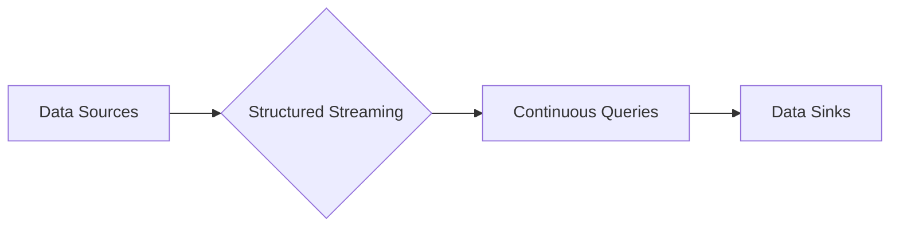

# Spark Structured Streaming原理与代码实例讲解

> 关键词：Spark, Structured Streaming, 流式处理, 实时计算, 高级抽象, 持续查询

## 1. 背景介绍

随着大数据和实时数据分析的需求不断增长，流式处理技术成为了数据工程师和分析师的重要工具。Apache Spark作为大数据处理领域的领先框架，其Structured Streaming组件提供了一个强大的实时数据处理平台。Structured Streaming允许开发者在Spark中处理实时数据流，并以一种类似批处理的方式进行处理。

### 1.1 问题的由来

传统的批处理系统在处理实时数据时存在以下问题：

- **延迟高**：批处理系统通常需要等待足够的数据累积后才能进行计算，导致响应延迟。
- **扩展性差**：批处理系统难以处理突发的高流量，容易造成系统崩溃。
- **数据一致性**：批处理系统难以保证处理数据的一致性，特别是在分布式系统中。

Structured Streaming的出现正是为了解决这些问题，它提供了一种更高效、更可靠的处理实时数据的方式。

### 1.2 研究现状

Structured Streaming自Spark 1.4版本引入以来，已经经历了多次迭代和优化。它基于Spark SQL的API，提供了一种高级抽象来处理无界数据流。Structured Streaming已经成为处理实时数据的重要工具，被广泛应用于金融、电商、物联网等场景。

### 1.3 研究意义

Structured Streaming的意义在于：

- **低延迟**：能够实时处理数据，降低数据处理延迟。
- **高吞吐量**：能够处理高流量的数据，保证系统稳定运行。
- **容错性**：提供容错机制，保证数据处理的一致性和可靠性。
- **易用性**：基于Spark SQL，易于开发和维护。

### 1.4 本文结构

本文将分为以下几个部分：

- 核心概念与联系
- 核心算法原理与具体操作步骤
- 数学模型和公式
- 项目实践：代码实例和详细解释说明
- 实际应用场景
- 工具和资源推荐
- 总结：未来发展趋势与挑战
- 附录：常见问题与解答

## 2. 核心概念与联系

### 2.1 核心概念

#### 数据流(Data Stream)

数据流是指一系列连续产生、不断更新的数据序列。在Structured Streaming中，数据流可以来自各种数据源，如Kafka、Flume、Twitter等。

#### 持续查询(Continuous Query)

持续查询是指对数据流进行持续监控和计算的过程。在Structured Streaming中，每个持续查询都由Spark SQL语句定义。

#### 数据源(Source)

数据源是指数据的来源，可以是文件、数据库、网络等。

#### 源(Sink)

源是指数据的去向，可以是文件、数据库、外部系统等。

### 2.2 架构图

以下是Structured Streaming的架构图：



### 2.3 联系

Structured Streaming通过持续查询对数据流进行处理，然后将结果输出到数据源。数据源可以是外部系统，如Kafka，也可以是文件系统。

## 3. 核心算法原理与具体操作步骤

### 3.1 算法原理概述

Structured Streaming的核心原理是将数据流视为一系列的批次(Batch)，然后对每个批次进行Spark SQL查询。通过这种方式，Structured Streaming能够以批处理的方式处理实时数据流。

### 3.2 算法步骤详解

1. **数据摄入**：从数据源摄入数据。
2. **批次处理**：将摄入的数据划分为批次。
3. **Spark SQL查询**：对每个批次执行Spark SQL查询。
4. **结果输出**：将查询结果输出到数据源。

### 3.3 算法优缺点

#### 优点：

- **易于使用**：基于Spark SQL，易于学习和使用。
- **高性能**：Spark的分布式计算能力。
- **容错性**：Spark的容错机制保证数据处理的可靠性。

#### 缺点：

- **学习曲线**：需要学习Spark和Spark SQL。
- **复杂性**：对于复杂的实时处理场景，可能需要设计复杂的Spark SQL查询。

### 3.4 算法应用领域

- **实时监控**：监控网站流量、服务器性能等。
- **实时分析**：分析社交媒体数据、股票市场数据等。
- **实时推荐**：根据用户行为进行实时推荐。
- **实时报告**：生成实时报告，如销售报告、天气报告等。

## 4. 数学模型和公式

Structured Streaming本身不涉及复杂的数学模型，但其核心的Spark SQL查询可能会涉及到一些数学概念，如窗口函数、聚合函数等。

### 4.1 数学模型构建

窗口函数是Structured Streaming中常用的数学模型之一，它将时间范围划分成窗口，并对每个窗口内的数据进行计算。以下是一个窗口函数的例子：

$$
\text{count\_window}(w, t) = \sum_{x \in w} t(x)
$$

其中，$w$ 是窗口，$t$ 是窗口内的函数，$x$ 是窗口内的元素。

### 4.2 公式推导过程

窗口函数的具体推导过程取决于窗口的类型和窗口内的计算方法。

### 4.3 案例分析与讲解

以下是一个使用窗口函数的例子：

```sql
SELECT 
  window_size, 
  count() as count
FROM 
  events
GROUP BY 
  window(size=1 minute, slide=1 minute)
```

这个查询将事件按照每分钟滑动窗口进行分组，并计算每个窗口中的事件数量。

## 5. 项目实践：代码实例和详细解释说明

### 5.1 开发环境搭建

1. 安装Java Development Kit (JDK)
2. 安装Apache Spark
3. 配置Spark环境变量

### 5.2 源代码详细实现

以下是一个简单的Structured Streaming示例：

```java
import org.apache.spark.sql.SparkSession;
import org.apache.spark.sql.functions.*;

public class StructuredStreamingExample {
    public static void main(String[] args) {
        SparkSession spark = SparkSession.builder()
            .appName("Structured Streaming Example")
            .getOrCreate();

        // 创建DataFrameReader
        DataFrameReader<String> reader = spark.read().text("data_source");

        // 创建DataFrame
        DataFrame df = reader.load();

        // 创建Structured Streaming流
        StreamingQuery query = df
            .groupBy(window(df.col("timestamp"), "1 minute", "1 minute"))
            .count()
            .writeStream()
            .outputMode("complete")
            .format("console")
            .start();

        query.awaitTermination();
    }
}
```

### 5.3 代码解读与分析

这段代码创建了一个SparkSession，并定义了一个DataFrameReader来读取数据源。然后，它创建了一个DataFrame，并对时间戳列进行窗口分组，计算每个窗口中的事件数量。最后，它使用Structured Streaming将结果输出到控制台。

### 5.4 运行结果展示

当运行上述代码时，你将看到每分钟的事件数量输出到控制台。

## 6. 实际应用场景

Structured Streaming在以下场景中非常有用：

- **实时监控**：监控网络流量、服务器性能等。
- **实时分析**：分析社交媒体数据、股票市场数据等。
- **实时推荐**：根据用户行为进行实时推荐。
- **实时报告**：生成实时报告，如销售报告、天气报告等。

## 7. 工具和资源推荐

### 7.1 学习资源推荐

- [Apache Spark官方文档](https://spark.apache.org/documentation/)
- [Spark SQL官方文档](https://spark.apache.org/docs/latest/sql/)
- [Structured Streaming官方文档](https://spark.apache.org/docs/latest/streaming/)
- [《Spark快速大数据处理》](https://book.douban.com/subject/25854268/)

### 7.2 开发工具推荐

- [IntelliJ IDEA](https://www.jetbrains.com/idea/)
- [Eclipse](https://www.eclipse.org/)
- [VS Code](https://code.visualstudio.com/)

### 7.3 相关论文推荐

- [Spark: A Unified Engine for Big Data Processing](https://www.usenix.org/conference/osdi14/technical-sessions/presentation/young)
- [Large-Scale Real-Time Computation of Aggregate and Oldest Queries over Data Streams](https://www.researchgate.net/publication/Large-Scale_Real-Time_Computation_of_Aggregate_and_Oldest_Queries_over_Data_Streams)

## 8. 总结：未来发展趋势与挑战

### 8.1 研究成果总结

Structured Streaming作为一种强大的实时数据处理工具，已经得到了广泛的应用。它结合了Spark的强大计算能力和Spark SQL的高效查询能力，为实时数据处理提供了新的可能性。

### 8.2 未来发展趋势

- **更丰富的API**：提供更丰富的API来支持更复杂的实时处理场景。
- **更好的性能**：优化性能，提高数据处理速度和吞吐量。
- **更简单的使用**：降低使用门槛，让更多开发者能够使用Structured Streaming。

### 8.3 面临的挑战

- **复杂性**：对于复杂的实时处理场景，设计合理的Spark SQL查询可能会比较困难。
- **性能优化**：随着数据量的增加，如何优化性能成为一个挑战。

### 8.4 研究展望

Structured Streaming将继续发展和完善，为实时数据处理提供更强大的功能和更优的性能。

## 9. 附录：常见问题与解答

**Q1：Structured Streaming与传统批处理相比有哪些优势？**

A：Structured Streaming相比传统批处理具有以下优势：

- **低延迟**：能够实时处理数据，降低数据处理延迟。
- **高吞吐量**：能够处理高流量的数据，保证系统稳定运行。
- **容错性**：提供容错机制，保证数据处理的一致性和可靠性。

**Q2：Structured Streaming的数据源有哪些？**

A：Structured Streaming支持多种数据源，如Kafka、Flume、Twitter、文件系统等。

**Q3：Structured Streaming如何处理数据不一致性？**

A：Structured Streaming使用Watermark机制来处理数据不一致性。Watermark是数据流中时间戳的延迟，它能够帮助Structured Streaming正确地处理乱序到达的数据。

**Q4：Structured Streaming的容错机制是什么？**

A：Structured Streaming的容错机制基于Spark的容错机制。当发生故障时，Structured Streaming会自动重试失败的查询，并确保数据处理的一致性和可靠性。

作者：禅与计算机程序设计艺术 / Zen and the Art of Computer Programming