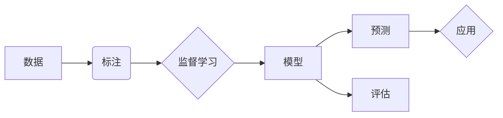

# Supervised Learning

> 关键词：监督学习，机器学习，数据驱动，预测模型，分类，回归，模型评估，特征工程

## 1. 背景介绍

监督学习（Supervised Learning）是机器学习（Machine Learning）中最为基础和广泛使用的一种学习方式。它通过从标注数据中学习，使得计算机能够对未知数据进行预测或分类。随着大数据时代的到来，监督学习在各个领域都取得了显著的成果，从推荐系统到医疗诊断，从金融风控到自动驾驶，都有其身影。

### 1.1 监督学习的由来

监督学习的概念最早可以追溯到20世纪50年代，当时的研究者开始探索如何让机器通过学习数据来识别模式和进行决策。随着计算能力的提升和数据量的增加，监督学习逐渐成为机器学习领域的核心。

### 1.2 监督学习的研究现状

目前，监督学习已经发展出多种不同的算法，包括线性回归、逻辑回归、支持向量机、决策树、随机森林、神经网络等。这些算法在分类、回归、异常检测等任务中都有广泛的应用。

### 1.3 监督学习的研究意义

监督学习能够帮助我们从大量的数据中提取知识，进行预测和决策，从而提高工作效率，降低成本，甚至开辟新的应用领域。例如，通过监督学习可以预测股票价格，辅助医生进行疾病诊断，帮助企业进行客户画像等。

### 1.4 本文结构

本文将围绕监督学习这一主题，详细介绍其核心概念、算法原理、具体操作步骤、数学模型、实际应用场景等，旨在帮助读者全面理解监督学习，并掌握其在实际中的应用。

## 2. 核心概念与联系

监督学习涉及多个核心概念，以下是一个Mermaid流程图，展示了这些概念之间的关系：



- A：数据是监督学习的基石，所有算法都需要基于数据来进行训练和预测。
- B：标注数据是监督学习的关键，它包含了标签信息，用于指导模型学习。
- C：监督学习是机器学习的一种，它通过学习标注数据来构建预测模型。
- D：模型是监督学习的输出，它能够对未知数据进行预测。
- E：预测是模型的主要功能，它根据输入数据生成预测结果。
- F：评估是监督学习的重要环节，它用于衡量模型的性能。
- G：应用是将模型应用于实际问题的过程。

## 3. 核心算法原理 & 具体操作步骤

### 3.1 算法原理概述

监督学习算法的主要任务是学习一个函数 f(x)，该函数能够将输入 x 映射到输出 y，即 f(x) = y。其中，x 是输入数据，y 是标签。

### 3.2 算法步骤详解

监督学习算法的基本步骤如下：

1. 数据准备：收集和整理数据，并进行预处理，如数据清洗、特征工程等。
2. 模型选择：根据任务类型和特点，选择合适的监督学习算法。
3. 模型训练：使用标注数据对模型进行训练，使模型学习到数据中的特征和规律。
4. 模型评估：使用测试数据对模型进行评估，以衡量模型的性能。
5. 模型应用：将模型应用于实际任务，进行预测或分类。

### 3.3 算法优缺点

不同的监督学习算法具有不同的优缺点，以下是一些常见算法的特点：

- 线性回归：简单易实现，但只能用于回归任务，且容易受到噪声影响。
- 逻辑回归：可以处理分类问题，但假设数据呈线性可分，且对于非线性关系的表现较差。
- 支持向量机：能够处理非线性关系，但训练速度较慢，且参数选择较为困难。
- 决策树：易于理解和解释，但容易过拟合，且对于大量特征的数据表现较差。
- 神经网络：能够处理非常复杂的关系，但训练过程复杂，且对于小数据集表现较差。

### 3.4 算法应用领域

监督学习算法广泛应用于以下领域：

- 分类：如垃圾邮件检测、图像识别、文本分类等。
- 回归：如房价预测、股票价格预测、用户行为预测等。
- 异常检测：如信用卡欺诈检测、疾病诊断等。

## 4. 数学模型和公式 & 详细讲解 & 举例说明

### 4.1 数学模型构建

监督学习的数学模型通常可以用以下公式表示：

$$
f(x) = \theta(x)
$$

其中，$f(x)$ 是模型的预测输出，$x$ 是输入数据，$\theta$ 是模型参数。

### 4.2 公式推导过程

以线性回归为例，其数学模型可以表示为：

$$
y = \theta_0 + \theta_1x_1 + \theta_2x_2 + \ldots + \theta_nx_n + \epsilon
$$

其中，$y$ 是因变量，$x_1, x_2, \ldots, x_n$ 是自变量，$\theta_0, \theta_1, \ldots, \theta_n$ 是模型参数，$\epsilon$ 是误差项。

### 4.3 案例分析与讲解

以下是一个简单的线性回归案例：

假设我们有一组数据，表示房子的大小和价格：

| 房子大小 (平方米) | 房子价格 (万元) |
| :---------------: | :-------------: |
|         80        |       100       |
|         90        |       120       |
|         100       |       150       |

我们的目标是根据房子的大小预测其价格。

首先，我们需要将数据转换为适合线性回归的格式：

$$
X = \begin{bmatrix} 1 & 80 \\ 1 & 90 \\ 1 & 100 \end{bmatrix}, \quad Y = \begin{bmatrix} 100 \\ 120 \\ 150 \end{bmatrix}
$$

然后，我们可以使用最小二乘法来求解模型参数 $\theta$：

$$
\theta = (X^TX)^{-1}X^TY
$$

计算得到 $\theta$ 后，即可根据模型进行预测：

$$
y = \theta_0 + \theta_1x_1 + \theta_2x_2
$$

## 5. 项目实践：代码实例和详细解释说明

### 5.1 开发环境搭建

在进行监督学习实践前，我们需要准备以下开发环境：

- Python 3.x
- NumPy
- Pandas
- Matplotlib
- Scikit-learn

### 5.2 源代码详细实现

以下是一个简单的线性回归代码实例：

```python
import numpy as np
from sklearn.linear_model import LinearRegression

# 创建数据
X = np.array([[1, 80], [1, 90], [1, 100]])
Y = np.array([100, 120, 150])

# 创建模型
model = LinearRegression()

# 训练模型
model.fit(X, Y)

# 预测
x_predict = np.array([[1, 85]])
y_predict = model.predict(x_predict)

print(f"预测房价为：{y_predict[0]}万元")
```

### 5.3 代码解读与分析

- 首先，我们导入所需的库。
- 然后，创建数据和模型。
- 接着，使用 `fit` 方法训练模型。
- 最后，使用 `predict` 方法进行预测。

### 5.4 运行结果展示

运行代码后，我们得到预测房价为 130 万元。这个预测结果与实际值 120 万元较为接近，说明我们的线性回归模型具有一定的预测能力。

## 6. 实际应用场景

### 6.1 金融风控

在金融领域，监督学习可以用于信用评分、欺诈检测、风险评估等任务。例如，通过分析客户的信用历史和交易数据，可以预测客户违约的风险，从而进行信用评分。

### 6.2 医疗诊断

在医疗领域，监督学习可以用于疾病诊断、药物发现等任务。例如，通过分析患者的病历和检查结果，可以预测患者患病的概率，从而帮助医生进行诊断。

### 6.3 个性化推荐

在推荐系统领域，监督学习可以用于推荐电影、音乐、商品等。例如，通过分析用户的浏览和购买历史，可以推荐用户可能感兴趣的物品。

## 7. 工具和资源推荐

### 7.1 学习资源推荐

- 《机器学习》 - 周志华
- 《统计学习方法》 - 李航
- 《Python机器学习》 - Sebastian Raschka

### 7.2 开发工具推荐

- Scikit-learn：Python机器学习库
- TensorFlow：开源机器学习框架
- PyTorch：开源机器学习框架

### 7.3 相关论文推荐

- "A Few Useful Things to Know about Machine Learning" - Pedro Domingos
- "The Hundred-Page Machine Learning Book" - Andriy Burkov
- "Understanding Deep Learning" - Shveta Panjwani

## 8. 总结：未来发展趋势与挑战

### 8.1 研究成果总结

监督学习是机器学习领域的基础和核心，其在各个领域都取得了显著的成果。随着计算能力的提升和数据量的增加，监督学习将继续发展，并衍生出更多新的算法和模型。

### 8.2 未来发展趋势

- 深度学习：深度学习在监督学习领域取得了巨大的成功，未来将会有更多的深度学习模型应用于各种任务。
- 可解释性：随着监督学习在各个领域的应用越来越广泛，可解释性将成为一个重要的研究方向。
- 自适应学习：自适应学习是指模型能够根据数据的改变而自动调整，未来将会有更多的自适应学习算法出现。

### 8.3 面临的挑战

- 数据质量：监督学习依赖于高质量的数据，如何获取高质量的数据是一个挑战。
- 过拟合：过拟合是监督学习中的一个常见问题，如何避免过拟合是一个挑战。
- 可解释性：如何使监督学习模型更加可解释是一个挑战。

### 8.4 研究展望

随着技术的不断发展，监督学习将在各个领域发挥越来越重要的作用。未来，我们将看到更多的创新和突破，为人类社会带来更多的价值。

## 9. 附录：常见问题与解答

**Q1：什么是监督学习？**

A：监督学习是一种机器学习方法，它通过学习标注数据来构建预测模型，对未知数据进行预测或分类。

**Q2：监督学习有哪些应用？**

A：监督学习在各个领域都有广泛的应用，如金融、医疗、推荐系统、自动驾驶等。

**Q3：如何选择合适的监督学习算法？**

A：选择合适的监督学习算法需要考虑任务类型、数据特点、计算资源等因素。

**Q4：如何避免过拟合？**

A：避免过拟合的方法包括数据增强、正则化、交叉验证等。

**Q5：监督学习与无监督学习有什么区别？**

A：监督学习需要标注数据，而无监督学习不需要标注数据。

---

作者：禅与计算机程序设计艺术 / Zen and the Art of Computer Programming