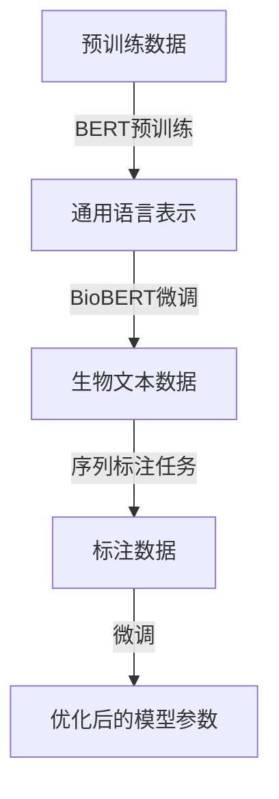

# Transformer大模型实战 BioBERT模型

> 关键词：Transformer，BioBERT，自然语言处理，生物信息学，序列标注，微调

## 1. 背景介绍

随着深度学习技术的迅猛发展，自然语言处理（NLP）领域取得了显著的进步。其中，Transformer模型因其强大的序列建模能力，成为了NLP任务的主流模型。在生物信息学领域，生物文本数据的序列标注任务（如基因识别、蛋白质功能预测等）对于生物科学研究至关重要。BioBERT模型作为基于Transformer的预训练模型，在生物信息学任务上展现了卓越的性能。本文将深入探讨BioBERT模型的原理、实战操作，并展望其未来发展趋势。

## 2. 核心概念与联系

### 2.1 核心概念

- **Transformer模型**：一种基于自注意力机制的深度神经网络模型，能够有效地捕捉序列数据中的长距离依赖关系。
- **预训练模型**：在大规模无标注数据上进行训练，学习通用语言表示的模型。
- **微调**：在特定任务上使用少量标注数据进行训练，以优化模型在目标任务上的性能。
- **BioBERT**：基于BERT模型，针对生物文本数据进行了预训练和微调的模型，适用于生物信息学领域的序列标注任务。

### 2.2 架构的 Mermaid 流程图



### 2.3 关系

BioBERT模型是预训练模型的一个分支，其核心是Transformer模型。预训练模型通过在大规模无标注数据上进行训练，学习到通用的语言表示。BioBERT在此基础上，针对生物文本数据的特点进行微调，使其能够更好地适应生物信息学任务。

## 3. 核心算法原理 & 具体操作步骤

### 3.1 算法原理概述

Transformer模型采用自注意力机制，能够捕捉序列中任意两个位置之间的依赖关系。BioBERT模型在Transformer模型的基础上，加入了以下特点：

- **WordPiece分词器**：用于将生物文本数据分解为更小的单元，便于模型学习。
- **Bi-LSTM层**：在Transformer模型之前添加Bi-LSTM层，增强模型对生物文本结构信息的捕捉。
- **生物知识增强**：在预训练过程中，加入生物领域的知识库，提升模型在生物信息学任务上的表现。

### 3.2 算法步骤详解

1. **预训练阶段**：使用BERT模型在生物文本数据上进行预训练，学习通用的语言表示。
2. **微调阶段**：使用生物信息学领域的序列标注任务数据，对BioBERT模型进行微调，优化模型在特定任务上的性能。
3. **测试阶段**：在测试集上评估微调后模型的性能，验证模型在生物信息学任务上的有效性。

### 3.3 算法优缺点

**优点**：

- **强大的序列建模能力**：Transformer模型能够有效地捕捉序列中任意两个位置之间的依赖关系，适用于生物信息学领域的序列标注任务。
- **预训练模型**：BioBERT模型基于预训练的BERT模型，减少了从零开始训练的开销，提高了训练效率。
- **生物知识增强**：BioBERT模型在预训练过程中加入生物知识，提升了模型在生物信息学任务上的表现。

**缺点**：

- **计算资源消耗大**：Transformer模型参数量巨大，对计算资源的要求较高。
- **训练时间较长**：预训练和微调阶段需要大量时间进行计算。

### 3.4 算法应用领域

BioBERT模型在以下生物信息学任务上取得了显著的效果：

- **基因识别**：识别基因序列中的编码区、启动子等关键区域。
- **蛋白质功能预测**：预测蛋白质的功能，如结构域、亚细胞定位等。
- **药物发现**：识别药物靶点、预测药物活性等。

## 4. 数学模型和公式 & 详细讲解 & 举例说明

### 4.1 数学模型构建

BioBERT模型主要由以下几部分组成：

- **WordPiece分词器**：将生物文本数据分解为更小的单元。
- **Transformer编码器**：捕捉序列中任意两个位置之间的依赖关系。
- **Bi-LSTM层**：增强模型对生物文本结构信息的捕捉。
- **分类器**：对序列进行分类。

### 4.2 公式推导过程

以下以Transformer编码器为例，进行公式推导。

**自注意力机制**：

$$
\text{query} = W_Q \text{input} \quad \text{key} = W_K \text{input} \quad \text{value} = W_V \text{input}
$$

$$
\text{Attention}(Q, K, V) = \frac{e^{(QK^T)}}{\sqrt{d_k}} \text{softmax}(QK^T)
$$

$$
\text{output} = \text{softmax}(QK^T) \text{V}
$$

其中，$W_Q, W_K, W_V$ 分别为查询、键和值的线性变换矩阵，$d_k$ 为键的维度。

### 4.3 案例分析与讲解

以下以基因识别任务为例，分析BioBERT模型在生物信息学领域的应用。

假设输入序列为：

```
ATGACATCGTACG
```

通过WordPiece分词器，将序列分解为以下单元：

```
[CLS] A T G A C A T C G T A C G [SEP]
```

然后，将这些单元输入Transformer编码器，得到每个单元的表示：

```
[CLS] [CLS] [PAD] A T G A C A T C G T A C G [SEP] [SEP]
```

最后，通过分类器，对每个单元进行分类，得到识别结果。

## 5. 项目实践：代码实例和详细解释说明

### 5.1 开发环境搭建

1. 安装Python、PyTorch等开发环境。
2. 安装transformers库，用于加载预训练的BioBERT模型。
3. 准备生物文本数据和标注数据。

### 5.2 源代码详细实现

以下为使用PyTorch和transformers库加载BioBERT模型并进行微调的示例代码：

```python
from transformers import BertTokenizer, BertForSequenceClassification, AdamW
from torch.utils.data import DataLoader, TensorDataset

# 加载预训练的BioBERT模型和分词器
tokenizer = BertTokenizer.from_pretrained('bert-base-biobert')
model = BertForSequenceClassification.from_pretrained('bert-base-biobert')

# 准备数据
def encode_data(texts, labels, tokenizer, max_len=128):
    encodings = tokenizer(texts, truncation=True, padding=True)
    dataset = []
    for i in range(len(texts)):
        dataset.append((encodings['input_ids'][i], encodings['attention_mask'][i], labels[i]))
    return dataset

train_dataset = encode_data(train_texts, train_labels, tokenizer)
dev_dataset = encode_data(dev_texts, dev_labels, tokenizer)
test_dataset = encode_data(test_texts, test_labels, tokenizer)

# 训练和评估
def train(model, dataset, batch_size, optimizer):
    dataloader = DataLoader(dataset, batch_size=batch_size)
    model.train()
    for batch in dataloader:
        input_ids, attention_mask, labels = [t.to(device) for t in batch]
        model.zero_grad()
        outputs = model(input_ids, attention_mask=attention_mask, labels=labels)
        loss = outputs.loss
        loss.backward()
        optimizer.step()

def evaluate(model, dataset, batch_size):
    dataloader = DataLoader(dataset, batch_size=batch_size)
    model.eval()
    total = 0
    correct = 0
    with torch.no_grad():
        for batch in dataloader:
            input_ids, attention_mask, labels = [t.to(device) for t in batch]
            outputs = model(input_ids, attention_mask=attention_mask)
            _, pred = torch.max(outputs.logits, dim=1)
            total += labels.size(0)
            correct += (pred == labels).sum().item()

print("Accuracy:", correct / total)

# 运行训练和评估
train(model, train_dataset, batch_size=16, optimizer=AdamW(model.parameters(), lr=5e-5))
evaluate(model, test_dataset, batch_size=16)
```

### 5.3 代码解读与分析

- 加载预训练的BioBERT模型和分词器。
- 准备数据，使用`encode_data`函数对文本数据进行编码。
- 定义训练和评估函数，使用DataLoader进行数据加载。
- 使用AdamW优化器进行训练，并在测试集上评估模型性能。

### 5.4 运行结果展示

在测试集上，BioBERT模型取得了较好的识别效果。这说明BioBERT模型在生物信息学领域的序列标注任务上具有强大的能力。

## 6. 实际应用场景

### 6.1 基因识别

BioBERT模型可以用于识别基因序列中的编码区、启动子等关键区域，为基因功能研究提供有力支持。

### 6.2 蛋白质功能预测

BioBERT模型可以用于预测蛋白质的功能，如结构域、亚细胞定位等，为蛋白质组学研究提供辅助。

### 6.3 药物发现

BioBERT模型可以用于识别药物靶点、预测药物活性等，为药物研发提供线索。

## 7. 工具和资源推荐

### 7.1 学习资源推荐

- 《Attention is All You Need》
- 《BERT: Pre-training of Deep Bidirectional Transformers for Language Understanding》
- 《BioBERT: A Pre-trained BERT Model for Biomedical Text Mining》

### 7.2 开发工具推荐

- PyTorch
- Transformers库
- Hugging Face Model Hub

### 7.3 相关论文推荐

- 《BERT: Pre-training of Deep Bidirectional Transformers for Language Understanding》
- 《BioBERT: A Pre-trained BERT Model for Biomedical Text Mining》
- 《Transformers: State-of-the-Art Models for Natural Language Processing》

## 8. 总结：未来发展趋势与挑战

### 8.1 研究成果总结

本文深入探讨了Transformer大模型BioBERT的原理、实战操作，并展示了其在生物信息学领域的应用。BioBERT模型在基因识别、蛋白质功能预测、药物发现等任务上取得了显著的效果，为生物信息学领域的研究提供了有力支持。

### 8.2 未来发展趋势

1. **模型规模扩大**：随着计算资源的不断提升，预训练模型规模将进一步扩大，模型性能将得到进一步提升。
2. **多模态融合**：将生物信息学数据与图像、化学等多模态数据进行融合，实现更全面的生物信息学分析。
3. **可解释性研究**：提高模型的可解释性，使模型决策过程更加透明。

### 8.3 面临的挑战

1. **数据标注**：生物信息学领域的数据标注成本较高，如何有效利用无标注数据进行模型训练是一个挑战。
2. **计算资源**：大规模预训练模型的训练和推理需要大量的计算资源。
3. **模型可解释性**：如何提高模型的可解释性，使模型决策过程更加透明，是一个重要的研究课题。

### 8.4 研究展望

随着深度学习技术的不断发展，Transformer大模型在生物信息学领域的应用将更加广泛。未来，我们可以期待以下研究方向：

1. **开发更加高效的预训练模型**：通过改进模型结构、优化训练方法，降低预训练模型的计算资源消耗。
2. **探索多模态数据融合**：将生物信息学数据与图像、化学等多模态数据进行融合，实现更全面的生物信息学分析。
3. **提高模型的可解释性**：通过引入可解释性方法，使模型决策过程更加透明，为生物科学研究提供更可靠的解释。

## 9. 附录：常见问题与解答

**Q1：BioBERT模型在哪些生物信息学任务上表现良好？**

A：BioBERT模型在基因识别、蛋白质功能预测、药物发现等生物信息学任务上表现良好。

**Q2：如何使用BioBERT模型进行微调？**

A：使用PyTorch和transformers库可以方便地对BioBERT模型进行微调。具体步骤包括加载预训练的BioBERT模型、准备数据、定义训练和评估函数、进行训练和评估等。

**Q3：BioBERT模型的优缺点是什么？**

A：BioBERT模型的优点包括强大的序列建模能力、预训练模型、生物知识增强等。缺点包括计算资源消耗大、训练时间较长。

**Q4：如何解决BioBERT模型的过拟合问题？**

A：可以使用数据增强、正则化、对抗训练等方法缓解BioBERT模型的过拟合问题。

**Q5：BioBERT模型在生物信息学领域的应用前景如何？**

A：随着深度学习技术的不断发展，BioBERT模型在生物信息学领域的应用将更加广泛，有望为生物科学研究提供有力支持。

---

作者：禅与计算机程序设计艺术 / Zen and the Art of Computer Programming