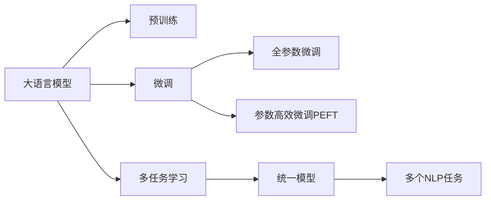
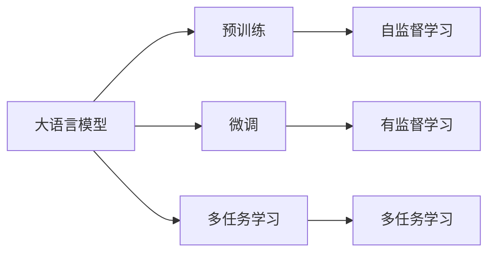
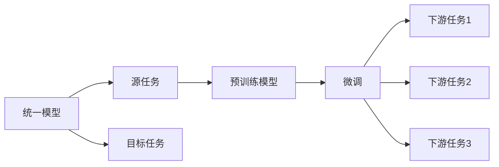
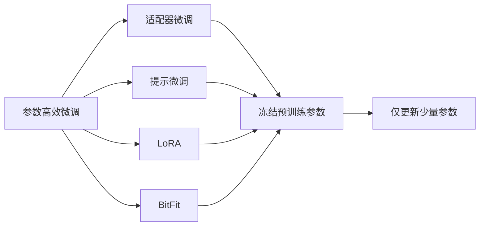
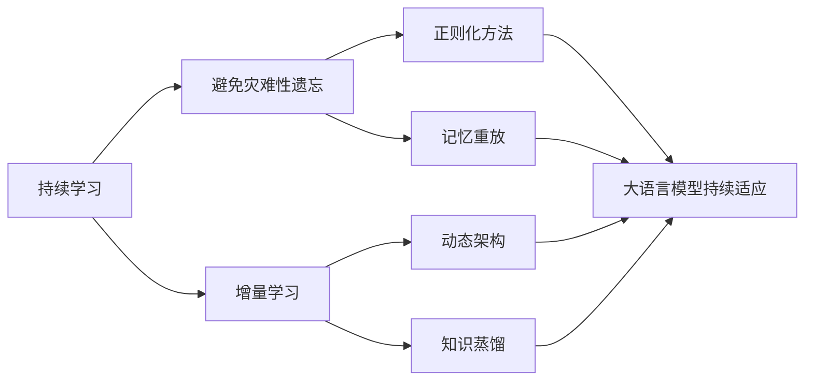
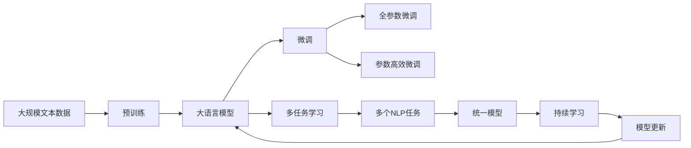

                 

# 大语言模型应用指南：统一自然语言任务

> 关键词：大语言模型,自然语言处理,NLP,预训练,微调,Fine-Tuning,统一模型,多任务学习

## 1. 背景介绍

### 1.1 问题由来

自然语言处理（NLP）是人工智能研究的重要分支之一，旨在使计算机能够理解、处理和生成人类语言。然而，传统的NLP任务如文本分类、命名实体识别、机器翻译、问答系统等，往往是孤立的，每种任务都需要构建专门的模型和训练数据，导致模型数量众多、开发成本高昂、模型维护困难。

近年来，随着深度学习和大规模预训练模型的发展，一种新的NLP技术范式——统一自然语言处理（Unified Natural Language Processing，简称UNLP）应运而生。UNLP的核心思想是：将多种NLP任务统一在一个模型中，通过微调或参数高效微调（PEFT）的方式，使模型在不同任务上均具备优秀表现。这不仅减少了模型数量，降低了开发成本，也提升了模型的泛化能力和应用效率。

### 1.2 问题核心关键点

UNLP的关键在于：

- 选择合适的预训练模型。例如，BERT、GPT等大规模预训练语言模型，具有强大的语义理解和生成能力。
- 设计合适的微调策略。如何在小规模数据集上，通过微调或参数高效微调，提升模型在不同任务上的性能。
- 应用多任务学习技术。使模型在多个相关任务上同时学习，从而提升模型的泛化能力和适应性。

### 1.3 问题研究意义

UNLP对于提升NLP技术的效率和效果，具有重要意义：

- 减少模型数量。通过统一模型，避免重复构建模型，减少模型管理难度。
- 提升模型泛化能力。模型在多个任务上同时学习，可以提升泛化能力和跨领域迁移能力。
- 降低开发成本。减少了模型数量和数据准备的工作量，加快NLP技术的应用速度。
- 促进NLP技术标准化。UNLP为NLP技术的标准化和产业化提供了新的方向。

## 2. 核心概念与联系

### 2.1 核心概念概述

为了更好地理解UNLP的原理和架构，本节将介绍几个密切相关的核心概念：

- 大语言模型（Large Language Model，LLM）：以自回归（如GPT）或自编码（如BERT）模型为代表的大规模预训练语言模型。通过在大规模无标签文本数据上进行预训练，学习通用的语言表示，具备强大的语言理解和生成能力。

- 预训练（Pre-training）：指在大规模无标签文本数据上，通过自监督学习任务训练通用语言模型的过程。常见的预训练任务包括言语建模、掩码语言模型等。预训练使得模型学习到语言的通用表示。

- 微调（Fine-tuning）：指在预训练模型的基础上，使用下游任务的少量标注数据，通过有监督学习优化模型在该任务上的性能。通常只需调整顶层分类器或解码器，并以较小的学习率更新全部或部分的模型参数。

- 多任务学习（Multi-task Learning，MTL）：指在多个相关任务上同时训练一个模型，通过共享知识，提升模型在不同任务上的泛化能力。

- 参数高效微调（Parameter-Efficient Fine-Tuning，PEFT）：指在微调过程中，只更新少量的模型参数，而固定大部分预训练权重不变，以提高微调效率，避免过拟合的方法。

- 统一模型（Unified Model）：指能够同时处理多种NLP任务的模型，通过参数共享和任务适配层的设计，使模型在多个任务上具备优秀表现。

这些核心概念之间的逻辑关系可以通过以下Mermaid流程图来展示：



这个流程图展示了大语言模型的核心概念及其之间的关系：

1. 大语言模型通过预训练获得基础能力。
2. 微调是对预训练模型进行任务特定的优化，可以分为全参数微调和参数高效微调（PEFT）。
3. 多任务学习是连接预训练模型与多个相关任务的基础。
4. 统一模型将多种任务统一到一个模型中，通过共享知识，提升模型的泛化能力和适应性。

这些概念共同构成了UNLP的核心架构，使其能够在各种场景下发挥强大的语言理解和生成能力。通过理解这些核心概念，我们可以更好地把握UNLP的工作原理和优化方向。

### 2.2 概念间的关系

这些核心概念之间存在着紧密的联系，形成了UNLP的完整生态系统。下面我通过几个Mermaid流程图来展示这些概念之间的关系。

#### 2.2.1 大语言模型的学习范式



这个流程图展示了大语言模型的三种主要学习范式：预训练、微调和多任务学习。预训练主要采用自监督学习方法，而微调和多任务学习则是有监督学习的过程。多任务学习是预训练模型与多个相关任务的桥梁，可以通过微调或多任务学习来实现。

#### 2.2.2 统一模型与微调的关系



这个流程图展示了统一模型与微调的基本原理，以及它与下游任务的关系。统一模型可以在预训练模型上进行微调，从而适应多个下游任务。

#### 2.2.3 参数高效微调方法



这个流程图展示了几种常见的参数高效微调方法，包括适配器微调、提示微调、LoRA和BitFit。这些方法的共同特点是冻结大部分预训练参数，只更新少量参数，从而提高微调效率。

#### 2.2.4 持续学习在大语言模型中的应用



这个流程图展示了持续学习在大语言模型中的应用。持续学习的主要目标是避免灾难性遗忘和实现增量学习。通过正则化方法、记忆重放、动态架构和知识蒸馏等技术，可以使大语言模型持续适应新的任务和数据。

### 2.3 核心概念的整体架构

最后，我们用一个综合的流程图来展示这些核心概念在大语言模型微调过程中的整体架构：



这个综合流程图展示了从预训练到微调，再到持续学习的完整过程。大语言模型首先在大规模文本数据上进行预训练，然后通过微调（包括全参数微调和参数高效微调）或多任务学习，适应多个下游任务。最后，通过持续学习技术，模型可以不断更新和适应新的任务和数据。 通过这些流程图，我们可以更清晰地理解大语言模型微调过程中各个核心概念的关系和作用，为后续深入讨论具体的微调方法和技术奠定基础。

## 3. 核心算法原理 & 具体操作步骤
### 3.1 算法原理概述

UNLP的核心算法原理基于多任务学习，通过预训练和微调，使模型在不同任务上同时学习，提升泛化能力和适应性。

假设我们有两个任务：任务1和任务2，它们的数据集分别为 $D_1=\{(x_i^1,y_i^1)\}_{i=1}^N$ 和 $D_2=\{(x_i^2,y_i^2)\}_{i=1}^N$，其中 $x_i^j \in \mathcal{X}$，$y_i^j \in \mathcal{Y}$。

我们定义两个任务的损失函数分别为 $\ell_1$ 和 $\ell_2$，则经验风险为：

$$
\mathcal{L} = \frac{1}{N_1} \sum_{i=1}^{N_1} \ell_1(M_{\theta}(x_i^1),y_i^1) + \frac{1}{N_2} \sum_{i=1}^{N_2} \ell_2(M_{\theta}(x_i^2),y_i^2)
$$

其中，$M_{\theta}$ 为预训练后的模型，$\theta$ 为模型参数。通过梯度下降等优化算法，最小化经验风险，使得模型在两个任务上均能取得优秀的性能。

### 3.2 算法步骤详解

UNLP的实现步骤包括以下几个关键点：

**Step 1: 准备预训练模型和数据集**

- 选择合适的预训练语言模型 $M_{\theta}$ 作为初始化参数，如 BERT、GPT 等。
- 准备两个或多个下游任务的标注数据集 $D=\{(x_i^j,y_i^j)\}_{i=1}^N$，划分为训练集、验证集和测试集。一般要求标注数据与预训练数据的分布不要差异过大。

**Step 2: 设计任务适配层**

- 根据任务类型，在预训练模型顶层设计合适的输出层和损失函数。
- 对于分类任务，通常在顶层添加线性分类器和交叉熵损失函数。
- 对于生成任务，通常使用语言模型的解码器输出概率分布，并以负对数似然为损失函数。

**Step 3: 设置微调超参数**

- 选择合适的优化算法及其参数，如 AdamW、SGD 等，设置学习率、批大小、迭代轮数等。
- 设置正则化技术及强度，包括权重衰减、Dropout、Early Stopping 等。
- 确定冻结预训练参数的策略，如仅微调顶层，或全部参数都参与微调。

**Step 4: 执行梯度训练**

- 将训练集数据分批次输入模型，前向传播计算损失函数。
- 反向传播计算参数梯度，根据设定的优化算法和学习率更新模型参数。
- 周期性在验证集上评估模型性能，根据性能指标决定是否触发 Early Stopping。
- 重复上述步骤直到满足预设的迭代轮数或 Early Stopping 条件。

**Step 5: 测试和部署**

- 在测试集上评估微调后模型 $M_{\hat{\theta}}$ 的性能，对比微调前后的精度提升。
- 使用微调后的模型对新样本进行推理预测，集成到实际的应用系统中。
- 持续收集新的数据，定期重新微调模型，以适应数据分布的变化。

以上是UNLP的基本实现步骤。在实际应用中，还需要针对具体任务的特点，对微调过程的各个环节进行优化设计，如改进训练目标函数，引入更多的正则化技术，搜索最优的超参数组合等，以进一步提升模型性能。

### 3.3 算法优缺点

UNLP具有以下优点：

1. 减少模型数量。通过统一模型，避免重复构建模型，减少模型管理难度。
2. 提升模型泛化能力。模型在多个任务上同时学习，可以提升泛化能力和跨领域迁移能力。
3. 降低开发成本。减少了模型数量和数据准备的工作量，加快NLP技术的应用速度。
4. 促进NLP技术标准化。UNLP为NLP技术的标准化和产业化提供了新的方向。

同时，该方法也存在一定的局限性：

1. 依赖标注数据。微调的效果很大程度上取决于标注数据的质量和数量，获取高质量标注数据的成本较高。
2. 迁移能力有限。当目标任务与预训练数据的分布差异较大时，微调的性能提升有限。
3. 可解释性不足。微调模型的决策过程通常缺乏可解释性，难以对其推理逻辑进行分析和调试。

尽管存在这些局限性，但就目前而言，UNLP是NLP领域的重要范式，其优势在于能够显著减少模型数量，提升模型性能，降低开发成本，推动NLP技术的规模化应用。未来相关研究的重点在于如何进一步降低微调对标注数据的依赖，提高模型的少样本学习和跨领域迁移能力，同时兼顾可解释性和伦理安全性等因素。

### 3.4 算法应用领域

UNLP在NLP领域已经得到了广泛的应用，覆盖了几乎所有常见任务，例如：

- 文本分类：如情感分析、主题分类、意图识别等。通过微调使模型学习文本-标签映射。
- 命名实体识别：识别文本中的人名、地名、机构名等特定实体。通过微调使模型掌握实体边界和类型。
- 关系抽取：从文本中抽取实体之间的语义关系。通过微调使模型学习实体-关系三元组。
- 问答系统：对自然语言问题给出答案。将问题-答案对作为微调数据，训练模型学习匹配答案。
- 机器翻译：将源语言文本翻译成目标语言。通过微调使模型学习语言-语言映射。
- 文本摘要：将长文本压缩成简短摘要。将文章-摘要对作为微调数据，使模型学习抓取要点。
- 对话系统：使机器能够与人自然对话。将多轮对话历史作为上下文，微调模型进行回复生成。

除了上述这些经典任务外，UNLP也被创新性地应用到更多场景中，如可控文本生成、常识推理、代码生成、数据增强等，为NLP技术带来了全新的突破。随着预训练模型和微调方法的不断进步，相信NLP技术将在更广阔的应用领域大放异彩。

## 4. 数学模型和公式 & 详细讲解  
### 4.1 数学模型构建

本节将使用数学语言对UNLP的微调过程进行更加严格的刻画。

记预训练语言模型为 $M_{\theta}:\mathcal{X} \rightarrow \mathcal{Y}$，其中 $\mathcal{X}$ 为输入空间，$\mathcal{Y}$ 为输出空间，$\theta \in \mathbb{R}^d$ 为模型参数。假设微调任务的训练集为 $D=\{(x_i^j,y_i^j)\}_{i=1}^N, x_i^j \in \mathcal{X}, y_i^j \in \mathcal{Y}$。

定义模型 $M_{\theta}$ 在数据样本 $(x,y)$ 上的损失函数为 $\ell(M_{\theta}(x),y)$，则在数据集 $D$ 上的经验风险为：

$$
\mathcal{L} = \frac{1}{N_1} \sum_{i=1}^{N_1} \ell_1(M_{\theta}(x_i^1),y_i^1) + \frac{1}{N_2} \sum_{i=1}^{N_2} \ell_2(M_{\theta}(x_i^2),y_i^2)
$$

其中，$\ell_1$ 和 $\ell_2$ 分别为任务1和任务2的损失函数。

微调的优化目标是最小化经验风险，即找到最优参数：

$$
\theta^* = \mathop{\arg\min}_{\theta} \mathcal{L}
$$

在实践中，我们通常使用基于梯度的优化算法（如SGD、Adam等）来近似求解上述最优化问题。设 $\eta$ 为学习率，$\lambda$ 为正则化系数，则参数的更新公式为：

$$
\theta \leftarrow \theta - \eta \nabla_{\theta}\mathcal{L} - \eta\lambda\theta
$$

其中 $\nabla_{\theta}\mathcal{L}$ 为损失函数对参数 $\theta$ 的梯度，可通过反向传播算法高效计算。

### 4.2 公式推导过程

以下我们以二分类任务为例，推导交叉熵损失函数及其梯度的计算公式。

假设模型 $M_{\theta}$ 在输入 $x$ 上的输出为 $\hat{y}=M_{\theta}(x) \in [0,1]$，表示样本属于正类的概率。真实标签 $y \in \{0,1\}$。则二分类交叉熵损失函数定义为：

$$
\ell(M_{\theta}(x),y) = -[y\log \hat{y} + (1-y)\log (1-\hat{y})]
$$

将其代入经验风险公式，得：

$$
\mathcal{L} = -\frac{1}{N_1}\sum_{i=1}^{N_1} [y_i^1\log M_{\theta}(x_i^1)+(1-y_i^1)\log(1-M_{\theta}(x_i^1))] - \frac{1}{N_2}\sum_{i=1}^{N_2} [y_i^2\log M_{\theta}(x_i^2)+(1-y_i^2)\log(1-M_{\theta}(x_i^2))]
$$

根据链式法则，损失函数对参数 $\theta_k$ 的梯度为：

$$
\frac{\partial \mathcal{L}}{\partial \theta_k} = -\frac{1}{N_1}\sum_{i=1}^{N_1} (\frac{y_i^1}{M_{\theta}(x_i^1)}-\frac{1-y_i^1}{1-M_{\theta}(x_i^1)}) \frac{\partial M_{\theta}(x_i^1)}{\partial \theta_k} - \frac{1}{N_2}\sum_{i=1}^{N_2} (\frac{y_i^2}{M_{\theta}(x_i^2)}-\frac{1-y_i^2}{1-M_{\theta}(x_i^2)}) \frac{\partial M_{\theta}(x_i^2)}{\partial \theta_k}
$$

其中 $\frac{\partial M_{\theta}(x_i^j)}{\partial \theta_k}$ 可进一步递归展开，利用自动微分技术完成计算。

在得到损失函数的梯度后，即可带入参数更新公式，完成模型的迭代优化。重复上述过程直至收敛，最终得到适应下游任务的最优模型参数 $\theta^*$。

## 5. 项目实践：代码实例和详细解释说明
### 5.1 开发环境搭建

在进行UNLP实践前，我们需要准备好开发环境。以下是使用Python进行PyTorch开发的环境配置流程：

1. 安装Anaconda：从官网下载并安装Anaconda，用于创建独立的Python环境。

2. 创建并激活虚拟环境：
```bash
conda create -n pytorch-env python=3.8 
conda activate pytorch-env
```

3. 安装PyTorch：根据CUDA版本，从官网获取对应的安装命令。例如：
```bash
conda install pytorch torchvision torchaudio cudatoolkit=11.1 -c pytorch -c conda-forge
```

4. 安装Transformers库：
```bash
pip install transformers
```

5. 安装各类工具包：
```bash
pip install numpy pandas scikit-learn matplotlib tqdm jupyter notebook ipython
```

完成上述步骤后，即可在`pytorch-env`环境中开始UNLP实践。

### 5.2 源代码详细实现

下面我以命名实体识别(NER)任务为例，给出使用Transformers库对BERT模型进行UNLP的PyTorch代码实现。

首先，定义NER任务的数据处理函数：

```python
from transformers import BertTokenizer
from torch.utils.data import Dataset
import torch

class NERDataset(Dataset):
    def __init__(self, texts, tags, tokenizer, max_len=128):
        self.texts = texts
        self.tags = tags
        self.tokenizer = tokenizer
        self.max_len = max_len
        
    def __len__(self):
        return len(self.texts)
    
    def __getitem__(self, item):
        text = self.texts[item]
        tags = self.tags[item]
        
        encoding = self.tokenizer(text, return_tensors='pt', max_length=self.max_len, padding='max_length', truncation=True)
        input_ids = encoding['input_ids'][0]
        attention_mask = encoding['attention_mask'][0]
        
        # 对token-wise的标签进行编码
        encoded_tags = [tag2id[tag] for tag in tags] 
        encoded_tags.extend([tag2id['O']] * (self.max_len - len(encoded_tags)))
        labels = torch.tensor(encoded_tags, dtype=torch.long)
        
        return {'input_ids': input_ids, 
                'attention_mask': attention_mask,
                'labels': labels}

# 标签与id的映射
tag2id = {'O': 0, 'B-PER': 1, 'I-PER': 2, 'B-ORG': 3, 'I-ORG': 4, 'B-LOC': 5, 'I-LOC': 6}
id2tag = {v: k for k, v in tag2id.items()}

# 创建dataset
tokenizer = BertTokenizer.from_pretrained('bert-base-cased')

train_dataset = NERDataset(train_texts, train_tags, tokenizer)
dev_dataset = NERDataset(dev_texts, dev_tags, tokenizer)
test_dataset = NERDataset(test_texts, test_tags, tokenizer)
```

然后，定义模型和优化器：

```python
from transformers import BertForTokenClassification, AdamW

model = BertForTokenClassification.from_pretrained('bert-base-cased', num_labels=len(tag2id))

optimizer = AdamW(model.parameters(), lr=2e-5)
```

接着，定义训练和评估函数：

```python
from torch.utils.data import DataLoader
from tqdm import tqdm
from sklearn.metrics import classification_report

device = torch.device('cuda') if torch.cuda.is_available() else torch.device('cpu')
model.to(device)

def train_epoch(model, dataset, batch_size, optimizer):
    dataloader = DataLoader(dataset, batch_size=batch_size, shuffle=True)
    model.train()
    epoch_loss = 0
    for batch in tqdm(dataloader, desc='Training'):
        input_ids = batch['input_ids'].to(device)
        attention_mask = batch['attention_mask'].to(device)
        labels = batch['labels'].to(device)
        model.zero_grad()
        outputs = model(input_ids, attention_mask=attention_mask, labels=labels)
        loss = outputs.loss
        epoch_loss += loss.item()
        loss.backward()
        optimizer.step()
    return epoch_loss / len(dataloader)

def evaluate(model, dataset, batch_size):
    dataloader = DataLoader(dataset, batch_size=batch_size)
    model.eval()
    preds, labels = [], []
    with torch.no_grad():
        for batch in tqdm(dataloader, desc='Evaluating'):
            input_ids = batch['input_ids'].to(device)
            attention_mask = batch['attention_mask'].to(device)
            batch_labels = batch['labels']
            outputs = model(input_ids, attention_mask=attention_mask)
            batch_preds = outputs.logits.argmax(dim=2).to('cpu').tolist()
            batch_labels = batch_labels.to('cpu').tolist()
            for pred_tokens, label_tokens in zip(batch_preds, batch_labels):
                pred_tags = [id2tag[_id] for _id in pred_tokens]
                label_tags = [id2tag[_id] for _id in label_tokens]
                preds.append(pred_tags[:len(label_tokens)])
                labels.append(label_tags)
                
    print(classification_report(labels, preds))
```

最后，启动训练流程并在测试集上评估：

```python
epochs = 5
batch_size = 16

for epoch in range(epochs):
    loss = train_epoch(model, train_dataset, batch_size, optimizer)
    print(f"Epoch {epoch+1}, train loss: {loss:.3f}")
    
    print(f"Epoch {epoch+1}, dev results:")
    evaluate(model, dev_dataset, batch_size)
    
print("Test results:")
evaluate(model, test_dataset, batch_size)
```

以上就是使用PyTorch对BERT进行命名实体识别任务UNLP的完整代码实现。可以看到，得益于Transformers库的强大封装，我们可以用相对简洁的代码完成BERT模型的加载和UNLP。

### 5.3 代码解读与分析

让我们再详细解读一下关键代码的实现细节：

**NERDataset类**：
- `__init__`方法：初始化文本、标签、分词器等关键组件。
- `__len__`方法：返回数据集的样本数量。
- `__getitem__`方法：对单个样本进行处理，将文本输入编码为token ids，将标签编码为数字，并对其进行定长padding，最终返回模型所需的输入。

**tag2id和id2tag字典**：
- 定义了标签与数字id之间的映射关系，用于将token

