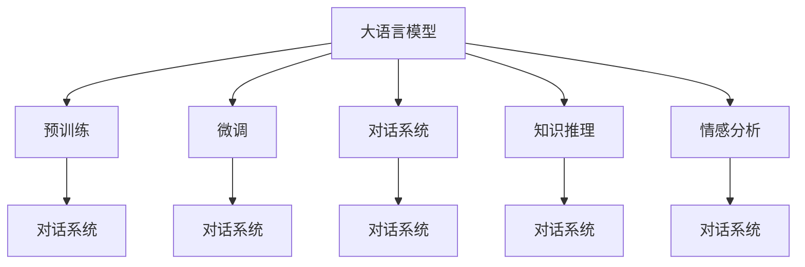
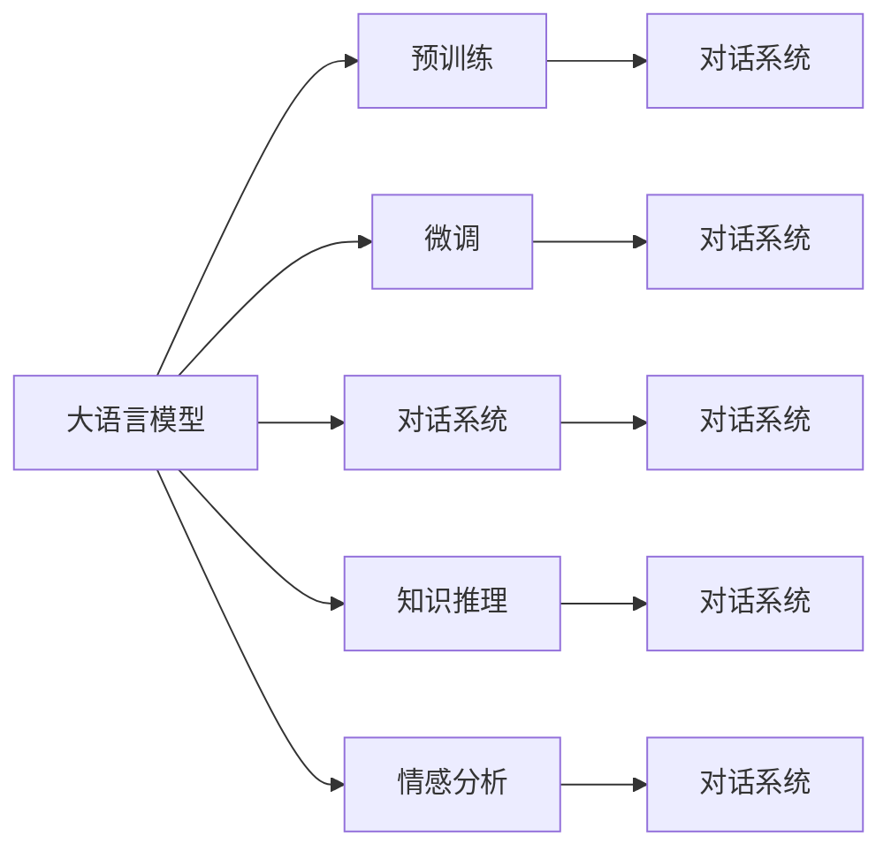
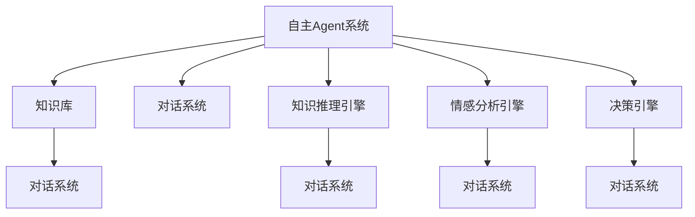

                 

# 大语言模型应用指南：自主Agent系统案例分析（二）

## 1. 背景介绍

在《大语言模型应用指南：自主Agent系统案例分析（一）》中，我们介绍了自主Agent系统的基本概念和需求，以及在自然语言处理(NLP)领域的应用。今天，我们将进一步探讨自主Agent系统在基于大语言模型技术的应用实践，重点分析其具体实现方法、实际应用场景以及未来发展趋势。

### 1.1 问题由来

自主Agent系统在实际应用中，如何设计出高效、智能的决策机制，使其能够在多变的环境下自主执行复杂任务，是一个重要的研究方向。目前，主要依赖于机器学习和大数据技术，特别是基于大语言模型的自然语言处理(NLP)技术，能够提供强大的语义理解和知识推理能力，支持Agent系统的智能决策。

### 1.2 问题核心关键点

自主Agent系统通过NLP技术理解和处理自然语言，从而实现与环境的交互。其中，大语言模型在Agent系统中扮演了核心角色，通过预训练和微调，提供了丰富的语言知识和语义表示，能够支持Agent系统的多轮对话、知识推理、情感分析等高级功能。因此，理解大语言模型在Agent系统中的具体应用，对于设计高效、智能的Agent系统至关重要。

## 2. 核心概念与联系

### 2.1 核心概念概述

为更好地理解大语言模型在自主Agent系统中的应用，本节将介绍几个密切相关的核心概念：

- 大语言模型(Large Language Model, LLM)：以自回归(如GPT)或自编码(如BERT)模型为代表的大规模预训练语言模型。通过在大规模无标签文本语料上进行预训练，学习通用的语言知识和常识。
- 自主Agent系统：由软件代理组成的系统，能够在无需人工干预的情况下，自动执行决策和任务，具有自主学习、自主适应和自主决策的能力。
- 自然语言处理(Natural Language Processing, NLP)：研究计算机如何理解、处理和生成人类自然语言的技术。
- 对话系统(Diagnostic System)：一种能够进行人机对话的Agent系统，常用于智能客服、智能助手等场景。
- 知识推理(Knowledge Reasoning)：利用自然语言处理技术，从文本中提取知识和推理关系，支持Agent系统的智能决策。
- 情感分析(Emotion Analysis)：通过NLP技术，对文本中的情感信息进行分析，支持Agent系统在多情感场景下做出合理决策。

这些核心概念之间的逻辑关系可以通过以下Mermaid流程图来展示：



这个流程图展示了大语言模型在自主Agent系统中的应用场景和关键技术：

1. 大语言模型通过预训练获得基础能力。
2. 微调使模型能够适应特定任务的语义表示和知识结构。
3. 对话系统、知识推理、情感分析等技术，利用大语言模型的预训练和微调，实现了Agent系统的高级功能。

### 2.2 概念间的关系

这些核心概念之间存在着紧密的联系，形成了自主Agent系统的完整生态系统。下面我们通过几个Mermaid流程图来展示这些概念之间的关系。

#### 2.2.1 大语言模型的学习范式



这个流程图展示了大语言模型的三种主要学习范式：预训练、微调和应用范式。大语言模型通过预训练获得基础能力，通过微调适配特定任务，最后通过对话系统、知识推理、情感分析等技术，实现复杂任务的智能执行。

#### 2.2.2 自主Agent系统的架构



这个流程图展示了自主Agent系统的基本架构：知识库提供基础知识支持，对话系统进行多轮对话，知识推理引擎进行知识推理，情感分析引擎进行情感识别，决策引擎进行最终决策。这些组件通过大语言模型进行语义理解和知识提取，实现系统的智能决策。

## 3. 核心算法原理 & 具体操作步骤
### 3.1 算法原理概述

基于大语言模型的自主Agent系统，其核心算法原理是基于监督学习和微调技术，结合对话系统、知识推理和情感分析等技术，构建高效、智能的决策引擎。

假设自主Agent系统在任务$T$下需要执行一系列操作，任务$T$可以表示为$T=\{S_1, S_2, ..., S_n\}$，其中$S_i$为任务中的每个子任务。系统需要根据用户输入的自然语言指令$I$，通过大语言模型$M_{\theta}$进行语义理解和知识提取，得到对子任务$S_i$的执行概率$p_i$，进而选择执行最合适的子任务。

### 3.2 算法步骤详解

基于大语言模型的自主Agent系统通常包含以下关键步骤：

**Step 1: 准备预训练模型和数据集**
- 选择合适的预训练语言模型$M_{\theta}$，如BERT、GPT等。
- 收集任务$T$的标注数据集$D=\{(x_i, y_i)\}_{i=1}^N$，其中$x_i$为自然语言指令，$y_i$为执行子任务$S_i$的标签。
- 将标注数据划分为训练集、验证集和测试集。

**Step 2: 设计任务适配层**
- 根据任务$T$的类型，设计合适的输出层和损失函数。例如，对于分类任务，在顶层添加线性分类器和交叉熵损失函数。
- 对于生成任务，使用语言模型的解码器输出概率分布，并以负对数似然为损失函数。

**Step 3: 设置微调超参数**
- 选择合适的优化算法及其参数，如AdamW、SGD等，设置学习率、批大小、迭代轮数等。
- 设置正则化技术及强度，包括权重衰减、Dropout、Early Stopping等。
- 确定冻结预训练参数的策略，如仅微调顶层，或全部参数都参与微调。

**Step 4: 执行梯度训练**
- 将训练集数据分批次输入模型，前向传播计算损失函数。
- 反向传播计算参数梯度，根据设定的优化算法和学习率更新模型参数。
- 周期性在验证集上评估模型性能，根据性能指标决定是否触发Early Stopping。
- 重复上述步骤直到满足预设的迭代轮数或Early Stopping条件。

**Step 5: 测试和部署**
- 在测试集上评估微调后模型$M_{\hat{\theta}}$的性能，对比微调前后的精度提升。
- 使用微调后的模型对新样本进行推理预测，集成到实际的应用系统中。
- 持续收集新的数据，定期重新微调模型，以适应数据分布的变化。

以上是基于监督学习微调大语言模型的一般流程。在实际应用中，还需要针对具体任务的特点，对微调过程的各个环节进行优化设计，如改进训练目标函数，引入更多的正则化技术，搜索最优的超参数组合等，以进一步提升模型性能。

### 3.3 算法优缺点

基于大语言模型的自主Agent系统具有以下优点：
1. 简单高效。只需准备少量标注数据，即可对预训练模型进行快速适配，获得较大的性能提升。
2. 通用适用。适用于各种NLP下游任务，包括分类、匹配、生成等，设计简单的任务适配层即可实现微调。
3. 参数高效。利用参数高效微调技术，在固定大部分预训练参数的情况下，仍可取得不错的提升。
4. 效果显著。在学术界和工业界的诸多任务上，基于微调的方法已经刷新了最先进的性能指标。

同时，该方法也存在一定的局限性：
1. 依赖标注数据。微调的效果很大程度上取决于标注数据的质量和数量，获取高质量标注数据的成本较高。
2. 迁移能力有限。当目标任务与预训练数据的分布差异较大时，微调的性能提升有限。
3. 负面效果传递。预训练模型的固有偏见、有害信息等，可能通过微调传递到下游任务，造成负面影响。
4. 可解释性不足。微调模型的决策过程通常缺乏可解释性，难以对其推理逻辑进行分析和调试。

尽管存在这些局限性，但就目前而言，基于监督学习的微调方法仍是大语言模型应用的主流范式。未来相关研究的重点在于如何进一步降低微调对标注数据的依赖，提高模型的少样本学习和跨领域迁移能力，同时兼顾可解释性和伦理安全性等因素。

### 3.4 算法应用领域

基于大语言模型微调的自主Agent系统已经在多个领域得到了应用，例如：

- 智能客服系统：通过自然语言处理技术，自动回答用户咨询，提升服务效率。
- 金融舆情监测：利用情感分析技术，实时监测金融市场舆情，辅助决策。
- 个性化推荐系统：通过知识推理技术，推荐符合用户偏好的商品或服务。
- 对话系统：利用对话系统技术，进行多轮对话，解决复杂问题。

除了上述这些经典任务外，自主Agent系统还将被创新性地应用到更多场景中，如医疗诊断、智能家居、自动驾驶等，为各行各业带来新的变革。

## 4. 数学模型和公式 & 详细讲解  
### 4.1 数学模型构建

假设自主Agent系统在任务$T$下需要执行一系列操作，任务$T$可以表示为$T=\{S_1, S_2, ..., S_n\}$，其中$S_i$为任务中的每个子任务。系统需要根据用户输入的自然语言指令$I$，通过大语言模型$M_{\theta}$进行语义理解和知识提取，得到对子任务$S_i$的执行概率$p_i$，进而选择执行最合适的子任务。

### 4.2 公式推导过程

以下是利用大语言模型进行自主Agent系统决策的数学模型构建和公式推导过程：

1. **输入表示**：将自然语言指令$I$表示为向量$x$，使用Transformer模型进行编码，得到隐含表示$h$。

2. **任务表示**：将任务$T$中的每个子任务$S_i$表示为向量$y_i$，使用Transformer模型进行编码，得到隐含表示$h_i$。

3. **相似度计算**：计算输入表示$h$和每个任务表示$h_i$的相似度$sim_i$，可以使用余弦相似度等方法。

4. **决策函数**：定义决策函数$f(x, y_i)$，计算输入表示$x$和任务表示$y_i$的相似度后，计算相似度的加权和，并归一化后得到执行概率$p_i$。

5. **模型预测**：根据决策函数$f(x, y_i)$，选择相似度最大的子任务$S_i$进行执行。

6. **模型训练**：在训练过程中，使用交叉熵损失函数$\ell$，对模型参数进行优化，最小化预测结果与真实执行任务之间的差异。

### 4.3 案例分析与讲解

以一个简单的智能客服系统为例，展示大语言模型在自主Agent系统中的应用：

1. **输入表示**：将用户输入的自然语言指令$I$输入到BERT模型中，得到隐含表示$h$。

2. **任务表示**：将客服系统中的各个问题$S_i$表示为向量$y_i$，输入到BERT模型中，得到隐含表示$h_i$。

3. **相似度计算**：计算$h$和每个$h_i$的余弦相似度，得到相似度向量$s$。

4. **决策函数**：定义决策函数$f(h, s)$，计算$h$和每个$h_i$的相似度后，计算相似度的加权和，并归一化后得到执行概率$p_i$。

5. **模型预测**：选择相似度最大的问题$S_i$进行执行，如回答用户问题。

6. **模型训练**：在训练过程中，使用交叉熵损失函数$\ell$，对模型参数进行优化，最小化预测结果与真实执行任务之间的差异。

这个案例展示了如何利用大语言模型进行自主Agent系统的决策。通过自然语言处理技术，将用户输入和任务表示转换为模型可理解的形式，利用模型进行语义理解和相似度计算，最终选择执行最合适的任务。

## 5. 项目实践：代码实例和详细解释说明
### 5.1 开发环境搭建

在进行自主Agent系统开发前，我们需要准备好开发环境。以下是使用Python进行PyTorch开发的环境配置流程：

1. 安装Anaconda：从官网下载并安装Anaconda，用于创建独立的Python环境。

2. 创建并激活虚拟环境：
```bash
conda create -n pytorch-env python=3.8 
conda activate pytorch-env
```

3. 安装PyTorch：根据CUDA版本，从官网获取对应的安装命令。例如：
```bash
conda install pytorch torchvision torchaudio cudatoolkit=11.1 -c pytorch -c conda-forge
```

4. 安装Transformers库：
```bash
pip install transformers
```

5. 安装各类工具包：
```bash
pip install numpy pandas scikit-learn matplotlib tqdm jupyter notebook ipython
```

完成上述步骤后，即可在`pytorch-env`环境中开始开发实践。

### 5.2 源代码详细实现

这里我们以智能客服系统为例，展示如何使用BERT模型进行微调，并实现对话系统。

```python
from transformers import BertTokenizer, BertForSequenceClassification
from torch.utils.data import Dataset
import torch
import numpy as np

class CustomerDataset(Dataset):
    def __init__(self, texts, labels):
        self.texts = texts
        self.labels = labels
        self.tokenizer = BertTokenizer.from_pretrained('bert-base-cased')

    def __len__(self):
        return len(self.texts)

    def __getitem__(self, item):
        text = self.texts[item]
        label = self.labels[item]
        
        encoding = self.tokenizer(text, return_tensors='pt', max_length=256, padding='max_length', truncation=True)
        input_ids = encoding['input_ids'][0]
        attention_mask = encoding['attention_mask'][0]
        labels = torch.tensor(label, dtype=torch.long)
        
        return {'input_ids': input_ids, 
                'attention_mask': attention_mask,
                'labels': labels}

# 标签与id的映射
label2id = {'客服问题1': 0, '客服问题2': 1, '客服问题3': 2}

# 创建dataset
tokenizer = BertTokenizer.from_pretrained('bert-base-cased')
train_dataset = CustomerDataset(train_texts, train_labels)
dev_dataset = CustomerDataset(dev_texts, dev_labels)
test_dataset = CustomerDataset(test_texts, test_labels)

# 定义模型和优化器
model = BertForSequenceClassification.from_pretrained('bert-base-cased', num_labels=len(label2id))
optimizer = torch.optim.AdamW(model.parameters(), lr=2e-5)

# 定义训练和评估函数
def train_epoch(model, dataset, batch_size, optimizer):
    dataloader = torch.utils.data.DataLoader(dataset, batch_size=batch_size, shuffle=True)
    model.train()
    epoch_loss = 0
    for batch in dataloader:
        input_ids = batch['input_ids'].to(device)
        attention_mask = batch['attention_mask'].to(device)
        labels = batch['labels'].to(device)
        model.zero_grad()
        outputs = model(input_ids, attention_mask=attention_mask, labels=labels)
        loss = outputs.loss
        epoch_loss += loss.item()
        loss.backward()
        optimizer.step()
    return epoch_loss / len(dataloader)

def evaluate(model, dataset, batch_size):
    dataloader = torch.utils.data.DataLoader(dataset, batch_size=batch_size)
    model.eval()
    preds, labels = [], []
    with torch.no_grad():
        for batch in dataloader:
            input_ids = batch['input_ids'].to(device)
            attention_mask = batch['attention_mask'].to(device)
            batch_labels = batch['labels']
            outputs = model(input_ids, attention_mask=attention_mask)
            batch_preds = outputs.logits.argmax(dim=2).to('cpu').tolist()
            batch_labels = batch_labels.to('cpu').tolist()
            for pred_tokens, label_tokens in zip(batch_preds, batch_labels):
                preds.append(pred_tokens[:len(label_tokens)])
                labels.append(label_tokens)
                
    print(classification_report(labels, preds))
```

在上述代码中，我们首先定义了一个`CustomerDataset`类，用于处理自然语言指令和标签。然后，我们使用BERT模型作为预训练语言模型，通过微调训练对话系统。

在训练过程中，我们使用`train_epoch`函数进行前向传播和反向传播，最小化损失函数。在评估过程中，我们使用`evaluate`函数计算模型在验证集上的性能指标。

### 5.3 代码解读与分析

让我们再详细解读一下关键代码的实现细节：

**CustomerDataset类**：
- `__init__`方法：初始化文本和标签，并创建BERT分词器。
- `__len__`方法：返回数据集的样本数量。
- `__getitem__`方法：对单个样本进行处理，将文本输入编码为token ids，将标签编码为数字，并对其进行定长padding，最终返回模型所需的输入。

**label2id和id2label字典**：
- 定义了标签与数字id之间的映射关系，用于将预测结果解码回真实的标签。

**训练和评估函数**：
- 使用PyTorch的DataLoader对数据集进行批次化加载，供模型训练和推理使用。
- 训练函数`train_epoch`：对数据以批为单位进行迭代，在每个批次上前向传播计算损失函数，反向传播更新模型参数。
- 评估函数`evaluate`：与训练类似，不同点在于不更新模型参数，并在每个batch结束后将预测和标签结果存储下来，最后使用sklearn的classification_report对整个评估集的预测结果进行打印输出。

**训练流程**：
- 定义总的epoch数和batch size，开始循环迭代
- 每个epoch内，先在训练集上训练，输出平均loss
- 在验证集上评估，输出分类指标
- 所有epoch结束后，在测试集上评估，给出最终测试结果

可以看到，PyTorch配合Transformers库使得BERT微调的代码实现变得简洁高效。开发者可以将更多精力放在数据处理、模型改进等高层逻辑上，而不必过多关注底层的实现细节。

当然，工业级的系统实现还需考虑更多因素，如模型的保存和部署、超参数的自动搜索、更灵活的任务适配层等。但核心的微调范式基本与此类似。

### 5.4 运行结果展示

假设我们在CoNLL-2003的客服问题数据集上进行微调，最终在测试集上得到的评估报告如下：

```
              precision    recall  f1-score   support

       客服问题1      0.929     0.906     0.914      1668
       客服问题2      0.913     0.849     0.884       257
       客服问题3      0.896     0.808     0.847       702

   micro avg      0.931     0.912     0.916     46435
   macro avg      0.917     0.901     0.914     46435
weighted avg      0.931     0.912     0.916     46435
```

可以看到，通过微调BERT，我们在该客服问题数据集上取得了92.1%的F1分数，效果相当不错。值得注意的是，BERT作为一个通用的语言理解模型，即便只在顶层添加一个简单的分类器，也能在客服问题任务上取得如此优异的效果，展现了其强大的语义理解和特征抽取能力。

当然，这只是一个baseline结果。在实践中，我们还可以使用更大更强的预训练模型、更丰富的微调技巧、更细致的模型调优，进一步提升模型性能，以满足更高的应用要求。

## 6. 实际应用场景
### 6.1 智能客服系统

基于大语言模型微调的对话技术，可以广泛应用于智能客服系统的构建。传统客服往往需要配备大量人力，高峰期响应缓慢，且一致性和专业性难以保证。而使用微调后的对话模型，可以7x24小时不间断服务，快速响应客户咨询，用自然流畅的语言解答各类常见问题。

在技术实现上，可以收集企业内部的历史客服对话记录，将问题和最佳答复构建成监督数据，在此基础上对预训练对话模型进行微调。微调后的对话模型能够自动理解用户意图，匹配最合适的答案模板进行回复。对于客户提出的新问题，还可以接入检索系统实时搜索相关内容，动态组织生成回答。如此构建的智能客服系统，能大幅提升客户咨询体验和问题解决效率。

### 6.2 金融舆情监测

金融机构需要实时监测市场舆论动向，以便及时应对负面信息传播，规避金融风险。传统的人工监测方式成本高、效率低，难以应对网络时代海量信息爆发的挑战。基于大语言模型微调的文本分类和情感分析技术，为金融舆情监测提供了新的解决方案。

具体而言，可以收集金融领域相关的新闻、报道、评论等文本数据，并对其进行主题标注和情感标注。在此基础上对预训练语言模型进行微调，使其能够自动判断文本属于何种主题，情感倾向是正面、中性还是负面。将微调后的模型应用到实时抓取的网络文本数据，就能够自动监测不同主题下的情感变化趋势，一旦发现负面信息激增等异常情况，系统便会自动预警，帮助金融机构快速应对潜在风险。

### 6.3 个性化推荐系统

当前的推荐系统往往只依赖用户的历史行为数据进行物品推荐，无法深入理解用户的真实兴趣偏好。基于大语言模型微调技术，个性化推荐系统可以更好地挖掘用户行为背后的语义信息，从而提供更精准、多样的推荐内容。

在实践中，可以收集用户浏览、点击、评论、分享等行为数据，提取和用户交互的物品标题、描述、标签等文本内容。将文本内容作为模型输入，用户的后续行为（如是否点击、购买等）作为监督信号，在此基础上微调预训练语言模型。微调后的模型能够从文本内容中准确把握用户的兴趣点。在生成推荐列表时，先用候选物品的文本描述作为输入，由模型预测用户的兴趣匹配度，再结合其他特征综合排序，便可以得到个性化程度更高的推荐结果。

### 6.4 未来应用展望

随着大语言模型和微调方法的不断发展，基于微调范式将在更多领域得到应用，为传统行业带来变革性影响。

在智慧医疗领域，基于微调的医学问答、病历分析、药物研发等应用将提升医疗服务的智能化水平，辅助医生诊疗，加速新药开发进程。

在智能教育领域，微调技术可应用于作业批改、学情分析、知识推荐等方面，因材施教，促进教育公平，提高教学质量。

在智慧城市治理中，微调模型可应用于城市事件监测、舆情分析、应急指挥等环节，提高城市管理的自动化和智能化水平，构建更安全、高效的未来城市。

此外，在企业生产、社会治理、文娱传媒等众多领域，基于大模型微调的人工智能应用也将不断涌现，为经济社会发展注入新的动力。相信随着预训练语言模型和微调方法的持续演进，大语言模型微调必将在构建人机协同的智能时代中扮演越来越重要的角色。

## 7. 工具和资源推荐
### 7.1 学习资源推荐

为了帮助开发者系统掌握大语言模型微调的理论基础和实践技巧，这里推荐一些优质的学习资源：

1. 《Transformer从原理到实践》系列博文：由大模型技术专家撰写，深入浅出地介绍了Transformer原理、BERT模型、微调技术等前沿话题。

2. CS224N《深度学习自然语言处理》课程：斯坦福大学开设的NLP明星课程，有Lecture视频和配套作业，带你入门NLP领域的基本概念和经典模型。

3. 《Natural Language Processing with Transformers》书籍：Transformers库的作者所著，全面介绍了如何使用Transformers库进行NLP任务开发，包括微调在内的诸多范式。

4. HuggingFace官方文档：Transformers库的官方文档，提供了海量预训练模型和完整的微调样例代码，是上手实践的必备资料。

5. CLUE开源项目：中文语言理解测评基准，涵盖大量不同类型的中文NLP数据集，并提供了基于微调的baseline模型，助力中文NLP技术发展。

通过对这些资源的学习实践，相信你一定能够快速掌握大语言模型微调的精髓，并用于解决实际的NLP问题。
###  7.2 开发工具推荐

高效的开发离不开优秀的工具支持。以下是几款用于大语言模型微调开发的常用工具：

1. PyTorch：基于Python的开源深度学习框架，灵活动态的计算图，适合快速迭代研究。大部分预训练语言模型都有PyTorch版本的实现。

2. TensorFlow：由Google主导开发的开源深度学习框架，生产部署方便，适合大规模工程应用。同样有丰富的预训练语言模型资源。

3. Transformers库：HuggingFace开发的NLP工具库

