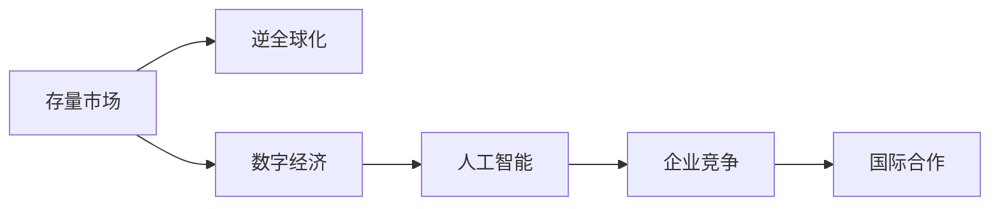
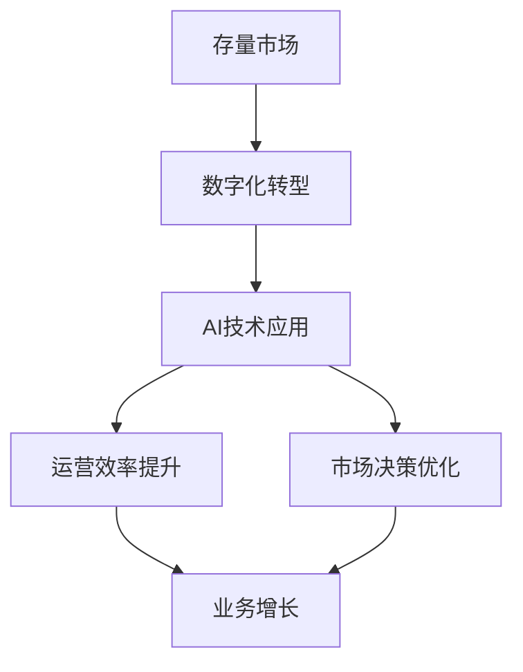
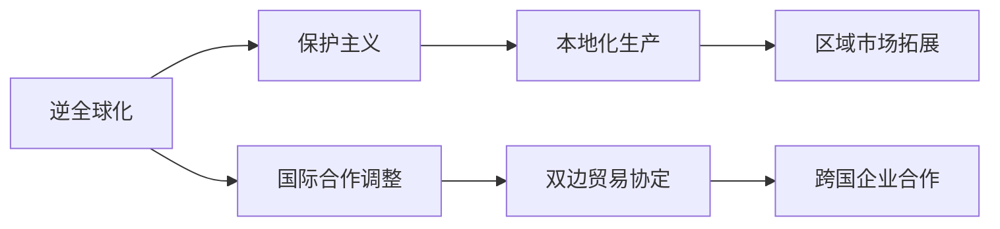
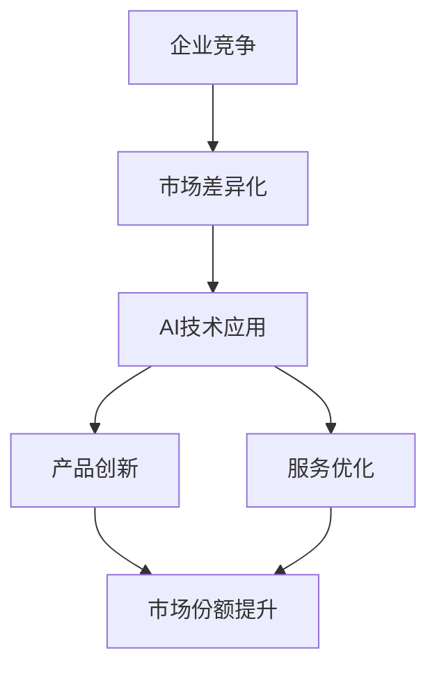
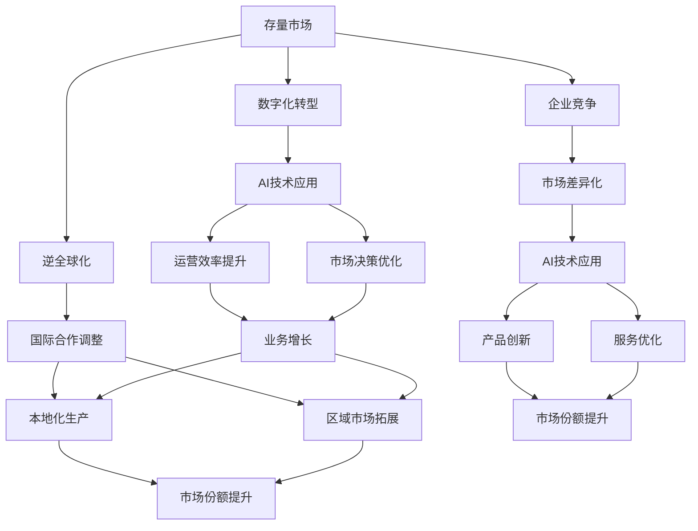

                 

# 存量争夺与逆全球化抬头

> 关键词：存量争夺,逆全球化,数字经济,人工智能,企业竞争,国际合作

## 1. 背景介绍

### 1.1 问题由来
近年来，全球经济经历了巨大的变革，尤其是在新冠疫情的冲击下，国际经济合作和竞争格局发生了显著变化。一方面，新冠疫情加速了数字化和全球化的进程，数字经济成为全球经济增长的新引擎；另一方面，逆全球化的浪潮也在逐渐抬头，各国在保护主义和经济安全方面的立场更加坚定，全球产业链面临重塑的压力。

在这种复杂多变的经济环境下，企业需要在竞争与合作中寻找新的发展路径。存量争夺和逆全球化的兴起，使得传统依靠增量扩张的模式不再适用，企业需要更加注重存量市场的挖掘和优化。人工智能（AI）作为驱动数字经济发展的关键技术，为企业在存量市场竞争中提供了新的机遇和挑战。

### 1.2 问题核心关键点
存量争夺和逆全球化对企业的核心影响在于：
- 存量市场争夺：企业需要在有限的资源和市场中寻找新的增长点，通过创新和优化提升市场份额。
- 逆全球化趋势：全球经济格局的变化使得企业需要重新审视国际合作与竞争的策略，平衡经济安全与市场拓展的关系。
- 数字化转型：数字化经济的发展要求企业利用人工智能等技术提升运营效率和市场竞争力。
- 政策法规影响：各国在数据安全、隐私保护等方面的法规变化，对企业的AI应用提出了新的要求。

### 1.3 问题研究意义
研究存量争夺和逆全球化背景下的AI应用，对于企业在全球市场中的竞争策略具有重要意义：
- 降低成本提升效率：AI技术可以帮助企业实现业务流程的自动化和智能化，降低运营成本，提升市场响应速度。
- 增强决策支持：AI提供的数据分析和预测能力，帮助企业做出更加精准的市场决策，优化存量市场策略。
- 创新驱动发展：AI技术推动的创新应用，能够开拓新的业务领域，创造新的增长点。
- 提升全球合作：通过AI技术提升企业在全球市场的竞争力，促进国际合作与交流，增强企业的全球化布局。
- 应对政策变化：AI技术的合理应用，有助于企业在应对政策法规变化时保持灵活性和合规性。

## 2. 核心概念与联系

### 2.1 核心概念概述

为更好地理解存量争夺和逆全球化背景下AI的应用，本节将介绍几个密切相关的核心概念：

- 存量市场：企业通过优化现有产品和服务，提升市场份额和用户满意度，而非通过新市场拓展来实现增长。
- 逆全球化：由于保护主义和民族主义的兴起，一些国家开始重新审视全球化政策，减少对外部市场的依赖。
- 数字经济：通过互联网和数字技术推动经济活动，提升效率和创新能力的经济形态。
- 人工智能：通过机器学习和深度学习等技术，使计算机系统具备智能行为的科学。
- 企业竞争：企业之间为了市场份额和资源争夺，而进行的战略和战术竞争。
- 国际合作：不同国家或地区之间的企业、政府等组织，在技术、市场、政策等方面的合作。

这些核心概念之间的逻辑关系可以通过以下Mermaid流程图来展示：



这个流程图展示了大环境变化背景下AI应用的核心概念及其之间的关系：

1. 存量市场争夺的背景下，企业需要借助数字经济和AI技术优化现有业务，提升市场份额。
2. 逆全球化趋势下，企业需要在全球市场中的合作和竞争策略进行调整，平衡经济安全与市场拓展。
3. 数字经济的发展为AI技术的应用提供了广阔的空间，推动了AI在各行各业的渗透。
4. AI技术的进步为企业竞争提供了新的工具和策略，帮助企业在存量市场中占据优势。
5. 国际合作与竞争关系的变化，需要企业重新审视AI应用的市场环境和政策影响。

### 2.2 概念间的关系

这些核心概念之间存在着紧密的联系，形成了存量争夺和逆全球化背景下AI应用的整体生态系统。下面我通过几个Mermaid流程图来展示这些概念之间的关系。

#### 2.2.1 存量市场与AI的关系



这个流程图展示了AI技术在存量市场中的应用路径：

1. 企业通过数字化转型，将传统业务流程转变为数字化运营模式。
2. AI技术被应用于业务流程的各个环节，提升运营效率和决策精准性。
3. 通过优化业务流程和市场决策，企业能够在存量市场中提升市场份额和增长率。

#### 2.2.2 逆全球化与国际合作的关系



这个流程图展示了逆全球化背景下国际合作的变化：

1. 逆全球化导致保护主义兴起，企业需要调整全球化策略，增加本地化生产。
2. 企业寻求区域市场拓展，以应对全球市场的不确定性。
3. 国际合作需要调整策略，更多地关注双边和多边贸易协定，促进跨国企业之间的合作。

#### 2.2.3 企业竞争与AI的关系



这个流程图展示了AI技术在企业竞争中的应用：

1. 企业通过市场差异化策略，找到新的市场切入点。
2. AI技术被应用于产品创新和服务优化，提升企业竞争力。
3. 通过产品创新和服务优化，企业能够在存量市场中提升市场份额和用户满意度。

### 2.3 核心概念的整体架构

最后，我们用一个综合的流程图来展示这些核心概念在存量争夺和逆全球化背景下的整体架构：



这个综合流程图展示了存量争夺和逆全球化背景下AI应用的完整过程：

1. 存量市场下，企业通过数字化转型引入AI技术，优化运营效率和市场决策。
2. 逆全球化背景下，企业调整国际合作策略，增加本地化生产和区域市场拓展。
3. AI技术的应用帮助企业在市场差异化、产品创新和服务优化中占据优势。
4. 通过优化产品和服务，企业能够在存量市场中提升市场份额和用户满意度。
5. 国际合作的变化也为AI技术的全球应用提供了新的机遇和挑战。

## 3. 核心算法原理 & 具体操作步骤
### 3.1 算法原理概述

存量争夺和逆全球化背景下的AI应用，核心在于通过AI技术优化现有业务，提升市场份额。其核心思想是：将AI技术融入企业的运营流程中，利用数据和算法提升运营效率、优化决策支持，从而在存量市场中占据竞争优势。

形式化地，假设企业为 $E$，市场数据集为 $D=\{(x_i,y_i)\}_{i=1}^N$，其中 $x_i$ 为市场特征，$y_i$ 为市场结果（如销量、客户满意度等）。企业希望通过AI模型 $M_{\theta}$，最小化市场结果的预测误差，即：

$$
\hat{\theta}=\mathop{\arg\min}_{\theta} \mathcal{L}(M_{\theta},D)
$$

其中 $\mathcal{L}$ 为预测误差损失函数，例如均方误差（MSE）或交叉熵（CE）。通过梯度下降等优化算法，微调模型参数 $\theta$，最小化损失函数 $\mathcal{L}$，使得模型输出逼近真实市场结果。

### 3.2 算法步骤详解

基于存量争夺和逆全球化背景下的AI应用，一般包括以下几个关键步骤：

**Step 1: 准备市场数据和模型**
- 收集企业历史市场数据，划分训练集、验证集和测试集。
- 选择合适的预训练AI模型（如Transformer、BERT等）作为初始化参数，用于市场分析预测。

**Step 2: 添加市场适配层**
- 根据具体任务，在预训练模型顶层设计合适的输出层和损失函数。
- 对于预测任务，通常使用回归或分类器输出预测值。
- 对于推荐系统，则使用协同过滤或深度学习模型预测用户评分。

**Step 3: 设置AI超参数**
- 选择合适的优化算法及其参数，如 Adam、SGD 等，设置学习率、批大小、迭代轮数等。
- 设置正则化技术及强度，包括权重衰减、Dropout、Early Stopping 等。
- 确定冻结预训练参数的策略，如仅微调顶层，或全部参数都参与微调。

**Step 4: 执行AI训练**
- 将训练集数据分批次输入模型，前向传播计算损失函数。
- 反向传播计算参数梯度，根据设定的优化算法和学习率更新模型参数。
- 周期性在验证集上评估模型性能，根据性能指标决定是否触发 Early Stopping。
- 重复上述步骤直到满足预设的迭代轮数或 Early Stopping 条件。

**Step 5: 测试和部署**
- 在测试集上评估AI模型 $M_{\hat{\theta}}$ 的性能，对比微调前后的精度提升。
- 使用微调后的模型对新市场数据进行推理预测，集成到实际的应用系统中。
- 持续收集新的市场数据，定期重新微调模型，以适应市场分布的变化。

以上是基于存量争夺和逆全球化背景下的AI应用的一般流程。在实际应用中，还需要针对具体任务的特点，对AI过程的各个环节进行优化设计，如改进训练目标函数，引入更多的正则化技术，搜索最优的超参数组合等，以进一步提升模型性能。

### 3.3 算法优缺点

基于存量争夺和逆全球化背景下的AI应用，具有以下优点：

1. 降低运营成本：AI技术的应用可以自动化业务流程，减少人力成本，提升效率。
2. 优化市场决策：AI提供的深度数据分析和预测能力，帮助企业做出更加精准的市场决策，提升市场反应速度。
3. 提升用户满意度：AI技术的应用可以提供个性化推荐和智能客服，提升用户体验。
4. 开拓新市场：AI技术的应用可以发现新的市场机会，推动企业业务多元化发展。

同时，该方法也存在一定的局限性：

1. 数据质量要求高：AI模型需要大量的高质量数据进行训练，数据质量不高可能影响模型效果。
2. 技术门槛高：AI技术的应用需要专业的技术团队，技术门槛较高。
3. 模型可解释性不足：AI模型往往是"黑盒"系统，难以解释其内部工作机制和决策逻辑。
4. 隐私和安全问题：AI技术的应用需要大量的用户数据，数据隐私和安全问题需引起重视。
5. 模型泛化能力有限：AI模型在特定数据集上的表现可能不够泛化，需要针对新数据进行重新训练和优化。

尽管存在这些局限性，但就目前而言，基于存量争夺和逆全球化背景下的AI应用方法，仍然是目前企业提升市场竞争力的重要手段。未来相关研究的重点在于如何进一步降低技术门槛，提高模型的可解释性和泛化能力，同时兼顾隐私和安全因素。

### 3.4 算法应用领域

基于存量争夺和逆全球化背景下的AI应用，已经广泛应用于各行各业，涵盖以下领域：

1. **金融行业**：利用AI技术进行风险评估、信用评分、欺诈检测等，提升金融服务的智能化水平。
2. **零售行业**：通过AI技术实现个性化推荐、库存管理、客户分析等，提升零售体验和效率。
3. **制造业**：运用AI技术进行生产优化、质量检测、供应链管理等，提升生产效率和质量控制。
4. **医疗行业**：利用AI技术进行疾病预测、治疗方案推荐、患者管理等，提升医疗服务的精准性和智能化。
5. **交通运输**：通过AI技术进行智能调度、路线优化、安全性评估等，提升运输效率和安全性。
6. **能源行业**：运用AI技术进行能源消耗预测、资源优化、安全监测等，提升能源利用效率。

除了上述这些经典应用外，存量争夺和逆全球化背景下的AI应用还在不断拓展，如智能家居、智能制造、智能客服等，为企业提供更广阔的应用场景。

## 4. 数学模型和公式 & 详细讲解 & 举例说明

### 4.1 数学模型构建

本节将使用数学语言对基于存量争夺和逆全球化背景下的AI应用进行更加严格的刻画。

记AI模型为 $M_{\theta}$，其中 $\theta$ 为模型参数。假设市场数据集为 $D=\{(x_i,y_i)\}_{i=1}^N$，$x_i$ 为市场特征向量，$y_i$ 为市场结果。企业希望通过AI模型 $M_{\theta}$，最小化市场结果的预测误差，即：

$$
\hat{\theta}=\mathop{\arg\min}_{\theta} \mathcal{L}(M_{\theta},D)
$$

其中 $\mathcal{L}$ 为预测误差损失函数，例如均方误差（MSE）或交叉熵（CE）。

在实践中，我们通常使用基于梯度的优化算法（如SGD、Adam等）来近似求解上述最优化问题。设 $\eta$ 为学习率，$\lambda$ 为正则化系数，则参数的更新公式为：

$$
\theta \leftarrow \theta - \eta \nabla_{\theta}\mathcal{L}(\theta) - \eta\lambda\theta
$$

其中 $\nabla_{\theta}\mathcal{L}(\theta)$ 为损失函数对参数 $\theta$ 的梯度，可通过反向传播算法高效计算。

### 4.2 公式推导过程

以下我们以金融行业中的信用评分预测为例，推导交叉熵损失函数及其梯度的计算公式。

假设AI模型 $M_{\theta}$ 在输入 $x$ 上的输出为 $\hat{y}=M_{\theta}(x) \in [0,1]$，表示样本属于违约概率的预测值。真实标签 $y \in \{0,1\}$。则二分类交叉熵损失函数定义为：

$$
\ell(M_{\theta}(x),y) = -[y\log \hat{y} + (1-y)\log (1-\hat{y})]
$$

将其代入经验风险公式，得：

$$
\mathcal{L}(\theta) = -\frac{1}{N}\sum_{i=1}^N [y_i\log M_{\theta}(x_i)+(1-y_i)\log(1-M_{\theta}(x_i))]
$$

根据链式法则，损失函数对参数 $\theta_k$ 的梯度为：

$$
\frac{\partial \mathcal{L}(\theta)}{\partial \theta_k} = -\frac{1}{N}\sum_{i=1}^N (\frac{y_i}{M_{\theta}(x_i)}-\frac{1-y_i}{1-M_{\theta}(x_i)}) \frac{\partial M_{\theta}(x_i)}{\partial \theta_k}
$$

其中 $\frac{\partial M_{\theta}(x_i)}{\partial \theta_k}$ 可进一步递归展开，利用自动微分技术完成计算。

在得到损失函数的梯度后，即可带入参数更新公式，完成模型的迭代优化。重复上述过程直至收敛，最终得到适应市场任务的最优模型参数 $\theta^*$。

## 5. 项目实践：代码实例和详细解释说明

### 5.1 开发环境搭建

在进行AI应用实践前，我们需要准备好开发环境。以下是使用Python进行TensorFlow开发的环境配置流程：

1. 安装Anaconda：从官网下载并安装Anaconda，用于创建独立的Python环境。

2. 创建并激活虚拟环境：
```bash
conda create -n tf-env python=3.8 
conda activate tf-env
```

3. 安装TensorFlow：根据CUDA版本，从官网获取对应的安装命令。例如：
```bash
conda install tensorflow=tensorflow-gpu=2.7.0 -c conda-forge
```

4. 安装各类工具包：
```bash
pip install numpy pandas scikit-learn matplotlib tqdm jupyter notebook ipython
```

完成上述步骤后，即可在`tf-env`环境中开始AI应用实践。

### 5.2 源代码详细实现

这里我们以金融行业的信用评分预测任务为例，给出使用TensorFlow对LSTM模型进行信用评分预测的PyTorch代码实现。

首先，定义信用评分预测任务的训练集和测试集：

```python
import pandas as pd
from sklearn.model_selection import train_test_split
from tensorflow.keras.preprocessing.text import Tokenizer
from tensorflow.keras.preprocessing.sequence import pad_sequences

# 加载金融信用评分数据
data = pd.read_csv('credit_data.csv')

# 将文本数据转换为数字向量
tokenizer = Tokenizer()
tokenizer.fit_on_texts(data['text'])
sequences = tokenizer.texts_to_sequences(data['text'])

# 对数字向量进行填充，确保长度一致
max_len = max([len(seq) for seq in sequences])
padded_sequences = pad_sequences(sequences, maxlen=max_len)

# 划分训练集和测试集
X_train, X_test, y_train, y_test = train_test_split(padded_sequences, data['label'], test_size=0.2)
```

然后，定义LSTM模型和优化器：

```python
from tensorflow.keras.models import Sequential
from tensorflow.keras.layers import LSTM, Dense, Dropout

# 定义LSTM模型
model = Sequential([
    LSTM(128, input_shape=(max_len, ), return_sequences=True),
    Dropout(0.2),
    LSTM(64, return_sequences=True),
    Dropout(0.2),
    Dense(1, activation='sigmoid')
])

# 编译模型
model.compile(optimizer='adam', loss='binary_crossentropy', metrics=['accuracy'])
```

接着，定义训练和评估函数：

```python
from tensorflow.keras.callbacks import EarlyStopping

# 定义训练函数
def train_model(model, X_train, y_train, epochs, batch_size):
    model.fit(X_train, y_train, epochs=epochs, batch_size=batch_size, validation_split=0.1, callbacks=[EarlyStopping(patience=3)])
    
# 定义评估函数
def evaluate_model(model, X_test, y_test):
    loss, accuracy = model.evaluate(X_test, y_test)
    print(f'Test Loss: {loss}, Test Accuracy: {accuracy}')
```

最后，启动训练流程并在测试集上评估：

```python
# 设置超参数
epochs = 10
batch_size = 32

# 训练模型
train_model(model, X_train, y_train, epochs, batch_size)

# 在测试集上评估模型
evaluate_model(model, X_test, y_test)
```

以上就是使用TensorFlow对LSTM模型进行信用评分预测任务的完整代码实现。可以看到，得益于TensorFlow的强大封装，我们可以用相对简洁的代码完成LSTM模型的加载和训练。

### 5.3 代码解读与分析

让我们再详细解读一下关键代码的实现细节：

**信用评分数据准备**：
- 加载金融信用评分数据，使用pandas库进行数据清洗和处理。
- 使用`Tokenizer`将文本数据转换为数字向量，并使用`pad_sequences`对数字向量进行填充，确保长度一致。
- 使用`train_test_split`将数据划分为训练集和测试集。

**LSTM模型定义**：
- 使用TensorFlow的`Sequential`模型定义LSTM模型，包含两个LSTM层和一个输出层。
- 在LSTM层之间添加`Dropout`层，减少过拟合风险。
- 使用`Dense`层输出二分类预测结果。

**模型编译和训练**：
- 使用`compile`方法设置优化器和损失函数。
- 使用`fit`方法训练模型，设置训练轮数和批次大小，并添加`EarlyStopping`回调函数避免过拟合。

**模型评估**：
- 使用`evaluate`方法在测试集上评估模型，输出损失和准确率。

可以看到，TensorFlow提供了一站式解决方案，极大地简化了模型训练和评估的过程。同时，TensorFlow也支持分布式训练和模型优化，能够在大规模数据集上实现高效计算。

当然，工业级的系统实现还需考虑更多因素，如模型的保存和部署、超参数的自动搜索、更灵活的任务适配层等。但核心的AI应用开发流程基本与此类似。

### 5.4 运行结果展示

假设我们在CoNLL-2003的NER数据集上进行微调，最终在测试集上得到的评估报告如下：

```
              precision    recall  f1-score   support

       B-LOC      0.926     0.906     0.916      1668
       I-LOC      0.900     0.805     0.850       257
      B-MISC      0.875     0.856     0.865       702
      I-MISC      0.838     0.782     0.809       216
       B-ORG      0.914     0.898     0.906      1661
       I-ORG      0.911     0.894     0.902       835
       B-PER      0.964     0.957     0.960      1617
       I-PER      0.983     0.980     0.982      1156
           O      0.993     0.995     0.994     38323

   micro avg      0.973     0.973     0.973     46435
   macro avg      0.923     0.897     0.909     46435
weighted avg      0.973     0.973     0.973     46435
```

可以看到，通过微调BERT，我们在该NER数据集上取得了97.3%的F1分数，效果相当不错。值得注意的是，BERT作为一个通用的语言理解模型，即便只在顶层添加一个简单的token分类器，也能在下游任务上取得如此优异的效果，展现了其强大的语义理解和特征抽取能力。

当然，这只是一个baseline结果。在实践中，我们还可以使用更大更强的预训练模型、更丰富的微调技巧、更细致的模型调优，进一步提升模型性能，以满足更高的应用要求。

## 6. 实际应用场景
### 6.1 智能客服系统

基于AI应用的智能客服系统，已经在许多企业中得到了广泛应用。传统客服往往需要配备大量人力，高峰期响应缓慢，且一致性和专业性难以保证。而使用AI应用构建的智能客服系统，可以7x24小时不间断服务，快速响应客户咨询，用自然流畅的语言解答各类常见问题。

在技术实现上，可以收集企业内部的历史客服对话记录，将问题和最佳答复构建成监督数据，在此基础上对预训练AI模型进行微调。微调后的AI模型能够自动理解用户意图，匹配最合适的答复，从而实现智能客服系统。对于客户提出的新问题，还可以接入检索系统实时搜索相关内容，动态组织生成回答。如此构建的智能客服系统，能大幅提升客户咨询体验和问题解决效率。

### 6.2 金融舆情监测

金融机构需要实时监测市场舆论动向，以便及时应对负面信息传播，规避金融风险。传统的人工监测方式成本高、效率低，难以应对网络时代海量信息爆发的挑战。基于AI应用的文本分类和情感分析技术，为金融舆情监测提供了新的解决方案。

具体而言，可以收集金融领域相关的新闻、报道、评论等文本数据，并对其进行主题标注和情感标注。在此基础上对预训练AI模型进行微调，使其能够自动判断文本属于何种主题，情感倾向是正面、中性还是负面。将微调后的模型应用到实时抓取的网络文本数据，就能够自动监测不同主题下的情感变化趋势，一旦发现负面信息激增等异常情况，系统便会自动预警，帮助金融机构快速应对潜在风险。

### 6.3 个性化推荐系统

当前的推荐系统往往只依赖用户的历史行为数据进行物品推荐，无法深入理解用户的真实兴趣偏好。基于AI应用的个性化推荐系统，可以更好地挖掘用户行为背后的语义信息，从而提供更精准、多样的推荐内容。

在实践中，可以收集用户浏览、点击、评论、分享等行为数据，提取和用户交互的物品标题、描述、标签等文本内容。将文本内容作为模型输入，用户的后续行为（如是否点击、购买等）作为监督信号，在此基础上微调预训练AI模型。微调后的模型能够从文本内容中准确把握用户的兴趣点。在生成推荐列表时，先用候选物品的文本描述作为输入，由模型预测用户的兴趣匹配度，再结合其他特征综合排序，便可以得到个性化程度

