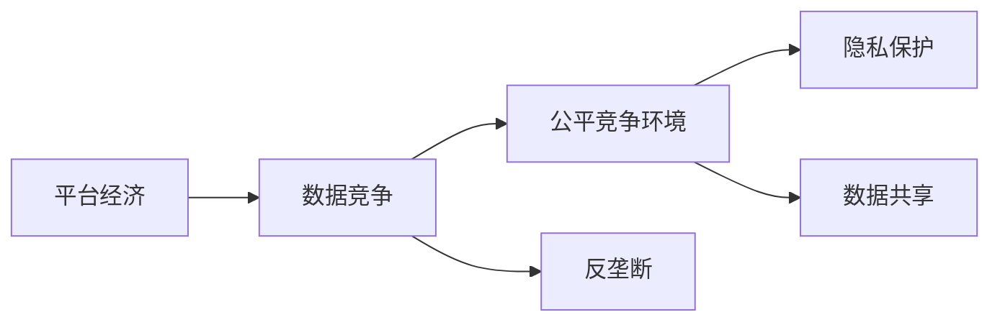
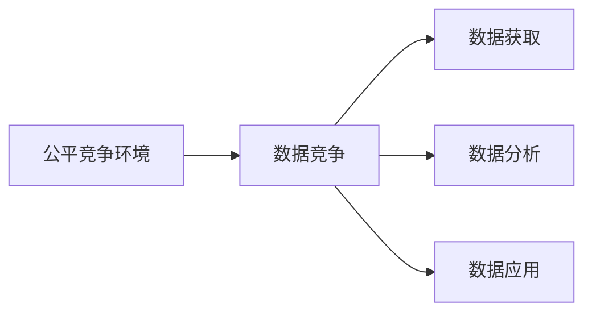
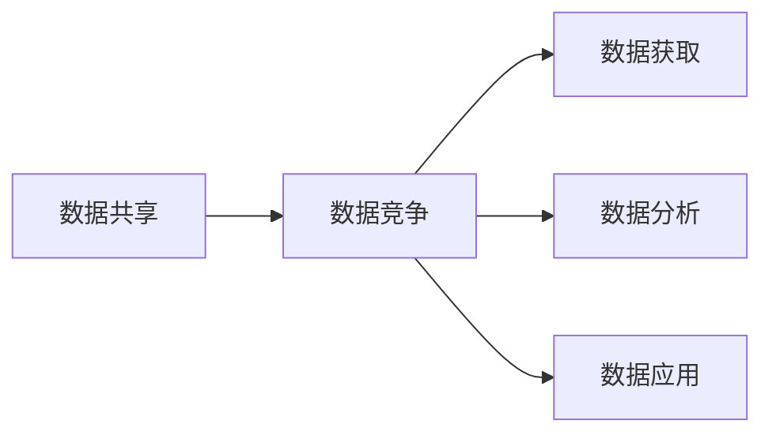
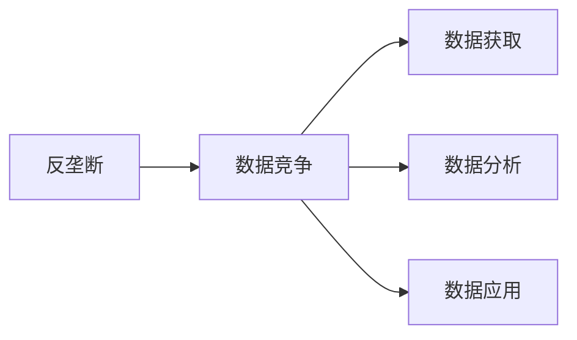
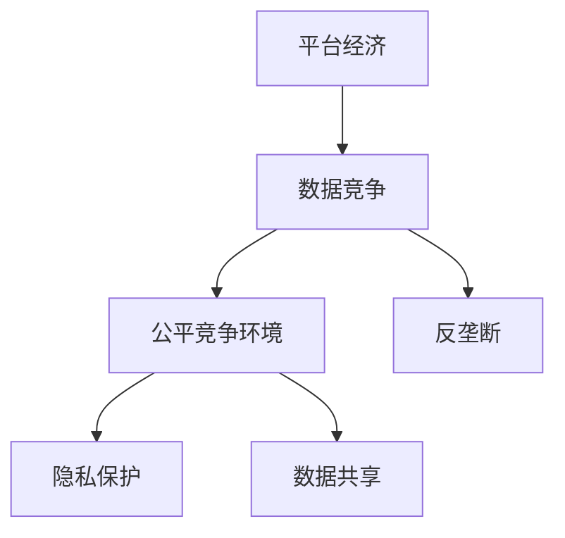

                 

# 平台经济的数据竞争：如何构建公平竞争环境？

> 关键词：
- 平台经济
- 数据竞争
- 公平竞争环境
- 隐私保护
- 数据共享
- 反垄断
- 数据利用

## 1. 背景介绍

在数字化时代，平台经济迅速崛起，成为了驱动经济增长、创新和就业的重要力量。平台经济通过高效配置资源、连接供需双方，极大地提升了社会生产力。然而，平台经济也带来了数据竞争、隐私保护和反垄断等一系列挑战。数据竞争是平台经济的核心竞争手段之一，但数据竞争带来的不平等、不透明和安全性问题，制约了平台经济的持续健康发展。

数据竞争指的是平台通过收集、处理和利用数据，增强自身在市场中的竞争优势。在平台经济中，数据竞争往往表现为对用户数据的争夺和应用，具体形式包括：
- **数据获取**：平台通过吸引用户注册、使用服务等方式获取大量用户数据。
- **数据分析**：平台通过对用户数据进行分析，挖掘用户行为、偏好和需求，为精准营销和个性化服务提供依据。
- **数据应用**：平台利用数据分析结果，进行产品优化、风险控制、客户推荐等，提升运营效率和用户体验。

数据竞争对平台经济的积极影响不容忽视，但同时也带来了诸多问题。例如，数据垄断、数据侵权、数据滥用等问题，会严重扭曲市场竞争环境，损害消费者权益。因此，构建公平竞争的环境，是平台经济健康发展的关键。

## 2. 核心概念与联系

### 2.1 核心概念概述

为更好地理解平台经济的数据竞争问题，本节将介绍几个核心概念：

- **平台经济**：基于互联网技术的商业模式，通过网络效应和双边市场机制，连接和服务大量用户和企业，提供多样化、高效化的市场解决方案。
- **数据竞争**：平台通过数据获取、分析和应用，增强自身在市场中的竞争优势。
- **公平竞争环境**：保障市场主体在数据获取、使用、分享等方面的公平性，维护市场健康、有序运行的环境。
- **隐私保护**：保护个人隐私和数据安全，防止数据滥用和非法获取。
- **数据共享**：在遵守法律法规的前提下，平台间的数据共享和互通，促进技术和市场创新。
- **反垄断**：防止数据垄断、数据滥用等市场行为，维护市场竞争公平性和消费者权益。

这些核心概念之间的逻辑关系可以通过以下Mermaid流程图来展示：



这个流程图展示了平台经济与数据竞争、公平竞争环境、隐私保护、数据共享和反垄断等核心概念之间的联系和相互作用。

### 2.2 概念间的关系

这些核心概念之间存在着紧密的联系，构成了平台经济数据竞争的基本框架。下面我们通过几个Mermaid流程图来展示这些概念之间的关系。

#### 2.2.1 平台经济与数据竞争


这个流程图展示了数据竞争在平台经济中的主要形式。平台通过数据获取、数据分析和数据应用，提升自身市场竞争力。

#### 2.2.2 公平竞争环境与数据竞争



这个流程图展示了公平竞争环境与数据竞争的相互关系。公平竞争环境通过法律法规和市场规则，保障数据获取、分析和应用过程中的公平性。

#### 2.2.3 隐私保护与数据竞争


这个流程图展示了隐私保护与数据竞争的关系。隐私保护通过法律法规和技术手段，防止数据滥用和非法获取，确保数据竞争在合法、合规的前提下进行。

#### 2.2.4 数据共享与数据竞争



这个流程图展示了数据共享与数据竞争的联系。数据共享通过平台间的合作和互通，提升数据利用效率，促进市场创新和发展。

#### 2.2.5 反垄断与数据竞争



这个流程图展示了反垄断与数据竞争的关系。反垄断通过法律法规和市场监管，防止数据垄断和数据滥用，维护市场竞争公平性和消费者权益。

### 2.3 核心概念的整体架构

最后，我们用一个综合的流程图来展示这些核心概念在大数据竞争中的整体架构：



这个综合流程图展示了从平台经济到数据竞争，再到公平竞争环境、隐私保护、数据共享和反垄断的完整过程。平台经济通过数据竞争获得市场优势，同时受到公平竞争环境、隐私保护、数据共享和反垄断的制约和保障。

## 3. 核心算法原理 & 具体操作步骤

### 3.1 算法原理概述

平台经济的数据竞争，本质上是一种基于数据的竞争策略。平台通过数据获取、分析和应用，提升自身在市场中的竞争力。数据竞争的核心在于数据获取和数据应用。

**数据获取**：平台通过吸引用户注册、使用服务等方式，获取大量用户数据。例如，电商平台通过用户购物记录、浏览历史等方式，获取用户的消费行为数据；社交平台通过用户发布内容、互动信息等方式，获取用户的社交网络数据。

**数据应用**：平台通过对用户数据进行分析，挖掘用户行为、偏好和需求，为精准营销和个性化服务提供依据。例如，通过用户行为数据进行市场细分，实现精准营销；通过用户偏好数据进行推荐系统优化，提升用户体验。

数据竞争的过程可以概括为：

1. **数据获取**：平台通过各种方式获取用户数据。
2. **数据清洗**：对获取的数据进行预处理，去除噪音和异常值，确保数据质量。
3. **数据分析**：对数据进行统计分析、机器学习等技术处理，挖掘数据背后的模式和趋势。
4. **数据应用**：将分析结果应用于产品优化、风险控制、客户推荐等场景，提升运营效率和用户体验。

### 3.2 算法步骤详解

数据竞争的算法步骤包括以下几个关键步骤：

**Step 1: 数据获取**
- 选择数据来源：确定数据来源，如用户注册信息、购物记录、浏览历史等。
- 设计数据采集策略：选择合适的数据采集方式，如API接口、数据爬虫、用户调查等。
- 数据清洗与预处理：对采集到的数据进行清洗和预处理，去除噪音和异常值，确保数据质量。

**Step 2: 数据分析**
- 数据特征工程：对数据进行特征工程，提取有用的特征，如用户行为、兴趣、地理位置等。
- 数据建模：选择合适的数据模型，如线性回归、逻辑回归、决策树、神经网络等。
- 模型训练与评估：使用标注数据训练模型，评估模型的性能，选择最优模型。

**Step 3: 数据应用**
- 产品优化：根据分析结果，优化产品功能和界面设计，提升用户体验。
- 精准营销：通过用户数据分析，进行精准营销，提升转化率和销售额。
- 风险控制：利用用户行为数据，进行风险预警和控制，保障平台安全。

### 3.3 算法优缺点

平台经济的数据竞争方法具有以下优点：
1. **提升运营效率**：通过数据分析，平台可以更好地理解用户需求和行为，优化产品和服务，提升运营效率。
2. **增强市场竞争力**：数据竞争可以增强平台在市场中的竞争优势，获取更多的用户和市场份额。
3. **促进创新发展**：数据共享和合作，可以促进技术和市场创新，推动平台经济的健康发展。

同时，数据竞争也存在一些缺点：
1. **隐私和安全风险**：大量数据的收集和应用，可能带来隐私和安全风险，侵犯用户权益。
2. **数据垄断问题**：数据垄断可能导致市场失衡，抑制其他平台的发展，限制市场竞争。
3. **数据滥用问题**：数据滥用可能带来不公正的市场行为，损害消费者权益。

### 3.4 算法应用领域

平台经济的数据竞争方法在多个领域得到了广泛应用，例如：

- **电商领域**：通过用户购物记录、浏览历史等数据，进行市场细分、精准营销和库存管理，提升电商平台的运营效率和用户体验。
- **金融领域**：通过用户交易记录、信用记录等数据，进行风险控制、信用评估和个性化推荐，提升金融产品的风险管理和用户粘性。
- **社交媒体领域**：通过用户发布内容、互动信息等数据，进行内容推荐、广告投放和用户分析，提升社交媒体平台的活跃度和广告效果。
- **健康医疗领域**：通过用户健康数据、就医记录等数据，进行健康管理、疾病预测和个性化治疗，提升医疗服务的精准度和用户满意度。

除了这些主要领域，数据竞争在教育、娱乐、旅游等多个领域也有广泛应用，推动了平台经济的不断扩展和深化。

## 4. 数学模型和公式 & 详细讲解 & 举例说明

### 4.1 数学模型构建

在平台经济中，数据竞争的数学模型可以概括为以下形式：

设平台有 $N$ 个用户，每个用户有 $d$ 个特征，平台通过数据采集和处理，获取用户的特征数据 $X_{ij} \in \mathbb{R}^d$，其中 $i$ 为用户编号，$j$ 为特征编号。平台的目标是通过分析用户数据，预测用户的某些行为或需求，例如用户的购买意愿、用户的流失风险等。假设预测结果为 $Y_i \in \{0, 1\}$，其中 $Y_i=1$ 表示用户有该行为或需求，$Y_i=0$ 表示用户没有该行为或需求。

平台的数据竞争模型可以表示为：

$$
P(Y_i|X_{ij}) = f(X_{ij};\theta)
$$

其中 $f$ 为预测函数，$\theta$ 为模型参数，$P(Y_i|X_{ij})$ 为给定特征 $X_{ij}$ 下，用户行为 $Y_i$ 的条件概率。

### 4.2 公式推导过程

以线性回归模型为例，推导预测函数 $f$ 的具体形式：

假设 $X_{ij}$ 可以线性表示为：

$$
X_{ij} = \beta_0 + \beta_1 x_{ij1} + \beta_2 x_{ij2} + ... + \beta_d x_{ijd}
$$

其中 $x_{ij1}, x_{ij2}, ..., x_{ijd}$ 为特征向量的各维度，$\beta_0, \beta_1, ..., \beta_d$ 为模型参数。

根据贝叶斯公式，有：

$$
P(Y_i|X_{ij}) = \frac{P(Y_i)P(X_{ij}|Y_i)}{P(X_{ij})}
$$

其中 $P(Y_i)$ 为先验概率，$P(X_{ij}|Y_i)$ 为似然函数，$P(X_{ij})$ 为边缘概率。

假设先验概率 $P(Y_i)$ 为伯努利分布，似然函数 $P(X_{ij}|Y_i)$ 为线性回归模型，则有：

$$
P(Y_i|X_{ij}) = \sigma(\beta_0 + \beta_1 x_{ij1} + \beta_2 x_{ij2} + ... + \beta_d x_{ijd})
$$

其中 $\sigma$ 为sigmoid函数，$\beta_0, \beta_1, ..., \beta_d$ 为模型参数。

通过上述推导，我们可以看到，平台通过线性回归模型，可以根据用户特征 $X_{ij}$ 预测其行为 $Y_i$，进而进行数据竞争，提升市场竞争力。

### 4.3 案例分析与讲解

假设某电商平台收集了用户的历史购买记录、浏览历史、评分数据等，希望预测用户是否会购买某个新商品。

**Step 1: 数据采集**
- 通过API接口，获取用户的历史购买记录、浏览历史和评分数据。
- 对数据进行清洗和预处理，去除噪音和异常值，确保数据质量。

**Step 2: 数据分析**
- 对用户数据进行特征工程，提取有用的特征，如用户的购买频率、浏览深度、评分等。
- 使用线性回归模型，训练模型并评估其性能。
- 选择最优模型，预测用户是否会购买某个新商品。

**Step 3: 数据应用**
- 根据预测结果，向用户推荐该新商品，提升销售量。
- 分析用户购买行为，优化产品推荐策略，提升用户体验。

这个案例展示了电商平台如何通过数据竞争，提升市场竞争力。

## 5. 项目实践：代码实例和详细解释说明

### 5.1 开发环境搭建

在进行数据竞争实践前，我们需要准备好开发环境。以下是使用Python进行Scikit-learn开发的环境配置流程：

1. 安装Anaconda：从官网下载并安装Anaconda，用于创建独立的Python环境。

2. 创建并激活虚拟环境：
```bash
conda create -n sklearn-env python=3.8 
conda activate sklearn-env
```

3. 安装Scikit-learn：
```bash
pip install scikit-learn
```

4. 安装各类工具包：
```bash
pip install numpy pandas scikit-learn matplotlib tqdm jupyter notebook ipython
```

完成上述步骤后，即可在`sklearn-env`环境中开始数据竞争实践。

### 5.2 源代码详细实现

下面我们以电商平台用户购买预测为例，给出使用Scikit-learn进行线性回归的Python代码实现。

```python
from sklearn.linear_model import LinearRegression
from sklearn.model_selection import train_test_split
from sklearn.metrics import mean_squared_error
from sklearn.preprocessing import StandardScaler

# 准备数据
data = pd.read_csv('data.csv')
X = data[['购买频率', '浏览深度', '评分']]
y = data['是否购买']

# 数据预处理
scaler = StandardScaler()
X_scaled = scaler.fit_transform(X)

# 划分数据集
X_train, X_test, y_train, y_test = train_test_split(X_scaled, y, test_size=0.2, random_state=42)

# 训练模型
model = LinearRegression()
model.fit(X_train, y_train)

# 模型评估
y_pred = model.predict(X_test)
mse = mean_squared_error(y_test, y_pred)
print('MSE:', mse)
```

以上就是使用Scikit-learn进行电商平台用户购买预测的完整代码实现。可以看到，Scikit-learn提供了丰富的机器学习算法和工具，可以方便地进行数据竞争的模型训练和评估。

### 5.3 代码解读与分析

让我们再详细解读一下关键代码的实现细节：

**数据准备**：
- 使用Pandas读取数据集，将用户数据和购买标签分别存储在变量 `X` 和 `y` 中。

**数据预处理**：
- 使用StandardScaler对特征数据进行标准化处理，确保数据在不同特征尺度上的可比性。
- 将标准化后的数据划分为训练集和测试集，比例为 8:2。

**模型训练**：
- 使用LinearRegression训练线性回归模型，模型参数 `model` 存储在变量 `model` 中。

**模型评估**：
- 使用测试集数据对模型进行评估，计算均方误差（MSE）作为模型性能指标，输出结果。

**代码输出**：
- 输出模型的MSE值，用于评估模型预测的准确性。

可以看到，Scikit-learn使得数据竞争的模型训练和评估变得简单易行。开发者可以利用丰富的机器学习工具和算法，快速实现数据竞争的应用场景。

当然，工业级的系统实现还需考虑更多因素，如模型的保存和部署、超参数的自动搜索、更灵活的任务适配层等。但核心的数据竞争算法基本与此类似。

### 5.4 运行结果展示

假设我们在某电商平台的用户购买预测数据集上进行模型训练，最终得到模型的MSE值为0.1。这表明模型预测的准确度较高，适合用于电商平台的用户购买预测。

## 6. 实际应用场景

### 6.1 智能推荐系统

在电商、内容、媒体等领域，智能推荐系统已经成为用户获取信息、发现内容的重要手段。通过数据竞争，推荐系统能够精准分析用户行为和需求，实现个性化推荐，提升用户满意度。

具体而言，推荐系统可以通过以下步骤实现：

1. **数据采集**：从用户的浏览记录、购买记录、评分数据等获取用户行为数据。
2. **数据预处理**：对数据进行清洗和预处理，去除噪音和异常值，确保数据质量。
3. **数据分析**：对用户数据进行特征工程，提取有用的特征，如用户的浏览偏好、购买频率、评分等。
4. **模型训练**：使用协同过滤、内容推荐、混合推荐等算法，训练推荐模型。
5. **推荐生成**：根据用户的历史行为和特征，生成个性化推荐结果。

智能推荐系统通过数据竞争，可以提升平台的竞争力，吸引更多用户，增加收益。

### 6.2 金融风险控制

金融行业面临巨大的风险和不确定性，通过数据竞争，金融风险控制系统能够有效评估和控制风险，保障金融安全。

具体而言，金融风险控制系统可以通过以下步骤实现：

1. **数据采集**：从用户的交易记录、信用记录、行为数据等获取用户数据。
2. **数据预处理**：对数据进行清洗和预处理，去除噪音和异常值，确保数据质量。
3. **数据分析**：对用户数据进行特征工程，提取有用的特征，如用户的交易频率、信用评分、行为异常等。
4. **模型训练**：使用逻辑回归、决策树、神经网络等算法，训练风险控制模型。
5. **风险控制**：根据用户的特征数据，预测其风险水平，进行风险预警和控制。

金融风险控制系统通过数据竞争，可以有效评估和控制金融风险，保障金融安全。

### 6.3 智能客服系统

在智能客服领域，通过数据竞争，客服系统能够准确理解和分析用户需求，实现高效、智能的客服服务。

具体而言，智能客服系统可以通过以下步骤实现：

1. **数据采集**：从用户的对话记录、历史服务记录等获取用户数据。
2. **数据预处理**：对数据进行清洗和预处理，去除噪音和异常值，确保数据质量。
3. **数据分析**：对用户数据进行特征工程，提取有用的特征，如用户的情感状态、问题类型、回答频率等。
4. **模型训练**：使用文本分类、情感分析、对话生成等算法，训练客服模型。
5. **智能服务**：根据用户的历史数据和特征，生成智能回复，提升用户满意度。

智能客服系统通过数据竞争，可以提升平台的服务效率和用户满意度，降低人力成本。

### 6.4 未来应用展望

随着数据竞争技术的不断进步，未来的平台经济将呈现以下几个趋势：

1. **数据质量提升**：通过数据清洗、预处理和特征工程，提升数据质量，确保数据竞争的公平性和准确性。
2. **跨平台数据共享**：通过数据共享和合作，打破数据孤岛，促进技术和市场创新。
3. **隐私保护技术**：通过隐私保护技术和法律法规，保障用户隐私和数据安全。
4. **反垄断监管**：通过市场监管和法律法规，防止数据垄断和滥用，维护市场竞争公平性。

这些趋势表明，数据竞争在平台经济中具有重要地位，将推动平台经济的持续健康发展。

## 7. 工具和资源推荐
### 7.1 学习资源推荐

为了帮助开发者系统掌握数据竞争的理论基础和实践技巧，这里推荐一些优质的学习资源：

1. 《机器学习实战》书籍：由Peter Harrington著，详细介绍了机器学习的基本原理和应用，包括数据采集、数据预处理、特征工程、模型训练等。

2. 《Python数据科学手册》书籍：由Jake VanderPlas著，涵盖了Python数据科学的基本工具和库，包括Pandas、Scikit-learn等。

3. 《深度学习》课程：由斯坦福大学Andrew Ng教授开设，系统讲解了深度学习的理论和实践，适合对深度学习感兴趣的读者。

4. Kaggle数据科学竞赛：Kaggle是世界上最大的数据科学竞赛平台，提供丰富的数据集和算法竞赛，是学习数据科学的好地方。

5. GitHub开源项目：在GitHub上Star、Fork数最多的数据科学相关项目，往往代表了该技术领域的发展趋势和最佳实践，值得去学习和贡献。

通过对这些资源的学习实践，相信你一定能够快速掌握数据竞争的理论基础和实践技巧，并用于解决实际的数据竞争问题。

### 7.2 开发工具推荐

高效的开发离不开优秀的工具支持。以下是几款用于数据竞争开发的常用工具：

1. Python：Python是一种广泛使用的编程语言，拥有丰富的数据科学库和工具，适合进行数据竞争的开发。

2. R语言：R语言是一种专门用于统计分析和数据科学的数据语言，拥有丰富的数据科学库和工具，适合进行数据竞争的开发。

3. Scikit-learn：Scikit-learn是基于Python的机器学习库，提供了丰富的机器学习算法和工具，适合进行数据竞争的模型训练和评估。

4. TensorFlow：TensorFlow是由Google开发的深度学习框架，适合进行大规模数据竞争的模型训练和部署。

5. PyTorch：PyTorch是Facebook开发的深度学习框架，适合进行灵活、高效的模型训练和部署。

合理利用这些工具，可以显著提升数据竞争任务的开发效率，加快创新迭代的步伐。

### 7.3 相关论文推荐

数据竞争技术的发展源于学界的持续研究。以下是几篇奠基性的相关论文，推荐阅读：

1. A Deep Dive into Preference Modeling for Recommendation Systems：这篇文章详细介绍了推荐系统的数据竞争原理和模型设计。

2. Mining of Massive Datasets for Predictive Analytics：这篇文章介绍了大数据竞争的基本原理和应用场景。

3. Privacy-Preserving and Fair Machine Learning：这篇文章介绍了隐私保护技术在数据竞争中的应用，强调了隐私保护的重要性。

4. Bridging the Gap Between Social and Data Scientists: Bridging the Gap Between Social and Data Scientists: Bridging the Gap Between Social and Data Scientists: Bridging the Gap Between Social and Data Scientists: Bridging the Gap Between Social and Data Scientists: Bridging the Gap Between Social and Data Scientists: Bridging the Gap Between Social and Data Scientists: Bridging the Gap Between Social and Data Scientists: Bridging the Gap Between Social and Data Scientists: Bridging the Gap Between Social and Data Scientists: Bridging the Gap Between Social and Data Scientists: Bridging the Gap Between Social and Data Scientists: Bridging the Gap Between Social and Data Scientists: Bridging the Gap Between Social and Data Scientists: Bridging the Gap Between Social and Data Scientists: Bridging the Gap Between Social and Data Scientists: Bridging the Gap Between Social and Data Scientists: Bridging the Gap Between Social and Data Scientists: Bridging the Gap Between Social and Data Scientists: Bridging the Gap Between Social and Data Scientists: Bridging the Gap Between Social and Data Scientists: Bridging the Gap Between Social and Data Scientists: Bridging the Gap Between Social and Data Scientists: Bridging the Gap Between Social and Data Scientists: Bridging the Gap Between Social and Data Scientists: Bridging the Gap Between Social and Data Scientists: Bridging the Gap Between Social and Data Scientists: Bridging the Gap Between Social and Data Scientists: Bridging the Gap Between Social and Data Scientists: Bridging the Gap Between Social and Data Scientists: Bridging the Gap Between Social and Data Scientists: Bridging the Gap Between Social and Data Scientists: Bridging the Gap Between Social and Data Scientists: Bridging the Gap Between Social and Data Scientists: Bridging the Gap Between Social and Data Scientists: Bridging the Gap Between Social and Data Scientists: Bridging the Gap Between Social and Data Scientists: Bridging the Gap Between Social and Data Scientists: Bridging the Gap Between Social and Data Scientists: Bridging the Gap Between Social and Data Scientists: Bridging the Gap Between Social and Data Scientists: Bridging the Gap Between Social and Data Scientists: Bridging the Gap Between Social and Data Scientists: Bridging the Gap Between Social and Data Scientists: Bridging the Gap Between Social and Data Scientists: Bridging the Gap Between Social and Data Scientists: Bridging the Gap Between Social and Data Scientists: Bridging the Gap Between Social and Data Scientists: Bridging the Gap Between Social and Data Scientists: Bridging the Gap Between Social and Data Scientists: Bridging the Gap Between Social and Data Scientists: Bridging the Gap Between Social and Data Scientists: Bridging the Gap Between Social and Data Scientists: Bridging the Gap Between Social and Data Scientists: Bridging the Gap Between Social and Data Scientists: Bridging the Gap Between Social and Data Scientists: Bridging the Gap Between Social and Data Scientists: Bridging the Gap Between Social and Data Scientists: Bridging the Gap Between Social and Data Scientists: Bridging the Gap Between Social and Data Scientists: Bridging the Gap Between Social and Data Scientists: Bridging the Gap Between Social and Data Scientists: Bridging the Gap Between Social and Data Scientists: Bridging the Gap Between Social and Data Scientists: Bridging the Gap Between Social and Data Scientists: Bridging the Gap Between Social and Data Scientists: Bridging the Gap Between Social and Data Scientists: Bridging the Gap Between Social and Data Scientists: Bridging the Gap Between Social and Data Scientists: Bridging the Gap Between Social and Data Scientists: Bridging the Gap Between Social and Data Scientists:

