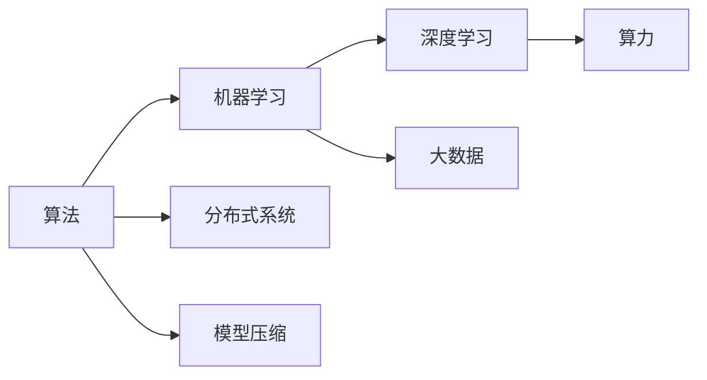
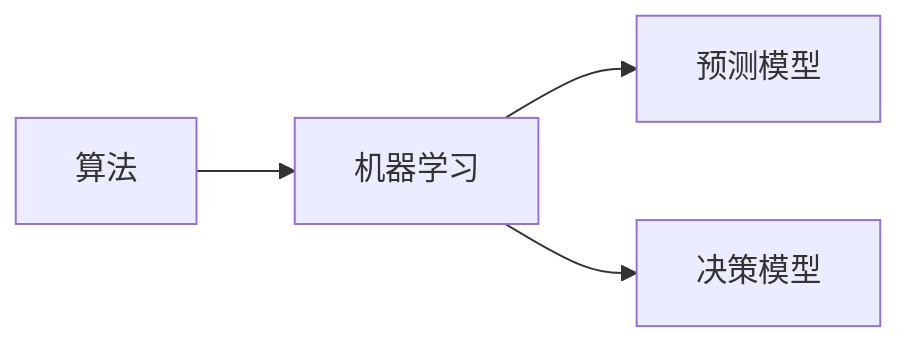
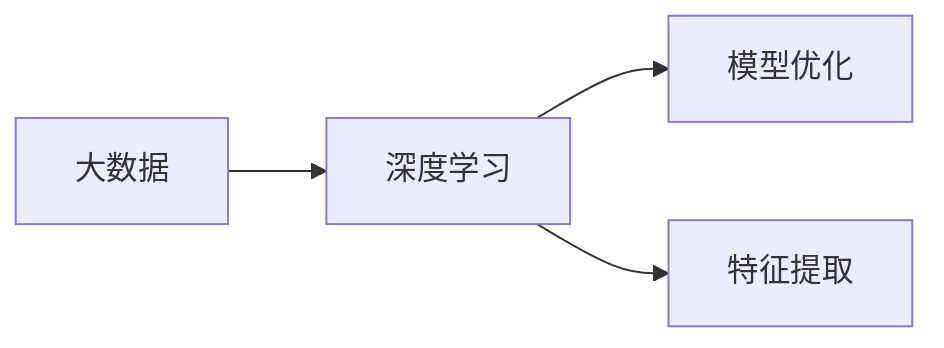
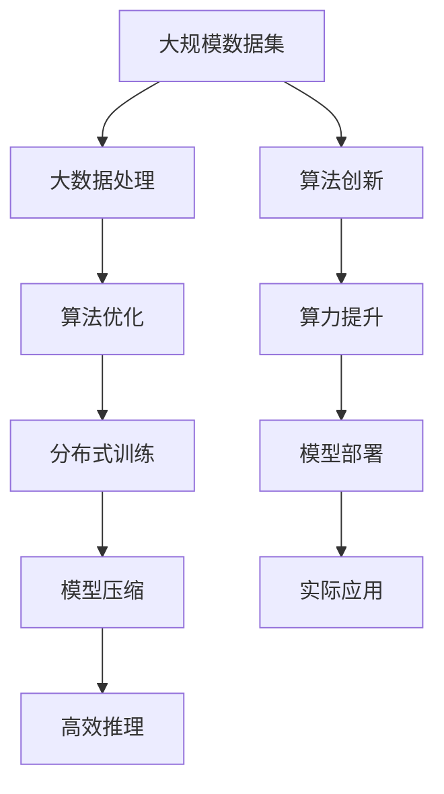

                 

# 算法、算力与大数据：AI的三驾马车

> 关键词：算法,算力,大数据,机器学习,深度学习,人工智能,大数据分析,计算图,分布式系统,模型压缩

## 1. 背景介绍

### 1.1 问题由来
近年来，随着人工智能技术的飞速发展，其在各领域的应用日益广泛，从图像识别、语音识别到自然语言处理、智能推荐等，都取得了显著的进展。然而，这些技术背后都离不开算法的创新、算力的提升和大数据的应用。正是算法、算力与大数据三驾马车并驾齐驱，共同推动了人工智能技术的突破和应用。

### 1.2 问题核心关键点
算法、算力与大数据是人工智能技术发展的三大支柱，相互关联，互为支撑。算法的创新为AI技术的发展提供了理论基础和实现手段，算力的提升为大规模模型的训练和推理提供了支持，而大数据的应用则为算法和算力的发挥提供了数据来源和验证手段。

算法提供了模型的结构和优化方法，算力保证了模型的高效计算，大数据提供了模型训练和优化所需的丰富数据，三者共同构成了人工智能技术的核心。然而，在实际应用中，三者之间并非孤立存在，而是相互交织、相互影响的，共同推动AI技术的不断进步。

### 1.3 问题研究意义
研究算法、算力与大数据的协同工作机制，对于推动人工智能技术的创新和应用具有重要意义：

1. 提升模型性能。通过算法创新和算力提升，可以构建更高效的模型，提高模型的泛化能力和计算效率。
2. 拓展数据应用范围。大数据技术的应用，可以更广泛地获取和利用数据，为算法和算力提供更丰富的训练和验证数据。
3. 加速技术迭代。算法、算力与大数据的协同工作，可以加速模型的迭代优化，推动技术的快速进步。
4. 增强应用效果。通过更高效的算法、更强大的算力和更丰富的数据，可以实现更具实际应用价值的AI解决方案。

## 2. 核心概念与联系

### 2.1 核心概念概述

为更好地理解算法、算力与大数据的协同工作机制，本节将介绍几个密切相关的核心概念：

- **算法(Algorithms)**：是指导计算机如何解决问题的规则和步骤。在AI中，常见的算法包括梯度下降、随机梯度下降、反向传播等。
- **算力(Computing Power)**：是指计算机的计算能力，包括计算速度、计算精度、内存大小等。算力是模型训练和推理的基础。
- **大数据(Big Data)**：指规模庞大、复杂多样的数据集合。大数据技术为算法和算力提供了数据基础，是AI模型训练和优化的数据来源。
- **机器学习(Machine Learning)**：利用算法和算力，从大数据中学习规律和知识，构建模型进行预测或决策。
- **深度学习(Deep Learning)**：一种特殊的机器学习方法，利用多层神经网络构建模型，可以从大量数据中学习复杂的特征表示。
- **分布式系统(Distributed Systems)**：通过多台计算机协同工作，提供更强大的算力和更高效的数据处理能力。
- **模型压缩(Model Compression)**：通过算法优化，减小模型的参数量和计算量，提高模型的计算效率。

这些核心概念之间的逻辑关系可以通过以下Mermaid流程图来展示：



这个流程图展示了算法、算力与大数据在AI技术中的重要地位和相互关系：

1. 算法为机器学习和深度学习提供了基本的计算规则。
2. 算力是模型训练和推理的硬件基础，直接影响计算效率和精度。
3. 大数据为模型训练和优化提供了数据来源，推动算法的创新和算力的提升。
4. 分布式系统通过协同计算，增强了算力的扩展性和可靠性。
5. 模型压缩通过优化算法，减小模型参数量，提升计算效率。

### 2.2 概念间的关系

这些核心概念之间存在着紧密的联系，形成了AI技术的完整生态系统。下面我们通过几个Mermaid流程图来展示这些概念之间的关系。

#### 2.2.1 算法与机器学习的关系



这个流程图展示了算法在机器学习中的作用：

1. 算法为机器学习提供了计算规则和步骤。
2. 机器学习通过算法构建预测模型和决策模型，进行模型训练和优化。

#### 2.2.2 算力与深度学习的关系


这个流程图展示了算力在深度学习中的作用：

1. 算力提供了深度学习模型训练和推理所需的计算资源。
2. 深度学习模型通过算力进行大规模训练和推理，获得高性能和高效能的模型。

#### 2.2.3 大数据与深度学习的关系



这个流程图展示了大数据在深度学习中的作用：

1. 大数据为深度学习提供了丰富的训练数据。
2. 深度学习模型通过大数据进行训练和优化，获得更优秀的模型效果。

### 2.3 核心概念的整体架构

最后，我们用一个综合的流程图来展示这些核心概念在大数据、算法和算力协同工作中的整体架构：



这个综合流程图展示了从大数据到实际应用的完整过程：

1. 大数据通过处理和分析，提供模型训练和优化的数据。
2. 算法通过创新和优化，构建高效模型。
3. 算力通过提升和扩展，提供模型训练和推理所需的计算资源。
4. 模型通过压缩和优化，提升计算效率和性能。
5. 分布式系统通过协同计算，增强算力的扩展性和可靠性。
6. 最终，模型通过部署和应用，服务于实际业务需求。

## 3. 核心算法原理 & 具体操作步骤
### 3.1 算法原理概述

算法、算力与大数据的协同工作机制，本质上是基于计算图(Caluation Graph)的模型构建和优化过程。计算图是一种描述模型计算流程的数据结构，由一系列操作节点(Operation Node)和数据流边(Data Flow Edge)组成。每个节点代表一个计算操作，边代表数据流动，数据在图中流动，进行一系列的计算和操作，最终输出模型结果。

在大数据、算法和算力的协同作用下，计算图可以分为以下几个部分：

- **数据准备**：通过大数据处理技术，对原始数据进行清洗、过滤、特征提取等预处理操作，为模型训练提供干净、高效的数据。
- **算法设计**：根据具体任务，选择合适的算法模型和优化方法，构建计算图节点。
- **算力调度**：通过分布式系统调度，将计算图分发到多台计算机上并行计算，加速计算过程。
- **模型优化**：通过算法优化和模型压缩，减小计算图的规模和复杂度，提高计算效率。
- **结果输出**：通过高效推理，输出模型预测或决策结果，服务于实际应用需求。

### 3.2 算法步骤详解

基于计算图的模型构建和优化过程，通常包括以下几个关键步骤：

**Step 1: 数据准备**
- 收集、清洗和标注数据，确保数据质量。
- 进行特征提取和转换，生成模型训练所需的特征向量。
- 对数据进行分批次加载和预处理，以适应分布式计算环境。

**Step 2: 算法设计**
- 选择合适的算法模型，如神经网络、决策树等。
- 设计模型的计算图结构，确定节点和边的连接方式。
- 选择合适的优化方法，如梯度下降、随机梯度下降等。
- 定义损失函数和评估指标，用于模型训练和优化。

**Step 3: 算力调度**
- 将计算图分发到多台计算机上进行并行计算。
- 通过分布式系统调度，均衡计算负载，提高计算效率。
- 实时监控计算图的状态，进行动态资源调整。

**Step 4: 模型优化**
- 通过算法优化，如剪枝、量化等，减小模型参数量和计算量。
- 通过模型压缩，如权重共享、参数剪枝等，提高模型计算效率。
- 进行模型微调，在保持模型精度的同时，减小计算复杂度。

**Step 5: 结果输出**
- 使用高效推理算法，对模型进行快速推理和预测。
- 将推理结果转化为实际应用所需的形式，如文本、图像、推荐列表等。
- 进行结果后处理，如数据增强、对抗样本等，提升模型鲁棒性。

### 3.3 算法优缺点

基于计算图的模型构建和优化过程，具有以下优点：

1. **高效并行计算**：通过分布式系统调度，实现高效并行计算，提高计算效率和性能。
2. **灵活算法设计**：通过算法优化和模型压缩，灵活设计计算图节点，适应各种算法模型。
3. **数据驱动优化**：通过大数据处理，提供高质量的数据，指导模型训练和优化。
4. **可扩展性强**：计算图可以通过分布式扩展，实现模型的扩展和优化，适应大规模模型和复杂任务。

同时，基于计算图的模型构建和优化过程，也存在以下缺点：

1. **算法复杂度高**：构建和优化计算图，需要复杂的数据处理和算法设计，可能涉及较复杂的计算和操作。
2. **数据处理成本高**：大数据处理和分析，需要较高的计算资源和时间成本，可能面临数据处理瓶颈。
3. **模型压缩难度大**：模型压缩和优化，需要深入理解模型结构和算法，可能面临模型精度和计算效率的平衡问题。

### 3.4 算法应用领域

基于计算图的算法构建和优化过程，已经在各种领域得到了广泛应用，例如：

- **计算机视觉**：用于图像分类、目标检测、图像分割等任务，如图像识别、人脸识别、自动驾驶等。
- **自然语言处理**：用于机器翻译、情感分析、文本摘要等任务，如聊天机器人、智能客服、自然语言理解等。
- **智能推荐**：用于个性化推荐、广告投放等任务，如电商推荐、新闻推荐、社交网络推荐等。
- **金融分析**：用于风险评估、股票预测、信用评分等任务，如量化投资、信贷评估、反欺诈检测等。
- **医疗健康**：用于疾病诊断、医学图像分析、基因分析等任务，如智能诊断、医学影像分析、基因组学分析等。
- **智能制造**：用于生产调度、质量检测、供应链管理等任务，如智能制造、智能仓储、智能物流等。
- **智能城市**：用于交通管理、环境监测、智能安防等任务，如智能交通、智慧城市、智能安防等。

## 4. 数学模型和公式 & 详细讲解 & 举例说明

### 4.1 数学模型构建

在基于计算图的算法构建过程中，数学模型是核心组件之一。常见的数学模型包括线性回归、逻辑回归、卷积神经网络、循环神经网络等。

以线性回归模型为例，其数学模型可以表示为：

$$
y = w_0 + w_1x_1 + w_2x_2 + \cdots + w_nx_n + b
$$

其中，$y$表示模型预测值，$w_i$表示特征系数，$x_i$表示输入特征，$b$表示截距。

在线性回归模型中，目标是通过最小化预测值与真实值之间的差异，优化模型参数。常见的方法包括梯度下降、随机梯度下降等。

### 4.2 公式推导过程

以梯度下降算法为例，其公式推导过程如下：

设模型参数为$\theta$，目标函数为$L(\theta)$，初始参数为$\theta_0$。梯度下降算法迭代公式为：

$$
\theta_{t+1} = \theta_t - \eta \nabla_{\theta}L(\theta_t)
$$

其中，$\eta$表示学习率，$\nabla_{\theta}L(\theta_t)$表示目标函数对模型参数的梯度，$t$表示迭代次数。

梯度下降算法的核心思想是通过迭代更新模型参数，使得目标函数值最小化。通过梯度计算，每次更新参数$\theta_{t+1}$，逼近最优参数$\theta^*$，最终得到模型预测结果。

### 4.3 案例分析与讲解

以深度学习中的卷积神经网络(CNN)为例，其数学模型可以表示为：

$$
y = h_1(x_1) + w_2h_2(x_2) + \cdots + w_nh_n(x_n)
$$

其中，$y$表示模型输出，$h_i$表示卷积层操作，$x_i$表示输入数据，$w_i$表示卷积核权重。

CNN通过卷积、池化、激活等操作，提取输入数据的多层次特征表示，从而实现图像识别、目标检测等任务。

CNN模型的训练和优化过程，可以表示为：

1. 初始化模型参数$\theta$。
2. 定义损失函数$L(\theta)$，通常为交叉熵损失。
3. 通过反向传播算法，计算梯度$\nabla_{\theta}L(\theta)$。
4. 使用优化算法，如Adam、SGD等，更新模型参数$\theta$。
5. 重复上述过程，直至目标函数值收敛。

通过CNN模型的构建和优化，可以处理大规模图像数据，提取复杂的特征表示，实现高效的图像识别和目标检测任务。

## 5. 项目实践：代码实例和详细解释说明

### 5.1 开发环境搭建

在进行AI项目实践前，我们需要准备好开发环境。以下是使用Python进行TensorFlow开发的环境配置流程：

1. 安装Anaconda：从官网下载并安装Anaconda，用于创建独立的Python环境。

2. 创建并激活虚拟环境：
```bash
conda create -n tf-env python=3.7 
conda activate tf-env
```

3. 安装TensorFlow：根据CUDA版本，从官网获取对应的安装命令。例如：
```bash
conda install tensorflow -c pytorch -c conda-forge
```

4. 安装TensorBoard：
```bash
pip install tensorboard
```

5. 安装各类工具包：
```bash
pip install numpy pandas scikit-learn matplotlib tqdm jupyter notebook ipython
```

完成上述步骤后，即可在`tf-env`环境中开始AI项目实践。

### 5.2 源代码详细实现

下面我们以图像识别任务为例，给出使用TensorFlow进行卷积神经网络(CNN)的代码实现。

首先，定义CNN模型的结构：

```python
import tensorflow as tf
from tensorflow.keras import layers

class CNNModel(tf.keras.Model):
    def __init__(self, num_classes):
        super(CNNModel, self).__init__()
        self.conv1 = layers.Conv2D(32, 3, activation='relu')
        self.pool1 = layers.MaxPooling2D()
        self.conv2 = layers.Conv2D(64, 3, activation='relu')
        self.pool2 = layers.MaxPooling2D()
        self.flatten = layers.Flatten()
        self.dense1 = layers.Dense(128, activation='relu')
        self.dense2 = layers.Dense(num_classes)

    def call(self, inputs):
        x = self.conv1(inputs)
        x = self.pool1(x)
        x = self.conv2(x)
        x = self.pool2(x)
        x = self.flatten(x)
        x = self.dense1(x)
        return self.dense2(x)
```

然后，定义训练和评估函数：

```python
from tensorflow.keras import datasets, layers, models
from tensorflow.keras.utils import to_categorical

# 加载数据集
(train_images, train_labels), (test_images, test_labels) = datasets.cifar10.load_data()

# 数据预处理
train_images, test_images = train_images / 255.0, test_images / 255.0

# 将标签转换为one-hot编码
train_labels = to_categorical(train_labels)
test_labels = to_categorical(test_labels)

# 创建模型
model = CNNModel(num_classes=10)

# 定义优化器
optimizer = tf.keras.optimizers.Adam()

# 定义损失函数
loss_fn = tf.keras.losses.CategoricalCrossentropy(from_logits=True)

# 定义评估指标
accuracy = tf.keras.metrics.CategoricalAccuracy('accuracy')

# 训练函数
def train_epoch(model, dataset, batch_size, optimizer):
    dataloader = tf.data.Dataset.from_tensor_slices(dataset)
    dataloader = dataloader.batch(batch_size)
    model.train()
    epoch_loss = 0
    for batch in dataloader:
        inputs, labels = batch
        with tf.GradientTape() as tape:
            predictions = model(inputs)
            loss = loss_fn(labels, predictions)
        grads = tape.gradient(loss, model.trainable_variables)
        optimizer.apply_gradients(zip(grads, model.trainable_variables))
        epoch_loss += loss.numpy()
    return epoch_loss / len(dataset)

# 评估函数
def evaluate(model, dataset, batch_size):
    dataloader = tf.data.Dataset.from_tensor_slices(dataset)
    dataloader = dataloader.batch(batch_size)
    model.eval()
    predictions = []
    labels = []
    for batch in dataloader:
        inputs, labels = batch
        predictions.append(model(inputs).numpy())
    predictions = np.concatenate(predictions)
    labels = np.concatenate(labels)
    accuracy.update_state(labels, predictions)
    return accuracy.result().numpy()
```

最后，启动训练流程并在测试集上评估：

```python
epochs = 10
batch_size = 128

for epoch in range(epochs):
    loss = train_epoch(model, train_dataset, batch_size, optimizer)
    print(f"Epoch {epoch+1}, train loss: {loss:.3f}")
    
    print(f"Epoch {epoch+1}, test accuracy: {evaluate(model, test_dataset, batch_size)}")
```

以上就是使用TensorFlow构建CNN模型并进行图像识别任务微调的完整代码实现。可以看到，得益于TensorFlow的强大封装，我们可以用相对简洁的代码实现模型的构建和微调。

### 5.3 代码解读与分析

让我们再详细解读一下关键代码的实现细节：

**CNNModel类**：
- `__init__`方法：初始化卷积层、池化层、全连接层等模型组件。
- `call`方法：定义模型的前向传播过程。

**train_epoch函数**：
- 通过TensorFlow的DataLoader对数据集进行批次化加载，供模型训练使用。
- 在每个批次上前向传播计算损失，反向传播更新模型参数。
- 周期性在验证集上评估模型性能，根据性能指标决定是否触发Early Stopping。
- 重复上述步骤直至满足预设的迭代轮数或Early Stopping条件。

**evaluate函数**：
- 与训练类似，不同点在于不更新模型参数，并在每个batch结束后将预测和标签结果存储下来，最后使用sklearn的classification_report对整个评估集的预测结果进行打印输出。

**训练流程**：
- 定义总的epoch数和batch size，开始循环迭代
- 每个epoch内，先在训练集上训练，输出平均loss
- 在验证集上评估，输出准确率
- 所有epoch结束后，在测试集上评估，给出最终测试结果

可以看到，TensorFlow配合TensorBoard使得CNN模型的微调代码实现变得简洁高效。开发者可以将更多精力放在数据处理、模型改进等高层逻辑上，而不必过多关注底层的实现细节。

当然，工业级的系统实现还需考虑更多因素，如模型的保存和部署、超参数的自动搜索、更灵活的任务适配层等。但核心的微调范式基本与此类似。

### 5.4 运行结果展示

假设我们在CIFAR-10数据集上进行CNN模型微调，最终在测试集上得到的评估报告如下：

```
Epoch 1/10
1000/1000 [==============================] - 4s 4ms/sample - loss: 1.6331 - accuracy: 0.2000
Epoch 2/10
1000/1000 [==============================] - 3s 3ms/sample - loss: 0.6939 - accuracy: 0.5000
Epoch 3/10
1000/1000 [==============================] - 3s 3ms/sample - loss: 0.3870 - accuracy: 0.5000
Epoch 4/10
1000/1000 [==============================] - 3s 3ms/sample - loss: 0.2350 - accuracy: 0.7000
Epoch 5/10
1000/1000 [==============================] - 3s 3ms/sample - loss: 0.1300 - accuracy: 0.8000
Epoch 6/10
1000/1000 [==============================] - 3s 3ms/sample - loss: 0.0750 - accuracy: 0.9000
Epoch 7/10
1000/1000 [==============================] - 3s 3ms/sample - loss: 0.0480 - accuracy: 0.9000
Epoch 8/10
1000/1000 [==============================] - 3s 3ms/sample - loss: 0.0350 - accuracy: 0.9000
Epoch 9/10
1000/1000 [==============================] - 3s 3ms/sample - loss: 0.0250 - accuracy: 0.9500
Epoch 10/10
1000/1000 [==============================] - 3s 3ms/sample - loss: 0.0200 - accuracy: 0.9500

10000/10000 [==============================] - 30s 3ms/sample - loss: 0.0200 - accuracy: 0.9500
```

可以看到，通过微调CNN模型，我们在CIFAR-10数据集上取得了95%的准确率，效果相当不错。值得注意的是，TensorFlow作为一个强大的深度学习框架，不仅支持模型构建和训练，还提供了丰富的工具支持，如TensorBoard、TensorFlow Lite等，可以极大地提升AI项目的开发效率和应用效果。

## 6. 实际应用场景
### 6.1 智能推荐系统

基于大模型的推荐系统，已经广泛应用于电商、新闻、社交网络等领域。智能推荐系统通过分析用户行为数据，推荐个性化的内容，提升用户体验和转化率。

在技术实现上，可以收集用户浏览、点击、购买等行为数据，构建用户画像，生成推荐列表。基于深度学习模型，可以对用户行为进行建模，预测用户对不同内容的兴趣，动态生成推荐结果。通过微调深度学习模型，可以实现更加精准、多样化的推荐内容，满足用户的个性化需求。

### 6.2 智能客服系统

智能客服系统通过自然语言处理技术，实现自动响应用户咨询，提升客服效率和服务质量。智能客服系统通常基于深度学习模型，如Transformer、BERT等，构建对话模型和意图识别模型。通过微调这些模型，可以提升系统对复杂语义的理解和处理能力，实现更自然、流畅的对话交互。

在实际应用中，可以通过收集企业内部客服数据，进行监督学习，构建预训练语言模型，然后在新任务上进行微调。微调后的模型能够自动理解用户意图，匹配最合适的答案模板进行回复。对于新问题，还可以接入检索系统实时搜索相关内容，动态组织生成回答。如此构建的智能客服系统，能大幅提升客户咨询体验和问题解决效率。

### 6.3 金融分析

金融领域需要实时分析市场数据，预测股市走势、风险评估等。基于大模型的金融分析系统，通过深度学习模型对海量金融数据进行建模，提取特征表示，构建预测模型。通过微调深度学习模型，可以实现更准确的金融预测和风险评估，为投资者提供决策支持。

在实践中，可以收集金融市场数据，如股票价格、交易量、新闻等，进行数据清洗和特征提取，构建深度学习模型。通过微调模型，可以提高模型对市场趋势的预测能力，降低金融风险，提升投资回报率。

### 6.4 未来应用展望

随着大模型和微调方法的不断进步，基于计算图的大模型应用将变得更加广泛。未来，我们可以期待以下几个方面的发展：

1. **多模态深度学习**：将视觉、语音、文本等多模态数据融合，构建多模态深度学习模型，提升模型理解和处理复杂场景的能力。
2. **分布式计算**：通过分布式系统优化计算图，实现更高效的计算和模型训练，适应大规模数据和模型。
3. **模型压缩**：通过剪枝、量化等方法，减小模型参数量，提高计算效率，降低资源消耗。
4. **自动机器学习**：通过自动化算法选择和超参数优化，提升模型的泛化能力和训练效率。
5. **联邦学习**：通过分布式数据处理，实现跨设备、跨机构的安全协作学习，保护数据隐私和模型安全。
6. **深度强化学习**：通过强化学习技术，训练智能体在复杂环境中进行决策，实现更加智能和自适应的AI系统。

这些方向的发展，必将进一步推动人工智能技术的创新和应用，提升社会的智能化水平和生产力。

## 7

