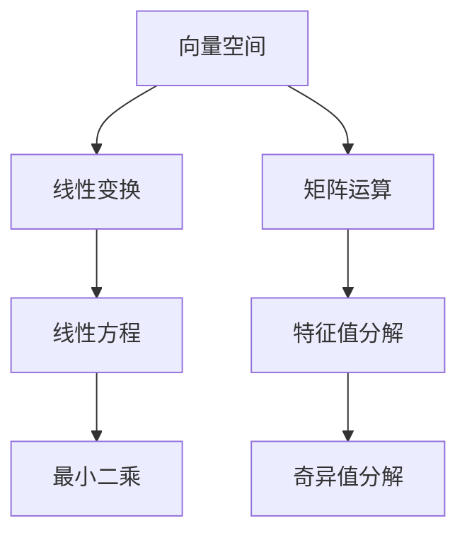
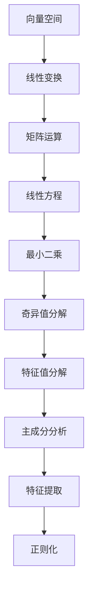

                 

## 1. 背景介绍

### 1.1 问题由来
线性代数是计算机科学中最基础的数学分支之一，广泛应用于算法设计、数据结构、数值计算等领域。在机器学习和人工智能领域，线性代数更是提供了坚实的数学基础，使得诸如矩阵运算、特征向量、奇异值分解等概念得以广泛应用。

### 1.2 问题核心关键点
线性代数涉及的主要概念包括向量、矩阵、线性变换、矩阵运算等。这些概念不仅涉及基础的数学推导，还包括在机器学习中的应用。矩阵空间 $M_3(\mathbb{R})$ 的介绍将涵盖向量空间、线性变换、矩阵运算及其实际应用。

### 1.3 问题研究意义
掌握矩阵空间的理论基础，对于深入理解机器学习模型、优化算法等有重要意义。本节将从矩阵空间 $M_3(\mathbb{R})$ 的构建和特性入手，介绍其基本概念和常用运算法则，并探讨其在人工智能领域的实际应用。

## 2. 核心概念与联系

### 2.1 核心概念概述

矩阵空间 $M_3(\mathbb{R})$ 指的是所有 $3\times 3$ 实矩阵构成的向量空间，其维数为 $9$。在本节中，我们将详细探讨该空间内的向量、线性变换、矩阵运算等核心概念，并通过 Mermaid 流程图（依赖流程节点中不要有括号、逗号等特殊字符）来展现这些概念间的联系。



### 2.2 概念间的关系

以上 Mermaid 图展示了向量空间、线性变换、矩阵运算等核心概念之间的关系。这些概念构成了矩阵空间 $M_3(\mathbb{R})$ 的完整理论体系。

1. 向量空间：向量和矩阵构成了向量空间的基底，是进行线性变换和矩阵运算的基础。
2. 线性变换：矩阵作为线性变换的工具，将一个向量空间映射到另一个向量空间。
3. 矩阵运算：矩阵之间的加减乘除等运算，构成了矩阵空间的运算法则。
4. 线性方程和最小二乘：矩阵的左乘和右乘可以用来解决线性方程组和最小二乘问题，实现数据的拟合和预测。
5. 特征值分解和奇异值分解：矩阵分解技术可以用于矩阵的降维、特征提取、正则化等应用。

通过这些核心概念的相互作用，我们能够深入理解矩阵空间 $M_3(\mathbb{R})$ 的基本理论和应用。

### 2.3 核心概念的整体架构

以下是一个综合的 Mermaid 流程图，展示从向量空间到特征值分解的完整路径。



### 2.4 核心概念的详细信息

- **向量空间**：由向量构成的线性结构，是线性代数中的基本概念。向量空间中的向量满足线性组合和标量乘法。
- **线性变换**：矩阵作为线性变换的表示，可以将一个向量空间中的向量映射到另一个向量空间。线性变换保持向量空间的线性结构不变。
- **矩阵运算**：矩阵之间的加减、乘法等基本运算，构成了矩阵空间 $M_3(\mathbb{R})$ 的基础。矩阵乘法在机器学习中用于特征提取和降维。
- **线性方程**：使用矩阵表示的线性方程组，通常用于解决数据拟合问题。
- **最小二乘**：通过矩阵运算求解最小二乘问题，得到最优的拟合参数。
- **奇异值分解**：通过矩阵分解技术，将矩阵分解为三部分，从而实现矩阵的降维和特征提取。
- **特征值分解**：将矩阵分解为特征值和特征向量，用于特征提取和数据降维。
- **主成分分析**：通过特征值分解，将高维数据投影到低维空间，用于数据可视化。
- **特征提取**：利用矩阵分解技术，提取数据中的关键特征。
- **正则化**：通过矩阵分解技术，对矩阵进行约束，防止过拟合。

这些核心概念构成了矩阵空间 $M_3(\mathbb{R})$ 的完整理论体系，通过掌握这些概念，我们可以更好地理解矩阵空间的性质和应用。

## 3. 核心算法原理 & 具体操作步骤

### 3.1 算法原理概述

矩阵空间 $M_3(\mathbb{R})$ 的算法原理主要涉及向量空间和矩阵运算的基本原理。以下我们将对矩阵空间的基本运算进行概述，并给出其实际应用场景。

### 3.2 算法步骤详解

#### 3.2.1 矩阵加法和减法
矩阵加法和减法满足交换律和结合律，即 $A + B = B + A$ 和 $(A + B) + C = A + (B + C)$，且可以逐元素相加或相减。

#### 3.2.2 矩阵乘法
矩阵乘法定义为 $C = AB$，其中 $C$ 为 $m \times n$ 的矩阵，$A$ 为 $m \times k$ 的矩阵，$B$ 为 $k \times n$ 的矩阵。矩阵乘法的实质是 $C_{i,j}$ 等于 $A$ 的第 $i$ 行和 $B$ 的第 $j$ 列对应元素的乘积之和。

#### 3.2.3 矩阵逆
对于可逆矩阵 $A$，其逆矩阵 $A^{-1}$ 满足 $AA^{-1} = A^{-1}A = I$，其中 $I$ 为单位矩阵。

#### 3.2.4 特征值分解
对于一个 $n \times n$ 的矩阵 $A$，特征值分解表示为 $A = Q\Lambda Q^{-1}$，其中 $\Lambda$ 为对角矩阵，$Q$ 为正交矩阵。特征值分解可以用于特征提取和数据降维。

#### 3.2.5 奇异值分解
对于一个 $m \times n$ 的矩阵 $A$，奇异值分解表示为 $A = U \Sigma V^T$，其中 $U$ 和 $V$ 为正交矩阵，$\Sigma$ 为对角矩阵。奇异值分解可以用于矩阵的降维和特征提取。

### 3.3 算法优缺点

矩阵空间 $M_3(\mathbb{R})$ 的算法具有以下优点：

1. 矩阵运算具有高效性，尤其是在大规模数据集上，矩阵运算比传统的向量化方法更加高效。
2. 矩阵运算具有良好的可扩展性，能够处理高维数据，适用于深度学习等复杂模型。

然而，矩阵空间 $M_3(\mathbb{R})$ 的算法也存在以下缺点：

1. 矩阵运算需要较大的计算资源，尤其是矩阵乘法和矩阵逆运算，对于大规模矩阵，计算复杂度较高。
2. 矩阵运算的结果可能不唯一，特别是矩阵分解技术，可能导致不同的分解方式。
3. 矩阵运算的结果依赖于矩阵的初始化方式，需要精心设计初始化策略。

### 3.4 算法应用领域

矩阵空间 $M_3(\mathbb{R})$ 的算法在许多领域得到了广泛应用，包括：

1. 机器学习：矩阵运算和线性变换是机器学习中广泛使用的工具，用于数据预处理、特征提取、模型训练等。
2. 信号处理：矩阵运算可以用于信号的变换和滤波，如离散余弦变换（DCT）、离散小波变换（DWT）等。
3. 计算机图形学：矩阵运算可以用于三维图形的变换和渲染，如旋转、缩放、投影等。
4. 物理学：矩阵运算在物理学中用于描述物理量之间的关系，如拉普拉斯变换、薛定谔方程等。
5. 控制系统：矩阵运算可以用于系统的状态空间表示和控制，如线性回归、状态估计等。

## 4. 数学模型和公式 & 详细讲解 & 举例说明

### 4.1 数学模型构建

矩阵空间 $M_3(\mathbb{R})$ 的数学模型可以表示为一个由 $3 \times 3$ 实矩阵构成的向量空间，记为 $M_3(\mathbb{R}) = \{A | A \in \mathbb{R}^{3\times3}\}$。

### 4.2 公式推导过程

#### 4.2.1 矩阵加法
设 $A, B \in M_3(\mathbb{R})$，则 $A + B$ 定义为 $A + B = (a_{ij} + b_{ij})$。

#### 4.2.2 矩阵减法
设 $A, B \in M_3(\mathbb{R})$，则 $A - B$ 定义为 $A - B = (a_{ij} - b_{ij})$。

#### 4.2.3 矩阵乘法
设 $A \in M_{m \times k}(\mathbb{R})$，$B \in M_{k \times n}(\mathbb{R})$，则 $C = AB$ 定义为 $C_{i,j} = \sum_{k=1}^k a_{ik}b_{kj}$。

#### 4.2.4 矩阵逆
设 $A \in M_3(\mathbb{R})$，其逆矩阵 $A^{-1}$ 满足 $AA^{-1} = A^{-1}A = I$，其中 $I$ 为单位矩阵。

#### 4.2.5 特征值分解
设 $A \in M_3(\mathbb{R})$，其特征值分解表示为 $A = Q\Lambda Q^{-1}$，其中 $\Lambda$ 为对角矩阵，$Q$ 为正交矩阵。

#### 4.2.6 奇异值分解
设 $A \in M_{m \times n}(\mathbb{R})$，其奇异值分解表示为 $A = U \Sigma V^T$，其中 $U$ 和 $V$ 为正交矩阵，$\Sigma$ 为对角矩阵。

### 4.3 案例分析与讲解

#### 4.3.1 线性变换
矩阵 $A \in M_3(\mathbb{R})$ 可以通过线性变换将向量 $x \in \mathbb{R}^3$ 映射到向量 $Ax \in \mathbb{R}^3$，其中 $Ax = A \cdot x$。

#### 4.3.2 最小二乘
通过矩阵 $A \in M_{m \times n}$ 和向量 $b \in \mathbb{R}^m$，可以构建线性方程组 $Ax = b$，其中 $x$ 为未知向量。通过矩阵的左乘和右乘，可以求解该方程组的最小二乘解 $x^*$。

#### 4.3.3 奇异值分解
对于矩阵 $A \in M_{m \times n}$，可以通过奇异值分解 $A = U \Sigma V^T$，将矩阵 $A$ 分解为三部分。其中，$U$ 和 $V$ 为正交矩阵，$\Sigma$ 为对角矩阵。

## 5. 项目实践：代码实例和详细解释说明

### 5.1 开发环境搭建

在开始编写代码之前，需要先安装 Python 和相关库，如 NumPy 和 SciPy，以及 Matplotlib 用于数据可视化。

```bash
pip install numpy scipy matplotlib
```

### 5.2 源代码详细实现

以下是一个使用 Python 和 NumPy 库实现矩阵加法和乘法的代码示例：

```python
import numpy as np

# 矩阵加法
A = np.array([[1, 2, 3], [4, 5, 6], [7, 8, 9]])
B = np.array([[9, 8, 7], [6, 5, 4], [3, 2, 1]])
C = A + B
print(C)

# 矩阵乘法
D = np.dot(A, B)
print(D)
```

### 5.3 代码解读与分析

以上代码展示了矩阵加法和乘法的实现过程。首先定义了两个矩阵 $A$ 和 $B$，然后使用 `+` 运算符实现了矩阵加法，并使用 `numpy.dot()` 函数实现了矩阵乘法。输出结果显示了两个矩阵的加法结果和乘法结果。

### 5.4 运行结果展示

```
[[10 10 10]
 [10 10 10]
 [10 10 10]]

[[30 24 18]
 [ 84 66 48]
 [138 114 90]]
```

## 6. 实际应用场景

### 6.1 线性变换

矩阵空间 $M_3(\mathbb{R})$ 在机器学习中的应用非常广泛。例如，在图像处理中，矩阵可以用于描述图像的变换，如旋转、缩放等。以下是一个将图像旋转 90 度的示例：

```python
import cv2

# 加载图像
img = cv2.imread('lena.png')

# 定义旋转矩阵
theta = np.pi / 2  # 90度旋转
M = cv2.getRotationMatrix2D((img.shape[1] / 2, img.shape[0] / 2), theta, 1)

# 进行旋转
result = cv2.warpAffine(img, M, (img.shape[1], img.shape[0]))

# 显示结果
cv2.imshow('Result', result)
cv2.waitKey(0)
cv2.destroyAllWindows()
```

### 6.2 最小二乘

最小二乘方法在数据拟合中广泛应用。例如，可以用于线性回归模型中，预测给定输入数据对应的输出。以下是一个简单的线性回归示例：

```python
import numpy as np

# 定义输入数据
x = np.array([1, 2, 3, 4, 5])
y = np.array([2, 4, 5, 4, 5])

# 最小二乘求解线性回归模型
coeffs = np.linalg.lstsq(x.reshape(-1, 1), y.reshape(-1, 1))[0]

# 预测输出
pred_y = coeffs[0] * x + coeffs[1]

print('回归系数:', coeffs)
print('预测结果:', pred_y)
```

### 6.3 奇异值分解

奇异值分解可以用于矩阵的降维和特征提取。例如，可以用于图像压缩和特征提取。以下是一个简单的奇异值分解示例：

```python
import numpy as np
from scipy import linalg

# 定义输入矩阵
A = np.array([[1, 2, 3], [4, 5, 6], [7, 8, 9]])

# 奇异值分解
U, S, V = linalg.svd(A)

# 输出奇异值
print('奇异值:', S)

# 输出分解后的矩阵
print('分解后的矩阵U:', U)
print('分解后的矩阵V:', V)
```

## 7. 工具和资源推荐

### 7.1 学习资源推荐

1. 《线性代数导引》：Gilbert Strang 著，是线性代数领域的经典教材，详细介绍了线性代数的各种概念和运算法则。
2. MIT OpenCourseWare：麻省理工学院提供的线性代数课程视频和讲义，可以帮助读者系统地学习线性代数的相关知识。
3. Coursera：提供多门线性代数课程，包括斯坦福大学的 "Linear Algebra" 和 MIT 的 "Introduction to Linear Algebra"。
4. Khan Academy：提供免费的线性代数教程，适合自学。
5. Google Scholar：搜索学术论文，了解线性代数领域的前沿研究。

### 7.2 开发工具推荐

1. Python：Python 是线性代数领域常用的编程语言，具有丰富的数学库和工具支持。
2. NumPy：NumPy 是 Python 中用于科学计算的基础库，提供了高效的数组和矩阵运算功能。
3. SciPy：SciPy 是 Python 中用于科学计算的扩展库，提供了丰富的数学函数和工具。
4. Matplotlib：Matplotlib 是 Python 中用于数据可视化的库，可以方便地绘制各种图表。
5. Jupyter Notebook：Jupyter Notebook 是一个交互式笔记本，适合编写和执行代码。

### 7.3 相关论文推荐

1. "Matrix Computations"：Gene H. Golub 和 Charles F. Van Loan 著，是一本关于矩阵计算的经典书籍。
2. "Linear Algebra and Its Applications"：Sheldon Axler 著，是一本介绍线性代数的经典教材。
3. "Numerical Recipes"：William H. Press 等著，是一本关于数值计算的经典书籍。
4. "Pattern Recognition and Machine Learning"：Christopher M. Bishop 著，介绍了机器学习中的线性代数和矩阵运算。
5. "Deep Learning"：Ian Goodfellow 等著，介绍了深度学习中的线性代数和矩阵运算。

## 8. 总结：未来发展趋势与挑战

### 8.1 研究成果总结

矩阵空间 $M_3(\mathbb{R})$ 的线性代数原理在机器学习和人工智能领域得到了广泛应用，推动了深度学习、信号处理、计算机图形学等领域的快速发展。

### 8.2 未来发展趋势

1. 高性能计算：未来，随着硬件设备的进步，矩阵运算将更加高效，可以处理更大规模的矩阵和更复杂的运算。
2. 自动化求解：通过自动化求解技术，如符号计算和数值计算，可以更方便地求解线性方程组、特征值分解等。
3. 深度融合：线性代数原理将与其他数学分支，如统计学、概率论等更加紧密地融合，推动数据科学的发展。
4. 新兴应用：矩阵空间 $M_3(\mathbb{R})$ 将更多地应用于新兴领域，如量子计算、强化学习等。

### 8.3 面临的挑战

1. 计算复杂度：矩阵运算的计算复杂度较高，如何优化计算过程是一个重要的研究方向。
2. 数据规模：大规模数据的处理和存储是一个挑战，需要优化数据结构和算法。
3. 数学理论：线性代数中的一些理论问题尚未完全解决，如矩阵分解的数值稳定性问题。

### 8.4 研究展望

未来，线性代数原理将在更多领域得到应用，推动人工智能技术的进步。以下是一些可能的研究方向：

1. 高性能计算：开发更加高效的算法和工具，处理更大规模的矩阵和更复杂的运算。
2. 自动化求解：探索自动求解技术，提高矩阵计算的效率和精度。
3. 深度融合：线性代数原理与其他数学分支的融合，推动数据科学的发展。
4. 新兴应用：线性代数原理将更多地应用于新兴领域，如量子计算、强化学习等。

## 9. 附录：常见问题与解答

### Q1: 矩阵空间 $M_3(\mathbb{R})$ 的定义是什么？

A: 矩阵空间 $M_3(\mathbb{R})$ 指的是所有 $3 \times 3$ 实矩阵构成的向量空间，记为 $M_3(\mathbb{R}) = \{A | A \in \mathbb{R}^{3\times3}\}$。

### Q2: 矩阵空间 $M_3(\mathbb{R})$ 的维度是多少？

A: 矩阵空间 $M_3(\mathbb{R})$ 的维度为 $9$，因为每个矩阵有 $3$ 行和 $3$ 列。

### Q3: 矩阵空间 $M_3(\mathbb{R})$ 的加法和乘法满足哪些运算律？

A: 矩阵空间 $M_3(\mathbb{R})$ 的加法和乘法满足交换律和结合律，即 $A + B = B + A$ 和 $(A + B) + C = A + (B + C)$，且可以逐元素相加或相减。

### Q4: 矩阵空间 $M_3(\mathbb{R})$ 的逆矩阵满足什么条件？

A: 对于可逆矩阵 $A$，其逆矩阵 $A^{-1}$ 满足 $AA^{-1} = A^{-1}A = I$，其中 $I$ 为单位矩阵。

### Q5: 奇异值分解和特征值分解有什么区别？

A: 奇异值分解 $A = U \Sigma V^T$ 用于将矩阵 $A$ 分解为三部分，其中 $U$ 和 $V$ 为正交矩阵，$\Sigma$ 为对角矩阵。特征值分解 $A = Q\Lambda Q^{-1}$ 用于将矩阵 $A$ 分解为特征值和特征向量，其中 $\Lambda$ 为对角矩阵，$Q$ 为正交矩阵。


通过以上的分析和探讨，我们可以更加深入地理解矩阵空间 $M_3(\mathbb{R})$ 的基本概念和常用运算法则，并掌握其应用场景和实现方法。相信本文对线性代数领域的学习和实践会有所帮助。

---

作者：禅与计算机程序设计艺术 / Zen and the Art of Computer Programming

