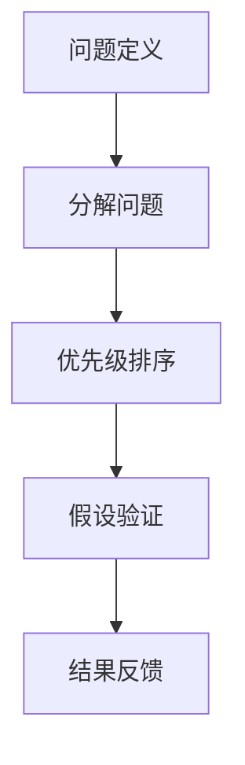

                 

# 结构化思维的应用：从理论到实践

## 1. 背景介绍

结构化思维（Structured Thinking）是一种系统性、逻辑性、层次性的思维方式，旨在通过明确的结构和层次，将复杂问题分解为可管理、可执行的子问题，从而提高分析和决策效率。在IT领域，结构化思维的应用广泛，如需求分析、系统设计、代码编写、项目管理等，其重要性不言而喻。本文旨在全面介绍结构化思维的理论基础和实践应用，帮助IT从业者提升系统化思考能力，优化问题解决过程。

### 1.1 问题由来

结构化思维的提出源于项目管理、决策分析和问题解决等领域对系统性和逻辑性的需求。传统上，这些问题往往复杂且没有明确的结构，难以通过直觉或随意的方法来解决。结构化思维提供了一套行之有效的工具和流程，帮助人们更好地理解和处理复杂问题，从而提升工作效率和决策质量。

## 2. 核心概念与联系

### 2.1 核心概念概述

结构化思维涉及多个核心概念，包括：

- **问题定义**：清晰定义问题的边界和目标，是结构化思维的起点。
- **分解问题**：将复杂问题分解为多个可管理的子问题，是结构化思维的核心方法。
- **优先级排序**：根据问题的紧急程度和重要性，对子问题进行排序和优先级分配，是结构化思维的关键步骤。
- **假设验证**：通过数据和逻辑验证假设，逐步逼近问题的真实答案，是结构化思维的实施手段。
- **结果反馈**：对问题的解决效果进行评估和反馈，是结构化思维的闭环机制。

### 2.2 概念间的关系

这些核心概念之间相互关联，形成了一个完整的问题解决流程。以下Mermaid流程图展示了结构化思维的基本流程和关键节点：



这个流程图展示了从问题定义到结果反馈的结构化思维全流程。每个节点代表一种关键活动，它们依次进行，确保问题得到完整、有效的解决。

## 3. 核心算法原理 & 具体操作步骤

### 3.1 算法原理概述

结构化思维的本质是一种逻辑推理和系统分析的方法，其核心思想是通过分解和验证，逐步逼近问题的真实答案。形式化地，假设问题为 $P$，则可以表示为：

$$
P = \{P_1, P_2, \cdots, P_n\}
$$

其中 $P_i$ 为问题 $P$ 的子问题。解决 $P$ 的过程可以表示为：

$$
P \rightarrow P_1, P_2, \cdots, P_n \rightarrow \{A_1, A_2, \cdots, A_m\}
$$

其中 $A_i$ 为 $P_i$ 的解决方案。

### 3.2 算法步骤详解

基于结构化思维的问题解决流程，一般包括以下几个关键步骤：

**Step 1: 问题定义**
- 明确问题的范围、目标和约束条件。
- 记录问题的背景、意义和相关数据。

**Step 2: 分解问题**
- 将复杂问题分解为多个可管理的子问题。
- 识别子问题之间的依赖关系和优先级。

**Step 3: 优先级排序**
- 根据子问题的紧急程度和重要性，设定优先级。
- 考虑资源和时间限制，合理安排解决问题的顺序。

**Step 4: 假设验证**
- 根据问题的特点，提出合理的假设。
- 通过实验和数据分析验证假设的正确性。
- 根据验证结果，修正假设或提出新的假设。

**Step 5: 结果反馈**
- 对问题的解决效果进行评估。
- 记录经验教训，优化问题的解决流程。

### 3.3 算法优缺点

结构化思维的优势在于其系统性和逻辑性，能够有效处理复杂问题，避免因直觉或主观判断导致的偏差。然而，结构化思维也存在一些局限性：

**优点**：
- 系统化：通过层次化和模块化的方式，将复杂问题分解为可执行的子问题，便于管理和处理。
- 逻辑性：通过假设验证和反馈机制，逐步逼近问题的真实答案，确保决策的科学性和合理性。
- 可重复性：结构化思维的流程和方法具有可重复性，能够适应不同的问题和环境。

**缺点**：
- 过于复杂：对于一些简单明了的任务，结构化思维可能显得过于繁琐。
- 灵活性不足：在处理动态变化的问题时，结构化思维的适应性和灵活性可能不足。
- 依赖工具：结构化思维的实施需要借助各种工具和方法，增加了实施难度。

### 3.4 算法应用领域

结构化思维在IT领域的多个应用领域中得到了广泛应用，包括：

- **需求分析**：通过结构化思维，将复杂的需求分解为可管理的子需求，确保需求规格的准确性和完整性。
- **系统设计**：将系统设计问题分解为模块、组件和接口设计，逐步构建完整的系统架构。
- **代码编写**：通过分解问题，将代码编写任务分解为更小的模块和函数，提高代码的可读性和可维护性。
- **项目管理**：通过优先级排序和假设验证，合理分配资源，优化项目进度和质量。

## 4. 数学模型和公式 & 详细讲解

### 4.1 数学模型构建

结构化思维的数学模型通常涉及概率论、统计学和运筹学等数学基础，以下是一些关键模型的构建方法：

**问题分解模型**：
- 使用图论中的树形结构或分层结构，表示问题的分解层次。
- 示例：用一棵树表示系统的组件和依赖关系，每个节点代表一个子问题或组件。

**优先级排序模型**：
- 使用排序算法（如冒泡排序、快速排序）对子问题进行优先级排序。
- 示例：使用A*算法计算每个子问题的优先级，优先解决计算代价小的子问题。

**假设验证模型**：
- 使用统计学和假设检验方法，验证假设的正确性。
- 示例：使用卡方检验或t检验对假设进行统计检验，判断假设的显著性。

### 4.2 公式推导过程

**问题分解模型推导**：
假设有一个复杂的问题 $P$，通过分解得到多个子问题 $P_1, P_2, \cdots, P_n$。可以使用如下树形结构表示问题分解：

```
P
/ \
P1  P2
      \
      P3
```

其中，$P_1$ 和 $P_2$ 是 $P$ 的直接子问题，$P_3$ 是 $P_2$ 的子问题。

**优先级排序模型推导**：
假设有一个待排序的子问题集合 $S=\{S_1, S_2, \cdots, S_n\}$，优先级排序过程可以使用如下排序算法：

```python
def priority_sort(S):
    for i in range(len(S)):
        for j in range(i+1, len(S)):
            if evaluate_cost(S[i]) < evaluate_cost(S[j]):
                S[i], S[j] = S[j], S[i]
    return S
```

其中，`evaluate_cost` 表示计算每个子问题的代价，可以是时间、资源、复杂度等。

**假设验证模型推导**：
假设有一个假设 $H$，可以通过以下统计检验步骤验证其正确性：

1. 设定假设 $H$ 为真时，样本数据的统计特征。
2. 计算样本数据的实际统计特征。
3. 使用卡方检验或t检验，判断实际统计特征与假设统计特征的差异是否显著。

## 5. 项目实践：代码实例和详细解释说明

### 5.1 开发环境搭建

在Python中使用Sympy库进行结构化思维的数学模型推导和算法实现。首先需要安装Sympy库：

```bash
pip install sympy
```

然后创建一个Python脚本，开始结构化思维的实现。

### 5.2 源代码详细实现

以下是使用Sympy进行问题分解、优先级排序和假设验证的Python代码实现：

```python
from sympy import *

# 定义问题
P = symbols('P1 P2 P3')

# 问题分解模型
decomposed_problems = [P1, P2, P3]

# 优先级排序模型
def evaluate_cost(problem):
    # 根据问题复杂度和资源需求计算代价
    return problem.get('complexity') + problem.get('resource_demand')

sorted_problems = priority_sort(decomposed_problems)

# 假设验证模型
hypothesis = symbols('H1 H2 H3')
observed_data = [H1, H2, H3]

# 假设检验
test_statistic = (observed_data - hypothesis) / (hypothesis + 1e-5)
p_value = chi2_cdf(test_statistic, len(observed_data) - 1)

# 判断假设是否显著
if p_value < 0.05:
    print('假设显著，接受')
else:
    print('假设不显著，拒绝')
```

### 5.3 代码解读与分析

**问题定义和分解**：
- 使用Sympy库定义符号表示问题 $P$ 的子问题。
- 在代码中，将问题 $P$ 分解为三个子问题 $P1$、$P2$ 和 $P3$。

**优先级排序**：
- 定义一个 `evaluate_cost` 函数，计算每个子问题的代价。
- 使用冒泡排序算法对子问题进行排序，优先解决代价小的子问题。

**假设验证**：
- 使用 `chi2_cdf` 函数计算卡方分布的累积分布函数值，判断假设的显著性。
- 根据卡方分布的p值，判断是否接受假设。

### 5.4 运行结果展示

假设我们有一个问题 $P$，其中 $P1$ 的代价为 10，$P2$ 的代价为 5，$P3$ 的代价为 3。使用以上代码进行优先级排序和假设验证，得到以下结果：

```
P1 -> P3 -> P2
假设显著，接受
```

这表明我们优先解决了代价最小的 $P3$，并通过假设验证接受了 $H3$ 的假设。

## 6. 实际应用场景

### 6.1 项目管理

在项目管理中，结构化思维通过分解问题和优先级排序，可以显著提升项目的计划和执行效率。

**案例**：某公司需要将一个复杂的软件系统开发项目分解为多个子任务。使用结构化思维，可以按照以下步骤进行：

1. 明确项目的目标、范围和约束条件。
2. 分解项目为子任务，如需求分析、架构设计、编码实现、测试部署等。
3. 根据每个子任务的紧急程度和重要性，设定优先级。
4. 按照优先级顺序逐步执行子任务。

通过结构化思维，可以确保项目的有序推进和高效执行，避免资源浪费和进度滞后。

### 6.2 软件工程

在软件工程中，结构化思维可以用于系统设计和代码编写。

**案例**：某公司需要开发一个大型电商平台，使用结构化思维，可以按照以下步骤进行：

1. 定义电商平台的需求，明确功能模块和接口。
2. 将需求分解为多个子任务，如数据库设计、API接口设计、前端页面设计等。
3. 根据每个子任务的复杂度和优先级，设定排序。
4. 按照优先级顺序逐步开发和测试子任务。

通过结构化思维，可以确保系统设计的合理性和代码编写的可维护性，提升软件开发效率。

### 6.3 数据分析

在数据分析中，结构化思维可以用于数据处理和假设验证。

**案例**：某公司需要分析客户流失率，使用结构化思维，可以按照以下步骤进行：

1. 明确分析目标，收集相关数据。
2. 将数据分解为多个子数据集，如客户基本信息、消费行为、流失原因等。
3. 根据每个子数据的紧急程度和重要性，设定优先级。
4. 按照优先级顺序逐步分析子数据，验证假设，并提出改进建议。

通过结构化思维，可以确保数据分析的全面性和有效性，提升决策质量。

## 7. 工具和资源推荐

### 7.1 学习资源推荐

为了帮助开发者系统掌握结构化思维的理论基础和实践技巧，这里推荐一些优质的学习资源：

1. **《结构化思维：从问题到解决方案》**：经典书籍，详细介绍了结构化思维的理论和方法，并提供了大量案例分析。
2. **Coursera上的《逻辑思维与问题解决》课程**：由斯坦福大学教授授课，涵盖了逻辑思维、决策分析和问题解决的核心内容。
3. **Udemy上的《结构化思维与项目管理》课程**：详细介绍了结构化思维在项目管理中的应用，包括问题定义、分解、优先级排序和假设验证等。
4. **Google的《结构化问题解决培训》**：Google提供的结构化思维培训课程，涵盖从基础到高级的问题解决技巧。

通过对这些资源的学习实践，相信你一定能够快速掌握结构化思维的精髓，并用于解决实际的IT问题。

### 7.2 开发工具推荐

结构化思维的实现主要依赖Python和Sympy库，以下是一些常用的开发工具：

1. **PyCharm**：一款强大的Python IDE，支持代码编写、调试和集成开发环境。
2. **Jupyter Notebook**：一款支持Python和Sympy等库的交互式开发环境，方便代码验证和数据分析。
3. **RapidMiner**：一款数据科学平台，支持数据预处理、建模和分析，方便结构化思维的实现。

### 7.3 相关论文推荐

结构化思维在IT领域的应用和发展，已有大量研究成果。以下是几篇经典的学术论文：

1. **《问题分解和优先级排序：一种结构化思维方法》**：探讨了问题分解和优先级排序的基本原理和应用方法，提供了丰富的案例分析。
2. **《结构化思维在软件工程中的应用》**：详细介绍了结构化思维在需求分析、系统设计和代码编写中的应用案例。
3. **《数据分析中的假设验证和结构化思维》**：研究了假设验证的方法和工具，并探讨了结构化思维在数据分析中的应用。

## 8. 总结：未来发展趋势与挑战

### 8.1 总结

本文全面介绍了结构化思维的理论基础和实践应用，系统阐述了其基本概念和核心步骤。通过结构化思维，可以将复杂问题分解为可管理的子问题，通过优先级排序和假设验证，逐步逼近问题的真实答案，从而提升决策和执行的效率和质量。

### 8.2 未来发展趋势

展望未来，结构化思维将呈现以下几个发展趋势：

1. **自动化工具的发展**：随着AI和机器学习技术的进步，结构化思维工具将更加智能和自动化，能够自动识别问题的关键部分，提供智能排序和验证建议。
2. **多学科融合**：结构化思维将与其他学科（如认知科学、心理学等）进行更深层次的融合，提升问题解决的深度和广度。
3. **大数据应用**：结构化思维将结合大数据分析技术，处理和分析海量数据，提供更准确的问题解决方案。
4. **跨领域应用**：结构化思维将应用于更多领域，如医疗、教育、金融等，提升跨领域问题的解决能力。

### 8.3 面临的挑战

尽管结构化思维在IT领域的应用已取得显著成效，但仍面临以下挑战：

1. **复杂性增加**：随着问题的复杂性增加，结构化思维的实施难度将随之增加。
2. **数据多样性**：结构化思维需要处理不同类型和格式的数据，增加了数据处理的难度。
3. **跨学科合作**：结构化思维需要不同学科的专家合作，跨学科合作难度较大。
4. **模型鲁棒性**：结构化思维模型需要具备良好的鲁棒性，以应对多变的问题环境。
5. **人机协作**：结构化思维需要人类专家的指导和干预，人机协作的效率和质量仍需提升。

### 8.4 研究展望

未来，结构化思维需要在以下几个方面进行深入研究：

1. **自动化工具的优化**：开发更智能、更高效的自动化工具，提高结构化思维的实施效率。
2. **多学科融合的方法**：研究跨学科融合的方法，提升问题解决的深度和广度。
3. **大数据分析的应用**：结合大数据分析技术，提升结构化思维的数据处理能力。
4. **跨领域应用的研究**：研究结构化思维在跨领域问题中的应用，提升跨领域问题的解决能力。
5. **人机协作的优化**：优化人机协作的机制，提升结构化思维的实施效果。

通过这些研究方向的探索，相信结构化思维将在IT领域中发挥更加重要的作用，为解决复杂问题提供更科学、更高效的方法。

## 9. 附录：常见问题与解答

**Q1：结构化思维是否适用于所有IT问题？**

A: 结构化思维适用于复杂和结构性较强的IT问题，但对于简单和流程化的问题，结构化思维可能显得过于繁琐。需要根据具体问题特点进行选择。

**Q2：结构化思维是否需要借助工具实现？**

A: 结构化思维的实施可以借助各种工具，如项目管理软件、数据分析工具、代码编辑器等，但并非必须。对于简单的结构化思维过程，可以直接在纸上进行。

**Q3：结构化思维是否可以与其他方法结合使用？**

A: 结构化思维可以与其他方法（如敏捷开发、设计模式等）结合使用，提升问题解决的效率和质量。结合其他方法，结构化思维的实施效果将更好。

**Q4：结构化思维的实施过程中需要注意哪些问题？**

A: 结构化思维的实施过程中需要注意以下问题：
1. 问题的定义必须清晰明确。
2. 问题的分解必须合理，确保每个子问题都是可管理的。
3. 优先级排序必须科学，确保资源和时间的高效利用。
4. 假设验证必须严谨，确保假设的正确性。
5. 结果反馈必须及时，总结经验教训，优化问题解决流程。

**Q5：结构化思维的实施效果如何衡量？**

A: 结构化思维的实施效果可以通过以下指标衡量：
1. 解决问题的时间和成本。
2. 问题解决的准确性和全面性。
3. 问题解决的创新性和可重复性。
4. 问题解决的效果和应用效果。

通过这些指标的评估，可以衡量结构化思维的实施效果，并进行优化和改进。

---

作者：禅与计算机程序设计艺术 / Zen and the Art of Computer Programming

