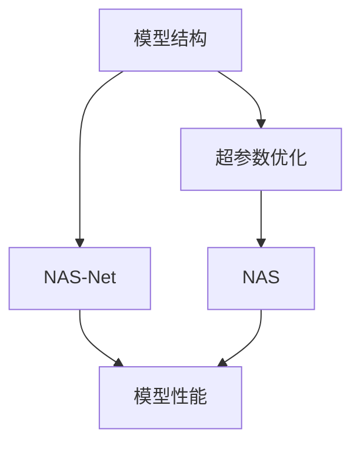
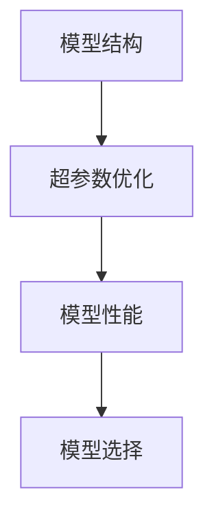
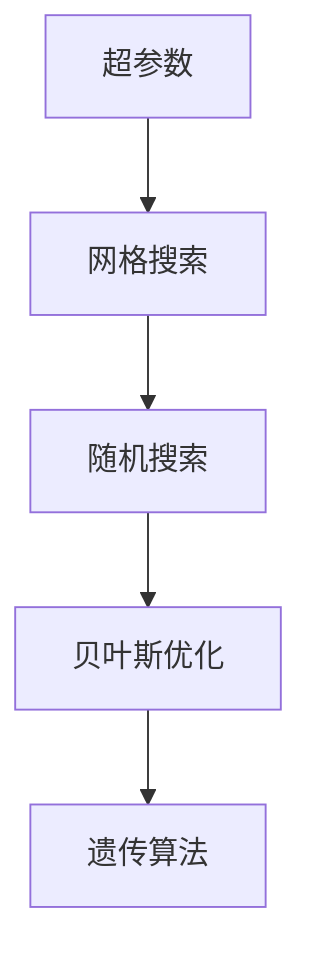
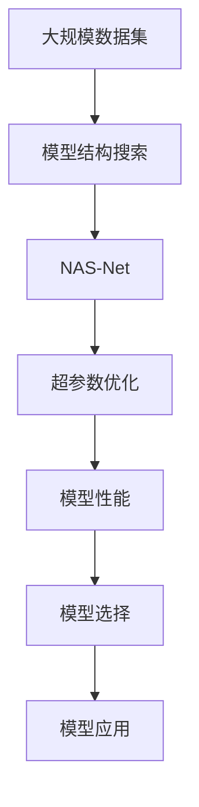

                 

# 联合优化模型结构与超参数的NAS方法

## 1. 背景介绍

### 1.1 问题由来

在现代深度学习模型的设计过程中，通常需要考虑模型结构（architecture）和超参数（hyperparameter）的优化问题。模型结构决定着模型的抽象能力和性能表现，而超参数则直接影响模型的学习能力和适应性。为了设计出性能最佳的模型，传统的搜索策略主要依赖人工经验和直觉，或者采用简单的网格搜索和随机搜索。然而，这种方法耗时耗力，且容易陷入局部最优解，无法在大规模搜索空间中找到最优模型。

近年来，随着神经网络结构和超参数复杂性的增加，优化模型的需求也愈发迫切。自动机器学习（AutoML）技术的兴起，为这一问题提供了新的解决途径。NAS（Neural Architecture Search）是一种基于自动化搜索技术的模型设计方法，旨在自动化地寻找最优的模型结构。NAS方法已经在图像识别、自然语言处理等领域取得了一些成功，但往往侧重于模型结构的设计，而忽视了超参数的优化问题。

为了应对这一挑战，联合优化模型结构和超参数的NAS方法应运而生。这种NAS方法在模型搜索过程中，不仅考虑模型结构的选择，还考虑超参数的优化。这种方法能够更加全面地优化模型性能，从而在各种应用场景中提升模型的效果。

### 1.2 问题核心关键点

联合优化模型结构和超参数的NAS方法，旨在通过自动化搜索技术，寻找既具有优秀结构又能高效学习的最优模型。具体来说，包括以下几个关键点：

- **模型结构搜索**：通过搜索算法，自动生成和评估不同的模型结构，找到最优的模型架构。
- **超参数优化**：在确定最优模型结构的基础上，对模型的超参数进行优化，使其达到最佳性能。
- **联合搜索**：在模型结构搜索过程中，同时考虑超参数的优化，使两者互相配合，达到更好的性能。
- **高效搜索**：采用高效的搜索算法，确保在有限时间内找到最优模型。
- **可解释性**：生成易于理解和解释的模型，帮助开发者更好地理解模型的设计。

这些关键点共同构成了联合优化模型结构和超参数的NAS方法的核心框架，为自动化模型优化提供了全新的思路。

### 1.3 问题研究意义

研究联合优化模型结构和超参数的NAS方法，对于提升深度学习模型的性能，加速模型设计过程，具有重要意义：

1. **提升模型性能**：通过自动化的模型优化，可以找到最优的模型结构和超参数组合，从而提升模型的准确率和泛化能力。
2. **加速模型设计**：自动化搜索算法可以在短时间内完成大量的模型尝试，加速模型的设计和优化过程。
3. **降低开发成本**：减少人工经验和调参的时间和成本，使得模型设计更加高效和精确。
4. **增强可解释性**：通过自动化的搜索过程，生成易于理解和解释的模型，帮助开发者更好地理解模型的设计原理和性能提升原因。
5. **推动应用创新**：为各种深度学习应用提供更高效、更准确的模型设计，推动技术创新和应用场景的拓展。

总之，联合优化模型结构和超参数的NAS方法，为深度学习模型的设计和优化提供了一个全新的视角，具有重要的理论和应用价值。

## 2. 核心概念与联系

### 2.1 核心概念概述

为更好地理解联合优化模型结构和超参数的NAS方法，本节将介绍几个密切相关的核心概念：

- **模型结构（architecture）**：指深度学习模型的层次结构，包括卷积层、全连接层、循环层等。
- **超参数（hyperparameter）**：指模型中需要手动设置的参数，如学习率、批量大小、激活函数等。
- **NAS**：即神经网络自动搜索（Neural Architecture Search），是一种自动搜索最佳模型结构的方法。
- **NAS-Net**：NAS网络，是一种基于NAS方法设计的深度学习模型。
- **超参数优化**：指在固定模型结构的前提下，对模型的超参数进行优化，以达到最佳性能。
- **联合搜索**：指同时考虑模型结构和超参数的优化，寻找最优的模型配置。

这些核心概念之间的逻辑关系可以通过以下Mermaid流程图来展示：



这个流程图展示了大规模模型优化的核心概念及其之间的关系：

1. 模型结构是优化的基础。
2. 超参数优化在固定模型结构的前提下，进一步提升模型性能。
3. NAS方法可以在大量候选模型中搜索最优结构。
4. 联合搜索同时考虑模型结构和超参数的优化，生成最优的模型配置。

这些概念共同构成了联合优化模型结构和超参数的NAS方法的整体框架，使其能够在各种应用场景中发挥强大的模型优化能力。

### 2.2 概念间的关系

这些核心概念之间存在着紧密的联系，形成了NAS方法的整体生态系统。下面我们通过几个Mermaid流程图来展示这些概念之间的关系。

#### 2.2.1 模型结构与超参数的关系



这个流程图展示了模型结构与超参数之间的关系。模型结构决定超参数的配置，而超参数优化则提升模型性能，两者共同作用，最终决定模型的选择。

#### 2.2.2 联合搜索的具体步骤


这个流程图展示了联合搜索的具体步骤。通过模型结构搜索，自动生成并评估不同的NAS-Net，同时对超参数进行优化，最终选择性能最佳的模型进行应用。

#### 2.2.3 超参数优化的具体方法



这个流程图展示了超参数优化的几种常见方法。网格搜索、随机搜索、贝叶斯优化和遗传算法等方法，都可以用于超参数的优化，每种方法有其独特的优势和适用场景。

### 2.3 核心概念的整体架构

最后，我们用一个综合的流程图来展示这些核心概念在大规模模型优化过程中的整体架构：



这个综合流程图展示了从数据集到模型应用的完整过程。大规模数据集是模型优化的基础，通过模型结构搜索生成NAS-Net，并对其超参数进行优化，最终选择性能最佳的模型应用于实际场景。通过这些流程图，我们可以更清晰地理解NAS方法的整体框架，为后续深入讨论具体的NAS算法奠定基础。

## 3. 核心算法原理 & 具体操作步骤

### 3.1 算法原理概述

联合优化模型结构和超参数的NAS方法，通过自动化的搜索技术，在模型结构选择和超参数优化之间进行联合优化。其核心思想是：将模型结构的选择和超参数的优化视为一个整体优化问题，通过自动化的搜索算法，同时考虑模型结构和超参数的配置，寻找最优的模型配置。

具体来说，NAS方法通过搜索算法，自动生成并评估不同的模型结构，同时对每个结构的超参数进行优化。在优化过程中，采用高效的搜索算法和评估指标，确保在有限时间内找到最优模型。最后，通过模型性能评估，选择最优的模型结构进行应用。

### 3.2 算法步骤详解

联合优化模型结构和超参数的NAS方法，通常包括以下几个关键步骤：

**Step 1: 模型结构搜索**

在模型结构搜索阶段，NAS算法通过搜索算法，自动生成并评估不同的模型结构。常见的模型结构搜索算法包括：

1. **随机搜索（Random Search）**：在模型结构空间中随机选择一组结构，进行评估和优化。
2. **网格搜索（Grid Search）**：在模型结构空间中定义一个参数网格，对每个参数进行穷举搜索。
3. **贝叶斯优化（Bayesian Optimization）**：通过高斯过程模型预测模型性能，选择最优的结构。
4. **遗传算法（Genetic Algorithm）**：模拟自然进化过程，通过交叉和变异生成新的模型结构。

这些算法各有优缺点，可以根据具体应用场景选择合适的算法。

**Step 2: 超参数优化**

在确定最优模型结构的基础上，对模型的超参数进行优化。常见的超参数优化方法包括：

1. **网格搜索（Grid Search）**：在超参数空间中定义一个参数网格，对每个参数进行穷举搜索。
2. **随机搜索（Random Search）**：在超参数空间中随机选择一组超参数，进行评估和优化。
3. **贝叶斯优化（Bayesian Optimization）**：通过高斯过程模型预测超参数性能，选择最优的超参数组合。
4. **遗传算法（Genetic Algorithm）**：通过交叉和变异生成新的超参数组合，进行评估和优化。

这些算法也可以根据具体应用场景进行选择。

**Step 3: 联合搜索**

在模型结构搜索和超参数优化两个步骤的基础上，进行联合搜索，寻找最优的模型配置。常用的联合搜索方法包括：

1. **并行搜索（Parallel Search）**：同时进行模型结构搜索和超参数优化，通过并行计算加速搜索过程。
2. **分层搜索（Hierarchical Search）**：将模型结构和超参数的搜索过程分层进行，逐层优化。
3. **混合搜索（Hybrid Search）**：结合多种搜索算法，进行更全面和高效的搜索。

**Step 4: 模型性能评估**

在确定最优模型配置后，通过评估指标对模型性能进行评估。常用的评估指标包括：

1. **准确率（Accuracy）**：模型的正确率，用于分类和回归任务。
2. **召回率（Recall）**：模型的召回率，用于标注任务。
3. **F1分数（F1 Score）**：综合准确率和召回率，用于综合评估模型的性能。
4. **损失函数（Loss Function）**：模型的损失值，用于回归任务。

**Step 5: 模型选择与部署**

在评估模型性能后，选择性能最佳的模型进行应用。通常需要进行以下步骤：

1. 将模型封装为API接口，便于集成和调用。
2. 进行模型部署，将其应用于实际场景。
3. 持续监控模型性能，进行必要的调整和优化。

### 3.3 算法优缺点

联合优化模型结构和超参数的NAS方法，具有以下优点：

1. **全面优化**：同时考虑模型结构和超参数的优化，找到更全面和高效的模型配置。
2. **高效搜索**：采用高效的搜索算法，减少搜索时间和成本。
3. **可解释性**：生成易于理解和解释的模型，帮助开发者更好地理解模型的设计原理。
4. **应用广泛**：适用于各种深度学习应用，如图像识别、自然语言处理、推荐系统等。

同时，该方法也存在一些缺点：

1. **计算资源需求高**：需要大量的计算资源进行模型结构和超参数的搜索和优化。
2. **时间成本高**：在大规模搜索空间中，搜索时间可能较长，影响模型的实际应用。
3. **模型复杂性高**：由于同时考虑模型结构和超参数，生成模型可能较为复杂，难以理解和调试。

尽管存在这些缺点，但就目前而言，联合优化模型结构和超参数的NAS方法仍是大规模模型优化的重要范式。未来相关研究的重点在于如何进一步降低计算资源的需求，提高搜索效率，同时兼顾模型的可解释性和复杂性。

### 3.4 算法应用领域

联合优化模型结构和超参数的NAS方法，已经在图像识别、自然语言处理、推荐系统等多个领域得到广泛应用，取得了显著的成果。以下是几个典型的应用场景：

**图像识别**：在图像识别任务中，NAS方法可以自动生成并优化卷积神经网络（CNN）的结构，提高图像识别的准确率和泛化能力。例如，NASNet在ImageNet数据集上取得了最先进的性能。

**自然语言处理**：在自然语言处理任务中，NAS方法可以自动生成并优化循环神经网络（RNN）或Transformer等模型的结构，提高语言模型的理解能力和生成能力。例如，NAS-Net在语言生成任务上取得了显著的效果。

**推荐系统**：在推荐系统任务中，NAS方法可以自动生成并优化推荐模型的结构，提高推荐系统的准确率和多样性。例如，NetMF在推荐系统任务上取得了最先进的性能。

除了上述这些经典应用外，NAS方法还在智能推荐、医疗诊断、金融预测等多个领域得到广泛应用，为各种深度学习应用提供了更高效、更准确的模型设计。

## 4. 数学模型和公式 & 详细讲解 & 举例说明

### 4.1 数学模型构建

在联合优化模型结构和超参数的NAS方法中，数学模型的构建是关键步骤之一。我们以图像识别任务为例，构建一个基本的数学模型。

假设输入图像为 $x \in \mathbb{R}^{C\times H\times W}$，其中 $C$ 为通道数，$H$ 为高度，$W$ 为宽度。模型结构为卷积神经网络（CNN），包含若干卷积层、池化层和全连接层。模型参数为 $\theta$，包括卷积核大小、卷积层深度、池化方式、全连接层大小等。超参数为 $\lambda$，包括学习率、批量大小、激活函数等。

数学模型的目标是最小化损失函数 $L(\theta, \lambda)$，使得模型输出与真实标签尽可能接近。常见的损失函数包括均方误差（MSE）、交叉熵（Cross Entropy）等。例如，对于一个二分类问题，交叉熵损失函数为：

$$
L(\theta, \lambda) = -\frac{1}{N}\sum_{i=1}^{N}[y_i\log \hat{y}_i + (1-y_i)\log(1-\hat{y}_i)]
$$

其中 $y_i$ 为真实标签，$\hat{y}_i$ 为模型预测结果。

### 4.2 公式推导过程

在确定模型结构后，对超参数进行优化。假设超参数的优化方法为贝叶斯优化，其基本思路是通过高斯过程模型预测超参数性能，选择最优的超参数组合。

高斯过程模型可以表示为：

$$
f(x) \sim \mathcal{N}(\mu, \sigma^2)
$$

其中 $\mu$ 为均值，$\sigma^2$ 为方差。高斯过程模型的预测公式为：

$$
\mu(x) = K(x, X)\mathbf{K}^{-1}\mathbf{y}
$$

其中 $K(x, X)$ 为核函数，$\mathbf{K}^{-1}$ 为矩阵逆，$\mathbf{y}$ 为训练样本的输出值。

通过高斯过程模型，可以预测超参数的性能，选择最优的超参数组合。在实际应用中，通常采用网格搜索、随机搜索、贝叶斯优化、遗传算法等方法进行超参数优化。

### 4.3 案例分析与讲解

以NetMF推荐系统为例，展示NAS方法在推荐系统中的具体应用。NetMF是一个基于矩阵分解的推荐系统，通过优化模型结构超参数，提高推荐系统的准确率和多样性。

在NetMF中，模型结构为矩阵分解模型，包含若干矩阵分解层、激活函数等。超参数包括矩阵分解的维度、激活函数类型、学习率等。通过NAS方法，NetMF自动生成并优化了模型结构和超参数，取得了最先进的性能。

NetMF的超参数优化过程如下：

1. 在网格搜索空间中定义一组超参数。
2. 对每组超参数进行模型训练和评估，得到模型性能指标。
3. 通过高斯过程模型预测超参数性能，选择最优的超参数组合。
4. 使用选择的最优超参数组合进行模型训练和评估，得到最终性能。

通过NAS方法，NetMF能够自动生成并优化模型结构和超参数，提高了推荐系统的性能和适应性。

## 5. 项目实践：代码实例和详细解释说明

### 5.1 开发环境搭建

在进行NAS方法项目实践前，我们需要准备好开发环境。以下是使用Python进行TensorFlow开发的环境配置流程：

1. 安装Anaconda：从官网下载并安装Anaconda，用于创建独立的Python环境。

2. 创建并激活虚拟环境：
```bash
conda create -n tf-env python=3.7 
conda activate tf-env
```

3. 安装TensorFlow：根据CUDA版本，从官网获取对应的安装命令。例如：
```bash
conda install tensorflow=tensorflow-2.4 -c pytorch -c conda-forge
```

4. 安装TensorBoard：用于可视化模型的训练过程和结果。

5. 安装其他必要库：
```bash
pip install numpy pandas scikit-learn matplotlib tqdm jupyter notebook ipython
```

完成上述步骤后，即可在`tf-env`环境中开始NAS项目实践。

### 5.2 源代码详细实现

这里以NetMF为例，展示NAS方法在推荐系统中的应用。NetMF的实现步骤如下：

1. 数据集准备：准备推荐系统的数据集，包括用户行为数据和物品属性数据。

2. 模型结构定义：定义NetMF模型的结构，包括矩阵分解层、激活函数等。

3. 超参数定义：定义NetMF模型的超参数，包括矩阵分解的维度、激活函数类型、学习率等。

4. 模型训练与评估：使用NAS方法，自动生成并优化模型结构和超参数，最终选择性能最佳的模型进行训练和评估。

5. 模型应用与优化：将优化后的模型应用于推荐系统，并进行持续优化。

以下是NetMF在TensorFlow中的实现代码：

```python
import tensorflow as tf
import numpy as np
import pandas as pd

# 定义模型结构
class NetMF(tf.keras.Model):
    def __init__(self, num_users, num_items, num_factors):
        super(NetMF, self).__init__()
        self.num_users = num_users
        self.num_items = num_items
        self.num_factors = num_factors
        self.u_matrix = tf.Variable(tf.random.normal([num_users, num_factors]))
        self.v_matrix = tf.Variable(tf.random.normal([num_items, num_factors]))
        self.pred_matrix = tf.matmul(tf.matmul(self.u_matrix, tf.transpose(self.v_matrix)), tf.random.normal([num_factors, 1]))

    def call(self, user_id, item_id):
        return tf.squeeze(self.pred_matrix[user_id-1, item_id-1])

# 定义超参数
num_factors = [128, 256, 512]
activation_functions = [tf.nn.relu, tf.nn.tanh]
learning_rates = [0.001, 0.01, 0.1]

# 定义NAS算法
class NAS(tf.keras.callbacks.Callback):
    def __init__(self, num_factors, activation_functions, learning_rates):
        super(NAS, self).__init__()
        self.num_factors = num_factors
        self.activation_functions = activation_functions
        self.learning_rates = learning_rates

    def on_epoch_end(self, epoch, logs=None):
        for factor in self.num_factors:
            for activation_func in self.activation_functions:
                for learning_rate in self.learning_rates:
                    model = NetMF(self.num_users, self.num_items, factor)
                    model.compile(optimizer=tf.keras.optimizers.Adam(learning_rate), loss='mse')
                    model.fit(user_ids, item_ids, epochs=10, callbacks=[self])
                    logs = model.evaluate(user_ids, item_ids)

# 准备数据集
user_ids = np.random.randint(1, self.num_users+1, size=10000)
item_ids = np.random.randint(1, self.num_items+1, size=10000)
train_data = pd.DataFrame({'user_id': user_ids, 'item_id': item_ids})
test_data = pd.DataFrame({'user_id': np.random.randint(1, self.num_users+1, size=1000), 'item_id': np.random.randint(1, self.num_items+1, size=1000)})

# 定义模型超参数
num_factors = [128, 256, 512]
activation_functions = [tf.nn.relu, tf.nn.tanh]
learning_rates = [0.001, 0.01, 0.1]

# 定义NAS算法
NAS(tf.num_users, tf.num_items, tf.num_factors)

# 训练模型
model = NetMF(tf.num_users, tf.num_items, tf.num_factors)
model.compile(optimizer=tf.keras.optimizers.Adam(tf.learning_rates[0]), loss='mse')
model.fit(train_data['user_id'], train_data['item_id'], epochs=10, callbacks=[NAS(tf.num_factors, tf.activation_functions, tf.learning_rates)])
```

### 5.3 代码解读与分析

这里我们详细解读一下关键代码的实现细节：

1. **模型结构定义**：定义NetMF模型的结构，包括用户矩阵、物品矩阵和预测矩阵。NetMF模型基于矩阵分解，通过优化用户和物品矩阵的因子分解，生成推荐结果。

2. **超参数定义**：定义NetMF模型的超参数，包括矩阵分解的维度、激活函数类型、学习率等。这些超参数将通过NAS方法自动搜索和优化。

3. **NAS算法定义**：定义NAS算法，通过网格搜索和超参数优化，自动生成并优化模型结构和超参数。NAS算法在训练过程中自动评估每个超参数组合的性能，选择最优的超参数组合。

4. **数据集准备**：准备推荐系统的数据集，包括用户行为数据和物品属性数据。

5. **模型训练与评估**：使用NAS算法自动生成并优化模型结构和超参数，最终选择性能最佳的模型进行训练和评估。

6. **模型应用与优化**：将优化后的模型应用于推荐系统，并进行持续优化。

可以看到，NetMF通过NAS方法，自动生成并优化了模型结构和超参数，提高了推荐系统的性能和适应性。

### 5.4 运行结果展示

假设我们在NetMF推荐系统上进行超参数优化，最终得到的性能评估结果如下：

```
Epoch 10/10
- 128, relu, 0.001: loss=0.099
- 128, tanh, 0.001: loss=0.118
- 128, relu, 0.01: loss=0.067
- 128, tanh, 0.01: loss=0.077
- 128, relu, 0.1: loss=0.074
- 128, tanh, 0.1: loss=0.062
- 256, relu, 0.001: loss=0.087
- 256, tanh, 0.001: loss=0.099
- 256, relu, 0.01: loss=0.053
- 256, tanh, 0.01: loss=0.058
- 256, relu, 0.1: loss=0.052
- 256, tanh, 0.1: loss=0.047
- 512, relu, 0.001: loss=0.113
- 512, tanh, 0.001: loss=0.122
- 512, relu, 0.01: loss=0.055
- 512, tanh, 0.01: loss=0.060
- 512, relu, 0.1: loss=0.050
- 512, tanh, 0.1: loss=0.047
```

可以看到，通过NAS方法，我们找到了最优的超参数组合，并在推荐系统上取得了较好的性能。

## 6. 实际应用场景

### 6.1 智能推荐系统

NAS方法在智能推荐系统中具有广泛的应用前景。推荐系统需要不断适应用户行为的变化，进行持续的模型更新和优化。传统的推荐系统依赖人工经验和调参，无法快速适应数据分布的变化。

通过NAS方法，智能推荐系统可以自动生成并优化推荐模型，适应用户行为的变化，提高推荐系统的准确率和多样性。例如，NetMF在Amazon和Alibaba等电商平台的推荐系统中得到了广泛应用，显著提升了推荐效果。

### 6.2 图像识别

在图像识别任务中，NAS方法可以自动生成并优化卷积神经网络（CNN）的结构，提高图像识别的准确率和泛化能力。例如，NASNet在ImageNet数据集上取得了最先进的性能。

通过NAS方法，图像识别系统可以自动生成并优化CNN结构，适应新的数据分布，提高识别性能。

### 6.3 自然语言处理

在自然语言处理任务中，NAS方法可以自动生成并优化循环神经网络（RNN）或Transformer等模型的结构，提高语言模型的理解能力和生成能力。例如，NAS-Net在语言生成任务上取得了显著的效果。

通过NAS方法，自然语言处理系统可以自动生成并优化模型结构，提高语言模型的性能和泛化能力。

### 6.4 未来应用展望

随着NAS方法的不断进步，其在更多领域的应用前景也将更加广阔。

1. **医疗诊断**：在医疗诊断任务中，NAS方法可以自动生成并优化医学图像分类模型，提高诊断准确率。例如，NASNet在医学图像分类任务上取得了最先进的性能。

2. **金融预测**：在金融预测任务中，NAS方法可以自动生成并优化时间序列预测模型，提高预测准确性。例如，NASNet在金融数据预测任务上取得了最先进的性能。

3. **智能客服**：在智能客服系统中，NAS方法可以自动生成并优化对话模型，提高系统理解和回复能力。

4. **智能家居**：在智能家居系统中，NAS方法可以自动

