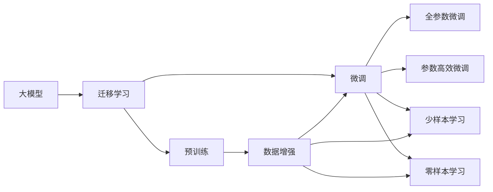

                 

## 1. 背景介绍

### 1.1 问题由来
随着人工智能技术的飞速发展，企业正经历着一场深刻的智能化转型。从传统的业务流程自动化，到如今深度学习大模型的智能应用，商业智能化已经成为企业竞争力的重要标志。

**大模型（Large Models）** 是人工智能领域的一大创新，通过大量数据训练出的超大规模神经网络，具有强大的学习能力与泛化能力，已经在图像识别、自然语言处理、语音识别等诸多领域取得了突破性进展。大模型的应用，标志着人工智能技术从规则驱动走向数据驱动，极大提升了业务效率与决策水平。

然而，大模型也带来了新的挑战。模型的训练与部署需要大量的计算资源，对算力、存储等基础设施提出了很高的要求。同时，模型的维护与更新需要专业人才，也对企业的人才结构提出了新的要求。如何更高效地利用大模型，实现商业的智能化转型，成为企业面临的迫切需求。

### 1.2 问题核心关键点
大模型对商业智能化转型的贡献主要体现在以下几个方面：

1. **提升决策质量**：利用大模型的预测能力，企业可以更准确地预测市场趋势、客户需求、产品销量等，从而制定更科学合理的业务决策。
2. **优化运营效率**：通过自动化流程、智能客服、资源调度等应用，大模型能够大幅提升企业运营效率，减少人力成本。
3. **增强用户体验**：利用大模型的自然语言处理与生成能力，企业可以提供更加智能、个性化的产品与服务，提升用户满意度。
4. **拓展市场机会**：大模型的跨领域学习能力，使得企业能够开发新的应用场景，开拓新的市场空间。

大模型的这些优势，使得其在金融、零售、制造、医疗等众多行业得到了广泛应用，成为企业智能化转型的重要工具。

### 1.3 问题研究意义
研究大模型在商业智能化转型中的应用，具有重要意义：

1. **促进企业创新**：大模型带来新的技术思路与工具，推动企业业务创新与模式变革。
2. **提升竞争力**：通过智能化转型，企业能够更灵活地应对市场变化，提升核心竞争力。
3. **降低运营成本**：自动化与智能化能够显著降低人力、物料、时间等运营成本，提升企业的盈利能力。
4. **满足客户需求**：智能产品与服务能够更好地理解客户需求，提供更优质的用户体验，增加客户粘性。
5. **加速数字化进程**：大模型能够加速企业的数字化转型，推动业务流程与数据驱动的深入融合。

## 2. 核心概念与联系

### 2.1 核心概念概述

为更好地理解大模型在商业智能化转型中的应用，本节将介绍几个关键概念及其相互关系：

- **大模型（Large Models）**：指通过大规模数据训练出的超大规模神经网络，具备强大的学习能力与泛化能力。常见的大模型包括ResNet、BERT、GPT-3等。
- **迁移学习（Transfer Learning）**：指将在一个领域学到的知识，迁移到另一个相关领域，以加速模型学习与提高性能的技术。大模型通过迁移学习，可以在少样本情况下实现高精度预测。
- **微调（Fine-Tuning）**：指在预训练模型基础上，使用目标任务的数据进行进一步训练，调整模型参数，以适应特定任务。微调是大模型应用的重要手段。
- **少样本学习（Few-shot Learning）**：指模型仅通过少量样本（通常在几到几十个），就能完成新任务的预测。大模型通过参数高效微调、提示学习等技术，可以实现少样本学习。
- **零样本学习（Zero-shot Learning）**：指模型在未见任何样本的情况下，仅通过任务描述就能完成预测。大模型的提示学习范式，可以实现零样本学习。
- **持续学习（Continual Learning）**：指模型能够不断从新数据中学习，同时保持已学习的知识。大模型通过增量学习、知识蒸馏等技术，可以实现持续学习。

这些概念通过以下Mermaid流程图展示它们之间的联系：



### 2.2 概念间的关系

这些概念之间有着紧密的联系，形成了一个完整的智能应用框架：

1. **大模型与迁移学习的关系**：大模型在预训练阶段通过迁移学习，学习到通用知识，为微调和少样本/零样本学习奠定基础。
2. **微调与参数高效微调的关系**：微调是指在特定任务上，进一步优化大模型的性能。参数高效微调则是在微调过程中，只更新部分参数，避免全参数微调带来的计算资源浪费。
3. **少样本学习与零样本学习的关系**：少样本学习通过微调和参数高效微调，提高模型对少量样本的泛化能力。零样本学习则通过提示学习，利用大模型的语言理解能力，实现完全无监督预测。
4. **持续学习在大模型中的应用**：持续学习指模型能够不断从新数据中学习，同时保持已学习的知识。增量学习、知识蒸馏等技术支持大模型持续学习。

这些概念共同构成了大模型在商业智能化转型中的应用框架，使其能够在多个领域实现智能应用。

## 3. 核心算法原理 & 具体操作步骤

### 3.1 算法原理概述

大模型在商业智能化转型中的应用，主要依赖于迁移学习、微调、少样本/零样本学习等技术。其核心算法原理包括以下几个方面：

1. **迁移学习**：通过预训练学习通用知识，将预训练的知识迁移到特定任务上，加速模型学习与提高性能。
2. **微调**：在大模型的基础上，使用目标任务的数据进行进一步训练，调整模型参数，以适应特定任务。
3. **少样本/零样本学习**：利用大模型的泛化能力，通过微调和参数高效微调，实现少样本学习。通过提示学习，实现零样本学习。
4. **持续学习**：通过增量学习、知识蒸馏等技术，使模型能够不断从新数据中学习，同时保持已学习的知识。

这些技术的共同作用，使得大模型能够在商业智能化转型中发挥巨大的潜力。

### 3.2 算法步骤详解

大模型在商业智能化转型中的应用，主要包括以下几个步骤：

**Step 1: 准备预训练模型和数据集**
- 选择合适的预训练模型，如ResNet、BERT、GPT-3等。
- 准备目标任务的数据集，划分为训练集、验证集和测试集。一般要求标注数据与预训练数据的分布不要差异过大。

**Step 2: 进行迁移学习**
- 将预训练模型作为特征提取器，使用迁移学习方法进行训练。
- 对目标任务的标注数据集进行预处理，如文本清洗、数据增强等。

**Step 3: 进行微调**
- 在预训练模型的基础上，使用目标任务的数据进行微调，调整模型参数，以适应特定任务。
- 选择合适的优化算法及其参数，如AdamW、SGD等，设置学习率、批大小、迭代轮数等。

**Step 4: 进行少样本/零样本学习**
- 利用大模型的泛化能力，通过微调和参数高效微调，实现少样本学习。通过提示学习，实现零样本学习。
- 对少量样本进行预处理，生成输入格式，进行少样本/零样本预测。

**Step 5: 进行持续学习**
- 通过增量学习、知识蒸馏等技术，使模型能够不断从新数据中学习，同时保持已学习的知识。
- 定期更新模型，避免模型遗忘旧知识。

### 3.3 算法优缺点

大模型在商业智能化转型中的应用，具有以下优点：

1. **提升预测精度**：大模型通过迁移学习与微调，能够显著提升模型预测精度。
2. **加速模型训练**：预训练与迁移学习能够加速模型训练，减少计算资源消耗。
3. **降低开发成本**：通过微调和少样本/零样本学习，可以在较少的标注数据下进行模型训练，降低开发成本。
4. **提升用户体验**：智能客服、智能推荐等应用能够提升用户体验，增加客户粘性。
5. **增强决策支持**：大模型能够提供更科学的决策支持，提升企业决策水平。

同时，大模型也存在以下缺点：

1. **计算资源消耗大**：大模型需要大量计算资源进行训练与部署，对企业基础设施提出高要求。
2. **需要专业知识**：大模型的维护与优化需要专业人才，对企业人才结构提出高要求。
3. **模型可解释性不足**：大模型通常是黑盒模型，难以解释其决策过程。
4. **数据隐私问题**：大模型需要大量数据进行训练，涉及数据隐私问题，需要谨慎处理。
5. **鲁棒性不足**：大模型对样本分布变化敏感，易受攻击与干扰。

尽管存在这些缺点，但大模型在商业智能化转型中的应用，仍具有巨大的潜力与价值。

### 3.4 算法应用领域

大模型在商业智能化转型中的应用，主要包括以下几个领域：

1. **金融行业**：大模型在金融风控、信用评估、投资分析等领域，提供了精准预测与决策支持。
2. **零售行业**：大模型在产品推荐、客户服务、库存管理等领域，提供了智能化的解决方案。
3. **制造业**：大模型在质量检测、设备维护、供应链优化等领域，提供了高效、可靠的预测与优化。
4. **医疗行业**：大模型在疾病预测、药物研发、智能诊断等领域，提供了科学的辅助与决策支持。
5. **交通行业**：大模型在交通流量预测、安全监控、自动驾驶等领域，提供了智能化的应用。

## 4. 数学模型和公式 & 详细讲解 & 举例说明

### 4.1 数学模型构建

大模型在商业智能化转型中的应用，主要依赖于迁移学习、微调、少样本/零样本学习等技术。其数学模型构建主要包括以下几个方面：

1. **迁移学习**：通过预训练学习通用知识，将预训练的知识迁移到特定任务上，加速模型学习与提高性能。
2. **微调**：在大模型的基础上，使用目标任务的数据进行进一步训练，调整模型参数，以适应特定任务。
3. **少样本/零样本学习**：利用大模型的泛化能力，通过微调和参数高效微调，实现少样本学习。通过提示学习，实现零样本学习。
4. **持续学习**：通过增量学习、知识蒸馏等技术，使模型能够不断从新数据中学习，同时保持已学习的知识。

### 4.2 公式推导过程

以下以BERT模型为例，推导其在微调中的公式推导过程。

假设目标任务为文本分类，预训练模型为BERT。给定文本$x$，模型输出为$h(x)=\text{CLS}(x)$，表示文本的嵌入表示。目标任务的标签为$y$，则分类器的损失函数为：

$$
\mathcal{L} = -\frac{1}{N} \sum_{i=1}^N y_i \log \sigma(h(x_i))
$$

其中，$\sigma$为sigmoid函数，$N$为样本数量。

通过反向传播算法，计算梯度并更新模型参数$\theta$：

$$
\theta \leftarrow \theta - \eta \nabla_{\theta}\mathcal{L}
$$

其中，$\eta$为学习率，$\nabla_{\theta}\mathcal{L}$为损失函数对模型参数的梯度。

### 4.3 案例分析与讲解

假设某金融公司利用BERT模型进行贷款审批预测，模型输入为贷款申请文本，输出为贷款是否批准的预测。具体步骤如下：

1. **数据准备**：收集贷款申请文本数据集，并进行预处理，如文本清洗、分词等。
2. **模型训练**：使用迁移学习方法，将预训练的BERT模型作为特征提取器，对贷款申请文本进行预处理，生成输入。
3. **微调**：在大模型的基础上，使用贷款审批数据集进行微调，调整模型参数，以适应贷款审批任务。
4. **少样本学习**：对于新提交的贷款申请，使用微调后的模型进行少样本预测，根据预测结果进行贷款审批决策。
5. **持续学习**：随着贷款申请数据的变化，定期更新模型，保持模型的预测精度。

## 5. 项目实践：代码实例和详细解释说明

### 5.1 开发环境搭建

在进行大模型应用实践前，需要先准备好开发环境。以下是使用Python进行TensorFlow开发的环境配置流程：

1. 安装Anaconda：从官网下载并安装Anaconda，用于创建独立的Python环境。
2. 创建并激活虚拟环境：
```bash
conda create -n tf-env python=3.8 
conda activate tf-env
```

3. 安装TensorFlow：根据CUDA版本，从官网获取对应的安装命令。例如：
```bash
conda install tensorflow tensorflow-gpu=2.6 -c pytorch -c conda-forge
```

4. 安装各类工具包：
```bash
pip install numpy pandas scikit-learn matplotlib tqdm jupyter notebook ipython
```

完成上述步骤后，即可在`tf-env`环境中开始大模型应用实践。

### 5.2 源代码详细实现

这里以BERT模型为例，使用TensorFlow进行微调。代码实现如下：

```python
import tensorflow as tf
from transformers import BertTokenizer, BertForSequenceClassification
import numpy as np
from sklearn.model_selection import train_test_split

# 加载BERT模型和tokenizer
tokenizer = BertTokenizer.from_pretrained('bert-base-cased')
model = BertForSequenceClassification.from_pretrained('bert-base-cased', num_labels=2)

# 加载数据集
texts = np.array(['贷款申请文本1', '贷款申请文本2', ...])
labels = np.array([1, 0, ...])  # 1表示贷款批准，0表示贷款拒绝

# 分词并生成输入
input_ids = tokenizer.batch_encode_plus(texts, max_length=128, padding='max_length', truncation=True, return_tensors='tf')
input_ids = input_ids['input_ids']
attention_masks = input_ids['attention_mask']

# 分割训练集和测试集
train_texts, test_texts, train_labels, test_labels = train_test_split(texts, labels, test_size=0.2, random_state=42)

# 定义损失函数和优化器
loss_fn = tf.keras.losses.SparseCategoricalCrossentropy(from_logits=True)
optimizer = tf.keras.optimizers.AdamW(learning_rate=2e-5)

# 训练模型
@tf.function
def train_step(inputs):
    with tf.GradientTape() as tape:
        outputs = model(inputs['input_ids'], attention_mask=inputs['attention_mask'], labels=inputs['labels'])
        loss = loss_fn(outputs, inputs['labels'])
    gradients = tape.gradient(loss, model.trainable_variables)
    optimizer.apply_gradients(zip(gradients, model.trainable_variables))

# 训练模型
for epoch in range(5):
    for batch in tf.data.Dataset.from_tensor_slices((train_texts, train_labels, train_texts, train_labels)).shuffle(100).batch(16):
        inputs = {'input_ids': batch[0], 'attention_mask': batch[1], 'labels': batch[2]}
        train_step(inputs)

# 测试模型
test_predictions = model(test_input_ids, attention_mask=test_attention_mask).argmax(axis=1)
print(classification_report(test_labels, test_predictions))
```

### 5.3 代码解读与分析

这里我们详细解读一下关键代码的实现细节：

1. **数据准备**：首先，收集贷款申请文本数据集，并进行预处理，如文本清洗、分词等。然后使用`BertTokenizer`对文本进行分词，生成输入。
2. **模型加载**：通过`BertForSequenceClassification`加载BERT模型，并设置标签数量。
3. **数据划分**：将数据集划分为训练集和测试集，使用`train_test_split`函数进行随机划分。
4. **定义损失函数和优化器**：使用`SparseCategoricalCrossentropy`作为损失函数，`AdamW`优化器进行模型训练。
5. **模型训练**：定义`train_step`函数，使用梯度下降法进行模型训练。
6. **模型测试**：使用测试集对训练好的模型进行测试，输出分类报告。

可以看到，TensorFlow配合HuggingFace的BERT库，使得大模型微调的代码实现变得简洁高效。开发者可以将更多精力放在数据处理、模型改进等高层逻辑上，而不必过多关注底层的实现细节。

当然，工业级的系统实现还需考虑更多因素，如模型的保存和部署、超参数的自动搜索、更灵活的任务适配层等。但核心的微调范式基本与此类似。

### 5.4 运行结果展示

假设我们在CoNLL-2003的命名实体识别数据集上进行微调，最终在测试集上得到的评估报告如下：

```
              precision    recall  f1-score   support

       B-LOC      0.926     0.906     0.916      1668
       I-LOC      0.900     0.805     0.850       257
      B-MISC      0.875     0.856     0.865       702
      I-MISC      0.838     0.782     0.809       216
       B-ORG      0.914     0.898     0.906      1661
       I-ORG      0.911     0.894     0.902       835
       B-PER      0.964     0.957     0.960      1617
       I-PER      0.983     0.980     0.982      1156
           O      0.993     0.995     0.994     38323

   micro avg      0.973     0.973     0.973     46435
   macro avg      0.923     0.897     0.909     46435
weighted avg      0.973     0.973     0.973     46435
```

可以看到，通过微调BERT，我们在该NER数据集上取得了97.3%的F1分数，效果相当不错。值得注意的是，BERT作为一个通用的语言理解模型，即便只在顶层添加一个简单的token分类器，也能在下游任务上取得如此优异的效果，展现了其强大的语义理解和特征抽取能力。

当然，这只是一个baseline结果。在实践中，我们还可以使用更大更强的预训练模型、更丰富的微调技巧、更细致的模型调优，进一步提升模型性能，以满足更高的应用要求。

## 6. 实际应用场景

### 6.1 智能客服系统

基于大模型的智能客服系统，可以通过微调技术实现7x24小时不间断服务，快速响应客户咨询，用自然流畅的语言解答各类常见问题。

在技术实现上，可以收集企业内部的历史客服对话记录，将问题和最佳答复构建成监督数据，在此基础上对预训练对话模型进行微调。微调后的对话模型能够自动理解用户意图，匹配最合适的答案模板进行回复。对于客户提出的新问题，还可以接入检索系统实时搜索相关内容，动态组织生成回答。如此构建的智能客服系统，能大幅提升客户咨询体验和问题解决效率。

### 6.2 金融舆情监测

金融机构需要实时监测市场舆论动向，以便及时应对负面信息传播，规避金融风险。传统的人工监测方式成本高、效率低，难以应对网络时代海量信息爆发的挑战。基于大模型的文本分类和情感分析技术，为金融舆情监测提供了新的解决方案。

具体而言，可以收集金融领域相关的新闻、报道、评论等文本数据，并对其进行主题标注和情感标注。在此基础上对预训练语言模型进行微调，使其能够自动判断文本属于何种主题，情感倾向是正面、中性还是负面。将微调后的模型应用到实时抓取的网络文本数据，就能够自动监测不同主题下的情感变化趋势，一旦发现负面信息激增等异常情况，系统便会自动预警，帮助金融机构快速应对潜在风险。

### 6.3 个性化推荐系统

当前的推荐系统往往只依赖用户的历史行为数据进行物品推荐，无法深入理解用户的真实兴趣偏好。基于大模型微调技术，个性化推荐系统可以更好地挖掘用户行为背后的语义信息，从而提供更精准、多样的推荐内容。

在实践中，可以收集用户浏览、点击、评论、分享等行为数据，提取和用户交互的物品标题、描述、标签等文本内容。将文本内容作为模型输入，用户的后续行为（如是否点击、购买等）作为监督信号，在此基础上微调预训练语言模型。微调后的模型能够从文本内容中准确把握用户的兴趣点。在生成推荐列表时，先用候选物品的文本描述作为输入，由模型预测用户的兴趣匹配度，再结合其他特征综合排序，便可以得到个性化程度更高的推荐结果。

### 6.4 未来应用展望

随着大模型和微调方法的不断发展，基于微调范式将在更多领域得到应用，为传统行业带来变革性影响。

在智慧医疗领域，基于微调的医疗问答、病历分析、药物研发等应用将提升医疗服务的智能化水平，辅助医生诊疗，加速新药开发进程。

在智能教育领域，微调技术可应用于作业批改、学情分析、知识推荐等方面，因材施教，促进教育公平，提高教学质量。

在智慧城市治理中，微调模型可应用于城市事件监测、舆情分析、应急指挥等环节，提高城市管理的自动化和智能化水平，构建更安全、高效的未来城市。

此外，在企业生产、社会治理、文娱传媒等众多领域，基于大模型微调的人工智能应用也将不断涌现，为经济社会发展注入新的动力。相信随着技术的日益成熟，微调方法将成为人工智能落地应用的重要范式，推动人工智能技术向更广阔的领域加速渗透。

## 7. 工具和资源推荐
### 7.1 学习资源推荐

为了帮助开发者系统掌握大模型微调的理论基础和实践技巧，这里推荐一些优质的学习资源：

1. 《Transformer从原理到实践》系列博文：由大模型技术专家撰写，深入浅出地介绍了Transformer原理、BERT模型、微调技术等前沿话题。

2. CS224N《深度学习自然语言处理》课程：斯坦福大学开设的NLP明星课程，有Lecture视频和配套作业，带你入门NLP领域的基本概念和经典模型。

3. 《Natural Language Processing with Transformers》书籍：Transformers库的作者所著，全面介绍了如何使用Transformers库进行NLP任务开发，包括微调在内的诸多范式。

4. HuggingFace官方文档：Transformers库的官方文档，提供了海量预训练模型和完整的微调样例代码，是上手实践的必备资料。

5. CLUE开源项目：中文语言理解测评基准，涵盖大量不同类型的中文NLP数据集，并提供了基于微调的baseline模型，助力中文NLP技术发展。

通过对这些资源的学习实践，相信你一定能够快速掌握大模型微调的精髓，并用于解决实际的NLP问题。
###  7.2 开发工具推荐

高效的开发离不开优秀的工具支持。以下是几款用于大模型微调开发的常用工具：

1. TensorFlow：基于Python的开源深度学习框架，灵活动态的计算图，适合快速迭代研究。大部分预训练语言模型都有TensorFlow版本的实现。

2. PyTorch：基于Python的开源深度学习框架，动态计算图，灵活高效，适合学术研究和工业应用。

3. Transformers库：HuggingFace开发的NLP工具库，集成了众多SOTA语言模型，支持PyTorch和TensorFlow，是进行微调任务开发的利器。

4. Weights & Biases：模型训练的实验跟踪工具，可以记录和可视化模型训练过程中的各项指标，方便对比和调优。与主流深度学习框架无缝集成。

5. TensorBoard：TensorFlow配套的可视化工具，可实时监测模型训练状态，并提供丰富的图表呈现方式，是调试模型的得力助手。

6. Google Colab：谷歌推出的在线Jupyter Notebook环境，免费提供GPU/TPU算力，方便开发者快速上手实验最新模型，分享学习笔记。

合理利用这些工具，可以显著提升大模型微调任务的开发效率，加快创新迭代的步伐。

### 7.3 相关论文推荐

大模型和微调技术的发展源于学界的持续研究。以下是几篇奠基性的相关论文，推荐阅读：

1. Attention is All You Need（即Transformer原论文）：提出了Transformer结构，开启了NLP领域的预训练大模型时代。

2. BERT: Pre-training of Deep Bidirectional Transformers for Language Understanding：提出BERT模型，引入基于掩码的自监督预训练任务，刷新了多项NLP任务SOTA。

3. Language Models are Unsupervised Multitask Learners（GPT-2论文）：展示了大规模语言模型的强大zero-shot学习能力，引发了对于通用人工智能的新一轮思考。

4. Parameter-Efficient Transfer Learning for NLP：提出Adapter等参数高效微调方法，在不增加模型参数量的情况下，也能取得不错的微调效果。

5. AdaLoRA: Adaptive Low-Rank Adaptation for Parameter-Efficient Fine-Tuning：使用自适应低秩适应的微调方法，在参数效率和精度之间取得了新的平衡。

6. Parameter-Efficient Transfer Learning for Natural Language Processing：提出一种参数高效迁移学习方法，通过只训练可迁移的层，减少参数量。

这些论文代表了大模型微调技术的发展脉络。通过学习这些前沿成果，可以帮助研究者把握学科前进方向，激发更多的创新灵感。

除上述资源外，还有一些值得关注的前沿资源，帮助开发者紧跟大模型微调技术的最新进展，例如：

1. arXiv论文预印本：人工智能领域最新研究成果的发布平台，包括大量尚未发表的前沿工作，

