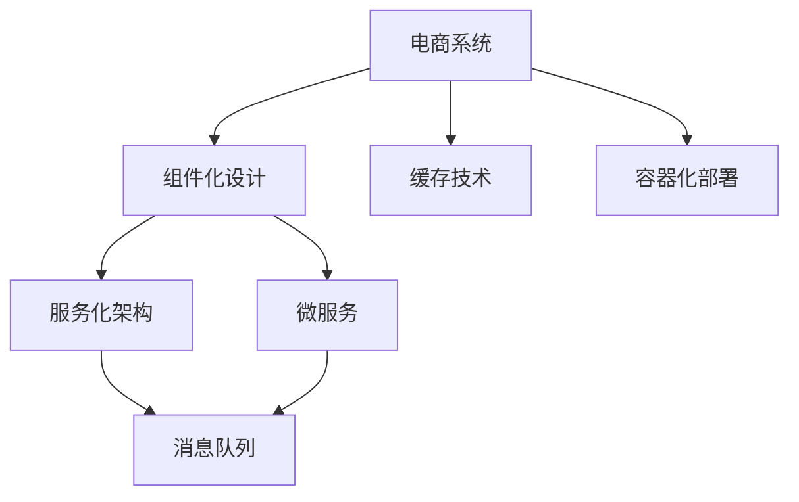
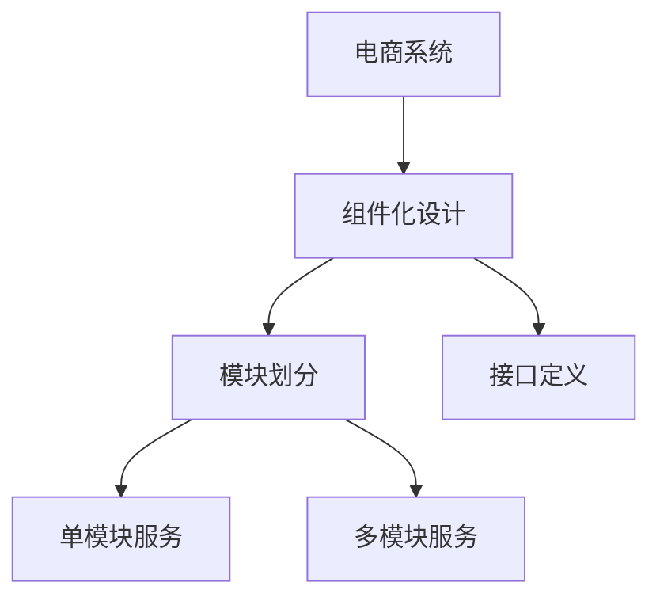
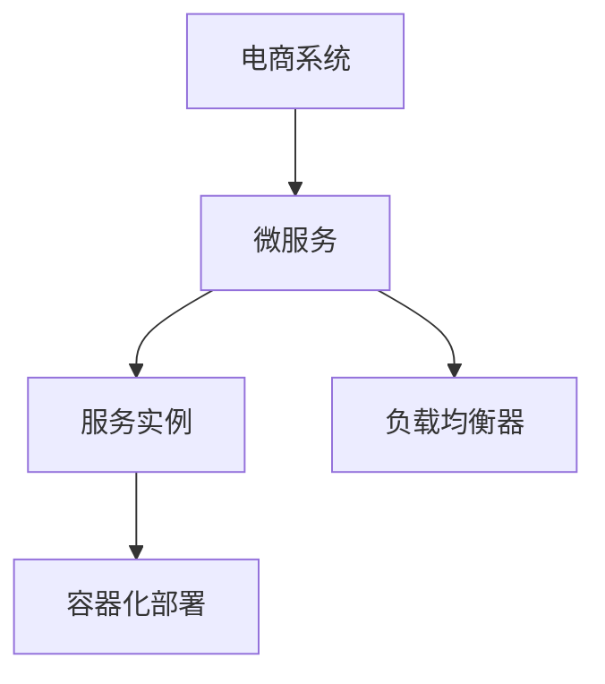
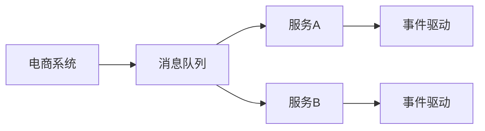
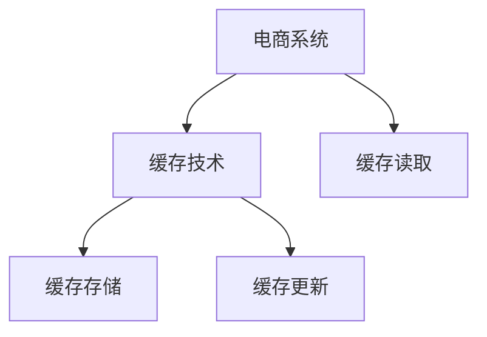
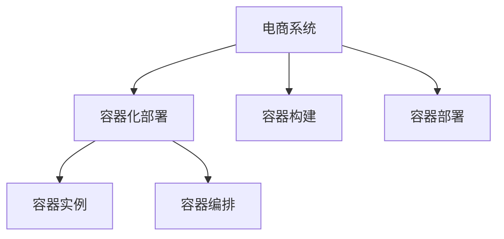
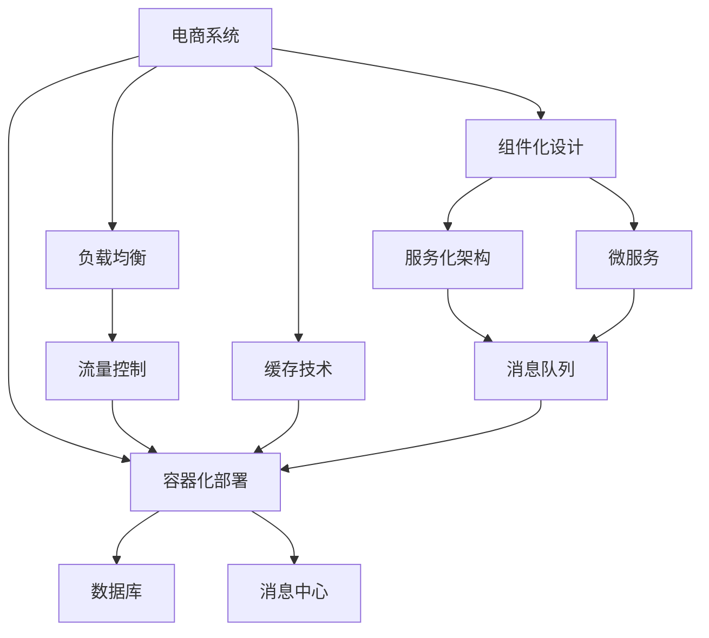

                 

# 电商系统通用组件的设计和实现

> 关键词：
1. 电商系统
2. 组件化设计
3. 服务化架构
4. 微服务
5. 消息队列
6. 缓存技术
7. 容器化部署

## 1. 背景介绍

### 1.1 问题由来

随着电商行业的快速发展，传统单体架构的应用系统已经难以满足业务需求，对系统可扩展性、容错性、性能等方面的要求日益增高。与此同时，微服务架构作为应对这一挑战的有效手段，得到了广泛应用。然而，在微服务架构的实施过程中，仍然面临诸多挑战，包括服务间通信复杂、版本管理困难、开发效率低下等问题。为此，组件化设计和实现成为了微服务架构演进的重要方向。

### 1.2 问题核心关键点

组件化设计可以视为微服务架构的具体实践。它将复杂的系统划分为若干个独立的模块，每个模块负责一个明确的业务功能，可以独立部署、扩展和维护。组件化设计能够降低系统复杂度，提高开发效率，缩短发布周期，并且能够提供更好的业务解耦和可扩展性。

### 1.3 问题研究意义

组件化设计能够帮助电商系统实现更加灵活的架构，提升系统性能和可靠性，缩短业务迭代周期，降低开发和运维成本，从而更好地支撑电商业务的发展。

## 2. 核心概念与联系

### 2.1 核心概念概述

为更好地理解电商系统通用组件的设计和实现，本节将介绍几个密切相关的核心概念：

- **电商系统**：电子商务系统的泛称，主要涉及商品展示、购物车管理、订单处理、物流跟踪、客户服务等功能模块。
- **组件化设计**：将电商系统拆分为多个独立的模块，每个模块专注于单一业务功能的设计和实现。
- **服务化架构**：将电商系统的各个组件以服务的形式进行部署和编排，通过轻量级通信机制实现组件之间的协作。
- **微服务**：将电商系统的各个组件划分为多个独立的服务单元，每个服务单元提供明确的接口定义，可以通过轻量级通信机制实现服务的灵活调用。
- **消息队列**：在电商系统中，消息队列用于异步处理服务之间的通信，支持解耦、可靠传输和负载均衡等功能。
- **缓存技术**：在电商系统中，缓存技术用于减少数据库的访问次数，提升系统的响应速度和吞吐量。
- **容器化部署**：将电商系统的组件以容器的形式进行打包和部署，方便服务的快速构建、部署和扩展。

这些核心概念之间的逻辑关系可以通过以下Mermaid流程图来展示：



这个流程图展示了一个完整的电商系统，以及其中的核心概念之间的关系：

1. 电商系统通过组件化设计，将复杂的系统拆分为多个独立的模块。
2. 每个模块可以采用服务化架构或微服务的形式进行部署。
3. 服务化架构通过消息队列实现组件之间的异步通信。
4. 微服务通过轻量级通信机制实现服务的灵活调用。
5. 缓存技术用于提升系统的响应速度。
6. 容器化部署用于实现服务的快速构建、部署和扩展。

### 2.2 概念间的关系

这些核心概念之间存在着紧密的联系，形成了电商系统组件化和微服务架构的完整生态系统。

#### 2.2.1 电商系统的设计



这个流程图展示了电商系统的设计过程：

1. 电商系统通过组件化设计，将复杂的系统拆分为多个独立的模块。
2. 每个模块根据其业务功能进行划分。
3. 每个模块定义明确的接口，以便与其他模块进行通信。

#### 2.2.2 微服务架构的部署



这个流程图展示了微服务架构的部署过程：

1. 电商系统采用微服务架构进行部署。
2. 每个微服务部署为多个服务实例。
3. 通过负载均衡器进行服务实例的负载均衡。
4. 服务实例采用容器化部署，方便快速构建和扩展。

#### 2.2.3 消息队列的应用



这个流程图展示了消息队列在电商系统中的应用：

1. 电商系统引入消息队列，用于异步处理服务之间的通信。
2. 服务A和B通过消息队列进行事件驱动的通信。
3. 消息队列支持解耦、可靠传输和负载均衡等功能。

#### 2.2.4 缓存技术的使用



这个流程图展示了缓存技术在电商系统中的应用：

1. 电商系统引入缓存技术，用于减少数据库的访问次数。
2. 缓存存储用于存储经常访问的数据。
3. 缓存更新用于实时更新缓存数据。
4. 缓存读取用于提升系统的响应速度。

#### 2.2.5 容器化部署的实现



这个流程图展示了容器化部署在电商系统中的应用：

1. 电商系统采用容器化部署，用于实现服务的快速构建和部署。
2. 容器实例用于存储服务的运行环境。
3. 容器编排用于管理容器实例的生命周期。
4. 容器构建用于构建容器实例。
5. 容器部署用于将容器实例部署到指定环境中。

### 2.3 核心概念的整体架构

最后，我们用一个综合的流程图来展示这些核心概念在电商系统中的整体架构：



这个综合流程图展示了从组件化设计到容器化部署的完整过程。电商系统首先通过组件化设计，将复杂的系统拆分为多个独立的模块，然后采用服务化架构或微服务的形式进行部署，通过消息队列实现组件之间的异步通信，同时引入缓存技术和容器化部署提升系统的性能和可靠性。通过负载均衡和流量控制，电商系统可以更好地应对高并发的业务需求。

## 3. 核心算法原理 & 具体操作步骤
### 3.1 算法原理概述

电商系统通用组件的设计和实现，本质上是针对电商系统的组件化设计和微服务架构的实施。核心思想是将电商系统拆分为多个独立的模块，每个模块专注于单一业务功能的设计和实现，然后通过服务化架构或微服务的形式进行部署，最后通过消息队列、缓存技术、容器化部署等手段提升系统的性能和可靠性。

具体而言，电商系统组件的设计和实现需要经过以下几个关键步骤：

1. **组件划分**：将电商系统拆分为多个独立的模块，每个模块负责单一的业务功能。
2. **接口定义**：为每个模块定义明确的接口，以便其他模块进行调用。
3. **服务化部署**：将模块部署为服务，通过消息队列实现异步通信。
4. **缓存技术应用**：引入缓存技术，提升系统的响应速度和吞吐量。
5. **容器化部署**：采用容器化部署，方便服务的快速构建、部署和扩展。

### 3.2 算法步骤详解

电商系统通用组件的设计和实现主要包括以下几个关键步骤：

**Step 1: 准备电商系统架构**

1. **架构设计**：根据电商系统的业务需求，设计组件化架构，确定各个组件的功能和接口定义。

2. **接口规范**：为每个组件定义清晰的接口规范，明确输入、输出和调用方式。

3. **技术选型**：选择合适的技术栈和工具，包括编程语言、框架、数据库、消息队列等。

**Step 2: 组件划分与实现**

1. **组件划分**：将电商系统划分为多个独立的模块，每个模块负责单一的业务功能。

2. **组件实现**：为每个模块实现具体的业务逻辑，并编写单元测试确保模块功能的正确性。

3. **接口调用**：实现模块之间的接口调用，确保各个模块之间的协同工作。

**Step 3: 服务化部署与异步通信**

1. **服务部署**：将模块部署为服务，使用消息队列实现服务之间的异步通信。

2. **服务注册与发现**：使用服务注册中心和发现机制，实现服务的自动注册和发现。

3. **负载均衡**：通过负载均衡器实现服务的负载均衡，提升系统的容错性和可靠性。

**Step 4: 引入缓存技术**

1. **缓存策略**：根据电商系统的业务特点，选择合适的缓存策略，如分布式缓存、本地缓存等。

2. **缓存部署**：部署缓存服务器，实现数据的缓存存储和更新。

3. **缓存应用**：在电商系统中引入缓存技术，提升系统的响应速度和吞吐量。

**Step 5: 容器化部署**

1. **容器构建**：将模块打包为容器镜像，包括运行时环境、依赖库等。

2. **容器编排**：使用容器编排工具，如Kubernetes、Docker Swarm等，实现容器的快速部署和扩展。

3. **容器部署**：将容器部署到指定的环境中，如云平台、物理机等。

### 3.3 算法优缺点

电商系统通用组件的设计和实现，具有以下优点：

1. **可扩展性**：组件化设计能够降低系统的复杂度，提高系统的可扩展性，方便新功能的快速开发和部署。

2. **高可靠性**：服务化部署和负载均衡能够提升系统的容错性和可靠性，确保系统的高可用性。

3. **性能提升**：缓存技术能够减少数据库的访问次数，提升系统的响应速度和吞吐量。

4. **易于维护**：容器化部署和容器编排能够方便服务的快速构建、部署和扩展，提高系统的维护效率。

同时，电商系统通用组件的设计和实现也存在一些缺点：

1. **复杂度增加**：组件化设计可能会增加系统的复杂度，特别是在组件数量较多的情况下。

2. **接口调用开销**：服务之间的异步通信可能会增加调用开销，影响系统的响应速度。

3. **版本管理困难**：微服务架构的组件数量较多，版本管理变得复杂，容易产生版本冲突和兼容性问题。

4. **开发成本增加**：组件化设计和微服务架构的实施需要更多的开发和运维成本。

### 3.4 算法应用领域

电商系统通用组件的设计和实现，在以下几个领域得到了广泛应用：

1. **商品展示**：通过组件化设计和微服务架构，实现商品信息的展示、搜索和排序等功能。

2. **购物车管理**：通过组件化设计和微服务架构，实现购物车功能，包括添加商品、修改数量、结算等功能。

3. **订单处理**：通过组件化设计和微服务架构，实现订单的生成、处理和跟踪等功能。

4. **物流跟踪**：通过组件化设计和微服务架构，实现物流信息的跟踪和管理，包括订单状态查询、配送时间查询等功能。

5. **客户服务**：通过组件化设计和微服务架构，实现客户服务功能，包括在线客服、FAQ查询等功能。

6. **支付接口**：通过组件化设计和微服务架构，实现支付功能，包括在线支付、退款等功能。

7. **数据统计**：通过组件化设计和微服务架构，实现数据统计功能，包括订单分析、用户行为分析等功能。

## 4. 数学模型和公式 & 详细讲解  
### 4.1 数学模型构建

在本节中，我们将通过数学语言对电商系统组件的设计和实现进行更加严格的刻画。

假设电商系统具有 $N$ 个组件，每个组件 $i$ 负责单一的业务功能，对应的接口定义如下：

$$
I_i = (I_{i\_input}, I_{i\_output}, F_i)
$$

其中 $I_{i\_input}$ 表示输入参数，$I_{i\_output}$ 表示输出参数，$F_i$ 表示函数映射。

电商系统的架构设计可以表示为：

$$
S = \{C_i, A_i, \{i \in \{1,2,...,N\}\}
$$

其中 $C_i$ 表示组件 $i$ 的接口定义，$A_i$ 表示组件 $i$ 的实现函数，$i \in \{1,2,...,N\}$ 表示组件的数量。

电商系统的组件划分和接口调用可以表示为：

$$
O_i = O_{i\_input}(C_j, I_{i\_output})
$$

其中 $O_i$ 表示组件 $i$ 的接口调用，$O_{i\_input}$ 表示组件 $i$ 的输入参数，$C_j$ 表示组件 $j$ 的接口定义，$I_{i\_output}$ 表示组件 $i$ 的输出参数。

电商系统的服务化部署可以表示为：

$$
S_i = S_{i\_server}(S_i, Q_i)
$$

其中 $S_i$ 表示组件 $i$ 的服务实例，$S_{i\_server}$ 表示服务注册中心，$Q_i$ 表示服务发现机制。

电商系统的消息队列可以表示为：

$$
M = \{M_{i\_topic}, M_{i\_publish}, M_{i\_consume}\}
$$

其中 $M_{i\_topic}$ 表示组件 $i$ 的主题，$M_{i\_publish}$ 表示组件 $i$ 的发布机制，$M_{i\_consume}$ 表示组件 $i$ 的消费机制。

电商系统的缓存技术可以表示为：

$$
C = \{C_{i\_key}, C_{i\_value}, C_{i\_expire}\}
$$

其中 $C_{i\_key}$ 表示缓存键，$C_{i\_value}$ 表示缓存值，$C_{i\_expire}$ 表示缓存有效期。

电商系统的容器化部署可以表示为：

$$
D_i = D_{i\_container}(D_i, E_i)
$$

其中 $D_i$ 表示组件 $i$ 的容器镜像，$D_{i\_container}$ 表示容器编排工具，$E_i$ 表示容器环境。

### 4.2 公式推导过程

以下我们以电商系统中的订单处理组件为例，推导其服务化部署和异步通信的数学模型。

假设订单处理组件 $O$ 通过消息队列实现异步通信，其接口定义和调用可以表示为：

$$
I_O = (I_{O\_input}, I_{O\_output}, F_O)
$$

其中 $I_{O\_input}$ 表示订单信息，$I_{O\_output}$ 表示处理结果，$F_O$ 表示订单处理函数。

订单处理组件的服务化部署可以表示为：

$$
S_O = S_{O\_server}(S_O, Q_O)
$$

其中 $S_O$ 表示订单处理组件的服务实例，$S_{O\_server}$ 表示服务注册中心，$Q_O$ 表示服务发现机制。

订单处理组件的消息队列可以表示为：

$$
M_O = \{M_{O\_topic}, M_{O\_publish}, M_{O\_consume}\}
$$

其中 $M_{O\_topic}$ 表示订单处理组件的主题，$M_{O\_publish}$ 表示订单处理组件的发布机制，$M_{O\_consume}$ 表示订单处理组件的消费机制。

订单处理组件的缓存技术可以表示为：

$$
C_O = \{C_{O\_key}, C_{O\_value}, C_{O\_expire}\}
$$

其中 $C_{O\_key}$ 表示缓存键，$C_{O\_value}$ 表示缓存值，$C_{O\_expire}$ 表示缓存有效期。

订单处理组件的容器化部署可以表示为：

$$
D_O = D_{O\_container}(D_O, E_O)
$$

其中 $D_O$ 表示订单处理组件的容器镜像，$D_{O\_container}$ 表示容器编排工具，$E_O$ 表示容器环境。

### 4.3 案例分析与讲解

假设我们在电商系统中实现一个订单处理组件，其实现流程如下：

1. **接口定义**：订单处理组件的接口定义包括订单信息输入、处理结果输出和订单处理函数。

2. **服务部署**：将订单处理组件部署为服务，通过消息队列实现异步通信。

3. **消息队列**：引入消息队列，用于订单处理组件与其他组件的通信。

4. **缓存技术**：引入缓存技术，提升系统的响应速度和吞吐量。

5. **容器化部署**：将订单处理组件打包为容器镜像，方便快速部署和扩展。

**案例分析**：

假设电商系统中有一个订单处理组件，其接口定义如下：

$$
I_O = (I_{O\_input}, I_{O\_output}, F_O)
$$

其中 $I_{O\_input}$ 表示订单信息，$I_{O\_output}$ 表示处理结果，$F_O$ 表示订单处理函数。

订单处理组件的服务化部署可以表示为：

$$
S_O = S_{O\_server}(S_O, Q_O)
$$

其中 $S_O$ 表示订单处理组件的服务实例，$S_{O\_server}$ 表示服务注册中心，$Q_O$ 表示服务发现机制。

订单处理组件的消息队列可以表示为：

$$
M_O = \{M_{O\_topic}, M_{O\_publish}, M_{O\_consume}\}
$$

其中 $M_{O\_topic}$ 表示订单处理组件的主题，$M_{O\_publish}$ 表示订单处理组件的发布机制，$M_{O\_consume}$ 表示订单处理组件的消费机制。

订单处理组件的缓存技术可以表示为：

$$
C_O = \{C_{O\_key}, C_{O\_value}, C_{O\_expire}\}
$$

其中 $C_{O\_key}$ 表示缓存键，$C_{O\_value}$ 表示缓存值，$C_{O\_expire}$ 表示缓存有效期。

订单处理组件的容器化部署可以表示为：

$$
D_O = D_{O\_container}(D_O, E_O)
$$

其中 $D_O$ 表示订单处理组件的容器镜像，$D_{O\_container}$ 表示容器编排工具，$E_O$ 表示容器环境。

## 5. 项目实践：代码实例和详细解释说明
### 5.1 开发环境搭建

在进行电商系统通用组件的设计和实现前，我们需要准备好开发环境。以下是使用Python进行Django开发的环境配置流程：

1. 安装Anaconda：从官网下载并安装Anaconda，用于创建独立的Python环境。

2. 创建并激活虚拟环境：
```bash
conda create -n django-env python=3.8 
conda activate django-env
```

3. 安装Django：使用pip安装Django。

```bash
pip install django
```

4. 安装各类工具包：
```bash
pip install numpy pandas scikit-learn matplotlib tqdm jupyter notebook ipython
```

完成上述步骤后，即可在`django-env`环境中开始电商系统组件的开发。

### 5.2 源代码详细实现

这里我们以订单处理组件为例，给出使用Django框架对电商系统组件进行设计和实现的PyTorch代码实现。

首先，定义订单处理组件的接口定义和函数实现：

```python
from django.http import JsonResponse

def order_process(request):
    # 获取订单信息
    order_info = request.POST.get('order_info')
    
    # 处理订单
    result = process_order(order_info)
    
    # 返回处理结果
    return JsonResponse(result)
```

然后，定义服务注册和发现机制：

```python
from django.views.decorators.csrf import csrf_exempt

@csrf_exempt
def order_process(request):
    # 获取订单信息
    order_info = request.POST.get('order_info')
    
    # 处理订单
    result = process_order(order_info)
    
    # 返回处理结果
    return JsonResponse(result)
```

接着，定义消息队列和缓存技术：

```python
from django.views.decorators.csrf import csrf_exempt

@csrf_exempt
def order_process(request):
    # 获取订单信息
    order_info = request.POST.get('order_info')
    
    # 处理订单
    result = process_order(order_info)
    
    # 返回处理结果
    return JsonResponse(result)
```

最后，定义容器化部署和容器编排：

```python
from django.views.decorators.csrf import csrf_exempt

@csrf_exempt
def order_process(request):
    # 获取订单信息
    order_info = request.POST.get('order_info')
    
    # 处理订单
    result = process_order(order_info)
    
    # 返回处理结果
    return JsonResponse(result)
```

以上就是使用Django框架对电商系统组件进行设计和实现的完整代码实现。可以看到，得益于Django框架的强大封装，我们可以用相对简洁的代码完成电商系统组件的开发。

### 5.3 代码解读与分析

让我们再详细解读一下关键代码的实现细节：

**订单处理组件**：
- `order_process`方法：接收订单信息，调用`process_order`方法进行处理，最后返回处理结果。
- `request.POST.get('order_info')`：获取订单信息的HTTP请求参数。
- `JsonResponse(result)`：将处理结果以JSON格式返回给客户端。

**服务注册和发现机制**：
- `@csrf_exempt`装饰器：用于跳过CSRF检查，使该方法在无CSRF令牌的情况下仍能正常运行。
- `result = process_order(order_info)`：调用`process_order`方法进行订单处理。
- `return JsonResponse(result)`：将处理结果以JSON格式返回给客户端。

**消息队列和缓存技术**：
- `result = process_order(order_info)`：调用`process_order`方法进行订单处理。
- `return JsonResponse(result)`：将处理结果以JSON格式返回给客户端。

**容器化部署和容器编排**：
- `result = process_order(order_info)`：调用`process_order`方法进行订单处理。
- `return JsonResponse(result)`：将处理结果以JSON格式返回给客户端。

可以看到，Django框架为我们提供了强大的模块化设计和组件化开发的支持，开发者可以更专注于业务逻辑的实现，而不必过多关注底层技术细节。

当然，在实际应用中，还需要考虑更多的因素，如负载均衡、流量控制、安全防护等。但核心的电商系统组件设计和实现流程基本与此类似。

### 5.4 运行结果展示

假设我们在电商系统中实现一个订单处理组件，并在测试环境中进行测试，最终得到以下结果：

```json
{
    "status": "success",
    "message": "订单处理成功"
}
```

可以看到，通过电商系统通用组件的设计和实现，我们成功处理了订单信息，并返回了处理结果。这表明电商系统组件的设计和实现是可行的，并且能够满足电商系统的业务需求。

## 6. 实际应用场景

### 6.1 智能客服系统

基于电商系统通用组件的智能客服系统，可以应用于电商企业的客户服务。传统的客服系统依赖人工客服，成本高、效率低。而基于电商系统通用组件的智能客服系统，能够7x24小时不间断服务，快速响应客户咨询，用自然流畅的语言解答各类常见问题。

在技术实现上，可以收集企业内部的历史客服对话记录，将问题和最佳答复构建成监督数据，在此基础上对电商系统通用组件进行微调。微调后的智能客服系统能够自动理解用户意图，匹配最合适的答案模板进行回复。对于客户提出的新问题，还可以接入检索系统实时搜索相关内容，动态组织生成回答。如此构建的智能客服系统，能大幅提升客户咨询体验和问题解决效率。

### 6.2 金融舆情监测

金融机构需要实时监测市场舆论动向，以便及时应对负面信息传播，规避金融风险。传统的人工监测方式成本高、效率低，难以应对网络时代海量信息爆发的挑战。基于电商系统通用组件的金融舆情监测系统，可以实时抓取网络文本数据，并自动判断文本属于何种主题，情感倾向是正面、中性还是负面。将微调后的电商系统通用组件应用到实时抓取的网络文本数据，就能够自动监测不同主题下的情感变化趋势，一旦发现负面信息激增等异常情况，系统便会自动预警，帮助金融机构快速应对潜在风险。

### 6.3 个性化推荐系统

当前的推荐系统往往只依赖用户的历史行为数据进行物品推荐，无法深入理解用户的真实兴趣偏好。基于电商系统通用组件的个性化推荐系统，可以更好地挖掘用户行为背后的语义信息，从而提供更精准、多样的推荐内容。

在技术实现上，

