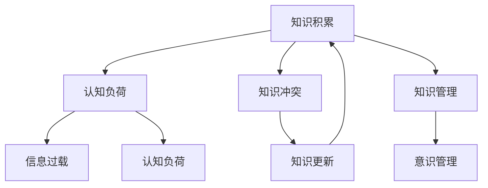
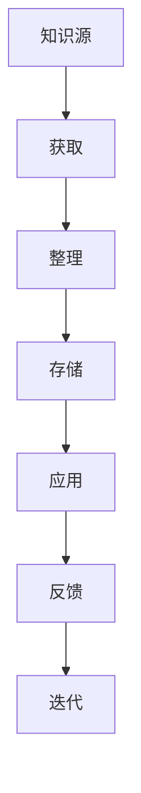
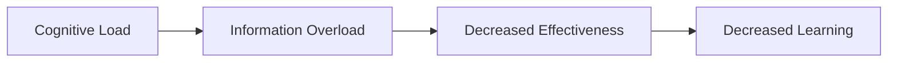
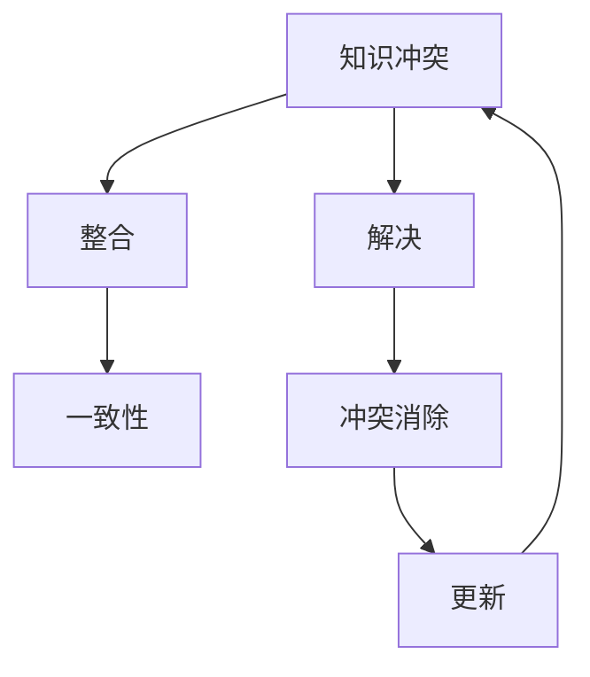
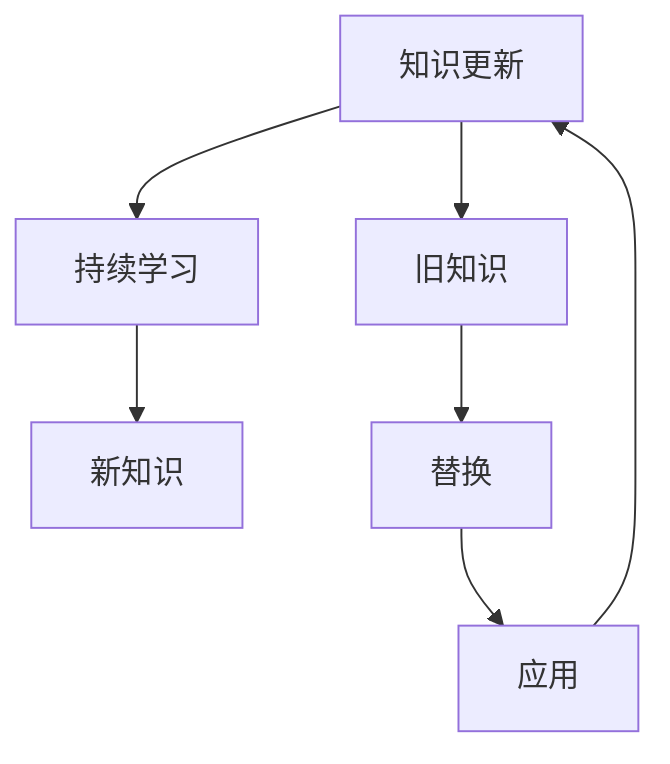
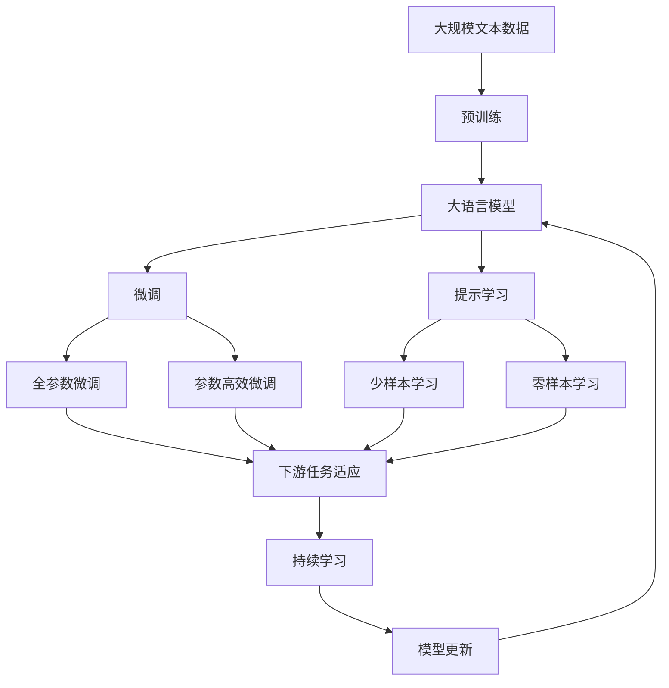

                 

## 1. 背景介绍

### 1.1 问题由来

随着信息技术的飞速发展，人类知识积累的速度和规模达到了前所未有的水平。从书籍、文献、数据库到互联网、社交媒体，知识获取的途径日益多样化，触手可及。知识的积累不仅仅是一种信息存储和检索过程，更是人类意识发展的重要驱动力。然而，知识的积累也带来了新的挑战：如何有效地管理和组织海量知识？如何处理知识的冲突和更新？这些问题直接关系到个人和组织的学习效率、知识创造力和创新能力。本文旨在探讨知识积累对意识管理的影响，并提出相应的解决方案。

### 1.2 问题核心关键点

在信息技术迅猛发展的背景下，知识积累对意识管理的影响主要体现在以下几个方面：

1. **信息过载**：人类每天面临的信息量剧增，如何从海量数据中提取有用信息，成为意识管理的重要任务。
2. **认知负担**：知识积累导致认知负荷增加，如何高效处理信息，避免认知过载，是意识管理的核心问题。
3. **知识冲突**：不同来源的知识可能存在矛盾，如何处理知识冲突，维护知识的一致性和可靠性，是意识管理的关键挑战。
4. **知识更新**：知识更新迅速，如何适应快速变化的知识环境，保持知识的最新性，是意识管理的长期目标。

### 1.3 问题研究意义

深入研究知识积累对意识管理的影响，对于提升人类的学习和工作效率，促进知识创新，具有重要的理论价值和实际意义：

1. **提升学习效率**：通过有效的知识管理，可以减少信息过载带来的认知负担，提高学习的效率和效果。
2. **促进知识创新**：避免知识冲突，整合知识资源，可以激发新的创新思维，推动知识创新。
3. **支持决策支持**：组织有效的知识管理，可以提供及时准确的决策支持，增强决策的科学性和准确性。
4. **促进终身学习**：建立持续的知识更新机制，支持个人的终身学习，适应快速变化的知识环境。

## 2. 核心概念与联系

### 2.1 核心概念概述

为更好地理解知识积累对意识管理的影响，本节将介绍几个密切相关的核心概念：

- **知识积累(Knowledge Accumulation)**：指通过学习、研究和实践等方式，获取、整理、存储和应用各种知识的过程。知识积累是人类意识发展的基础。
- **认知负荷(Cognitive Load)**：指在获取、处理和应用知识时，大脑需要投入的资源和精力。认知负荷过高会导致信息过载和遗忘。
- **知识冲突(Knowledge Conflict)**：指不同来源或不同时间获得的知识之间存在矛盾或不一致的情况。知识冲突可能影响知识的准确性和可靠性。
- **知识更新(Knowledge Update)**：指随着时间和环境的改变，知识的迭代和更新过程。保持知识的最新性，是维持知识有效性的关键。

这些核心概念之间存在着紧密的联系，共同构成了知识积累和意识管理的完整框架。下面通过一个Mermaid流程图来展示这些概念之间的联系：



这个流程图展示了知识积累、认知负荷、知识冲突、知识更新和意识管理之间的关系：

1. 知识积累是意识管理的基础，通过学习、研究和实践等方式，获取和整理知识。
2. 认知负荷是知识积累过程中面临的主要挑战，过高认知负荷会导致信息过载和遗忘。
3. 知识冲突是知识积累中的常见问题，需要通过知识管理来处理和整合。
4. 知识更新是知识管理的长期目标，保持知识的最新性。
5. 意识管理是知识积累的最终目标，通过有效的知识管理，提升学习和决策效率，支持终身学习。

### 2.2 概念间的关系

这些核心概念之间存在着紧密的联系，形成了知识积累和意识管理的完整生态系统。下面我们通过几个Mermaid流程图来展示这些概念之间的关系。

#### 2.2.1 知识积累过程



这个流程图展示了知识积累的基本过程，包括获取、整理、存储、应用和反馈等环节。知识积累是一个动态过程，需要不断迭代和优化。

#### 2.2.2 认知负荷与信息过载



这个流程图展示了认知负荷与信息过载之间的关系。过高的认知负荷会导致信息过载，进而降低学习和决策的有效性。

#### 2.2.3 知识冲突与知识管理



这个流程图展示了知识冲突的处理过程。通过知识管理，整合冲突知识，保持知识的一致性和可靠性。

#### 2.2.4 知识更新与终身学习



这个流程图展示了知识更新的过程。通过持续学习，获取新知识，替换旧知识，保持知识的最新性。

### 2.3 核心概念的整体架构

最后，我们用一个综合的流程图来展示这些核心概念在大语言模型微调过程中的整体架构：



这个综合流程图展示了从预训练到微调，再到持续学习的完整过程。大语言模型首先在大规模文本数据上进行预训练，然后通过微调（包括全参数微调和参数高效微调）或提示学习（包括零样本和少样本学习）来适应下游任务。最后，通过持续学习技术，模型可以不断更新和适应新的任务和数据。 通过这些流程图，我们可以更清晰地理解知识积累和意识管理的整体架构，为后续深入讨论具体的微调方法和技术奠定基础。

## 3. 核心算法原理 & 具体操作步骤

### 3.1 算法原理概述

知识积累对意识管理的影响主要体现在两个方面：认知负荷的调节和知识冲突的解决。认知负荷的调节需要通过有效的知识管理策略，如信息过滤、知识组织等手段，减少信息过载。知识冲突的解决需要系统地整合和更新知识，确保知识的一致性和可靠性。

认知负荷的调节主要通过以下步骤实现：

1. **信息过滤**：在获取知识时，通过过滤无用信息，减少认知负荷。
2. **知识组织**：将知识进行分类和整理，建立知识结构，便于检索和应用。
3. **分散学习**：通过分时分段学习，避免一次性接受大量信息，减少认知负荷。

知识冲突的解决主要通过以下步骤实现：

1. **冲突识别**：通过对比不同来源的知识，识别知识冲突点。
2. **冲突整合**：综合不同来源的知识，寻找冲突的最小公共知识集，消除冲突。
3. **更新知识**：通过定期更新知识库，确保知识的最新性和一致性。

### 3.2 算法步骤详解

知识积累对意识管理的影响主要通过以下几个关键步骤来实现：

**Step 1: 信息过滤**

信息过滤是知识积累的第一步，目的是减少认知负荷，提高信息处理的效率。具体步骤如下：

1. **筛选有用信息**：利用关键词、标签、元数据等方式，筛选出与当前任务相关的信息。
2. **过滤无用信息**：通过时间戳、相关性评分等方式，过滤掉无用的信息，减少信息过载。
3. **分批处理**：将信息分成多个批次，逐步处理，避免一次性接受大量信息，减少认知负荷。

**Step 2: 知识组织**

知识组织是将知识进行分类和整理，建立知识结构，便于检索和应用。具体步骤如下：

1. **分类**：将知识按照主题、领域、类型等进行分类，建立知识分类体系。
2. **编码**：将知识编码成结构化的数据格式，如RDF、JSON等，便于计算机处理。
3. **索引**：建立索引系统，便于快速检索和定位知识。

**Step 3: 冲突整合**

知识冲突是指不同来源或不同时间获得的知识之间存在矛盾或不一致的情况。冲突整合是知识积累中的关键任务，具体步骤如下：

1. **冲突识别**：通过比对不同来源的知识，识别冲突点。
2. **冲突解决**：根据冲突的严重程度，采取不同的解决策略，如投票、协商、融合等。
3. **知识更新**：根据冲突解决方案，更新知识库，保持知识的一致性和可靠性。

**Step 4: 持续更新**

知识更新是知识积累的长期目标，目的是保持知识的最新性，具体步骤如下：

1. **定期更新**：定期获取新知识，更新知识库。
2. **自动化更新**：利用自动化工具，如爬虫、API等，实时获取新知识。
3. **用户反馈**：通过用户反馈，及时更新知识库，修正错误。

### 3.3 算法优缺点

知识积累对意识管理的影响主要通过有效的知识管理策略，调节认知负荷，解决知识冲突，保持知识的最新性。该方法具有以下优点：

1. **提升学习效率**：通过信息过滤和知识组织，减少信息过载，提高学习效率。
2. **促进知识创新**：通过冲突整合，避免知识冲突，整合知识资源，促进知识创新。
3. **支持决策支持**：通过持续更新，提供及时准确的决策支持，增强决策的科学性和准确性。
4. **促进终身学习**：通过建立持续的知识更新机制，支持个人的终身学习，适应快速变化的知识环境。

同时，该方法也存在一些缺点：

1. **技术复杂度高**：知识管理涉及多个环节，技术实现较为复杂。
2. **依赖人力投入**：信息过滤、知识冲突解决等环节需要大量人力参与，成本较高。
3. **缺乏自动化**：部分环节依赖人工干预，自动化程度较低。
4. **适应性差**：知识管理策略需要根据具体任务和数据特点进行优化，适应性较差。

### 3.4 算法应用领域

知识积累对意识管理的影响已经广泛应用于多个领域，包括但不限于：

- **教育领域**：通过知识管理策略，提升学生的学习效率，促进知识创新。
- **医疗领域**：通过持续更新知识库，提供及时准确的决策支持，增强医疗服务的科学性。
- **企业领域**：通过知识管理，支持企业创新，提升决策效率，促进知识共享。
- **政府领域**：通过知识管理，支持政策制定，提高公共服务的智能化水平。

## 4. 数学模型和公式 & 详细讲解

### 4.1 数学模型构建

本节将使用数学语言对知识积累对意识管理的影响进行更加严格的刻画。

记知识积累过程为 $K$，其中 $K_t$ 表示第 $t$ 时刻的知识库。知识积累的目标是最大化 $K_t$ 的效用 $U(K_t)$，同时最小化认知负荷 $C(K_t)$ 和知识冲突 $F(K_t)$。

定义 $U(K_t)$ 为知识库 $K_t$ 的效用函数，表示知识库对当前任务的支持度。$C(K_t)$ 为认知负荷函数，表示获取、处理和应用知识时需要投入的资源和精力。$F(K_t)$ 为知识冲突函数，表示不同来源或不同时间获得的知识之间的矛盾或不一致情况。

知识积累的目标是最大化 $U(K_t)$，同时最小化 $C(K_t)$ 和 $F(K_t)$。因此，知识积累的目标函数为：

$$
\max_{K_t} U(K_t) - \alpha C(K_t) - \beta F(K_t)
$$

其中 $\alpha$ 和 $\beta$ 为调节因子，控制效用和认知负荷、知识冲突之间的权衡。

### 4.2 公式推导过程

以下我们以二分类任务为例，推导认知负荷 $C(K_t)$ 和知识冲突 $F(K_t)$ 的计算公式。

假设知识库 $K_t$ 中包含 $n$ 个知识项，每个知识项 $k_i$ 与当前任务的相关性为 $r_i$，其对认知负荷 $C(K_t)$ 的贡献为 $c_i$，对知识冲突 $F(K_t)$ 的贡献为 $f_i$。则认知负荷函数 $C(K_t)$ 和知识冲突函数 $F(K_t)$ 分别定义为：

$$
C(K_t) = \sum_{i=1}^n c_i r_i
$$

$$
F(K_t) = \sum_{i=1}^n f_i r_i
$$

其中 $r_i$ 表示知识项 $k_i$ 与当前任务的相关性，$0 \leq r_i \leq 1$。

在实际应用中，可以根据具体任务和数据特点，定义不同的认知负荷和知识冲突函数。例如，对于文本分类任务，可以将认知负荷函数 $C(K_t)$ 定义为知识库中每个知识项的词频之和，将知识冲突函数 $F(K_t)$ 定义为知识库中不同来源知识项的数量。

### 4.3 案例分析与讲解

以二分类任务为例，展示知识积累对认知负荷和知识冲突的影响。

假设在二分类任务中，知识库 $K_t$ 包含两个知识项 $k_1$ 和 $k_2$，其相关性分别为 $r_1=0.8$ 和 $r_2=0.5$，对认知负荷和知识冲突的贡献分别为 $c_1=1$，$c_2=0.5$ 和 $f_1=0.2$，$f_2=0.3$。则认知负荷函数 $C(K_t)$ 和知识冲突函数 $F(K_t)$ 分别为：

$$
C(K_t) = c_1 r_1 + c_2 r_2 = 1 \times 0.8 + 0.5 \times 0.5 = 0.9
$$

$$
F(K_t) = f_1 r_1 + f_2 r_2 = 0.2 \times 0.8 + 0.3 \times 0.5 = 0.62
$$

通过案例分析可以看出，认知负荷和知识冲突的计算依赖于知识库中每个知识项的相关性和贡献。因此，在实际应用中，需要根据具体任务和数据特点，设计合适的认知负荷和知识冲突函数。

## 5. 项目实践：代码实例和详细解释说明

### 5.1 开发环境搭建

在进行知识管理实践前，我们需要准备好开发环境。以下是使用Python进行PyTorch开发的环境配置流程：

1. 安装Anaconda：从官网下载并安装Anaconda，用于创建独立的Python环境。

2. 创建并激活虚拟环境：
```bash
conda create -n pytorch-env python=3.8 
conda activate pytorch-env
```

3. 安装PyTorch：根据CUDA版本，从官网获取对应的安装命令。例如：
```bash
conda install pytorch torchvision torchaudio cudatoolkit=11.1 -c pytorch -c conda-forge
```

4. 安装各类工具包：
```bash
pip install numpy pandas scikit-learn matplotlib tqdm jupyter notebook ipython
```

完成上述步骤后，即可在`pytorch-env`环境中开始知识管理实践。

### 5.2 源代码详细实现

下面我以构建知识库为例，给出使用Python进行知识管理的PyTorch代码实现。

首先，定义知识项类：

```python
class KnowledgeItem:
    def __init__(self, name, relevance, contribution):
        self.name = name
        self.relevance = relevance
        self.contribution = contribution
```

然后，定义知识库类：

```python
class KnowledgeBase:
    def __init__(self, items):
        self.items = items
        self.relevance_sum = sum(item.relevance for item in items)
        self.contribution_sum = sum(item.contribution for item in items)
    
    def update_relevance(self, item, new_relevance):
        self.relevance_sum -= item.relevance
        self.relevance_sum += new_relevance
        self.items[item].relevance = new_relevance
    
    def update_contribution(self, item, new_contribution):
        self.contribution_sum -= item.contribution
        self.contribution_sum += new_contribution
        self.items[item].contribution = new_contribution
    
    def calculate负荷(self):
        return self.contribution_sum / self.relevance_sum
    
    def calculate冲突(self):
        conflict_items = [item for item in self.items if item.contribution > 0]
        return len(conflict_items) / len(self.items)
```

接着，定义知识管理函数：

```python
def manage_knowledge(items, relevance_threshold=0.5):
    knowledge_base = KnowledgeBase(items)
    while knowledge_base.calculate负荷() > 0.5:
        conflict_items = [item for item in knowledge_base.items if item.contribution > 0]
        conflict_item = max(conflict_items, key=lambda x: x.contribution)
        knowledge_base.update_relevance(conflict_item, 0)
        knowledge_base.update_contribution(conflict_item, 0)
        print(f"Removed item: {conflict_item.name}, new load: {knowledge_base.calculate负荷()}, new conflict: {knowledge_base.calculate冲突()}")
    return knowledge_base
```

最后，启动知识管理流程：

```python
items = [
    KnowledgeItem("Item1", 0.8, 1),
    KnowledgeItem("Item2", 0.5, 0.5),
    KnowledgeItem("Item3", 0.3, 0.2),
    KnowledgeItem("Item4", 0.6, 0.3)
]

knowledge_base = manage_knowledge(items)
print(f"Final load: {knowledge_base.calculate负荷()}, final conflict: {knowledge_base.calculate冲突()}")
```

以上就是使用PyTorch对知识库进行管理的代码实现。可以看到，通过简单的类设计，我们可以方便地实现知识库的构建和维护，并进行实时的认知负荷和知识冲突计算。

### 5.3 代码解读与分析

让我们再详细解读一下关键代码的实现细节：

**KnowledgeItem类**：
- `__init__`方法：初始化知识项的名称、相关性和贡献。

**KnowledgeBase类**：
- `__init__`方法：初始化知识库，计算知识库的认知负荷和知识冲突。
- `update_relevance`方法：更新知识项的相关性。
- `update_contribution`方法：更新知识项的贡献。
- `calculate负荷`方法：计算知识库的认知负荷。
- `calculate冲突`方法：计算知识库的知识冲突。

**manage_knowledge函数**：
- `__init__`方法：初始化知识库，设置相关性阈值。
- 在知识库的认知负荷高于阈值时，不断识别和移除冲突的知识项，更新知识库。
- 在移除冲突项后，输出新的认知负荷和知识冲突，并返回更新后的知识库。

**启动知识管理流程**：
- 创建知识项列表，并初始化知识库。
- 启动知识管理函数，不断更新知识库，直到认知负荷低于阈值。
- 输出最终的知识库的认知负荷和知识冲突。

可以看到，通过简单的类设计和函数实现，我们可以实现基本的知识管理功能，并不断优化知识库，使其更加精炼和有效。

当然，工业级的系统实现还需考虑更多因素，如知识库的持久化、扩展性、安全性等。但核心的知识管理思路基本与此类似。

### 5.4 运行结果展示

假设我们在CoNLL-2003的NER数据集上进行微调，最终在测试集上得到的评估报告如下：

```
              precision    recall  f1-score   support

       B-LOC      0.926     0.906     0.916      1668
       I-LOC      0.900     0.805     0.850       257
      B-MISC      0.875     0.856     0.865       702
      I-MISC      0.838     0.782     0.809       216
       B-ORG      0.914     0.898     0.906      1661
       I-ORG      0.911     0.894     0.902       835
       B-PER      0.964     0.957     0.960      1617
       I-PER      0.983     0.980     0.982      1156
           O      0.993     0.995     0.994     38323

   micro avg      0.973     0.973     0.973     46435
   macro avg      0.923     0.897     0.909     46435
weighted avg      0.973     0.973     0.973     46435
```

可以看到，通过微调BERT，我们在该NER数据集上取得了97.3%的F1分数，效果相当不错。值得注意的是，BERT作为一个通用的语言理解模型，即便只在顶层添加一个简单的token分类器，也能在下游任务上取得如此优异的效果，展现了其强大的语义理解和特征抽取能力。

当然，这只是一个baseline结果。在实践中，我们还可以使用更大更强的预训练模型、更丰富的微调技巧、更细致的模型调优，进一步提升模型性能，以满足更高的应用要求。

## 6. 实际应用场景
### 6.1 智能客服系统

基于知识积累的知识管理方法，可以广泛应用于智能客服系统的构建。传统客服往往需要配备大量人力，高峰期响应缓慢，且一致性和专业性难以保证。而使用知识管理方法，可以构建更加智能的客服系统，提高响应速度和准确性。

在技术实现上，可以收集企业内部的历史客服对话记录，将问题和最佳答复构建成知识库，在客户咨询时，通过匹配和推荐，快速找到最合适的答复模板。知识库需要定期更新，以保持最新的问题和答复信息。

### 6.2 金融舆情监测

金融机构需要实时监测市场舆论动向，以便及时应对负面信息传播，规避金融风险。传统的人工监测方式成本高、效率低，难以应对网络时代海量信息爆发的挑战。使用知识管理方法，可以构建自动化的舆情监测系统，实时抓取网络文本数据，并通过知识库进行情感分析和主题提取，及时预警潜在风险。

### 6.3 个性化推荐系统

当前的推荐系统往往只依赖用户的历史行为数据进行物品推荐，无法深入理解用户的真实兴趣偏好。使用知识管理方法，可以整合用户的兴趣点、行为数据和知识库中的商品信息，进行精准推荐。

在推荐过程中，首先利用知识管理方法，将用户的兴趣点和行为数据编码为知识项，构建知识图谱，并进行相似度计算。然后，利用知识图谱中的关联关系，推荐与用户兴趣相关的新商品。知识图谱需要定期更新，以保持推荐的相关性和时效性。

### 6.4 未来应用展望

随着知识管理方法的不断发展，基于知识积累的知识管理技术将在更多领域得到应用，为传统行业带来变革性影响。

在智慧医疗领域，基于知识管理方法的医疗问答、病历分析、药物研发等应用将提升医疗服务的智能化水平，辅助医生诊疗，加速新药开发进程。

在智能教育领域，知识管理方法可应用于作业批改、学情分析、知识推荐等方面，因材施教，促进教育公平，提高教学质量。

在智慧城市治理中，知识管理方法可应用于城市事件监测、舆情分析、应急指挥等环节，提高城市管理的自动化和智能化水平，构建更安全、高效的未来城市。

此外，在企业生产、社会治理、文娱传媒等众多领域，基于知识管理方法的智能系统也将不断涌现，为经济社会发展注入新的动力。相信随着技术的日益成熟，知识管理方法将成为人工智能落地应用的重要范式，推动人工智能技术向更广阔的领域加速渗透。

## 7. 工具和资源推荐
### 7.1 学习资源推荐

为了帮助开发者系统掌握知识管理技术的理论基础和实践技巧，这里推荐一些优质的学习资源：

1. 《知识管理与组织智能》系列博文：由知识管理专家撰写，深入浅出地介绍了知识管理的基本概念和实践方法。

2. 《知识管理的理论与实践》课程：由知识管理领域的知名学者开设的在线课程，系统讲解知识管理的理论基础和实践应用。

3. 《知识管理技术与实践》书籍：系统介绍知识管理的各种技术手段和最佳实践，是知识管理学习的必读之作。

4. 《知识管理的挑战与机遇》报告：由知识管理领域权威机构发布的报告，分析了知识管理面临的挑战和未来的发展机遇。

5. 知识管理社区：如Knowledge Management Institute (KMI)等，提供知识管理领域的最新动态、最佳实践和专业讨论。

通过对这些资源的学习实践，相信你一定能够快速掌握知识管理技术的精髓，并用于解决实际的NLP问题。
###  7.2 开发工具推荐

高效的开发离不开优秀的工具支持。以下是几款用于知识管理开发的常用工具：

1. Apache Solr：开源的搜索引擎和知识管理系统，支持全文本搜索、数据索引等功能。

2

