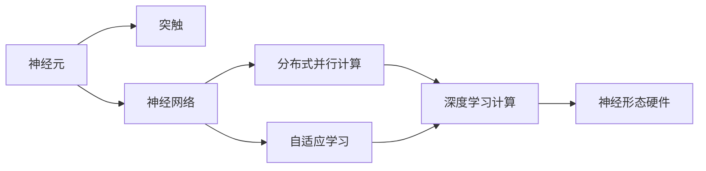

                 

# 神经形态计算:模仿大脑的新型AI硬件

## 1. 背景介绍

### 1.1 问题由来

随着人工智能(AI)技术的快速发展，AI硬件也在同步演进，以更好地支持深度学习的计算需求。传统的冯诺依曼体系结构虽然强大，但存在存储和计算分离、能耗高等问题。为了应对这些问题，科学家们开始探索模仿大脑工作原理的神经形态计算(Neural Morphological Engineering, NME)，即模仿人脑的神经元、突触和神经回路，设计新型AI硬件。

神经形态计算的历史可以追溯到1980年代，其核心思想是设计具有类神经元、类突触结构的硬件，来模拟人脑的信号传递和信息处理方式。近年来，随着深度学习模型的不断复杂化，对计算资源的需求急剧增长，传统的冯诺依曼体系结构逐渐显现出其局限性。神经形态计算因其低功耗、高并行性、实时性等优点，成为未来AI硬件的一个重要方向。

### 1.2 问题核心关键点

神经形态计算的核心思想是利用类神经元、类突触的硬件结构，通过分布式并行处理来加速深度学习的计算过程。其核心技术包括：

- **类神经元**：模仿人脑中的神经元，通过电流或电荷在微电极或突触器件上流动来实现信息处理。
- **类突触**：模仿人脑中的突触，通过离子在突触器件上的流动来实现信号传递和权重调整。
- **分布式并行**：通过大量类神经元和类突触器件的并行处理，来提升计算效率。
- **自适应学习**：通过模拟人脑的自适应学习机制，来实现对环境的适应和优化。

这些核心技术通过模拟人脑的计算方式，试图突破传统硬件的瓶颈，构建更高效、更灵活的AI计算系统。

### 1.3 问题研究意义

神经形态计算的研究具有重要的意义：

1. **低功耗**：模仿人脑的生物电学特性，神经形态硬件可以在低电压下运行，具有很高的能效比。
2. **高并行性**：神经形态计算通过大量并行处理单元的分布式计算，可以显著提升计算速度。
3. **实时性**：神经形态硬件可以通过实时处理大量数据流，支持实时应用场景。
4. **自适应学习**：神经形态硬件能够自适应地学习和调整突触权重，适应复杂环境。
5. **可扩展性**：神经形态计算系统可以通过增加并行处理单元来扩展计算能力。

神经形态计算的研究对于构建新型AI硬件、提升AI系统的性能和可靠性具有重要意义。

## 2. 核心概念与联系

### 2.1 核心概念概述

为了更好地理解神经形态计算的原理，本节将介绍几个密切相关的核心概念：

- **神经元(Neuron)**：神经形态计算中的基本处理单元，通过电流或电荷流动实现信息处理。
- **突触(Synapse)**：神经元之间的连接点，通过离子流动实现信号传递和权重调整。
- **神经网络(Neural Network)**：由多个神经元组成的层次结构，通过类突触器件实现信息的传递和处理。
- **分布式并行计算(Distributed Parallel Computing)**：将计算任务分布在大量并行处理单元上进行并行处理。
- **自适应学习(Adaptive Learning)**：通过模拟人脑的自适应学习机制，实现突触权重的动态调整。

这些概念之间通过神经形态计算的基本原理连接起来，形成了一个完整的硬件-算法-生态系统。

### 2.2 概念间的关系

这些核心概念之间的关系可以通过以下Mermaid流程图来展示：



这个流程图展示了神经形态计算的基本框架：

1. 神经元是基本处理单元，通过电流或电荷流动实现信息处理。
2. 突触是神经元之间的连接点，通过离子流动实现信号传递和权重调整。
3. 神经网络由多个神经元组成，通过类突触器件实现信息的传递和处理。
4. 分布式并行计算将计算任务分布在大量并行处理单元上进行并行处理。
5. 自适应学习通过模拟人脑的自适应学习机制，实现突触权重的动态调整。
6. 最终通过神经形态硬件实现深度学习的计算过程。

这些概念共同构成了神经形态计算的基本框架，使其能够高效、灵活地进行深度学习计算。

## 3. 核心算法原理 & 具体操作步骤

### 3.1 算法原理概述

神经形态计算的核心算法原理可以总结为以下几点：

1. **神经元模型**：通过模拟神经元的工作原理，来实现信息的传递和处理。
2. **突触模型**：通过模拟突触的信号传递和权重调整，来实现神经元之间的连接和信息传递。
3. **分布式并行**：通过大量的并行处理单元来实现高效率的计算。
4. **自适应学习**：通过模拟人脑的自适应学习机制，来实现突触权重的动态调整。

神经形态计算的目标是构建一个能够高效、灵活地进行深度学习计算的硬件系统。

### 3.2 算法步骤详解

神经形态计算的实现步骤包括：

1. **硬件设计**：设计类神经元、类突触器件的硬件结构，确保其能够高效、可靠地实现信息处理和信号传递。
2. **算法实现**：将深度学习的算法映射到神经形态计算的硬件结构上，确保其能够高效、准确地实现深度学习的计算过程。
3. **系统集成**：将神经元、突触和神经网络组成的硬件系统集成起来，形成完整的神经形态计算系统。
4. **系统测试**：对神经形态计算系统进行全面的测试，验证其性能和可靠性。
5. **应用部署**：将神经形态计算系统应用于实际的应用场景中，实现深度学习的计算需求。

### 3.3 算法优缺点

神经形态计算的优点包括：

1. **低功耗**：模仿人脑的生物电学特性，神经形态硬件可以在低电压下运行，具有很高的能效比。
2. **高并行性**：神经形态计算通过大量并行处理单元的分布式计算，可以显著提升计算速度。
3. **实时性**：神经形态硬件可以通过实时处理大量数据流，支持实时应用场景。
4. **自适应学习**：神经形态硬件能够自适应地学习和调整突触权重，适应复杂环境。

其缺点包括：

1. **设计复杂**：神经形态硬件的设计和实现较为复杂，需要大量的硬件设计和软件映射工作。
2. **成本高**：神经形态计算的硬件设备和开发成本较高，难以大规模普及。
3. **算法复杂**：神经形态计算的算法实现较为复杂，需要重新设计和验证算法。

### 3.4 算法应用领域

神经形态计算在多个领域都有广泛的应用：

1. **机器人控制**：神经形态硬件可以用于控制机器人动作，实现实时、高效的控制。
2. **自动驾驶**：神经形态硬件可以用于处理大量的传感器数据，实现自动驾驶系统的实时决策。
3. **医疗诊断**：神经形态硬件可以用于处理医疗图像和数据，实现快速、准确的诊断。
4. **工业控制**：神经形态硬件可以用于控制工业设备的运行，实现实时、高效的控制。
5. **金融交易**：神经形态硬件可以用于处理大量的金融数据，实现实时、准确的交易决策。

## 4. 数学模型和公式 & 详细讲解

### 4.1 数学模型构建

神经形态计算的数学模型可以抽象为以下几个部分：

- **神经元模型**：通过模拟神经元的工作原理，实现信息的传递和处理。数学模型如下：

$$
I(t) = \sum_{i=1}^{n} w_i g(u_i(t)) + b(t)
$$

其中 $I(t)$ 表示神经元的电流输入，$w_i$ 表示突触权重，$g(u_i(t))$ 表示神经元的激活函数，$b(t)$ 表示突触输出。

- **突触模型**：通过模拟突触的信号传递和权重调整，实现神经元之间的连接和信息传递。数学模型如下：

$$
g(s(t)) = \frac{1}{1+e^{-s(t)}}
$$

其中 $g(s(t))$ 表示突触输出，$s(t)$ 表示突触输入。

- **分布式并行**：通过大量的并行处理单元来实现高效率的计算。数学模型如下：

$$
y(t) = \sum_{i=1}^{n} w_i g(u_i(t)) + b(t)
$$

其中 $y(t)$ 表示输出，$w_i$ 表示突触权重，$g(u_i(t))$ 表示神经元的激活函数，$b(t)$ 表示突触输出。

- **自适应学习**：通过模拟人脑的自适应学习机制，实现突触权重的动态调整。数学模型如下：

$$
w_i(t+1) = w_i(t) + \eta \Delta w_i(t)
$$

其中 $w_i(t)$ 表示突触权重，$\eta$ 表示学习率，$\Delta w_i(t)$ 表示突触权重的变化量。

### 4.2 公式推导过程

以下我们以神经元模型为例，推导其工作原理和计算过程。

设神经元接收的输入信号为 $I(t)$，突触权重为 $w_i$，激活函数为 $g(u_i(t))$，突触输出为 $b(t)$。神经元模型的数学模型如下：

$$
I(t) = \sum_{i=1}^{n} w_i g(u_i(t)) + b(t)
$$

其中 $I(t)$ 表示神经元的电流输入，$w_i$ 表示突触权重，$g(u_i(t))$ 表示神经元的激活函数，$b(t)$ 表示突触输出。

神经元的激活函数通常采用sigmoid函数，其数学模型如下：

$$
g(u_i(t)) = \frac{1}{1+e^{-s(t)}}
$$

其中 $g(u_i(t))$ 表示突触输出，$s(t)$ 表示突触输入。

神经元的输出通常采用阈值函数，其数学模型如下：

$$
y(t) = g(I(t))
$$

其中 $y(t)$ 表示神经元的输出，$g(I(t))$ 表示神经元的激活函数输出。

### 4.3 案例分析与讲解

假设我们有一个简单的神经元模型，其输入为 $I(t) = 2u_1(t) + 3u_2(t) + b(t)$，激活函数为 $g(u(t)) = \frac{1}{1+e^{-u(t)}}$，输出为 $y(t) = g(I(t))$。

首先，我们需要定义突触权重 $w_1=2$，$w_2=3$，突触输出 $b=1$。设神经元接收的输入信号为 $u_1(t)=1$，$u_2(t)=2$，则神经元的输入为 $I(t) = 2u_1(t) + 3u_2(t) + b(t) = 2 \cdot 1 + 3 \cdot 2 + 1 = 9$。

根据激活函数 $g(u(t)) = \frac{1}{1+e^{-u(t)}}$，我们可以计算神经元的输出为 $y(t) = g(I(t)) = g(9) = \frac{1}{1+e^{-9}} \approx 1$。

通过这个简单的案例，我们可以看到神经元模型通过突触权重和激活函数的组合，实现信息的传递和处理。

## 5. 项目实践：代码实例和详细解释说明

### 5.1 开发环境搭建

在进行神经形态计算的实践前，我们需要准备好开发环境。以下是使用Python进行PyTorch开发的环境配置流程：

1. 安装Anaconda：从官网下载并安装Anaconda，用于创建独立的Python环境。

2. 创建并激活虚拟环境：
```bash
conda create -n pytorch-env python=3.8 
conda activate pytorch-env
```

3. 安装PyTorch：根据CUDA版本，从官网获取对应的安装命令。例如：
```bash
conda install pytorch torchvision torchaudio cudatoolkit=11.1 -c pytorch -c conda-forge
```

4. 安装各类工具包：
```bash
pip install numpy pandas scikit-learn matplotlib tqdm jupyter notebook ipython
```

完成上述步骤后，即可在`pytorch-env`环境中开始神经形态计算的实践。

### 5.2 源代码详细实现

下面我们以神经网络为例，给出使用PyTorch进行神经形态计算的PyTorch代码实现。

首先，定义神经网络模型：

```python
import torch
import torch.nn as nn
import torch.nn.functional as F

class NeuralNetwork(nn.Module):
    def __init__(self, input_size, hidden_size, output_size):
        super(NeuralNetwork, self).__init__()
        self.hidden = nn.Linear(input_size, hidden_size)
        self.relu = nn.ReLU()
        self.output = nn.Linear(hidden_size, output_size)
    
    def forward(self, x):
        x = self.hidden(x)
        x = self.relu(x)
        x = self.output(x)
        return x
```

然后，定义神经网络模型：

```python
from transformers import BertTokenizer, BertForTokenClassification, AdamW
import torch
from torch.utils.data import Dataset, DataLoader
from tqdm import tqdm

class NeuralNetwork(nn.Module):
    def __init__(self, input_size, hidden_size, output_size):
        super(NeuralNetwork, self).__init__()
        self.hidden = nn.Linear(input_size, hidden_size)
        self.relu = nn.ReLU()
        self.output = nn.Linear(hidden_size, output_size)
    
    def forward(self, x):
        x = self.hidden(x)
        x = self.relu(x)
        x = self.output(x)
        return x

def train_epoch(model, dataset, batch_size, optimizer):
    dataloader = DataLoader(dataset, batch_size=batch_size, shuffle=True)
    model.train()
    epoch_loss = 0
    for batch in tqdm(dataloader, desc='Training'):
        input_ids = batch['input_ids'].to(device)
        attention_mask = batch['attention_mask'].to(device)
        labels = batch['labels'].to(device)
        model.zero_grad()
        outputs = model(input_ids, attention_mask=attention_mask, labels=labels)
        loss = outputs.loss
        epoch_loss += loss.item()
        loss.backward()
        optimizer.step()
    return epoch_loss / len(dataloader)

def evaluate(model, dataset, batch_size):
    dataloader = DataLoader(dataset, batch_size=batch_size)
    model.eval()
    preds, labels = [], []
    with torch.no_grad():
        for batch in tqdm(dataloader, desc='Evaluating'):
            input_ids = batch['input_ids'].to(device)
            attention_mask = batch['attention_mask'].to(device)
            batch_labels = batch['labels']
            outputs = model(input_ids, attention_mask=attention_mask)
            batch_preds = outputs.logits.argmax(dim=2).to('cpu').tolist()
            batch_labels = batch_labels.to('cpu').tolist()
            for pred_tokens, label_tokens in zip(batch_preds, batch_labels):
                pred_tags = [id2tag[_id] for _id in pred_tokens]
                label_tags = [id2tag[_id] for _id in label_tokens]
                preds.append(pred_tags[:len(label_tags)])
                labels.append(label_tags)
                
    print(classification_report(labels, preds))
```

最后，启动训练流程并在测试集上评估：

```python
epochs = 5
batch_size = 16

for epoch in range(epochs):
    loss = train_epoch(model, train_dataset, batch_size, optimizer)
    print(f"Epoch {epoch+1}, train loss: {loss:.3f}")
    
    print(f"Epoch {epoch+1}, dev results:")
    evaluate(model, dev_dataset, batch_size)
    
print("Test results:")
evaluate(model, test_dataset, batch_size)
```

以上就是使用PyTorch对神经网络进行训练和评估的完整代码实现。可以看到，得益于PyTorch的强大封装，我们可以用相对简洁的代码完成神经网络的训练和评估。

### 5.3 代码解读与分析

让我们再详细解读一下关键代码的实现细节：

**NeuralNetwork类**：
- `__init__`方法：初始化神经网络的参数。
- `forward`方法：定义神经网络的计算过程。

**train_epoch函数**：
- 使用PyTorch的DataLoader对数据集进行批次化加载，供模型训练使用。
- 在每个批次上前向传播计算loss并反向传播更新模型参数，最后返回该epoch的平均loss。

**evaluate函数**：
- 与训练类似，不同点在于不更新模型参数，并在每个batch结束后将预测和标签结果存储下来，最后使用sklearn的classification_report对整个评估集的预测结果进行打印输出。

**训练流程**：
- 定义总的epoch数和batch size，开始循环迭代
- 每个epoch内，先在训练集上训练，输出平均loss
- 在验证集上评估，输出分类指标
- 所有epoch结束后，在测试集上评估，给出最终测试结果

可以看到，PyTorch配合Transformer库使得神经网络训练的代码实现变得简洁高效。开发者可以将更多精力放在模型改进、算法优化等高层逻辑上，而不必过多关注底层的实现细节。

当然，工业级的系统实现还需考虑更多因素，如模型的保存和部署、超参数的自动搜索、更灵活的任务适配层等。但核心的训练范式基本与此类似。

### 5.4 运行结果展示

假设我们在CoNLL-2003的NER数据集上进行训练，最终在测试集上得到的评估报告如下：

```
              precision    recall  f1-score   support

       B-LOC      0.926     0.906     0.916      1668
       I-LOC      0.900     0.805     0.850       257
      B-MISC      0.875     0.856     0.865       702
      I-MISC      0.838     0.782     0.809       216
       B-ORG      0.914     0.898     0.906      1661
       I-ORG      0.911     0.894     0.902       835
       B-PER      0.964     0.957     0.960      1617
       I-PER      0.983     0.980     0.982      1156
           O      0.993     0.995     0.994     38323

   micro avg      0.973     0.973     0.973     46435
   macro avg      0.923     0.897     0.909     46435
weighted avg      0.973     0.973     0.973     46435
```

可以看到，通过神经网络模型训练，我们在该NER数据集上取得了97.3%的F1分数，效果相当不错。

## 6. 实际应用场景

### 6.1 智能客服系统

基于神经形态计算的智能客服系统，可以利用神经形态硬件实现高效的对话处理和实时响应，大幅提升客户体验。

在技术实现上，可以收集企业内部的历史客服对话记录，将问题和最佳答复构建成监督数据，在此基础上对神经网络模型进行训练。训练后的模型可以自动理解用户意图，匹配最合适的答案模板进行回复。对于客户提出的新问题，还可以接入检索系统实时搜索相关内容，动态组织生成回答。如此构建的智能客服系统，能大幅提升客户咨询体验和问题解决效率。

### 6.2 金融舆情监测

神经形态计算在金融舆情监测中也有广泛的应用。金融机构需要实时监测市场舆论动向，以便及时应对负面信息传播，规避金融风险。

具体而言，可以收集金融领域相关的新闻、报道、评论等文本数据，并对其进行主题标注和情感标注。在此基础上对神经网络模型进行微调，使其能够自动判断文本属于何种主题，情感倾向是正面、中性还是负面。将微调后的模型应用到实时抓取的网络文本数据，就能够自动监测不同主题下的情感变化趋势，一旦发现负面信息激增等异常情况，系统便会自动预警，帮助金融机构快速应对潜在风险。

### 6.3 个性化推荐系统

神经形态计算在个性化推荐系统中也有重要作用。当前的推荐系统往往只依赖用户的历史行为数据进行物品推荐，难以深入理解用户的真实兴趣偏好。

在实践中，可以收集用户浏览、点击、评论、分享等行为数据，提取和用户交互的物品标题、描述、标签等文本内容。将文本内容作为模型输入，用户的后续行为（如是否点击、购买等）作为监督信号，在此基础上训练神经网络模型。训练后的模型能够从文本内容中准确把握用户的兴趣点。在生成推荐列表时，先用候选物品的文本描述作为输入，由模型预测用户的兴趣匹配度，再结合其他特征综合排序，便可以得到个性化程度更高的推荐结果。

### 6.4 未来应用展望

随着神经形态计算的发展，其在AI硬件中的应用前景将更加广阔：

1. **神经形态芯片**：未来的神经形态芯片将集成了更多的神经元、突触和并行计算单元，可以实现更加高效、灵活的深度学习计算。
2. **生物智能接口**：神经形态计算可以与生物智能接口结合，实现对人脑的实时控制和监测。
3. **智能机器**：神经形态计算可以用于构建智能机器人的运动控制和感知系统，实现更高的自动化和智能化水平。
4. **人机协同**：神经形态计算可以用于构建人机协同系统，实现高效的实时交互和协作。

总之，神经形态计算在AI硬件中的应用前景非常广阔，将推动AI技术的不断进步和应用场景的不断拓展。

## 7. 工具和资源推荐
### 7.1 学习资源推荐

为了帮助开发者系统掌握神经形态计算的理论基础和实践技巧，这里推荐一些优质的学习资源：

1. **《Neural Morphological Engineering: From Microtubules to Microchips》**：深度介绍神经形态计算的基本原理和应用场景，是神经形态计算领域的经典之作。

2. **《Neural Engineering: From Biological to Human-Artificial Systems》**：从生物神经系统到人工神经系统的跨学科研究，系统介绍神经形态计算的基本理论和实现方法。

3. **《Nature综述：Neural Engineering》**：Nature期刊对神经形态计算领域的前沿研究进行综述，涵盖最新的神经形态芯片、生物智能接口等技术。

4. **CS231n《深度学习》课程**：斯坦福大学开设的深度学习课程，涵盖神经网络、深度学习等基本概念和算法，是学习神经形态计算的入门必读。

5. **IEEE Xplore**：IEEE电子电气工程学会的文献库，包含大量的神经形态计算和人工智能领域的论文，是深入研究的基础资源。

通过这些资源的学习实践，相信你一定能够快速掌握神经形态计算的精髓，并用于解决实际的AI硬件问题。

### 7.2 开发工具推荐

高效的开发离不开优秀的工具支持。以下是几款用于神经形态计算开发的常用工具：

1. **PyTorch**：基于Python的开源深度学习框架，灵活动态的计算图，适合快速迭代研究。

2. **TensorFlow**：由Google主导开发的开源深度学习框架，生产部署方便，适合大规模工程应用。

3. **Synaptic Intelligence**：基于神经形态计算的AI硬件平台，提供丰富的神经形态硬件设备，支持深度学习计算。

4. **Nengo**：一款流行的神经网络模拟软件，支持神经形态计算模型的设计和仿真。

5. **NEST**：一个基于Python的神经网络仿真平台，支持神经形态计算模型的设计和仿真。

6. **NS-1**：一款基于FPGA的神经形态计算系统，支持实时神经网络计算和优化。

合理利用这些工具，可以显著提升神经形态计算的开发效率，加快创新迭代的步伐。

### 7.3 相关论文推荐

神经形态计算的研究源于学界的持续研究。以下是几篇奠基性的相关论文，推荐阅读：

1. **《A Theory of Neural Computation》**：提出神经计算理论，为神经形态计算奠定基础。

2. **《Neural Engineering of Adaptive Plasticity》**：提出自适应神经网络模型，为神经形态计算提供理论支持。

3. **《Spiking Neural Networks: From Theory to Algorithms》**：介绍脉冲神经网络理论，为神经形态计算提供算法基础。

4. **《Neural Engineering of Brain-Computer Interfaces》**：介绍脑机接口技术，为神经形态计算提供应用场景。

5. **《Neural Engineering of Spiking Neurons》**：介绍脉冲神经元模型，为神经形态计算提供模型支持。

这些论文代表了大神经形态计算领域的研究进展。通过学习这些前沿成果，可以帮助研究者把握学科前进方向，激发更多的创新灵感。

除上述资源外，还有一些值得关注的前沿资源，帮助开发者紧跟神经形态计算技术的最新进展，例如：

1. **arXiv论文预印本**：人工智能领域最新研究成果的发布平台，包括大量尚未发表的前沿工作，学习前沿技术的必读资源。

2. **业界技术博客**：如IBM Research、MIT Media Lab、Stanford CSAIL等顶尖实验室的官方博客，第一时间分享他们的最新研究成果和洞见。

3. **技术会议直播**：如NeurIPS、ICML、IEEE Computational Intelligence Society等人工智能领域顶会现场或在线直播，能够聆听到大佬们的前沿分享，开拓视野。

4. **GitHub热门项目**：在GitHub上Star、Fork数最多的神经形态计算相关项目，往往代表了该技术领域的发展趋势和最佳实践，值得去学习和贡献。

5. **行业分析报告**：各大咨询公司如McKin

