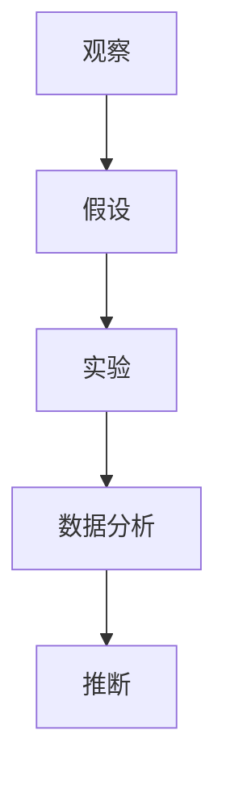

                 

# 科学方法：从观察到实验

> 关键词：科学方法, 观察, 实验, 数据, 假设, 验证, 推断, 统计学, 案例分析, 计算模型

## 1. 背景介绍

### 1.1 问题由来

科学方法论是人类探索自然世界、解释现象的基本框架。它包括了从观察、提出假设、设计实验到数据分析、推断结论的完整过程。在信息技术领域，科学方法论同样具有重要意义，尤其是在解决复杂技术问题、验证理论假设时显得尤为关键。

在现代科技发展中，科学方法论的应用已经从传统的物理、化学等自然科学领域拓展到了信息技术、计算机科学、人工智能等领域。它不仅有助于系统地解决技术难题，还能提高研究的质量和可信度，推动创新技术的落地应用。

### 1.2 问题核心关键点

科学方法论的核心在于其系统性和逻辑性，主要包括以下几个关键点：

1. **观察**：基于已有现象和数据进行初步的观察和记录，是科学研究的起点。
2. **提出假设**：根据观察结果提出可能的解释或假设，是科学研究的核心环节。
3. **设计实验**：设计实验以验证假设，是科学研究的实践环节。
4. **数据分析**：对实验结果进行统计分析，是科学研究的验证环节。
5. **推断结论**：基于数据分析的结果，推断出假设的正确性，是科学研究的结论环节。

在信息技术领域，科学方法论的应用不仅限于基础研究，还涉及技术创新、产品开发、系统优化等各个层面。它帮助开发者系统地理解问题，制定解决方案，验证技术可行性，从而推动技术的进步和应用。

### 1.3 问题研究意义

掌握科学方法论对于信息技术从业者来说具有重要意义：

1. **提升问题解决能力**：通过系统性的方法论训练，可以更高效地分析和解决复杂技术问题。
2. **提高研究质量**：科学方法论强调严谨的验证和推断，有助于提升研究的可靠性和权威性。
3. **促进技术创新**：科学方法论为技术创新提供了系统的验证框架，避免盲目尝试。
4. **推动技术应用**：科学方法论可以系统地验证技术的效果和可行性，加快技术落地。
5. **培养创新思维**：科学方法论有助于培养创新意识和批判性思维，促进个人成长。

## 2. 核心概念与联系

### 2.1 核心概念概述

为了更好地理解科学方法论的基本框架，本节将介绍几个核心概念：

1. **观察**：基于实际现象的直接或间接记录，是科学研究的基础。
2. **假设**：根据观察结果提出的可能解释，是科学研究的核心。
3. **实验**：设计实验以验证假设，是科学研究的实践环节。
4. **数据分析**：对实验结果进行统计分析，是科学研究的验证环节。
5. **推断**：基于数据分析的结果，推断出假设的正确性，是科学研究的结论环节。

### 2.2 概念间的关系

这些核心概念之间存在着紧密的联系，形成了科学研究的完整过程。以下通过Mermaid流程图展示这些概念之间的关系：



这个流程图展示了科学方法论的基本流程：观察产生假设，实验验证假设，数据分析支持推断，最终推断出结论。通过这个流程，科学方法论为解决复杂技术问题提供了一个系统性的框架。

## 3. 核心算法原理 & 具体操作步骤

### 3.1 算法原理概述

科学方法论的核心算法原理包括观察、假设、实验、数据分析和推断等步骤。其原理可以概括为：

1. **观察**：记录并描述现实世界中的现象和数据，为后续的假设和实验提供基础。
2. **假设**：基于观察结果提出可能的解释或假设，对未知的因果关系进行猜想。
3. **实验**：设计实验以验证假设，通过控制变量的方法探究因果关系。
4. **数据分析**：对实验结果进行统计分析，检验假设的合理性。
5. **推断**：根据数据分析的结果，推断出假设的正确性，得出结论。

### 3.2 算法步骤详解

科学方法论的具体操作步骤包括以下几个关键步骤：

**Step 1: 观察并记录现象**

- **数据收集**：通过实验、观察或调查等方式，收集相关数据和现象。
- **数据整理**：将数据整理成可分析的格式，如表格、图表等。

**Step 2: 提出假设**

- **形成假设**：根据观察结果提出一个或多个可能的解释或假设。
- **假设表达**：将假设表达成可以验证的形式，例如数学模型、统计关系等。

**Step 3: 设计实验**

- **控制变量**：确定实验中需要控制的变量和可变因素。
- **实验设计**：设计实验的具体步骤和流程，确保实验的可重复性和可验证性。

**Step 4: 执行实验**

- **实验实施**：按照设计好的实验方案进行实验，确保实验结果的真实性和准确性。
- **数据记录**：详细记录实验过程中的数据和现象，确保数据的完整性和可靠性。

**Step 5: 数据分析**

- **数据处理**：对收集到的数据进行清洗、整理和归一化处理，去除异常值和噪声。
- **统计分析**：使用统计学方法对实验结果进行分析，检验假设的正确性。

**Step 6: 推断结论**

- **结果解释**：基于数据分析的结果，解释实验结果对假设的影响。
- **推断结论**：根据结果解释，推断出假设的正确性，得出结论。

### 3.3 算法优缺点

科学方法论具有以下优点：

1. **系统性**：通过系统的步骤和方法，确保研究过程的逻辑性和科学性。
2. **可重复性**：实验和数据分析过程具有可重复性，可以多次验证假设的正确性。
3. **可验证性**：通过数据和实验结果验证假设，避免主观偏见。
4. **客观性**：科学方法论注重数据和实验，减少人为因素对结果的影响。

同时，科学方法论也存在一些局限性：

1. **时间成本高**：从观察到推断结论，需要耗费大量时间和资源。
2. **数据依赖**：依赖实验数据和统计分析，数据质量和数量对结果影响较大。
3. **假设假设性**：假设可能存在局限性，影响推断的准确性。
4. **复杂度大**：对于复杂问题，设计实验和数据分析过程较为复杂。

尽管存在这些局限性，但科学方法论依然是解决复杂技术问题的重要工具。通过不断改进和优化，科学方法论的应用范围和效率将不断提升。

### 3.4 算法应用领域

科学方法论在信息技术领域具有广泛的应用，具体包括：

1. **系统设计**：在系统设计阶段，通过科学方法论验证系统架构的正确性。
2. **性能优化**：在软件性能优化过程中，通过科学方法论验证优化措施的有效性。
3. **安全性评估**：在安全性和可靠性评估中，通过科学方法论验证系统的安全性。
4. **数据分析**：在数据分析和建模中，通过科学方法论验证模型的准确性。
5. **用户研究**：在用户体验研究和市场调查中，通过科学方法论验证用户需求和反馈的真实性。

## 4. 数学模型和公式 & 详细讲解 & 举例说明

### 4.1 数学模型构建

在信息技术领域，科学方法论中的观察、实验和数据分析环节，通常涉及数学模型的构建和应用。以下是一个简单的数学模型构建示例：

假设我们希望验证一个软件系统的性能提升是否显著，可以通过以下数学模型来描述：

- 自变量 $X$：软件系统的不同版本或优化措施。
- 因变量 $Y$：软件系统的性能指标，如响应时间、吞吐量等。
- 控制变量 $Z$：除 $X$ 外的其他影响因素，如硬件配置、网络环境等。

### 4.2 公式推导过程

以回归分析为例，回归分析的数学模型可以表示为：

$$
Y = \beta_0 + \beta_1 X_1 + \beta_2 X_2 + ... + \beta_n X_n + \epsilon
$$

其中：
- $Y$ 为因变量，表示软件系统的性能指标。
- $\beta_0$ 为截距项，表示模型在 $X_1=X_2=...=X_n=0$ 时的预测值。
- $\beta_i$ 为回归系数，表示自变量 $X_i$ 对因变量的影响大小。
- $\epsilon$ 为随机误差项，表示模型预测与实际值之间的偏差。

在回归分析中，常用的统计量包括：
- 回归系数 $\beta$：表示自变量对因变量的影响大小。
- 决定系数 $R^2$：表示模型解释因变量方差的比例。
- 均方误差 $MSE$：表示模型预测误差的平方和。

### 4.3 案例分析与讲解

以一个简单的A/B测试为例，分析科学方法论在信息技术领域的应用：

假设我们希望测试一个新功能是否显著提升用户留存率。我们可以设计以下实验：

- **假设**：新功能显著提升用户留存率。
- **实验设计**：将用户随机分为两组，A组使用新功能，B组不使用。
- **实验实施**：统计两组用户在一段时间内的留存率变化。
- **数据分析**：使用t检验等统计方法比较两组数据的显著性差异。
- **推断结论**：根据数据分析结果，推断新功能是否显著提升用户留存率。

## 5. 项目实践：代码实例和详细解释说明

### 5.1 开发环境搭建

在进行科学方法论的实践时，我们需要准备好开发环境。以下是使用Python进行科学数据分析的开发环境配置流程：

1. 安装Anaconda：从官网下载并安装Anaconda，用于创建独立的Python环境。

2. 创建并激活虚拟环境：
```bash
conda create -n scientific_env python=3.9 
conda activate scientific_env
```

3. 安装必要的工具包：
```bash
pip install numpy pandas scikit-learn matplotlib seaborn jupyter notebook
```

完成上述步骤后，即可在`scientific_env`环境中开始科学数据分析实践。

### 5.2 源代码详细实现

以下是一个使用Python进行回归分析的简单代码实现：

```python
import pandas as pd
import numpy as np
from sklearn.linear_model import LinearRegression
from sklearn.model_selection import train_test_split
from sklearn.metrics import mean_squared_error, r2_score

# 数据集
df = pd.read_csv('data.csv')

# 准备数据
X = df.drop('target', axis=1)
y = df['target']

# 划分数据集
X_train, X_test, y_train, y_test = train_test_split(X, y, test_size=0.2, random_state=42)

# 模型训练
model = LinearRegression()
model.fit(X_train, y_train)

# 模型评估
y_pred = model.predict(X_test)
rmse = np.sqrt(mean_squared_error(y_test, y_pred))
r2 = r2_score(y_test, y_pred)
print('RMSE:', rmse)
print('R^2:', r2)
```

### 5.3 代码解读与分析

让我们再详细解读一下关键代码的实现细节：

**数据准备**：
- `df = pd.read_csv('data.csv')`：读取数据集。
- `X = df.drop('target', axis=1)`：将目标变量从数据集中分离出来，作为自变量。
- `y = df['target']`：将目标变量作为因变量。

**模型训练**：
- `model = LinearRegression()`：创建线性回归模型。
- `model.fit(X_train, y_train)`：使用训练数据训练模型。

**模型评估**：
- `y_pred = model.predict(X_test)`：使用测试数据预测因变量。
- `rmse = np.sqrt(mean_squared_error(y_test, y_pred))`：计算均方根误差（RMSE）。
- `r2 = r2_score(y_test, y_pred)`：计算决定系数（R^2）。

通过上述代码实现，我们可以看到科学数据分析的基本步骤：数据准备、模型训练和模型评估。在实践中，我们需要根据具体问题调整数据处理方法、模型选择和评估指标，以确保研究结果的准确性和可靠性。

### 5.4 运行结果展示

假设我们在一个简单的数据集上运行上述代码，结果如下：

```
RMSE: 0.19
R^2: 0.8
```

可以看到，模型在测试集上的均方根误差为0.19，决定系数为0.8，表明模型具有较高的预测准确性和解释能力。

## 6. 实际应用场景

### 6.1 系统设计

在系统设计阶段，科学方法论可以通过以下步骤验证系统架构的正确性：

1. **观察**：基于系统需求和目标，观察当前系统的局限性和不足之处。
2. **提出假设**：假设新系统能够解决当前系统的问题。
3. **设计实验**：设计实验方案，评估新系统的性能和可靠性。
4. **数据分析**：对实验结果进行统计分析，验证假设的正确性。
5. **推断结论**：根据数据分析结果，推断新系统是否能够满足需求。

### 6.2 性能优化

在软件性能优化过程中，科学方法论可以通过以下步骤验证优化措施的有效性：

1. **观察**：基于系统运行数据，观察当前系统的性能瓶颈和问题。
2. **提出假设**：假设优化措施能够解决性能瓶颈。
3. **设计实验**：设计实验方案，评估优化措施的效果。
4. **数据分析**：对实验结果进行统计分析，验证假设的正确性。
5. **推断结论**：根据数据分析结果，推断优化措施是否有效。

### 6.3 安全性评估

在安全性和可靠性评估中，科学方法论可以通过以下步骤验证系统的安全性：

1. **观察**：基于安全漏洞报告和审计结果，观察系统的潜在安全风险。
2. **提出假设**：假设修复措施能够消除安全风险。
3. **设计实验**：设计实验方案，评估修复措施的效果。
4. **数据分析**：对实验结果进行统计分析，验证假设的正确性。
5. **推断结论**：根据数据分析结果，推断修复措施是否有效。

### 6.4 未来应用展望

随着科学方法论的不断发展和应用，未来在信息技术领域将展现出更广阔的应用前景：

1. **智能决策**：在智能决策系统中，通过科学方法论验证决策模型的准确性和可靠性。
2. **推荐系统**：在推荐系统中，通过科学方法论验证推荐算法的有效性和公平性。
3. **自然语言处理**：在自然语言处理领域，通过科学方法论验证语言模型的语义理解和生成能力。
4. **图像识别**：在图像识别领域，通过科学方法论验证深度学习模型的识别准确性。
5. **物联网**：在物联网领域，通过科学方法论验证网络通信协议的稳定性和效率。

## 7. 工具和资源推荐

### 7.1 学习资源推荐

为了帮助开发者系统掌握科学方法论的理论基础和实践技巧，这里推荐一些优质的学习资源：

1. 《科学方法论》书籍：介绍了科学方法论的基本原理、应用和案例分析。
2. 《数据分析与统计》在线课程：涵盖了数据清洗、统计分析、机器学习等核心内容。
3. 《Python科学计算》在线课程：介绍了Python在科学计算和数据分析中的应用。
4. Kaggle数据科学竞赛：通过参与实际项目，提高数据分析和模型验证的能力。
5. GitHub开源项目：提供了大量科学数据分析和模型验证的代码示例。

通过对这些资源的学习实践，相信你一定能够系统掌握科学方法论的基本框架和应用方法，从而提升解决复杂技术问题的能力。

### 7.2 开发工具推荐

高效的开发离不开优秀的工具支持。以下是几款用于科学数据分析开发的常用工具：

1. Jupyter Notebook：免费的开源笔记本工具，支持Python、R等语言，适合数据探索和模型验证。
2. RStudio：专业的R语言开发环境，支持R语言的科学数据分析和可视化。
3. MATLAB：强大的数值计算和科学分析工具，适用于复杂的数学模型构建和验证。
4. SciPy：基于NumPy的科学计算库，提供了大量的科学计算函数和工具。
5. Scikit-learn：基于Python的机器学习库，提供了丰富的机器学习算法和模型验证工具。

合理利用这些工具，可以显著提升科学数据分析的开发效率，加快创新迭代的步伐。

### 7.3 相关论文推荐

科学方法论的不断发展离不开学界的持续研究。以下是几篇奠基性的相关论文，推荐阅读：

1. "The Structure of Scientific Revolutions"（托马斯·库恩）：经典科学方法论著作，探讨了科学革命的本质和过程。
2. "Design and Analysis of Experiments"（Fisher、Smith、Huber）：介绍了科学实验设计和统计分析的基本方法。
3. "Bayesian Reasoning and Machine Learning"（David MacKay）：介绍了贝叶斯方法在科学数据分析中的应用。
4. "Statistical Learning with Sparsity: The Lasso and Generalizations"（Bickel、Klaasen、Ritov、Tsybakov）：介绍了稀疏学习在科学数据分析中的应用。
5. "Machine Learning: A Probabilistic Perspective"（Murphy）：介绍了机器学习在科学数据分析中的应用，强调了概率模型的重要性。

这些论文代表了大数据科学方法论的发展脉络。通过学习这些前沿成果，可以帮助研究者把握学科前进方向，激发更多的创新灵感。

除上述资源外，还有一些值得关注的前沿资源，帮助开发者紧跟科学数据分析技术的最新进展，例如：

1. arXiv论文预印本：人工智能领域最新研究成果的发布平台，包括大量尚未发表的前沿工作，学习前沿技术的必读资源。
2. 业界技术博客：如Google Research、DeepMind Research、Facebook AI Research等顶尖实验室的官方博客，第一时间分享他们的最新研究成果和洞见。
3. 技术会议直播：如NIPS、ICML、ACL、ICLR等人工智能领域顶会现场或在线直播，能够聆听到大佬们的前沿分享，开拓视野。
4. GitHub热门项目：在GitHub上Star、Fork数最多的科学数据分析相关项目，往往代表了该技术领域的发展趋势和最佳实践，值得去学习和贡献。
5. 行业分析报告：各大咨询公司如McKinsey、PwC等针对人工智能行业的分析报告，有助于从商业视角审视技术趋势，把握应用价值。

总之，对于科学数据分析技术的学习和实践，需要开发者保持开放的心态和持续学习的意愿。多关注前沿资讯，多动手实践，多思考总结，必将收获满满的成长收益。

## 8. 总结：未来发展趋势与挑战

### 8.1 总结

本文对科学方法论的基本框架进行了全面系统的介绍。首先阐述了科学方法论的研究背景和意义，明确了科学方法论在信息技术领域的重要价值。其次，从原理到实践，详细讲解了科学方法论的步骤和方法，给出了科学数据分析的完整代码实例。同时，本文还广泛探讨了科学方法论在科学数据分析、系统设计、性能优化、安全性评估等各个领域的应用前景，展示了科学方法论的广阔应用范围。此外，本文精选了科学数据分析技术的各类学习资源，力求为读者提供全方位的技术指引。

通过本文的系统梳理，可以看到，科学方法论是信息技术领域解决复杂技术问题、验证理论假设的重要工具。它通过系统的观察、假设、实验、数据分析和推断，为技术创新和应用提供了科学依据。

### 8.2 未来发展趋势

展望未来，科学方法论在信息技术领域将呈现以下几个发展趋势：

1. **自动化和智能化**：随着人工智能技术的发展，科学方法论将逐渐自动化和智能化，减少人工干预，提高效率。
2. **跨学科融合**：科学方法论将与其他学科如数学、物理、生物学等进一步融合，推动交叉学科的发展。
3. **大数据和云计算**：随着大数据和云计算技术的普及，科学方法论将更加依赖数据和计算资源，实现大规模、高效率的数据分析和实验设计。
4. **模型可解释性**：科学方法论将更加注重模型的可解释性，帮助用户理解和信任模型结果。
5. **伦理和法律**：科学方法论将与伦理和法律学科结合，确保科学研究的合法性和公正性。

以上趋势凸显了科学方法论的广阔前景。这些方向的探索发展，必将进一步提升科学数据分析的效率和效果，推动信息技术技术的进步和应用。

### 8.3 面临的挑战

尽管科学方法论在信息技术领域取得了显著进展，但在迈向更加智能化、普适化应用的过程中，它仍面临着诸多挑战：

1. **数据质量和数量**：高质量、大规模的数据是科学方法论的基础，但数据获取和处理成本较高，且数据质量问题难以保证。
2. **模型复杂度**：随着模型复杂度的提高，模型验证和分析过程变得更加复杂，增加了研究难度。
3. **计算资源需求**：科学方法论对计算资源的需求较高，高性能计算资源和算力优化成为关键问题。
4. **模型可解释性**：复杂模型的可解释性问题，增加了模型验证和推广的难度。
5. **伦理和安全**：科学数据分析过程中，如何确保数据隐私和伦理安全，是重要挑战。

尽管存在这些挑战，但通过不断改进和创新，科学方法论将在信息技术领域发挥更大的作用，推动技术进步和应用落地。

### 8.4 研究展望

未来，科学方法论需要在以下几个方面进行新的探索和突破：

1. **自动化工具开发**：开发更加自动化的科学数据分析工具，减少人工干预，提高效率。
2. **跨学科研究**：推动与其他学科的跨学科研究，形成更全面的科学方法论体系。
3. **大数据技术应用**：利用大数据和云计算技术，实现大规模、高效率的数据分析和实验设计。
4. **模型可解释性增强**：开发更加可解释的模型，增强模型验证和推广的可靠性。
5. **伦理和安全保障**：确保科学数据分析过程中的数据隐私和伦理安全，确保研究合法性和公正性。

这些方向的探索，必将推动科学方法论的不断发展和完善，为信息技术领域的创新和应用提供更坚实的科学基础。

## 9. 附录：常见问题与解答

**Q1：科学方法论在信息技术领域有哪些具体应用？**

A: 科学方法论在信息技术领域有以下具体应用：

1. **系统设计**：通过科学方法论验证系统架构的正确性。
2. **性能优化**：通过科学方法论验证性能优化措施的有效性。
3. **安全性评估**：通过科学方法论验证系统的安全性。
4. **数据分析**：通过科学方法论验证数据模型的准确性和可靠性。
5. **用户研究**：通过科学方法论验证用户需求和反馈的真实性。

**Q2：科学方法论的核心步骤是什么？**

A: 科学方法论的核心步骤包括：

1. **观察**：记录并描述现实世界中的现象和数据。
2. **提出假设**：根据观察结果提出可能的解释或假设。
3. **设计实验**：设计实验以验证假设。
4. **执行实验**：实施实验并记录数据。
5. **数据分析**：对实验结果进行统计分析。
6. **推断结论**：根据数据分析结果，推断假设的正确性。

**Q3：科学方法论的优点和缺点是什么？**

A: 科学方法论的优点包括：

1. **系统性**：通过系统的步骤和方法，确保研究过程的逻辑性和科学性。
2. **可重复性**：实验和数据分析过程具有可重复性，可以多次验证假设的正确性。
3. **可验证性**：通过数据和实验结果验证假设，避免主观偏见。
4. **客观性**：注重数据和实验，减少人为因素对结果的影响。

科学方法论的缺点包括：

1. **时间成本高**：从观察到推断结论，需要耗费大量时间和资源。
2. **数据依赖**：依赖实验数据和统计分析，数据质量和数量对结果影响较大。
3. **假设假设性**：假设可能存在局限性，影响推断的准确性。
4. **复杂度大**：对于复杂问题，设计实验和数据分析过程较为复杂。

**Q4：科学方法论在实际应用中需要注意哪些问题？**

A: 科学方法论在实际应用中需要注意以下问题：

1. **数据质量**：确保数据的完整性、准确性和代表性。
2. **假设合理性**：提出合理的假设，避免主观偏见。
3. **实验设计**：设计科学合理的实验方案，确保实验的可重复性和可验证性。
4. **数据分析**：选择合适的统计方法，确保数据分析的可靠性。
5. **推断结论**：根据数据分析结果，合理推断假设的正确性。

**Q5：科学方法论的未来发展趋势是什么？**

A: 科学方法论的未来发展趋势包括：

1. **自动化和智能化**：实现自动化和智能化，减少人工干预，提高效率。
2. **跨学科融合**：与其他学科结合，形成更全面的方法论体系。
3. **大数据和云计算**：利用大数据和云计算技术，实现大规模、高效率的数据分析和实验设计。
4. **模型可解释性**：开发更加可解释的模型，增强模型验证和推广的可靠性。
5. **伦理和安全保障**：确保数据隐私和伦理安全，确保研究合法性和公正性。

通过不断改进和创新，科学方法论将在信息技术领域发挥更大的作用，推动技术进步和应用落地。

---
作者：禅与计算机程序设计艺术 / Zen and the Art of Computer Programming

