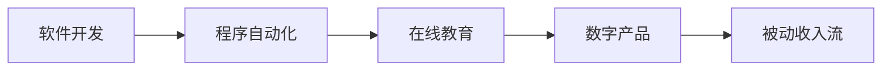

                 

# 程序员如何打造被动收入流

## 1. 背景介绍

在现代社会中，随着互联网和移动技术的迅猛发展，程序员已经不仅仅是一个职业，更是一种生活方式。越来越多的程序员开始思考如何通过编程技术实现财务自由和被动收入流。被动收入是指在不需主动努力的情况下，能够自动产生现金流的收入，包括但不限于股票投资、房地产租金、在线课程销售、软件开发、数字产品销售等。本文旨在探讨程序员如何利用编程技能和数字技术打造自己的被动收入流。

## 2. 核心概念与联系

### 2.1 核心概念概述

- **被动收入流（Passive Income Stream）**：指无需持续劳动或直接管理即可产生的稳定收入流。包括股票分红、利息、版权收入、在线课程销售、软件许可费、网站广告收益、应用程序收入等。
- **程序自动化（Automation）**：指通过编写代码自动化执行重复性任务，从而提高工作效率和准确性。
- **软件开发（Software Development）**：指开发、测试、部署和管理软件产品的过程。
- **在线教育（Online Education）**：指通过互联网进行教学和学习。
- **数字产品（Digital Products）**：指可以数字形式分发和销售的产品，包括电子书、课程、软件工具等。

### 2.2 核心概念的关系

这些概念之间存在紧密的联系。程序员可以利用自身的技术优势，开发自动化工具和软件，创建数字产品，并通过在线教育销售课程和软件。通过这些方式，程序员可以构建起自己的被动收入流，实现财务自由。

以下是一个Mermaid流程图，展示这些核心概念之间的关系：



这个流程图展示了软件开发、程序自动化、在线教育和数字产品如何共同作用于产生被动收入流。

## 3. 核心算法原理 & 具体操作步骤

### 3.1 算法原理概述

程序员打造被动收入流的基本原理是通过编程技术创造有价值的数字产品和服务，然后通过互联网渠道进行销售和分发，从而实现被动收入。核心算法包括但不限于：

- **算法优化**：通过对算法的优化和改进，提升数字产品的性能和用户体验，从而吸引更多的用户购买。
- **数据分析**：利用数据分析技术，了解用户需求和行为，优化产品策略，提高销售转化率。
- **机器学习**：应用机器学习模型，进行个性化推荐和用户行为预测，提升用户体验和满意度。

### 3.2 算法步骤详解

构建被动收入流的过程可以分解为以下几个步骤：

1. **需求分析**：确定目标市场的需求和痛点，确定产品的功能和特性。
2. **产品设计**：根据需求分析结果，设计产品原型和功能。
3. **软件开发**：利用编程技术实现产品功能，并进行测试和优化。
4. **市场推广**：通过社交媒体、搜索引擎优化（SEO）、内容营销等手段推广产品。
5. **销售和分销**：选择适合的分销渠道，如应用商店、个人网站、在线市场等。
6. **用户反馈**：收集用户反馈，不断改进和优化产品。

### 3.3 算法优缺点

#### 优点：
- **高效**：编程技术可以自动化执行重复性任务，提高工作效率。
- **可扩展**：数字产品可以轻松复制和分发，规模化扩展收入流。
- **灵活性**：可以根据市场需求快速调整产品策略，适应市场变化。

#### 缺点：
- **高成本**：初期开发和市场推广需要大量的时间和金钱投入。
- **竞争激烈**：市场竞争激烈，需要持续创新和优化才能保持竞争力。
- **技术风险**：技术更新迭代快，需要不断学习新技术。

### 3.4 算法应用领域

- **软件开发**：通过创建和销售软件产品，实现被动收入。
- **在线教育**：开发在线课程和培训内容，通过付费订阅和课程销售获取收入。
- **数字产品**：开发电子书、应用工具、在线工具等数字产品，并通过销售和订阅获取收入。
- **SaaS（Software as a Service）**：通过提供云服务，如SaaS应用和工具，实现持续的订阅收入。
- **广告和营销**：开发和优化广告工具和营销软件，通过广告展示和点击率获取收入。

## 4. 数学模型和公式 & 详细讲解 & 举例说明

### 4.1 数学模型构建

为了更好地理解程序员如何通过编程技术打造被动收入流，我们可以构建一个数学模型来分析收入流增长。假设每月的收入流为 $I_t$，用户数量为 $U_t$，每次销售的平均收入为 $R$，每月新增用户数量为 $u$，用户流失率为 $f$，则每月收入流可以表示为：

$$ I_t = U_t \cdot R - u \cdot I_t + (1 - f) \cdot (U_{t-1} \cdot R - u \cdot I_{t-1} + (1 - f) \cdot I_{t-2}) $$

其中，$U_t$ 表示第 $t$ 个月的用户数量，$U_{t-1}$ 和 $U_{t-2}$ 分别为 $t-1$ 和 $t-2$ 个月的用户数量，$R$ 为每次销售的平均收入。

### 4.2 公式推导过程

通过简化上述公式，我们可以得到每月收入流的一阶差分方程：

$$ I_t - I_{t-1} = R \cdot u - f \cdot I_t + (1 - f) \cdot (R \cdot u - f \cdot I_{t-1}) $$

将公式重写为标准形式：

$$ (1 - f) \cdot I_{t-1} - I_t = f \cdot I_t - R \cdot u + R \cdot u - f \cdot I_{t-1} $$

整理后得到：

$$ (1 - f) \cdot I_{t-1} - I_t = f \cdot (I_t - I_{t-1}) - R \cdot u $$

两边同时除以 $(1 - f)$：

$$ I_{t-1} - \frac{I_t}{1 - f} = I_t - \frac{I_{t-1}}{1 - f} - \frac{R \cdot u}{1 - f} $$

移项得到：

$$ I_t = \frac{I_{t-1}}{1 - f} + \frac{R \cdot u}{(1 - f)^2} $$

这是一个一阶差分方程，表示收入流的递推关系。

### 4.3 案例分析与讲解

假设一个在线课程平台，每月新增用户数量为100人，每次销售的平均收入为100元，用户流失率为10%，则每月收入流可以计算如下：

- 第1个月，收入流为 $100 \cdot 100 = 10000$ 元。
- 第2个月，收入流为 $\frac{10000}{1 - 0.1} + \frac{100 \cdot 100}{(1 - 0.1)^2} \approx 11110.90$ 元。
- 第3个月，收入流为 $\frac{11110.90}{1 - 0.1} + \frac{100 \cdot 100}{(1 - 0.1)^2} \approx 12330.99$ 元。

通过不断迭代计算，可以预测未来的收入流走势。

## 5. 项目实践：代码实例和详细解释说明

### 5.1 开发环境搭建

为了搭建开发环境，需要安装以下工具：

1. **Python**：作为主要的编程语言，Python 拥有丰富的第三方库和框架。
2. **Git**：用于版本控制和代码管理。
3. **Docker**：用于容器化开发环境，方便在不同的系统上运行。
4. **Jenkins**：用于持续集成和自动化部署。

### 5.2 源代码详细实现

以下是一个简单的在线课程销售平台后台服务的代码示例，用于处理订单和用户管理：

```python
from flask import Flask, jsonify, request

app = Flask(__name__)

@app.route('/order', methods=['POST'])
def process_order():
    data = request.json
    user_id = data['user_id']
    course_id = data['course_id']
    payment_method = data['payment_method']
    # 处理订单逻辑
    return jsonify({'status': 'success'})

@app.route('/user', methods=['GET', 'POST'])
def manage_user():
    if request.method == 'POST':
        data = request.json
        user_id = data['user_id']
        user_name = data['user_name']
        # 处理用户信息更新逻辑
        return jsonify({'status': 'success'})
    elif request.method == 'GET':
        # 获取用户信息
        return jsonify(user_info)

if __name__ == '__main__':
    app.run(debug=True)
```

### 5.3 代码解读与分析

以上代码示例使用了 Flask 框架，展示了如何处理订单和用户信息的管理。订单处理逻辑包括验证用户信息、更新订单状态等。用户信息管理包括更新用户姓名、获取用户信息等。

### 5.4 运行结果展示

运行上述代码，可以通过浏览器访问 http://localhost:5000/order 和 http://localhost:5000/user 接口，进行订单和用户管理。

## 6. 实际应用场景

### 6.1 在线教育平台

在线教育平台是一个典型的应用场景，通过编写在线课程和培训内容，利用编程技术进行自动化管理，并通过互联网渠道进行销售和分发，从而实现被动收入流。

### 6.2 软件开发工具

软件开发工具也是程序员打造被动收入流的常见领域。开发和销售软件工具、插件、应用程序等，可以带来持续的订阅收入。

### 6.3 数字产品

数字产品包括电子书、应用程序、在线工具等，通过互联网平台进行销售和分发，实现被动收入。

### 6.4 未来应用展望

未来，随着人工智能和机器学习技术的发展，程序员可以通过更智能、自动化的工具和平台，实现更高质量、高效率的数字产品和服务。

## 7. 工具和资源推荐

### 7.1 学习资源推荐

1. **《Python编程：从入门到实践》**：一本适合初学者的Python编程书籍，详细介绍了Python基础和编程技巧。
2. **Coursera**：提供大量高质量的在线课程，涵盖编程、数据科学、人工智能等多个领域。
3. **GitHub**：全球最大的开源代码托管平台，可以找到大量的代码示例和开源项目。
4. **Stack Overflow**：程序员问答社区，可以帮助解决编程中的各种问题。

### 7.2 开发工具推荐

1. **Visual Studio Code**：流行的代码编辑器，支持多种编程语言和扩展。
2. **Git**：强大的版本控制工具，方便管理代码变更和协作开发。
3. **Docker**：容器化技术，方便在不同的系统上部署和管理应用。
4. **Jenkins**：持续集成和自动化部署工具，支持复杂的自动化流程。

### 7.3 相关论文推荐

1. **《The Zen of Python》**：Python的官方文档，详细介绍了Python的核心哲学和编程规范。
2. **《Data Science from Scratch》**：一本介绍数据科学的入门书籍，适合初学者。
3. **《Deep Learning》**：深度学习领域的经典教材，涵盖深度学习的基本原理和应用。

## 8. 总结：未来发展趋势与挑战

### 8.1 研究成果总结

本文从需求分析、产品设计、软件开发、市场推广、销售和分销、用户反馈等环节详细介绍了程序员如何通过编程技术打造被动收入流。通过构建数学模型，分析了收入流增长的递推关系。

### 8.2 未来发展趋势

未来，随着技术的进步，程序员将能够开发更加智能化、自动化的数字产品和服务，实现更高质量的被动收入流。

### 8.3 面临的挑战

虽然程序员在打造被动收入流方面具有优势，但也面临高成本、竞争激烈、技术更新快等挑战。

### 8.4 研究展望

未来，如何通过更加智能和自动化的技术，降低成本、提高效率、优化用户体验，将是程序员打造被动收入流的重要研究方向。

## 9. 附录：常见问题与解答

**Q1: 如何选择合适的编程语言？**

A: 选择编程语言时，需要考虑目标平台、性能需求、开发效率等因素。Python、JavaScript、Java 等都是常见的选择。

**Q2: 如何提高编程效率？**

A: 使用代码编辑器、版本控制工具、自动化测试等可以提高编程效率。同时，学习和应用编程最佳实践，如代码重构、代码复用等，也能提升效率。

**Q3: 如何降低开发成本？**

A: 采用敏捷开发、持续集成、持续部署等方法，可以降低开发成本。同时，利用开源代码和社区资源，也能节约时间和金钱。

**Q4: 如何保护用户隐私和数据安全？**

A: 在设计和开发过程中，需要考虑用户隐私和数据安全问题，如数据加密、访问控制、用户权限管理等。同时，遵守相关法律法规，如GDPR等，也是必要的措施。

**Q5: 如何获取用户反馈？**

A: 利用在线调查、用户评论、社交媒体等渠道，可以收集用户反馈。分析用户反馈，及时调整产品策略，提升用户体验。

---

作者：禅与计算机程序设计艺术 / Zen and the Art of Computer Programming

