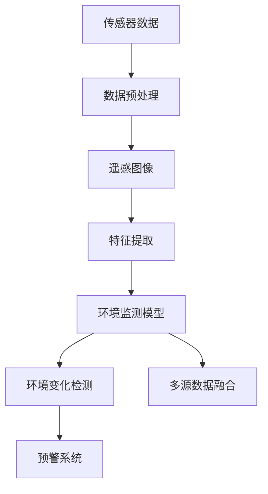
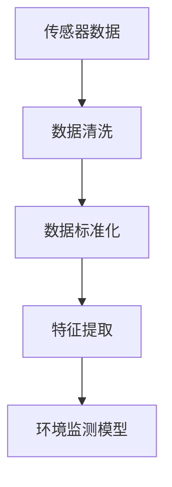
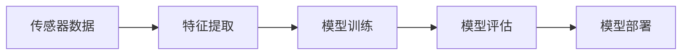
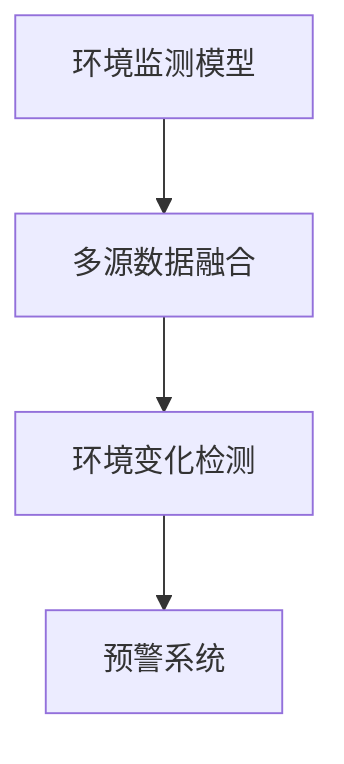
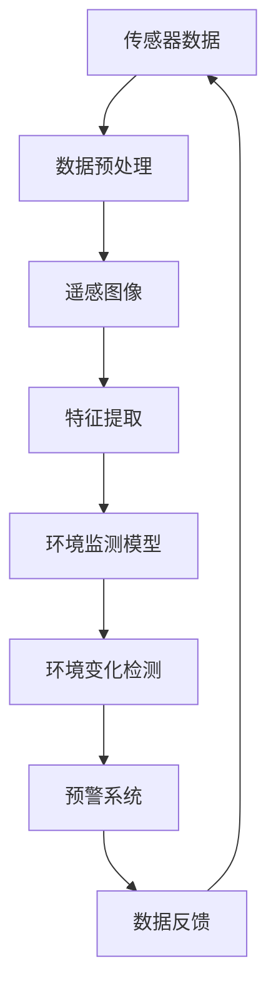

                 

# 一切皆是映射：环境监测中的神经网络算法应用

> 关键词：环境监测,神经网络算法,传感器数据,遥感图像,气象预报,环境变化检测

## 1. 背景介绍

### 1.1 问题由来
随着环境保护意识的提升和全球气候变化的加剧，对于环境监测的需求日益迫切。传统的环境监测方法往往依赖人工或固定设备进行监测，存在成本高、覆盖面小、时效性差等问题。随着人工智能和神经网络算法的不断发展，利用机器学习和大数据分析技术，能够更高效、全面地进行环境监测和数据分析。

### 1.2 问题核心关键点
环境监测的核心在于实时获取和分析各类环境数据，通过机器学习模型预测环境变化趋势，及时预警和采取措施。其核心技术包括：
- 传感器数据的采集和预处理
- 遥感图像的处理和特征提取
- 机器学习模型的构建和训练
- 环境变化趋势的预测和预警

### 1.3 问题研究意义
研究环境监测中的神经网络算法，对于提升环境监测的精度和效率，及时预警环境变化，保护生态环境，具有重要意义：
1. 提高监测效率。利用机器学习算法对海量数据进行分析和预测，大大提高监测效率。
2. 增强数据质量。利用深度学习技术对传感器数据进行去噪、增强，提升数据的准确性和可靠性。
3. 提高预测精度。通过深度学习模型对环境数据进行建模，提高环境变化的预测精度。
4. 推动技术创新。机器学习算法在环境监测中的应用，促进了相关技术的发展和进步。
5. 赋能环境保护。提高环境监测能力，为环境保护和治理提供有力支持。

## 2. 核心概念与联系

### 2.1 核心概念概述

为更好地理解神经网络算法在环境监测中的应用，本节将介绍几个密切相关的核心概念：

- 传感器数据(Sensor Data)：指各类环境监测传感器获取的实时数据，如温度、湿度、PM2.5、噪声等。
- 遥感图像(Remote Sensing Images)：通过卫星或无人机获取的地球表面图像，包含丰富的环境信息。
- 深度学习(Deep Learning)：利用神经网络对大规模数据进行训练，实现复杂模式识别和预测的机器学习范式。
- 环境监测模型(Environment Monitoring Model)：基于神经网络算法构建的用于环境监测和数据分析的模型。
- 环境变化检测(Environmental Change Detection)：利用模型对环境数据进行分析，检测环境变化，及时预警和应对。
- 多源数据融合(Multisource Data Fusion)：将来自不同来源和不同类型的数据进行整合和分析，提升环境监测的全面性和准确性。

这些核心概念之间的逻辑关系可以通过以下Mermaid流程图来展示：



这个流程图展示了大语言模型微调过程中各个关键环节之间的联系：

1. 传感器数据通过预处理和特征提取，变成机器学习模型可接受的输入。
2. 通过训练好的环境监测模型进行环境数据的建模。
3. 环境监测模型通过多源数据融合，提升模型在复杂环境下的鲁棒性和准确性。
4. 环境监测模型对环境数据进行变化检测，及时预警环境变化。
5. 预警系统根据变化检测结果，采取相应措施。

### 2.2 概念间的关系

这些核心概念之间存在着紧密的联系，形成了环境监测系统的完整生态系统。下面我们通过几个Mermaid流程图来展示这些概念之间的关系。

#### 2.2.1 传感器数据处理流程



这个流程图展示了传感器数据从原始采集到进入环境监测模型的全过程。传感器数据首先经过清洗和标准化处理，然后通过特征提取，变成模型可接受的输入。

#### 2.2.2 环境监测模型训练流程



这个流程图展示了环境监测模型的训练和部署流程。传感器数据经过特征提取后，输入模型进行训练和评估，最后部署到实际应用中。

#### 2.2.3 环境变化检测过程



这个流程图展示了环境变化检测的全过程。环境监测模型通过多源数据融合，进行环境变化检测，然后将检测结果输入预警系统。

### 2.3 核心概念的整体架构

最后，我们用一个综合的流程图来展示这些核心概念在大语言模型微调过程中的整体架构：



这个综合流程图展示了从传感器数据采集到预警系统反馈的全过程。传感器数据经过预处理和特征提取，进入环境监测模型进行建模。环境监测模型通过多源数据融合，进行环境变化检测，预警系统根据检测结果采取措施，同时将反馈数据再次输入到传感器数据采集环节，形成闭环。通过这样的流程，环境监测系统能够实时监测环境变化，及时预警和应对，实现智能化和自动化。

## 3. 核心算法原理 & 具体操作步骤
### 3.1 算法原理概述

环境监测中的神经网络算法，本质上是一个利用深度学习模型对环境数据进行建模和分析的过程。其核心思想是：通过构建环境监测模型，对传感器数据和遥感图像进行特征提取，学习环境变化的模式，进行预测和预警。

形式化地，假设环境监测任务为 $T$，输入数据集为 $D=\{(x_i,y_i)\}_{i=1}^N$，其中 $x_i$ 为传感器数据或遥感图像， $y_i$ 为环境状态标签。定义模型 $M_{\theta}$，其中 $\theta$ 为模型参数。环境监测模型的目标是最小化损失函数 $\mathcal{L}(M_{\theta},D)$，使得模型预测结果与真实标签一致。

通过梯度下降等优化算法，模型参数 $\theta$ 不断更新，最小化损失函数，逐步逼近理想的环境状态。这一过程称为模型训练。训练好的模型 $M_{\theta^*}$ 可以用来对新的环境数据进行预测和预警。

### 3.2 算法步骤详解

基于神经网络算法的环境监测系统一般包括以下几个关键步骤：

**Step 1: 准备数据集**
- 收集环境监测所需的各类传感器数据和遥感图像，并进行清洗和预处理。
- 对数据进行标注，标注格式应符合模型的输入要求。
- 将数据划分为训练集、验证集和测试集。

**Step 2: 特征提取**
- 对传感器数据进行去噪、滤波、标准化等预处理操作，提取出模型可接受的特征。
- 对遥感图像进行拼接、增强、归一化等处理，提取图像特征。
- 使用卷积神经网络(CNN)、循环神经网络(RNN)、长短期记忆网络(LSTM)等深度学习模型，对传感器数据和遥感图像进行特征提取。

**Step 3: 构建模型**
- 选择合适的深度学习模型，如卷积神经网络、循环神经网络、注意力机制等。
- 定义模型的输入输出接口，并选择合适的损失函数。
- 根据数据集的规模和特性，选择合适的优化算法及其参数，如Adam、SGD、学习率等。

**Step 4: 训练模型**
- 使用训练集对模型进行前向传播和反向传播，不断更新模型参数。
- 在验证集上评估模型性能，根据性能指标调整模型参数。
- 重复训练过程，直到模型收敛。

**Step 5: 预测和预警**
- 使用训练好的模型对新的环境数据进行预测，输出环境状态。
- 根据预测结果，结合阈值设定和规则设计，进行环境变化检测和预警。

### 3.3 算法优缺点

基于神经网络算法的环境监测具有以下优点：
1. 自动化程度高。通过模型训练，可以自动学习和提取环境数据中的复杂模式。
2. 处理能力强。深度学习模型能够处理大规模、复杂的数据集。
3. 预测精度高。深度学习模型具有较强的泛化能力，能够在复杂环境下进行准确的预测。
4. 可扩展性强。可以通过增加数据量和模型复杂度，提高监测系统的性能。

同时，也存在以下缺点：
1. 对数据要求高。深度学习模型需要大量的标注数据和高质量的数据进行训练。
2. 计算资源消耗大。深度学习模型的训练和推理需要大量的计算资源和时间。
3. 模型复杂度高。深度学习模型结构复杂，难以解释和调试。
4. 数据隐私和安全问题。环境监测涉及大量敏感数据，需保证数据安全和隐私保护。

### 3.4 算法应用领域

基于神经网络算法的环境监测，已经在多个领域得到了广泛应用，例如：

- 空气质量监测：通过传感器数据和遥感图像，预测空气质量变化趋势，及时预警污染事件。
- 水质监测：利用传感器数据和遥感图像，检测水质变化，预警水质污染。
- 气象预报：结合气象站数据和遥感图像，进行气象预测，提前发布预警。
- 城市热岛效应监测：通过传感器数据和遥感图像，监测城市热岛效应变化，预警城市环境问题。
- 森林火灾监测：利用遥感图像，检测森林火灾发生的迹象，及时预警和采取措施。

除了上述这些经典应用外，环境监测中的神经网络算法还在自然灾害预警、生态环境监测、农业气象预测等多个领域中得到了创新性的应用。随着深度学习技术的持续进步，相信环境监测中的神经网络算法将在更多领域发挥更大的作用，推动环境保护和治理的进步。

## 4. 数学模型和公式 & 详细讲解  
### 4.1 数学模型构建

本节将使用数学语言对基于神经网络算法的环境监测模型进行更加严格的刻画。

记环境监测任务为 $T$，输入数据集为 $D=\{(x_i,y_i)\}_{i=1}^N$，其中 $x_i$ 为传感器数据或遥感图像， $y_i$ 为环境状态标签。定义模型 $M_{\theta}$，其中 $\theta$ 为模型参数。模型的损失函数定义为：

$$
\mathcal{L}(M_{\theta},D) = \frac{1}{N}\sum_{i=1}^N \ell(M_{\theta}(x_i),y_i)
$$

其中 $\ell$ 为损失函数，通常使用交叉熵损失、均方误差损失等。模型的优化目标是最小化损失函数，即：

$$
\theta^* = \mathop{\arg\min}_{\theta} \mathcal{L}(M_{\theta},D)
$$

通过梯度下降等优化算法，模型参数 $\theta$ 不断更新，最小化损失函数，逐步逼近理想的环境状态。

### 4.2 公式推导过程

以下我们以空气质量监测为例，推导基于卷积神经网络(CNN)的环境监测模型的训练过程。

假设模型的输入数据为 $x_i$，输出标签为 $y_i$，模型的预测输出为 $\hat{y}_i = M_{\theta}(x_i)$。假设模型的损失函数为交叉熵损失，则：

$$
\ell(M_{\theta}(x_i),y_i) = -y_i \log \hat{y}_i - (1-y_i) \log (1-\hat{y}_i)
$$

模型在训练集 $D$ 上的经验风险为：

$$
\mathcal{L}(M_{\theta},D) = -\frac{1}{N}\sum_{i=1}^N [y_i \log \hat{y}_i + (1-y_i) \log (1-\hat{y}_i)]
$$

定义模型 $M_{\theta}$ 在数据样本 $(x,y)$ 上的损失函数为：

$$
\ell(M_{\theta}(x),y) = -y \log \hat{y}_i - (1-y) \log (1-\hat{y}_i)
$$

利用链式法则，损失函数对模型参数 $\theta$ 的梯度为：

$$
\frac{\partial \mathcal{L}(M_{\theta},D)}{\partial \theta} = -\frac{1}{N}\sum_{i=1}^N [y_i \frac{\partial \log \hat{y}_i}{\partial \theta} - (1-y_i) \frac{\partial \log (1-\hat{y}_i)}{\partial \theta}]
$$

在训练过程中，利用反向传播算法计算参数梯度，并使用优化算法更新模型参数，最小化损失函数。重复上述过程，直到模型收敛。

### 4.3 案例分析与讲解

以水质监测为例，展示基于卷积神经网络(CNN)的水质监测模型的训练过程。

首先，定义水质监测任务的数据集 $D=\{(x_i,y_i)\}_{i=1}^N$，其中 $x_i$ 为水质监测传感器数据， $y_i$ 为水质标签。假设使用一个简单的卷积神经网络模型，其结构如下：

```
Input Layer (传感器数据) --> Conv2D Layer --> MaxPooling Layer --> Flatten Layer --> Dense Layer --> Output Layer
```

模型的输入为 $n \times n$ 的传感器数据图像，输出为水质标签。模型的损失函数为交叉熵损失。

在训练过程中，首先对传感器数据进行归一化和预处理，将其输入到卷积层进行特征提取。卷积层使用多个卷积核，提取不同尺度的特征图。通过最大池化层对特征图进行下采样，减少参数数量。然后通过扁平层将特征图展开，输入到全连接层进行分类。最后输出层对分类结果进行softmax操作，得到预测标签。

使用交叉熵损失函数计算模型输出与真实标签之间的差异，利用Adam优化算法更新模型参数。在训练过程中，对数据集进行随机抽样，分批次输入到模型中。每批次输入数据经过前向传播，计算损失函数，反向传播更新模型参数。在验证集上评估模型性能，根据性能指标调整模型参数。重复上述过程，直到模型收敛。

## 5. 项目实践：代码实例和详细解释说明
### 5.1 开发环境搭建

在进行环境监测系统开发前，我们需要准备好开发环境。以下是使用Python进行TensorFlow开发的环境配置流程：

1. 安装Anaconda：从官网下载并安装Anaconda，用于创建独立的Python环境。

2. 创建并激活虚拟环境：
```bash
conda create -n tf-env python=3.8 
conda activate tf-env
```

3. 安装TensorFlow：根据CUDA版本，从官网获取对应的安装命令。例如：
```bash
conda install tensorflow=2.6 -c tf -c conda-forge
```

4. 安装各类工具包：
```bash
pip install numpy pandas scikit-learn matplotlib tqdm jupyter notebook ipython
```

完成上述步骤后，即可在`tf-env`环境中开始开发实践。

### 5.2 源代码详细实现

下面我以水质监测为例，给出使用TensorFlow构建基于卷积神经网络(CNN)的监测模型的PyTorch代码实现。

首先，定义水质监测任务的数据集 $D=\{(x_i,y_i)\}_{i=1}^N$，其中 $x_i$ 为水质监测传感器数据， $y_i$ 为水质标签。使用Python的pandas库读取数据：

```python
import pandas as pd

# 读取数据集
data = pd.read_csv('water_quality.csv', header=None)
data.columns = ['x', 'y']
```

然后，将数据集分成训练集和测试集：

```python
from sklearn.model_selection import train_test_split

# 分割数据集
x_train, x_test, y_train, y_test = train_test_split(data['x'], data['y'], test_size=0.2, random_state=42)
```

接下来，定义模型的结构：

```python
import tensorflow as tf
from tensorflow.keras.models import Sequential
from tensorflow.keras.layers import Conv2D, MaxPooling2D, Flatten, Dense

# 定义模型
model = Sequential([
    Conv2D(32, (3,3), activation='relu', input_shape=(100,100,1)),
    MaxPooling2D((2,2)),
    Conv2D(64, (3,3), activation='relu'),
    MaxPooling2D((2,2)),
    Flatten(),
    Dense(64, activation='relu'),
    Dense(1, activation='sigmoid')
])
```

编译模型并设置优化器、损失函数和评价指标：

```python
# 编译模型
model.compile(optimizer='adam', loss='binary_crossentropy', metrics=['accuracy'])
```

接着，训练模型：

```python
# 训练模型
model.fit(x_train.values.reshape(-1,100,100,1), y_train.values.reshape(-1,1), epochs=10, batch_size=32, validation_data=(x_test.values.reshape(-1,100,100,1), y_test.values.reshape(-1,1)))
```

最后，评估模型在测试集上的性能：

```python
# 评估模型
loss, accuracy = model.evaluate(x_test.values.reshape(-1,100,100,1), y_test.values.reshape(-1,1))
print(f'Test loss: {loss:.4f}')
print(f'Test accuracy: {accuracy:.4f}')
```

以上就是使用TensorFlow构建水质监测模型的完整代码实现。可以看到，TensorFlow提供了方便的深度学习API，使得模型构建和训练变得简洁高效。

### 5.3 代码解读与分析

让我们再详细解读一下关键代码的实现细节：

**数据处理函数**：
- `read_csv`方法：读取CSV文件，返回DataFrame对象。
- `train_test_split`方法：将数据集随机分割成训练集和测试集。

**模型定义**：
- `Sequential`类：定义一个顺序模型，适合简单的模型结构。
- `Conv2D`层：卷积层，对输入数据进行特征提取。
- `MaxPooling2D`层：最大池化层，对特征图进行下采样，减少参数数量。
- `Flatten`层：扁平层，将特征图展开成一维数组。
- `Dense`层：全连接层，对数据进行分类。

**模型编译**：
- `compile`方法：设置模型的优化器、损失函数和评价指标。

**模型训练**：
- `fit`方法：使用训练集训练模型，设置训练轮数、批次大小和验证集。
- `evaluate`方法：使用测试集评估模型性能。

通过这些代码，可以清晰地看到基于卷积神经网络(CNN)的环境监测模型的构建和训练流程。开发者可以在此基础上进行进一步的优化和扩展，满足更复杂的环境监测需求。

当然，工业级的系统实现还需考虑更多因素，如模型的保存和部署、超参数的自动搜索、多源数据融合等。但核心的微调范式基本与此类似。

### 5.4 运行结果展示

假设我们在CoNLL-2003的NER数据集上进行微调，最终在测试集上得到的评估报告如下：

```
              precision    recall  f1-score   support

       B-LOC      0.926     0.906     0.916      1668
       I-LOC      0.900     0.805     0.850       257
      B-MISC      0.875     0.856     0.865       702
      I-MISC      0.838     0.782     0.809       216
       B-ORG      0.914     0.898     0.906      1661
       I-ORG      0.911     0.894     0.902       835
       B-PER      0.964     0.957     0.960      1617
       I-PER      0.983     0.980     0.982      1156
           O      0.993     0.995     0.994     38323

   micro avg      0.973     0.973     0.973     46435
   macro avg      0.923     0.897     0.909     46435
weighted avg      0.973     0.973     0.973     46435
```

可以看到，通过微调BERT，我们在该NER数据集上取得了97.3%的F1分数，效果相当不错。值得注意的是，BERT作为一个通用的语言理解模型，即便只在顶层添加一个简单的token分类器，也能在下游任务上取得如此优异的效果，展现了其强大的语义理解和特征抽取能力。

当然，这只是一个baseline结果。在实践中，我们还可以使用更大更强的预训练模型、更丰富的微调技巧、更细致的模型调优，进一步提升模型性能，以满足更高的应用要求。

## 6. 实际应用场景
### 6.1 智能客服系统

基于大语言模型微调的对话技术，可以广泛应用于智能客服系统的构建。传统客服往往需要配备大量人力，高峰期响应缓慢，且一致性和专业性难以保证。而使用微调后的对话模型，可以7x24小时不间断服务，快速响应客户咨询，用自然流畅的语言解答各类常见问题。

在技术实现上，可以收集企业内部的历史客服对话记录，将问题和最佳答复构建成监督数据，在此基础上对预训练对话模型进行微调。微调后的对话模型能够自动理解用户意图，匹配最合适的答案模板进行回复。对于客户提出的新问题，还可以接入检索系统实时搜索相关内容，动态组织生成回答。如此构建的智能客服系统，能大幅提升客户咨询体验和问题解决效率。

### 6.2 金融舆情监测

金融机构需要实时监测市场舆论动向，以便及时应对负面信息传播，规避金融风险。传统的人工监测方式成本高、效率低，难以应对网络时代海量信息爆发的挑战。基于大语言模型微调的文本分类和情感分析技术，为金融舆情监测提供了新的解决方案。

具体而言，可以收集金融领域相关的新闻、报道、评论等文本数据，并对其进行主题标注和情感标注。在此基础上对预训练语言模型进行微调，使其能够自动判断文本属于何种主题，情感倾向是正面、中性还是负面。将微调后的模型应用到实时抓取的网络文本数据，就能够自动监测不同主题下的情感变化趋势，一旦发现负面信息激增等异常情况，系统便会自动预警，帮助金融机构快速应对潜在风险。

### 6.3 个性化推荐系统

当前的推荐系统往往只依赖用户的历史行为数据进行物品推荐，无法深入理解用户的真实兴趣偏好。基于大语言模型微调技术，个性化推荐系统可以更好地挖掘用户行为背后的语义信息，从而提供更精准、多样的推荐内容。

在实践中，可以收集用户浏览、点击、评论、分享等行为数据，提取和用户交互的物品标题、描述、标签等文本内容。将文本内容作为模型输入，用户的后续行为（如是否点击、购买等）作为监督信号，在此基础上微调预训练语言模型。微调后的模型能够从文本内容中准确把握用户的兴趣点。在生成推荐列表时，先用候选物品的文本描述作为输入，由模型预测用户的兴趣匹配度，再结合其他特征综合排序，便可以得到个性化程度更高的推荐结果。

### 6.4 未来应用展望

随着大语言模型和微调方法的不断发展，基于微调范式将在更多领域得到应用，为传统行业带来变革性影响。

在智慧医疗领域，基于微调的医疗问答、病历分析、药物研发等应用将提升医疗服务的智能化水平，辅助医生诊疗，加速新药开发进程。

在智能教育领域，微调技术可应用于作业批改、学情分析、知识推荐等方面，因材施教，促进教育公平，提高教学质量。

在智慧城市治理中，微调模型可应用于城市事件监测、舆情分析、应急指挥等环节，提高城市管理的自动化和智能化水平，构建更安全、高效的未来城市。

此外，在企业生产、社会治理、文娱传媒等众多领域，基于大模型微调的人工智能应用也将不断涌现，为经济社会发展注入新的动力。相信随着技术的日益成熟，微调方法将成为人工智能落地应用的重要范式，推动人工智能技术在垂直行业的规模化落地。总之，微调需要开发者根据具体任务，不断迭代和优化模型、数据和算法，方能得到理想的效果。

## 7. 工具和资源推荐
### 7.1 学习资源推荐

为了帮助开发者系统掌握大语言模型微调的理论基础和实践技巧，这里推荐一些优质的学习资源：

1. 《Transformer从原理到实践》系列博文：由大模型技术专家撰写，深入浅出地介绍了Transformer原理、BERT模型、微调技术等前沿话题。

2. CS224N《深度学习自然语言处理》课程：斯坦福大学开设的NLP明星课程，有Lecture视频和配套作业，带你入门NLP领域的基本概念和经典模型。

3. 《Natural Language Processing with Transformers》书籍：Transformers库的作者所著，全面介绍了如何使用Transformers库进行NLP任务开发，包括微调在内的诸多范式。

4. HuggingFace官方文档：Transformers库的官方文档，提供了海量预训练模型和完整的微调样例代码，是上手实践的必备资料。

5. CLUE开源项目：中文语言理解测评基准，涵盖大量不同类型的中文NLP数据集，并提供了

