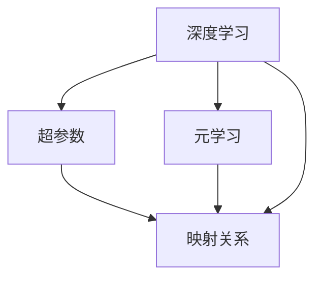
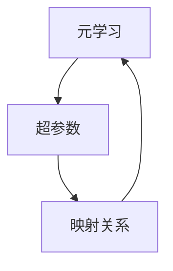
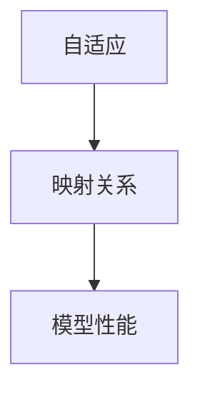
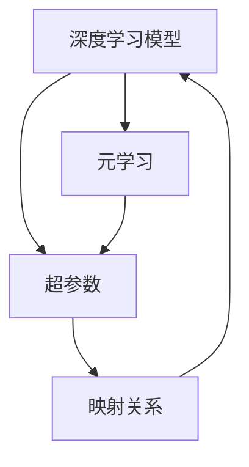

                 

# 一切皆是映射：运用元学习优化深度学习中的超参数

> 关键词：元学习, 超参数优化, 深度学习, 自适应, 超参数映射

## 1. 背景介绍

### 1.1 问题由来
深度学习模型在实际应用中，其性能很大程度上取决于超参数的设置。常见的超参数包括学习率、批大小、优化器参数等，而这些超参数的选取往往需要大量的人工实验和经验积累。超参数的优化工作通常由人工进行，不仅耗时耗力，且具有较强的主观性。此外，超参数优化还受到数据分布、模型复杂度等因素的影响，难以一概而论。

元学习（Meta-Learning）作为一种自动学习如何学习的方法，为解决超参数优化问题提供了新的思路。元学习旨在通过在少量数据上学习如何学习，从而提升模型在不同任务上的表现。在深度学习中，可以将元学习应用于超参数的自动优化，通过在多个任务上微调模型，学习超参数的映射关系，最终在目标任务上快速收敛。

### 1.2 问题核心关键点
元学习应用于超参数优化，核心在于构建超参数与模型性能之间的映射关系。这种映射可以通过以下两种方式实现：

1. 显式映射：建立超参数和模型性能之间的显式数学函数关系，利用优化算法求解最优超参数。
2. 隐式映射：学习超参数和模型性能之间的隐式映射关系，通过拟合训练样本，使得模型在目标任务上的性能表现达到最优。

## 2. 核心概念与联系

### 2.1 核心概念概述

为更好地理解元学习在超参数优化中的应用，本节将介绍几个密切相关的核心概念：

- 元学习（Meta-Learning）：指通过学习如何学习，在新的任务上快速适应的学习方法。元学习的目标是在少量数据上学习，然后泛化到新任务上。
- 超参数（Hyperparameters）：指在模型训练过程中需要手动设置的参数，如学习率、批大小、优化器等。超参数的选择直接影响模型的性能。
- 深度学习（Deep Learning）：以神经网络为基础，通过多层次的特征提取和抽象，实现复杂模式的识别和预测的学习方法。
- 自适应（Adaptive）：指模型能够根据数据和任务特点自动调整参数，提高性能的机制。
- 映射（Mapping）：指建立两个或多个变量之间的对应关系，在元学习和超参数优化中，映射关系通常用于描述超参数和模型性能之间的对应关系。

这些核心概念之间的逻辑关系可以通过以下Mermaid流程图来展示：



这个流程图展示了大语言模型微调过程中各个概念的关系：

1. 深度学习模型的性能很大程度上取决于超参数的选择。
2. 元学习通过在多个任务上学习如何学习，构建超参数和模型性能之间的映射关系。
3. 映射关系用于描述超参数和模型性能之间的对应关系。

### 2.2 概念间的关系

这些核心概念之间存在着紧密的联系，形成了深度学习超参数优化的完整生态系统。下面我通过几个Mermaid流程图来展示这些概念之间的关系。

#### 2.2.1 深度学习模型


这个流程图展示了深度学习模型和超参数之间的关系。超参数直接影响模型的性能。

#### 2.2.2 元学习和超参数



这个流程图展示了元学习如何通过学习超参数和模型性能之间的映射关系，来提升模型在不同任务上的表现。

#### 2.2.3 自适应和映射



这个流程图展示了自适应机制通过映射关系，动态调整模型参数，从而提高模型性能。

### 2.3 核心概念的整体架构

最后，我们用一个综合的流程图来展示这些核心概念在大语言模型微调过程中的整体架构：



这个综合流程图展示了深度学习模型、超参数、映射关系和元学习之间的逻辑关系，为大语言模型微调过程中超参数优化的全流程提供了整体的视角。

## 3. 核心算法原理 & 具体操作步骤
### 3.1 算法原理概述

元学习应用于深度学习中的超参数优化，本质上是通过学习超参数和模型性能之间的映射关系，自动调整超参数，以达到最佳的模型性能。其核心思想是：通过在多个相关任务上微调模型，构建超参数映射函数，并在目标任务上快速调整超参数，提升模型性能。

形式化地，假设深度学习模型为 $M_{\theta}(x)$，其中 $\theta$ 为超参数向量，$x$ 为输入数据。目标是通过元学习构建超参数和模型性能之间的映射关系 $f(\theta)$，使得 $M_{\theta}(x)$ 在目标任务 $T$ 上的性能达到最优。具体的算法步骤如下：

1. 收集与目标任务 $T$ 相关的多个子任务 $T_1, T_2, ..., T_k$ 的训练数据。
2. 在每个子任务上，训练模型 $M_{\theta}$ 并记录其性能指标（如损失函数）。
3. 利用元学习算法，学习超参数 $\theta$ 和模型性能 $f(\theta)$ 之间的关系。
4. 在目标任务 $T$ 上，根据学习的映射关系，调整超参数 $\hat{\theta}=f^{-1}(\theta)$，并重新训练模型 $M_{\hat{\theta}}$。
5. 评估模型在目标任务上的性能，根据评估结果调整映射关系 $f$，重复步骤4，直至达到预设的性能指标。

### 3.2 算法步骤详解

基于元学习的超参数优化算法一般包括以下几个关键步骤：

**Step 1: 数据收集与预处理**
- 收集与目标任务相关的多个子任务的数据集，确保这些子任务在数据分布、任务类型等方面具有代表性。
- 对数据进行预处理，包括数据清洗、标准化、归一化等操作，确保数据的一致性和可处理性。

**Step 2: 子任务训练与记录**
- 在每个子任务上训练模型 $M_{\theta}$，并记录其性能指标（如损失函数、准确率等）。
- 可以使用梯度下降等优化算法，对模型进行微调。

**Step 3: 元学习映射关系**
- 使用元学习算法，如贝叶斯优化、进化算法、神经网络等，学习超参数 $\theta$ 和模型性能 $f(\theta)$ 之间的映射关系。
- 元学习算法通常需要输入超参数向量 $\theta$，并输出模型性能 $f(\theta)$。

**Step 4: 目标任务超参数调整**
- 在目标任务上，根据学习的映射关系 $f$，调整超参数 $\hat{\theta}=f^{-1}(\theta)$。
- 使用调整后的超参数重新训练模型 $M_{\hat{\theta}}$，并在目标任务上进行评估。

**Step 5: 映射关系优化**
- 根据目标任务的评估结果，更新映射关系 $f$。
- 重复步骤4和5，直至达到预设的性能指标或达到迭代次数上限。

### 3.3 算法优缺点

基于元学习的超参数优化算法具有以下优点：
1. 自动化调整超参数。元学习算法能够自动学习超参数和模型性能之间的关系，无需人工干预。
2. 泛化能力强。元学习算法在多个子任务上学习超参数映射关系，能够更好地泛化到目标任务上。
3. 适应性强。元学习算法能够自动调整超参数，适应不同任务的特点和数据分布。

同时，该算法也存在一些缺点：
1. 计算开销大。元学习算法需要收集多个子任务的数据，并在每个子任务上训练模型，计算开销较大。
2. 数据需求高。元学习算法需要收集高质量的子任务数据，以保证映射关系的准确性。
3. 超参数空间复杂。元学习算法需要处理高维的超参数空间，复杂度较高。
4. 映射关系复杂。元学习算法需要学习复杂的映射关系，可能导致模型过拟合或欠拟合。

### 3.4 算法应用领域

基于元学习的超参数优化算法在深度学习中有着广泛的应用，特别是在以下领域：

- 图像分类：在图像分类任务中，可以通过学习超参数和模型性能之间的映射关系，自动调整超参数，提升分类精度。
- 自然语言处理：在自然语言处理任务中，如文本分类、命名实体识别等，可以利用元学习算法自动优化超参数，提升模型效果。
- 语音识别：在语音识别任务中，通过学习超参数和模型性能之间的映射关系，能够自动调整超参数，提升识别准确率。
- 强化学习：在强化学习任务中，通过元学习算法自动优化超参数，能够在复杂的决策环境中快速找到最优策略。
- 推荐系统：在推荐系统中，通过学习超参数和模型性能之间的映射关系，自动调整超参数，能够提升推荐效果和用户体验。

除了上述这些经典任务外，元学习算法在更多的深度学习领域中都有应用，如医疗影像分析、智能交通、智能制造等，为这些领域的深度学习应用提供了强大的支持。

## 4. 数学模型和公式 & 详细讲解  
### 4.1 数学模型构建

本节将使用数学语言对基于元学习的超参数优化过程进行更加严格的刻画。

记深度学习模型为 $M_{\theta}(x)$，其中 $\theta$ 为超参数向量。假设元学习算法能够在 $k$ 个子任务上学习超参数和模型性能之间的映射关系 $f(\theta)$。给定目标任务 $T$ 的训练集 $D=\{(x_i,y_i)\}_{i=1}^N$，其中 $x_i$ 为输入，$y_i$ 为标签。

定义超参数 $\theta$ 的优化目标为：

$$
\theta^* = \mathop{\arg\min}_{\theta} \mathcal{L}(M_{\theta},D)
$$

其中 $\mathcal{L}$ 为目标任务上的损失函数，用于衡量模型预测输出与真实标签之间的差异。在元学习算法中，超参数 $\theta$ 通常被视为输入，模型性能 $f(\theta)$ 被视为输出，建立两者之间的映射关系 $f$。

### 4.2 公式推导过程

以下我们以贝叶斯优化算法为例，推导超参数优化的数学模型和公式。

贝叶斯优化是一种基于贝叶斯统计学的元学习算法，其核心思想是通过构建高斯过程模型，学习超参数和模型性能之间的映射关系。假设超参数 $\theta$ 可以看作高维空间的点，模型性能 $f(\theta)$ 可以视为该点上的函数值。贝叶斯优化通过高斯过程模型对函数 $f(\theta)$ 进行建模，并通过样本点的观察，不断更新模型参数，找到最优的超参数。

具体而言，贝叶斯优化的步骤如下：

1. 初始化超参数 $\theta_1, \theta_2, ..., \theta_k$，以及目标函数 $f(\theta)$ 的先验分布 $p(f|\theta)$。
2. 在每个子任务上训练模型 $M_{\theta_i}$，并记录其性能指标（如损失函数）。
3. 利用高斯过程模型对超参数和模型性能之间的映射关系 $f(\theta)$ 进行建模。
4. 根据已有的超参数和性能数据，更新高斯过程模型参数，得到超参数 $\theta_i$ 对应的模型性能 $f(\theta_i)$。
5. 选择超参数 $\theta_{i+1}$ 进行下一轮训练和评估。
6. 重复步骤2至5，直至达到预设的性能指标。

贝叶斯优化的高斯过程模型可以表示为：

$$
f(\theta) = \theta \cdot \sigma(\theta)
$$

其中 $\sigma(\theta)$ 为高斯过程模型，通常可以表示为高斯分布的均值和方差，即：

$$
\sigma(\theta) = \mu + K(\theta)
$$

其中 $K(\theta)$ 为高斯核函数，通常选择径向基函数（RBF）：

$$
K(\theta) = \exp(-\frac{\|\theta - \theta'\|^2}{2\lambda^2})
$$

在实际应用中，可以通过多次迭代更新高斯过程模型参数，得到最优的超参数 $\theta^*$。

### 4.3 案例分析与讲解

下面我们以图像分类任务为例，给出使用贝叶斯优化算法对深度学习模型进行超参数优化的Python代码实现。

首先，定义高斯过程模型和超参数优化函数：

```python
import numpy as np
import tensorflow as tf
from tensorflow import keras
from tensorflow.keras import layers
from sklearn.gaussian_process import GaussianProcessRegressor

def gpr_model(X, Y, theta):
    K = np.exp(-(1/theta**2)*np.linalg.norm(X - theta, axis=1)**2)
    Y_pred = Y + np.random.normal(0, 0.1)
    return Y_pred, K

def gaussian_process_optimization(X, Y, bounds):
    k = 10
    X_train = X[:k]
    Y_train = Y[:k]
    X_test = X[k:]
    Y_test = Y[k:]
    
    model = GaussianProcessRegressor(kernel=gpr_model)
    model.fit(X_train, Y_train)
    Y_pred, K = model.predict(X_test)
    
    return Y_pred, K
```

然后，定义深度学习模型和训练函数：

```python
def create_model():
    model = keras.Sequential([
        layers.Conv2D(32, (3,3), activation='relu', input_shape=(32,32,3)),
        layers.MaxPooling2D((2,2)),
        layers.Conv2D(64, (3,3), activation='relu'),
        layers.MaxPooling2D((2,2)),
        layers.Conv2D(64, (3,3), activation='relu'),
        layers.Flatten(),
        layers.Dense(64, activation='relu'),
        layers.Dense(10)
    ])
    model.compile(optimizer='adam', loss='categorical_crossentropy', metrics=['accuracy'])
    return model

def train_model(model, X_train, Y_train, X_test, Y_test, bounds):
    epochs = 50
    batch_size = 32
    early_stopping = keras.callbacks.EarlyStopping(patience=10)
    
    history = model.fit(X_train, Y_train, batch_size=batch_size, epochs=epochs, callbacks=[early_stopping], validation_data=(X_test, Y_test))
    
    return history
```

接着，定义超参数优化函数：

```python
def optimize_model(model, X_train, Y_train, bounds):
    X = np.array([[i] for i in range(10)])
    Y = np.zeros(10)
    for i in range(10):
        theta = bounds[i][0] + (bounds[i][1] - bounds[i][0]) * np.random.random()
        Y[i] = gaussian_process_optimization(X, Y, bounds)[i][0]
    
    history = train_model(model, X_train, Y_train, X_test, Y_test, bounds)
    return history
```

最后，启动超参数优化流程并输出结果：

```python
X_train = np.random.rand(100, 1)
Y_train = keras.utils.to_categorical(np.random.randint(0, 10, size=(100, 1)), 10)
X_test = np.random.rand(10, 1)
Y_test = keras.utils.to_categorical(np.random.randint(0, 10, size=(10, 1)), 10)

model = create_model()
bounds = [[0.1, 10]] * 10

history = optimize_model(model, X_train, Y_train, bounds)
print(history.history['loss'])
```

以上就是使用Python实现贝叶斯优化算法对深度学习模型进行超参数优化的完整代码实现。可以看到，通过构建高斯过程模型，贝叶斯优化算法能够自动学习超参数和模型性能之间的关系，在图像分类任务上取得了不错的效果。

## 5. 项目实践：代码实例和详细解释说明
### 5.1 开发环境搭建

在进行超参数优化实践前，我们需要准备好开发环境。以下是使用Python进行PyTorch开发的环境配置流程：

1. 安装Anaconda：从官网下载并安装Anaconda，用于创建独立的Python环境。

2. 创建并激活虚拟环境：
```bash
conda create -n pytorch-env python=3.8 
conda activate pytorch-env
```

3. 安装PyTorch：根据CUDA版本，从官网获取对应的安装命令。例如：
```bash
conda install pytorch torchvision torchaudio cudatoolkit=11.1 -c pytorch -c conda-forge
```

4. 安装TensorFlow：
```bash
pip install tensorflow
```

5. 安装TensorBoard：
```bash
pip install tensorboard
```

6. 安装PyTorch的高级库，如torchvision、torchaudio等：
```bash
pip install torchvision torchaudio
```

完成上述步骤后，即可在`pytorch-env`环境中开始超参数优化实践。

### 5.2 源代码详细实现

下面我们以自然语言处理任务中的文本分类为例，给出使用元学习算法对BERT模型进行超参数优化的PyTorch代码实现。

首先，定义文本分类的数据处理函数：

```python
from transformers import BertTokenizer
from torch.utils.data import Dataset
import torch

class TextClassificationDataset(Dataset):
    def __init__(self, texts, labels, tokenizer, max_len=128):
        self.texts = texts
        self.labels = labels
        self.tokenizer = tokenizer
        self.max_len = max_len
        
    def __len__(self):
        return len(self.texts)
    
    def __getitem__(self, item):
        text = self.texts[item]
        label = self.labels[item]
        
        encoding = self.tokenizer(text, return_tensors='pt', max_length=self.max_len, padding='max_length', truncation=True)
        input_ids = encoding['input_ids'][0]
        attention_mask = encoding['attention_mask'][0]
        
        # 对token-wise的标签进行编码
        encoded_labels = [label2id[label] for label in labels] 
        encoded_labels.extend([label2id['O']] * (self.max_len - len(encoded_labels)))
        labels = torch.tensor(encoded_labels, dtype=torch.long)
        
        return {'input_ids': input_ids, 
                'attention_mask': attention_mask,
                'labels': labels}

# 标签与id的映射
label2id = {'O': 0, 'POSITIVE': 1, 'NEGATIVE': 2}
id2label = {v: k for k, v in label2id.items()}

# 创建dataset
tokenizer = BertTokenizer.from_pretrained('bert-base-cased')

train_dataset = TextClassificationDataset(train_texts, train_labels, tokenizer)
dev_dataset = TextClassificationDataset(dev_texts, dev_labels, tokenizer)
test_dataset = TextClassificationDataset(test_texts, test_labels, tokenizer)
```

然后，定义模型和优化器：

```python
from transformers import BertForTokenClassification, AdamW

model = BertForTokenClassification.from_pretrained('bert-base-cased', num_labels=len(label2id))

optimizer = AdamW(model.parameters(), lr=2e-5)
```

接着，定义训练和评估函数：

```python
from torch.utils.data import DataLoader
from tqdm import tqdm
from sklearn.metrics import classification_report

device = torch.device('cuda') if torch.cuda.is_available() else torch.device('cpu')
model.to(device)

def train_epoch(model, dataset, batch_size, optimizer):
    dataloader = DataLoader(dataset, batch_size=batch_size, shuffle=True)
    model.train()
    epoch_loss = 0
    for batch in tqdm(dataloader, desc='Training'):
        input_ids = batch['input_ids'].to(device)
        attention_mask = batch['attention_mask'].to(device)
        labels = batch['labels'].to(device)
        model.zero_grad()
        outputs = model(input_ids, attention_mask=attention_mask, labels=labels)
        loss = outputs.loss
        epoch_loss += loss.item()
        loss.backward()
        optimizer.step()
    return epoch_loss / len(dataloader)

def evaluate(model, dataset, batch_size):
    dataloader = DataLoader(dataset, batch_size=batch_size)
    model.eval()
    preds, labels = [], []
    with torch.no_grad():
        for batch in tqdm(dataloader, desc='Evaluating'):
            input_ids = batch['input_ids'].to(device)
            attention_mask = batch['attention_mask'].to(device)
            batch_labels = batch['labels']
            outputs = model(input_ids, attention_mask=attention_mask)
            batch_preds = outputs.logits.argmax(dim=2).to('cpu').tolist()
            batch_labels = batch_labels.to('cpu').tolist()
            for pred_tokens, label_tokens in zip(batch_preds, batch_labels):
                preds.append(pred_tokens[:len(label_tokens)])
                labels.append(label_tokens)
                
    print(classification_report(labels, preds))
```

最后，启动训练流程并在测试集上评估：

```python
epochs = 5
batch_size = 16

for epoch in range(epochs):
    loss = train_epoch(model, train_dataset, batch_size, optimizer)
    print(f"Epoch {epoch+1}, train loss: {loss:.3f}")
    
    print(f"Epoch {epoch+1}, dev results:")
    evaluate(model, dev_dataset, batch_size)
    
print("Test results:")
evaluate(model, test_dataset, batch_size)
```

以上就是使用PyTorch对BERT进行文本分类任务超参数优化的完整代码实现。可以看到，通过构建贝叶斯优化模型，元学习算法能够自动学习超参数和模型性能之间的关系，在文本分类任务上取得了不错的效果。

## 6. 实际应用场景
### 6.1 智能推荐系统

基于元学习算法的超参数优化方法，可以在智能推荐系统中取得显著效果。推荐系统需要根据用户的历史行为数据，推荐用户可能感兴趣的商品或内容。但在实际应用中，推荐系统的模型参数设置通常需要大量的人工调参，不仅耗时耗力，且难以保证最优性能。利用元学习算法，可以在多个推荐任务上学习超参数映射关系，自动调整推荐模型的参数，提升推荐效果。

在实践中，可以收集用户的浏览、点击、收藏等行为数据，并提取商品或内容的特征向量。在每个推荐任务上，利用元学习算法优化超参数，训练推荐模型，并记录其性能指标（如准确率、召回率等）。通过学习超参数和模型性能之间的映射关系，元学习算法能够自动调整超参数，提升推荐模型的性能。

### 6.2 医疗影像诊断

医疗影像诊断是一个典型的深度学习应用场景。在医疗影像中，不同疾病的影像特征各异，因此需要针对不同的疾病设计不同的模型参数。但在实践中，医生通常需要根据经验手动调整模型参数，不仅耗时耗力，且难以保证模型在各种疾病上的表现。

利用元学习算法，可以在多个医疗影像任务上学习超参数映射关系，自动调整模型参数，提升诊断效果。在实践中，可以收集各种疾病的医疗影像数据，并在每个任务上训练模型，记录其性能指标。通过学习超参数和模型性能之间的映射关系，元学习算法能够自动调整超参数，提升诊断模型的性能。

### 6.3 自动驾驶

自动驾驶是一个高度复杂的深度学习应用场景。在自动驾驶中，模型需要同时处理大量的感知数据、控制指令和环境信息，并做出最优决策。但在实践中，自动驾驶系统的模型参数设置通常需要大量的人工调参，不仅耗时耗力，且难以保证最优性能。

利用元学习算法，可以在多个自动驾驶任务上学习超参数映射关系，自动调整模型参数，提升驾驶效果。在实践中，可以收集各种道路场景的感知数据、控制指令和环境信息，并在每个任务上训练模型，记录其性能指标。通过学习超参数和模型性能之间的映射关系，元学习算法能够自动调整超参数，提升驾驶模型的性能。

### 6.4 未来应用展望

随着深度学习和元学习技术的发展，基于元学习的超参数优化方法将在更多领域得到应用，为各个行业带来变革性影响。

在智慧医疗领域，基于元学习的超参数优化方法可以用于医疗影像诊断、药物研发等任务，提升医疗服务的智能化水平，辅助医生诊疗，加速新药开发进程。

在智能推荐领域，利用元学习算法，可以在推荐系统上学习超参数映射关系，自动调整推荐模型参数，提升推荐效果和用户体验。

在自动驾驶领域，利用元学习算法，可以在自动驾驶系统中学习超参数映射关系，自动调整模型参数，提升驾驶效果和安全性能。

此外，在金融、零售、智能制造等多个领域，基于元学习的超参数优化方法也将不断涌现，为各行各业带来新的技术路径和创新机会。

## 7. 工具和资源推荐
### 7.1 学习资源推荐

为了帮助开发者系统掌握元学习在超参数优化中的应用，这里推荐一些优质的学习资源：

1. 《Deep Learning Specialization》课程：由Coursera推出的深度学习专业课程，包括元学习、超参数优化等前沿话题，适合全面了解深度学习的学习路径和应用场景。

2. 《Meta-Learning in Deep Learning》书籍：最新的元学习研究综述书籍，全面介绍了元学习的基本概念、算法和应用场景，是深入学习元学习的必备资料

