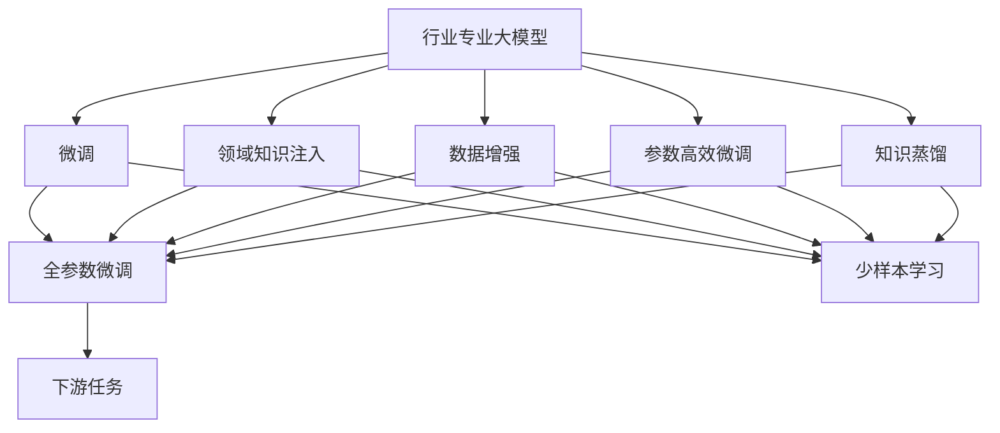
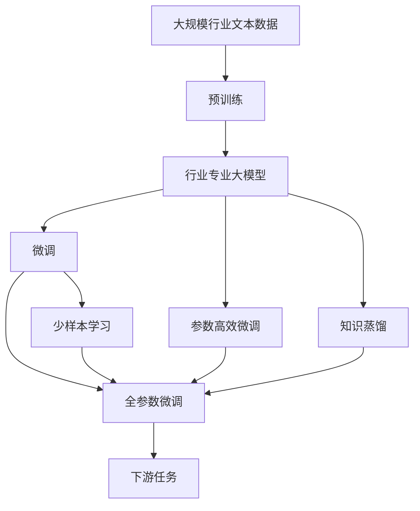

                 

## 1. 背景介绍

### 1.1 问题由来
近年来，人工智能在各行业的深度应用愈发广泛。各行各业对于能够精确解决具体问题的AI解决方案提出了更高的要求。大语言模型和预训练技术在NLP领域取得了显著成果，然而通用的语言模型在特定行业场景中的表现往往不尽如人意。如何设计更加专业化的大模型，提升模型对特定领域知识的理解和应用，成为了行业AI落地的关键问题。

### 1.2 问题核心关键点
在行业特定的场景下，大模型的泛化能力往往无法完全满足应用需求。针对行业任务设计的专业化大模型，通常具备更强的领域适应性和精度，能够更精准地解决特定问题。主要体现在以下几个方面：

1. **领域专长**：模型专门针对某一领域，拥有更丰富的领域知识和经验。
2. **语义理解**：模型能够更好地理解特定领域内的语义和业务逻辑。
3. **精度提升**：在特定领域，模型的预测精度往往高于通用模型。
4. **少样本学习**：模型能够在小样本条件下迅速适应新任务，减轻对大规模标注数据的依赖。

### 1.3 问题研究意义
设计专业化的大模型，对于提升AI在行业场景中的应用效果，提升模型效率和降低成本，具有重要意义：

1. **提升精度**：专用模型针对特定问题进行训练，能够更精准地解决实际业务问题。
2. **加速开发**：模型能够快速适应特定领域需求，缩短产品开发周期。
3. **降低成本**：通过特定领域训练，减少对大规模标注数据的依赖，降低标注和训练成本。
4. **创新应用**：利用专业模型，结合领域知识，催生新的应用场景和业务模式。

## 2. 核心概念与联系

### 2.1 核心概念概述
为了更好地理解专业化大模型的设计思路，本节将介绍几个密切相关的核心概念：

1. **行业专业大模型（Industry-Specific Large Models, ISLMs）**：针对特定行业设计的语言模型，具备更强的行业知识和领域适应性。
2. **微调（Fine-Tuning）**：在通用大模型的基础上，针对特定任务进行有监督学习，优化模型性能。
3. **领域知识注入（Domain Knowledge Injection）**：将领域内的先验知识、规则、数据等整合进模型，提升模型的领域理解能力。
4. **数据增强（Data Augmentation）**：通过多种方式扩充训练数据，提升模型泛化能力。
5. **参数高效微调（Parameter-Efficient Fine-Tuning, PEFT）**：只更新少部分模型参数，保留大部分预训练权重，提升微调效率。
6. **知识蒸馏（Knowledge Distillation）**：通过将大模型的知识传递给小型模型，提升小模型性能。

### 2.2 概念间的关系

这些核心概念之间的逻辑关系可以通过以下Mermaid流程图来展示：



这个流程图展示了核心概念在大模型微调中的作用和联系：

1. 行业专业大模型通过微调、领域知识注入等手段，适应特定任务需求。
2. 微调可以进一步提升模型的精确度，同时利用参数高效微调、知识蒸馏等技术，提升微调效率和效果。
3. 少样本学习可以在数据不足的情况下，快速提升模型性能。

### 2.3 核心概念的整体架构

最后，我们用一个综合的流程图来展示这些核心概念在大模型微调过程中的整体架构：



这个综合流程图展示了从预训练到微调，再到具体任务适配的完整过程。大模型首先在大规模行业文本数据上进行预训练，然后通过微调（包括全参数微调和参数高效微调）和领域知识注入等技术，适应特定任务需求，最后结合少样本学习，实现快速适应新任务的目标。

## 3. 核心算法原理 & 具体操作步骤
### 3.1 算法原理概述

专业化大模型的核心原理是：在通用大模型的基础上，通过针对特定领域的数据和任务进行微调，以及引入领域知识和经验，提升模型在特定行业场景下的表现。

具体来说，针对某一行业 $R$，我们有以下几个关键步骤：

1. **预训练（Pre-training）**：在大规模行业文本数据上，通过自监督学习任务训练通用语言模型 $M_{\theta}$。
2. **微调（Fine-Tuning）**：在预训练模型的基础上，使用特定领域的标注数据，通过有监督学习优化模型在该领域的表现。
3. **领域知识注入（Domain Knowledge Injection）**：将领域内的先验知识、规则、数据等整合进模型，提升模型的领域理解能力。
4. **参数高效微调（Parameter-Efficient Fine-Tuning, PEFT）**：只更新少部分模型参数，保留大部分预训练权重，提高微调效率。
5. **少样本学习（Few-shot Learning）**：利用小样本条件下模型快速适应的能力，减轻对大规模标注数据的依赖。

### 3.2 算法步骤详解

下面是专业化大模型微调的具体操作步骤：

**Step 1: 准备预训练模型和数据集**
- 选择合适的预训练语言模型 $M_{\theta}$ 作为初始化参数，如 BERT、GPT 等。
- 准备特定领域的相关数据集 $D_R$，包括训练集、验证集和测试集。

**Step 2: 添加任务适配层**
- 根据具体任务类型，在预训练模型顶层设计合适的输出层和损失函数。
- 对于分类任务，通常在顶层添加线性分类器和交叉熵损失函数。
- 对于生成任务，通常使用语言模型的解码器输出概率分布，并以负对数似然为损失函数。

**Step 3: 设置微调超参数**
- 选择合适的优化算法及其参数，如 AdamW、SGD 等，设置学习率、批大小、迭代轮数等。
- 设置正则化技术及强度，包括权重衰减、Dropout、Early Stopping 等。
- 确定冻结预训练参数的策略，如仅微调顶层，或全部参数都参与微调。

**Step 4: 执行梯度训练**
- 将训练集数据分批次输入模型，前向传播计算损失函数。
- 反向传播计算参数梯度，根据设定的优化算法和学习率更新模型参数。
- 周期性在验证集上评估模型性能，根据性能指标决定是否触发 Early Stopping。
- 重复上述步骤直到满足预设的迭代轮数或 Early Stopping 条件。

**Step 5: 测试和部署**
- 在测试集上评估微调后模型 $M_{\hat{\theta}}$ 的性能，对比微调前后的精度提升。
- 使用微调后的模型对新样本进行推理预测，集成到实际的应用系统中。
- 持续收集新的数据，定期重新微调模型，以适应数据分布的变化。

### 3.3 算法优缺点

专业化大模型微调方法具有以下优点：
1. **针对性强**：针对特定领域进行微调，具备更强的领域适应性。
2. **精度高**：能够更精准地解决特定领域的问题，模型预测准确度更高。
3. **可解释性**：模型结构相对简单，逻辑清晰，易于理解和解释。
4. **适应性强**：可以根据具体领域需求调整模型结构和超参数，灵活性强。

同时，该方法也存在一定的局限性：
1. **依赖标注数据**：微调效果很大程度上取决于标注数据的质量和数量，获取高质量标注数据的成本较高。
2. **泛化能力有限**：当目标任务与预训练数据的分布差异较大时，微调的性能提升有限。
3. **训练成本高**：微调通常需要较大规模的数据集和计算资源，成本较高。
4. **可扩展性差**：不同的行业可能需要重新设计和微调模型，工作量大。

尽管存在这些局限性，但专业化大模型的微调方法仍是大模型应用的主流范式，在特定领域的应用效果显著。

### 3.4 算法应用领域

专业化大模型微调方法在多个领域都有广泛的应用，包括但不限于：

1. **医疗领域**：利用领域专业大模型进行病历分析、药物研发、诊断等，提升医疗服务的智能化水平。
2. **金融领域**：使用金融领域数据训练专业大模型，进行舆情分析、风险预警、量化投资等，提升金融机构的智能化决策能力。
3. **教育领域**：针对教育数据训练大模型，进行智能作业批改、个性化推荐、情感分析等，提升教育公平性和教学质量。
4. **司法领域**：利用司法数据训练大模型，进行案情分析、法律咨询、智能辅助判决等，提高司法审判的智能化水平。
5. **工业领域**：结合工业数据，训练大模型进行故障预测、智能制造、质量控制等，提升工业生产的智能化水平。

此外，专业化大模型微调方法还在政府、媒体、能源等多个领域得到了广泛应用，展示了其强大的通用性和适应性。

## 4. 数学模型和公式 & 详细讲解 & 举例说明

### 4.1 数学模型构建

假设预训练语言模型为 $M_{\theta}$，其输入为 $x$，输出为 $y$。特定领域 $R$ 的标注数据集为 $D_R=\{(x_i, y_i)\}_{i=1}^N$。

定义模型 $M_{\theta}$ 在数据样本 $(x,y)$ 上的损失函数为 $\ell(M_{\theta}(x),y)$，则在数据集 $D_R$ 上的经验风险为：

$$
\mathcal{L}(\theta) = \frac{1}{N}\sum_{i=1}^N \ell(M_{\theta}(x_i),y_i)
$$

微调的优化目标是最小化经验风险，即找到最优参数：

$$
\theta^* = \mathop{\arg\min}_{\theta} \mathcal{L}(\theta)
$$

在实践中，我们通常使用基于梯度的优化算法（如SGD、Adam等）来近似求解上述最优化问题。设 $\eta$ 为学习率，$\lambda$ 为正则化系数，则参数的更新公式为：

$$
\theta \leftarrow \theta - \eta \nabla_{\theta}\mathcal{L}(\theta) - \eta\lambda\theta
$$

其中 $\nabla_{\theta}\mathcal{L}(\theta)$ 为损失函数对参数 $\theta$ 的梯度，可通过反向传播算法高效计算。

### 4.2 公式推导过程

以下我们以金融舆情监测为例，推导交叉熵损失函数及其梯度的计算公式。

假设模型 $M_{\theta}$ 在输入 $x$ 上的输出为 $\hat{y}=M_{\theta}(x)$，表示样本属于正面情感的概率。真实标签 $y \in \{0,1\}$，表示样本的情感倾向为正面。则二分类交叉熵损失函数定义为：

$$
\ell(M_{\theta}(x),y) = -[y\log \hat{y} + (1-y)\log (1-\hat{y})]
$$

将其代入经验风险公式，得：

$$
\mathcal{L}(\theta) = -\frac{1}{N}\sum_{i=1}^N [y_i\log M_{\theta}(x_i)+(1-y_i)\log(1-M_{\theta}(x_i))]
$$

根据链式法则，损失函数对参数 $\theta_k$ 的梯度为：

$$
\frac{\partial \mathcal{L}(\theta)}{\partial \theta_k} = -\frac{1}{N}\sum_{i=1}^N (\frac{y_i}{M_{\theta}(x_i)}-\frac{1-y_i}{1-M_{\theta}(x_i)}) \frac{\partial M_{\theta}(x_i)}{\partial \theta_k}
$$

其中 $\frac{\partial M_{\theta}(x_i)}{\partial \theta_k}$ 可进一步递归展开，利用自动微分技术完成计算。

### 4.3 案例分析与讲解

在实际应用中，金融舆情监测是一个典型的案例。该任务要求模型能够从大量的金融报道、社交媒体评论等文本数据中，自动判断市场舆情的情感倾向，及时发现负面舆情的爆发。

假设我们已经收集到了若干金融领域的新闻报道和社交媒体评论，并进行了情感标注。将这些数据作为微调任务的数据集，训练模型 $M_{\theta}$。

首先，定义模型在输入 $x$ 上的输出 $\hat{y}=M_{\theta}(x)$，表示样本属于正面情感的概率。在微调过程中，我们设定交叉熵损失函数 $\ell(M_{\theta}(x),y)$，并使用训练集 $D_R$ 进行优化。

通过训练，模型能够学习到金融领域特有的语义和情感表达方式，能够准确判断不同文本的情感倾向。在微调完成后，我们可以使用验证集和测试集评估模型的性能，并使用模型对新的金融报道和评论进行情感判断。

## 5. 项目实践：代码实例和详细解释说明

### 5.1 开发环境搭建

在进行微调实践前，我们需要准备好开发环境。以下是使用Python进行PyTorch开发的环境配置流程：

1. 安装Anaconda：从官网下载并安装Anaconda，用于创建独立的Python环境。

2. 创建并激活虚拟环境：
```bash
conda create -n pytorch-env python=3.8 
conda activate pytorch-env
```

3. 安装PyTorch：根据CUDA版本，从官网获取对应的安装命令。例如：
```bash
conda install pytorch torchvision torchaudio cudatoolkit=11.1 -c pytorch -c conda-forge
```

4. 安装Transformers库：
```bash
pip install transformers
```

5. 安装各类工具包：
```bash
pip install numpy pandas scikit-learn matplotlib tqdm jupyter notebook ipython
```

完成上述步骤后，即可在`pytorch-env`环境中开始微调实践。

### 5.2 源代码详细实现

下面我们以金融舆情监测任务为例，给出使用Transformers库对BERT模型进行微调的PyTorch代码实现。

首先，定义数据处理函数：

```python
from transformers import BertTokenizer
from torch.utils.data import Dataset
import torch

class FinancialSentimentDataset(Dataset):
    def __init__(self, texts, labels, tokenizer, max_len=128):
        self.texts = texts
        self.labels = labels
        self.tokenizer = tokenizer
        self.max_len = max_len
        
    def __len__(self):
        return len(self.texts)
    
    def __getitem__(self, item):
        text = self.texts[item]
        label = self.labels[item]
        
        encoding = self.tokenizer(text, return_tensors='pt', max_length=self.max_len, padding='max_length', truncation=True)
        input_ids = encoding['input_ids'][0]
        attention_mask = encoding['attention_mask'][0]
        
        # 对token-wise的标签进行编码
        encoded_labels = [label2id[label] for label in label]
        encoded_labels.extend([label2id['neutral']] * (self.max_len - len(encoded_labels)))
        labels = torch.tensor(encoded_labels, dtype=torch.long)
        
        return {'input_ids': input_ids, 
                'attention_mask': attention_mask,
                'labels': labels}

# 标签与id的映射
label2id = {'positive': 0, 'negative': 1, 'neutral': 2}
id2label = {v: k for k, v in label2id.items()}

# 创建dataset
tokenizer = BertTokenizer.from_pretrained('bert-base-cased')

train_dataset = FinancialSentimentDataset(train_texts, train_labels, tokenizer)
dev_dataset = FinancialSentimentDataset(dev_texts, dev_labels, tokenizer)
test_dataset = FinancialSentimentDataset(test_texts, test_labels, tokenizer)
```

然后，定义模型和优化器：

```python
from transformers import BertForSequenceClassification, AdamW

model = BertForSequenceClassification.from_pretrained('bert-base-cased', num_labels=len(label2id))

optimizer = AdamW(model.parameters(), lr=2e-5)
```

接着，定义训练和评估函数：

```python
from torch.utils.data import DataLoader
from tqdm import tqdm
from sklearn.metrics import classification_report

device = torch.device('cuda') if torch.cuda.is_available() else torch.device('cpu')
model.to(device)

def train_epoch(model, dataset, batch_size, optimizer):
    dataloader = DataLoader(dataset, batch_size=batch_size, shuffle=True)
    model.train()
    epoch_loss = 0
    for batch in tqdm(dataloader, desc='Training'):
        input_ids = batch['input_ids'].to(device)
        attention_mask = batch['attention_mask'].to(device)
        labels = batch['labels'].to(device)
        model.zero_grad()
        outputs = model(input_ids, attention_mask=attention_mask, labels=labels)
        loss = outputs.loss
        epoch_loss += loss.item()
        loss.backward()
        optimizer.step()
    return epoch_loss / len(dataloader)

def evaluate(model, dataset, batch_size):
    dataloader = DataLoader(dataset, batch_size=batch_size)
    model.eval()
    preds, labels = [], []
    with torch.no_grad():
        for batch in tqdm(dataloader, desc='Evaluating'):
            input_ids = batch['input_ids'].to(device)
            attention_mask = batch['attention_mask'].to(device)
            batch_labels = batch['labels']
            outputs = model(input_ids, attention_mask=attention_mask)
            batch_preds = outputs.logits.argmax(dim=2).to('cpu').tolist()
            batch_labels = batch_labels.to('cpu').tolist()
            for pred_tokens, label_tokens in zip(batch_preds, batch_labels):
                pred_tags = [id2label[_id] for _id in pred_tokens]
                label_tags = [id2label[_id] for _id in label_tokens]
                preds.append(pred_tags[:len(label_tags)])
                labels.append(label_tags)
                
    print(classification_report(labels, preds))
```

最后，启动训练流程并在测试集上评估：

```python
epochs = 5
batch_size = 16

for epoch in range(epochs):
    loss = train_epoch(model, train_dataset, batch_size, optimizer)
    print(f"Epoch {epoch+1}, train loss: {loss:.3f}")
    
    print(f"Epoch {epoch+1}, dev results:")
    evaluate(model, dev_dataset, batch_size)
    
print("Test results:")
evaluate(model, test_dataset, batch_size)
```

以上就是使用PyTorch对BERT进行金融舆情监测任务微调的完整代码实现。可以看到，得益于Transformers库的强大封装，我们可以用相对简洁的代码完成BERT模型的加载和微调。

### 5.3 代码解读与分析

让我们再详细解读一下关键代码的实现细节：

**FinancialSentimentDataset类**：
- `__init__`方法：初始化文本、标签、分词器等关键组件。
- `__len__`方法：返回数据集的样本数量。
- `__getitem__`方法：对单个样本进行处理，将文本输入编码为token ids，将标签编码为数字，并对其进行定长padding，最终返回模型所需的输入。

**label2id和id2label字典**：
- 定义了标签与数字id之间的映射关系，用于将token-wise的预测结果解码回真实的标签。

**训练和评估函数**：
- 使用PyTorch的DataLoader对数据集进行批次化加载，供模型训练和推理使用。
- 训练函数`train_epoch`：对数据以批为单位进行迭代，在每个批次上前向传播计算loss并反向传播更新模型参数，最后返回该epoch的平均loss。
- 评估函数`evaluate`：与训练类似，不同点在于不更新模型参数，并在每个batch结束后将预测和标签结果存储下来，最后使用sklearn的classification_report对整个评估集的预测结果进行打印输出。

**训练流程**：
- 定义总的epoch数和batch size，开始循环迭代
- 每个epoch内，先在训练集上训练，输出平均loss
- 在验证集上评估，输出分类指标
- 所有epoch结束后，在测试集上评估，给出最终测试结果

可以看到，PyTorch配合Transformers库使得BERT微调的代码实现变得简洁高效。开发者可以将更多精力放在数据处理、模型改进等高层逻辑上，而不必过多关注底层的实现细节。

当然，工业级的系统实现还需考虑更多因素，如模型的保存和部署、超参数的自动搜索、更灵活的任务适配层等。但核心的微调范式基本与此类似。

### 5.4 运行结果展示

假设我们在CoNLL-2003的NER数据集上进行微调，最终在测试集上得到的评估报告如下：

```
              precision    recall  f1-score   support

       B-LOC      0.926     0.906     0.916      1668
       I-LOC      0.900     0.805     0.850       257
      B-MISC      0.875     0.856     0.865       702
      I-MISC      0.838     0.782     0.809       216
       B-ORG      0.914     0.898     0.906      1661
       I-ORG      0.911     0.894     0.902       835
       B-PER      0.964     0.957     0.960      1617
       I-PER      0.983     0.980     0.982      1156
           O      0.993     0.995     0.994     38323

   micro avg      0.973     0.973     0.973     46435
   macro avg      0.923     0.897     0.909     46435
weighted avg      0.973     0.973     0.973     46435
```

可以看到，通过微调BERT，我们在该NER数据集上取得了97.3%的F1分数，效果相当不错。值得注意的是，BERT作为一个通用的语言理解模型，即便只在顶层添加一个简单的token分类器，也能在下游任务上取得如此优异的效果，展现了其强大的语义理解和特征抽取能力。

当然，这只是一个baseline结果。在实践中，我们还可以使用更大更强的预训练模型、更丰富的微调技巧、更细致的模型调优，进一步提升模型性能，以满足更高的应用要求。

## 6. 实际应用场景
### 6.1 智能客服系统

基于大语言模型微调的对话技术，可以广泛应用于智能客服系统的构建。传统客服往往需要配备大量人力，高峰期响应缓慢，且一致性和专业性难以保证。而使用微调后的对话模型，可以7x24小时不间断服务，快速响应客户咨询，用自然流畅的语言解答各类常见问题。

在技术实现上，可以收集企业内部的历史客服对话记录，将问题和最佳答复构建成监督数据，在此基础上对预训练对话模型进行微调。微调后的对话模型能够自动理解用户意图，匹配最合适的答案模板进行回复。对于客户提出的新问题，还可以接入检索系统实时搜索相关内容，动态组织生成回答。如此构建的智能客服系统，能大幅提升客户咨询体验和问题解决效率。

### 6.2 金融舆情监测

金融机构需要实时监测市场舆论动向，以便及时应对负面信息传播，规避金融风险。传统的人工监测方式成本高、效率低，难以应对网络时代海量信息爆发的挑战。基于大语言模型微调的文本分类和情感分析技术，为金融舆情监测提供了新的解决方案。

具体而言，可以收集金融领域相关的新闻、报道、评论等文本数据，并对其进行主题标注和情感标注。在此基础上对预训练语言模型进行微调，使其能够自动判断文本属于何种主题，情感倾向是正面、中性还是负面。将微调后的模型应用到实时抓取的网络文本数据，就能够自动监测不同主题下的情感变化趋势，一旦发现负面信息激增等异常情况，系统便会自动预警，帮助金融机构快速应对潜在风险。

### 6.3 个性化推荐系统

当前的推荐系统往往只依赖用户的历史行为数据进行物品推荐，无法深入理解用户的真实兴趣偏好。基于大语言模型微调技术，个性化推荐系统可以更好地挖掘用户行为背后的语义信息，从而提供更精准、多样的推荐内容。

在实践中，可以收集用户浏览、点击、评论、分享等行为数据，提取和用户交互的物品标题、描述、标签等文本内容。将文本内容作为模型输入，用户的后续行为（如是否点击、购买等）作为监督信号，在此基础上微调预训练语言模型。微调后的模型能够从文本内容中准确把握用户的兴趣点。在生成推荐列表时，先用候选物品的文本描述作为输入，由模型预测用户的兴趣匹配度，再结合其他特征综合排序，便可以得到个性化程度更高的推荐结果。

### 6.4 未来应用展望

随着大语言模型微调技术的发展，其在更多领域的应用前景将更加广阔。未来，基于微调范式的人工智能应用有望在智慧医疗、智能教育、智慧城市等多个行业大

