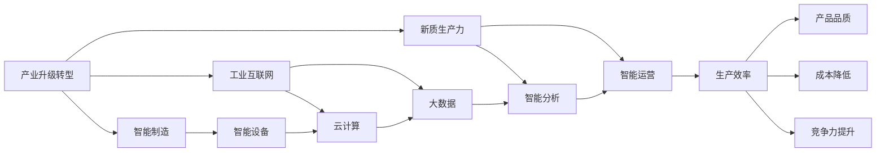
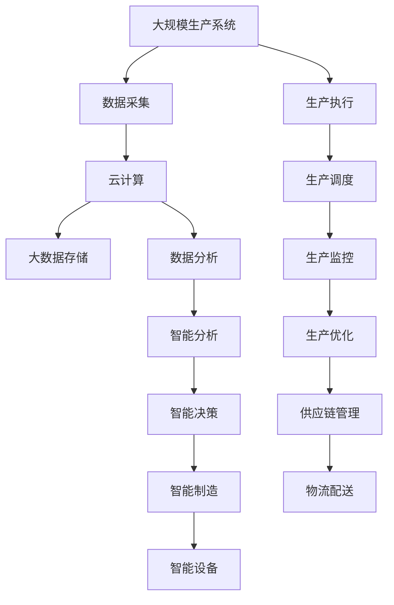

                 

## 1. 背景介绍

### 1.1 问题由来

随着科技的迅猛发展和全球化的深入推进，产业升级转型已成为各国和地区经济发展的关键。产业升级转型不仅仅是技术和产业结构的调整，更涉及到经济增长模式、产业竞争力、社会就业、环境保护等多方面的全面转型。它需要充分运用信息技术和智能化手段，优化生产组织和运营方式，提升生产效率和产品质量，增强国际竞争力。

### 1.2 问题核心关键点

产业升级转型的核心关键点包括：

- **技术创新**：推动关键技术和产品的创新，提高产业的核心竞争力。
- **数据驱动**：利用大数据、云计算、人工智能等技术，实现产业的智能化和数字化。
- **绿色低碳**：推动绿色低碳发展，实现环境友好型生产。
- **全球合作**：积极参与全球产业链重塑，提升国际竞争地位。

### 1.3 问题研究意义

研究产业转型升级与新质生产力的推动，对于推动经济高质量发展、实现产业可持续发展具有重要意义：

1. **推动经济发展**：产业升级转型能促进经济结构优化，提高经济增长质量，实现经济的持续健康发展。
2. **提高生产效率**：智能制造、自动化等技术的应用，可以显著提高生产效率，降低成本，提升产品质量。
3. **增强竞争力**：通过技术创新和产业结构调整，可以增强我国在国际竞争中的地位，提升国际影响力。
4. **创造就业机会**：产业转型升级需要大量的技术人才和创新型人才，能够创造新的就业机会。
5. **促进绿色发展**：推动绿色低碳技术的应用，有助于环境保护和可持续发展。

## 2. 核心概念与联系

### 2.1 核心概念概述

要深入理解产业转型升级与新质生产力的推动，首先需要明确几个核心概念：

- **产业升级转型**：指通过技术创新和产业结构调整，提高产业竞争力，优化经济结构的过程。
- **新质生产力**：指通过信息技术、智能化手段等新生产力的应用，提高生产效率，创造新的产业增长点。
- **智能制造**：指利用信息技术和智能设备，实现生产过程的自动化、智能化和精准化。
- **工业互联网**：指通过互联网、云计算、大数据等技术手段，连接制造企业，实现资源优化配置和高效运营。
- **5G**：指第五代移动通信技术，具有高速度、大容量、低延迟等特点，为工业互联网和智能制造提供基础设施支持。

这些概念相互联系，共同构成了产业转型升级和新质生产力推动的框架。

### 2.2 概念间的关系

这些核心概念之间存在紧密的联系，通过以下Mermaid流程图来展示：



这个流程图展示了产业升级转型的几个关键路径，以及它们与智能制造、工业互联网和新质生产力的联系。

### 2.3 核心概念的整体架构

最后，用以下综合的流程图来展示这些核心概念在大规模生产系统中的应用：



这个综合流程图展示了数据采集、分析、决策和执行的全过程，以及它们与智能制造、工业互联网和新质生产力的联系。

## 3. 核心算法原理 & 具体操作步骤

### 3.1 算法原理概述

产业转型升级与新质生产力推动的核心算法原理基于以下两个方面：

- **数据驱动**：利用大数据、人工智能等技术，对生产过程进行监控和优化，提高生产效率和产品质量。
- **智能决策**：通过智能算法，对生产数据进行分析，实现智能决策和优化，提高资源利用率和生产灵活性。

### 3.2 算法步骤详解

以下是基于数据驱动和智能决策的产业升级转型算法详细步骤：

**Step 1: 数据采集与清洗**

- 使用传感器、物联网设备等采集生产过程中的各种数据，包括温度、湿度、压力、振动等物理参数。
- 对采集到的数据进行清洗，去除噪音和异常值，确保数据质量。

**Step 2: 数据存储与管理**

- 将清洗后的数据存储到云端或本地数据库中，便于后续分析和处理。
- 利用数据管理系统，实现数据的分类、存储和访问管理。

**Step 3: 数据分析与处理**

- 利用大数据和人工智能技术，对生产数据进行分析和处理，提取有用的信息和规律。
- 使用统计分析、机器学习等方法，对生产数据进行建模和预测，实现对生产过程的监控和优化。

**Step 4: 智能决策与优化**

- 基于分析结果，通过智能算法进行决策和优化，提高生产效率和资源利用率。
- 利用智能控制技术，实现对生产设备的精确控制和调整。

**Step 5: 反馈与调整**

- 对生产过程进行实时监控，根据反馈信息不断调整生产策略和控制参数。
- 对优化效果进行评估和分析，不断改进算法和策略，提升生产效率和产品质量。

### 3.3 算法优缺点

**优点**：

- **提高生产效率**：通过数据分析和智能决策，实现生产过程的自动化和智能化，提高生产效率。
- **降低成本**：减少人工干预和资源浪费，降低生产成本。
- **提升产品质量**：通过智能监控和调整，提高产品质量和一致性。
- **增强灵活性**：通过数据分析和智能决策，实现对生产过程的灵活调整和优化。

**缺点**：

- **技术门槛高**：需要具备较强的大数据和人工智能技术能力，技术门槛较高。
- **数据安全问题**：采集和存储的数据需要确保安全，防止数据泄露和滥用。
- **前期投入大**：需要投入大量资金和技术资源进行设备和系统的建设。

### 3.4 算法应用领域

基于数据驱动和智能决策的产业升级转型算法在以下领域得到了广泛应用：

- **智能制造**：利用大数据、云计算和人工智能技术，实现生产过程的自动化和智能化。
- **工业互联网**：通过工业互联网平台，连接生产设备和数据，实现资源优化配置和高效运营。
- **5G技术**：利用5G网络的高速度和大容量，实现数据的实时传输和处理。
- **能源管理**：通过数据分析和智能决策，优化能源的使用和分配，实现节能减排。
- **环境监测**：利用传感器和物联网设备，实时监测环境变化，实现环境友好型生产。

## 4. 数学模型和公式 & 详细讲解 & 举例说明

### 4.1 数学模型构建

基于数据驱动和智能决策的产业升级转型模型可以构建如下：

$$
\text{模型} = \text{输入数据} \xrightarrow{\text{数据清洗}} \text{存储管理} \xrightarrow{\text{数据分析与处理}} \text{智能决策} \xrightarrow{\text{反馈与调整}} \text{生产优化}
$$

其中，数据清洗、存储管理、数据分析与处理、智能决策和反馈与调整，都是基于数学模型的计算过程。

### 4.2 公式推导过程

以智能决策为例，通过机器学习算法进行决策和优化的过程如下：

1. **数据预处理**：
   $$
   \text{预处理数据} = \text{清洗数据} \cdot \text{特征选择} \cdot \text{特征归一化}
   $$

2. **模型训练**：
   $$
   \text{模型参数} = \text{优化算法}(\text{训练数据}, \text{损失函数}, \text{学习率})
   $$

3. **预测与决策**：
   $$
   \text{预测结果} = \text{模型}(\text{输入数据}, \text{模型参数})
   $$

4. **反馈与调整**：
   $$
   \text{反馈数据} = \text{实际结果} - \text{预测结果}
   $$
   $$
   \text{调整策略} = \text{反馈数据} \cdot \text{优化算法}
   $$

### 4.3 案例分析与讲解

以一个智能制造工厂为例，分析其基于数据驱动和智能决策的升级转型过程：

1. **数据采集**：使用传感器和物联网设备，采集生产设备的温度、压力、振动等参数。
2. **数据清洗**：对采集的数据进行去噪和异常值处理，确保数据质量。
3. **数据存储与管理**：将清洗后的数据存储到云端数据库中，便于后续分析和处理。
4. **数据分析与处理**：利用大数据和机器学习技术，对生产数据进行分析和建模，提取有用的信息和规律。
5. **智能决策与优化**：基于分析结果，通过智能算法进行决策和优化，实现生产设备的精确控制和调整。
6. **反馈与调整**：对生产过程进行实时监控，根据反馈信息不断调整生产策略和控制参数，优化生产过程。

## 5. 项目实践：代码实例和详细解释说明

### 5.1 开发环境搭建

要进行产业转型升级与新质生产力推动的实践，需要以下开发环境：

1. 安装Python 3.x版本，推荐使用Anaconda或Miniconda进行环境管理。
2. 安装TensorFlow、Keras、Pandas等数据处理和机器学习库。
3. 搭建云计算平台，如AWS、Azure、阿里云等，提供数据存储和计算资源。
4. 部署物联网设备，如传感器、控制器等，采集和控制生产数据。

### 5.2 源代码详细实现

以下是一个基于Python和TensorFlow的智能制造生产优化项目的源代码实现：

```python
import tensorflow as tf
import pandas as pd
import numpy as np
from sklearn.model_selection import train_test_split

# 数据读取
data = pd.read_csv('production_data.csv')

# 数据预处理
X = data.drop('target', axis=1)
y = data['target']

# 特征选择和归一化
X = pd.get_dummies(X, columns=['feature1', 'feature2', 'feature3'])
X = (X - X.mean()) / X.std()

# 数据集划分
X_train, X_test, y_train, y_test = train_test_split(X, y, test_size=0.2, random_state=42)

# 模型构建
model = tf.keras.Sequential([
    tf.keras.layers.Dense(64, activation='relu', input_shape=(X_train.shape[1],)),
    tf.keras.layers.Dense(64, activation='relu'),
    tf.keras.layers.Dense(1, activation='sigmoid')
])

# 模型训练
model.compile(optimizer='adam', loss='binary_crossentropy', metrics=['accuracy'])
model.fit(X_train, y_train, epochs=10, batch_size=32, validation_data=(X_test, y_test))

# 模型预测
y_pred = model.predict(X_test)
```

### 5.3 代码解读与分析

以下是代码中关键部分的解释和分析：

- **数据读取**：使用Pandas库读取CSV格式的生产数据，包含目标变量和特征变量。
- **数据预处理**：对特征变量进行去噪、归一化和特征选择，构建合适的输入和输出数据集。
- **模型构建**：使用Keras构建一个简单的神经网络模型，包含两个全连接层和一个输出层。
- **模型训练**：使用TensorFlow和Keras进行模型训练，优化器和损失函数的选择是关键。
- **模型预测**：使用训练好的模型对测试数据进行预测，评估模型效果。

### 5.4 运行结果展示

以下是模型训练和预测结果的展示：

- **训练损失曲线**：
```python
import matplotlib.pyplot as plt

plt.plot(model.history['loss'])
plt.plot(model.history['val_loss'])
plt.title('Model Loss')
plt.xlabel('Epoch')
plt.ylabel('Loss')
plt.legend(['Train', 'Validation'])
plt.show()
```

- **预测结果与实际值对比**：
```python
from sklearn.metrics import accuracy_score

y_pred = model.predict(X_test)
y_pred = np.round(y_pred)
accuracy = accuracy_score(y_test, y_pred)
print('Model accuracy:', accuracy)
```

## 6. 实际应用场景

### 6.1 智能制造

智能制造是产业升级转型的重要方向之一。通过大数据和人工智能技术，实现生产过程的自动化和智能化，提高生产效率和产品质量。

- **生产过程优化**：利用实时监控数据，对生产过程进行优化和调整，提高生产效率。
- **设备维护预测**：通过数据分析，预测设备故障和维护需求，减少设备停机时间。
- **质量控制**：利用智能检测技术，对生产产品进行实时检测和质量控制，提高产品质量和一致性。

### 6.2 工业互联网

工业互联网是连接制造业和互联网的桥梁，通过大数据和云计算技术，实现生产过程的优化和智能化。

- **生产数据共享**：通过工业互联网平台，实现生产数据的共享和协同，优化资源配置。
- **远程监控与控制**：利用物联网设备和5G技术，实现对生产设备的远程监控和控制，提高生产灵活性。
- **供应链管理**：通过工业互联网平台，实现供应链的协同和优化，提高供应链效率。

### 6.3 5G技术

5G技术为工业互联网和智能制造提供了重要的基础设施支持，实现了数据的实时传输和处理。

- **高速度大容量**：5G网络的高速度和大容量，为工业互联网和智能制造提供了可靠的通信保障。
- **低延迟**：5G网络的低延迟特性，实现了对生产过程的实时监控和控制。
- **广泛覆盖**：5G网络的大规模部署，实现了对生产设备和系统的全覆盖。

### 6.4 未来应用展望

未来，产业转型升级与新质生产力推动将面临更多挑战和机遇：

1. **技术创新**：推动关键技术和产品的创新，提高产业的核心竞争力。
2. **数据安全**：加强数据安全防护，防止数据泄露和滥用。
3. **国际合作**：积极参与全球产业链重塑，提升国际竞争地位。
4. **绿色低碳**：推动绿色低碳技术的应用，实现环境友好型生产。
5. **人工智能**：利用人工智能技术，实现生产过程的自动化和智能化。

## 7. 工具和资源推荐

### 7.1 学习资源推荐

为了帮助开发者系统掌握产业转型升级与新质生产力推动的理论基础和实践技巧，以下是一些优质的学习资源：

1. **工业互联网白皮书**：掌握工业互联网的基本概念、技术和应用场景。
2. **智能制造指南**：了解智能制造的关键技术和应用案例。
3. **数据科学教程**：学习大数据和机器学习的基本概念和算法。
4. **TensorFlow官方文档**：深入了解TensorFlow框架的API和应用场景。
5. **Keras官方文档**：掌握Keras框架的使用方法和最佳实践。

### 7.2 开发工具推荐

高效的开发离不开优秀的工具支持。以下是几款用于产业转型升级与新质生产力推动开发的常用工具：

1. **AWS云平台**：提供强大的云计算和存储服务，支持工业互联网和智能制造的应用。
2. **Azure云平台**：提供全球领先的云计算和人工智能服务，支持工业互联网和智能制造的应用。
3. **阿里云平台**：提供强大的云计算和物联网服务，支持工业互联网和智能制造的应用。
4. **IoT开发平台**：如ThingWorx、ThingSpeak等，支持物联网设备和系统的开发和部署。
5. **数据可视化工具**：如Tableau、Power BI等，支持数据的可视化和大数据分析。

### 7.3 相关论文推荐

产业转型升级与新质生产力推动的研究源于学界的持续研究。以下是几篇奠基性的相关论文，推荐阅读：

1. **《工业互联网：概念、技术与应用》**：介绍工业互联网的基本概念、技术和应用场景。
2. **《智能制造：概念、技术与应用》**：介绍智能制造的关键技术和应用案例。
3. **《数据科学：概念、算法与应用》**：介绍大数据和机器学习的基本概念和算法。
4. **《TensorFlow框架教程》**：详细介绍TensorFlow框架的API和应用场景。
5. **《Keras框架教程》**：详细介绍Keras框架的使用方法和最佳实践。

这些论文代表了大语言模型微调技术的发展脉络。通过学习这些前沿成果，可以帮助研究者把握学科前进方向，激发更多的创新灵感。

除上述资源外，还有一些值得关注的前沿资源，帮助开发者紧跟产业转型升级与新质生产力推动技术的最新进展，例如：

1. **arXiv论文预印本**：人工智能领域最新研究成果的发布平台，包括大量尚未发表的前沿工作，学习前沿技术的必读资源。
2. **业界技术博客**：如AWS、Azure、阿里云等顶尖实验室的官方博客，第一时间分享他们的最新研究成果和洞见。
3. **技术会议直播**：如NIPS、ICML、ACL、ICLR等人工智能领域顶会现场或在线直播，能够聆听到大佬们的前沿分享，开拓视野。
4. **GitHub热门项目**：在GitHub上Star、Fork数最多的工业互联网和智能制造相关项目，往往代表了该技术领域的发展趋势和最佳实践，值得去学习和贡献。
5. **行业分析报告**：各大咨询公司如McKinsey、PwC等针对工业互联网和智能制造行业的分析报告，有助于从商业视角审视技术趋势，把握应用价值。

总之，对于产业转型升级与新质生产力推动技术的学习和实践，需要开发者保持开放的心态和持续学习的意愿。多关注前沿资讯，多动手实践，多思考总结，必将收获满满的成长收益。

## 8. 总结：未来发展趋势与挑战

### 8.1 总结

本文对产业转型升级与新质生产力推动进行了全面系统的介绍。首先阐述了产业升级转型的背景和意义，明确了数据驱动和智能决策在产业升级转型中的关键作用。其次，从原理到实践，详细讲解了产业升级转型的算法步骤，给出了完整的代码实例。同时，本文还广泛探讨了智能制造、工业互联网和新质生产力推动在多个行业领域的应用前景，展示了产业升级转型的巨大潜力。此外，本文精选了产业升级转型和智能化生产力的相关学习资源和工具，力求为读者提供全方位的技术指引。

通过本文的系统梳理，可以看到，产业转型升级与新质生产力推动在数字化、智能化、绿色化等方面具有广泛的应用前景，必将在未来的经济社会发展中发挥重要作用。

### 8.2 未来发展趋势

展望未来，产业转型升级与新质生产力推动将呈现以下几个发展趋势：

1. **技术创新**：推动关键技术和产品的创新，提高产业的核心竞争力。
2. **数据驱动**：利用大数据、云计算、人工智能等技术，实现产业的智能化和数字化。
3. **绿色低碳**：推动绿色低碳技术的应用，实现环境友好型生产。
4. **全球合作**：积极参与全球产业链重塑，提升国际竞争地位。
5. **智能决策**：通过智能算法，实现生产过程的智能化和精准化。
6. **跨领域融合**：推动跨领域的融合创新，实现产业的高质量发展。

### 8.3 面临的挑战

尽管产业转型升级与新质生产力推动取得了一定进展，但在迈向更加智能化、普适化应用的过程中，它仍面临诸多挑战：

1. **技术门槛高**：需要具备较强的大数据和人工智能技术能力，技术门槛较高。
2. **数据安全问题**：采集和存储的数据需要确保安全，防止数据泄露和滥用。
3. **前期投入大**：需要投入大量资金和技术资源进行设备和系统的建设。
4. **人才缺乏**：需要大量具备交叉学科背景的技术人才，包括数据科学家、机器学习工程师等。
5. **标准不一**：不同国家和地区的技术标准和规范不统一，增加了应用难度。

### 8.4 研究展望

面向未来，产业转型升级与新质生产力推动的研究需要在以下几个方面寻求新的突破：

1. **跨领域融合**：推动跨领域的融合创新，实现产业的高质量发展。
2. **数据安全**：加强数据安全防护，防止数据泄露和滥用。
3. **智能化管理**：推动智能化管理系统的建设，实现生产过程的优化和智能化。
4. **绿色低碳**：推动绿色低碳技术的应用，实现环境友好型生产。
5. **全球合作**：积极参与全球产业链重塑，提升国际竞争地位。
6. **人工智能**：利用人工智能技术，实现生产过程的自动化和智能化。

这些研究方向的探索，必将引领产业转型升级与新质生产力推动技术迈向更高的台阶，为构建安全、可靠、可解释、可控的智能系统铺平道路。面向未来，产业转型升级与新质生产力推动技术还需要与其他人工智能技术进行更深入的融合，如知识表示、因果推理、强化学习等，多路径协同发力，共同推动自然语言理解和智能交互系统的进步。只有勇于创新、敢于突破，才能不断拓展产业升级转型的边界，让智能技术更好地造福人类社会。

## 9. 附录：常见问题与解答

**Q1：如何评估产业转型升级的效果？**

A: 产业转型升级的效果评估可以从以下几个方面进行：

- **生产效率**：通过对比前后生产效率的变化，评估产业升级转型对生产效率的提升。
- **产品质量**：通过对比前后产品质量的变化，评估产业升级转型对产品质量的提升。
- **资源利用率**：通过对比前后资源利用率的变化，评估产业升级转型对资源利用的优化。
- **生产灵活性**：通过对比前后生产灵活性的变化，评估产业升级转型对生产过程的优化。

**Q2：产业转型升级面临哪些技术挑战？**

A: 产业转型升级面临以下技术挑战：

- **技术门槛高**：需要具备较强的大数据和人工智能技术能力，技术门槛较高。
- **数据安全问题**：采集和存储的数据需要确保安全，防止数据泄露和滥用。
- **前期投入大**：需要投入大量资金和技术资源进行设备和系统的建设。
- **人才缺乏**：需要大量具备交叉学科背景的技术人才，包括数据科学家、机器学习工程师等。
- **标准不一**：不同国家和地区的技术标准和规范不统一，增加了应用难度。

**Q3：产业转型升级的实践难点是什么？**

A: 产业转型升级的实践难点包括：

- **数据采集**：需要采集和处理大量的生产数据，保证数据质量。
- **模型训练**：需要构建和训练复杂的机器学习模型，保证模型的准确性。
- **系统集成**：需要将不同的系统和设备进行集成和协调，保证系统的稳定性。
- **效果评估**：需要构建有效的评估指标和体系，评估产业升级转型效果。

**Q4：如何实现产业转型升级的可持续发展？**

A: 实现产业转型升级的可持续发展需要以下几个方面的措施：

- **技术创新**：推动关键技术和产品的创新，提高产业的核心竞争力。
- **数据驱动**：利用大数据、云计算、人工智能等技术，实现产业的智能化和数字化。
- **绿色低碳**：推动绿色低碳技术的应用，实现环境友好型生产。
- **国际合作**：积极参与全球产业链重塑，提升国际竞争地位。
- **人才培养**：加强技术人才的培养，提升产业升级转型的技术水平。
- **政策支持**：制定和实施相关的政策措施，推动产业转型升级。

**Q5：如何构建产业转型升级的生态系统？**

A: 构建产业转型升级的生态系统需要以下几个方面的措施：

- **政府引导**：政府制定和实施相关的政策和法规，推动产业转型升级。
- **企业推动**：企业积极参与产业转型升级，提升产业竞争力。
- **学术研究**：学术界加强技术研究，推动产业转型升级。
- **产业联盟**：组建产业联盟，推动产业转型升级的协同创新。
- **人才培养**：加强技术人才的培养，提升产业转型升级的技术水平。
- **技术平台**：建设技术平台，提供产业转型升级的支撑和保障。

这些措施的协同发力，将为产业转型升级和智能生产力的推动提供坚实的基础，实现经济的高质量发展。

---

作者：禅与计算机程序设计艺术 / Zen and the Art of Computer Programming

