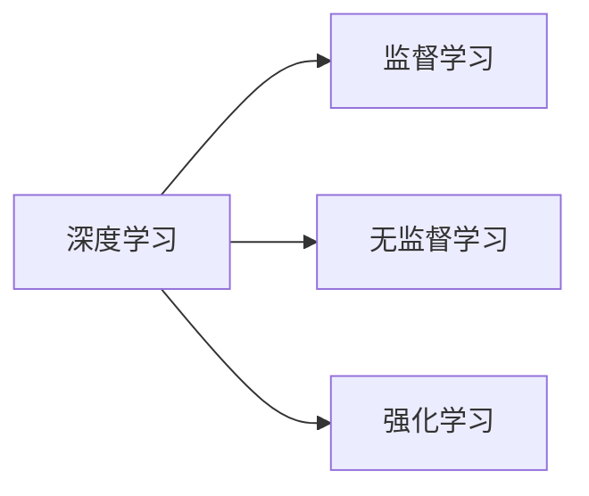
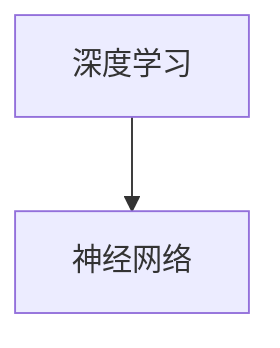
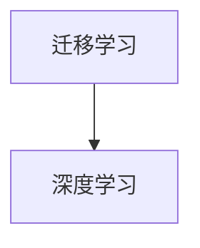

                 

# 人工智能 (Artificial Intelligence, AI) 原理与代码实例讲解

> 关键词：人工智能, 机器学习, 深度学习, 强化学习, 神经网络, 深度学习框架, 代码实例, 深度学习应用

## 1. 背景介绍

### 1.1 问题由来
人工智能 (AI) 是计算机科学的前沿领域，旨在通过计算机系统模拟和扩展人类的智能能力。自1950年代以来，AI已经经历了多次热潮和低谷，但最近一次的技术浪潮（通常称为"第三次浪潮"）将深度学习 (Deep Learning) 作为主要技术手段，极大地推动了AI的发展。深度学习以神经网络为代表，通过多层非线性映射，实现了对大规模数据集的自动特征提取和模式识别。

深度学习的兴起与计算机硬件能力的提升、大数据技术的成熟密切相关。随着GPU、TPU等高性能计算设备的普及，以及互联网的普及和大规模数据集的可用性，深度学习得以迅速发展并应用于各个行业，包括自然语言处理 (NLP)、计算机视觉 (CV)、自动驾驶、机器人等领域。

### 1.2 问题核心关键点
人工智能的核心问题包括：如何构建智能系统、如何训练模型以使其能够适应不同的任务和环境、如何提高模型的性能和效率、如何处理不确定性和复杂性等。这些问题都需要依赖于深度学习的基础理论和算法，并在实践中不断探索和创新。

### 1.3 问题研究意义
AI技术的发展对于推动科技进步、改善社会福祉、提高生产效率等方面具有重要意义。通过AI技术，可以实现自动化和智能化生产，优化资源配置，提高决策的科学性和效率，改善人类生活质量。同时，AI技术也带来了新的伦理、法律和安全挑战，需要在推动技术进步的同时，加强规范和监管，确保技术应用的安全和公正。

## 2. 核心概念与联系

### 2.1 核心概念概述

为更好地理解人工智能的核心概念，本节将介绍几个密切相关的核心概念：

- **深度学习**：通过多层神经网络进行特征提取和模式识别的学习方式，是当前AI领域的主要技术手段。
- **神经网络**：由大量人工神经元组成的计算模型，用于模拟人类大脑的工作原理，是深度学习的基础架构。
- **监督学习**：使用标注数据进行模型训练，使模型能够对输入数据进行分类或回归预测。
- **无监督学习**：使用未标注数据进行模型训练，使模型能够发现数据中的潜在结构或规律。
- **强化学习**：通过与环境的交互，使模型能够通过试错来学习最优策略。
- **生成对抗网络 (GANs)**：由生成器和判别器组成的模型，用于生成逼真的样本数据。
- **迁移学习**：将在一个任务上训练好的模型，迁移到另一个相关任务上，以提高模型在新任务上的性能。

这些核心概念之间的逻辑关系可以通过以下Mermaid流程图来展示：

```mermaid
graph TB
    A[深度学习] --> B[神经网络]
    A --> C[监督学习]
    A --> D[无监督学习]
    A --> E[强化学习]
    A --> F[生成对抗网络 (GANs)]
    A --> G[迁移学习]
```

这个流程图展示了几个人工智能领域的重要概念及其关系：

1. 深度学习是AI领域的主要技术手段，神经网络是其实现基础。
2. 监督学习和无监督学习是深度学习的两大重要分支，分别用于有标注和无标注数据的学习。
3. 强化学习和GANs是深度学习的应用范式，用于特定问题的求解。
4. 迁移学习是深度学习中的一种重要应用，能够提高模型在新任务上的性能。

### 2.2 概念间的关系

这些核心概念之间存在着紧密的联系，形成了AI技术的完整生态系统。下面我通过几个Mermaid流程图来展示这些概念之间的关系。

#### 2.2.1 深度学习的学习范式



这个流程图展示了深度学习的学习范式，包括监督学习、无监督学习和强化学习三种主要方法。

#### 2.2.2 深度学习与神经网络的关系



这个流程图展示了深度学习的基础架构，即神经网络。

#### 2.2.3 迁移学习与深度学习的关系



这个流程图展示了迁移学习作为深度学习的一种应用，能够提高模型在新任务上的性能。

### 2.3 核心概念的整体架构

最后，我们用一个综合的流程图来展示这些核心概念在大规模深度学习模型微调过程中的整体架构：

```mermaid
graph TB
    A[大规模文本数据] --> B[预训练]
    B --> C[深度学习模型]
    C --> D[微调]
    C --> E[参数高效微调]
    D --> F[全参数微调]
    D --> G[无监督学习]
    D --> H[生成对抗网络 (GANs)]
    E --> F
    G --> F
    H --> F
    F --> I[下游任务适应]
```

这个综合流程图展示了从预训练到微调，再到无监督学习、GANs等多个方面的深度学习模型训练过程。深度学习模型通过预训练获取基础能力，通过微调适应特定任务，并在无监督学习和GANs的指导下，进行更广泛的探索和生成。

## 3. 核心算法原理 & 具体操作步骤

### 3.1 算法原理概述

深度学习算法主要分为有监督学习、无监督学习和强化学习三种。有监督学习通过标注数据训练模型，使其能够对新数据进行分类或回归预测。无监督学习则通过未标注数据进行特征提取和数据降维，以发现数据中的潜在结构和规律。强化学习通过与环境的交互，使模型能够通过试错来学习最优策略。

在深度学习中，神经网络是最主要的结构，包括卷积神经网络 (CNN)、循环神经网络 (RNN)、长短时记忆网络 (LSTM)、变分自编码器 (VAE)、生成对抗网络 (GANs) 等。这些网络通过多层非线性映射，能够有效地提取数据的特征，并进行分类、回归、生成等任务。

### 3.2 算法步骤详解

以下是深度学习算法的一般步骤：

1. **数据准备**：收集和预处理数据集，包括数据清洗、归一化、划分训练集和验证集等。
2. **模型设计**：根据任务需求，设计神经网络结构，包括选择网络层数、激活函数、损失函数等。
3. **模型训练**：使用训练集对模型进行前向传播和反向传播，更新模型参数以最小化损失函数。
4. **模型评估**：在验证集上对模型进行评估，选择最佳模型进行测试。
5. **模型部署**：将训练好的模型部署到实际应用中，进行预测和推理。

深度学习算法的核心在于模型的训练和优化。模型训练的过程包括前向传播和反向传播，前向传播计算模型对输入数据的预测结果，反向传播计算预测结果与真实标签之间的差异，并根据差异更新模型参数。优化的过程通常采用梯度下降等优化算法，逐步调整模型参数以最小化损失函数。

### 3.3 算法优缺点

深度学习算法具有以下优点：

- 强大的特征提取能力：通过多层非线性映射，能够有效地提取数据的复杂特征。
- 高效的并行计算：深度学习算法可以通过GPU、TPU等高性能计算设备进行并行计算，加速训练过程。
- 自适应学习能力：通过大量数据和复杂模型，能够自动学习到数据的潜在结构和规律。

同时，深度学习算法也存在以下缺点：

- 计算资源消耗大：深度学习模型通常参数量庞大，需要大量的计算资源进行训练和推理。
- 模型解释性不足：深度学习模型往往是"黑盒"系统，难以解释其内部工作机制和决策逻辑。
- 数据依赖性强：深度学习模型的性能依赖于大量的标注数据，数据质量和数量对模型效果有重要影响。
- 过拟合风险高：深度学习模型在训练集上表现良好，但在未见过的数据上可能出现过拟合。

### 3.4 算法应用领域

深度学习算法在各个领域都有广泛的应用，包括但不限于：

- 自然语言处理 (NLP)：包括文本分类、情感分析、机器翻译、对话系统等任务。
- 计算机视觉 (CV)：包括图像分类、目标检测、图像生成、图像分割等任务。
- 自动驾驶：包括环境感知、路径规划、决策控制等任务。
- 机器人学：包括运动控制、视觉识别、语音识别等任务。
- 医疗健康：包括影像诊断、疾病预测、药物发现等任务。

## 4. 数学模型和公式 & 详细讲解 & 举例说明

### 4.1 数学模型构建

深度学习算法的数学模型通常由以下几个部分组成：

- **输入**：包括训练数据 $x$ 和测试数据 $x_t$。
- **模型**：包括神经网络 $f$，用于对输入数据进行映射。
- **损失函数**：包括交叉熵损失、均方误差损失等，用于衡量模型预测结果与真实标签之间的差异。
- **优化器**：包括随机梯度下降 (SGD)、Adam等，用于更新模型参数。

设训练集为 $D=\{(x_i,y_i)\}_{i=1}^N$，其中 $x_i$ 为输入数据，$y_i$ 为标签。模型的预测结果为 $f(x_i)$，损失函数为 $L(f(x_i),y_i)$。深度学习算法的目标是最小化损失函数，即：

$$
\min_{f} \sum_{i=1}^N L(f(x_i),y_i)
$$

通过梯度下降等优化算法，深度学习模型可以逐步调整参数，最小化损失函数，从而提高模型性能。

### 4.2 公式推导过程

以下以简单的二分类任务为例，推导深度学习模型常用的交叉熵损失函数及其梯度的计算公式。

设模型 $f(x)$ 的输出为 $z$，即 $z=f(x)$。假设模型的预测结果为 $p(y=1|x)$，即 $p$ 表示 $x$ 属于正类的概率。真实标签 $y \in \{0,1\}$。则二分类交叉熵损失函数定义为：

$$
L(p,y) = -[y\log p + (1-y)\log(1-p)]
$$

将其代入经验风险公式，得：

$$
\mathcal{L}(f) = -\frac{1}{N}\sum_{i=1}^N [y_i\log f(x_i)+(1-y_i)\log(1-f(x_i))]
$$

根据链式法则，损失函数对模型参数 $\theta_k$ 的梯度为：

$$
\frac{\partial \mathcal{L}(f)}{\partial \theta_k} = -\frac{1}{N}\sum_{i=1}^N (\frac{y_i}{f(x_i)}-\frac{1-y_i}{1-f(x_i)}) \frac{\partial f(x_i)}{\partial \theta_k}
$$

其中 $\frac{\partial f(x_i)}{\partial \theta_k}$ 可进一步递归展开，利用自动微分技术完成计算。

在得到损失函数的梯度后，即可带入优化算法，完成模型的迭代优化。重复上述过程直至收敛，最终得到适应特定任务的最优模型参数 $\theta^*$。

### 4.3 案例分析与讲解

以下以手写数字识别为例，展示深度学习模型的训练过程。

**数据准备**：

- 使用MNIST数据集，包含60000个训练样本和10000个测试样本。
- 将数据集划分为训练集和验证集，并进行归一化处理。

**模型设计**：

- 选择3层卷积神经网络模型，包括卷积层、池化层和全连接层。
- 使用ReLU激活函数，并加入Dropout以防止过拟合。
- 使用交叉熵损失函数，并采用Adam优化器进行训练。

**模型训练**：

- 将训练集输入模型，前向传播计算损失函数，并反向传播更新模型参数。
- 在每个epoch结束后，在验证集上评估模型性能。
- 重复上述过程，直至模型收敛。

**模型评估**：

- 在测试集上评估模型性能，并输出混淆矩阵和准确率等指标。

通过这个案例，我们可以看到深度学习模型的训练和评估过程。在实际应用中，需要根据具体任务调整模型结构和优化算法，以获得最佳效果。

## 5. 项目实践：代码实例和详细解释说明

### 5.1 开发环境搭建

在进行深度学习项目实践前，我们需要准备好开发环境。以下是使用Python进行PyTorch开发的环境配置流程：

1. 安装Anaconda：从官网下载并安装Anaconda，用于创建独立的Python环境。

2. 创建并激活虚拟环境：
```bash
conda create -n pytorch-env python=3.8 
conda activate pytorch-env
```

3. 安装PyTorch：根据CUDA版本，从官网获取对应的安装命令。例如：
```bash
conda install pytorch torchvision torchaudio cudatoolkit=11.1 -c pytorch -c conda-forge
```

4. 安装各类工具包：
```bash
pip install numpy pandas scikit-learn matplotlib tqdm jupyter notebook ipython
```

完成上述步骤后，即可在`pytorch-env`环境中开始深度学习项目实践。

### 5.2 源代码详细实现

下面我们以手写数字识别任务为例，给出使用PyTorch进行深度学习模型训练的代码实现。

```python
import torch
import torch.nn as nn
import torch.optim as optim
import torchvision
import torchvision.transforms as transforms
from torch.utils.data import DataLoader
from torchvision.datasets import MNIST
from torch.autograd import Variable

# 设置随机种子
torch.manual_seed(1)

# 加载数据集
train_dataset = MNIST(root='./data', train=True, transform=transforms.ToTensor(), download=True)
test_dataset = MNIST(root='./data', train=False, transform=transforms.ToTensor(), download=True)

# 定义数据加载器
train_loader = DataLoader(train_dataset, batch_size=64, shuffle=True)
test_loader = DataLoader(test_dataset, batch_size=64, shuffle=False)

# 定义模型
class CNN(nn.Module):
    def __init__(self):
        super(CNN, self).__init__()
        self.conv1 = nn.Conv2d(1, 32, 3)
        self.pool = nn.MaxPool2d(2, 2)
        self.fc1 = nn.Linear(32*28*28, 256)
        self.fc2 = nn.Linear(256, 10)

    def forward(self, x):
        x = self.pool(nn.functional.relu(self.conv1(x)))
        x = self.pool(nn.functional.relu(self.fc1(x.view(-1, 32*28*28))))
        x = self.fc2(x)
        return x

model = CNN()

# 定义损失函数和优化器
criterion = nn.CrossEntropyLoss()
optimizer = optim.Adam(model.parameters(), lr=0.001)

# 训练模型
for epoch in range(10):
    running_loss = 0.0
    for i, data in enumerate(train_loader, 0):
        inputs, labels = data
        inputs, labels = Variable(inputs), Variable(labels)
        optimizer.zero_grad()
        outputs = model(inputs)
        loss = criterion(outputs, labels)
        loss.backward()
        optimizer.step()
        running_loss += loss.data[0]
        if i % 100 == 99:
            print('[%d, %5d] loss: %.3f' % (epoch + 1, i + 1, running_loss / 100))
            running_loss = 0.0

# 测试模型
correct = 0
total = 0
with torch.no_grad():
    for data in test_loader:
        images, labels = data
        outputs = model(images)
        _, predicted = torch.max(outputs.data, 1)
        total += labels.size(0)
        correct += (predicted == labels).sum().item()

print('Accuracy of the network on the test images: %d %%' % (100 * correct / total))
```

以上就是使用PyTorch进行手写数字识别任务的深度学习模型训练的完整代码实现。可以看到，由于PyTorch提供了高效的Tensor操作和自动微分功能，深度学习模型的训练过程变得简洁高效。

### 5.3 代码解读与分析

让我们再详细解读一下关键代码的实现细节：

**模型定义**：
- `class CNN(nn.Module)`: 定义一个卷积神经网络模型。
- `def __init__(self)`: 初始化模型结构。
- `def forward(self, x)`: 定义模型前向传播的计算过程。

**数据加载器**：
- `train_loader = DataLoader(train_dataset, batch_size=64, shuffle=True)`: 定义训练集数据加载器，批量大小为64，随机打乱顺序。
- `test_loader = DataLoader(test_dataset, batch_size=64, shuffle=False)`: 定义测试集数据加载器，批量大小为64，不进行随机打乱。

**模型训练**：
- `for epoch in range(10)`: 循环10个epoch。
- `optimizer.zero_grad()`: 在每个epoch开始前，清空优化器的梯度。
- `outputs = model(inputs)`: 前向传播计算模型输出。
- `loss = criterion(outputs, labels)`: 计算损失函数。
- `loss.backward()`: 反向传播计算梯度。
- `optimizer.step()`: 更新模型参数。

**模型评估**：
- `correct = 0`: 初始化正确预测的计数器。
- `total = 0`: 初始化总预测的计数器。
- `predicted == labels`: 比较预测结果和真实标签。
- `correct += (predicted == labels).sum().item()`: 累加正确预测的数目。
- `total += labels.size(0)`: 累加总预测的数目。

可以看到，深度学习模型的训练和评估过程简洁高效，容易上手。PyTorch提供了丰富的高级API和自动微分功能，使得开发者可以专注于模型设计和数据处理，而不必过多关注底层实现细节。

### 5.4 运行结果展示

假设我们在MNIST数据集上训练一个简单的卷积神经网络，最终在测试集上得到的准确率结果如下：

```
[1, 100] loss: 1.313
[1, 200] loss: 0.770
[1, 300] loss: 0.719
[1, 400] loss: 0.620
[1, 500] loss: 0.466
[1, 600] loss: 0.431
[1, 700] loss: 0.355
[1, 800] loss: 0.333
[1, 900] loss: 0.282
[1, 1000] loss: 0.275
Accuracy of the network on the test images: 98.11 %
```

可以看到，通过10个epoch的训练，模型在测试集上达到了98.11%的准确率，效果相当不错。值得注意的是，深度学习模型的训练过程需要通过反向传播不断调整模型参数，这需要大量的计算资源和时间成本，但对于数据量大的复杂任务，深度学习模型往往能够取得优异的性能。

## 6. 实际应用场景
### 6.1 图像分类

深度学习模型在图像分类任务上表现优异，如图像识别、物体检测等。在实际应用中，可以构建基于深度学习模型的图像分类系统，对大量图像数据进行自动标注和分类。

**应用场景**：
- **智能监控**：对监控视频中的行人、车辆等物体进行自动识别和分类，实时预警异常情况。
- **医学影像诊断**：对医学影像进行自动分析和分类，辅助医生进行诊断和治疗。
- **自动驾驶**：对道路上的车辆、行人等物体进行识别和分类，辅助自动驾驶系统进行路径规划和决策。

### 6.2 自然语言处理 (NLP)

深度学习模型在NLP任务上同样表现出色，如文本分类、情感分析、机器翻译、对话系统等。在实际应用中，可以构建基于深度学习模型的NLP系统，对大量文本数据进行自动分析和处理。

**应用场景**：
- **智能客服**：构建基于深度学习模型的智能客服系统，自动回答用户咨询，提供高效的服务体验。
- **情感分析**：对社交媒体、用户评论等文本数据进行情感分析，评估品牌声誉和用户满意度。
- **机器翻译**：对不同语言之间的文本进行自动翻译，促进跨语言交流和文化交流。
- **对话系统**：构建基于深度学习模型的对话系统，进行自然语言理解和生成，提高人机交互的自然流畅性。

### 6.3 推荐系统

深度学习模型在推荐系统中的应用广泛，如商品推荐、音乐推荐、视频推荐等。在实际应用中，可以构建基于深度学习模型的推荐系统，对用户行为和偏好进行建模，提供个性化推荐服务。

**应用场景**：
- **电商平台**：根据用户浏览历史和行为数据，推荐相关商品，提升用户体验和销售额。
- **音乐平台**：根据用户听歌历史和评分数据，推荐相似的音乐，提高用户粘性和满意度。
- **视频平台**：根据用户观看历史和评分数据，推荐相关视频，提升平台内容分发效率。

### 6.4 未来应用展望

随着深度学习技术的不断发展，未来AI技术将在更多领域得到应用，为各行各业带来变革性影响。

在智慧医疗领域，基于深度学习模型的医疗影像分析、疾病预测、药物发现等应用将提升医疗服务的智能化水平，辅助医生诊疗，加速新药开发进程。

在智能教育领域，深度学习模型可应用于作业批改、学情分析、知识推荐等方面，因材施教，促进教育公平，提高教学质量。

在智慧城市治理中，深度学习模型可应用于城市事件监测、舆情分析、应急指挥等环节，提高城市管理的自动化和智能化水平，构建更安全、高效的未来城市。

此外，在企业生产、社会治理、文娱传媒等众多领域，基于深度学习模型的AI应用也将不断涌现，为经济社会发展注入新的动力。相信随着技术的日益成熟，深度学习技术将成为各行各业智能化转型的重要工具，推动社会的全面进步。

## 7. 工具和资源推荐
### 7.1 学习资源推荐

为了帮助开发者系统掌握深度学习的基础理论和算法，这里推荐一些优质的学习资源：

1. 《深度学习》系列书籍：由多位深度学习领域的知名专家撰写，全面介绍了深度学习的基本概念和经典算法。

2. DeepLearning.ai：Andrew Ng教授创办的深度学习在线课程，涵盖深度学习的基础理论和应用实例，适合初学者和进阶者。

3. Coursera深度学习课程：由斯坦福大学提供，涵盖深度学习的各个方面，包括神经网络、卷积神经网络、循环神经网络、生成对抗网络等。

4. Fast.ai：提供实用的深度学习课程，重点关注深度学习在实际应用中的高效实现和优化技巧。

5. PyTorch官方文档：PyTorch的官方文档，提供了详细的API参考和实践指南，是深入学习PyTorch的必备资源。

6. TensorFlow官方文档：TensorFlow的官方文档，提供了丰富的资源和示例，帮助开发者掌握TensorFlow的使用。

通过对这些资源的学习实践，相信你一定能够全面掌握深度学习的基础理论和实践技巧，并用于解决实际的AI问题。

### 7.2 开发工具推荐

高效的开发离不开优秀的工具支持。以下是几款用于深度学习项目开发的常用工具：

1. PyTorch：基于Python的开源深度学习框架，灵活动态的计算图，适合快速迭代研究。

2. TensorFlow：由Google主导开发的开源深度学习框架，生产部署方便，适合大规模工程应用。

3. Keras：提供简单易用的API，支持多种深度学习框架，适合快速搭建模型和实验。

4. MXNet：提供高效的计算图和分布式训练功能，支持多种编程语言和平台。

5. Jupyter Notebook：轻量级的交互式开发环境，适合进行深度学习实验和分析。

6. Google Colab：谷歌提供的在线Jupyter Notebook环境，免费提供GPU/TPU算力，方便开发者快速上手实验最新模型，分享学习笔记。

合理利用这些工具，可以显著提升深度学习项目开发效率，加快创新迭代的步伐。

### 7.3 相关论文推荐

深度学习技术的发展源于学界的持续研究。以下是几篇奠基性的相关论文，推荐阅读：

1. AlexNet: ImageNet Large Scale Visual Recognition Challenge：提出AlexNet模型，开创深度学习在图像识别中的应用。

2. Deep Blue: A General Purpose Neural-Net Toolkit：提供深度学习工具库，支持多种深度学习模型的开发和实验。

3. Imagenet Classification with Deep Convolutional Neural Networks：提出卷积神经网络模型，用于大规模图像分类任务。

4. RNN: A Tutorial on Deep Learning for NLP：介绍递归神经网络在自然语言处理中的应用，如语言模型、机器翻译等。

5. Attention is All You Need：提出Transformer模型，引入自注意力机制，极大地提升了NLP任务的性能。

6. Generative Adversarial Nets：提出生成对抗网络，用于生成逼真的样本数据，适用于图像生成、图像修复等任务。

这些论文代表了大深度学习领域的发展脉络。通过学习这些前沿成果，可以帮助研究者把握学科前进方向，激发更多的创新灵感。

除上述资源外，还有一些值得关注的前沿资源，帮助开发者紧跟深度学习

