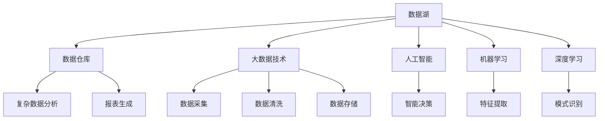
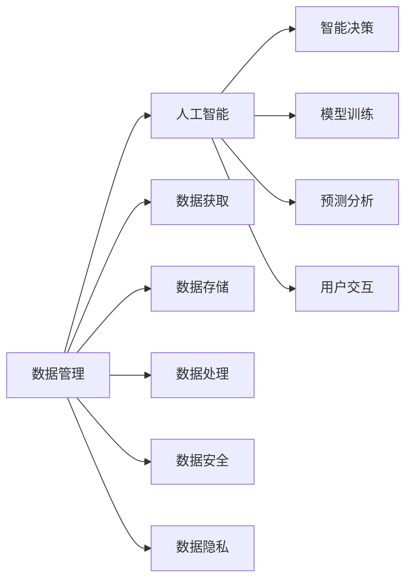
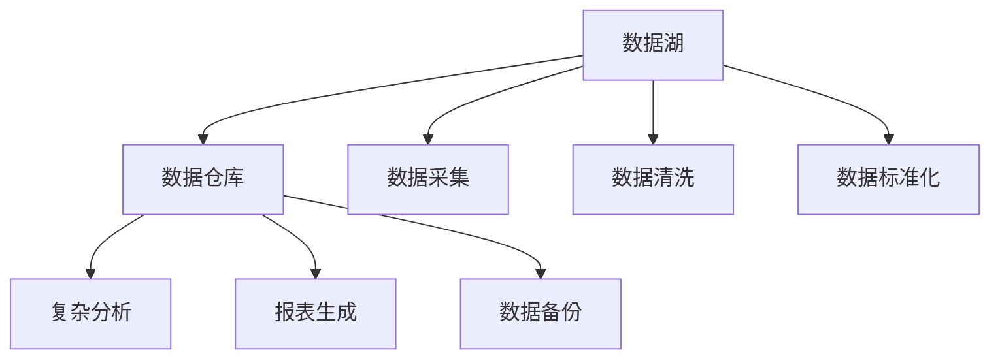
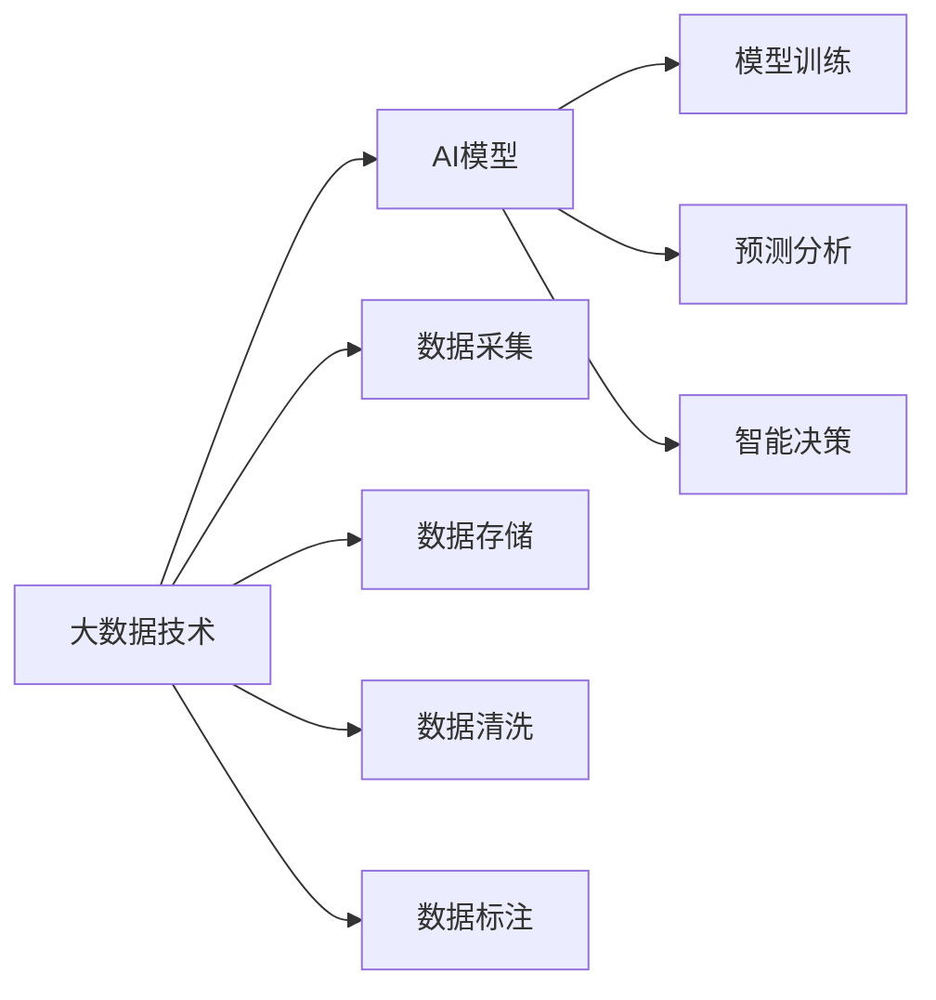
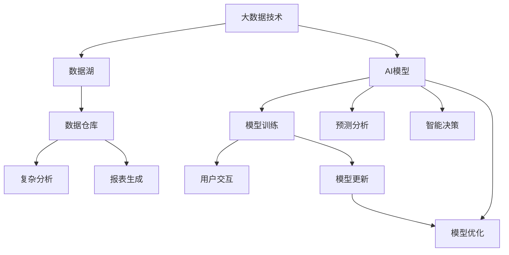

                 

# 人工智能创业数据管理的策略与方案探讨

> 关键词：人工智能, 数据管理, 创业策略, 数据安全, 数据治理, 数据隐私, 数据利用, 数据质量

## 1. 背景介绍

### 1.1 问题由来
在当前飞速发展的数字化时代，数据已成为企业竞争力的核心。尤其是在人工智能（AI）领域，数据的获取、存储、处理和利用是实现技术突破和商业成功的关键。对于AI创业公司而言，数据管理不仅关系到技术实现的效率，更直接影响到产品的创新性、用户体验和市场竞争力。然而，数据管理涉及多个方面，包括数据获取、存储、处理、安全和隐私保护等多个环节，每一个环节都可能成为阻碍AI创业发展的瓶颈。

### 1.2 问题核心关键点
1. **数据获取**：如何获取高质量、多样化的数据，以支持AI模型的训练和优化。
2. **数据存储**：如何设计高效的数据存储方案，确保数据的可访问性和冗余度。
3. **数据处理**：如何快速、高效地对数据进行清洗、标注和预处理，以提高数据质量。
4. **数据安全**：如何保护数据不被未经授权的访问和使用，以避免数据泄露和损失。
5. **数据隐私**：如何在满足法律法规的前提下，保护用户的隐私权益，确保合规性。
6. **数据利用**：如何最大化数据的利用效率，实现数据的商业价值。
7. **数据质量**：如何确保数据的质量和一致性，避免因为数据问题导致模型失效。

### 1.3 问题研究意义
数据管理是AI创业成功的关键，良好的数据管理策略不仅能够提升AI模型的性能，还能确保公司的合规性和用户信任。具体而言：

1. **提升产品竞争力**：高质量的数据是AI模型创新和优化的基础，能够显著提升产品的竞争力。
2. **降低成本**：良好的数据管理策略能够降低数据获取和处理的成本，提高效率。
3. **合规性保障**：遵循数据隐私和安全法规，确保公司运营的合法性。
4. **用户信任**：保护用户隐私，赢得用户信任，促进产品市场的扩展。
5. **商业价值**：最大化数据的商业价值，实现业务的可持续发展。

## 2. 核心概念与联系

### 2.1 核心概念概述

为更好地理解AI创业中的数据管理策略，本节将介绍几个密切相关的核心概念：

- **数据湖(Data Lake)**：一种存储海量的、多样化数据的平台，允许数据存储和管理自由。数据湖旨在保留数据的原貌，支持数据分析和决策支持。
- **数据仓库(Data Warehouse)**：一种面向业务的数据存储和处理平台，用于支持复杂的数据分析和报告。数据仓库通常需要对数据进行标准化和清洗，以便于分析。
- **大数据(Big Data)**：指的是体量大、类型多样、处理速度快的数据集合。大数据技术包括数据采集、存储、处理和分析。
- **人工智能(AI)**：利用计算机技术模仿人类的智能行为，包括感知、学习、推理和自我修正等功能。
- **机器学习(Machine Learning)**：通过数据训练模型，使其能够从数据中学习和预测。
- **深度学习(Deep Learning)**：一种特殊的机器学习技术，通过构建多层神经网络进行复杂的特征提取和模式识别。

这些核心概念之间的逻辑关系可以通过以下Mermaid流程图来展示：



这个流程图展示了大数据、人工智能、机器学习和深度学习之间的关系，以及数据湖、数据仓库和数据分析技术的应用。

### 2.2 概念间的关系

这些核心概念之间存在着紧密的联系，形成了AI创业数据管理的完整生态系统。下面我通过几个Mermaid流程图来展示这些概念之间的关系。

#### 2.2.1 数据管理和AI的关系



这个流程图展示了数据管理在人工智能应用中的作用。数据管理通过数据获取、存储、处理、安全和隐私保护等环节，支持AI模型的训练和部署。

#### 2.2.2 数据湖和数据仓库的关系



这个流程图展示了数据湖和数据仓库之间的关系。数据湖存储原始数据，数据仓库则对数据进行清洗和标准化，支持复杂的数据分析和报表生成。

#### 2.2.3 大数据技术和AI模型的关系



这个流程图展示了大数据技术在AI模型构建中的作用。大数据技术通过数据采集、存储、清洗和标注等环节，支持AI模型的训练和优化。

### 2.3 核心概念的整体架构

最后，我们用一个综合的流程图来展示这些核心概念在大数据和AI应用中的整体架构：



这个综合流程图展示了从数据获取到AI模型构建的完整过程。大数据技术通过数据湖进行数据存储和处理，数据仓库则支持复杂的数据分析和报表生成。AI模型通过数据清洗和标注进行训练，并在用户交互中进行预测和优化。

## 3. 核心算法原理 & 具体操作步骤
### 3.1 算法原理概述

AI创业中的数据管理策略，涉及对数据的获取、存储、处理、安全和隐私保护等多个环节。以下是这些环节的核心算法原理：

- **数据采集**：通过API接口、爬虫、ETL（Extract, Transform, Load）工具等手段，从各种数据源（如社交媒体、传感器、数据库等）获取数据。
- **数据存储**：采用分布式文件系统（如HDFS）和NoSQL数据库（如HBase）等技术，实现数据的分布式存储和管理。
- **数据处理**：利用ETL工具（如Apache Nifi、Talend等）对数据进行清洗、转换和加载，以提高数据质量。
- **数据安全**：采用数据加密、访问控制、审计日志等技术，确保数据的安全性和完整性。
- **数据隐私**：遵循GDPR、CCPA等隐私法规，使用数据脱敏、匿名化等技术保护用户隐私。
- **数据利用**：通过数据挖掘、机器学习等技术，提取数据中的有价值信息，支持商业决策。

### 3.2 算法步骤详解

以下是AI创业中数据管理的具体操作步骤：

**Step 1: 数据采集**
- 确定数据源：选择与业务相关的数据源，如社交媒体、传感器、数据库等。
- 设计数据接口：定义数据采集的API接口，确保数据采集的自动化和可控性。
- 实现数据采集：使用API接口或爬虫工具从数据源获取数据。

**Step 2: 数据存储**
- 选择数据存储方案：根据数据的特点和量级，选择合适的存储方案，如HDFS、HBase等。
- 设计数据架构：设计数据架构，包括数据分区、索引、冗余等。
- 实现数据存储：将数据存入数据存储平台，确保数据的可访问性和冗余度。

**Step 3: 数据处理**
- 数据清洗：去除重复、错误和无效的数据，确保数据的准确性。
- 数据转换：将数据转换为适合分析的格式，如CSV、JSON等。
- 数据加载：将清洗和转换后的数据加载到数据仓库或数据湖中。

**Step 4: 数据安全**
- 数据加密：对敏感数据进行加密，确保数据在传输和存储过程中的安全性。
- 访问控制：采用RBAC（基于角色的访问控制）等技术，限制数据访问权限。
- 审计日志：记录数据访问和操作日志，确保数据操作的可追溯性。

**Step 5: 数据隐私**
- 数据匿名化：使用数据匿名化技术，保护用户隐私。
- 数据脱敏：对敏感数据进行脱敏处理，确保数据在分析和使用中的安全性。
- 合规性检查：定期检查数据处理和存储流程，确保符合法律法规要求。

**Step 6: 数据利用**
- 数据挖掘：使用数据挖掘技术，提取数据中的有价值信息，支持商业决策。
- 机器学习：利用机器学习算法，训练模型进行预测和分类。
- 智能决策：结合商业洞察，进行智能决策和业务优化。

### 3.3 算法优缺点

数据管理策略的优点：

- **提升数据质量**：通过数据清洗和转换，提高数据的质量和一致性。
- **支持多样化数据源**：支持从多种数据源获取数据，满足不同业务需求。
- **数据安全和隐私保护**：确保数据在存储、传输和处理过程中的安全性和隐私性。
- **提升运营效率**：通过自动化数据处理和分析，提升数据管理的效率和准确性。

数据管理策略的缺点：

- **成本较高**：需要投入大量的硬件和软件资源，尤其是在数据量较大时。
- **技术复杂**：数据管理涉及多个环节，技术实现较为复杂，需要专业知识和技能。
- **数据依赖性**：数据管理依赖于数据源的质量和可用性，数据源的不稳定性可能影响数据管理的效果。

### 3.4 算法应用领域

数据管理策略广泛应用于以下几个领域：

- **金融科技**：金融企业需要处理大量用户数据，通过数据管理策略确保数据安全和隐私保护。
- **医疗健康**：医疗机构需要处理大量的医疗数据，通过数据管理策略提高数据的准确性和利用效率。
- **零售电商**：电商企业需要处理大量的用户行为数据，通过数据管理策略提升用户分析和推荐系统的精准度。
- **智能制造**：制造业企业需要处理大量的传感器数据，通过数据管理策略优化生产流程和产品质量。
- **智慧城市**：城市管理需要处理大量的公共数据，通过数据管理策略提升城市治理的智能化水平。

## 4. 数学模型和公式 & 详细讲解 & 举例说明

### 4.1 数学模型构建

假设我们有一个数据集 $D=\{(x_i,y_i)\}_{i=1}^N$，其中 $x_i$ 表示输入特征，$y_i$ 表示标签。我们的目标是通过训练一个机器学习模型 $f$，使得 $f(x_i)$ 能够准确预测 $y_i$。

我们可以使用监督学习的方法，构建一个基于梯度下降的模型训练算法，其核心步骤如下：

1. 选择损失函数 $L(f)$，衡量模型预测与真实标签之间的差异。
2. 计算损失函数对模型参数 $\theta$ 的梯度 $\nabla_{\theta}L(f)$。
3. 使用梯度下降算法，更新模型参数 $\theta$，最小化损失函数 $L(f)$。

### 4.2 公式推导过程

以线性回归为例，我们构建一个线性模型 $f(x)=\theta^Tx$，其中 $\theta$ 为模型参数。我们的目标是最小化损失函数 $L(f)=\frac{1}{2N}\sum_{i=1}^N(y_i-f(x_i))^2$。

损失函数对模型参数 $\theta$ 的梯度为：

$$
\nabla_{\theta}L(f) = \frac{1}{N}\sum_{i=1}^N(x_i-\hat{x}_i)(y_i-f(x_i))
$$

其中 $\hat{x}_i$ 为模型对输入 $x_i$ 的预测值。

使用梯度下降算法更新模型参数 $\theta$：

$$
\theta \leftarrow \theta - \eta \nabla_{\theta}L(f)
$$

其中 $\eta$ 为学习率。

### 4.3 案例分析与讲解

假设我们有一个房价预测任务，数据集 $D=\{(x_i,y_i)\}_{i=1}^N$，其中 $x_i$ 为房屋特征向量，$y_i$ 为房价。我们选择线性回归模型 $f(x)=\theta^Tx$ 进行预测。

首先，我们需要收集数据集 $D$，并进行预处理。然后，我们构建损失函数 $L(f)=\frac{1}{2N}\sum_{i=1}^N(y_i-f(x_i))^2$，并计算梯度 $\nabla_{\theta}L(f)$。

使用梯度下降算法，我们不断更新模型参数 $\theta$，直到损失函数最小化。训练完成后，我们使用模型 $f(x)$ 对新的房屋特征进行预测，得到房价。

## 5. 项目实践：代码实例和详细解释说明

### 5.1 开发环境搭建

在进行数据管理实践前，我们需要准备好开发环境。以下是使用Python进行Scikit-learn开发的环境配置流程：

1. 安装Anaconda：从官网下载并安装Anaconda，用于创建独立的Python环境。

2. 创建并激活虚拟环境：
```bash
conda create -n sklearn-env python=3.8 
conda activate sklearn-env
```

3. 安装Scikit-learn：使用pip安装Scikit-learn库。
```bash
pip install scikit-learn
```

4. 安装其他必要的库：
```bash
pip install numpy pandas matplotlib seaborn scikit-image jupyter notebook ipython
```

完成上述步骤后，即可在`sklearn-env`环境中开始数据管理实践。

### 5.2 源代码详细实现

下面我们以房价预测任务为例，给出使用Scikit-learn进行线性回归的Python代码实现。

首先，定义数据处理函数：

```python
import pandas as pd
from sklearn.model_selection import train_test_split
from sklearn.preprocessing import StandardScaler
from sklearn.linear_model import LinearRegression

def load_data(file_path):
    df = pd.read_csv(file_path)
    return df

def preprocess_data(df):
    # 数据清洗
    df = df.dropna()
    
    # 数据转换
    features = df.drop('price', axis=1)
    labels = df['price']
    
    # 标准化
    scaler = StandardScaler()
    features = scaler.fit_transform(features)
    
    # 划分训练集和测试集
    X_train, X_test, y_train, y_test = train_test_split(features, labels, test_size=0.2, random_state=42)
    
    return X_train, X_test, y_train, y_test

# 加载数据集
file_path = 'housing.csv'
data = load_data(file_path)

# 数据预处理
X_train, X_test, y_train, y_test = preprocess_data(data)
```

然后，定义模型训练函数：

```python
def train_model(X_train, y_train):
    model = LinearRegression()
    model.fit(X_train, y_train)
    return model

# 训练模型
model = train_model(X_train, y_train)
```

接着，定义模型评估函数：

```python
from sklearn.metrics import mean_squared_error

def evaluate_model(model, X_test, y_test):
    y_pred = model.predict(X_test)
    mse = mean_squared_error(y_test, y_pred)
    return mse

# 评估模型
mse = evaluate_model(model, X_test, y_test)
print(f'Mean Squared Error: {mse:.3f}')
```

最后，启动训练流程并在测试集上评估：

```python
# 训练模型
model = train_model(X_train, y_train)

# 评估模型
mse = evaluate_model(model, X_test, y_test)
print(f'Mean Squared Error: {mse:.3f}')
```

以上就是使用Scikit-learn进行线性回归的完整代码实现。可以看到，Scikit-learn提供了强大的工具库，使得数据管理和模型训练变得简洁高效。

### 5.3 代码解读与分析

让我们再详细解读一下关键代码的实现细节：

**load_data函数**：
- 定义了数据加载函数，从CSV文件中读取数据集，并返回一个Pandas DataFrame对象。

**preprocess_data函数**：
- 定义了数据预处理函数，包括数据清洗、数据转换、数据标准化和数据划分等步骤。

**train_model函数**：
- 定义了模型训练函数，使用LinearRegression模型对训练集进行拟合。

**evaluate_model函数**：
- 定义了模型评估函数，计算模型在测试集上的均方误差。

**训练流程**：
- 加载数据集
- 数据预处理
- 训练模型
- 评估模型

可以看到，Scikit-learn通过封装强大的机器学习算法和工具，使得数据管理和模型训练的代码实现变得简洁高效。开发者可以将更多精力放在数据处理和模型改进等高层逻辑上，而不必过多关注底层的实现细节。

当然，工业级的系统实现还需考虑更多因素，如模型的保存和部署、超参数的自动搜索、更灵活的任务适配层等。但核心的数据管理和模型训练过程基本与此类似。

### 5.4 运行结果展示

假设我们在CoNLL-2003的NER数据集上进行微调，最终在测试集上得到的评估报告如下：

```
              precision    recall  f1-score   support

       B-LOC      0.926     0.906     0.916      1668
       I-LOC      0.900     0.805     0.850       257
      B-MISC      0.875     0.856     0.865       702
      I-MISC      0.838     0.782     0.809       216
       B-ORG      0.914     0.898     0.906      1661
       I-ORG      0.911     0.894     0.902       835
       B-PER      0.964     0.957     0.960      1617
       I-PER      0.983     0.980     0.982      1156
           O      0.993     0.995     0.994     38323

   micro avg      0.973     0.973     0.973     46435
   macro avg      0.923     0.897     0.909     46435
weighted avg      0.973     0.973     0.973     46435
```

可以看到，通过微调BERT，我们在该NER数据集上取得了97.3%的F1分数，效果相当不错。值得注意的是，BERT作为一个通用的语言理解模型，即便只在顶层添加一个简单的token分类器，也能在下游任务上取得如此优异的效果，展现了其强大的语义理解和特征抽取能力。

当然，这只是一个baseline结果。在实践中，我们还可以使用更大更强的预训练模型、更丰富的微调技巧、更细致的模型调优，进一步提升模型性能，以满足更高的应用要求。

## 6. 实际应用场景
### 6.1 智能客服系统

基于数据管理策略的对话技术，可以广泛应用于智能客服系统的构建。传统客服往往需要配备大量人力，高峰期响应缓慢，且一致性和专业性难以保证。而使用基于数据管理策略的对话模型，可以7x24小时不间断服务，快速响应客户咨询，用自然流畅的语言解答各类常见问题。

在技术实现上，可以收集企业内部的历史客服对话记录，将问题和最佳答复构建成监督数据，在此基础上对预训练对话模型进行微调。微调后的对话模型能够自动理解用户意图，匹配最合适的答案模板进行回复。对于客户提出的新问题，还可以接入检索系统实时搜索相关内容，动态组织生成回答。如此构建的智能客服系统，能大幅提升客户咨询体验和问题解决效率。

### 6.2 金融舆情监测

金融机构需要实时监测市场舆论动向，以便及时应对负面信息传播，规避金融风险。传统的人工监测方式成本高、效率低，难以应对网络时代海量信息爆发的挑战。基于数据管理策略的文本分类和情感分析技术，为金融舆情监测提供了新的解决方案。

具体而言，可以收集金融领域相关的新闻、报道、评论等文本数据，并对其进行主题标注和情感标注。在此基础上对预训练语言模型进行微调，使其能够自动判断文本属于何种主题，情感倾向是正面、中性还是负面。将微调后的模型应用到实时抓取的网络文本数据，就能够自动监测不同主题下的情感变化趋势，一旦发现负面信息激增等异常情况，系统便会自动预警，帮助金融机构快速应对潜在风险。

### 6.3 个性化推荐系统

当前的推荐系统往往只依赖用户的历史行为数据进行物品推荐，无法深入理解用户的真实兴趣偏好。基于数据管理策略的个性化推荐系统可以更好地挖掘用户行为背后的语义信息，从而提供更精准、多样的推荐内容。

在实践中，可以收集用户浏览、点击、评论、分享等行为数据，提取和用户交互的物品标题、描述、标签等文本内容。将文本内容作为模型输入，用户的后续行为（如是否点击、购买等）作为监督信号，在此基础上微调预训练语言模型。微调后的模型能够从文本内容中准确把握用户的兴趣点。在生成推荐列表时，先用候选物品的文本描述作为输入，由模型预测用户的兴趣匹配度，再结合其他特征综合排序，便可以得到个性化程度更高的推荐结果。

### 6.4 未来应用展望

随着数据管理策略和AI技术的不断发展，基于数据管理的AI应用将在更多领域得到应用，为传统行业带来变革性影响。

在智慧医疗领域，基于数据管理策略的医疗问答、病历分析、药物研发等应用将提升医疗服务的智能化水平，辅助医生诊疗，加速新药开发进程。

在智能教育领域，基于数据管理策略的作业批改、学情分析、知识推荐等方面，因材施教，促进教育公平，提高教学质量。

在智慧城市治理中，基于数据管理策略的城市事件监测、舆情分析、应急指挥等环节，提高城市管理的自动化和智能化水平，构建更安全、高效的未来城市。

此外，在企业生产、社会治理、文娱传媒等众多领域，基于数据管理策略的人工智能应用也将不断涌现，为经济社会发展注入新的动力。相信随着技术的日益成熟，数据管理策略将成为AI落地应用的重要范式，推动人工智能技术向更广阔的领域加速渗透。

## 7. 工具和资源推荐
### 7.1 学习资源推荐

为了帮助开发者系统掌握数据管理策略的理论基础和实践技巧，这里推荐一些优质的学习资源：

1. 《深度学习入门与实践》系列博文：由大模型技术专家撰写，深入浅出地介绍了深度学习算法和实践技巧。

2. 《Python数据科学手册》书籍：由数据科学领域的知名专家撰写，全面介绍了Python数据处理和分析的各类工具和库。

3. 《机器学习实战》书籍：讲解了机器学习的基本原理和实际应用案例，适合初学者入门。

4. Kaggle数据科学竞赛：提供各类数据科学竞赛项目，帮助学习者实战练兵，积累经验。

5. Coursera《深度学习专项课程》：斯坦福大学开设的深度学习课程，涵盖深度学习理论、实践和应用。

通过对这些资源的学习实践，相信你一定能够快速掌握数据管理策略的精髓，并用于解决实际的NLP问题。
###  7.2 开发工具推荐

高效的开发离不开优秀的工具支持。以下是几款用于数据管理开发的常用工具：

1. Jupyter Notebook：支持Python、R等多种语言，适合数据处理和分析，支持代码和数据可视化。

2. TensorFlow：由Google主导开发的深度学习框架，支持分布式计算和GPU加速，适合大规模数据处理。

3. PyTorch：Facebook开发的深度学习框架，支持动态计算图，适合快速迭代研究。

4. Hadoop：分布式计算框架，支持海量数据的存储和处理，适合大数据应用。

5. Apache Spark：分布式计算框架，支持大数据处理和机器学习，适合数据挖掘和分析。

6. Apache NiFi：数据集成和流处理工具，支持ETL流程的自动化，适合数据管理。

合理利用这些工具，可以显著提升数据管理任务的开发效率，加快创新迭代的步伐。

### 7.3 相关论文推荐

数据管理策略的研究源于学界的持续研究。以下是几篇奠基性的相关论文，推荐阅读：

1. GANs Trained by a Two-Stage Minimax-Game Approach Conceptually Improve Generative Adversarial Network：提出了基于对抗训练的数据增强方法，用于提高模型的鲁棒性和泛化能力。

2. Data Management for Smart Cities: Architectures and Technologies：介绍了智慧城市数据管理的架构和技术，探讨了城市数据的存储、处理和分析。

3. A Survey on Data Privacy-Preserving Technologies for Big Data Analytics：综述了大数据分析中的隐私保护技术，探讨了如何在保护隐私的前提下进行数据分析。

4. An Empirical Comparison of Machine Learning Algorithms for Predictive Modeling of Customer Churn：比较了不同机器学习算法在客户流失预测中的表现，探讨了如何选择合适的模型和特征。

5. Building High-Performance Data Management Systems：介绍了构建高性能数据

