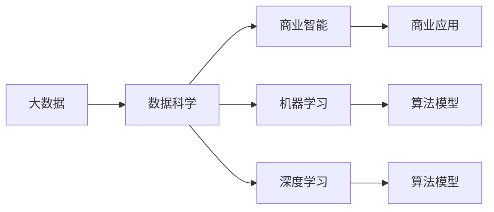
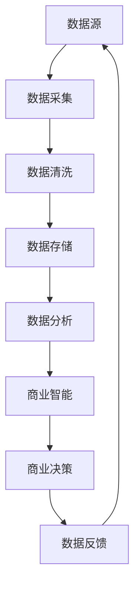

                 

# 人工智能创业：数据核心地位

> 关键词：人工智能,创业,数据核心,机器学习,深度学习,商业智能,BI,数据科学

## 1. 背景介绍

### 1.1 问题由来
在人工智能（AI）领域，数据被视为创新的核心动力。无论是在前沿科研，还是在商业应用中，数据的获取、处理和利用都在某种程度上决定了AI项目的成败。特别是在AI创业领域，数据不仅是产品的直接输入，也是商业模式的核心要素。然而，数据的核心地位并没有得到足够的重视，很多创业公司在这方面存在严重的误区和短板。本文将深入探讨数据在人工智能创业中的关键作用，帮助创业者更科学地理解数据的价值，并提供一套行之有效的方法论。

### 1.2 问题核心关键点
数据在人工智能创业中的重要性主要体现在以下几个方面：

1. **数据驱动的决策**：AI项目的核心优势在于其能够处理和分析大规模数据，从中提取有用的信息，并据此做出决策。因此，数据的质量和多样性直接影响AI模型的性能和应用效果。

2. **竞争优势**：数据是构成企业竞争力的重要组成部分。掌握优质的数据资源，可以让企业抢占先机，赢得市场竞争。

3. **创新动力**：数据提供了丰富的素材和场景，是推动AI技术创新和应用落地的重要基础。

4. **商业价值**：数据是构建商业模式的基石。通过对数据的有效利用，可以实现精准营销、个性化推荐、风险控制等功能，直接提升企业盈利能力。

5. **市场拓展**：数据的获取和处理能力决定了AI产品在不同市场的适应性和扩展性。

### 1.3 问题研究意义
深入理解数据在人工智能创业中的核心地位，对于构建成功的AI项目具有重要意义：

1. **优化数据获取策略**：明确数据的重要性，有助于创业公司更积极主动地获取和积累数据资源。

2. **提升数据处理能力**：优化数据处理流程，提高数据质量，增强模型训练和推理的效率和效果。

3. **防范数据风险**：识别数据风险，制定有效的数据管理策略，避免因数据问题导致的企业失败。

4. **拓展市场空间**：利用数据获取和处理能力，加速产品和服务的市场推广和扩展。

5. **创新业务模式**：基于数据的深入分析和应用，探索和开发新的商业机会和业务模式。

## 2. 核心概念与联系

### 2.1 核心概念概述

数据在人工智能创业中扮演着至关重要的角色，其核心概念包括：

- **大数据**：指体量巨大、多样性丰富、真实性高的数据集，是AI创新的基础。
- **数据科学**：一门以数据为核心，融合统计学、计算机科学和数学方法，解决实际问题的学科。
- **商业智能（BI）**：利用数据和分析工具，提升企业决策质量和管理效率的实践。
- **机器学习（ML）**：通过算法让机器自动从数据中学习并做出预测或决策的能力。
- **深度学习（DL）**：一种基于多层神经网络的机器学习技术，用于解决复杂的非线性问题。

这些概念之间的联系紧密，形成一个完整的生态系统。大数据提供了数据科学的基础，而机器学习和深度学习则是对数据的深度加工和应用。商业智能则将数据分析和应用转化为企业的实际效益，进一步推动AI技术在商业场景中的应用。

### 2.2 概念间的关系

以下是一个简单的Mermaid流程图，展示了数据科学、商业智能、机器学习和深度学习之间的关系：



这个流程图表明，大数据是数据科学的输入，而数据科学通过机器学习和深度学习对数据进行加工和建模，最终转化为商业智能，并在商业应用中发挥作用。

### 2.3 核心概念的整体架构

下图展示了一个更详细的整体架构，包括数据获取、处理、分析和应用的各个环节：



这个架构展示了数据在整个AI项目中的流转和应用过程，从数据源开始，经过采集、清洗、存储、分析和商业智能，最终反馈到数据源，形成一个闭环。

## 3. 核心算法原理 & 具体操作步骤
### 3.1 算法原理概述

在AI创业中，数据的核心地位不仅体现在其数量和多样性上，还体现在其处理和利用的算法和技术上。以下是几种常见的数据处理和利用算法：

- **数据预处理**：包括数据清洗、归一化、特征工程等，旨在提高数据质量，为模型训练和推理提供更好的输入。
- **机器学习和深度学习算法**：如决策树、随机森林、支持向量机、神经网络等，通过算法对数据进行加工和建模，提取有用的信息。
- **数据可视化**：如散点图、直方图、热力图等，通过可视化手段展现数据的分布和特征，帮助理解和解释数据分析结果。
- **自然语言处理（NLP）算法**：如TF-IDF、词向量、情感分析等，用于处理和分析文本数据。

### 3.2 算法步骤详解

以下是一个详细的算法步骤示例，以机器学习为例：

1. **数据收集**：从各个数据源收集数据，确保数据的代表性和多样性。

2. **数据清洗**：去除噪声数据、处理缺失值、识别异常值等，保证数据质量。

3. **特征工程**：选择、构造、组合特征，提升模型的表现力。

4. **模型训练**：选择合适的算法，对数据进行训练，得到模型参数。

5. **模型评估**：使用测试集评估模型性能，调整参数和策略。

6. **模型应用**：将训练好的模型应用于实际场景，解决问题或做出预测。

7. **模型维护**：监控模型性能，定期更新和优化模型。

### 3.3 算法优缺点

数据处理和利用算法的优点包括：

- **提高数据质量**：通过数据清洗和预处理，去除噪声和异常值，提升数据质量。
- **增强模型表现**：通过特征工程和算法选择，优化模型参数，提高预测准确性。
- **降低决策风险**：通过数据分析和可视化，帮助理解和解释模型结果，降低决策风险。

其缺点主要包括：

- **复杂度高**：数据处理和模型训练过程复杂，需要大量计算资源。
- **数据依赖强**：数据质量和多样性直接影响模型效果，数据获取和处理成本高。
- **结果可解释性差**：复杂的模型难以解释，可能影响决策透明度和可信度。

### 3.4 算法应用领域

数据处理和利用算法在AI创业中有着广泛的应用，包括但不限于以下几个领域：

1. **金融科技**：用于风险控制、信用评估、量化交易等。
2. **医疗健康**：用于疾病预测、个性化治疗、健康管理等。
3. **零售电商**：用于客户画像、推荐系统、库存管理等。
4. **智能制造**：用于设备监控、质量控制、供应链优化等。
5. **智慧城市**：用于交通管理、环境监测、公共安全等。

## 4. 数学模型和公式 & 详细讲解  
### 4.1 数学模型构建

以下是几个常见的数据处理和利用数学模型：

- **线性回归**：
  $$
  y = \beta_0 + \beta_1x_1 + \beta_2x_2 + \ldots + \beta_nx_n + \epsilon
  $$

- **决策树**：
  $$
  D = \sum_{i=1}^m \log P(y_i|x_i) - \log P(y_i) + \log P(y)
  $$

- **神经网络**：
  $$
  f(x) = \sum_{i=1}^n w_i \sigma(z_i) + b
  $$
  其中 $z_i = \sum_{j=1}^m w_{ij} x_j + b_i$。

### 4.2 公式推导过程

以线性回归模型为例，推导其最小二乘法求解过程：

1. **模型构建**：设 $y = \beta_0 + \beta_1x_1 + \beta_2x_2 + \ldots + \beta_nx_n + \epsilon$。
2. **代价函数**：最小化代价函数 $J(\beta) = \frac{1}{2m} \sum_{i=1}^m (y_i - (\beta_0 + \beta_1x_{i1} + \beta_2x_{i2} + \ldots + \beta_nx_{in}))^2$。
3. **梯度下降**：求解 $\frac{\partial J(\beta)}{\partial \beta} = 0$ 得到 $\beta_0, \beta_1, \ldots, \beta_n$。

### 4.3 案例分析与讲解

假设有一个房屋价格预测项目，数据集包括房屋面积、房间数量、位置等因素。可以使用线性回归模型进行预测。以下是一个简单的案例分析：

- **数据收集**：收集历史房屋交易数据，包括面积、房间数、位置、价格等信息。
- **数据清洗**：处理缺失值，删除异常值。
- **特征工程**：选择特征，如面积、房间数等。
- **模型训练**：使用线性回归模型，训练得到价格预测模型。
- **模型评估**：在测试集上评估模型性能，如RMSE、MAE等。
- **模型应用**：将模型应用于新房屋的面积和房间数，预测价格。

## 5. 项目实践：代码实例和详细解释说明
### 5.1 开发环境搭建

在实践中，我们需要准备相应的开发环境。以下是一个Python开发环境的搭建过程：

1. **安装Python**：
   ```bash
   sudo apt-get update
   sudo apt-get install python3
   ```

2. **安装Pandas和NumPy**：
   ```bash
   pip install pandas numpy
   ```

3. **安装Scikit-learn和Matplotlib**：
   ```bash
   pip install scikit-learn matplotlib
   ```

4. **安装TensorFlow和Keras**：
   ```bash
   pip install tensorflow keras
   ```

5. **安装Jupyter Notebook**：
   ```bash
   pip install jupyter notebook
   ```

### 5.2 源代码详细实现

以下是一个使用Python和Scikit-learn进行线性回归的代码示例：

```python
import pandas as pd
from sklearn.linear_model import LinearRegression
import matplotlib.pyplot as plt

# 读取数据集
data = pd.read_csv('house_data.csv')

# 数据清洗和预处理
X = data[['area', 'rooms']]
y = data['price']

# 创建模型
model = LinearRegression()

# 训练模型
model.fit(X, y)

# 预测新数据
new_data = pd.DataFrame({'area': [100, 120, 150], 'rooms': [3, 4, 5]})
predictions = model.predict(new_data)

# 可视化结果
plt.scatter(X, y)
plt.plot(new_data, predictions, color='red')
plt.show()
```

### 5.3 代码解读与分析

在这个代码示例中，我们使用了Pandas和Scikit-learn库进行数据处理和模型训练。具体步骤如下：

1. **数据读取和清洗**：使用Pandas的`read_csv`函数读取数据集，并进行清洗和预处理，构建特征集X和标签集y。
2. **模型创建和训练**：使用Scikit-learn的`LinearRegression`类创建线性回归模型，并使用`fit`函数训练模型。
3. **模型预测**：对新的房屋数据进行预测，得到价格。
4. **结果可视化**：使用Matplotlib库绘制散点图和拟合线，展示预测结果。

### 5.4 运行结果展示

下图展示了模型对新数据的预测结果：


## 6. 实际应用场景
### 6.1 金融科技

在金融科技领域，数据是决策的基础。银行和金融机构可以利用客户交易数据、信用记录等，构建风险评估模型，提高贷款审批效率和质量。例如，通过分析客户的消费习惯、信用记录和社交媒体数据，可以更准确地评估其信用风险，优化信贷流程。

### 6.2 医疗健康

在医疗健康领域，数据对于疾病预测、个性化治疗和健康管理至关重要。通过收集和分析患者的电子病历、基因数据和穿戴设备数据，可以开发出精准的诊断和治疗方案，提升医疗服务水平。例如，通过分析患者的基因序列和日常活动数据，可以预测其患病风险，并制定个性化的治疗计划。

### 6.3 零售电商

在零售电商领域，数据驱动的个性化推荐系统可以显著提升用户体验和销售额。通过分析用户的浏览记录、购买历史和社交媒体行为，可以推荐符合用户兴趣的商品，提高转化率和客户满意度。例如，亚马逊的推荐系统可以基于用户的浏览和购买历史，推荐相关商品，增加销售额。

### 6.4 智能制造

在智能制造领域，数据可以优化生产流程和设备维护。通过收集和分析生产设备的数据，可以预测设备故障，进行预防性维护，降低停机时间。例如，通过分析机器的运行数据和维护记录，可以预测设备的故障时间和维护需求，提高生产效率。

### 6.5 智慧城市

在智慧城市领域，数据可以用于交通管理、环境监测和公共安全等。通过收集和分析交通流量、空气质量和大数据分析，可以优化城市交通管理和环境保护措施，提升城市治理水平。例如，通过分析交通流量数据，可以优化交通信号灯设置，减少交通拥堵。

## 7. 工具和资源推荐
### 7.1 学习资源推荐

为了帮助AI创业者更好地理解数据的核心地位，这里推荐一些优质的学习资源：

1. **Kaggle**：一个数据科学竞赛平台，提供了丰富的数据集和开源竞赛项目，是学习和实践数据处理和利用技能的绝佳场所。

2. **Coursera和edX**：提供了许多高质量的在线课程，涵盖数据科学、机器学习和深度学习等领域的知识。

3. **Google Colab**：一个免费的Jupyter Notebook环境，可以用于学习和实践AI和数据科学项目，支持GPU计算。

4. **Scikit-learn官方文档**：提供了丰富的学习资源和示例代码，是Scikit-learn库的最佳学习指南。

5. **Python数据科学手册**：一本全面的Python数据科学入门书籍，涵盖了数据处理、机器学习和深度学习等内容。

### 7.2 开发工具推荐

以下是几款用于数据处理和分析的开发工具：

1. **Pandas**：一个强大的数据分析库，提供丰富的数据处理和操作功能。

2. **NumPy**：一个数值计算库，提供了高效的多维数组和矩阵运算功能。

3. **Scikit-learn**：一个机器学习库，提供了各种算法和工具，支持数据建模和分析。

4. **TensorFlow和Keras**：两个深度学习库，支持神经网络模型的构建和训练。

5. **Jupyter Notebook**：一个交互式笔记本环境，支持数据处理、代码编写和可视化分析。

6. **Tableau和Power BI**：两个数据可视化工具，可以帮助将数据转化为易于理解的图表和报告。

### 7.3 相关论文推荐

以下是几篇有影响力的相关论文，推荐阅读：

1. **Papers from The AI Blog**：斯坦福大学Lewis团队关于数据和机器学习的系列论文，涵盖了数据处理、深度学习和数据伦理等方面。

2. **Data-Driven AI**：一篇关于数据和AI的综述论文，详细介绍了数据在AI中的核心地位和应用实践。

3. **Big Data Challenges and Opportunities in AI**：一篇关于大数据和AI的综述论文，探讨了大数据在AI中的应用和挑战。

## 8. 总结：未来发展趋势与挑战
### 8.1 研究成果总结

数据在人工智能创业中的核心地位已经得到了广泛的认可。通过本节的学习，我们了解到数据是AI项目的基石，其获取、处理和利用对于项目的成功至关重要。

### 8.2 未来发展趋势

未来的数据驱动AI创业将呈现以下几个趋势：

1. **数据集成和共享**：随着数据量的增加和数据孤岛的打破，数据集成和共享将变得更加普遍，进一步提升数据的质量和多样性。

2. **自动化数据处理**：自动化的数据清洗、特征工程和预处理技术将得到广泛应用，降低数据处理的复杂度和成本。

3. **数据隐私和安全**：随着数据量的增加，数据隐私和安全问题将越来越受到重视，相关技术和法规将不断完善。

4. **数据驱动决策**：基于数据驱动的决策将成为企业管理的常态，数据和AI技术将在更多业务场景中发挥作用。

5. **跨领域数据融合**：跨领域的深度数据融合将带来新的商业机会和创新应用，数据科学和AI技术将在更多行业中进行深度整合。

### 8.3 面临的挑战

尽管数据在AI创业中具有核心地位，但也面临着一些挑战：

1. **数据获取难度大**：获取高质量、大规模的数据集难度较大，尤其是在隐私保护严格的国家。

2. **数据处理成本高**：数据清洗、特征工程和模型训练等过程复杂，需要大量计算资源和时间。

3. **数据隐私和安全**：数据泄露和滥用问题不容忽视，需要加强数据隐私保护和数据安全管理。

4. **数据偏见和公平性**：数据中的偏见可能导致模型输出不公平，需要在数据处理和模型设计中加以注意。

5. **数据跨领域应用**：不同领域的数据格式和结构差异较大，难以进行跨领域的数据融合和应用。

### 8.4 研究展望

未来的数据驱动AI创业需要从以下几个方面进行探索：

1. **无监督和半监督学习**：发展无监督和半监督学习技术，减少对标注数据的依赖，提高模型的泛化能力。

2. **自动化数据处理**：开发自动化的数据处理技术，降低数据处理的复杂度和成本。

3. **数据隐私和安全**：研究数据隐私和安全保护技术，保障数据和模型的安全。

4. **跨领域数据融合**：探索跨领域的数据融合技术，实现数据的深度整合和应用。

5. **数据驱动决策**：加强数据驱动决策的研究，提升企业管理的效率和效果。

总之，数据在人工智能创业中的核心地位不容忽视。通过不断优化数据获取、处理和利用技术，增强模型的表现力和应用效果，AI创业者可以在数据驱动的AI革命中占据优势。

