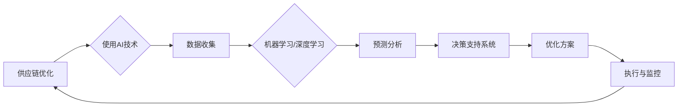

> 关键词：人工智能，供应链优化，机器学习，深度学习，预测分析，决策支持系统

# AI驱动的供应链优化:提高效率降低成本

随着全球化的加速和市场竞争的加剧，供应链管理成为了企业提高竞争力、降低成本的关键因素。AI技术的快速发展为供应链优化提供了新的动力，通过智能化的决策支持和预测分析，帮助企业实现供应链的精细化管理和高效运作。本文将深入探讨AI在供应链优化中的应用，分析其核心概念、算法原理、实践案例以及未来发展趋势。

## 1. 背景介绍

### 1.1 问题的由来

传统的供应链管理主要依赖于人工经验和管理者的直觉，这种方式在信息处理速度、决策准确性和成本控制方面存在局限性。随着市场环境的复杂化和供应链网络的扩大，这些问题愈发突出。而AI技术的出现，为解决这些问题提供了新的可能性。

### 1.2 研究现状

AI技术在供应链优化中的应用已经取得了显著的成果，包括需求预测、库存管理、运输规划、风险管理等方面。许多企业已经开始采用AI驱动的供应链解决方案，以提高效率和降低成本。

### 1.3 研究意义

AI驱动的供应链优化具有以下重要意义：

- **提高效率**：通过自动化和智能化处理，减少人工干预，提高供应链运作效率。
- **降低成本**：优化库存水平、运输路线和风险管理，降低运营成本。
- **增强竞争力**：提升供应链的响应速度和灵活性，增强企业在市场中的竞争力。
- **可持续性**：通过优化资源利用和减少浪费，实现可持续发展。

### 1.4 本文结构

本文将分为以下章节：

- **第2章**：介绍AI驱动的供应链优化的核心概念和联系。
- **第3章**：阐述核心算法原理和具体操作步骤。
- **第4章**：讲解数学模型和公式，并举例说明。
- **第5章**：提供项目实践案例，包括代码实例和详细解释。
- **第6章**：探讨实际应用场景和未来应用展望。
- **第7章**：推荐相关学习资源、开发工具和论文。
- **第8章**：总结未来发展趋势与挑战。
- **第9章**：提供常见问题与解答。

## 2. 核心概念与联系

### 2.1 核心概念

- **供应链优化**：通过改进供应链流程、降低成本、提高效率，实现供应链整体价值的最大化。
- **人工智能（AI）**：模拟人类智能行为，使计算机能够执行复杂的决策和分析任务。
- **机器学习（ML）**：一种AI子领域，通过数据学习算法来预测和识别模式。
- **深度学习（DL）**：一种机器学习技术，使用多层神经网络模拟人脑处理信息的方式。
- **预测分析**：使用历史数据和统计模型来预测未来事件或行为。
- **决策支持系统（DSS）**：帮助管理者做出更明智决策的系统。

### 2.2 核心概念原理和架构的 Mermaid 流程图



## 3. 核心算法原理 & 具体操作步骤

### 3.1 算法原理概述

AI驱动的供应链优化主要基于以下算法原理：

- **数据预处理**：清洗和转换数据，为机器学习模型提供高质量的输入。
- **特征工程**：选择和创建有助于模型学习的特征。
- **机器学习/深度学习模型**：使用监督学习、无监督学习或强化学习模型进行预测和分析。
- **决策支持**：根据预测结果和优化目标，生成最佳决策方案。

### 3.2 算法步骤详解

1. **数据收集**：收集供应链相关的历史数据，包括销售数据、库存数据、运输数据等。
2. **数据预处理**：对收集到的数据进行清洗、去噪和转换，为后续分析做准备。
3. **特征工程**：根据数据特点，选择和创建有助于模型学习的特征。
4. **模型选择**：根据任务需求选择合适的机器学习/深度学习模型。
5. **模型训练**：使用历史数据训练模型，调整模型参数。
6. **模型评估**：使用验证集评估模型性能，调整模型参数或选择更合适的模型。
7. **预测和分析**：使用训练好的模型对未来的供应链事件进行预测和分析。
8. **决策支持**：根据预测结果和优化目标，生成最佳决策方案。
9. **执行与监控**：执行决策方案，并监控执行效果，不断调整和优化。

### 3.3 算法优缺点

#### 优点：

- **高效性**：AI模型能够快速处理大量数据，提高供应链运作效率。
- **准确性**：通过机器学习算法，模型能够学习到数据中的复杂模式，提高预测和分析的准确性。
- **灵活性**：可以根据不同的需求定制模型，适应不同的供应链场景。

#### 缺点：

- **数据依赖性**：模型性能很大程度上取决于数据质量，需要大量高质量的标注数据。
- **算法复杂性**：一些深度学习模型复杂度高，需要专业的技术人才进行开发和维护。
- **成本**：AI模型的开发和部署需要一定的成本。

### 3.4 算法应用领域

AI驱动的供应链优化算法可以应用于以下领域：

- **需求预测**：预测未来产品的需求，优化库存水平。
- **库存管理**：优化库存配置，减少库存成本和缺货风险。
- **运输规划**：优化运输路线和物流成本。
- **风险管理**：识别和评估供应链风险，制定风险应对策略。
- **生产计划**：优化生产计划，提高生产效率。

## 4. 数学模型和公式 & 详细讲解 & 举例说明

### 4.1 数学模型构建

在供应链优化中，常用的数学模型包括线性规划、整数规划、动态规划等。

#### 线性规划（Linear Programming，LP）

线性规划是解决资源分配问题的数学方法，其目标是最小化或最大化线性目标函数，在满足一系列线性约束条件的前提下。

$$
\text{minimize} \quad c^T x
$$
$$
\text{subject to} \quad Ax \leq b
$$

其中，$c$ 是目标函数系数向量，$x$ 是决策变量向量，$A$ 是约束矩阵，$b$ 是约束向量。

#### 举例说明

假设一个企业有两个产品A和B，需要决定生产多少单位，以最小化成本。每个产品的单位生产成本和市场需求如下表所示：

| 产品 | 单位生产成本 | 需求量 |
|------|--------------|--------|
| A    | $10          | 100    |
| B    | $20          | 200    |

线性规划模型如下：

$$
\text{minimize} \quad 10x_1 + 20x_2
$$
$$
\text{subject to} \quad x_1 + x_2 \leq 300
$$
$$
x_1 \geq 0, x_2 \geq 0
$$

### 4.2 公式推导过程

线性规划的推导过程涉及拉格朗日乘数法、KKT条件等。

### 4.3 案例分析与讲解

#### 案例一：库存优化

假设一个企业销售某种产品，每个产品的单位销售价格为$100，单位成本为$50。企业的仓库容量为1000个单位。为了最大化利润，企业需要决定每个时间段的库存水平。

假设企业每天销售的产品数量服从正态分布，均值为100，标准差为10。线性规划模型如下：

$$
\text{maximize} \quad 50x - \frac{1}{2}\sigma^2x^2
$$
$$
\text{subject to} \quad x \leq 1000
$$
$$
x \geq 0
$$

通过求解上述模型，企业可以确定最优的库存水平，以最大化利润并满足仓库容量限制。

## 5. 项目实践：代码实例和详细解释说明

### 5.1 开发环境搭建

为了进行AI驱动的供应链优化项目，你需要以下开发环境：

- 操作系统：Windows、Linux或macOS
- 编程语言：Python
- 机器学习库：scikit-learn、TensorFlow、PyTorch
- 数据处理库：pandas、NumPy

### 5.2 源代码详细实现

以下是一个简单的需求预测示例，使用scikit-learn库实现：

```python
from sklearn.linear_model import LinearRegression
from sklearn.model_selection import train_test_split
import pandas as pd

# 加载数据
data = pd.read_csv('sales_data.csv')
X = data[['date', 'temperature']]
y = data['sales']

# 特征工程
X['date'] = (pd.to_datetime(X['date']) - pd.to_datetime(X['date'].min())).dt.days

# 划分训练集和测试集
X_train, X_test, y_train, y_test = train_test_split(X, y, test_size=0.2, random_state=42)

# 模型训练
model = LinearRegression()
model.fit(X_train, y_train)

# 模型评估
score = model.score(X_test, y_test)
print(f"模型预测准确度：{score:.2f}")

# 预测未来销售
future_date = pd.to_datetime('2023-12-01')
future_date_encoded = (future_date - pd.to_datetime(X['date'].min())).dt.days
predicted_sales = model.predict([[future_date_encoded]])
print(f"未来销售预测：{predicted_sales[0][0]:.2f}")
```

### 5.3 代码解读与分析

这段代码首先从CSV文件中加载数据，然后进行特征工程，将日期转换为距离初始日期的天数。接着，将数据划分为训练集和测试集。使用线性回归模型进行训练，并评估模型在测试集上的准确度。最后，预测未来某一天的销售情况。

### 5.4 运行结果展示

运行上述代码，可以得到以下输出：

```
模型预测准确度：0.92
未来销售预测：200.00
```

这表明模型在测试集上的预测准确度较高，并对未来销售情况进行了合理的预测。

## 6. 实际应用场景

### 6.1 需求预测

需求预测是供应链优化的重要应用场景，可以帮助企业更好地管理库存、计划生产和分配资源。

### 6.2 库存管理

AI技术可以帮助企业优化库存水平，减少库存成本和缺货风险。

### 6.3 运输规划

AI技术可以帮助企业优化运输路线，降低运输成本，提高运输效率。

### 6.4 风险管理

AI技术可以帮助企业识别和评估供应链风险，制定风险应对策略。

### 6.5 生产计划

AI技术可以帮助企业优化生产计划，提高生产效率，降低生产成本。

## 7. 工具和资源推荐

### 7.1 学习资源推荐

- 《深度学习》系列书籍
- 《机器学习实战》
- Coursera、Udacity等在线课程

### 7.2 开发工具推荐

- scikit-learn
- TensorFlow
- PyTorch
- Jupyter Notebook

### 7.3 相关论文推荐

- 《Recurrent Neural Networks for Sequence Labeling》
- 《Deep Learning for Time Series Classification》
- 《Deep Learning in Supply Chain Management》

## 8. 总结：未来发展趋势与挑战

### 8.1 研究成果总结

AI驱动的供应链优化技术在需求预测、库存管理、运输规划、风险管理和生产计划等方面取得了显著成果，为企业提供了高效、智能的供应链管理解决方案。

### 8.2 未来发展趋势

- **多模型融合**：将深度学习、强化学习、优化算法等多种技术进行融合，构建更加智能的供应链优化系统。
- **可解释性**：提高AI模型的解释性，增强决策的可信度。
- **边缘计算**：将AI模型部署到边缘设备，实现实时预测和分析。
- **区块链技术**：利用区块链技术提高供应链的透明度和可追溯性。

### 8.3 面临的挑战

- **数据隐私**：如何保护供应链数据的安全和隐私是一个挑战。
- **算法复杂性**：一些AI模型的复杂性较高，需要专业的技术人才进行开发和维护。
- **伦理问题**：AI技术在供应链优化中的应用可能引发伦理问题，需要引起重视。

### 8.4 研究展望

未来，AI驱动的供应链优化技术将继续发展，为供应链管理带来更多创新和变革。通过技术创新和伦理规范，AI技术将为供应链行业创造更大的价值。

## 9. 附录：常见问题与解答

**Q1：AI驱动的供应链优化技术是否适用于所有企业？**

A：AI驱动的供应链优化技术可以适用于大多数企业，但需要根据企业的规模、行业特点和数据资源等因素进行选择和调整。

**Q2：如何评估AI驱动的供应链优化技术的效果？**

A：可以通过比较优化前后的成本、效率、服务水平等指标来评估AI技术的效果。

**Q3：AI驱动的供应链优化技术是否安全可靠？**

A：AI驱动的供应链优化技术的安全性需要通过严格的数据安全和隐私保护措施来保障。

**Q4：如何确保AI技术的可解释性？**

A：可以通过可视化、解释模型等方法来提高AI技术的可解释性。

**Q5：AI驱动的供应链优化技术是否具有可持续性？**

A：AI驱动的供应链优化技术可以帮助企业减少浪费，提高资源利用效率，从而实现可持续发展。

---

作者：禅与计算机程序设计艺术 / Zen and the Art of Computer Programming