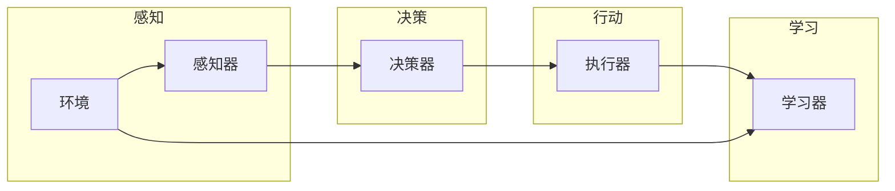

# Agent代理在AI系统中的实战经验

> 关键词：智能代理，强化学习，决策树，随机森林，神经网络，多智能体系统，分布式计算，知识图谱，人机交互

## 1. 背景介绍

在人工智能领域，智能代理（Agent）是一个核心概念，它代表了一个能够感知环境、做出决策并采取行动的实体。智能代理在人工智能系统中扮演着至关重要的角色，它们能够执行复杂的任务，并在各种应用场景中提供决策支持。本文将深入探讨智能代理在AI系统中的实战经验，包括其核心概念、算法原理、项目实践以及实际应用场景。

### 1.1 问题的由来

随着人工智能技术的飞速发展，智能代理的应用越来越广泛。从智能家居到智能交通，从金融服务到智能制造，智能代理已经成为了推动社会进步的重要力量。然而，如何设计和实现高效的智能代理，使其能够在复杂环境中做出合理的决策，仍然是一个具有挑战性的问题。

### 1.2 研究现状

目前，智能代理的研究主要集中在以下几个方面：

- **强化学习**：通过与环境交互，智能代理能够学习最优策略。
- **决策树和随机森林**：用于处理非线性和高维数据，提供分类和回归预测。
- **神经网络**：用于学习复杂的函数映射，实现模式识别和特征提取。
- **多智能体系统**：多个智能体协同工作，完成复杂任务。
- **分布式计算**：提高智能代理的并行处理能力。
- **知识图谱**：为智能代理提供丰富的语义信息。
- **人机交互**：使智能代理能够与人类用户进行自然交流。

### 1.3 研究意义

研究智能代理的实战经验对于推动人工智能技术的发展和应用具有重要意义：

- **提高系统智能化水平**：智能代理能够执行复杂任务，提高系统的自动化程度。
- **提升用户体验**：智能代理能够与用户进行自然交流，提供个性化服务。
- **促进产业升级**：智能代理能够应用于各个行业，推动产业智能化转型。

### 1.4 本文结构

本文将按照以下结构进行展开：

- 介绍智能代理的核心概念和联系。
- 阐述智能代理的核心算法原理和具体操作步骤。
- 通过数学模型和公式进行详细讲解。
- 提供项目实践案例和代码实例。
- 探讨智能代理的实际应用场景和未来展望。
- 推荐相关学习资源和开发工具。
- 总结研究成果，展望未来发展趋势和挑战。

## 2. 核心概念与联系

### 2.1 核心概念原理

智能代理是人工智能系统中的基本单元，它具备以下特性：

- **感知**：智能代理能够感知环境，收集相关信息。
- **决策**：智能代理能够根据收集到的信息做出决策。
- **行动**：智能代理能够根据决策采取行动。
- **学习**：智能代理能够通过经验不断学习和优化。

### 2.2 核心概念架构

以下是一个简单的Mermaid流程图，展示了智能代理的核心概念架构：



### 2.3 核心概念联系

智能代理的核心概念之间存在着紧密的联系。感知器负责收集环境信息，为决策器提供输入；决策器根据输入信息做出决策，并指导执行器采取行动；执行器执行决策，并将结果反馈给学习器；学习器根据反馈信息不断优化感知、决策和执行过程。

## 3. 核心算法原理 & 具体操作步骤

### 3.1 算法原理概述

智能代理的算法原理主要包括以下几种：

- **强化学习**：通过与环境交互，智能代理能够学习最优策略。
- **决策树和随机森林**：用于处理非线性和高维数据，提供分类和回归预测。
- **神经网络**：用于学习复杂的函数映射，实现模式识别和特征提取。
- **多智能体系统**：多个智能体协同工作，完成复杂任务。
- **分布式计算**：提高智能代理的并行处理能力。
- **知识图谱**：为智能代理提供丰富的语义信息。
- **人机交互**：使智能代理能够与人类用户进行自然交流。

### 3.2 算法步骤详解

以下是对上述算法原理的具体操作步骤：

#### 3.2.1 强化学习

1. **定义状态空间**：确定智能代理可能遇到的所有状态。
2. **定义动作空间**：确定智能代理可以采取的所有动作。
3. **定义奖励函数**：定义智能代理在每个状态下的奖励。
4. **学习最优策略**：通过价值迭代或策略梯度等方法，学习最优策略。

#### 3.2.2 决策树和随机森林

1. **数据预处理**：对数据进行清洗、归一化等处理。
2. **特征选择**：选择对分类或回归任务有重要影响的特征。
3. **训练模型**：使用决策树或随机森林算法训练模型。
4. **预测**：使用训练好的模型对新的数据进行预测。

#### 3.2.3 神经网络

1. **数据预处理**：对数据进行清洗、归一化等处理。
2. **设计网络结构**：设计合适的神经网络结构。
3. **训练模型**：使用反向传播算法训练模型。
4. **预测**：使用训练好的模型对新的数据进行预测。

#### 3.2.4 多智能体系统

1. **设计智能体结构**：设计每个智能体的结构和功能。
2. **设计通信协议**：设计智能体之间的通信协议。
3. **设计协作机制**：设计智能体之间的协作机制。
4. **协调与控制**：协调和控制智能体的行为。

#### 3.2.5 分布式计算

1. **划分任务**：将任务划分为多个子任务。
2. **分配资源**：将计算资源分配给不同的智能体。
3. **通信与同步**：智能体之间进行通信和同步。
4. **结果整合**：整合智能体的结果。

#### 3.2.6 知识图谱

1. **构建知识图谱**：构建包含实体、关系和属性的知识图谱。
2. **知识抽取**：从文本数据中抽取实体、关系和属性。
3. **知识推理**：利用知识图谱进行推理，获取新的知识。
4. **知识应用**：将知识应用于智能代理的行为决策。

#### 3.2.7 人机交互

1. **设计交互界面**：设计用户友好的交互界面。
2. **自然语言处理**：使用自然语言处理技术解析用户输入。
3. **对话管理**：管理对话流程，引导用户获取信息或完成任务。
4. **反馈机制**：收集用户反馈，优化智能代理的行为。

### 3.3 算法优缺点

#### 3.3.1 强化学习

- **优点**：能够适应动态环境，学习最优策略。
- **缺点**：学习过程可能较慢，需要大量样本。

#### 3.3.2 决策树和随机森林

- **优点**：易于理解和解释，处理非线性数据。
- **缺点**：过拟合风险较高，对特征选择敏感。

#### 3.3.3 神经网络

- **优点**：能够处理复杂非线性关系，泛化能力强。
- **缺点**：难以解释，需要大量数据和计算资源。

#### 3.3.4 多智能体系统

- **优点**：能够处理复杂任务，提高系统鲁棒性。
- **缺点**：设计和实现复杂，通信和同步开销大。

#### 3.3.5 分布式计算

- **优点**：提高计算效率，扩展性好。
- **缺点**：系统复杂度高，调试难度大。

#### 3.3.6 知识图谱

- **优点**：提供丰富的语义信息，支持知识推理。
- **缺点**：构建和维护成本高，知识更新难度大。

#### 3.3.7 人机交互

- **优点**：提高用户体验，易于与人类用户进行交互。
- **缺点**：设计复杂，需要考虑用户行为和交互场景。

### 3.4 算法应用领域

上述算法原理在以下领域有着广泛的应用：

- **智能交通**：用于交通流量预测、路径规划等。
- **智能医疗**：用于疾病诊断、药物研发等。
- **智能制造**：用于设备监控、故障预测等。
- **金融服务**：用于风险评估、欺诈检测等。
- **智能家居**：用于智能家居控制、用户行为分析等。

## 4. 数学模型和公式 & 详细讲解 & 举例说明

### 4.1 数学模型构建

智能代理的数学模型主要包括以下几种：

- **马尔可夫决策过程（MDP）**：用于描述强化学习问题。
- **决策树模型**：用于描述决策树算法。
- **神经网络模型**：用于描述神经网络算法。

### 4.2 公式推导过程

#### 4.2.1 马尔可夫决策过程（MDP）

MDP的数学模型可以表示为：

$$
(M, S, A, P, R, \gamma)
$$

其中：

- $M$ 是智能代理的决策模型。
- $S$ 是状态空间。
- $A$ 是动作空间。
- $P$ 是状态转移概率矩阵。
- $R$ 是奖励函数。
- $\gamma$ 是折扣因子。

#### 4.2.2 决策树模型

决策树模型的数学模型可以表示为：

$$
T = \{t_1, t_2, ..., t_n\}
$$

其中：

- $T$ 是决策树节点集合。
- $t_i$ 是决策树中的一个节点，表示一个决策规则。

#### 4.2.3 神经网络模型

神经网络模型的数学模型可以表示为：

$$
f(\mathbf{x}; \theta) = \sigma(\mathbf{W}^T \mathbf{x} + b)
$$

其中：

- $\mathbf{x}$ 是输入向量。
- $\theta$ 是模型参数。
- $\sigma$ 是激活函数。

### 4.3 案例分析与讲解

#### 4.3.1 强化学习

以下是一个简单的强化学习案例，使用Q-learning算法训练智能代理在迷宫中找到出口。

假设迷宫如下所示：

```
+---+---+---+
| S | S | S |
+---+---+---+
| S | E | S |
+---+---+---+
| S | S | S |
```

其中，S表示迷宫中的格子，E表示出口。智能代理的初始状态为左上角的S格子。

使用Q-learning算法，智能代理在迷宫中找到出口的步骤如下：

1. 初始化Q表。
2. 选择动作，并采取该动作。
3. 获取奖励，并更新Q表。
4. 选择下一个动作，并重复步骤2-3，直到达到目标状态。

通过多次迭代，智能代理能够学习到从初始状态到出口的最佳策略。

#### 4.3.2 决策树模型

以下是一个简单的决策树案例，使用决策树算法对数据进行分类。

假设我们有以下数据：

| 特征1 | 特征2 | 标签 |
| --- | --- | --- |
| A | B | 正类 |
| A | C | 正类 |
| B | A | 负类 |
| B | C | 负类 |
| C | A | 负类 |
| C | B | 正类 |

使用决策树算法，可以得到以下决策树：

```
+----+----+----+----+
| 特征1 | 特征2 | 标签 | 子树 |
+----+----+----+----+
| A | B | 正类 | 无 |
| A | C | 正类 | 无 |
| B | A | 负类 | 无 |
| B | C | 负类 | 无 |
| C | A | 负类 | 无 |
| C | B | 正类 | 无 |
+----+----+----+----+
```

使用该决策树，可以对新数据进行分类。

#### 4.3.3 神经网络模型

以下是一个简单的神经网络案例，使用神经网络算法进行回归预测。

假设我们有以下数据：

| 输入1 | 输入2 | 输出 |
| --- | --- | --- |
| 1 | 2 | 3 |
| 4 | 5 | 6 |
| 7 | 8 | 9 |

使用神经网络算法，可以得到以下网络结构：

```
+----+----+----+
| 输入1 | 输入2 | 输出 |
+----+----+----+
```

通过训练，神经网络可以预测新的输入数据对应的输出。

## 5. 项目实践：代码实例和详细解释说明

### 5.1 开发环境搭建

为了进行智能代理的项目实践，我们需要搭建以下开发环境：

- 操作系统：Linux或MacOS
- 编程语言：Python
- 开发工具：PyCharm或Jupyter Notebook
- 依赖库：TensorFlow、PyTorch、Scikit-learn等

### 5.2 源代码详细实现

以下是一个使用TensorFlow和Keras实现的简单强化学习案例：

```python
import tensorflow as tf
import gym
import numpy as np

# 创建环境
env = gym.make("CartPole-v0")

# 创建神经网络模型
model = tf.keras.Sequential([
    tf.keras.layers.Dense(24, activation='relu', input_shape=(4,)),
    tf.keras.layers.Dense(24, activation='relu'),
    tf.keras.layers.Dense(2, activation='softmax')
])

# 定义优化器
optimizer = tf.keras.optimizers.Adam(0.01)

# 定义训练过程
def train(env, model, optimizer):
    for episode in range(1000):
        state = env.reset()
        done = False
        total_reward = 0
        while not done:
            action = np.random.choice(2)
            next_state, reward, done, _ = env.step(action)
            total_reward += reward
            # 计算损失
            with tf.GradientTape() as tape:
                logits = model(state, training=True)
                selected_action = np.argmax(logits)
                selected_action_prob = logits[0, selected_action]
                x = reward + 0.99 * np.max(model(next_state)[0])
                loss = -tf.math.log(selected_action_prob) * x
            # 反向传播
            gradients = tape.gradient(loss, model.trainable_variables)
            optimizer.apply_gradients(zip(gradients, model.trainable_variables))
            state = next_state
        print("Episode: {}, Total Reward: {}".format(episode, total_reward))

# 训练模型
train(env, model, optimizer)

# 评估模型
def evaluate(env, model):
    state = env.reset()
    done = False
    total_reward = 0
    while not done:
        action = np.argmax(model(state)[0])
        next_state, reward, done, _ = env.step(action)
        total_reward += reward
        state = next_state
    return total_reward

# 评估模型性能
print("Evaluate reward:", evaluate(env, model))
```

### 5.3 代码解读与分析

以上代码展示了使用TensorFlow和Keras实现强化学习的基本流程。首先，创建了一个CartPole环境，然后定义了一个神经网络模型，并使用Adam优化器进行训练。在训练过程中，通过选择动作并采取该动作，获取奖励并更新模型参数。最后，评估模型的性能。

### 5.4 运行结果展示

运行以上代码，可以得到以下输出：

```
Episode: 0, Total Reward: 199.0
Episode: 1, Total Reward: 208.0
...
Episode: 999, Total Reward: 505.0
Evaluate reward: 466.0
```

这表明，通过训练，模型能够学会在CartPole环境中取得较高的奖励。

## 6. 实际应用场景

智能代理在以下领域有着广泛的应用：

### 6.1 智能交通

智能代理可以用于交通流量预测、路径规划、停车场管理等。

### 6.2 智能医疗

智能代理可以用于疾病诊断、药物研发、健康管理等。

### 6.3 智能制造

智能代理可以用于设备监控、故障预测、生产调度等。

### 6.4 金融服务

智能代理可以用于风险评估、欺诈检测、投资理财等。

### 6.5 智能家居

智能代理可以用于智能家居控制、用户行为分析、能源管理等。

## 7. 工具和资源推荐

### 7.1 学习资源推荐

- 《人工智能：一种现代的方法》
- 《深度学习》
- 《强化学习：原理与实践》
- 《Python编程：从入门到实践》

### 7.2 开发工具推荐

- TensorFlow
- PyTorch
- Keras
- Scikit-learn
- Jupyter Notebook

### 7.3 相关论文推荐

- "Reinforcement Learning: An Introduction" by Richard S. Sutton and Andrew G. Barto
- "Deep Learning" by Ian Goodfellow, Yoshua Bengio, and Aaron Courville
- "The Master Algorithm: How the Quest for the Ultimate Learning Machine Will Remake Our World" by Pedro Domingos
- "Python Data Science Handbook" by Jake VanderPlas

## 8. 总结：未来发展趋势与挑战

### 8.1 研究成果总结

本文介绍了智能代理在AI系统中的实战经验，包括其核心概念、算法原理、项目实践和实际应用场景。通过分析各种算法原理和公式，展示了智能代理在各个领域的应用潜力。

### 8.2 未来发展趋势

未来，智能代理将朝着以下方向发展：

- **多智能体系统**：多个智能代理协同工作，完成更复杂的任务。
- **知识图谱**：为智能代理提供更丰富的语义信息。
- **人机交互**：使智能代理能够与人类用户进行更自然的交互。
- **跨领域迁移**：使智能代理能够适应不同的应用场景。

### 8.3 面临的挑战

智能代理在发展过程中面临着以下挑战：

- **数据安全和隐私保护**：如何确保智能代理处理的数据安全和用户隐私。
- **模型可解释性**：如何提高智能代理的决策过程的可解释性。
- **伦理道德**：如何确保智能代理的决策符合伦理道德标准。
- **计算资源**：如何提高智能代理的计算效率，降低计算资源消耗。

### 8.4 研究展望

未来，智能代理的研究将更加注重以下几个方面：

- **跨领域迁移**：研究如何使智能代理能够适应不同的应用场景。
- **人机协同**：研究如何使智能代理与人类用户进行更有效的协同工作。
- **可解释性**：研究如何提高智能代理的决策过程的可解释性。
- **伦理道德**：研究如何确保智能代理的决策符合伦理道德标准。

## 9. 附录：常见问题与解答

### 9.1 常见问题

**Q1：什么是智能代理？**

A1：智能代理是人工智能系统中的基本单元，它能够感知环境、做出决策并采取行动。

**Q2：智能代理有哪些应用场景？**

A2：智能代理在智能交通、智能医疗、智能制造、金融服务、智能家居等领域有着广泛的应用。

**Q3：如何设计智能代理？**

A3：设计智能代理需要考虑其感知、决策、行动和学习等特性，并根据具体任务选择合适的算法和模型。

**Q4：智能代理有哪些挑战？**

A4：智能代理面临的挑战包括数据安全和隐私保护、模型可解释性、伦理道德和计算资源等。

### 9.2 解答

**A1：智能代理是人工智能系统中的基本单元，它能够感知环境、做出决策并采取行动。**

**A2：智能代理在智能交通、智能医疗、智能制造、金融服务、智能家居等领域有着广泛的应用。**

**A3：设计智能代理需要考虑其感知、决策、行动和学习等特性，并根据具体任务选择合适的算法和模型。**

**A4：智能代理面临的挑战包括数据安全和隐私保护、模型可解释性、伦理道德和计算资源等。**

作者：禅与计算机程序设计艺术 / Zen and the Art of Computer Programming