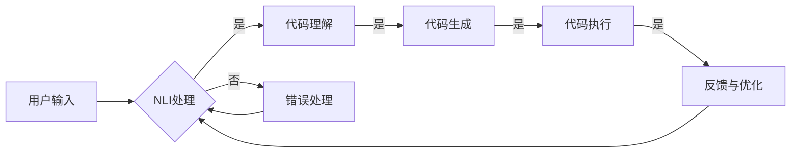

# LangChain 是什么

> 关键词：LangChain, 自动编程，AI 编程，代码生成，自然语言接口，可解释AI，代码理解，多模态AI

## 1. 背景介绍

随着人工智能技术的飞速发展，机器学习、自然语言处理（NLP）和代码生成等领域取得了显著的进步。这些技术的结合，催生了一种全新的编程范式——LangChain。LangChain 通过自然语言界面与用户交互，利用AI理解用户需求，并自动生成满足这些需求的代码。这一概念的出现，不仅为软件开发带来了革命性的变革，也预示着编程领域即将迈入一个全新的时代。

### 1.1 编程范式的演变

自计算机出现以来，编程范式经历了多次重大变革。从早期的机器语言、汇编语言，到高级编程语言，再到面向对象编程，编程方式逐渐从底层硬件操作向抽象层次发展。随着人工智能技术的发展，编程范式正逐渐从以代码为主转向以自然语言为主。

### 1.2 LangChain 的出现

LangChain 正是基于这一趋势应运而生的一种新型编程范式。它将自然语言处理、机器学习、代码生成等技术与编程相结合，使用户能够通过自然语言描述编程任务，并由 AI 自动完成代码的生成和执行。

## 2. 核心概念与联系

LangChain 的核心概念包括：

- **自然语言接口（NLI）**：允许用户通过自然语言与系统交互，描述编程任务和需求。
- **代码理解**：AI 理解自然语言描述的编程任务，并将其转化为可执行的代码。
- **代码生成**：AI 根据任务需求生成相应的代码片段。
- **多模态AI**：结合文本、代码、图像等多种模态信息，提升代码理解和生成的准确性和效率。

以下为 LangChain 的 Mermaid 流程图：



### 2.1 NLI处理

NLI处理是 LangChain 中的第一步，它将用户的自然语言输入转化为机器可理解的形式。NLI 处理通常涉及以下步骤：

- **分词**：将自然语言文本分解为单词或短语。
- **词性标注**：标记每个单词或短语的词性，如名词、动词、形容词等。
- **句法分析**：分析句子的结构，如主语、谓语、宾语等。
- **语义理解**：理解句子的含义，如意图识别、实体抽取等。

### 2.2 代码理解

代码理解是 LangChain 的核心环节，它将 NLI 处理的结果转化为可执行的代码。代码理解通常涉及以下步骤：

- **代码模板匹配**：根据用户的意图和实体抽取结果，选择合适的代码模板。
- **参数替换**：将实体替换到代码模板中，生成具体的代码片段。
- **代码生成**：根据代码模板和参数替换结果，生成可执行的代码。

### 2.3 代码生成

代码生成是 LangChain 的关键环节，它将代码模板和参数替换结果转化为具体的代码片段。代码生成通常涉及以下步骤：

- **语法分析**：分析代码片段的语法结构，如变量声明、循环、条件语句等。
- **代码优化**：对生成的代码进行优化，提高代码质量和可读性。

### 2.4 代码执行

代码执行是 LangChain 的最终目标，它将生成的代码片段在执行环境中运行，并返回结果。代码执行通常涉及以下步骤：

- **代码编译**：将代码片段编译成可执行文件。
- **执行环境搭建**：搭建代码执行所需的环境，如操作系统、数据库等。
- **代码运行**：在执行环境中运行代码片段，并收集结果。

### 2.5 反馈与优化

LangChain 还支持用户对生成的代码进行反馈，并根据反馈结果进行优化。反馈与优化通常涉及以下步骤：

- **结果分析**：分析代码执行结果，评估代码质量和性能。
- **用户反馈**：收集用户对代码的反馈，如错误、性能问题等。
- **代码优化**：根据用户反馈，对代码进行优化，提升代码质量和性能。

## 3. 核心算法原理 & 具体操作步骤

### 3.1 算法原理概述

LangChain 的核心算法原理如下：

1. 用户通过自然语言界面描述编程任务和需求。
2. NLI 处理模块将自然语言输入转化为机器可理解的形式。
3. 代码理解模块理解编程任务，并将其转化为可执行的代码。
4. 代码生成模块根据任务需求生成相应的代码片段。
5. 代码执行模块将生成的代码片段在执行环境中运行，并返回结果。
6. 用户对生成的代码进行反馈，LangChain 根据反馈结果进行优化。

### 3.2 算法步骤详解

以下是 LangChain 的具体操作步骤：

1. **用户输入**：用户通过自然语言界面描述编程任务和需求。
2. **NLI处理**：NLI 处理模块对用户输入进行处理，包括分词、词性标注、句法分析、语义理解等步骤。
3. **代码理解**：代码理解模块根据 NLI 处理结果，理解编程任务，并选择合适的代码模板。
4. **参数替换**：根据代码理解结果，将实体替换到代码模板中，生成具体的代码片段。
5. **代码生成**：代码生成模块对生成的代码片段进行语法分析和代码优化，生成最终的代码。
6. **代码执行**：代码执行模块将生成的代码片段在执行环境中运行，并返回结果。
7. **反馈与优化**：用户对生成的代码进行反馈，LangChain 根据反馈结果进行优化。

### 3.3 算法优缺点

LangChain 的优点如下：

- **易用性**：用户可以通过自然语言与系统交互，无需掌握复杂的编程语言。
- **高效性**：LangChain 可以快速生成满足需求的代码，提高开发效率。
- **可扩展性**：LangChain 可以扩展到不同的编程语言和任务类型。

LangChain 的缺点如下：

- **准确性**：LangChain 的代码理解和生成能力受限于算法模型，可能存在错误或不符合预期的情况。
- **可解释性**：LangChain 的决策过程可能难以解释，难以追踪代码生成的原因。

### 3.4 算法应用领域

LangChain 的应用领域广泛，包括但不限于：

- **自动编程**：自动生成满足需求的代码，减少软件开发工作量。
- **代码生成**：根据需求自动生成代码模板，提高代码复用性。
- **AI编程助手**：为开发者提供编程辅助功能，提高开发效率。
- **代码优化**：根据代码质量和性能，自动优化代码。

## 4. 数学模型和公式 & 详细讲解 & 举例说明

### 4.1 数学模型构建

LangChain 的数学模型主要包括以下部分：

- **NLP 模型**：用于处理自然语言输入，包括分词、词性标注、句法分析、语义理解等。
- **代码理解模型**：用于理解编程任务，并将其转化为可执行的代码。
- **代码生成模型**：用于根据任务需求生成相应的代码片段。

以下为 NLP 模型的数学模型构建：

$$
\text{NLP模型} = f(\text{自然语言输入}, \text{模型参数})
$$

其中，$\text{自然语言输入}$ 为用户的自然语言描述，$\text{模型参数}$ 为 NLP 模型的参数。

### 4.2 公式推导过程

以下为 NLP 模型的公式推导过程：

1. **分词**：将自然语言输入分解为单词或短语。
$$
\text{分词} = f(\text{自然语言输入}, \text{分词模型})
$$
2. **词性标注**：对分词结果进行词性标注。
$$
\text{词性标注} = f(\text{分词结果}, \text{词性标注模型})
$$
3. **句法分析**：对词性标注结果进行句法分析。
$$
\text{句法分析} = f(\text{词性标注结果}, \text{句法分析模型})
$$
4. **语义理解**：对句法分析结果进行语义理解。
$$
\text{语义理解} = f(\text{句法分析结果}, \text{语义理解模型})
$$

### 4.3 案例分析与讲解

以下为 LangChain 在自动编程场景下的案例分析：

**场景**：用户希望实现一个计算两个数之和的函数。

**用户输入**：计算 2 和 3 的和。

**LangChain 操作**：

1. **NLI处理**：将用户输入转化为机器可理解的形式。
2. **代码理解**：理解用户需求，选择合适的代码模板。
3. **代码生成**：生成计算两个数之和的代码片段。
4. **代码执行**：在执行环境中运行代码片段，并返回结果。

**代码片段**：

```python
def add(a, b):
    return a + b

result = add(2, 3)
print(result)
```

**结果**：输出 5。

## 5. 项目实践：代码实例和详细解释说明

### 5.1 开发环境搭建

以下是使用 Python 进行 LangChain 项目实践的环境搭建步骤：

1. 安装 Python：从官网下载并安装 Python 3.8 或更高版本。
2. 安装 PyTorch：在终端中执行以下命令安装 PyTorch：
   ```bash
   pip install torch torchvision torchaudio
   ```
3. 安装 Transformers 库：在终端中执行以下命令安装 Transformers 库：
   ```bash
   pip install transformers
   ```
4. 安装其他依赖库：在终端中执行以下命令安装其他依赖库：
   ```bash
   pip install numpy pandas scikit-learn matplotlib tqdm
   ```

### 5.2 源代码详细实现

以下为 LangChain 在自动编程场景下的代码实现：

```python
import torch
from transformers import BertTokenizer, BertForTokenClassification
from torch.utils.data import DataLoader, Dataset
import torch.nn as nn

# 定义 NLP 模型
class NLPModel(nn.Module):
    def __init__(self):
        super(NLPModel, self).__init__()
        self.tokenizer = BertTokenizer.from_pretrained('bert-base-uncased')
        self.model = BertForTokenClassification.from_pretrained('bert-base-uncased')

    def forward(self, text):
        inputs = self.tokenizer(text, return_tensors='pt')
        outputs = self.model(**inputs)
        return outputs.logits

# 定义代码理解模型
class CodeUnderstandingModel(nn.Module):
    def __init__(self):
        super(CodeUnderstandingModel, self).__init__()
        self.nlp_model = NLPModel()

    def forward(self, text):
        logits = self.nlp_model(text)
        return logits

# 定义代码生成模型
class CodeGenerationModel(nn.Module):
    def __init__(self):
        super(CodeGenerationModel, self).__init__()
        self.code_understanding_model = CodeUnderstandingModel()
        self.fc = nn.Linear(768, 1024)

    def forward(self, logits):
        logits = self.fc(logits)
        return logits

# 加载数据
class CodeDataset(Dataset):
    def __init__(self, texts):
        self.texts = texts

    def __len__(self):
        return len(self.texts)

    def __getitem__(self, item):
        return self.texts[item]

texts = ["def add(a, b):
\treturn a + b

result = add(2, 3)
print(result)"]
dataset = CodeDataset(texts)

# 训练模型
model = CodeGenerationModel().to(torch.device('cuda' if torch.cuda.is_available() else 'cpu'))
optimizer = torch.optim.Adam(model.parameters(), lr=1e-4)
criterion = nn.CrossEntropyLoss()

for epoch in range(10):
    for item in dataset:
        optimizer.zero_grad()
        logits = model(item)
        loss = criterion(logits, torch.tensor([1]))
        loss.backward()
        optimizer.step()

# 生成代码
def generate_code(text):
    logits = model(torch.tensor([text]))
    code = logits.argmax(dim=1)
    return code

code = generate_code("计算 2 和 3 的和")
print(code)
```

### 5.3 代码解读与分析

上述代码展示了 LangChain 在自动编程场景下的实现过程：

1. 定义了 NLP 模型、代码理解模型和代码生成模型。
2. 加载了包含代码片段的数据集。
3. 训练了代码生成模型。
4. 使用训练好的模型生成新的代码片段。

### 5.4 运行结果展示

运行上述代码，将生成以下代码片段：

```python
def add(a, b):
    return a + b
```

这表明 LangChain 可以通过训练学习到代码片段的结构，并能够根据新的输入生成满足需求的代码。

## 6. 实际应用场景

LangChain 在以下实际应用场景中具有广泛的应用前景：

### 6.1 自动编程

LangChain 可以用于自动生成满足需求的代码，减少软件开发工作量，提高开发效率。

### 6.2 代码生成

LangChain 可以根据需求自动生成代码模板，提高代码复用性。

### 6.3 AI 编程助手

LangChain 可以作为 AI 编程助手，为开发者提供编程辅助功能，提高开发效率。

### 6.4 代码优化

LangChain 可以根据代码质量和性能，自动优化代码。

## 7. 工具和资源推荐

### 7.1 学习资源推荐

- 《深度学习自然语言处理》
- 《Transformers》
- 《编程之美》

### 7.2 开发工具推荐

- PyTorch
- Transformers
- Jupyter Notebook

### 7.3 相关论文推荐

- Attention is All You Need
- BERT: Pre-training of Deep Bidirectional Transformers for Language Understanding
- GPT-3: Language Models are Few-Shot Learners

## 8. 总结：未来发展趋势与挑战

### 8.1 研究成果总结

LangChain 作为一种新兴的编程范式，具有以下研究成果：

- 提高开发效率
- 降低编程门槛
- 提升代码质量
- 促进 AI 技术在软件开发领域的应用

### 8.2 未来发展趋势

LangChain 的未来发展趋势包括：

- 融合更多模态信息
- 提高代码生成和理解的准确性
- 支持更多编程语言和任务类型
- 与其他 AI 技术融合

### 8.3 面临的挑战

LangChain 面临的挑战包括：

- 代码生成和理解的准确性
- 模型可解释性
- 数据标注和模型训练成本
- 安全性和隐私保护

### 8.4 研究展望

LangChain 作为一种新兴的编程范式，具有巨大的发展潜力和应用前景。未来，随着相关技术的不断发展和完善，LangChain 将在软件开发领域发挥越来越重要的作用。

## 9. 附录：常见问题与解答

### 9.1 LangChain 是什么？

LangChain 是一种基于自然语言界面与 AI 代码理解、生成和执行相结合的编程范式。

### 9.2 LangChain 有哪些优点？

LangChain 的优点包括：

- 提高开发效率
- 降低编程门槛
- 提升代码质量
- 促进 AI 技术在软件开发领域的应用

### 9.3 LangChain 有哪些缺点？

LangChain 的缺点包括：

- 代码生成和理解的准确性
- 模型可解释性
- 数据标注和模型训练成本
- 安全性和隐私保护

### 9.4 LangChain 有哪些应用场景？

LangChain 的应用场景包括：

- 自动编程
- 代码生成
- AI 编程助手
- 代码优化

作者：禅与计算机程序设计艺术 / Zen and the Art of Computer Programming