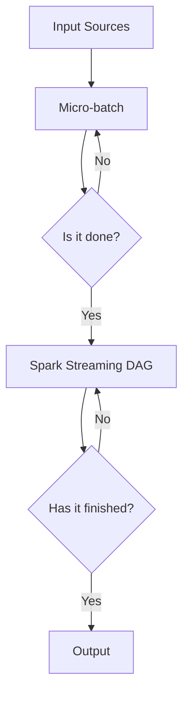

# Spark Streaming 原理与代码实例讲解

> 关键词：Spark Streaming, 实时计算, 微批处理, 流式数据处理, 持续集成, 智能数据分析

## 1. 背景介绍

随着互联网和物联网的快速发展，数据量呈爆炸式增长，传统的批处理数据处理方式已经无法满足对实时数据处理的需求。Spark Streaming作为Apache Spark生态系统的一部分，提供了高吞吐量和低延迟的实时数据流处理能力，成为了处理实时数据流的事实标准。

### 1.1 问题的由来

实时数据处理的需求主要来源于以下几个方面：

- **社交媒体分析**：实时监控社交媒体平台上的用户行为和舆情动态。
- **股票交易**：实时分析股票市场数据，进行风险评估和交易决策。
- **日志收集**：实时处理和分析服务器日志，实现故障诊断和性能监控。
- **广告投放**：实时分析用户行为，实现精准广告投放。

传统的批处理数据处理方式在处理实时数据时存在以下问题：

- **延迟高**：批处理作业通常需要等待数据积累到一定程度后才能处理，导致延迟高。
- **扩展性差**：批处理作业的扩展性较差，难以应对大规模数据流。
- **实时性差**：无法实时处理和分析数据，无法满足实时性要求。

### 1.2 研究现状

Apache Spark Streaming是基于Spark构建的实时数据流处理框架，它提供了丰富的API，可以轻松地将Spark的原生功能应用于实时数据处理，如批处理、机器学习、图处理等。

### 1.3 研究意义

Spark Streaming的出现，使得实时数据处理变得更加简单和高效。它不仅继承了Spark的强大功能，还具有以下优势：

- **高吞吐量**：Spark Streaming可以处理每秒数百万条消息。
- **低延迟**：Spark Streaming的平均延迟在100毫秒左右。
- **可伸缩性**：Spark Streaming可以无缝地扩展到数千台机器。
- **易于集成**：Spark Streaming可以与Spark的批处理、机器学习等组件无缝集成。

### 1.4 本文结构

本文将分为以下几个部分：

- **2. 核心概念与联系**：介绍Spark Streaming的核心概念和相关技术。
- **3. 核心算法原理 & 具体操作步骤**：讲解Spark Streaming的算法原理和操作步骤。
- **4. 数学模型和公式 & 详细讲解 & 举例说明**：介绍Spark Streaming的数学模型和公式，并通过实例进行讲解。
- **5. 项目实践：代码实例和详细解释说明**：给出Spark Streaming的代码实例，并进行详细解释和分析。
- **6. 实际应用场景**：介绍Spark Streaming的实际应用场景。
- **7. 工具和资源推荐**：推荐学习资源、开发工具和相关论文。
- **8. 总结：未来发展趋势与挑战**：总结Spark Streaming的发展趋势和挑战。
- **9. 附录：常见问题与解答**：解答常见问题。

## 2. 核心概念与联系

### 2.1 核心概念

- **实时数据流**：指以固定时间间隔（如每秒、每分钟）产生的大量数据。
- **微批处理**：将实时数据流划分为更小的批次进行处理的策略。
- **DAG（有向无环图）**：Spark Streaming使用DAG来表示数据处理流程。
- **RDD（弹性分布式数据集）**：Spark Streaming使用RDD作为数据结构来存储和处理数据。

### 2.2 架构流程图



## 3. 核心算法原理 & 具体操作步骤

### 3.1 算法原理概述

Spark Streaming使用微批处理的方式处理实时数据流。首先，从数据源（如Kafka、Flume等）收集数据，然后将其划分成多个微批次进行处理。每个微批次由RDD表示，可以像处理静态数据集一样进行转换操作。

### 3.2 算法步骤详解

1. **初始化Spark Streaming**：创建一个SparkContext，配置Spark Streaming的运行参数。
2. **创建输入源**：从数据源读取数据，创建DStream（Discretized Stream）。
3. **转换DStream**：对DStream进行转换操作，如map、flatMap、filter等。
4. **输出DStream**：将处理后的数据输出到目标系统，如文件系统、数据库等。
5. **启动Spark Streaming**：启动Spark Streaming的流式处理流程。

### 3.3 算法优缺点

#### 优点

- **高吞吐量**：Spark Streaming可以处理每秒数百万条消息。
- **低延迟**：Spark Streaming的平均延迟在100毫秒左右。
- **可伸缩性**：Spark Streaming可以无缝地扩展到数千台机器。
- **易于集成**：Spark Streaming可以与Spark的批处理、机器学习等组件无缝集成。

#### 缺点

- **资源消耗**：Spark Streaming需要大量的计算和存储资源。
- **复杂度**：Spark Streaming的配置和调优比较复杂。

### 3.4 算法应用领域

- **实时数据分析**：实时分析用户行为、市场趋势等。
- **实时监控**：实时监控服务器日志、网络流量等。
- **实时推荐**：根据用户行为实时推荐商品或内容。

## 4. 数学模型和公式 & 详细讲解 & 举例说明

### 4.1 数学模型构建

Spark Streaming使用DAG来表示数据处理流程。DAG由节点和边组成，节点代表数据处理操作，边代表数据的流向。

### 4.2 公式推导过程

Spark Streaming的微批处理过程可以通过以下公式表示：

$$
D_{t+1} = T(D_t)
$$

其中，$D_t$ 表示第t个微批次，$T$ 表示数据处理操作。

### 4.3 案例分析与讲解

假设我们要计算每分钟点击量，可以使用以下代码：

```python
from pyspark.streaming import StreamingContext

# 初始化StreamingContext
ssc = StreamingContext(sc, 1)

# 创建输入源
dstream = ssc.socketTextStream("localhost", 9999)

# 转换DStream
counts = dstream.map(lambda x: (x.split()[1], 1)).reduceByKey(lambda a, b: a + b)

# 输出DStream
counts.pprint()

# 启动Spark Streaming
ssc.start()
ssc.awaitTermination()
```

## 5. 项目实践：代码实例和详细解释说明

### 5.1 开发环境搭建

在开始项目实践之前，需要搭建以下开发环境：

- Java开发环境
- Scala开发环境
- PySpark开发环境
- Spark集群

### 5.2 源代码详细实现

以下是一个简单的Spark Streaming示例，用于实时计算每分钟点击量：

```python
from pyspark.streaming import StreamingContext

# 初始化StreamingContext
ssc = StreamingContext(sc, 1)

# 创建输入源
dstream = ssc.socketTextStream("localhost", 9999)

# 转换DStream
counts = dstream.map(lambda x: (x.split()[1], 1)).reduceByKey(lambda a, b: a + b)

# 输出DStream
counts.pprint()

# 启动Spark Streaming
ssc.start()
ssc.awaitTermination()
```

### 5.3 代码解读与分析

- `StreamingContext`：创建StreamingContext对象，配置Spark Streaming的运行参数。
- `socketTextStream`：从指定的端口读取文本数据。
- `map`：对DStream中的每个元素进行转换操作。
- `reduceByKey`：将相同键的值进行合并。
- `print`：打印输出结果。
- `start`：启动Spark Streaming。
- `awaitTermination`：等待Spark Streaming结束。

### 5.4 运行结果展示

运行以上代码后，可以在控制台看到实时计算的每分钟点击量。

## 6. 实际应用场景

### 6.1 实时数据分析

Spark Streaming可以用于实时数据分析，例如：

- 实时监控用户行为，分析用户喜好。
- 实时分析市场趋势，进行风险评估。
- 实时分析社交媒体数据，监控舆情动态。

### 6.2 实时监控

Spark Streaming可以用于实时监控，例如：

- 实时监控服务器日志，进行故障诊断和性能监控。
- 实时监控网络流量，进行网络安全分析。
- 实时监控数据库性能，进行性能优化。

### 6.3 实时推荐

Spark Streaming可以用于实时推荐，例如：

- 根据用户行为实时推荐商品或内容。
- 根据用户画像实时推荐个性化广告。
- 根据用户搜索历史实时推荐相关搜索结果。

## 7. 工具和资源推荐

### 7.1 学习资源推荐

- [Apache Spark官方文档](https://spark.apache.org/docs/latest/)
- [Spark Streaming官方文档](https://spark.apache.org/docs/latest/streaming/)
- [《Spark Streaming实战》](https://www.manning.com/books/the-definitive-guide-to-apache-spark-streaming)

### 7.2 开发工具推荐

- IntelliJ IDEA
- Eclipse
- PyCharm

### 7.3 相关论文推荐

- [Spark Streaming: High-Throughput, Low-Latency Streaming Systems](https://spark.apache.org/docs/latest/streaming/)
- [Discretized Streams: Dataflow Processing at Scale](https://www.research.google.com/pubs/pub36358.html)

## 8. 总结：未来发展趋势与挑战

### 8.1 研究成果总结

Spark Streaming作为实时数据处理领域的佼佼者，已经取得了显著的研究成果。它不仅提供了高吞吐量和低延迟的实时数据处理能力，还具有可伸缩性和易于集成等特点。

### 8.2 未来发展趋势

- **更高吞吐量**：随着计算能力的提升，Spark Streaming的吞吐量将会进一步提高。
- **更低延迟**：通过优化算法和硬件加速，Spark Streaming的延迟将会进一步降低。
- **更易用性**：Spark Streaming的API将会更加友好，易于使用。

### 8.3 面临的挑战

- **资源消耗**：Spark Streaming需要大量的计算和存储资源。
- **复杂度**：Spark Streaming的配置和调优比较复杂。
- **数据安全**：实时数据处理过程中，数据安全是一个重要的问题。

### 8.4 研究展望

未来，Spark Streaming将会在以下几个方面进行研究和改进：

- **资源优化**：降低Spark Streaming的资源消耗。
- **易用性提升**：提高Spark Streaming的易用性。
- **数据安全**：加强Spark Streaming的数据安全保障。

## 9. 附录：常见问题与解答

**Q1：Spark Streaming和Storm、Flink相比，有哪些优缺点？**

A: Spark Streaming、Storm和Flink都是用于实时数据处理的开源框架。它们之间的优缺点如下：

- **Spark Streaming**：优点是易于使用，与Spark生态系统集成良好，缺点是资源消耗较高。
- **Storm**：优点是延迟低，缺点是可伸缩性较差。
- **Flink**：优点是资源消耗较低，可伸缩性好，缺点是学习曲线较陡峭。

**Q2：Spark Streaming的微批处理如何影响性能？**

A: 微批处理是一种折衷方案，它在延迟和资源消耗之间进行了平衡。较小的批处理可以降低延迟，但会增加资源消耗；较大的批处理可以降低资源消耗，但会增加延迟。

**Q3：Spark Streaming如何进行性能调优？**

A: Spark Streaming的性能调优可以从以下几个方面进行：

- **资源配置**：合理配置Spark集群的节点数量、内存大小和核心数。
- **批处理大小**：选择合适的批处理大小，平衡延迟和资源消耗。
- **并行度**：适当提高并行度，提高处理速度。

**Q4：Spark Streaming如何保证数据一致性？**

A: Spark Streaming使用消息队列（如Kafka）作为数据源，可以保证数据的一致性。在消息队列中，每条消息都会被赋予一个唯一的偏移量，Spark Streaming会按照偏移量顺序处理消息，保证数据的一致性。

**Q5：Spark Streaming如何处理异常情况？**

A: Spark Streaming可以使用以下方法处理异常情况：

- **重试**：在处理过程中遇到异常时，可以尝试重新处理。
- **死信队列**：将无法处理的异常消息放入死信队列，由人工进行处理。
- **容错机制**：Spark Streaming提供了容错机制，可以在节点故障时自动恢复处理流程。

作者：禅与计算机程序设计艺术 / Zen and the Art of Computer Programming