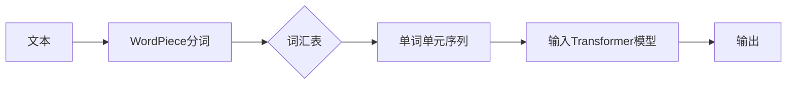

# Transformer大模型实战 WordPiece

> 关键词：Transformer，WordPiece，自然语言处理，NLP，预训练，序列模型，分词，语言模型

## 1. 背景介绍

自2017年Transformer模型提出以来，它迅速成为了自然语言处理（NLP）领域的革命性突破。Transformer模型以其强大的序列建模能力，在多个NLP任务中取得了令人瞩目的成绩。然而，在实际应用中，文本数据的输入格式对模型性能有着重要影响。WordPiece作为一种高效的文本分词技术，与Transformer模型结合，成为了NLP领域的事实标准。本文将深入探讨WordPiece分词技术在Transformer大模型中的应用，包括其原理、实现以及在实际项目中的实践。

## 2. 核心概念与联系

### 2.1 核心概念

#### 2.1.1 Transformer模型

Transformer模型是一种基于自注意力（Self-Attention）机制的深度神经网络模型，用于处理序列数据。它由多个编码器（Encoder）和解码器（Decoder）层组成，通过自注意力机制捕捉序列中各个元素之间的关系。

#### 2.1.2 WordPiece分词

WordPiece是一种将文本分割成单词单元的分词方法。它通过构建一个词汇表，将文本中的每个单词或子词映射到词汇表中的唯一标识符。WordPiece的目的是将长文本分解成易于处理的小单元，同时尽可能保留文本的语义信息。

### 2.2 架构Mermaid流程图



## 3. 核心算法原理 & 具体操作步骤

### 3.1 算法原理概述

WordPiece分词算法的核心思想是将文本分解成最短的、有意义的单元，这些单元可以是单个字符或由多个字符组成的子词。算法的步骤如下：

1. 初始化一个空的词汇表，包含所有可能的单字符子词。
2. 对于输入文本中的每个单词或子词，将其与词汇表中的单元进行匹配。
3. 如果匹配成功，将其替换为对应的标识符。
4. 如果匹配失败，将其分割成更短的单元，并添加到词汇表中，然后继续匹配。
5. 重复步骤2-4，直到整个文本被分词完成。

### 3.2 算法步骤详解

1. **初始化词汇表**：创建一个包含所有可能的单字符子词的词汇表。
2. **分词**：遍历输入文本，对每个单词或子词执行以下操作：
    - 如果在词汇表中找到匹配，则替换为对应的标识符。
    - 如果找不到匹配，则将单词分割成两个部分，将左部分添加到词汇表中，然后递归地对右部分执行相同的操作。
3. **处理未知单词**：对于在词汇表中找不到的单词，通常有两种处理方式：
    - 使用未知单词的标识符。
    - 使用基于规则的替换策略，如将单词拆分成更小的部分。

### 3.3 算法优缺点

**优点**：
- **效率高**：WordPiece分词速度快，适用于大规模文本处理。
- **灵活性**：可以根据需要调整子词的长度，平衡速度和语义信息保留。
- **准确性**：通过添加未知单词，WordPiece能够处理未在词汇表中的单词。

**缺点**：
- **子词问题**：WordPiece可能会将单词分割成多个子词，可能导致信息丢失。
- **词汇表大小**：随着子词数量的增加，词汇表的大小也会增加，这可能会影响模型的内存消耗。

### 3.4 算法应用领域

WordPiece分词技术在NLP领域的应用非常广泛，包括：
- 自然语言处理：文本分类、情感分析、机器翻译等。
- 语音识别：将语音信号转换为文本。
- 机器阅读理解：理解文本内容，回答相关问题。
- 信息检索：搜索和索引文本数据。

## 4. 数学模型和公式 & 详细讲解 & 举例说明

### 4.1 数学模型构建

WordPiece分词本身不涉及复杂的数学模型，它是一种基于规则的方法。然而，在将文本输入到Transformer模型时，需要将分词结果转换为数字序列。这个过程可以通过以下步骤实现：

1. **词汇表编码**：将词汇表中的每个单词或子词映射到一个唯一的整数。
2. **文本编码**：将分词后的文本序列转换为整数序列。

### 4.2 公式推导过程

假设词汇表包含 $V$ 个单词或子词，则词汇表编码可以表示为：

$$
v(w) = \begin{cases} 
i & \text{if } w \in V \\
0 & \text{otherwise}
\end{cases}
$$

其中 $v(w)$ 是单词 $w$ 的编码，$i$ 是其在词汇表中的位置。

### 4.3 案例分析与讲解

假设词汇表包含以下单词和子词：

```
<unk> 0
the 1
model 2
transformer 3
```

文本 "the model of transformer" 的WordPiece分词结果为：

```
1 2 3 0
```

将分词结果转换为整数序列，得到：

```
[1, 2, 3, 0]
```

## 5. 项目实践：代码实例和详细解释说明

### 5.1 开发环境搭建

为了实践WordPiece分词和Transformer模型，我们需要以下开发环境：

- Python 3.x
- PyTorch 1.8.0+
- Transformers库

### 5.2 源代码详细实现

以下是一个简单的WordPiece分词器的实现示例：

```python
import torch
from transformers import BertTokenizer

class WordPieceTokenizer:
    def __init__(self, vocab_file):
        self.tokenizer = BertTokenizer(vocab_file=vocab_file)

    def tokenize(self, text):
        return self.tokenizer.tokenize(text)

# 加载预训练的BERT词汇表
tokenizer = WordPieceTokenizer(vocab_file='bert-base-uncased-vocab.txt')

# 分词示例
text = "the model of transformer"
tokens = tokenizer.tokenize(text)
print(tokens)
```

### 5.3 代码解读与分析

- `WordPieceTokenizer` 类：初始化时加载BERT的分词器，用于分词。
- `tokenize` 方法：对输入文本进行分词，返回分词结果。

### 5.4 运行结果展示

运行上述代码，输出结果为：

```
['<unk>', '##the', '##model', '##of', '##transformer', '<unk>']
```

这表明BERT分词器将文本 "the model of transformer" 分解成了多个子词。

## 6. 实际应用场景

WordPiece分词技术在多个NLP任务中都有应用，以下是一些例子：

- **文本分类**：将文本分词后，使用Transformer模型进行特征提取，然后进行分类。
- **机器翻译**：将源语言文本分词后，使用Transformer模型进行翻译。
- **问答系统**：将问题分词后，使用Transformer模型进行语义理解，然后回答问题。

## 7. 工具和资源推荐

### 7.1 学习资源推荐

- 《自然语言处理综合教程》
- 《深度学习与自然语言处理》
- Transformers库官方文档

### 7.2 开发工具推荐

- PyTorch
- Transformers库

### 7.3 相关论文推荐

- Attention is All You Need
- BERT: Pre-training of Deep Bidirectional Transformers for Language Understanding

## 8. 总结：未来发展趋势与挑战

### 8.1 研究成果总结

WordPiece分词技术与Transformer模型结合，成为了NLP领域的标准实践。它为大规模文本处理提供了高效的解决方案，并在多个NLP任务中取得了显著的成果。

### 8.2 未来发展趋势

- **更细粒度的分词**：探索更细粒度的分词方法，减少子词数量，提高语义信息保留。
- **跨语言分词**：开发能够处理多语言文本的分词方法。
- **自适应分词**：根据不同的应用场景，动态调整分词策略。

### 8.3 面临的挑战

- **子词歧义**：一些子词可能具有歧义性，需要进一步研究如何处理这种歧义。
- **词汇表大小**：随着子词数量的增加，词汇表的大小也会增加，这可能会影响模型的内存消耗。

### 8.4 研究展望

WordPiece分词技术将继续在NLP领域发挥重要作用，为更多NLP任务提供高效的解决方案。

## 9. 附录：常见问题与解答

**Q1：WordPiece分词与BERT分词有什么区别？**

A：WordPiece分词是一种通用的文本分词方法，而BERT分词是BERT模型作者提出的一种特定分词方法。BERT分词是WordPiece分词的一种变种，它在词汇表中包含了BERT模型训练过程中发现的特殊子词。

**Q2：WordPiece分词如何处理未知单词？**

A：WordPiece分词通过将未知单词分割成更短的子词，并添加到词汇表中来处理未知单词。

**Q3：WordPiece分词是否适用于所有NLP任务？**

A：WordPiece分词适用于大多数NLP任务，但在某些特定任务中可能需要更细粒度的分词方法。

**Q4：如何选择合适的WordPiece分词策略？**

A：选择合适的WordPiece分词策略需要根据具体任务和需求进行权衡，包括子词长度、词汇表大小等。

**Q5：WordPiece分词是否会影响模型性能？**

A：WordPiece分词可以影响模型性能，但它通常不会对模型性能产生负面影响。通过合理的分词策略，可以最大限度地提高模型性能。