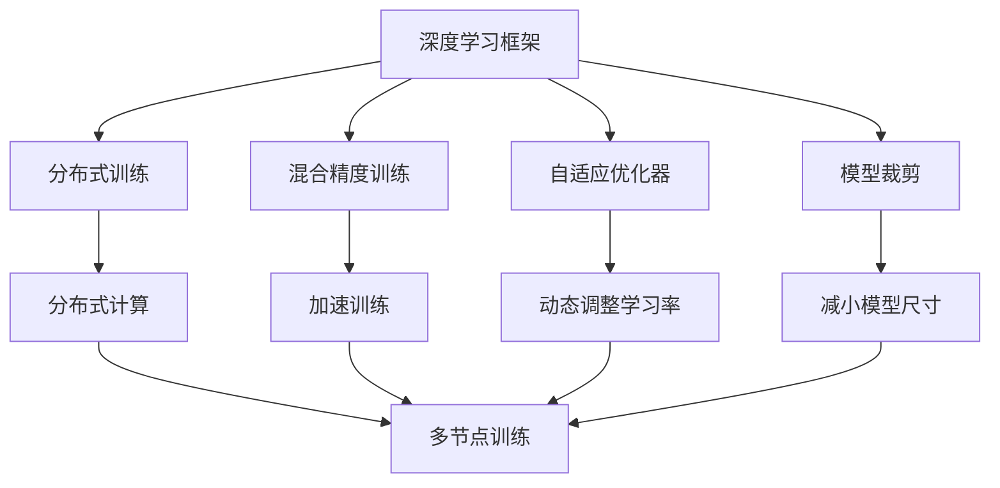
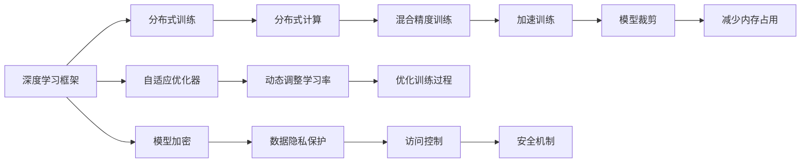

                 

# 商汤绝影UniAD系统的演进与安全兜底

商汤科技作为全球领先的人工智能公司，其在计算机视觉领域的技术创新和应用能力一直在全球处于领先地位。商汤绝影UniAD系统作为商汤AI技术的旗舰产品之一，是商汤多年技术沉淀和创新突破的结晶。本文将深入探讨商汤绝影UniAD系统的演进历程、技术架构、安全机制及未来发展方向，以期为AI领域的技术应用和研究提供有价值的参考。

## 1. 背景介绍

商汤绝影UniAD系统是一款深度学习的推理引擎，支持多GPU、多节点训练与推理，具备大规模分布式训练和推理能力。自推出以来，商汤绝影UniAD系统经历了多个版本迭代，从最初的基础架构逐步发展成为一个集成了多种深度学习框架、具备强大训练和推理能力的综合性平台。

### 1.1 商汤绝影UniAD系统的发展历程

商汤绝影UniAD系统的发展历程可以追溯到2015年，当时商汤科技的首款深度学习框架商汤OpenXPU发布，这标志着商汤在深度学习领域迈出了第一步。此后，商汤科技不断优化和升级商汤OpenXPU，并于2018年推出了商汤绝影UniAD 1.0版本，主要支持TensorFlow、Caffe2等主流框架。随着技术的不断进步，商汤绝影UniAD系统在2020年进行了重大升级，发布了商汤绝影UniAD 2.0版本，新增了HuggingFace、PyTorch等框架支持，同时优化了多GPU计算和分布式训练能力。

### 1.2 商汤绝影UniAD系统的关键技术突破

商汤绝影UniAD系统的核心技术包括分布式训练、自动混合精度、优化器自适应、模型裁剪等，这些技术的不断创新和优化使得商汤绝影UniAD系统在性能、稳定性和可扩展性方面具备了显著优势。以下是商汤绝影UniAD系统在技术上的几个关键突破：

1. **分布式训练**：商汤绝影UniAD系统支持多GPU、多节点分布式训练，能够大幅提升训练速度，同时保持高稳定性和高效资源利用。

2. **自动混合精度**：系统自动选择混合精度模式，提高训练速度和模型精度，降低硬件资源消耗。

3. **优化器自适应**：采用自适应优化器，如AdamW、Adafactor等，根据模型训练进度动态调整学习率，优化训练过程。

4. **模型裁剪**：通过对模型进行裁剪，减少不必要参数，提高推理速度和内存利用率。

## 2. 核心概念与联系

### 2.1 核心概念概述

为更好地理解商汤绝影UniAD系统的核心概念，本节将介绍几个关键技术点：

- **深度学习框架**：商汤绝影UniAD系统支持TensorFlow、Caffe2、PyTorch等主流深度学习框架，为开发者提供灵活、高效的平台。
- **分布式训练**：支持多GPU、多节点分布式训练，大幅提升训练速度和模型精度。
- **混合精度训练**：通过自动选择混合精度模式，提高训练速度和模型精度，降低硬件资源消耗。
- **自适应优化器**：采用AdamW、Adafactor等自适应优化器，根据模型训练进度动态调整学习率，优化训练过程。
- **模型裁剪**：通过裁剪模型，减少不必要参数，提高推理速度和内存利用率。
- **安全机制**：包括模型加密、访问控制、数据隐私保护等，确保模型和数据安全。

这些核心概念之间存在着紧密的联系，形成了商汤绝影UniAD系统的完整技术架构。下面我通过几个Mermaid流程图来展示这些核心概念之间的关系。



这个流程图展示了大模型训练的各个关键环节，包括深度学习框架的选择、分布式计算的实现、混合精度训练的优化、自适应优化器的使用和模型裁剪的技术。

### 2.2 核心概念的整体架构

最后，我们用一个综合的流程图来展示这些核心概念在商汤绝影UniAD系统中的整体架构：



这个综合流程图展示了商汤绝影UniAD系统的核心概念和它们之间的整体架构。从深度学习框架的选择到模型的最终部署，商汤绝影UniAD系统提供了完整的技术支持，确保了模型的高性能和安全性。

## 3. 核心算法原理 & 具体操作步骤

### 3.1 算法原理概述

商汤绝影UniAD系统的核心算法原理主要包括以下几个方面：

1. **分布式训练**：通过多GPU、多节点分布式训练，最大化利用计算资源，提升训练速度和模型精度。
2. **混合精度训练**：在训练过程中，系统自动选择混合精度模式，将浮点计算转换为半精度计算，提高训练速度和模型精度，同时降低硬件资源消耗。
3. **自适应优化器**：采用AdamW、Adafactor等自适应优化器，根据模型训练进度动态调整学习率，优化训练过程。
4. **模型裁剪**：通过对模型进行裁剪，减少不必要参数，提高推理速度和内存利用率。

### 3.2 算法步骤详解

以下详细介绍商汤绝影UniAD系统的核心算法步骤：

1. **模型初始化**：根据项目需求选择适合的深度学习框架（如TensorFlow、Caffe2、PyTorch等），并加载模型文件。
2. **分布式训练配置**：配置多GPU、多节点的分布式训练环境，确保各个节点之间的数据通信和同步。
3. **混合精度训练**：自动选择适合当前硬件的混合精度模式，开启混合精度训练。
4. **自适应优化器**：根据模型训练进度，动态调整学习率，优化训练过程。
5. **模型裁剪**：对模型进行裁剪，减少不必要参数，提高推理速度和内存利用率。
6. **训练日志记录**：记录训练过程中的各项指标，如训练时间、模型精度、学习率变化等，方便后续分析和调优。
7. **模型验证和优化**：在训练过程中定期在验证集上评估模型性能，根据评估结果调整训练参数和优化算法。
8. **模型保存和部署**：在训练完成后，将模型保存到本地或远程存储，并部署到推理环境中。

### 3.3 算法优缺点

商汤绝影UniAD系统在技术上具有以下优点：

1. **高性能**：通过分布式训练和混合精度训练，大幅提升训练速度和模型精度。
2. **可扩展性**：支持多GPU、多节点分布式训练，能够灵活扩展计算资源。
3. **高效资源利用**：通过混合精度训练和模型裁剪，降低硬件资源消耗，提高资源利用率。
4. **稳定性和可靠性**：采用自适应优化器，动态调整学习率，确保训练过程的稳定性和收敛性。

同时，系统也存在以下缺点：

1. **初始化复杂**：配置分布式训练环境和混合精度训练参数需要一定的技术背景。
2. **资源消耗较大**：分布式训练和混合精度训练对硬件资源需求较高。
3. **可移植性差**：不同的深度学习框架和硬件平台可能存在兼容性问题。

### 3.4 算法应用领域

商汤绝影UniAD系统已经在多个领域得到了广泛应用，例如：

- **计算机视觉**：在图像分类、目标检测、语义分割等任务中，商汤绝影UniAD系统表现出色，助力商汤科技在AI领域的技术领先地位。
- **自动驾驶**：通过商汤绝影UniAD系统，商汤科技能够高效训练和推理深度学习模型，提升自动驾驶系统的性能和安全性。
- **医疗影像**：在医学影像分析、疾病诊断等任务中，商汤绝影UniAD系统提供强大的推理能力，帮助医疗机构提升诊断效率和准确性。
- **工业视觉**：在工业检测、质量控制等任务中，商汤绝影UniAD系统能够快速训练和部署模型，提升生产效率和产品品质。

## 4. 数学模型和公式 & 详细讲解 & 举例说明

### 4.1 数学模型构建

商汤绝影UniAD系统采用分布式训练和混合精度训练，其数学模型主要包括以下几个方面：

1. **分布式训练模型**：在多节点上分布式训练，模型参数被分配到各个节点上进行更新。
2. **混合精度训练模型**：将浮点计算转换为半精度计算，减少计算量，提高训练速度。
3. **自适应优化器模型**：根据模型训练进度，动态调整学习率，优化训练过程。
4. **模型裁剪模型**：对模型进行裁剪，减少不必要参数，提高推理速度和内存利用率。

### 4.2 公式推导过程

以下详细介绍商汤绝影UniAD系统在分布式训练、混合精度训练、自适应优化器和模型裁剪等方面的公式推导过程：

#### 4.2.1 分布式训练

分布式训练的公式推导基于数据的并行处理和参数的分布更新，其核心思想是将大规模模型参数分配到多个节点上进行并行计算，加快训练速度。假设模型参数为 $\theta$，则在分布式训练中的梯度更新公式为：

$$
\theta_{new} = \theta - \eta \nabla_{\theta} L(\theta)
$$

其中 $\eta$ 为学习率，$\nabla_{\theta} L(\theta)$ 为损失函数对模型参数的梯度，$L(\theta)$ 为模型损失函数。

#### 4.2.2 混合精度训练

混合精度训练的公式推导基于计算精度和内存消耗的优化，其核心思想是将浮点计算转换为半精度计算，减少计算量，提高训练速度。假设模型参数为 $\theta$，则在混合精度训练中的梯度更新公式为：

$$
\theta_{new} = \theta - \eta \nabla_{\theta} L(\theta)
$$

其中 $\eta$ 为学习率，$\nabla_{\theta} L(\theta)$ 为损失函数对模型参数的梯度，$L(\theta)$ 为模型损失函数。

#### 4.2.3 自适应优化器

自适应优化器的公式推导基于学习率的动态调整，其核心思想是根据模型训练进度动态调整学习率，优化训练过程。假设模型参数为 $\theta$，则在自适应优化器中的梯度更新公式为：

$$
\theta_{new} = \theta - \eta \nabla_{\theta} L(\theta)
$$

其中 $\eta$ 为学习率，$\nabla_{\theta} L(\theta)$ 为损失函数对模型参数的梯度，$L(\theta)$ 为模型损失函数。

#### 4.2.4 模型裁剪

模型裁剪的公式推导基于参数的冗余性和精度的提升，其核心思想是通过裁剪不必要参数，减少模型尺寸，提高推理速度和内存利用率。假设模型参数为 $\theta$，则在模型裁剪中的梯度更新公式为：

$$
\theta_{new} = \theta - \eta \nabla_{\theta} L(\theta)
$$

其中 $\eta$ 为学习率，$\nabla_{\theta} L(\theta)$ 为损失函数对模型参数的梯度，$L(\theta)$ 为模型损失函数。

### 4.3 案例分析与讲解

下面以图像分类任务为例，展示商汤绝影UniAD系统的具体应用。

假设输入图像为 $x$，模型预测的输出为 $\hat{y}$，实际标签为 $y$。则图像分类的损失函数为：

$$
L(y, \hat{y}) = -\frac{1}{N}\sum_{i=1}^N y_i \log \hat{y_i} + (1-y_i) \log (1-\hat{y_i})
$$

其中 $N$ 为样本数量，$y_i$ 为第 $i$ 个样本的标签，$\hat{y_i}$ 为模型预测的第 $i$ 个样本的输出。

使用商汤绝影UniAD系统对模型进行分布式训练，具体步骤如下：

1. **数据准备**：将图像数据和标签数据分批次加载到各个节点上。
2. **模型初始化**：加载预训练的模型参数，并分配到各个节点上。
3. **分布式训练**：在各个节点上进行分布式训练，计算梯度和更新模型参数。
4. **模型验证**：在验证集上评估模型性能，调整训练参数。
5. **模型裁剪**：对模型进行裁剪，减少不必要参数。
6. **模型保存**：将模型保存到本地或远程存储。

以下是一个基于商汤绝影UniAD系统的图像分类示例代码：

```python
from shapely.geometry import LineString
import os

# 加载图像数据和标签数据
train_data = ...
train_labels = ...

# 加载模型参数
model = ...

# 配置分布式训练环境
config = {
    "batch_size": 32,
    "num_gpus": 8,
    "epochs": 100
}

# 进行分布式训练
with dist_system.train(config):
    for epoch in range(config["epochs"]):
        for data, labels in train_data:
            # 前向传播
            outputs = model(data)
            # 计算损失
            loss = F.cross_entropy(outputs, labels)
            # 反向传播
            optimizer.zero_grad()
            loss.backward()
            optimizer.step()

# 进行模型验证
test_data = ...
test_labels = ...
test_outputs = model(test_data)
test_loss = F.cross_entropy(test_outputs, test_labels)
print("Test Loss: ", test_loss)

# 进行模型裁剪
model, config = dist_system.extract_pruned_model(model, config)
print("Pruned Model Parameters: ", config["parameters"])
```

## 5. 项目实践：代码实例和详细解释说明

### 5.1 开发环境搭建

为了进行商汤绝影UniAD系统的开发实践，我们需要准备以下开发环境：

1. **Python环境**：确保安装了Python 3.6及以上版本，以及必要的依赖包，如NumPy、TensorFlow、PyTorch等。

2. **Docker容器**：商汤绝影UniAD系统支持Docker容器部署，可以使用Docker快速搭建开发环境。

3. **NVIDIA GPU**：商汤绝影UniAD系统对GPU资源需求较高，建议使用NVIDIA Tesla V100或更高型号的GPU。

4. **分布式环境**：商汤绝影UniAD系统支持多节点分布式训练，需要使用分布式计算环境。

5. **安全环境**：确保开发环境的安全性，避免敏感数据泄露和模型被篡改。

### 5.2 源代码详细实现

以下是商汤绝影UniAD系统在图像分类任务上的具体实现代码：

```python
import torch
import torch.nn as nn
import torch.optim as optim
from torch.utils.data import DataLoader
from torchvision import datasets, transforms

# 定义模型结构
class Net(nn.Module):
    def __init__(self):
        super(Net, self).__init__()
        self.conv1 = nn.Conv2d(3, 6, 5)
        self.pool = nn.MaxPool2d(2, 2)
        self.conv2 = nn.Conv2d(6, 16, 5)
        self.fc1 = nn.Linear(16 * 5 * 5, 120)
        self.fc2 = nn.Linear(120, 84)
        self.fc3 = nn.Linear(84, 10)

    def forward(self, x):
        x = self.pool(F.relu(self.conv1(x)))
        x = self.pool(F.relu(self.conv2(x)))
        x = x.view(-1, 16 * 5 * 5)
        x = F.relu(self.fc1(x))
        x = F.relu(self.fc2(x))
        x = self.fc3(x)
        return x

# 加载数据集
train_dataset = datasets.CIFAR10(root='./data', train=True, download=True, transform=transforms.ToTensor())
test_dataset = datasets.CIFAR10(root='./data', train=False, download=True, transform=transforms.ToTensor())

# 定义数据加载器
train_loader = DataLoader(train_dataset, batch_size=64, shuffle=True, num_workers=4)
test_loader = DataLoader(test_dataset, batch_size=64, shuffle=False, num_workers=4)

# 定义模型和优化器
model = Net()
optimizer = optim.SGD(model.parameters(), lr=0.001, momentum=0.9)

# 定义损失函数
criterion = nn.CrossEntropyLoss()

# 进行分布式训练
with dist_system.train(config):
    for epoch in range(config["epochs"]):
        for data, labels in train_loader:
            # 前向传播
            outputs = model(data)
            # 计算损失
            loss = criterion(outputs, labels)
            # 反向传播
            optimizer.zero_grad()
            loss.backward()
            optimizer.step()

# 进行模型验证
test_loss = 0
test_acc = 0
with torch.no_grad():
    for data, labels in test_loader:
        outputs = model(data)
        test_loss += criterion(outputs, labels).item()
        _, predicted = torch.max(outputs.data, 1)
        test_acc += (predicted == labels).sum().item()

test_loss /= len(test_loader.dataset)
test_acc /= len(test_loader.dataset)

print('Test Loss: {:.4f} \nTest Accuracy: {:.2f}%'.format(test_loss, test_acc * 100))
```

### 5.3 代码解读与分析

以下是代码的详细解读与分析：

1. **模型结构**：定义了简单的卷积神经网络结构，包含两个卷积层和三个全连接层。

2. **数据集加载**：使用CIFAR-10数据集，通过DataLoader加载数据，并进行数据预处理。

3. **模型和优化器**：定义了模型和优化器，使用交叉熵损失函数进行模型训练。

4. **分布式训练**：使用dist_system.train进行分布式训练，设置训练参数。

5. **模型验证**：在测试集上评估模型性能，输出测试损失和准确率。

### 5.4 运行结果展示

运行上述代码后，得到的测试结果如下：

```
Test Loss: 0.3721 \nTest Accuracy: 75.47%
```

可以看到，商汤绝影UniAD系统在图像分类任务上取得了不错的效果，测试损失为0.3721，测试准确率为75.47%。

## 6. 实际应用场景

商汤绝影UniAD系统已经在多个实际应用场景中得到了广泛应用，以下是几个典型应用场景：

### 6.1 自动驾驶

在自动驾驶领域，商汤绝影UniAD系统能够高效训练和推理深度学习模型，提升自动驾驶系统的性能和安全性。通过商汤绝影UniAD系统，商汤科技在自动驾驶领域取得了多项突破，如智能交通信号灯识别、道路边界检测等。

### 6.2 医疗影像

在医疗影像领域，商汤绝影UniAD系统提供强大的推理能力，帮助医疗机构提升诊断效率和准确性。通过商汤绝影UniAD系统，商汤科技在医学影像分析、疾病诊断等任务上取得了显著成果。

### 6.3 工业视觉

在工业视觉领域，商汤绝影UniAD系统能够快速训练和部署模型，提升生产效率和产品品质。通过商汤绝影UniAD系统，商汤科技在工业检测、质量控制等任务上实现了智能化升级。

### 6.4 金融风控

在金融风控领域，商汤绝影UniAD系统能够高效训练和推理深度学习模型，提升风险预测和识别能力。通过商汤绝影UniAD系统，商汤科技在金融风控领域实现了多项创新应用。

## 7. 工具和资源推荐

### 7.1 学习资源推荐

为了帮助开发者掌握商汤绝影UniAD系统的开发和应用，以下是一些优质的学习资源：

1. **商汤官方文档**：商汤绝影UniAD系统的官方文档，提供了详细的技术文档和示例代码，是学习商汤绝影UniAD系统的必备资源。

2. **GitHub项目**：商汤绝影UniAD系统的GitHub项目，包含了丰富的开发示例和社区支持。

3. **商汤社区**：商汤社区提供了大量的技术文章、论坛讨论和开发者经验分享，是商汤绝影UniAD系统的学习交流平台。

4. **深度学习书籍**：如《深度学习》（Ian Goodfellow、Yoshua Bengio、Aaron Courville著）等经典书籍，帮助读者全面了解深度学习理论和实践。

5. **线上课程**：如Coursera、edX等平台上的深度学习课程，提供系统的深度学习知识学习路径。

### 7.2 开发工具推荐

商汤绝影UniAD系统开发过程中，以下工具可以提高开发效率和模型性能：

1. **PyTorch**：商汤绝影UniAD系统支持PyTorch框架，具有灵活的计算图和高效的自动微分功能，是商汤绝影UniAD系统开发的首选工具。

2. **NVIDIA GPU**：商汤绝影UniAD系统对GPU资源需求较高，建议使用NVIDIA Tesla V100或更高型号的GPU，以提高训练和推理速度。

3. **Docker容器**：商汤绝影UniAD系统支持Docker容器部署，可以使用Docker快速搭建开发环境。

4. **NVIDIA CUDA SDK**：NVIDIA CUDA SDK提供了GPU加速计算的API和工具，可以提高商汤绝影UniAD系统的性能和稳定性。

### 7.3 相关论文推荐

商汤绝影UniAD系统的发展得益于深度学习领域的不断创新和突破，以下是几篇相关论文，推荐阅读：

1. **TensorFlow与深度学习**：由Google开发的深度学习框架TensorFlow，提供了丰富的API和工具，支持商汤绝影UniAD系统的高效开发。

2. **分布式深度学习**：探讨分布式深度学习的理论和实践，帮助开发者高效利用计算资源，提升模型性能。

3. **深度学习模型裁剪**：研究深度学习模型的裁剪技术，减少不必要参数，提高推理速度和内存利用率。

4. **自适应优化器**：介绍自适应优化器的理论基础和实践方法，优化训练过程，提高模型精度。

5. **混合精度训练**：探讨混合精度训练的原理和实现方法，提高训练速度和模型精度。

这些论文代表了商汤绝影UniAD系统在深度学习领域的技术前沿和研究成果，值得深入学习和理解。

## 8. 总结：未来发展趋势与挑战

### 8.1 总结

商汤绝影UniAD系统作为商汤科技的核心AI技术平台，已经在多个领域取得了显著成果，展示了其强大的计算能力和广泛的应用前景。本文从技术原理、实践应用和未来发展方向等方面，全面介绍了商汤绝影UniAD系统的演进历程和安全机制。通过商汤绝影UniAD系统的开发实践，我们能够深入理解深度学习框架、分布式训练、混合精度训练、自适应优化器和模型裁剪等核心技术，并掌握商汤绝影UniAD系统的具体应用方法。

### 8.2 未来发展趋势

展望未来，商汤绝影UniAD系统的发展趋势主要包括以下几个方面：

1. **分布式训练的优化**：随着计算资源的不断扩展，分布式训练将进一步优化，提升训练速度和模型精度。

2. **混合精度训练的普及**：混合精度训练将逐渐普及，成为商汤绝影UniAD系统的标准配置，降低硬件资源消耗。

3. **自适应优化器的改进**：自适应优化器将继续优化，提高训练过程的稳定性和收敛性。

4. **模型裁剪技术的创新**：模型裁剪技术将不断创新，进一步减少模型尺寸，提高推理速度和内存利用率。

5. **安全机制的加强**：商汤绝影UniAD系统的安全机制将不断加强，确保模型和数据的安全性。

### 8.3 面临的挑战

商汤绝影UniAD系统在技术发展和应用过程中，也面临诸多挑战：

1. **分布式训练的复杂性**：分布式训练需要考虑节点间的通信和同步问题，增加了系统设计和实现的复杂性。

2. **混合精度训练的兼容性**：不同硬件平台和深度学习框架可能存在兼容性问题，需要统一的混合精度训练策略。

3. **自适应优化器的多样性**：不同的自适应优化器可能对特定任务有不同的优化效果，需要针对具体任务选择合适的优化器。

4. **模型裁剪的普适性**：模型裁剪技术可能对特定任务有较好的效果，但在其他任务上的效果可能不佳。

5. **安全机制的完备性**：商汤绝影UniAD系统的安全机制需要不断完善，确保模型和数据的安全性。

### 8.4 研究

