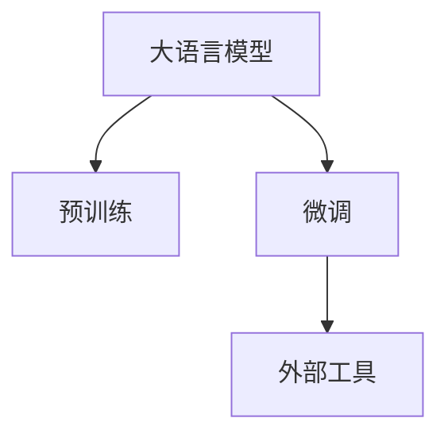

                 

# 大语言模型应用指南：为什么需要外部工具

## 1. 背景介绍

在人工智能（AI）的迅猛发展中，大语言模型（Large Language Model, LLM）因其卓越的自然语言处理能力而备受瞩目。从GPT系列、BERT到XLNet、T5，一系列的语言模型展示了其在文本分类、命名实体识别、问答系统、机器翻译等任务上的卓越性能。然而，尽管这些模型已经展现了强大的能力，但在实际应用中，仍需依赖大量的外部工具进行配置、训练和优化。本文将探讨大语言模型应用过程中对外部工具的依赖，并分析这些工具的重要性和应用场景。

## 2. 核心概念与联系

### 2.1 核心概念概述

在大语言模型的应用过程中，涉及的核心概念包括：

- **大语言模型**：以自回归或自编码模型为代表的大规模预训练语言模型，如GPT、BERT等。这些模型通过在大规模无标签文本语料上进行预训练，学习到丰富的语言知识和常识。
- **预训练**：指在大规模无标签文本语料上，通过自监督学习任务训练通用语言模型的过程。常见的预训练任务包括言语建模、遮挡语言模型等。
- **微调**：在预训练模型的基础上，使用下游任务的少量标注数据，通过有监督学习优化模型在特定任务上的性能。通常只需调整顶层分类器或解码器，并以较小的学习率更新全部或部分的模型参数。
- **外部工具**：指在大语言模型应用过程中，用于数据处理、模型训练、模型评估和模型部署等环节的工具。

这些概念通过逻辑结构图可以表示为：



### 2.2 概念间的关系

大语言模型的应用过程中，这些概念之间存在紧密的联系。预训练提供了模型的基础能力，而微调则是在此基础上针对具体任务进行优化。外部工具则在整个应用过程中扮演关键角色，帮助实现模型的训练、评估和部署。

#### 2.2.1 数据处理工具

数据处理是应用大语言模型前的关键步骤。这些工具包括：

- **分词器**：将文本分割成单词或子词，如Word2Vec、BERT分词器。
- **数据清洗器**：去除文本中的噪声和无用信息，如Punctuation Cleaner、NLP Toolkit。
- **数据增强器**：通过改写、回译等方式扩充训练集，如BackTranslation、SMART。

#### 2.2.2 模型训练工具

模型训练工具帮助实现模型的微调过程。这些工具包括：

- **深度学习框架**：如TensorFlow、PyTorch、MXNet，提供高效的计算图和自动微分功能。
- **优化器**：如Adam、SGD、Adagrad，优化模型参数更新过程。
- **损失函数**：如交叉熵损失、均方误差损失，评估模型性能。

#### 2.2.3 模型评估工具

模型评估工具用于验证模型在特定任务上的性能。这些工具包括：

- **评估指标**：如精确率、召回率、F1分数，用于评估模型输出质量。
- **可视化工具**：如TensorBoard、Weights & Biases，实时监控模型训练状态。

#### 2.2.4 模型部署工具

模型部署工具帮助将训练好的模型集成到实际应用系统中。这些工具包括：

- **模型服务器**：如TensorFlow Serving、Amazon SageMaker，提供高效的模型推理服务。
- **API接口**：如FastAPI、Flask，用于构建API接口，方便外部系统调用。
- **监控系统**：如Prometheus、Grafana，监控模型服务器的运行状态。

## 3. 核心算法原理 & 具体操作步骤

### 3.1 算法原理概述

基于监督学习的大语言模型微调方法，本质上是一个有监督的细粒度迁移学习过程。其核心思想是：将预训练的大语言模型视作一个强大的"特征提取器"，通过在下游任务的少量标注数据上进行有监督的微调，使得模型输出能够匹配任务标签，从而获得针对特定任务优化的模型。

具体而言，微调过程分为以下几个步骤：

1. **准备预训练模型和数据集**：选择合适的预训练模型和标注数据集。
2. **添加任务适配层**：根据任务类型，设计合适的输出层和损失函数。
3. **设置微调超参数**：选择合适的优化算法、学习率、批大小、迭代轮数等。
4. **执行梯度训练**：前向传播计算损失函数，反向传播更新模型参数。
5. **测试和部署**：在测试集上评估模型性能，将模型部署到实际应用系统中。

### 3.2 算法步骤详解

#### 3.2.1 准备预训练模型和数据集

假设我们使用BERT作为预训练模型，进行命名实体识别（Named Entity Recognition, NER）任务的微调。首先，需要准备一个包含标注的NER数据集，将其划分为训练集、验证集和测试集。

#### 3.2.2 添加任务适配层

根据任务类型，在BERT顶层添加一个线性分类器。对于NER任务，分类器输出一个向量，表示每个token属于某个实体的概率。同时，采用交叉熵损失函数作为训练目标。

#### 3.2.3 设置微调超参数

选择AdamW优化器，设置学习率为2e-5。设置正则化技术，如L2正则、Dropout。

#### 3.2.4 执行梯度训练

使用训练集数据进行批量训练，每批次64个样本。前向传播计算损失函数，反向传播更新模型参数。验证集上每5轮迭代评估一次模型性能。

#### 3.2.5 测试和部署

在测试集上评估模型性能，输出分类报告。使用FastAPI构建API接口，部署到AWS服务器上，提供模型推理服务。

### 3.3 算法优缺点

基于监督学习的大语言模型微调方法具有以下优点：

- **简单高效**：只需少量标注数据，快速适应特定任务。
- **通用适用**：适用于各种NLP任务，如分类、匹配、生成等。
- **参数高效**：利用参数高效微调技术，减少需优化的参数，提高微调效率。

同时，该方法也存在以下缺点：

- **依赖标注数据**：微调效果很大程度上取决于标注数据的质量和数量。
- **迁移能力有限**：当目标任务与预训练数据的分布差异较大时，微调的性能提升有限。
- **负面效果传递**：预训练模型的固有偏见、有害信息可能通过微调传递到下游任务，产生负面影响。

## 4. 数学模型和公式 & 详细讲解

### 4.1 数学模型构建

假设预训练模型为 $M_{\theta}$，下游任务为NER，训练集为 $D=\{(x_i,y_i)\}_{i=1}^N$，其中 $x_i$ 为输入文本，$y_i$ 为标注实体。

定义模型 $M_{\theta}$ 在数据样本 $(x,y)$ 上的损失函数为 $\ell(M_{\theta}(x),y)$。则在数据集 $D$ 上的经验风险为：

$$
\mathcal{L}(\theta) = \frac{1}{N}\sum_{i=1}^N \ell(M_{\theta}(x_i),y_i)
$$

微调的优化目标是最小化经验风险，即找到最优参数：

$$
\theta^* = \mathop{\arg\min}_{\theta} \mathcal{L}(\theta)
$$

在实践中，我们通常使用基于梯度的优化算法（如SGD、Adam等）来近似求解上述最优化问题。设 $\eta$ 为学习率，$\lambda$ 为正则化系数，则参数的更新公式为：

$$
\theta \leftarrow \theta - \eta \nabla_{\theta}\mathcal{L}(\theta) - \eta\lambda\theta
$$

其中 $\nabla_{\theta}\mathcal{L}(\theta)$ 为损失函数对参数 $\theta$ 的梯度，可通过反向传播算法高效计算。

### 4.2 公式推导过程

以二分类任务为例，推导交叉熵损失函数及其梯度的计算公式。

假设模型 $M_{\theta}$ 在输入 $x$ 上的输出为 $\hat{y}=M_{\theta}(x) \in [0,1]$，表示样本属于正类的概率。真实标签 $y \in \{0,1\}$。则二分类交叉熵损失函数定义为：

$$
\ell(M_{\theta}(x),y) = -[y\log \hat{y} + (1-y)\log (1-\hat{y})]
$$

将其代入经验风险公式，得：

$$
\mathcal{L}(\theta) = -\frac{1}{N}\sum_{i=1}^N [y_i\log M_{\theta}(x_i)+(1-y_i)\log(1-M_{\theta}(x_i))]
$$

根据链式法则，损失函数对参数 $\theta_k$ 的梯度为：

$$
\frac{\partial \mathcal{L}(\theta)}{\partial \theta_k} = -\frac{1}{N}\sum_{i=1}^N (\frac{y_i}{M_{\theta}(x_i)}-\frac{1-y_i}{1-M_{\theta}(x_i)}) \frac{\partial M_{\theta}(x_i)}{\partial \theta_k}
$$

其中 $\frac{\partial M_{\theta}(x_i)}{\partial \theta_k}$ 可进一步递归展开，利用自动微分技术完成计算。

### 4.3 案例分析与讲解

在实践中，使用PyTorch和HuggingFace的Transformers库进行BERT微调。代码如下：

```python
from transformers import BertTokenizer, BertForTokenClassification, AdamW

tokenizer = BertTokenizer.from_pretrained('bert-base-cased')
model = BertForTokenClassification.from_pretrained('bert-base-cased', num_labels=len(tag2id))

optimizer = AdamW(model.parameters(), lr=2e-5)
```

其中，`bert-base-cased`是预训练模型，`num_labels`是分类器的输出维度，`tag2id`是标签与数字id的映射。

## 5. 项目实践：代码实例和详细解释说明

### 5.1 开发环境搭建

在搭建开发环境时，需要确保以下几点：

1. 安装Anaconda，创建虚拟环境。
2. 安装PyTorch和HuggingFace Transformers库。
3. 准备预训练模型和标注数据集。

### 5.2 源代码详细实现

使用Python和PyTorch实现BERT微调，代码如下：

```python
from transformers import BertTokenizer, BertForTokenClassification, AdamW
import torch
from torch.utils.data import Dataset, DataLoader

class NERDataset(Dataset):
    def __init__(self, texts, tags, tokenizer):
        self.texts = texts
        self.tags = tags
        self.tokenizer = tokenizer
        self.max_len = 128
        
    def __len__(self):
        return len(self.texts)
    
    def __getitem__(self, item):
        text = self.texts[item]
        tags = self.tags[item]
        
        encoding = self.tokenizer(text, return_tensors='pt', max_length=self.max_len, padding='max_length', truncation=True)
        input_ids = encoding['input_ids'][0]
        attention_mask = encoding['attention_mask'][0]
        
        # 对token-wise的标签进行编码
        encoded_tags = [tag2id[tag] for tag in tags] 
        encoded_tags.extend([tag2id['O']] * (self.max_len - len(encoded_tags)))
        labels = torch.tensor(encoded_tags, dtype=torch.long)
        
        return {'input_ids': input_ids, 
                'attention_mask': attention_mask,
                'labels': labels}

# 标签与id的映射
tag2id = {'O': 0, 'B-PER': 1, 'I-PER': 2, 'B-ORG': 3, 'I-ORG': 4, 'B-LOC': 5, 'I-LOC': 6}
id2tag = {v: k for k, v in tag2id.items()}

# 创建dataset
tokenizer = BertTokenizer.from_pretrained('bert-base-cased')

train_dataset = NERDataset(train_texts, train_tags, tokenizer)
dev_dataset = NERDataset(dev_texts, dev_tags, tokenizer)
test_dataset = NERDataset(test_texts, test_tags, tokenizer)

# 定义模型和优化器
model = BertForTokenClassification.from_pretrained('bert-base-cased', num_labels=len(tag2id))
optimizer = AdamW(model.parameters(), lr=2e-5)

# 定义训练和评估函数
device = torch.device('cuda') if torch.cuda.is_available() else torch.device('cpu')
model.to(device)

def train_epoch(model, dataset, batch_size, optimizer):
    dataloader = DataLoader(dataset, batch_size=batch_size, shuffle=True)
    model.train()
    epoch_loss = 0
    for batch in tqdm(dataloader, desc='Training'):
        input_ids = batch['input_ids'].to(device)
        attention_mask = batch['attention_mask'].to(device)
        labels = batch['labels'].to(device)
        model.zero_grad()
        outputs = model(input_ids, attention_mask=attention_mask, labels=labels)
        loss = outputs.loss
        epoch_loss += loss.item()
        loss.backward()
        optimizer.step()
    return epoch_loss / len(dataloader)

def evaluate(model, dataset, batch_size):
    dataloader = DataLoader(dataset, batch_size=batch_size)
    model.eval()
    preds, labels = [], []
    with torch.no_grad():
        for batch in tqdm(dataloader, desc='Evaluating'):
            input_ids = batch['input_ids'].to(device)
            attention_mask = batch['attention_mask'].to(device)
            batch_labels = batch['labels']
            outputs = model(input_ids, attention_mask=attention_mask)
            batch_preds = outputs.logits.argmax(dim=2).to('cpu').tolist()
            batch_labels = batch_labels.to('cpu').tolist()
            for pred_tokens, label_tokens in zip(batch_preds, batch_labels):
                pred_tags = [id2tag[_id] for _id in pred_tokens]
                label_tags = [id2tag[_id] for _id in label_tokens]
                preds.append(pred_tags[:len(label_tags)])
                labels.append(label_tags)
                
    print(classification_report(labels, preds))

# 训练过程
epochs = 5
batch_size = 16

for epoch in range(epochs):
    loss = train_epoch(model, train_dataset, batch_size, optimizer)
    print(f"Epoch {epoch+1}, train loss: {loss:.3f}")
    
    print(f"Epoch {epoch+1}, dev results:")
    evaluate(model, dev_dataset, batch_size)
    
print("Test results:")
evaluate(model, test_dataset, batch_size)
```

### 5.3 代码解读与分析

以上代码实现了一个简单的BERT微调过程，包括以下步骤：

1. 定义NER数据集类，对文本和标签进行编码和padding。
2. 定义标签与数字id的映射。
3. 创建dataset并定义模型和优化器。
4. 定义训练和评估函数，使用DataLoader对数据进行批量处理。
5. 训练模型并在验证集和测试集上评估性能。

## 6. 实际应用场景

### 6.1 智能客服系统

基于大语言模型微调的对话技术，可以广泛应用于智能客服系统的构建。传统客服往往需要配备大量人力，高峰期响应缓慢，且一致性和专业性难以保证。而使用微调后的对话模型，可以7x24小时不间断服务，快速响应客户咨询，用自然流畅的语言解答各类常见问题。

在技术实现上，可以收集企业内部的历史客服对话记录，将问题和最佳答复构建成监督数据，在此基础上对预训练对话模型进行微调。微调后的对话模型能够自动理解用户意图，匹配最合适的答案模板进行回复。对于客户提出的新问题，还可以接入检索系统实时搜索相关内容，动态组织生成回答。如此构建的智能客服系统，能大幅提升客户咨询体验和问题解决效率。

### 6.2 金融舆情监测

金融机构需要实时监测市场舆论动向，以便及时应对负面信息传播，规避金融风险。传统的人工监测方式成本高、效率低，难以应对网络时代海量信息爆发的挑战。基于大语言模型微调的文本分类和情感分析技术，为金融舆情监测提供了新的解决方案。

具体而言，可以收集金融领域相关的新闻、报道、评论等文本数据，并对其进行主题标注和情感标注。在此基础上对预训练语言模型进行微调，使其能够自动判断文本属于何种主题，情感倾向是正面、中性还是负面。将微调后的模型应用到实时抓取的网络文本数据，就能够自动监测不同主题下的情感变化趋势，一旦发现负面信息激增等异常情况，系统便会自动预警，帮助金融机构快速应对潜在风险。

### 6.3 个性化推荐系统

当前的推荐系统往往只依赖用户的历史行为数据进行物品推荐，无法深入理解用户的真实兴趣偏好。基于大语言模型微调技术，个性化推荐系统可以更好地挖掘用户行为背后的语义信息，从而提供更精准、多样的推荐内容。

在实践中，可以收集用户浏览、点击、评论、分享等行为数据，提取和用户交互的物品标题、描述、标签等文本内容。将文本内容作为模型输入，用户的后续行为（如是否点击、购买等）作为监督信号，在此基础上微调预训练语言模型。微调后的模型能够从文本内容中准确把握用户的兴趣点。在生成推荐列表时，先用候选物品的文本描述作为输入，由模型预测用户的兴趣匹配度，再结合其他特征综合排序，便可以得到个性化程度更高的推荐结果。

## 7. 工具和资源推荐

### 7.1 学习资源推荐

为了帮助开发者系统掌握大语言模型微调的理论基础和实践技巧，这里推荐一些优质的学习资源：

1. 《Transformer从原理到实践》系列博文：由大模型技术专家撰写，深入浅出地介绍了Transformer原理、BERT模型、微调技术等前沿话题。

2. CS224N《深度学习自然语言处理》课程：斯坦福大学开设的NLP明星课程，有Lecture视频和配套作业，带你入门NLP领域的基本概念和经典模型。

3. 《Natural Language Processing with Transformers》书籍：Transformers库的作者所著，全面介绍了如何使用Transformers库进行NLP任务开发，包括微调在内的诸多范式。

4. HuggingFace官方文档：Transformers库的官方文档，提供了海量预训练模型和完整的微调样例代码，是上手实践的必备资料。

5. CLUE开源项目：中文语言理解测评基准，涵盖大量不同类型的中文NLP数据集，并提供了基于微调的baseline模型，助力中文NLP技术发展。

通过对这些资源的学习实践，相信你一定能够快速掌握大语言模型微调的精髓，并用于解决实际的NLP问题。

### 7.2 开发工具推荐

高效的开发离不开优秀的工具支持。以下是几款用于大语言模型微调开发的常用工具：

1. PyTorch：基于Python的开源深度学习框架，灵活动态的计算图，适合快速迭代研究。大部分预训练语言模型都有PyTorch版本的实现。

2. TensorFlow：由Google主导开发的开源深度学习框架，生产部署方便，适合大规模工程应用。同样有丰富的预训练语言模型资源。

3. Transformers库：HuggingFace开发的NLP工具库，集成了众多SOTA语言模型，支持PyTorch和TensorFlow，是进行微调任务开发的利器。

4. Weights & Biases：模型训练的实验跟踪工具，可以记录和可视化模型训练过程中的各项指标，方便对比和调优。与主流深度学习框架无缝集成。

5. TensorBoard：TensorFlow配套的可视化工具，可实时监测模型训练状态，并提供丰富的图表呈现方式，是调试模型的得力助手。

6. Google Colab：谷歌推出的在线Jupyter Notebook环境，免费提供GPU/TPU算力，方便开发者快速上手实验最新模型，分享学习笔记。

合理利用这些工具，可以显著提升大语言模型微调的开发效率，加快创新迭代的步伐。

### 7.3 相关论文推荐

大语言模型和微调技术的发展源于学界的持续研究。以下是几篇奠基性的相关论文，推荐阅读：

1. Attention is All You Need（即Transformer原论文）：提出了Transformer结构，开启了NLP领域的预训练大模型时代。

2. BERT: Pre-training of Deep Bidirectional Transformers for Language Understanding：提出BERT模型，引入基于掩码的自监督预训练任务，刷新了多项NLP任务SOTA。

3. Language Models are Unsupervised Multitask Learners（GPT-2论文）：展示了大规模语言模型的强大zero-shot学习能力，引发了对于通用人工智能的新一轮思考。

4. Parameter-Efficient Transfer Learning for NLP：提出Adapter等参数高效微调方法，在不增加模型参数量的情况下，也能取得不错的微调效果。

5. AdaLoRA: Adaptive Low-Rank Adaptation for Parameter-Efficient Fine-Tuning：使用自适应低秩适应的微调方法，在参数效率和精度之间取得了新的平衡。

6. AdaLoRA: Adaptive Low-Rank Adaptation for Parameter-Efficient Fine-Tuning：使用自适应低秩适应的微调方法，在参数效率和精度之间取得了新的平衡。

这些论文代表了大语言模型微调技术的发展脉络。通过学习这些前沿成果，可以帮助研究者把握学科前进方向，激发更多的创新灵感。

除上述资源外，还有一些值得关注的前沿资源，帮助开发者紧跟大语言模型微调技术的最新进展，例如：

1. arXiv论文预印本：人工智能领域最新研究成果的发布平台，包括大量尚未发表的前沿工作，学习前沿技术的必读资源。

2. 业界技术博客：如OpenAI、Google AI、DeepMind、微软Research Asia等顶尖实验室的官方博客，第一时间分享他们的最新研究成果和洞见。

3. 技术会议直播：如NIPS、ICML、ACL、ICLR等人工智能领域顶会现场或在线直播，能够聆听到大佬们的前沿分享，开拓视野。

4. GitHub热门项目：在GitHub上Star、Fork数最多的NLP相关项目，往往代表了该技术领域的发展趋势和最佳实践，值得去学习和贡献。

5. 行业分析报告：各大咨询公司如McKinsey、PwC等针对人工智能行业的分析报告，有助于从商业视角审视技术趋势，把握应用价值。

总之，对于大语言模型微调技术的学习和实践，需要开发者保持开放的心态和持续学习的意愿。多关注前沿资讯，多动手实践，多思考总结，必将收获满满的成长收益。

## 8. 总结：未来发展趋势与挑战

### 8.1 总结

本文对大语言模型应用过程中对外部工具的依赖进行了详细探讨。大语言模型的微调过程涉及诸多步骤，从数据预处理、模型训练、模型评估到模型部署，每一步都依赖于各类外部工具的辅助。这些工具在提升微调效率、降低开发成本、提高模型性能等方面发挥了重要作用。

### 8.2 未来发展趋势

展望未来，大语言模型微调技术将呈现以下几个发展趋势：

1. **自动化微调工具的普及**：随着预训练语言模型的普及，更多的开发者将涉足微调工作。工具的易用性和智能化程度将直接影响微调效率和效果。
2. **跨平台、跨框架的微调工具**：大语言模型的微调需要跨多个平台和框架进行部署，未来的微调工具将支持多种深度学习框架和硬件环境，实现通用化、跨平台部署。
3. **微调任务的自动生成**：自动生成微调任务是未来的一个重要研究方向，通过自然语言生成技术，自动设计任务描述，提升微调任务的易用性和可扩展性。
4. **微调任务的自适应**：根据任务需求和数据特点，自动选择优化算法、正则化策略等，提升微调任务的灵活性和适应性。
5. **微调任务的智能监控**：通过实时监控微调任务的状态，自动调整超参数，优化模型性能，提高微调任务的可控性和可解释性。

### 8.3 面临的挑战

尽管大语言模型微调技术已经取得了显著进展，但在实际应用中，仍面临以下挑战：

1. **数据标注成本高**：高质量标注数据的获取成本较高，尤其是对于长尾应用场景。如何降低微调对标注数据的依赖，是未来研究的一个重要方向。
2. **模型泛化能力差**：当前微调模型面对域外数据时，泛化性能往往不佳。如何提高模型的泛化能力和鲁棒性，是一个亟待解决的问题。
3. **推理效率低**：大语言模型的推理速度较慢，难以满足实时应用的需求。如何优化模型推理过程，提高推理效率，是一个重要的研究方向。
4. **可解释性不足**：微调模型往往缺乏可解释性，难以解释其决策过程和输出逻辑。如何提高模型的可解释性，是一个重要的研究方向。
5. **安全性问题**：预训练语言模型可能学习到有害信息，如何避免模型输出有害内容，确保应用安全性，是一个重要的研究方向。

### 8.4 研究展望

面对未来研究中的挑战，需要在大语言模型微调领域进行更深入的探索：

1. **无监督和半监督微调方法**：探索无监督和半监督的微调方法，利用自监督学习、主动学习等技术，最大程度利用非结构化数据，提升微调效果。
2. **参数高效和计算高效的微调方法**：开发更加参数高效和计算高效的微调方法，如LoRA、BitFit等，在固定大部分预训练参数的同时，只更新极少量的任务相关参数，提高微调效率。
3. **跨领域微调技术**：

