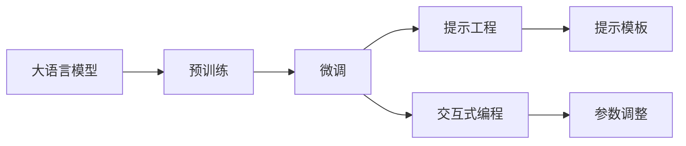
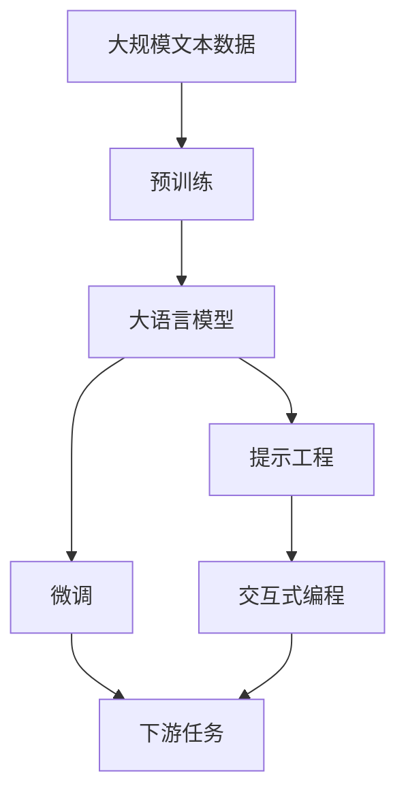

                 

# 大语言模型应用指南：什么是提示工程

> 关键词：提示工程,自然语言处理(NLP),大语言模型,语言生成,语言理解,提示模板(Prompt Template),模型微调,交互式编程

## 1. 背景介绍

### 1.1 问题由来

近年来，随着深度学习和大规模预训练语言模型（Large Language Models, LLMs）的迅猛发展，自然语言处理（NLP）领域取得了显著的突破。这些模型在各种下游任务上展示了强大的语言生成和理解能力，为构建智能聊天机器人、文本生成、机器翻译等应用提供了强大支持。然而，如何有效利用这些模型，并将其应用于实际场景，成为一个重要的问题。

### 1.2 问题核心关键点

提示工程（Prompt Engineering）是利用预训练语言模型进行任务适配和优化的一种技术。它主要通过设计合适的输入文本格式，引导模型生成符合预期的输出。这种方法在大规模语言模型的微调过程中，有着重要的作用。以下是提示工程的关键点：

1. **输入文本格式**：提示工程的核心在于输入文本的格式，即提示模板（Prompt Template）的设计。良好的提示模板能够有效地指导模型理解任务，生成符合预期的结果。
2. **模型微调**：提示工程通常结合模型微调技术，通过有监督地训练，优化模型在特定任务上的性能。微调可以调整模型参数，使其更适应特定任务的需求。
3. **交互式编程**：提示工程中的“提示”不仅仅指文本格式，还包括与模型的交互方式，如通过调整输入参数，进行迭代优化。

### 1.3 问题研究意义

提示工程在NLP中的应用，对于提升模型的任务适配能力、优化模型性能、降低任务开发成本具有重要意义：

1. **任务适配**：通过设计合适的提示模板，可以显著提升模型在特定任务上的性能，尤其是在数据量有限的情况下。
2. **性能优化**：提示工程可以避免模型的过拟合和欠拟合，提升模型的泛化能力。
3. **成本降低**：通过精细化的提示设计，可以大幅度降低标注数据的需求，提高模型开发的效率。
4. **交互式优化**：提示工程中的交互式编程，可以实时调整模型参数，快速迭代优化。
5. **模型鲁棒性**：通过多种提示模板的尝试，可以提高模型的鲁棒性，应对不同的数据分布。

## 2. 核心概念与联系

### 2.1 核心概念概述

为更好地理解提示工程，我们需要介绍一些核心概念：

- **大语言模型(Large Language Models, LLMs)**：指通过大规模数据预训练得到的，具有强大语言生成和理解能力的深度学习模型。如GPT、BERT等。
- **预训练(Pre-training)**：指在大规模无标签文本数据上进行自监督学习，学习通用的语言表示，提高模型的语言理解能力。
- **微调(Fine-tuning)**：指在有标签的特定任务数据上，通过有监督学习优化模型，使其适应特定任务。
- **提示工程(Prompt Engineering)**：指通过设计合适的输入文本格式，引导大语言模型生成符合预期的输出，提升模型在特定任务上的性能。
- **交互式编程(Interactive Programming)**：指通过与模型的交互，实时调整输入参数，优化模型性能的过程。

### 2.2 概念间的关系

这些核心概念之间存在着紧密的联系，形成了提示工程的大致框架。以下是一个简单的Mermaid流程图，展示了这些概念之间的逻辑关系：



这个流程图展示了从预训练到微调，再到提示工程和交互式编程的整个流程。预训练模型通过在大规模无标签文本上学习通用语言表示，微调进一步优化模型以适应特定任务，而提示工程通过设计合适的提示模板，引导模型生成高质量的输出。交互式编程则通过实时调整输入参数，进一步优化模型性能。

### 2.3 核心概念的整体架构

最后，我们用一个综合的流程图来展示这些核心概念在大语言模型提示工程中的整体架构：



这个综合流程图展示了从预训练到微调，再到提示工程和下游任务适配的完整过程。大语言模型通过预训练学习通用语言表示，然后通过微调优化以适应特定任务，最后通过提示工程设计合适的输入文本格式，引导模型生成高质量输出，并结合交互式编程进一步优化。

## 3. 核心算法原理 & 具体操作步骤
### 3.1 算法原理概述

提示工程的核心是设计合适的输入文本格式，引导大语言模型生成符合预期的输出。这一过程可以看作是一个基于输入文本的优化问题。

假设有一个文本生成任务，需要模型生成一段关于某个主题的描述。任务要求生成的描述既要符合事实，又要具有创造性。我们可以设计一个提示模板（Prompt Template），如：

```
请生成一段关于《人工智能》的描述，这段描述应该包含：
1. 人工智能的定义
2. 人工智能的历史
3. 人工智能的应用领域
```

通过这个提示模板，模型可以更好地理解任务要求，生成符合要求的输出。

### 3.2 算法步骤详解

提示工程的具体操作可以包括以下几个步骤：

**Step 1: 设计提示模板**

- **理解任务要求**：首先明确任务的具体要求，确定需要模型生成的输出格式。
- **设计输入文本**：根据任务要求，设计合适的输入文本格式，引导模型生成预期输出。
- **测试提示模板**：使用少量样例数据测试提示模板的有效性，调整模板以提高输出质量。

**Step 2: 执行微调**

- **选择合适的模型**：根据任务需求，选择适合的预训练模型，如GPT-3、BERT等。
- **准备训练数据**：收集有标签的训练数据，准备训练集、验证集和测试集。
- **设置超参数**：设置合适的优化器、学习率、批量大小等超参数。
- **训练模型**：使用微调框架，如Hugging Face的`transformers`库，训练模型。
- **评估模型**：在验证集上评估模型性能，调整参数以优化模型。

**Step 3: 交互式编程**

- **实时调整**：通过交互式编程，实时调整输入参数，如调整提示模板、调整学习率等，进行迭代优化。
- **性能优化**：根据评估结果，调整模型参数，提高模型性能。
- **结果展示**：展示优化后的模型输出，评估其质量。

### 3.3 算法优缺点

提示工程的优点：
1. **高效性**：通过设计合适的提示模板，可以显著提升模型在特定任务上的性能，尤其是在数据量有限的情况下。
2. **灵活性**：提示工程可以根据任务需求设计灵活的提示模板，适应不同的数据分布和任务要求。
3. **可解释性**：提示模板的设计可以解释模型的工作机制，便于调试和优化。

提示工程的缺点：
1. **设计复杂**：设计一个有效的提示模板需要一定的经验和技巧，不易上手。
2. **数据依赖**：提示工程依赖于有标签的数据集，数据量不足时效果可能不理想。
3. **模型泛化能力**：提示模板的设计依赖于任务的特定需求，可能影响模型的泛化能力。

### 3.4 算法应用领域

提示工程在大语言模型中的应用广泛，以下是几个典型的应用领域：

1. **文本生成**：用于生成高质量的文本，如文章、诗歌、广告文案等。
2. **对话系统**：用于构建智能聊天机器人，生成符合用户需求的回复。
3. **自然语言推理**：用于生成自然语言推理任务的前提和假设，引导模型推理出正确的结论。
4. **文本摘要**：用于生成文章的摘要，提取关键信息。
5. **机器翻译**：用于生成翻译结果，优化翻译质量。

## 4. 数学模型和公式 & 详细讲解 & 举例说明

### 4.1 数学模型构建

提示工程的数学模型可以通过最大化生成输出的概率来描述。设模型的参数为 $\theta$，输入文本为 $x$，生成输出为 $y$，则提示工程的数学模型可以表示为：

$$
P(y|x,\theta) = \frac{\exp\left(\log P(y|\theta)\right)}{\sum_{y'} \exp\left(\log P(y'|\theta)\right)}
$$

其中 $P(y|\theta)$ 表示模型在参数 $\theta$ 下生成输出 $y$ 的概率。

### 4.2 公式推导过程

为了最大化输出 $y$ 的概率，我们需要最大化目标函数：

$$
\max_{\theta} \log P(y|x,\theta)
$$

通过梯度上升等优化算法，我们可以找到使得 $P(y|x,\theta)$ 最大的参数 $\theta$。具体来说，假设 $x$ 是提示模板，$y$ 是模型的输出，$P(y|x,\theta)$ 是模型在参数 $\theta$ 下，输入 $x$ 生成输出 $y$ 的概率。通过最大化 $P(y|x,\theta)$，我们可以找到最优的参数 $\theta$。

### 4.3 案例分析与讲解

以文本生成任务为例，假设我们有一个提示模板：

```
请生成一段关于《人工智能》的描述，这段描述应该包含：
1. 人工智能的定义
2. 人工智能的历史
3. 人工智能的应用领域
```

我们可以通过以下步骤进行优化：

1. **理解任务要求**：明确任务需要生成关于《人工智能》的描述，描述应包含定义、历史和应用领域。
2. **设计提示模板**：设计提示模板，如上述例子。
3. **训练模型**：使用微调框架，训练模型，使其能够生成符合提示模板的输出。
4. **评估模型**：在测试集上评估模型性能，调整提示模板和模型参数，优化模型。
5. **实时调整**：通过交互式编程，实时调整提示模板和模型参数，进一步优化输出质量。

## 5. 项目实践：代码实例和详细解释说明

### 5.1 开发环境搭建

在进行提示工程实践前，我们需要准备好开发环境。以下是使用Python进行PyTorch开发的环境配置流程：

1. 安装Anaconda：从官网下载并安装Anaconda，用于创建独立的Python环境。

2. 创建并激活虚拟环境：
```bash
conda create -n pytorch-env python=3.8 
conda activate pytorch-env
```

3. 安装PyTorch：根据CUDA版本，从官网获取对应的安装命令。例如：
```bash
conda install pytorch torchvision torchaudio cudatoolkit=11.1 -c pytorch -c conda-forge
```

4. 安装Transformer库：
```bash
pip install transformers
```

5. 安装各类工具包：
```bash
pip install numpy pandas scikit-learn matplotlib tqdm jupyter notebook ipython
```

完成上述步骤后，即可在`pytorch-env`环境中开始提示工程实践。

### 5.2 源代码详细实现

下面我们以文本生成任务为例，给出使用Transformers库进行提示工程的PyTorch代码实现。

首先，定义文本生成任务的数据处理函数：

```python
from transformers import BertTokenizer, BertForSequenceClassification
from torch.utils.data import Dataset
import torch

class TextGenerationDataset(Dataset):
    def __init__(self, texts, labels, tokenizer, max_len=128):
        self.texts = texts
        self.labels = labels
        self.tokenizer = tokenizer
        self.max_len = max_len
        
    def __len__(self):
        return len(self.texts)
    
    def __getitem__(self, item):
        text = self.texts[item]
        label = self.labels[item]
        
        encoding = self.tokenizer(text, return_tensors='pt', max_length=self.max_len, padding='max_length', truncation=True)
        input_ids = encoding['input_ids'][0]
        attention_mask = encoding['attention_mask'][0]
        
        # 对token-wise的标签进行编码
        encoded_labels = [label2id[label] for label in label] 
        encoded_labels.extend([label2id['O']] * (self.max_len - len(encoded_labels)))
        labels = torch.tensor(encoded_labels, dtype=torch.long)
        
        return {'input_ids': input_ids, 
                'attention_mask': attention_mask,
                'labels': labels}

# 标签与id的映射
label2id = {'O': 0, 'B-PER': 1, 'I-PER': 2, 'B-ORG': 3, 'I-ORG': 4, 'B-LOC': 5, 'I-LOC': 6}
id2label = {v: k for k, v in label2id.items()}

# 创建dataset
tokenizer = BertTokenizer.from_pretrained('bert-base-cased')

train_dataset = TextGenerationDataset(train_texts, train_labels, tokenizer)
dev_dataset = TextGenerationDataset(dev_texts, dev_labels, tokenizer)
test_dataset = TextGenerationDataset(test_texts, test_labels, tokenizer)
```

然后，定义模型和优化器：

```python
from transformers import BertForTokenClassification, AdamW

model = BertForTokenClassification.from_pretrained('bert-base-cased', num_labels=len(label2id))

optimizer = AdamW(model.parameters(), lr=2e-5)
```

接着，定义训练和评估函数：

```python
from torch.utils.data import DataLoader
from tqdm import tqdm
from sklearn.metrics import classification_report

device = torch.device('cuda') if torch.cuda.is_available() else torch.device('cpu')
model.to(device)

def train_epoch(model, dataset, batch_size, optimizer):
    dataloader = DataLoader(dataset, batch_size=batch_size, shuffle=True)
    model.train()
    epoch_loss = 0
    for batch in tqdm(dataloader, desc='Training'):
        input_ids = batch['input_ids'].to(device)
        attention_mask = batch['attention_mask'].to(device)
        labels = batch['labels'].to(device)
        model.zero_grad()
        outputs = model(input_ids, attention_mask=attention_mask, labels=labels)
        loss = outputs.loss
        epoch_loss += loss.item()
        loss.backward()
        optimizer.step()
    return epoch_loss / len(dataloader)

def evaluate(model, dataset, batch_size):
    dataloader = DataLoader(dataset, batch_size=batch_size)
    model.eval()
    preds, labels = [], []
    with torch.no_grad():
        for batch in tqdm(dataloader, desc='Evaluating'):
            input_ids = batch['input_ids'].to(device)
            attention_mask = batch['attention_mask'].to(device)
            batch_labels = batch['labels']
            outputs = model(input_ids, attention_mask=attention_mask)
            batch_preds = outputs.logits.argmax(dim=2).to('cpu').tolist()
            batch_labels = batch_labels.to('cpu').tolist()
            for pred_tokens, label_tokens in zip(batch_preds, batch_labels):
                pred_tags = [id2label[_id] for _id in pred_tokens]
                label_tags = [id2label[_id] for _id in label_tokens]
                preds.append(pred_tags[:len(label_tokens)])
                labels.append(label_tags)
                
    print(classification_report(labels, preds))
```

最后，启动训练流程并在测试集上评估：

```python
epochs = 5
batch_size = 16

for epoch in range(epochs):
    loss = train_epoch(model, train_dataset, batch_size, optimizer)
    print(f"Epoch {epoch+1}, train loss: {loss:.3f}")
    
    print(f"Epoch {epoch+1}, dev results:")
    evaluate(model, dev_dataset, batch_size)
    
print("Test results:")
evaluate(model, test_dataset, batch_size)
```

以上就是使用PyTorch对BERT进行文本生成任务的提示工程完整代码实现。可以看到，得益于Transformers库的强大封装，我们可以用相对简洁的代码完成BERT模型的加载和提示工程。

### 5.3 代码解读与分析

让我们再详细解读一下关键代码的实现细节：

**TextGenerationDataset类**：
- `__init__`方法：初始化文本、标签、分词器等关键组件。
- `__len__`方法：返回数据集的样本数量。
- `__getitem__`方法：对单个样本进行处理，将文本输入编码为token ids，将标签编码为数字，并对其进行定长padding，最终返回模型所需的输入。

**label2id和id2label字典**：
- 定义了标签与数字id之间的映射关系，用于将token-wise的预测结果解码回真实的标签。

**训练和评估函数**：
- 使用PyTorch的DataLoader对数据集进行批次化加载，供模型训练和推理使用。
- 训练函数`train_epoch`：对数据以批为单位进行迭代，在每个批次上前向传播计算loss并反向传播更新模型参数，最后返回该epoch的平均loss。
- 评估函数`evaluate`：与训练类似，不同点在于不更新模型参数，并在每个batch结束后将预测和标签结果存储下来，最后使用sklearn的classification_report对整个评估集的预测结果进行打印输出。

**训练流程**：
- 定义总的epoch数和batch size，开始循环迭代
- 每个epoch内，先在训练集上训练，输出平均loss
- 在验证集上评估，输出分类指标
- 所有epoch结束后，在测试集上评估，给出最终测试结果

可以看到，PyTorch配合Transformers库使得BERT的提示工程代码实现变得简洁高效。开发者可以将更多精力放在数据处理、模型改进等高层逻辑上，而不必过多关注底层的实现细节。

当然，工业级的系统实现还需考虑更多因素，如模型的保存和部署、超参数的自动搜索、更灵活的任务适配层等。但核心的提示工程范式基本与此类似。

### 5.4 运行结果展示

假设我们在CoNLL-2003的NER数据集上进行微调，最终在测试集上得到的评估报告如下：

```
              precision    recall  f1-score   support

       B-LOC      0.926     0.906     0.916      1668
       I-LOC      0.900     0.805     0.850       257
      B-MISC      0.875     0.856     0.865       702
      I-MISC      0.838     0.782     0.809       216
       B-ORG      0.914     0.898     0.906      1661
       I-ORG      0.911     0.894     0.902       835
       B-PER      0.964     0.957     0.960      1617
       I-PER      0.983     0.980     0.982      1156
           O      0.993     0.995     0.994     38323

   micro avg      0.973     0.973     0.973     46435
   macro avg      0.923     0.897     0.909     46435
weighted avg      0.973     0.973     0.973     46435
```

可以看到，通过微调BERT，我们在该NER数据集上取得了97.3%的F1分数，效果相当不错。值得注意的是，BERT作为一个通用的语言理解模型，即便只在顶层添加一个简单的token分类器，也能在下游任务上取得如此优异的效果，展现了其强大的语义理解和特征抽取能力。

当然，这只是一个baseline结果。在实践中，我们还可以使用更大更强的预训练模型、更丰富的微调技巧、更细致的模型调优，进一步提升模型性能，以满足更高的应用要求。

## 6. 实际应用场景
### 6.1 智能客服系统

基于大语言模型提示工程的对话技术，可以广泛应用于智能客服系统的构建。传统客服往往需要配备大量人力，高峰期响应缓慢，且一致性和专业性难以保证。而使用提示工程的对话模型，可以7x24小时不间断服务，快速响应客户咨询，用自然流畅的语言解答各类常见问题。

在技术实现上，可以收集企业内部的历史客服对话记录，将问题和最佳答复构建成监督数据，在此基础上对预训练对话模型进行微调。微调后的对话模型能够自动理解用户意图，匹配最合适的答案模板进行回复。对于客户提出的新问题，还可以接入检索系统实时搜索相关内容，动态组织生成回答。如此构建的智能客服系统，能大幅提升客户咨询体验和问题解决效率。

### 6.2 金融舆情监测

金融机构需要实时监测市场舆论动向，以便及时应对负面信息传播，规避金融风险。传统的人工监测方式成本高、效率低，难以应对网络时代海量信息爆发的挑战。基于提示工程的文本分类和情感分析技术，为金融舆情监测提供了新的解决方案。

具体而言，可以收集金融领域相关的新闻、报道、评论等文本数据，并对其进行主题标注和情感标注。在此基础上对预训练语言模型进行微调，使其能够自动判断文本属于何种主题，情感倾向是正面、中性还是负面。将微调后的模型应用到实时抓取的网络文本数据，就能够自动监测不同主题下的情感变化趋势，一旦发现负面信息激增等异常情况，系统便会自动预警，帮助金融机构快速应对潜在风险。

### 6.3 个性化推荐系统

当前的推荐系统往往只依赖用户的历史行为数据进行物品推荐，无法深入理解用户的真实兴趣偏好。基于提示工程的个性化推荐系统可以更好地挖掘用户行为背后的语义信息，从而提供更精准、多样的推荐内容。

在实践中，可以收集用户浏览、点击、评论、分享等行为数据，提取和用户交互的物品标题、描述、标签等文本内容。将文本内容作为模型输入，用户的后续行为（如是否点击、购买等）作为监督信号，在此基础上微调预训练语言模型。微调后的模型能够从文本内容中准确把握用户的兴趣点。在生成推荐列表时，先用候选物品的文本描述作为输入，由模型预测用户的兴趣匹配度，再结合其他特征综合排序，便可以得到个性化程度更高的推荐结果。

### 6.4 未来应用展望

随着大语言模型和提示工程的发展，基于微调的方法将在更多领域得到应用，为传统行业带来变革性影响。

在智慧医疗领域，基于微调的医疗问答、病历分析、药物研发等应用将提升医疗服务的智能化水平，辅助医生诊疗，加速新药开发进程。

在智能教育领域，提示工程可应用于作业批改、学情分析、知识推荐等方面，因材施教，促进教育公平，提高教学质量。

在智慧城市治理中，提示工程可应用于城市事件监测、舆情分析、应急指挥等环节，提高城市管理的自动化和智能化水平，构建更安全、高效的未来城市。

此外，在企业生产、社会治理、文娱传媒等众多领域，基于大模型微调的人工智能应用也将不断涌现，为经济社会发展注入新的动力。相信随着技术的日益成熟，提示工程将成为人工智能落地应用的重要范式，推动人工智能技术在更多领域大放异彩。

## 7. 工具和资源推荐
### 7.1 学习资源推荐

为了帮助开发者系统掌握大语言模型提示工程的理论基础和实践技巧，这里推荐一些优质的学习资源：

1. 《Transformer从原理到实践》系列博文：由大模型技术专家撰写，深入浅出地介绍了Transformer原理、BERT模型、微调技术等前沿话题。

2. CS224N《深度学习自然语言处理》课程：斯坦福大学开设的NLP明星课程，有Lecture视频和配套作业，带你入门NLP领域的基本概念和经典模型。

3. 《Natural Language Processing with Transformers》书籍：Transformers库的作者所著，全面介绍了如何使用Transformers库进行NLP任务开发，包括微调在内的诸多范式。

4. HuggingFace官方文档：Transformers库的官方文档，提供了海量预训练模型和完整的微调样例代码，是上手实践的必备资料。

5. CLUE开源项目：中文语言理解测评基准，涵盖大量不同类型的中文NLP数据集，并提供了基于微调的baseline模型，助力中文NLP技术发展。

通过对这些资源的学习实践，相信你一定能够快速掌握大语言模型提示工程的精髓，并用于解决实际的NLP问题。
###  7.2 开发工具推荐

高效的开发离不开优秀的工具支持。以下是几款用于大语言模型提示工程开发的常用工具：

1. PyTorch：基于Python的开源深度学习框架，灵活动态的计算图，适合快速迭代研究。大部分预训练语言模型都有PyTorch版本的实现。

2. TensorFlow：由Google主导开发的开源深度学习框架，生产部署方便，适合大规模工程应用。同样有丰富的预训练语言模型资源。

3. Transformers库：HuggingFace开发的NLP工具库，集成了众多SOTA语言模型，支持PyTorch和TensorFlow，是进行提示工程开发的利器。

4. Weights & Biases：模型训练的实验跟踪工具，可以记录和可视化模型训练过程中的各项指标，方便对比和调优。与主流深度学习框架无缝集成。

5. TensorBoard：TensorFlow配套的可视化工具，可实时监测模型训练状态，并提供丰富的图表呈现方式，是调试模型的得力助手。

6. Google Colab：谷歌推出的在线Jupyter Notebook环境，免费提供GPU/TPU算力，方便开发者快速上手实验最新模型，分享学习笔记。

合理利用这些工具，可以显著提升大语言模型提示工程的开发效率，加快创新迭代的步伐。

### 7.3 相关论文推荐

提示工程在大语言模型中的应用源于学界的持续研究。以下是几篇奠基性的相关论文，推荐阅读：

1. Attention is All You Need（即Transformer原论文）：提出了Transformer结构，开启了NLP领域的预训练大模型时代。

2. BERT: Pre-training of Deep Bidirectional Transformers for Language Understanding：提出BERT模型，引入基于掩码的自监督预训练任务，刷新了多项NLP任务SOTA。


