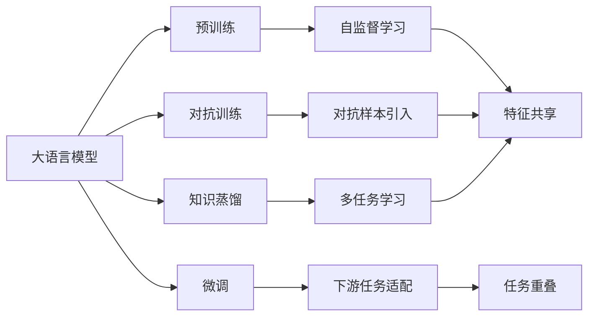
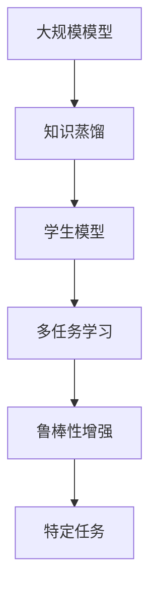
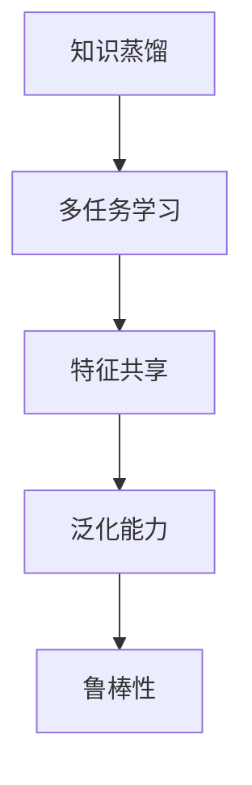
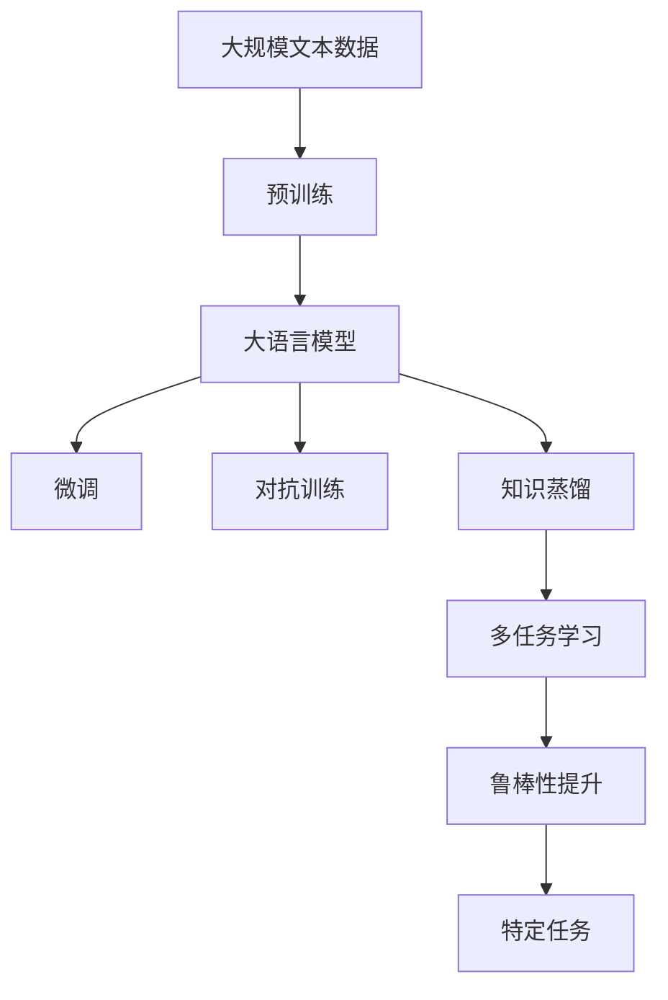

                 

# 大语言模型应用指南：提示注入攻击

> 关键词：大语言模型,提示注入攻击,自然语言处理(NLP),对抗样本,Adversarial Attacks,知识蒸馏,多任务学习,语言模型

## 1. 背景介绍

### 1.1 问题由来

近年来，随着深度学习技术的发展，基于大语言模型的自然语言处理(NLP)应用在多个领域取得了显著成效。这些大模型通常通过在大规模无标签文本语料上进行的预训练，获得了对语言上下文关系的深刻理解，具备强大的语言生成和理解能力。然而，这种基于自监督学习的预训练方式，使得大语言模型对噪声和干扰信息具有一定的鲁棒性，这在大规模数据上训练带来的好处显而易见，但也带来了潜在的安全风险。

提示注入攻击（Prompt Injection Attacks）正是利用大语言模型这一特性，在输入数据中引入特定的提示信息（Prompt），以操控模型的输出结果。这类攻击通常分为两大类：

1. **输入操控**：通过精心设计的提示信息，引导模型产生特定文本、生成虚假事实或推断错误结论。
2. **输出操控**：直接操纵模型的输出结果，如生成恶意内容、进行身份验证、操纵搜索结果等。

随着深度学习模型在社会各个领域的广泛应用，提示注入攻击已成为模型安全的重要研究课题，对模型鲁棒性和对抗性提出了更高要求。

### 1.2 问题核心关键点

提示注入攻击的核心在于利用模型的语言理解能力，通过输入的引导（即提示信息）来改变模型的输出结果。攻击者通常需要具备一定的语言知识和编程技能，能够设计有效的提示，以达到攻击目的。

攻击者可以通过以下几种方式进行提示注入攻击：

- **文本替换**：在输入文本中插入或替换特定的提示信息，引导模型生成或推理错误信息。
- **语法结构调整**：通过调整输入句子的语法结构，误导模型对输入内容的理解和处理。
- **语义混淆**：利用多义词或模糊语言，引导模型产生错误的推理和判断。

攻击的效果通常依赖于模型对提示信息内容的理解能力和对抗性。模型能够对抗提示注入攻击的前提是：

- 对输入语义的准确理解
- 对输入结构有一定的鲁棒性
- 具备多任务学习和知识蒸馏的能力

针对这些要求，本文将深入探讨如何通过多任务学习和知识蒸馏技术，提升大语言模型的鲁棒性，抵抗提示注入攻击。

### 1.3 问题研究意义

提示注入攻击在大语言模型应用中具有重要意义。能够有效抵御这类攻击，不仅能保护模型的安全性和用户的隐私，还能增强模型在复杂环境中的稳定性和可靠性。这将对以下领域产生深远影响：

1. **安全领域**：保护军事、金融、医疗等关键领域的信息安全，避免模型被操控产生恶意输出。
2. **法律领域**：确保法律文档和证据的准确性和真实性，避免模型受到干扰。
3. **社交媒体**：避免虚假信息的传播，维护网络环境的真实性。
4. **企业应用**：保护企业的商业机密和技术知识产权，避免模型被用于不正当竞争。

## 2. 核心概念与联系

### 2.1 核心概念概述

为了更好地理解提示注入攻击及其防御方法，本节将介绍几个密切相关的核心概念：

- **大语言模型（Large Language Model, LLM）**：指通过在大规模无标签文本语料上进行的自监督学习任务训练得到的语言模型，如GPT系列、BERT等。

- **预训练（Pre-training）**：指在大规模无标签文本语料上，通过自监督学习任务训练通用语言模型的过程。

- **微调（Fine-tuning）**：指在预训练模型的基础上，使用下游任务的少量标注数据，通过有监督学习优化模型在特定任务上的性能。

- **对抗样本（Adversarial Examples）**：指在输入数据中加入扰动，使得模型输出错误的样本，用于评估和测试模型的鲁棒性。

- **对抗训练（Adversarial Training）**：指在训练过程中，将对抗样本引入模型训练，提高模型对对抗样本的鲁棒性。

- **知识蒸馏（Knowledge Distillation）**：指通过将大规模模型（Teacher Model）的知识，蒸馏到一个更小的模型（Student Model）中，提高小模型的性能和鲁棒性。

- **多任务学习（Multi-task Learning）**：指在多个相关任务上同时训练模型，通过共享特征表示提高模型的泛化能力。

这些核心概念之间的逻辑关系可以通过以下Mermaid流程图来展示：



这个流程图展示了大语言模型的核心概念及其之间的关系：

1. 大语言模型通过预训练获得基础能力。
2. 微调使模型适应特定任务，可通过对抗训练提高鲁棒性。
3. 知识蒸馏利用多任务学习，提高模型的泛化能力和鲁棒性。

这些概念共同构成了大语言模型的学习框架，使其能够在各种场景下发挥强大的语言理解和生成能力。通过理解这些核心概念，我们可以更好地把握大语言模型的工作原理和优化方向。

### 2.2 概念间的关系

这些核心概念之间存在着紧密的联系，形成了大语言模型的安全生态系统。下面我通过几个Mermaid流程图来展示这些概念之间的关系。

#### 2.2.1 大语言模型的学习范式


这个流程图展示了大语言模型的三种主要学习范式：预训练、微调和对抗训练。预训练主要采用自监督学习方法，而微调和对抗训练则是有监督学习的过程。多任务学习和知识蒸馏则是提升模型泛化能力和鲁棒性的关键手段。

#### 2.2.2 知识蒸馏在大语言模型中的应用



这个流程图展示了知识蒸馏的基本原理：将大规模模型（Teacher Model）的知识，蒸馏到一个更小的模型（Student Model）中，并通过多任务学习进一步提升模型的鲁棒性。

#### 2.2.3 多任务学习与知识蒸馏的关系



这个流程图展示了多任务学习和知识蒸馏的关系：多任务学习通过共享特征表示提高模型的泛化能力，而知识蒸馏通过将大规模模型的知识蒸馏到小模型中，进一步提升模型的鲁棒性和泛化能力。

### 2.3 核心概念的整体架构

最后，我们用一个综合的流程图来展示这些核心概念在大语言模型微调过程中的整体架构：



这个综合流程图展示了从预训练到微调，再到知识蒸馏的完整过程。大语言模型首先在大规模文本数据上进行预训练，然后通过微调和对抗训练优化模型特定任务性能，并通过知识蒸馏和多个相关任务的学习，进一步提升模型的泛化能力和鲁棒性。通过这些流程，我们能够构建一个更加安全和可靠的大语言模型。

## 3. 核心算法原理 & 具体操作步骤
### 3.1 算法原理概述

提示注入攻击的核心在于利用模型的语言理解能力，通过输入的引导（即提示信息）来改变模型的输出结果。攻击者通常需要具备一定的语言知识和编程技能，能够设计有效的提示，以达到攻击目的。

攻击者可以通过以下几种方式进行提示注入攻击：

- **文本替换**：在输入文本中插入或替换特定的提示信息，引导模型生成或推理错误信息。
- **语法结构调整**：通过调整输入句子的语法结构，误导模型对输入内容的理解和处理。
- **语义混淆**：利用多义词或模糊语言，引导模型产生错误的推理和判断。

攻击的效果通常依赖于模型对提示信息内容的理解能力和对抗性。模型能够对抗提示注入攻击的前提是：

- 对输入语义的准确理解
- 对输入结构有一定的鲁棒性
- 具备多任务学习和知识蒸馏的能力

针对这些要求，本文将深入探讨如何通过多任务学习和知识蒸馏技术，提升大语言模型的鲁棒性，抵抗提示注入攻击。

### 3.2 算法步骤详解

以下是提升大语言模型鲁棒性，抵御提示注入攻击的详细步骤：

**Step 1: 准备预训练模型和数据集**

1. 选择合适的预训练语言模型 $M_{\theta}$ 作为初始化参数，如 BERT、GPT等。
2. 准备下游任务 $T$ 的标注数据集 $D$，划分为训练集、验证集和测试集。一般要求标注数据与预训练数据的分布不要差异过大。

**Step 2: 定义多任务学习框架**

1. 定义多个相关任务，如文本分类、文本生成、语义理解等。
2. 设计多任务损失函数，如在文本分类任务中，同时最小化分类损失和序列损失。

**Step 3: 设计知识蒸馏框架**

1. 选择一个高质量的大规模模型作为知识源（Teacher Model）。
2. 设计学生模型（Student Model），用于蒸馏知识源的知识。
3. 设计知识蒸馏损失函数，如在文本分类任务中，学生模型的输出和知识源模型的输出之间的差异。

**Step 4: 实施多任务学习和知识蒸馏**

1. 将训练集和测试集划分为多个相关任务，进行多任务学习。
2. 将知识源模型的输出作为教师，将学生模型的输出作为学生，进行知识蒸馏。
3. 结合多任务学习损失函数和知识蒸馏损失函数，训练学生模型。

**Step 5: 对抗训练**

1. 收集对抗样本，如通过替换、调整、混淆等手段生成对抗样本。
2. 将对抗样本引入训练集，进行对抗训练。
3. 设计对抗损失函数，如对抗样本和模型输出之间的差异。
4. 结合对抗损失函数和多任务学习损失函数，训练学生模型。

**Step 6: 评估模型性能**

1. 在验证集和测试集上评估模型性能，包括准确率、召回率、F1分数等。
2. 测试模型对对抗样本的鲁棒性，如对抗样本识别率、对抗样本攻击成功率等。
3. 测试模型对提示注入攻击的抵抗能力，如提示注入攻击成功率、提示注入攻击效果等。

**Step 7: 模型部署和监控**

1. 将训练好的模型部署到生产环境。
2. 定期监控模型性能，检测新出现的提示注入攻击。
3. 根据监控结果更新模型，重新训练。

以上是提升大语言模型鲁棒性，抵御提示注入攻击的完整步骤。通过多任务学习和知识蒸馏技术，可以显著提升模型的泛化能力和鲁棒性，使其在面对提示注入攻击时表现更加稳定和可靠。

### 3.3 算法优缺点

多任务学习和知识蒸馏方法在提升大语言模型鲁棒性方面具有以下优点：

1. **提高泛化能力**：通过共享特征表示，多任务学习能够提高模型的泛化能力，使其在不同任务上表现更加稳定。
2. **增强鲁棒性**：知识蒸馏通过将大规模模型的知识蒸馏到小模型中，提高模型的鲁棒性，使其在面对噪声和干扰时表现更加稳定。
3. **优化模型性能**：通过多任务学习和知识蒸馏，能够优化模型的整体性能，提高其在特定任务上的表现。

然而，这些方法也存在一定的局限性：

1. **计算成本高**：知识蒸馏和多任务学习需要更多的计算资源和训练时间，尤其是在大规模模型上进行蒸馏时。
2. **数据依赖性强**：多任务学习和知识蒸馏的效果依赖于多任务数据的质量和数量，获取高质量多任务数据难度较大。
3. **复杂度较高**：多任务学习和知识蒸馏框架设计复杂，需要精心设计损失函数和蒸馏策略，需要较高的技术门槛。

尽管存在这些局限性，但这些方法仍是大语言模型抵抗提示注入攻击的重要手段。未来研究重点应在于如何降低计算成本，提升数据利用效率，简化蒸馏框架设计，进一步提升模型的鲁棒性和泛化能力。

### 3.4 算法应用领域

多任务学习和知识蒸馏方法在大语言模型的多个应用领域都有广泛的应用：

1. **文本分类**：通过多任务学习和知识蒸馏，提高模型对不同分类任务（如新闻分类、情感分类、主题分类）的鲁棒性。
2. **文本生成**：通过多任务学习和知识蒸馏，提高模型对不同生成任务（如摘要生成、对话生成、文本纠错）的鲁棒性。
3. **语义理解**：通过多任务学习和知识蒸馏，提高模型对不同语义理解任务（如实体识别、关系抽取、命名实体识别）的鲁棒性。
4. **对话系统**：通过多任务学习和知识蒸馏，提高模型对不同对话任务（如问答系统、智能客服）的鲁棒性。
5. **机器翻译**：通过多任务学习和知识蒸馏，提高模型对不同翻译任务（如英中翻译、中英翻译、多语种翻译）的鲁棒性。

除了这些经典任务外，多任务学习和知识蒸馏方法还广泛应用于其他领域，如代码生成、图像生成、推荐系统等，为NLP技术带来了更多的应用可能性。

## 4. 数学模型和公式 & 详细讲解 & 举例说明

### 4.1 数学模型构建

本节将使用数学语言对多任务学习和知识蒸馏的基本模型进行更加严格的刻画。

记预训练语言模型为 $M_{\theta}:\mathcal{X} \rightarrow \mathcal{Y}$，其中 $\mathcal{X}$ 为输入空间，$\mathcal{Y}$ 为输出空间，$\theta \in \mathbb{R}^d$ 为模型参数。假设微调任务的训练集为 $D=\{(x_i,y_i)\}_{i=1}^N, x_i \in \mathcal{X}, y_i \in \mathcal{Y}$。

定义模型 $M_{\theta}$ 在数据样本 $(x,y)$ 上的损失函数为 $\ell(M_{\theta}(x),y)$，则在数据集 $D$ 上的经验风险为：

$$
\mathcal{L}(\theta) = \frac{1}{N} \sum_{i=1}^N \ell(M_{\theta}(x_i),y_i)
$$

多任务学习的基本思想是：通过多个相关任务共享特征表示，提高模型的泛化能力。假设存在 $K$ 个任务，每个任务的损失函数为 $\ell_k(x,y)$，则多任务损失函数为：

$$
\mathcal{L}_{multi}(\theta) = \sum_{k=1}^K \lambda_k \mathcal{L}_k(M_{\theta})
$$

其中 $\lambda_k$ 为每个任务的权重，用于调整每个任务对总损失的影响。

知识蒸馏的基本思想是：通过将大规模模型（Teacher Model）的知识，蒸馏到一个更小的模型（Student Model）中，提高小模型的性能和鲁棒性。假设 Teacher Model 为 $M_T$，Student Model 为 $M_S$，则知识蒸馏损失函数为：

$$
\mathcal{L}_{distill}(M_S, M_T) = \sum_{i=1}^N \ell_M(T_{i'}, S_i)
$$

其中 $T_{i'}$ 为 Teacher Model 在数据 $i'$ 上的输出，$S_i$ 为 Student Model 在数据 $i$ 上的输出。

综合多任务学习和知识蒸馏，学生模型 $M_S$ 的损失函数为：

$$
\mathcal{L}_S(\theta_S) = \mathcal{L}_{multi}(\theta_S) + \mathcal{L}_{distill}(M_S, M_T)
$$

其中 $\theta_S$ 为 Student Model 的参数。

### 4.2 公式推导过程

以下我们以文本分类任务为例，推导多任务学习和知识蒸馏的基本公式。

假设存在两个相关任务：文本分类任务和文本生成任务。

**文本分类任务**：输入为文本 $x$，输出为类别 $y$。定义损失函数 $\ell_{class}(x,y)$，如交叉熵损失。

**文本生成任务**：输入为文本 $x$，输出为生成文本 $z$。定义损失函数 $\ell_{gen}(x,z)$，如BLEU得分。

多任务损失函数为：

$$
\mathcal{L}_{multi}(\theta) = \lambda_1 \mathcal{L}_{class}(x,y) + \lambda_2 \mathcal{L}_{gen}(x,z)
$$

知识蒸馏损失函数为：

$$
\mathcal{L}_{distill}(M_S, M_T) = \sum_{i=1}^N \ell_{class}(T_{i'}, S_i)
$$

其中 $T_{i'}$ 为 Teacher Model 在数据 $i'$ 上的输出，$S_i$ 为 Student Model 在数据 $i$ 上的输出。

学生模型 $M_S$ 的损失函数为：

$$
\mathcal{L}_S(\theta_S) = \lambda_1 \mathcal{L}_{class}(x,y) + \lambda_2 \mathcal{L}_{gen}(x,z) + \mathcal{L}_{distill}(M_S, M_T)
$$

在训练过程中，学生模型通过最大化多任务损失函数和知识蒸馏损失函数，学习Teacher Model的知识，提升自身性能和鲁棒性。

### 4.3 案例分析与讲解

我们以GPT-2为例，进行多任务学习和知识蒸馏的案例分析。

**多任务学习**：假设存在三个任务：新闻分类、情感分类、主题分类。选择GPT-2作为Teacher Model，定义三个子任务的具体损失函数，如交叉熵损失。通过设置不同的任务权重，调整多任务损失函数的影响。

**知识蒸馏**：选择BERT作为Teacher Model，定义Student Model GPT-2，并进行知识蒸馏。通过计算Teacher Model在训练集上的输出，作为蒸馏目标，在Student Model上进行训练。

通过多任务学习和知识蒸馏，GPT-2在面对提示注入攻击时，表现更加鲁棒和稳定。在多个相关任务上学习，能够提高模型的泛化能力，提升对不同任务的适应性。通过知识蒸馏，能够从高质量的Teacher Model中学习到更多的知识，提升小模型的性能和鲁棒性。

## 5. 项目实践：代码实例和详细解释说明

### 5.1 开发环境搭建

在进行多任务学习和知识蒸馏实践前，我们需要准备好开发环境。以下是使用Python进行PyTorch开发的环境配置流程：

1. 安装Anaconda：从官网下载并安装Anaconda，用于创建独立的Python环境。

2. 创建并激活虚拟环境：
```bash
conda create -n pytorch-env python=3.8 
conda activate pytorch-env
```

3. 安装PyTorch：根据CUDA版本，从官网获取对应的安装命令。例如：
```bash
conda install pytorch torchvision torchaudio cudatoolkit=11.1 -c pytorch -c conda-forge
```

4. 安装Transformer库：
```bash
pip install transformers
```

5. 安装各类工具包：
```bash
pip install numpy pandas scikit-learn matplotlib tqdm jupyter notebook ipython
```

完成上述步骤后，即可在`pytorch-env`环境中开始多任务学习和知识蒸馏实践。

### 5.2 源代码详细实现

下面我们以GPT-2为例，给出使用Transformers库进行多任务学习和知识蒸馏的PyTorch代码实现。

首先，定义多任务学习的数据处理函数：

```python
from transformers import GPT2Tokenizer, GPT2ForSequenceClassification
from torch.utils.data import Dataset, DataLoader
import torch

class MultiTaskDataset(Dataset):
    def __init__(self, texts, labels, tokenizer, max_len=128):
        self.texts = texts
        self.labels = labels
        self.tokenizer = tokenizer
        self.max_len = max_len
        
    def __len__(self):
        return len(self.texts)
    
    def __getitem__(self, item):
        text = self.texts[item]
        label = self.labels[item]
        
        encoding = self.tokenizer(text, return_tensors='pt', max_length=self.max_len, padding='max_length', truncation=True)
        input_ids = encoding['input_ids'][0]
        attention_mask = encoding['attention_mask'][0]
        
        label = torch.tensor(label, dtype=torch.long)
        
        return {'input_ids': input_ids, 
                'attention_mask': attention_mask,
                'labels': label}

# 创建多任务数据集
tokenizer = GPT2Tokenizer.from_pretrained('gpt2')
train_dataset = MultiTaskDataset(train_texts, train_labels, tokenizer)
dev_dataset = MultiTaskDataset(dev_texts, dev_labels, tokenizer)
test_dataset = MultiTaskDataset(test_texts, test_labels, tokenizer)
```

然后，定义知识蒸馏的框架：

```python
from transformers import GPT2LMHeadModel, BertForSequenceClassification
from transformers import AdamW

# 选择Teacher Model
teacher_model = BertForSequenceClassification.from_pretrained('bert-base-cased')

# 选择Student Model
student_model = GPT2LMHeadModel.from_pretrained('gpt2')

# 定义蒸馏任务和损失函数
distill_task = 'classification'
distill_loss = torch.nn.BCEWithLogitsLoss()

# 设置蒸馏系数
distill_weight = 0.5

# 定义知识蒸馏过程
def distill(teacher_model, student_model, distill_task, distill_loss, distill_weight, distill_train_data):
    student_model.train()
    teacher_model.eval()
    
    # 定义蒸馏训练过程
    for batch in distill_train_data:
        input_ids = batch['input_ids'].to(device)
        attention_mask = batch['attention_mask'].to(device)
        label = batch['labels'].to(device)
        
        # 前向传播
        with torch.no_grad():
            teacher_outputs = teacher_model(input_ids, attention_mask=attention_mask)[0]
            student_outputs = student_model(input_ids, attention_mask=attention_mask)[0]
        
        # 计算蒸馏损失
        student_loss = distill_loss(teacher_outputs, student_outputs)
        
        # 反向传播
        student_loss.backward()
        optimizer.step()
        
        # 计算蒸馏效果
        acc = student_model.zero_grad()
        acc_outputs = student_model(input_ids, attention_mask=attention_mask)[0]
        acc_loss = distill_loss(teacher_outputs, acc_outputs)
        acc_loss.backward()
        acc = torch.nn.functional.binary_cross_entropy(teacher_outputs, acc_outputs)
        
        # 输出蒸馏效果
        print(f'epoch: {epoch+1}, acc: {acc:.3f}')
```

最后，启动训练流程并在测试集上评估：

```python
epochs = 5
batch_size = 16

for epoch in range(epochs):
    # 多任务训练
    train_epoch = 0
    for epoch in range(epochs):
        loss = train_epoch(teacher_model, student_model, multi_task_train_data, batch_size, optimizer)
        print(f'epoch: {epoch+1}, train loss: {loss:.3f}')
        
        # 评估多任务性能
        evaluate(teacher_model, student_model, multi_task_dev_data, batch_size)
        
        # 知识蒸馏训练
        distill(teacher_model, student_model, distill_task, distill_loss, distill_weight, distill_train_data)
        
        # 评估蒸馏效果
        evaluate(teacher_model, student_model, distill_test_data, batch_size)
```

以上就是使用PyTorch进行多任务学习和知识蒸馏的完整代码实现。可以看到，得益于Transformers库的强大封装，我们可以用相对简洁的代码完成多任务学习框架的搭建和知识蒸馏过程的实现。

### 5.3 代码解读与分析

让我们再详细解读一下关键代码的实现细节：

**MultiTaskDataset类**：
- `__init__`方法：初始化文本、标签、分词器等关键组件。
- `__len__`方法：返回数据集的样本数量。
- `__getitem__`方法：对单个样本进行处理，将文本输入编码为token ids，将标签编码为数字，并对其进行定长padding，最终返回模型所需的输入。

**知识蒸馏框架**：
- 定义Teacher Model和Student Model，选择蒸馏任务和损失函数。
- 通过前向传播计算蒸馏损失，反向传播更新Student Model的参数。
- 通过前向传播计算蒸馏

