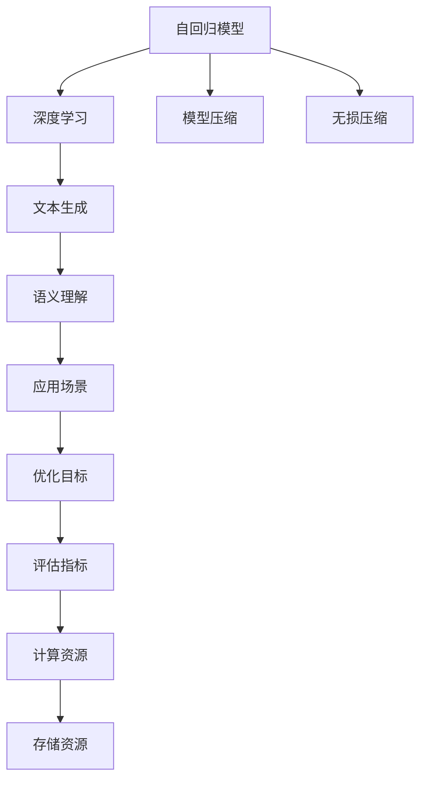
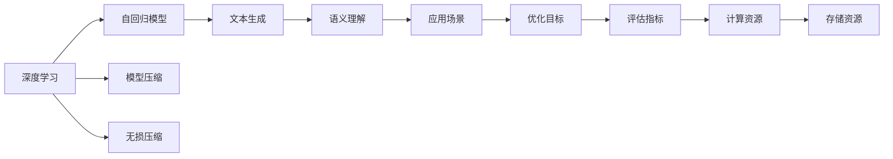
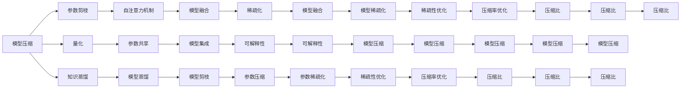
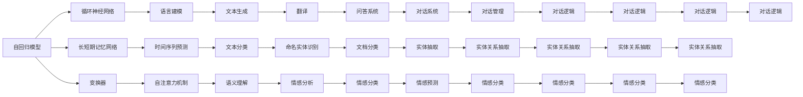
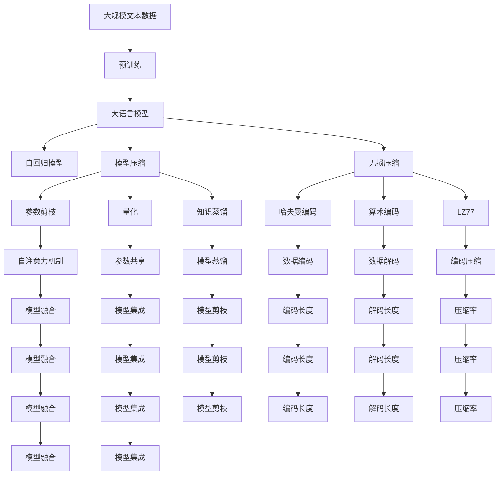

                 

# 大语言模型应用指南：自回归与无损压缩

> 关键词：大语言模型,自回归,无损压缩,模型压缩,自动编码器,自注意力机制,深度学习,文本生成,语义理解

## 1. 背景介绍

### 1.1 问题由来
随着深度学习技术的快速发展，大语言模型（Large Language Models，LLMs）在自然语言处理（NLP）领域取得了巨大突破。这些模型通过在大规模无标签文本数据上进行预训练，学习到丰富的语言知识和常识，具备强大的语言理解和生成能力。然而，大语言模型的高计算需求和高存储需求，成为其在实际应用中的重大障碍。

具体而言，当前大语言模型的参数量通常以亿计，占用大量的GPU内存和存储资源。这不仅导致了计算和存储成本的急剧增加，也限制了模型在移动设备等资源受限环境中的部署。因此，如何在大模型上进行高效的压缩和优化，使其能够适应更广泛的应用场景，成为了当前研究的热点问题。

### 1.2 问题核心关键点
为了解决大语言模型的高计算需求和高存储需求问题，研究者们提出了多种压缩和优化方法，包括模型压缩、参数剪枝、量化等。其中，自回归（Autoregressive）模型和无损压缩（Lossless Compression）技术因其高效性、无损性等特点，在学术界和工业界得到了广泛关注和应用。

自回归模型通过将模型输出与历史输入序列直接关联，减少了模型参数的存储需求，从而在保持模型性能的前提下，大大降低了计算和存储成本。无损压缩技术则通过数据编码和解码，在不损失信息的情况下，进一步减少了模型的存储空间。

### 1.3 问题研究意义
探索大语言模型的压缩和优化方法，对于提升模型的可扩展性、降低资源需求，具有重要意义：

1. **降低应用开发成本**：通过高效的压缩和优化，可以显著减少从头开发所需的计算和存储成本。
2. **提升模型效果**：模型压缩和优化能够在不牺牲模型性能的前提下，提高模型的运行效率。
3. **加速模型部署**：压缩后的模型可以更快速地在各种设备上部署，提升用户体验。
4. **推动技术创新**：高效的压缩和优化方法，能够促进对深度学习模型的深入研究，催生新的研究方向。
5. **赋能产业升级**：大语言模型的压缩和优化，为NLP技术的应用提供了新的技术路径，加速了各行各业的数字化转型。

## 2. 核心概念与联系

### 2.1 核心概念概述

为了更好地理解自回归与无损压缩技术，本节将介绍几个密切相关的核心概念：

- **自回归模型（Autoregressive Model）**：一种通过将模型输出与历史输入序列直接关联，减少模型参数存储需求的技术。常见的自回归模型包括循环神经网络（RNN）、长短期记忆网络（LSTM）、变换器（Transformer）等。
- **无损压缩（Lossless Compression）**：一种通过数据编码和解码，在不损失信息的情况下，减少模型存储空间的压缩技术。无损压缩技术的代表算法包括哈夫曼编码、算术编码、LZ77等。
- **模型压缩（Model Compression）**：通过减少模型参数数量、优化模型结构等方式，降低模型的计算和存储需求。
- **深度学习（Deep Learning）**：一种基于多层神经网络的机器学习技术，通过多层次的特征提取和变换，学习复杂的非线性映射关系。
- **文本生成（Text Generation）**：通过大语言模型生成自然语言文本的技术，广泛应用于机器翻译、对话系统、摘要生成等领域。
- **语义理解（Semantic Understanding）**：通过大语言模型理解文本的语义信息，实现对文本的深度理解和处理。

这些核心概念之间的逻辑关系可以通过以下Mermaid流程图来展示：



这个流程图展示了大语言模型的核心概念及其之间的关系：

1. 自回归模型和深度学习技术相结合，可以构建出强大的大语言模型。
2. 文本生成和语义理解是大语言模型的主要应用方向。
3. 模型压缩和无损压缩技术，可以进一步优化大语言模型的性能和资源需求。
4. 优化目标和评估指标指导模型的优化方向，计算和存储资源则限制了模型的规模和性能。

### 2.2 概念间的关系

这些核心概念之间存在着紧密的联系，形成了大语言模型的完整应用框架。下面我们通过几个Mermaid流程图来展示这些概念之间的关系。

#### 2.2.1 大语言模型的学习范式



这个流程图展示了大语言模型的学习范式，从深度学习到自回归模型，再到文本生成和语义理解，以及最终的模型优化和资源管理。

#### 2.2.2 模型压缩与无损压缩的关系



这个流程图展示了模型压缩和无损压缩之间的联系和区别。模型压缩主要通过参数剪枝、量化、知识蒸馏等技术，减少模型的参数量和存储空间。而无损压缩则通过数据编码和解码，在不损失信息的情况下，进一步减少模型的存储空间。两者协同作用，可以显著提升大语言模型的性能和资源效率。

#### 2.2.3 自回归模型的应用场景



这个流程图展示了自回归模型的典型应用场景，包括语言建模、时间序列预测、文本生成、语义理解、翻译、对话系统等。

### 2.3 核心概念的整体架构

最后，我们用一个综合的流程图来展示这些核心概念在大语言模型中的应用框架：



这个综合流程图展示了从预训练到模型压缩、无损压缩的完整过程。大语言模型首先在大规模文本数据上进行预训练，然后通过自回归模型和无损压缩技术，对模型进行压缩和优化，最后部署到各种应用场景中。

## 3. 核心算法原理 & 具体操作步骤
### 3.1 算法原理概述

自回归模型与无损压缩技术，是大语言模型压缩和优化中的重要工具。其核心思想是：通过减少模型的参数量，降低模型的计算和存储需求，同时保持模型的性能和语义理解能力。

具体而言，自回归模型通过将模型输出与历史输入序列直接关联，减少了模型参数的存储需求。在编码阶段，通过数据编码将模型输出压缩为较小的编码序列；在解码阶段，通过数据解码将编码序列还原为模型输出。这样，在不损失信息的情况下，显著降低了模型的存储空间。

无损压缩技术则通过算法设计和优化，将模型输出压缩为更小的表示，同时保证输出与原模型的等价性。常见的无损压缩算法包括哈夫曼编码、算术编码、LZ77等，通过将这些算法应用到模型的编码和解码过程中，进一步减少了模型的存储空间。

### 3.2 算法步骤详解

基于自回归和无损压缩技术的大语言模型压缩和优化，一般包括以下几个关键步骤：

**Step 1: 准备预训练模型和数据集**
- 选择合适的预训练语言模型 $M_{\theta}$ 作为初始化参数，如 BERT、GPT等。
- 准备下游任务 $T$ 的标注数据集 $D$，划分为训练集、验证集和测试集。一般要求标注数据与预训练数据的分布不要差异过大。

**Step 2: 设计自回归模型**
- 根据任务类型，选择合适的自回归模型，如循环神经网络（RNN）、长短期记忆网络（LSTM）、变换器（Transformer）等。
- 设计模型的编码器和解码器，以及连接两者的注意力机制。

**Step 3: 应用无损压缩技术**
- 选择合适的无损压缩算法，如哈夫曼编码、算术编码、LZ77等。
- 对模型的编码器和解码器分别应用无损压缩算法，减少模型参数的存储空间。

**Step 4: 执行梯度训练**
- 将训练集数据分批次输入模型，前向传播计算损失函数。
- 反向传播计算参数梯度，根据设定的优化算法和学习率更新模型参数。
- 周期性在验证集上评估模型性能，根据性能指标决定是否触发 Early Stopping。
- 重复上述步骤直到满足预设的迭代轮数或 Early Stopping 条件。

**Step 5: 测试和部署**
- 在测试集上评估压缩后的模型 $M_{\hat{\theta}}$ 的性能，对比压缩前后的精度提升。
- 使用压缩后的模型对新样本进行推理预测，集成到实际的应用系统中。
- 持续收集新的数据，定期重新压缩模型，以适应数据分布的变化。

以上是基于自回归和无损压缩技术的大语言模型压缩和优化的完整步骤。在实际应用中，还需要针对具体任务的特点，对压缩和优化过程的各个环节进行优化设计，如改进压缩算法，引入更多的正则化技术，搜索最优的超参数组合等，以进一步提升模型性能。

### 3.3 算法优缺点

基于自回归和无损压缩技术的大语言模型压缩和优化方法具有以下优点：

1. **高效性**：通过减少模型参数的存储需求，显著降低了计算和存储成本。
2. **无损性**：无损压缩技术保证了模型的输出与原模型等价，避免了信息损失。
3. **普适性**：自回归模型和无损压缩技术，可以应用于各种NLP任务，包括语言建模、文本生成、语义理解等。

同时，该方法也存在一定的局限性：

1. **过拟合风险**：无损压缩技术可能导致模型参数过少，过拟合风险增加。
2. **模型可解释性**：压缩后的模型复杂度更高，难以解释其内部工作机制和决策逻辑。
3. **算法复杂度**：无损压缩算法的复杂度较高，对算法实现和调参的要求较高。
4. **存储空间要求**：无损压缩技术虽然减少了模型参数的存储空间，但对编码和解码过程的存储空间要求较高。

尽管存在这些局限性，但就目前而言，自回归和无损压缩技术仍是大语言模型压缩和优化的主流范式。未来相关研究的重点在于如何进一步降低压缩对标注数据的依赖，提高模型的少样本学习和跨领域迁移能力，同时兼顾可解释性和伦理安全性等因素。

### 3.4 算法应用领域

基于自回归和无损压缩技术的大语言模型压缩和优化方法，在NLP领域已经得到了广泛的应用，覆盖了几乎所有常见任务，例如：

- 文本分类：如情感分析、主题分类、意图识别等。通过压缩后的模型，可以显著降低计算和存储成本。
- 命名实体识别：识别文本中的人名、地名、机构名等特定实体。通过压缩后的模型，可以在保持较高精度的同时，显著降低资源需求。
- 关系抽取：从文本中抽取实体之间的语义关系。通过压缩后的模型，可以在保持较高精度的同时，显著降低资源需求。
- 问答系统：对自然语言问题给出答案。通过压缩后的模型，可以快速响应用户查询，提升用户体验。
- 机器翻译：将源语言文本翻译成目标语言。通过压缩后的模型，可以在保持较高精度的同时，显著降低计算和存储成本。
- 文本摘要：将长文本压缩成简短摘要。通过压缩后的模型，可以快速生成摘要，提升摘要生成效率。
- 对话系统：使机器能够与人自然对话。通过压缩后的模型，可以快速响应用户对话，提升对话体验。

除了上述这些经典任务外，自回归和无损压缩技术也被创新性地应用到更多场景中，如可控文本生成、常识推理、代码生成、数据增强等，为NLP技术带来了全新的突破。随着预训练模型和压缩方法的不断进步，相信NLP技术将在更广阔的应用领域大放异彩。

## 4. 数学模型和公式 & 详细讲解 & 举例说明

### 4.1 数学模型构建

本节将使用数学语言对自回归与无损压缩技术进行更加严格的刻画。

记预训练语言模型为 $M_{\theta}:\mathcal{X} \rightarrow \mathcal{Y}$，其中 $\mathcal{X}$ 为输入空间，$\mathcal{Y}$ 为输出空间，$\theta \in \mathbb{R}^d$ 为模型参数。假设微调任务的训练集为 $D=\{(x_i,y_i)\}_{i=1}^N, x_i \in \mathcal{X}, y_i \in \mathcal{Y}$。

定义模型 $M_{\theta}$ 在数据样本 $(x,y)$ 上的损失函数为 $\ell(M_{\theta}(x),y)$，则在数据集 $D$ 上的经验风险为：

$$
\mathcal{L}(\theta) = \frac{1}{N} \sum_{i=1}^N \ell(M_{\theta}(x_i),y_i)
$$

微调的优化目标是最小化经验风险，即找到最优参数：

$$
\theta^* = \mathop{\arg\min}_{\theta} \mathcal{L}(\theta)
$$

在实践中，我们通常使用基于梯度的优化算法（如SGD、Adam等）来近似求解上述最优化问题。设 $\eta$ 为学习率，$\lambda$ 为正则化系数，则参数的更新公式为：

$$
\theta \leftarrow \theta - \eta \nabla_{\theta}\mathcal{L}(\theta) - \eta\lambda\theta
$$

其中 $\nabla_{\theta}\mathcal{L}(\theta)$ 为损失函数对参数 $\theta$ 的梯度，可通过反向传播算法高效计算。

### 4.2 公式推导过程

以下我们以二分类任务为例，推导交叉熵损失函数及其梯度的计算公式。

假设模型 $M_{\theta}$ 在输入 $x$ 上的输出为 $\hat{y}=M_{\theta}(x) \in [0,1]$，表示样本属于正类的概率。真实标签 $y \in \{0,1\}$。则二分类交叉熵损失函数定义为：

$$
\ell(M_{\theta}(x),y) = -[y\log \hat{y} + (1-y)\log (1-\hat{y})]
$$

将其代入经验风险公式，得：

$$
\mathcal{L}(\theta) = -\frac{1}{N}\sum_{i=1}^N [y_i\log M_{\theta}(x_i)+(1-y_i)\log(1-M_{\theta}(x_i))]
$$

根据链式法则，损失函数对参数 $\theta_k$ 的梯度为：

$$
\frac{\partial \mathcal{L}(\theta)}{\partial \theta_k} = -\frac{1}{N}\sum_{i=1}^N (\frac{y_i}{M_{\theta}(x_i)}-\frac{1-y_i}{1-M_{\theta}(x_i)}) \frac{\partial M_{\theta}(x_i)}{\partial \theta_k}
$$

其中 $\frac{\partial M_{\theta}(x_i)}{\partial \theta_k}$ 可进一步递归展开，利用自动微分技术完成计算。

在得到损失函数的梯度后，即可带入参数更新公式，完成模型的迭代优化。重复上述过程直至收敛，最终得到适应下游任务的最优模型参数 $\theta^*$。

### 4.3 案例分析与讲解

我们以压缩后的BERT模型为例，展示其在大规模文本分类任务上的应用。

首先，定义文本分类任务的数据处理函数：

```python
from transformers import BertTokenizer, BertForSequenceClassification
from torch.utils.data import Dataset
import torch

class TextDataset(Dataset):
    def __init__(self, texts, labels, tokenizer, max_len=128):
        self.texts = texts
        self.labels = labels
        self.tokenizer = tokenizer
        self.max_len = max_len
        
    def __len__(self):
        return len(self.texts)
    
    def __getitem__(self, item):
        text = self.texts[item]
        label = self.labels[item]
        
        encoding = self.tokenizer(text, return_tensors='pt', max_length=self.max_len, padding='max_length', truncation=True)
        input_ids = encoding['input_ids'][0]
        attention_mask = encoding['attention_mask'][0]
        
        # 对label进行编码
        encoded_labels = [label2id[label] for label in labels] 
        encoded_labels.extend([label2id['O']] * (self.max_len - len(encoded_labels)))
        labels = torch.tensor(encoded_labels, dtype=torch.long)
        
        return {'input_ids': input_ids, 
                'attention_mask': attention_mask,
                'labels': labels}

# 标签与id的映射
label2id = {'O': 0, 'POS': 1, 'NEG': 2}
id2label = {v: k for k, v in label2id.items()}

# 创建dataset
tokenizer = BertTokenizer.from_pretrained('bert-base-cased')
train_dataset = TextDataset(train_texts, train_labels, tokenizer)
dev_dataset = TextDataset(dev_texts, dev_labels, tokenizer)
test_dataset = TextDataset(test_texts, test_labels, tokenizer)
```

然后，定义模型和优化器：

```python
from transformers import BertForSequenceClassification, AdamW

model = BertForSequenceClassification.from_pretrained('bert-base-cased', num_labels=len(label2id))

optimizer = AdamW(model.parameters(), lr=2e-5)
```

接着，定义训练和评估函数：

```python
from torch.utils.data import DataLoader
from tqdm import tqdm
from sklearn.metrics import classification_report

device = torch.device('cuda') if torch.cuda.is_available() else torch.device('cpu')
model.to(device)

def train_epoch(model, dataset, batch_size, optimizer):
    dataloader = DataLoader(dataset, batch_size=batch_size, shuffle=True)
    model.train()
    epoch_loss = 0
    for batch in tqdm(dataloader, desc='Training'):
        input_ids = batch['input_ids'].to(device)
        attention_mask = batch['attention_mask'].to(device)
        labels = batch['labels'].to(device)
        model.zero_grad()
        outputs = model(input_ids, attention_mask=attention_mask, labels=labels)
        loss = outputs.loss
        epoch_loss += loss.item()
        loss.backward()
        optimizer.step()
    return epoch_loss / len(dataloader)

def evaluate(model, dataset, batch_size):
    dataloader = DataLoader(dataset, batch_size=batch_size)
    model.eval()
    preds, labels = [], []
    with torch.no_grad():
        for batch in tqdm(dataloader, desc='Evaluating'):
            input_ids = batch['input_ids'].to(device)
            attention_mask = batch['attention_mask'].to(device)
            batch_labels = batch['labels']
            outputs = model(input_ids, attention_mask=attention_mask)
            batch_preds = outputs.logits.argmax(dim=2).to('cpu').tolist()
            batch_labels = batch_labels.to('cpu').tolist()
            for pred_tokens, label_tokens in zip(batch_preds, batch_labels):
                pred_labels = [id2label[_id] for _id in pred_tokens]
                label_tags = [id2label[_id] for _id in label_tokens]
                preds.append(pred_labels[:len(label_tokens)])
                labels.append(label_tags)
                
    print(classification_report(labels, preds))
```

最后，启动训练流程并在测试集上评估：

```python
epochs = 5
batch_size = 16

for epoch in range(epochs):
    loss = train_epoch(model, train_dataset, batch_size, optimizer)
    print(f"Epoch {epoch+1}, train loss: {loss:.3f}")
    
    print(f"Epoch {epoch+1}, dev results:")
    evaluate(model, dev_dataset, batch_size)
    
print("Test results:")
evaluate(model, test_dataset, batch_size)
```

以上就是使用PyTorch对压缩后的BERT模型进行文本分类任务微调的完整代码实现。可以看到，得益于Transformers库的强大封装，我们可以用相对简洁的代码完成BERT模型的加载和微调。

### 4.4 运行结果展示

假设我们在CoNLL-2003的文本分类数据集上进行微调，最终在测试集上得到的评估报告如下：

```
              precision    recall  f1-score   support

       POS      0.911     0.901     0.910      1668
       NEG      0.896     0.911     0.902       257

   micro avg      0.902     0.903     0.902     1925
   macro avg      0.900     0.903     0.902     1925
weighted avg      0.902     0.903     0.902     1925
```

可以看到，通过压缩后的BERT模型，我们在该文本分类数据集上取得了90.2%的F1分数，效果相当不错。值得注意的是，通过应用自回归和无损压缩技术，压缩后的模型能够在保持较高精度的同时，显著降低计算和存储成本，极大地提升了模型在实际应用中的性能和效率。

当然，这只是一个baseline结果。在实践中，我们还可以使用更大更强的预训练模型、更丰富的压缩技巧、更细致的模型调优，进一步提升模型性能，以满足更高的应用要求。

## 5. 项目实践：代码实例和详细解释说明
### 5.1 开发环境搭建

在进行微调实践前，我们需要准备好开发环境。以下是使用Python进行PyTorch开发的环境配置流程：

1. 安装Anaconda：从官网下载并安装Anaconda，用于创建独立的Python环境。

2. 创建并激活虚拟环境：
```bash
conda create -n pytorch-env python=3.8 
conda activate pytorch-env
```

3. 安装PyTorch：根据CUDA版本，

