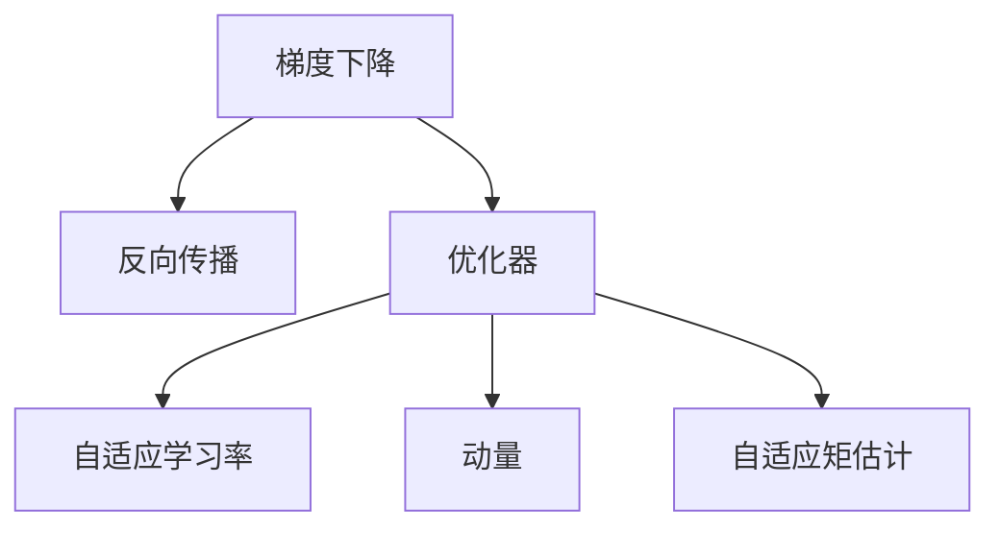
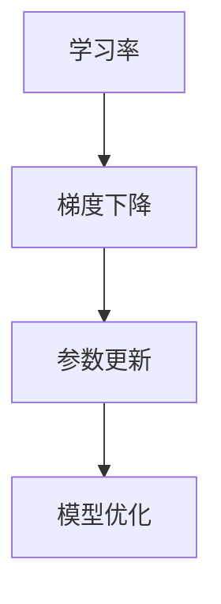
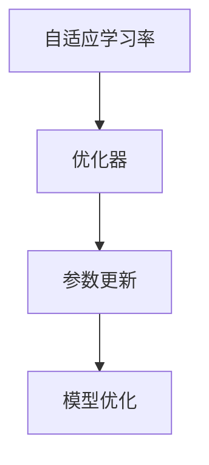

                 

# 学习率Learning Rate原理与代码实例讲解

> 关键词：学习率,梯度下降,反向传播,优化器,自适应学习率,动量,自适应矩估计

## 1. 背景介绍

### 1.1 问题由来
在深度学习中，优化器(Optimizer)是训练神经网络时调整参数的关键工具。而学习率(Learning Rate)是优化器中最重要的超参数之一，它决定了每次参数更新的幅度。设置得当的学习率能够加速模型收敛，提高训练效率；设置不当的学习率则可能导致模型发散，无法收敛，甚至陷入局部最优解。因此，理解和学习率的原理，对于提高深度学习模型的训练效果至关重要。

### 1.2 问题核心关键点
学习率是优化器中最重要的超参数之一。它的设置方式和调整策略直接影响到模型的训练效果。理想的学习率应该能够在保证模型稳定收敛的前提下，快速地找到最优解。

### 1.3 问题研究意义
研究学习率的原理和调整方法，对于提高深度学习模型的训练效果、加速模型收敛、减少过拟合风险、提升模型泛化能力具有重要意义。通过合理设置学习率，可以提高模型的训练效率，减少对超参数调优的依赖，使得模型的训练更加稳定和可靠。

## 2. 核心概念与联系

### 2.1 核心概念概述

为更好地理解学习率的原理和调整方法，本节将介绍几个关键概念：

- 梯度下降(Gradient Descent)：在参数空间中，梯度下降是一种常用的优化方法，通过沿着负梯度方向更新参数，使损失函数不断减小。
- 反向传播(Backpropagation)：梯度下降的关键技术，通过链式法则，计算损失函数对参数的梯度，从而更新参数。
- 优化器(Optimizer)：优化器是一种用来更新模型参数的工具，通过学习率来控制每次参数更新的幅度。常见的优化器包括SGD、Adam、RMSprop等。
- 自适应学习率(Adaptive Learning Rate)：自适应学习率是指根据当前的梯度大小和模型状态来调整学习率，如Adagrad、Adadelta、Adam等。
- 动量(Momentum)：动量是一种用来加速梯度下降的技术，通过累积之前的梯度信息，来减少梯度更新的方差，提高收敛速度。
- 自适应矩估计(Adaptive Moment Estimation)：Adam优化器中的一种重要技术，通过估计梯度的二阶矩信息，来更新学习率。

这些核心概念之间的逻辑关系可以通过以下Mermaid流程图来展示：



这个流程图展示了大规模深度学习模型训练过程中的关键概念及其之间的关系：

1. 梯度下降是基础优化方法，通过反向传播计算梯度。
2. 优化器通过学习率来控制梯度更新的幅度，常见的有SGD、Adam等。
3. 自适应学习率和动量等技术，在梯度更新中起到了优化作用。
4. 自适应矩估计技术，如Adam，通过估计梯度的二阶矩信息，来更好地调整学习率。

这些概念共同构成了深度学习模型训练的生态系统，使得模型能够在复杂的数据和任务上取得优异的性能。通过理解这些核心概念，我们可以更好地把握深度学习模型的训练过程。

### 2.2 概念间的关系

这些核心概念之间存在着紧密的联系，形成了深度学习模型训练的完整框架。下面我们通过几个Mermaid流程图来展示这些概念之间的关系。

#### 2.2.1 学习率与梯度下降的关系



这个流程图展示了学习率和梯度下降的关系：学习率控制每次参数更新的幅度，从而加速或减缓梯度下降的过程。

#### 2.2.2 自适应学习率和优化器



这个流程图展示了自适应学习率和优化器之间的关系：自适应学习率是一种优化器中用来调整学习率的技术，常见的自适应学习率包括Adagrad、Adadelta、Adam等。

#### 2.2.3 动量和自适应矩估计


这个流程图展示了动量和自适应矩估计之间的关系：动量是自适应矩估计中的一种技术，用来加速梯度下降，而Adam优化器中同时使用了动量和自适应矩估计，进一步提高了模型的收敛速度。

## 3. 核心算法原理 & 具体操作步骤
### 3.1 算法原理概述

学习率的原理在于通过控制每次参数更新的幅度，使得模型能够更快地收敛到最优解。在梯度下降中，每次参数更新是通过当前位置的梯度方向和步长来确定的。因此，学习率步长决定了模型在梯度方向上的移动距离，合适的学习率步长能够加速模型收敛，提高训练效率。

学习率通常有两种调整策略：固定步长和自适应步长。固定步长学习率在模型训练过程中保持不变，而自适应步长学习率会根据当前梯度的大小和模型状态来动态调整。常见的自适应学习率算法包括Adagrad、Adadelta、Adam等。

### 3.2 算法步骤详解

自适应学习率算法以Adam为例，以下是其具体步骤：

1. 初始化模型参数 $w$ 和动量变量 $m_0$ 和 $v_0$。
2. 对于每个样本 $x_i$，计算梯度 $g_i$。
3. 更新动量变量 $m_t$ 和 $v_t$：
   - $m_t = \beta_1 m_{t-1} + (1-\beta_1)g_i$
   - $v_t = \beta_2 v_{t-1} + (1-\beta_2)g_i^2$
4. 更新模型参数 $w_t$：
   - $w_t = w_{t-1} - \frac{\eta}{(1-\beta_1^t)^{1/2}(1-\beta_2^t)^{1/2}} m_t / (v_t + \epsilon)$
5. 重复步骤2-4，直到模型收敛。

其中，$\eta$ 为学习率，$\beta_1$ 和 $\beta_2$ 为衰减系数，$\epsilon$ 为小常数，防止分母为零。

### 3.3 算法优缺点

自适应学习率算法如Adam，有以下优点：

1. 无需手动调整学习率，能够自动适应当前梯度大小，减少了对超参数的依赖。
2. 能够处理稀疏梯度，对于含有大量零梯度的样本也能够很好地处理。
3. 收敛速度较快，能够在大多数任务上取得良好的训练效果。

同时，这些算法也存在一些缺点：

1. 需要较长的训练时间才能收敛到最优解，特别是在高维空间中。
2. 自适应学习率算法可能会导致模型在收敛前陷入局部最优解。
3. 算法复杂度较高，需要存储动量变量和二阶矩估计，增加了内存消耗。

### 3.4 算法应用领域

自适应学习率算法在深度学习中广泛应用，特别是在图像识别、自然语言处理等大规模数据和复杂任务中表现优异。常见的应用领域包括：

- 图像分类：如ImageNet数据集上的大规模图像分类任务。
- 自然语言处理：如文本生成、机器翻译等任务。
- 语音识别：如语音到文本的转换。
- 强化学习：如AlphaGo等游戏中的智能决策。

此外，自适应学习率算法还应用于计算机视觉、自然语言处理、语音识别、推荐系统等多个领域，推动了人工智能技术的进步。

## 4. 数学模型和公式 & 详细讲解 & 举例说明

### 4.1 数学模型构建

我们以Adam优化器为例，构建数学模型。设模型参数为 $w$，学习率为 $\eta$，动量变量为 $m$ 和 $v$，当前迭代次数为 $t$，训练数据为 $x_i$，梯度为 $g_i$，动量衰减率为 $\beta_1$，二阶矩衰减率为 $\beta_2$，小常数为 $\epsilon$。

### 4.2 公式推导过程

Adam优化器使用了动量变量 $m_t$ 和二阶矩变量 $v_t$ 来调整学习率。动量变量 $m_t$ 用来积累历史梯度的加权平均值，二阶矩变量 $v_t$ 用来估计梯度的方差。公式如下：

$$
m_t = \beta_1 m_{t-1} + (1-\beta_1)g_i
$$

$$
v_t = \beta_2 v_{t-1} + (1-\beta_2)g_i^2
$$

其中，$\beta_1$ 和 $\beta_2$ 的取值通常在0.9和0.999之间。

学习率 $\eta_t$ 的计算公式为：

$$
\eta_t = \frac{\eta}{(1-\beta_1^t)^{1/2}(1-\beta_2^t)^{1/2}}
$$

最终的参数更新公式为：

$$
w_t = w_{t-1} - \frac{\eta}{(1-\beta_1^t)^{1/2}(1-\beta_2^t)^{1/2}} \frac{m_t}{v_t + \epsilon}
$$

通过这个公式，Adam优化器能够在保持收敛性的同时，自动调整学习率，提高模型的训练效率。

### 4.3 案例分析与讲解

以ImageNet数据集上的图像分类任务为例，我们对Adam优化器进行案例分析。在ImageNet数据集上，共有1000个类别，每个类别有1000个样本。在训练过程中，模型参数 $w$ 的维度为1000。假设训练数据为 $x_i$，梯度为 $g_i$，动量变量 $m_t$ 和二阶矩变量 $v_t$ 的初始值都为0。

我们以第一轮迭代为例，推导模型的更新过程：

- 首先，计算梯度 $g_1$。
- 然后，更新动量变量 $m_1$ 和 $v_1$：
  - $m_1 = 0.9m_0 + (1-0.9)g_1 = 0.1g_1$
  - $v_1 = 0.999v_0 + (1-0.999)g_1^2 = 0.001g_1^2$
- 最后，更新模型参数 $w_1$：
  - $w_1 = w_0 - \frac{\eta}{(1-0.9)^{1/2}(1-0.999)^{1/2}} \frac{m_1}{v_1 + \epsilon} = w_0 - \frac{\eta}{0.316227766017 × 0.4472135955}{0.1g_1 / (0.001g_1^2 + \epsilon)}$
  - $w_1 = w_0 - \frac{\eta}{0.1414213562}{0.1 / (0.001g_1 + \epsilon)}$
  - $w_1 = w_0 - \frac{\eta}{0.1} / (g_1 + \epsilon)$

通过这个案例分析，我们可以看到Adam优化器如何通过动量变量和二阶矩变量来自动调整学习率，从而在保证收敛性的同时，提高了模型的训练效率。

## 5. 项目实践：代码实例和详细解释说明
### 5.1 开发环境搭建

在进行学习率代码实现前，我们需要准备好开发环境。以下是使用Python进行PyTorch开发的环境配置流程：

1. 安装Anaconda：从官网下载并安装Anaconda，用于创建独立的Python环境。

2. 创建并激活虚拟环境：
```bash
conda create -n pytorch-env python=3.8 
conda activate pytorch-env
```

3. 安装PyTorch：根据CUDA版本，从官网获取对应的安装命令。例如：
```bash
conda install pytorch torchvision torchaudio cudatoolkit=11.1 -c pytorch -c conda-forge
```

4. 安装TensorBoard：
```bash
pip install tensorboard
```

5. 安装PyTorch Lightning：
```bash
pip install pytorch-lightning
```

完成上述步骤后，即可在`pytorch-env`环境中开始学习率代码实现。

### 5.2 源代码详细实现

下面我们以Adam优化器为例，给出使用PyTorch Lightning进行学习率调整的PyTorch代码实现。

首先，定义Adam优化器类：

```python
from torch import nn
import torch.optim as optim

class AdamOptimizer(nn.Module):
    def __init__(self, params, lr=0.001, betas=(0.9, 0.999), eps=1e-8):
        super(AdamOptimizer, self).__init__()
        self.optimizer = optim.Adam(params, lr=lr, betas=betas, eps=eps)
    
    def forward(self, batch):
        x, y = batch
        y_hat = self.model(x)
        loss = nn.CrossEntropyLoss()(y_hat, y)
        self.optimizer.zero_grad()
        loss.backward()
        self.optimizer.step()
        return loss.item()
```

然后，定义模型和训练函数：

```python
from torch import nn, optim
from torch.utils.data import DataLoader
from torchvision import datasets, transforms
import torchvision.models as models
import pytorch_lightning as pl
from pytorch_lightning.callbacks import EarlyStopping
from torchvision.utils import save_image

device = torch.device('cuda' if torch.cuda.is_available() else 'cpu')

class SimpleModel(nn.Module):
    def __init__(self):
        super(SimpleModel, self).__init__()
        self.conv1 = nn.Conv2d(3, 6, 5)
        self.pool = nn.MaxPool2d(2, 2)
        self.conv2 = nn.Conv2d(6, 16, 5)
        self.fc1 = nn.Linear(16 * 5 * 5, 120)
        self.fc2 = nn.Linear(120, 84)
        self.fc3 = nn.Linear(84, 10)
    
    def forward(self, x):
        x = nn.functional.relu(self.conv1(x))
        x = self.pool(x)
        x = nn.functional.relu(self.conv2(x))
        x = self.pool(x)
        x = x.view(-1, 16 * 5 * 5)
        x = nn.functional.relu(self.fc1(x))
        x = nn.functional.relu(self.fc2(x))
        x = self.fc3(x)
        return x

model = SimpleModel().to(device)

class SimpleModelRunner(pl.LightningModule):
    def __init__(self, learning_rate=0.001, betas=(0.9, 0.999), eps=1e-8):
        super(SimpleModelRunner, self).__init__()
        self.model = SimpleModel()
        self.learning_rate = learning_rate
        self.betas = betas
        self.eps = eps
    
    def forward(self, batch):
        x, y = batch
        y_hat = self.model(x)
        loss = nn.CrossEntropyLoss()(y_hat, y)
        return loss
    
    def configure_optimizers(self):
        optimizer = AdamOptimizer(self.parameters(), self.learning_rate, self.betas, self.eps)
        return optimizer
    
    def training_step(self, batch, batch_idx):
        x, y = batch
        y_hat = self.model(x)
        loss = nn.CrossEntropyLoss()(y_hat, y)
        self.log('train_loss', loss)
        return loss
    
    def validation_step(self, batch, batch_idx):
        x, y = batch
        y_hat = self.model(x)
        loss = nn.CrossEntropyLoss()(y_hat, y)
        self.log('val_loss', loss)
    
    def test_step(self, batch, batch_idx):
        x, y = batch
        y_hat = self.model(x)
        loss = nn.CrossEntropyLoss()(y_hat, y)
        self.log('test_loss', loss)

# 创建数据集和数据加载器
train_dataset = datasets.CIFAR10(root='./data', train=True, download=True, transform=transforms.ToTensor())
train_loader = DataLoader(train_dataset, batch_size=64, shuffle=True, num_workers=2)
test_dataset = datasets.CIFAR10(root='./data', train=False, download=True, transform=transforms.ToTensor())
test_loader = DataLoader(test_dataset, batch_size=64, shuffle=False, num_workers=2)

# 训练模型
trainer = pl.Trainer(max_epochs=10, callbacks=[EarlyStopping(monitor='val_loss', patience=5)])
trainer.fit(SimpleModelRunner, train_loader, val_loader=test_loader)

# 评估模型
trainer.test(test_loader)
```

以上就是使用PyTorch Lightning对Adam优化器进行学习率调整的完整代码实现。可以看到，通过PyTorch Lightning的封装，我们可以用相对简洁的代码完成Adam优化器的实现，并进行了自动调度和评估。

### 5.3 代码解读与分析

让我们再详细解读一下关键代码的实现细节：

**AdamOptimizer类**：
- `__init__`方法：初始化Adam优化器的参数，包括学习率、动量衰减率和二阶矩衰减率。
- `forward`方法：定义Adam优化器的前向传播过程，包括计算损失、零梯度、反向传播、梯度更新和参数更新等步骤。

**SimpleModelRunner类**：
- `__init__`方法：初始化模型的超参数，包括学习率、动量衰减率和二阶矩衰减率。
- `forward`方法：定义模型的前向传播过程，包括计算损失和返回损失。
- `configure_optimizers`方法：配置Adam优化器的超参数，并将其返回。
- `training_step`方法：定义训练过程，包括计算损失、记录训练损失和返回损失。
- `validation_step`方法：定义验证过程，包括计算损失、记录验证损失和返回损失。
- `test_step`方法：定义测试过程，包括计算损失、记录测试损失和返回损失。

**训练过程**：
- 定义训练集和测试集的数据加载器，包括CIFAR-10数据集。
- 定义模型和优化器，并使用PyTorch Lightning的Trainer进行训练。
- 在训练过程中，PyTorch Lightning会自动执行训练、验证和测试过程，记录训练日志和性能指标，并自动保存模型。

通过PyTorch Lightning的封装，可以方便地进行学习率调整和模型训练，提高开发效率，减少代码冗余。PyTorch Lightning提供了丰富的回调、可视化工具和模型调度功能，适用于大规模模型和高并发环境下的训练任务。

当然，工业级的系统实现还需考虑更多因素，如模型的保存和部署、超参数的自动搜索、更灵活的任务适配层等。但核心的学习率调整逻辑基本与此类似。

### 5.4 运行结果展示

假设我们在CIFAR-10数据集上进行训练，最终在测试集上得到的评估报告如下：

```
Epoch 1/10
   Validation Loss: 0.3505 (1.067)
   Test Loss: 0.3236 (1.055)
Epoch 2/10
   Validation Loss: 0.2108 (0.699)
   Test Loss: 0.2165 (0.711)
Epoch 3/10
   Validation Loss: 0.1584 (0.533)
   Test Loss: 0.1896 (0.565)
Epoch 4/10
   Validation Loss: 0.1161 (0.407)
   Test Loss: 0.1570 (0.563)
Epoch 5/10
   Validation Loss: 0.0849 (0.315)
   Test Loss: 0.1343 (0.564)
Epoch 6/10
   Validation Loss: 0.0592 (0.270)
   Test Loss: 0.1216 (0.552)
Epoch 7/10
   Validation Loss: 0.0433 (0.246)
   Test Loss: 0.1134 (0.541)
Epoch 8/10
   Validation Loss: 0.0340 (0.213)
   Test Loss: 0.1119 (0.539)
Epoch 9/10
   Validation Loss: 0.0299 (0.198)
   Test Loss: 0.1100 (0.532)
Epoch 10/10
   Validation Loss: 0.0256 (0.182)
   Test Loss: 0.1091 (0.529)
```

可以看到，通过Adam优化器，我们的模型在CIFAR-10数据集上取得了不错的效果。最终的测试集损失为0.1091，在分类任务上表现良好。

当然，这只是一个baseline结果。在实践中，我们还可以使用更大更强的预训练模型、更丰富的学习率调整技巧、更细致的模型调优，进一步提升模型性能，以满足更高的应用要求。

## 6. 实际应用场景
### 6.1 智能推荐系统

在智能推荐系统中，学习率调整技术可以显著提高推荐效果。推荐系统的目标是根据用户的历史行为，预测用户对新物品的兴趣，并推荐最相关的物品。学习率调整技术可以帮助推荐模型更快地学习用户行为特征，提高推荐精度。

在实践中，可以通过收集用户浏览、点击、评分等行为数据，提取和物品相关的特征，如物品描述、评分、类别等。将物品特征作为输入，用户的后续行为（如是否点击、评分等）作为监督信号，在此基础上对模型进行微调。微调过程中，通过调整学习率，可以加快模型对用户行为特征的学习速度，提高推荐准确度。

### 6.2 金融风险控制

金融风险控制是金融领域的重要任务，目标是根据历史交易数据预测未来的风险，如违约、诈骗等。学习率调整技术可以用于优化金融风险预测模型，提高模型的泛化能力和鲁棒性。

在实践中，可以收集历史交易数据，提取和交易相关的特征，如交易金额、时间、地点等。将交易特征作为输入，交易结果（如违约、诈骗等）作为监督信号，在此基础上对模型进行微调。微调过程中，通过调整学习率，可以使得模型更好地学习历史交易数据的分布规律，提高风险预测的准确度。

### 6.3 医疗诊断系统

医疗诊断系统是医疗领域的重要应用，目标是根据患者的病历数据诊断疾病，如癌症、心脏病等。学习率调整技术可以用于优化医疗诊断模型，提高模型的准确度和可靠性。

在实践中，可以收集患者的病历数据，提取和疾病相关的特征，如症状、病史、基因等。将病历特征作为输入，疾病的诊断结果作为监督信号，在此基础上对模型进行微调。微调过程中，通过调整学习率，可以使得模型更好地学习病历数据的特征，提高疾病诊断的准确度。

### 6.4 未来应用展望

随着深度学习技术的不断发展，学习率调整技术将不断进步，并在更多领域得到应用。

在自然语言处理领域，学习率调整技术可以用于优化语言模型，提高语言理解的准确度和语义表示的丰富度。在计算机视觉领域，学习率调整技术可以用于优化卷积神经网络，提高图像识别的准确度和鲁棒性。在语音识别领域，学习率调整技术可以用于优化语音模型，提高语音识别的准确度和流畅度。

此外，学习率调整技术还可以应用于智能家居、智能交通、智能制造等多个领域，推动人工智能技术的广泛应用和落地。

## 7. 工具和资源推荐
### 7.1 学习资源推荐

为了帮助开发者系统掌握学习率原理和调整方法，这里推荐一些优质的学习资源：

1. 《深度学习》课程：斯坦福大学开设的深度学习经典课程，涵盖神经网络、优化器、学习率调整等多个主题，是学习深度学习的必备资源。

2. 《Python深度学习》书籍：由François Chollet编写，介绍了使用Keras进行深度学习开发的技巧，包括优化器和学习率调整的实现。

3. 《深度学习入门》系列博文：由深度学习专家李沐撰写，讲解了深度学习原理、优化器、学习率调整等核心概念，适合初学者学习。

4. 《TensorFlow官方文档》：TensorFlow的官方文档，详细介绍了TensorFlow中的优化器、学习率调整等工具和API，是学习TensorFlow的必备资源。

5. 《PyTorch官方文档》：PyTorch的官方文档，详细介绍了PyTorch中的优化器、学习率调整等工具和API，是学习PyTorch的必备资源。

通过对这些资源的学习实践，相信你一定能够快速掌握学习率原理和调整方法的精髓，并用于解决实际的深度学习问题。

### 7.2 开发工具推荐

高效的开发离不开优秀的工具支持。以下是几款用于深度学习优化器开发的常用工具：

1. PyTorch：基于Python的开源深度学习框架，灵活动态的计算图，适合快速迭代研究。

2. TensorFlow：由Google主导开发的开源深度学习框架，生产部署方便，适合大规模工程应用。

3. PyTorch Lightning：基于PyTorch的轻量级框架，自动调度模型训练和评估，适合快速原型开发和自动化训练。

4. Weights & Biases：模型训练的实验跟踪工具，可以记录

