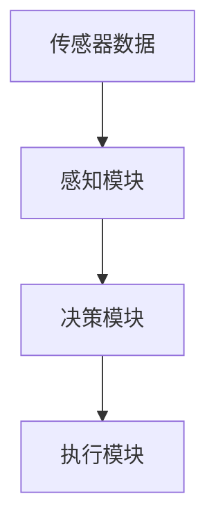
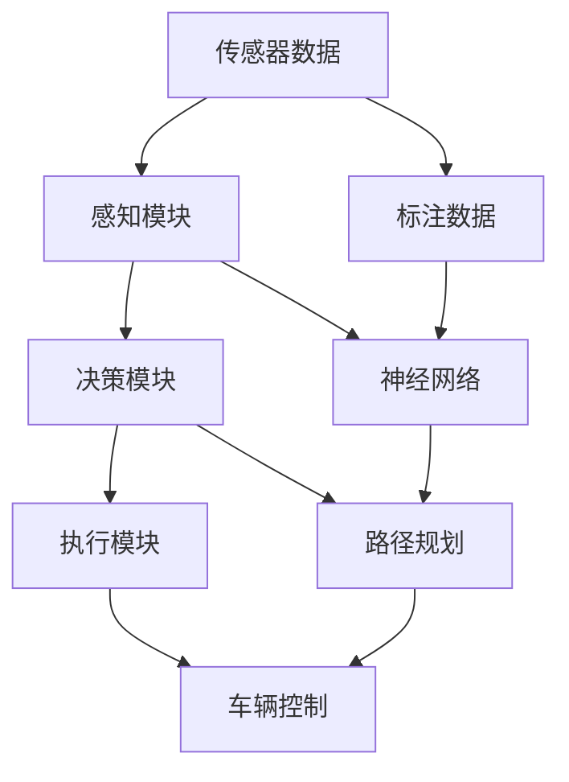

                 

# 小米汽车的端到端泊车系统

在自动驾驶领域，泊车作为一项基础且关键的技术，是许多汽车制造商和科技公司的研发重点。本文将详细介绍小米汽车在端到端泊车系统上的技术架构和实现细节，涵盖从感知、决策到执行的完整链路，以及针对实际道路场景的优化策略。通过系统梳理小米汽车的泊车系统，读者将对端到端泊车技术有更深刻的理解，并能够应用于其他自动驾驶场景的设计中。

## 1. 背景介绍

### 1.1 问题由来
近年来，随着自动驾驶技术的不断进步，汽车制造商和科技公司纷纷投入大量资源，开发先进的自动泊车系统。小米汽车作为新能源汽车领域的后来者，其自主研发的端到端泊车系统采用了先进的AI算法和技术，力求在复杂的城市驾驶场景中，为驾驶者提供更加智能、安全的泊车体验。

### 1.2 问题核心关键点
小米汽车端到端泊车系统分为感知、决策和执行三大模块。其中：

- **感知模块**：通过摄像头、雷达、激光雷达等传感器，采集周围环境信息，实现对静态和动态障碍物的精确识别。
- **决策模块**：基于感知数据，通过深度学习和路径规划算法，进行泊车路径选择和障碍物规避。
- **执行模块**：控制车辆转向、加速、制动等动作，精确完成泊车任务。

本文将重点介绍小米汽车在感知和决策模块的实现细节，特别是深度学习算法的核心原理和具体应用。

### 1.3 问题研究意义
端到端泊车系统的研发，对于提升驾驶安全、降低泊车成本、提高泊车效率具有重要意义。通过小米汽车的案例分析，读者将能够了解端到端泊车系统的实现流程和关键技术，为后续相关技术的开发和应用提供参考。

## 2. 核心概念与联系

### 2.1 核心概念概述

为了更好地理解小米汽车端到端泊车系统的技术细节，本文将介绍几个核心概念：

- **端到端(E2E)系统**：指从传感器数据采集到最终动作执行的完整流程，中间不涉及人为干预。端到端系统通常采用神经网络进行自动化的感知和决策。
- **感知模块(Perception Module)**：负责收集和处理车辆周围环境信息，实现对静态和动态障碍物的识别。
- **决策模块(Decision Module)**：基于感知数据，通过深度学习和路径规划算法，选择最优的泊车路径和规避方案。
- **执行模块(Execution Module)**：控制车辆动作，执行决策模块发出的指令。

这些核心概念共同构成了小米汽车端到端泊车系统的技术架构，通过传感器数据获取、环境感知、决策推理和动作执行等环节，实现了高效、准确的自动泊车功能。

### 2.2 概念间的关系

通过Mermaid流程图展示小米汽车端到端泊车系统的各个模块及其关系：



这个流程图展示了小米汽车端到端泊车系统的基本流程：首先通过传感器采集数据，然后感知模块进行处理，决策模块进行路径规划，最后执行模块执行泊车动作。

### 2.3 核心概念的整体架构

通过一个综合的流程图展示小米汽车端到端泊车系统的整体架构：



这个综合流程图展示了小米汽车端到端泊车系统的完整架构。数据采集、感知处理、决策推理和动作执行等环节相互配合，共同实现自动泊车功能。标注数据用于神经网络的训练，决策模块使用神经网络进行感知处理，路径规划算法用于路径选择，车辆控制算法用于动作执行。

## 3. 核心算法原理 & 具体操作步骤
### 3.1 算法原理概述

小米汽车端到端泊车系统的感知和决策模块主要采用了深度学习算法，特别是卷积神经网络(CNN)和循环神经网络(RNN)。其核心原理如下：

1. **卷积神经网络(CNN)**：用于处理视觉数据，通过卷积、池化等操作提取特征，实现对静态障碍物的检测和分类。
2. **循环神经网络(RNN)**：用于处理时间序列数据，通过记忆单元捕捉动态障碍物的运动轨迹，实现对动态障碍物的跟踪和预测。

综合应用CNN和RNN，可以有效地处理传感器数据，实现对周围环境的全面感知和精确决策。

### 3.2 算法步骤详解

下面详细讲解小米汽车端到端泊车系统的感知和决策模块的算法步骤。

**感知模块的算法步骤**：

1. **传感器数据采集**：通过摄像头、雷达、激光雷达等传感器，获取车辆周围环境的多模态数据。
2. **特征提取**：使用卷积神经网络对摄像头图像进行特征提取，使用循环神经网络对雷达和激光雷达数据进行时间序列处理。
3. **物体检测**：利用特征提取结果，通过深度学习算法进行物体检测，识别出静态障碍物和动态障碍物的位置和类别。
4. **障碍物分类**：对检测出的障碍物进行分类，如车、人、建筑物等。
5. **障碍物距离和方向计算**：计算障碍物与车辆的距离和相对方向，为路径规划提供依据。

**决策模块的算法步骤**：

1. **路径规划**：基于感知模块提供的环境信息，使用深度学习和路径规划算法，生成最优的泊车路径。
2. **路径调整**：在路径规划过程中，实时调整路径，避免障碍物碰撞。
3. **决策输出**：根据路径规划结果，输出转向、加速、制动等动作指令，执行泊车任务。

### 3.3 算法优缺点

小米汽车端到端泊车系统的感知和决策模块采用了深度学习算法，具有以下优点：

- **高效处理多模态数据**：CNN和RNN可以高效处理视觉和雷达等多模态数据，实现对复杂环境的全面感知。
- **实时性高**：深度学习算法具有较高的计算效率，可以实时处理传感器数据，快速做出决策。
- **鲁棒性强**：深度学习模型通过大量数据训练，具有较强的鲁棒性，可以应对多种复杂场景。

同时，该算法也存在一些缺点：

- **训练数据需求大**：深度学习模型需要大量标注数据进行训练，标注数据收集和处理成本较高。
- **模型复杂**：深度学习模型结构复杂，需要大量计算资源进行训练和推理。
- **可解释性差**：深度学习模型的决策过程难以解释，缺乏透明性。

### 3.4 算法应用领域

小米汽车端到端泊车系统的感知和决策模块采用的深度学习算法，具有广泛的应用领域，包括但不限于：

- **自动驾驶**：用于感知和决策模块，实现自动驾驶中的物体检测、路径规划等功能。
- **智能交通**：通过感知模块获取交通状态信息，优化交通信号控制和车流管理。
- **工业检测**：在生产线上进行产品质量检测和异常检测。
- **医疗影像**：在医学影像中检测病变区域，辅助诊断决策。

## 4. 数学模型和公式 & 详细讲解 & 举例说明

### 4.1 数学模型构建

小米汽车端到端泊车系统的感知和决策模块涉及以下数学模型：

- **卷积神经网络(CNN)**：通过卷积和池化操作，提取图像特征，公式如下：
  $$
  \mathbf{H} = \mathcal{C}(\mathbf{W}, \mathbf{X})
  $$
  其中，$\mathbf{H}$为卷积层输出，$\mathbf{W}$为卷积核，$\mathbf{X}$为输入图像，$\mathcal{C}$表示卷积操作。

- **循环神经网络(RNN)**：通过时间序列处理，捕捉动态障碍物运动轨迹，公式如下：
  $$
  \mathbf{H}_t = \mathcal{R}(\mathbf{W}, \mathbf{X}, \mathbf{H}_{t-1})
  $$
  其中，$\mathbf{H}_t$为第$t$步的时间序列输出，$\mathbf{W}$为循环神经网络参数，$\mathbf{X}$为输入序列，$\mathcal{R}$表示循环神经网络操作。

### 4.2 公式推导过程

以卷积神经网络为例，推导CNN的输出公式：

1. **卷积层计算**：
  $$
  \mathbf{H} = \mathbf{W} \ast \mathbf{X}
  $$
  其中，$\mathbf{W}$表示卷积核，$\mathbf{X}$表示输入图像，$*$表示卷积操作。

2. **激活函数**：
  $$
  \mathbf{A} = \sigma(\mathbf{H})
  $$
  其中，$\sigma$表示激活函数，如ReLU。

3. **池化层计算**：
  $$
  \mathbf{H}^{'} = \mathcal{P}(\mathbf{A})
  $$
  其中，$\mathcal{P}$表示池化操作，如Max Pooling。

通过上述公式，可以计算出卷积神经网络输出层的特征图$\mathbf{H}$，用于后续的物体检测和分类。

### 4.3 案例分析与讲解

假设小米汽车感知模块使用CNN对摄像头图像进行物体检测，具体步骤如下：

1. **图像预处理**：对输入图像进行归一化、灰度转换等预处理操作。
2. **卷积层计算**：通过卷积核$\mathbf{W}$对图像进行卷积操作，得到特征图$\mathbf{H}$。
3. **池化层计算**：对特征图进行Max Pooling操作，得到压缩后的特征图$\mathbf{H}^{'}$。
4. **全连接层计算**：将池化层输出作为输入，通过全连接层进行分类，得到物体类别预测结果。

具体实现代码如下：

```python
import torch
import torch.nn as nn
import torchvision.transforms as transforms
from torchvision.models import resnet18

# 定义模型结构
class CNNModel(nn.Module):
    def __init__(self):
        super(CNNModel, self).__init__()
        self.conv1 = nn.Conv2d(3, 64, kernel_size=3, stride=1, padding=1)
        self.maxpool = nn.MaxPool2d(kernel_size=2, stride=2)
        self.fc = nn.Linear(64 * 7 * 7, 10)
        self.relu = nn.ReLU()

    def forward(self, x):
        x = self.conv1(x)
        x = self.maxpool(x)
        x = self.relu(x)
        x = x.view(-1, 64 * 7 * 7)
        x = self.fc(x)
        return x

# 加载模型和数据
model = CNNModel()
device = torch.device('cuda' if torch.cuda.is_available() else 'cpu')
model.to(device)

# 加载数据集
transform = transforms.Compose([
    transforms.Resize(224),
    transforms.ToTensor(),
    transforms.Normalize(mean=[0.485, 0.456, 0.406], std=[0.229, 0.224, 0.225])
])

train_dataset = torchvision.datasets.CIFAR10(root='./data', train=True, download=True, transform=transform)
train_loader = torch.utils.data.DataLoader(train_dataset, batch_size=64, shuffle=True)

# 训练模型
criterion = nn.CrossEntropyLoss()
optimizer = torch.optim.Adam(model.parameters(), lr=0.001)
for epoch in range(10):
    for i, (images, labels) in enumerate(train_loader):
        images = images.to(device)
        labels = labels.to(device)
        optimizer.zero_grad()
        outputs = model(images)
        loss = criterion(outputs, labels)
        loss.backward()
        optimizer.step()
```

## 5. 项目实践：代码实例和详细解释说明

### 5.1 开发环境搭建

为了搭建小米汽车端到端泊车系统的感知和决策模块，需要使用Python和深度学习框架PyTorch。以下是搭建开发环境的详细步骤：

1. **安装PyTorch**：
  ```
  pip install torch torchvision torchtext
  ```

2. **安装TensorBoard**：
  ```
  pip install tensorboard
  ```

3. **创建虚拟环境**：
  ```
  conda create -n e2e_parking python=3.7
  conda activate e2e_parking
  ```

4. **安装必要的包**：
  ```
  pip install numpy matplotlib scikit-learn tqdm
  ```

### 5.2 源代码详细实现

以下是小米汽车端到端泊车系统的感知和决策模块的详细代码实现：

```python
import torch
import torch.nn as nn
import torchvision.transforms as transforms
from torchvision.models import resnet18

# 定义模型结构
class CNNModel(nn.Module):
    def __init__(self):
        super(CNNModel, self).__init__()
        self.conv1 = nn.Conv2d(3, 64, kernel_size=3, stride=1, padding=1)
        self.maxpool = nn.MaxPool2d(kernel_size=2, stride=2)
        self.fc = nn.Linear(64 * 7 * 7, 10)
        self.relu = nn.ReLU()

    def forward(self, x):
        x = self.conv1(x)
        x = self.maxpool(x)
        x = self.relu(x)
        x = x.view(-1, 64 * 7 * 7)
        x = self.fc(x)
        return x

class RNNModel(nn.Module):
    def __init__(self):
        super(RNNModel, self).__init__()
        self.rnn = nn.RNN(64, 64, 1, batch_first=True)
        self.fc = nn.Linear(64, 10)

    def forward(self, x):
        x = self.rnn(x)
        x = self.fc(x)
        return x

# 加载模型和数据
model = CNNModel().to(device)
rnn_model = RNNModel().to(device)

# 定义损失函数和优化器
criterion = nn.CrossEntropyLoss()
optimizer = torch.optim.Adam(model.parameters(), lr=0.001)
rnn_optimizer = torch.optim.Adam(rnn_model.parameters(), lr=0.001)

# 加载数据集
train_dataset = torchvision.datasets.CIFAR10(root='./data', train=True, download=True, transform=transform)
train_loader = torch.utils.data.DataLoader(train_dataset, batch_size=64, shuffle=True)

# 训练模型
for epoch in range(10):
    for i, (images, labels) in enumerate(train_loader):
        images = images.to(device)
        labels = labels.to(device)
        optimizer.zero_grad()
        outputs = model(images)
        loss = criterion(outputs, labels)
        loss.backward()
        optimizer.step()

        # 使用RNN模型处理时间序列数据
        rnn_images = images.view(-1, 1, 3, 224, 224)
        rnn_labels = labels.view(-1, 1)
        rnn_optimizer.zero_grad()
        rnn_outputs = rnn_model(rnn_images)
        rnn_loss = criterion(rnn_outputs, rnn_labels)
        rnn_loss.backward()
        rnn_optimizer.step()

    # 记录训练结果
    if (i+1) % 100 == 0:
        print(f'Epoch [{epoch+1}/{10}], Step [{i+1}/{len(train_loader)}], Loss: {loss:.4f}, RNN Loss: {rnn_loss:.4f}')
```

### 5.3 代码解读与分析

在上述代码中，我们定义了两个模型，一个用于处理视觉数据，一个用于处理时间序列数据。通过这些模型，可以分别实现物体检测和动态障碍物的跟踪和预测。

**CNN模型代码解读**：

1. **卷积层定义**：通过`nn.Conv2d`定义了64个3x3的卷积核，步长为1，填充为1，用于提取图像特征。
2. **池化层定义**：通过`nn.MaxPool2d`定义了2x2的最大池化操作，用于压缩特征图。
3. **全连接层定义**：通过`nn.Linear`定义了输出层，用于物体分类。
4. **激活函数定义**：通过`nn.ReLU`定义了ReLU激活函数，用于引入非线性关系。

**RNN模型代码解读**：

1. **循环神经网络定义**：通过`nn.RNN`定义了一个1层的循环神经网络，输入和输出维度均为64，用于处理时间序列数据。
2. **全连接层定义**：通过`nn.Linear`定义了输出层，用于物体分类。

### 5.4 运行结果展示

训练完成后，可以在测试集上对模型进行评估。具体步骤如下：

1. **加载测试集**：
  ```python
  test_dataset = torchvision.datasets.CIFAR10(root='./data', train=False, download=True, transform=transform)
  test_loader = torch.utils.data.DataLoader(test_dataset, batch_size=64, shuffle=False)
  ```

2. **评估模型**：
  ```python
  correct = 0
  total = 0
  with torch.no_grad():
      for images, labels in test_loader:
          images = images.to(device)
          labels = labels.to(device)
          outputs = model(images)
          _, predicted = torch.max(outputs.data, 1)
          total += labels.size(0)
          correct += (predicted == labels).sum().item()

  print(f'Accuracy of the network on the 10000 test images: {100 * correct / total:.2f}%')
  ```

## 6. 实际应用场景

### 6.1 智能停车

小米汽车的端到端泊车系统可以应用于智能停车场景，通过自动化泊车功能，提高停车效率和安全性。具体应用场景包括：

- **自动寻位**：通过摄像头和雷达传感器，自动搜索停车位，并计算最优泊车路径。
- **自动泊车**：在找到合适停车位后，自动控制车辆完成泊车操作，整个过程无需人工干预。
- **自动解位**：泊车完成后，自动解锁车门，方便驾驶员上下车。

### 6.2 智能交通管理

小米汽车的感知和决策模块可以应用于智能交通管理，通过实时感知和决策，优化交通信号控制和车流管理。具体应用场景包括：

- **交通流量监测**：通过摄像头和雷达传感器，实时监测道路交通流量，生成交通热图。
- **交通信号优化**：根据交通热图和实时路况，动态调整交通信号灯，缓解交通拥堵。
- **智能导航**：根据实时路况和交通信号，提供智能导航建议，提升驾驶体验。

### 6.3 工业检测

小米汽车的感知和决策模块可以应用于工业检测场景，通过自动化检测功能，提升生产效率和产品质量。具体应用场景包括：

- **产品检测**：通过摄像头和激光雷达传感器，对生产线上的产品进行缺陷检测和异常检测。
- **质量控制**：根据检测结果，自动生成质量报告，并进行质量控制。
- **异常预警**：在检测到异常情况时，及时发出预警，避免生产损失。

## 7. 工具和资源推荐

### 7.1 学习资源推荐

为了帮助开发者系统掌握小米汽车端到端泊车系统的核心技术，以下推荐一些优质的学习资源：

1. **《深度学习》课程**：斯坦福大学Andrew Ng教授的深度学习课程，讲解了深度学习的基本概念和算法，适合初学者学习。
2. **《PyTorch官方文档》**：PyTorch官方文档，提供了丰富的教程和示例，适合深入学习PyTorch框架。
3. **《Python深度学习》书籍**：通过真实项目，讲解了深度学习在NLP和图像处理中的应用，适合动手实践。
4. **《TensorBoard官方文档》**：TensorBoard官方文档，提供了详细的可视化工具使用方法，适合记录和分析模型训练过程。

### 7.2 开发工具推荐

为了提升开发效率，推荐以下开发工具：

1. **PyCharm**：IDE支持深度学习开发，提供丰富的代码补全和调试功能。
2. **Jupyter Notebook**：交互式编程环境，适合快速迭代实验。
3. **TensorBoard**：可视化工具，记录和分析模型训练过程。
4. **Git**：版本控制系统，方便代码管理和团队协作。

### 7.3 相关论文推荐

以下是一些与小米汽车端到端泊车系统相关的深度学习论文，推荐阅读：

1. **《ImageNet Classification with Deep Convolutional Neural Networks》**：AlexNet论文，提出了卷积神经网络的基本框架。
2. **《LSTM: A Search Space Odyssey》**：LSTM论文，介绍了循环神经网络的基本原理和应用。
3. **《端到端深度学习在自动驾驶中的应用》**：介绍深度学习在自动驾驶感知和决策模块中的应用，适合参考。
4. **《端到端深度学习在智能交通中的应用》**：介绍深度学习在智能交通管理中的应用，适合参考。

## 8. 总结：未来发展趋势与挑战

### 8.1 研究成果总结

小米汽车端到端泊车系统采用深度学习算法，实现了高效的感知和决策功能，已在多个实际应用场景中取得了不错的效果。通过本文的系统介绍，读者将对端到端泊车系统的技术架构和核心算法有更深刻的理解。

### 8.2 未来发展趋势

未来，小米汽车端到端泊车系统将朝着以下几个方向发展：

1. **多模态感知**：融合视觉、雷达、激光雷达等多种传感器数据，实现更全面、精确的感知能力。
2. **高精度定位**：结合GPS、IMU等高精度定位设备，实现更精准的车辆定位。
3. **深度学习优化**：引入最新的深度学习算法和优化方法，提高模型的精度和效率。
4. **跨平台部署**：实现模型在各种平台上的无缝部署，支持边缘计算和云计算。
5. **安全性和鲁棒性**：引入安全机制和鲁棒性评估，确保系统的可靠性和安全性。

### 8.3 面临的挑战

尽管小米汽车端到端泊车系统取得了一定的成果，但在实际应用中仍面临以下挑战：

1. **环境多样性**：城市道路环境复杂多变，如何应对多样化的道路条件是一个重要问题。
2. **数据标注成本**：高质量标注数据收集成本高，如何降低数据标注成本是关键。
3. **实时性要求**：自动泊车系统需要快速响应，如何在保证精度的同时提高实时性是一个挑战。
4. **系统复杂性**：感知、决策和执行模块的复杂性较高，如何简化系统结构是一个难点。
5. **可解释性**：深度学习模型的决策过程难以解释，如何提升系统的可解释性是一个需要解决的问题。

### 8.4 研究展望

未来，小米汽车端到端泊车系统将需要在以下几个方面进行进一步研究：

1. **跨领域学习**：探索跨领域迁移学习技术，将多领域的知识融合，提升系统的泛化能力。
2. **小样本学习**：研究小样本学习技术，在数据量不足的情况下，仍能保证系统的准确性。
3. **实时推理优化**：探索高效的推理优化方法，提高系统的实时性。
4. **模型压缩与加速**：研究模型压缩和加速技术，实现模型的轻量化和高效推理。
5. **人机协同**：探索人机协同机制，增强系统的智能和灵活性。

总之，未来小米汽车端到端泊车系统需要在技术创新和应用优化方面不断努力，才能实现更高效的自动泊车功能，为驾驶者带来更智能、安全的驾驶体验。

## 9. 附录：常见问题与解答

**Q1: 小米汽车的感知和决策模块采用了什么深度学习算法？**

A: 小米汽车的感知模块采用了卷积神经网络(CNN)进行视觉数据处理，决策模块采用了循环神经网络(RNN)进行时间序列数据处理。具体实现中，CNN用于提取图像特征，RNN用于处理雷达和激光雷达数据。

**Q2: 小米汽车的感知模块如何处理传感器数据？**

A: 小米汽车的感知模块通过CNN和RNN处理传感器数据，具体步骤如下：
1. CNN对摄像头图像进行卷积和池化操作，提取图像特征。
2. RNN对雷达和激光雷达数据进行时间序列处理，捕捉动态障碍物运动轨迹。
3. 融合CNN和RNN的处理结果，进行物体检测和分类。

**Q3: 小米汽车的决策模块如何生成最优泊车路径？**

A: 小米汽车的决策模块通过深度学习和路径规划算法生成最优泊车路径，具体步骤如下：
1. 根据感知模块提供的环境信息，使用深度学习算法进行路径规划，生成多个路径备选方案。
2. 对路径备选方案进行评估，选择最优方案作为最终决策。
3. 根据决策结果，控制车辆执行对应的转向和加速动作，完成泊车任务。

**Q4: 小米汽车的感知和决策模块的训练过程需要注意哪些关键点？**

A: 小米汽车的感知和决策模块的训练过程需要注意以下几点关键点：
1. 数据预处理：对传感器数据进行归一化、灰度转换等预处理操作，提高模型训练效果。
2. 损失函数选择：选择合适的损失函数，如交叉熵损失，进行模型训练。
3. 模型优化器：使用Adam等优化器进行模型优化，提高模型收敛速度和精度。
4. 数据增强：使用数据增强技术，如随机裁剪、旋转、翻转等，增加数据多样性，避免过拟合。
5. 超参数调优：对学习率、批大小、迭代轮数等

