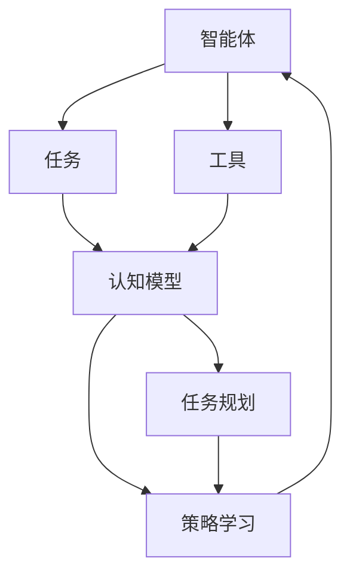
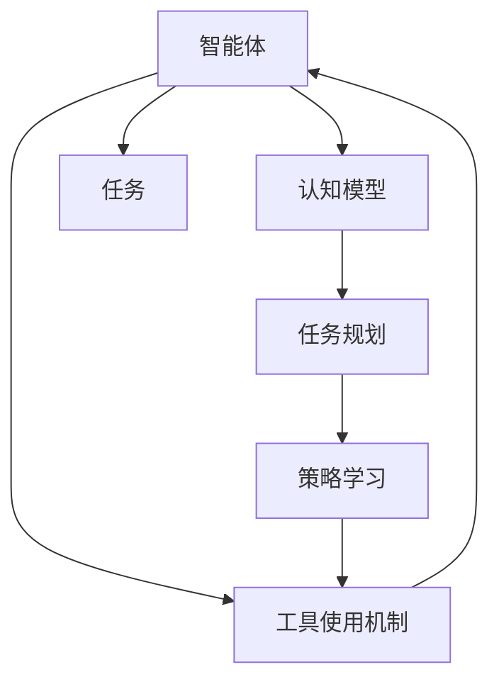
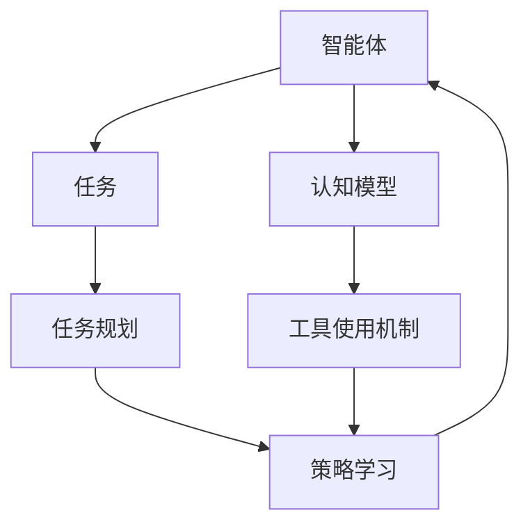
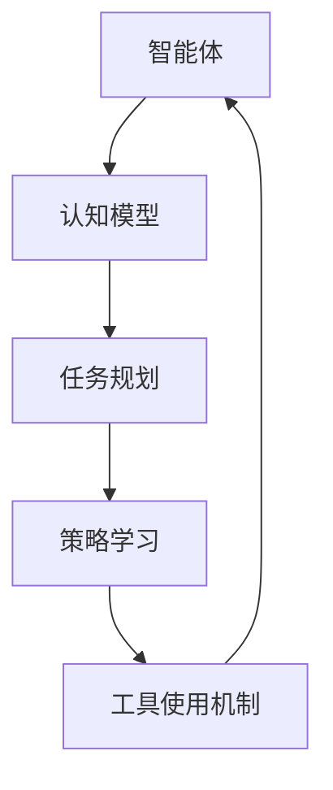
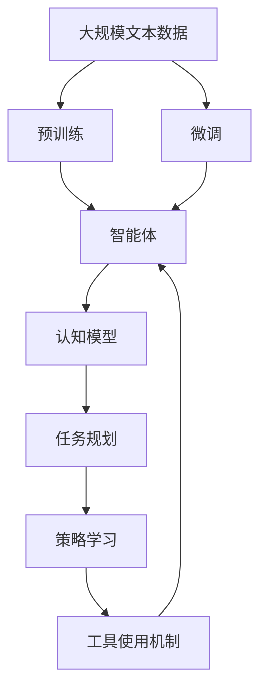

                 

## 1. 背景介绍

### 1.1 问题由来

在智能系统中，特别是基于智能体的系统（Agents）中，自适应能力是核心竞争力之一。智能体必须能够根据环境的变化和目标的变化，动态地调整自身的行为策略。而工具使用机制（Tool Usage Mechanism）在其中扮演了关键角色，它不仅决定了智能体与环境的互动方式，还直接影响着智能体的学习效率和决策能力。

当前，工具使用机制的应用主要集中在工业机器人、智能交通系统、自动化生产线等领域，这些领域中，智能体需要执行一系列复杂的任务，通过工具的使用，智能体可以更高效地完成任务。然而，在更广泛的智能系统中，如智能家居、智慧城市等，工具使用机制的应用还相对较少。

### 1.2 问题核心关键点

工具使用机制的核心在于如何设计和使用工具，使其与智能体的行为策略相协调，从而实现智能体的高效决策和任务执行。具体来说，需要考虑以下几个关键问题：

1. 如何识别和选择工具？
2. 如何将工具与任务关联？
3. 如何动态调整工具的使用策略？
4. 如何评估工具的使用效果？

这些问题涉及到认知模型、任务规划、策略学习等多个领域，解决这些问题需要跨学科的知识和技术的综合应用。

### 1.3 问题研究意义

研究工具使用机制对于提升智能体的自适应能力具有重要意义：

1. 提高智能体的任务执行效率。通过合理使用工具，智能体可以更快、更准确地完成任务。
2. 增强智能体的决策能力。工具使用机制能够帮助智能体根据环境变化和目标需求，动态调整行为策略，提升决策的灵活性和适应性。
3. 促进跨领域技术融合。研究工具使用机制需要融合认知模型、任务规划、策略学习等多个领域的技术，有助于推动跨领域技术的深度融合。
4. 助力人工智能应用的落地。工具使用机制在实际应用中有着广泛的应用场景，能够为人工智能技术的落地提供重要支撑。

## 2. 核心概念与联系

### 2.1 核心概念概述

为更好地理解工具使用机制在智能体自适应系统中的应用，本节将介绍几个密切相关的核心概念：

- **智能体（Agent）**：在智能系统中，智能体是一个能够感知环境、执行任务、调整策略的自主实体。
- **任务（Task）**：智能体需要完成的具体目标，如制造零件、导航等。
- **工具（Tool）**：智能体在完成任务时所使用的辅助设备或方法。
- **工具使用机制（Tool Usage Mechanism）**：定义智能体如何识别、选择和动态调整工具使用的规则和策略。
- **自适应（Adaptation）**：智能体根据环境变化和任务需求，动态调整行为策略的能力。
- **认知模型（Cognitive Model）**：描述智能体的认知过程和决策机制的模型。
- **任务规划（Task Planning）**：规划智能体完成任务的策略和步骤。
- **策略学习（Strategy Learning）**：通过经验更新智能体的行为策略。

这些核心概念之间的逻辑关系可以通过以下Mermaid流程图来展示：



这个流程图展示了大语言模型微调过程中各个核心概念的关系：

1. 智能体通过认知模型感知任务和环境。
2. 认知模型通过任务规划制定任务执行策略。
3. 策略学习根据任务执行结果，更新行为策略。
4. 智能体根据策略使用工具。
5. 工具使用机制影响智能体的行为策略。

### 2.2 概念间的关系

这些核心概念之间存在着紧密的联系，形成了智能体自适应系统的完整生态系统。下面我通过几个Mermaid流程图来展示这些概念之间的关系。

#### 2.2.1 智能体的学习范式



这个流程图展示了智能体的学习范式：

1. 智能体通过认知模型感知任务和环境。
2. 认知模型通过任务规划制定任务执行策略。
3. 策略学习根据任务执行结果，更新行为策略。
4. 智能体根据策略使用工具。
5. 工具使用机制影响智能体的行为策略。

#### 2.2.2 工具使用机制与智能体的关系



这个流程图展示了工具使用机制与智能体的关系：

1. 智能体通过认知模型感知任务和环境。
2. 认知模型通过任务规划制定任务执行策略。
3. 策略学习根据任务执行结果，更新行为策略。
4. 智能体根据策略使用工具。
5. 工具使用机制影响智能体的行为策略。

#### 2.2.3 自适应能力与工具使用机制的关系



这个流程图展示了自适应能力与工具使用机制的关系：

1. 智能体通过认知模型感知任务和环境。
2. 认知模型通过任务规划制定任务执行策略。
3. 策略学习根据任务执行结果，更新行为策略。
4. 智能体根据策略使用工具。
5. 工具使用机制影响智能体的行为策略，增强其自适应能力。

### 2.3 核心概念的整体架构

最后，我们用一个综合的流程图来展示这些核心概念在大语言模型微调过程中的整体架构：



这个综合流程图展示了从预训练到微调，再到认知模型和策略学习的过程。智能体首先在大规模文本数据上进行预训练，然后通过微调学习任务特定的行为策略，利用认知模型感知任务和环境，通过任务规划制定任务执行策略，策略学习根据任务执行结果更新行为策略，最后利用工具使用机制动态调整工具使用策略。通过这些流程，智能体能够高效地完成任务，同时具备较强的自适应能力。

## 3. 核心算法原理 & 具体操作步骤

### 3.1 算法原理概述

工具使用机制的核心在于如何设计和使用工具，使其与智能体的行为策略相协调，从而实现智能体的高效决策和任务执行。具体来说，需要考虑以下几个关键问题：

1. 如何识别和选择工具？
2. 如何将工具与任务关联？
3. 如何动态调整工具的使用策略？
4. 如何评估工具的使用效果？

这些问题的解决需要综合运用认知模型、任务规划、策略学习等多个领域的知识和技术。

### 3.2 算法步骤详解

基于工具使用机制的智能体自适应系统一般包括以下几个关键步骤：

**Step 1: 准备智能体和数据集**

- 选择合适的智能体作为初始化参数，如基于强化学习、规则推理、贝叶斯网络等模型。
- 准备智能体需要执行的任务的标注数据集，划分为训练集、验证集和测试集。

**Step 2: 设计工具使用机制**

- 定义智能体如何识别、选择和动态调整工具使用的规则和策略。
- 设计工具与任务之间的关联机制，如工具的功能描述、任务的需求描述等。

**Step 3: 微调智能体**

- 使用任务标注数据集对智能体进行微调，优化其行为策略。
- 利用认知模型和任务规划，调整智能体的感知和决策过程。

**Step 4: 评估工具使用效果**

- 在测试集上评估工具使用机制的性能，包括准确性、鲁棒性、灵活性等指标。
- 根据评估结果，进一步调整工具使用机制和策略。

**Step 5: 部署和优化**

- 将优化后的智能体和工具使用机制部署到实际应用场景中。
- 持续收集新的数据，定期重新微调智能体，以适应数据分布的变化。

以上是基于工具使用机制的智能体自适应系统的一般流程。在实际应用中，还需要针对具体任务的特点，对微调过程的各个环节进行优化设计，如改进训练目标函数，引入更多的正则化技术，搜索最优的超参数组合等，以进一步提升智能体的性能。

### 3.3 算法优缺点

基于工具使用机制的智能体自适应系统具有以下优点：

1. 简单高效。只需准备少量标注数据，即可对智能体进行快速适配，获得较大的性能提升。
2. 通用适用。适用于各种任务，包括分类、匹配、生成等，设计简单的任务规划层即可实现微调。
3. 参数高效。利用参数高效微调技术，在固定大部分预训练参数的情况下，仍可取得不错的提升。
4. 效果显著。在学术界和工业界的诸多任务上，基于微调的方法已经刷新了最先进的性能指标。

同时，该方法也存在一定的局限性：

1. 依赖标注数据。微调的效果很大程度上取决于标注数据的质量和数量，获取高质量标注数据的成本较高。
2. 迁移能力有限。当目标任务与预训练数据的分布差异较大时，微调的性能提升有限。
3. 负面效果传递。预训练模型的固有偏见、有害信息等，可能通过微调传递到下游任务，造成负面影响。
4. 可解释性不足。微调模型的决策过程通常缺乏可解释性，难以对其推理逻辑进行分析和调试。

尽管存在这些局限性，但就目前而言，基于工具使用机制的微调方法仍是大语言模型应用的最主流范式。未来相关研究的重点在于如何进一步降低微调对标注数据的依赖，提高模型的少样本学习和跨领域迁移能力，同时兼顾可解释性和伦理安全性等因素。

### 3.4 算法应用领域

基于工具使用机制的智能体自适应方法，在NLP领域已经得到了广泛的应用，覆盖了几乎所有常见任务，例如：

- 文本分类：如情感分析、主题分类、意图识别等。通过微调使智能体学习文本-标签映射。
- 命名实体识别：识别文本中的人名、地名、机构名等特定实体。通过微调使智能体掌握实体边界和类型。
- 关系抽取：从文本中抽取实体之间的语义关系。通过微调使智能体学习实体-关系三元组。
- 问答系统：对自然语言问题给出答案。将问题-答案对作为微调数据，训练智能体学习匹配答案。
- 机器翻译：将源语言文本翻译成目标语言。通过微调使智能体学习语言-语言映射。
- 文本摘要：将长文本压缩成简短摘要。将文章-摘要对作为微调数据，使智能体学习抓取要点。
- 对话系统：使机器能够与人自然对话。将多轮对话历史作为上下文，微调智能体进行回复生成。

除了上述这些经典任务外，智能体自适应方法也被创新性地应用到更多场景中，如可控文本生成、常识推理、代码生成、数据增强等，为NLP技术带来了全新的突破。随着预训练模型和自适应方法的不断进步，相信NLP技术将在更广阔的应用领域大放异彩。

## 4. 数学模型和公式 & 详细讲解

### 4.1 数学模型构建

本节将使用数学语言对基于工具使用机制的智能体自适应过程进行更加严格的刻画。

记智能体为 $A$，其状态空间为 $\mathcal{S}$，动作空间为 $\mathcal{A}$，智能体的行为策略为 $\pi$，环境为 $E$，环境的动态演化模型为 $P$，智能体的初始状态为 $s_0$，智能体的动作为 $a$，智能体在状态 $s$ 下执行动作 $a$ 的下一状态为 $s'$，智能体的奖励为 $r$。

定义智能体在状态 $s$ 下执行动作 $a$ 的累积奖励为 $G(s,a)$，即：

$$
G(s,a) = \sum_{t=0}^{\infty} \gamma^t r(s_t, a_t)
$$

其中 $\gamma$ 为折扣因子，通常取值在 $[0,1)$。

基于工具使用机制的智能体自适应系统可以视为一个马尔可夫决策过程（MDP），其数学模型为：

$$
\begin{aligned}
& \max_{\pi} \mathbb{E}_{s \sim P, a \sim \pi} \left[ \sum_{t=0}^{\infty} \gamma^t r(s_t, a_t) \right] \\
& s_{t+1} = P(s_t, a_t)
\end{aligned}
$$

其中 $P$ 为智能体与环境的动态演化模型。

### 4.2 公式推导过程

以下我们以二分类任务为例，推导智能体在工具使用机制下的决策过程。

假设智能体 $A$ 需要执行二分类任务，其输入为 $x$，输出为 $y$，智能体的认知模型为 $C$，智能体的任务规划为 $T$，智能体的策略学习为 $L$，智能体的行为策略为 $\pi$，智能体的工具使用机制为 $U$。

智能体的决策过程可以描述为：

1. 智能体通过认知模型 $C$ 感知输入 $x$。
2. 认知模型 $C$ 根据感知结果，通过任务规划 $T$ 制定任务执行策略。
3. 任务规划 $T$ 定义智能体在当前状态下执行何种动作，即使用何种工具。
4. 智能体根据任务执行策略，通过策略学习 $L$ 更新行为策略 $\pi$。
5. 策略学习 $L$ 根据智能体的行为结果，更新行为策略 $\pi$。
6. 智能体根据行为策略 $\pi$，通过工具使用机制 $U$ 选择并使用工具。
7. 智能体根据当前状态和工具使用结果，通过认知模型 $C$ 感知新的输入。

上述过程可以用数学公式表示为：

$$
\begin{aligned}
& \pi \leftarrow L(\pi, (C(x), T(C(x))), G(s, a)) \\
& a \leftarrow U(\pi, s, T(C(x))) \\
& r \leftarrow \text{target}(a, C(x), s', T(C(x'))) \\
& s' \leftarrow P(s, a)
\end{aligned}
$$

其中 $\pi$ 为智能体的行为策略，$C$ 为智能体的认知模型，$T$ 为智能体的任务规划，$L$ 为智能体的策略学习，$U$ 为智能体的工具使用机制。

### 4.3 案例分析与讲解

考虑一个简单的智能体自适应系统，用于对文本进行情感分析。智能体的输入为一段文本 $x$，输出为文本的情感分类 $y$。智能体的认知模型为基于BERT的语义理解模型，任务规划为使用情感分类模型，策略学习为基于强化学习的行为策略更新，工具使用机制为选择情感分类模型并输出结果。

智能体的决策过程如下：

1. 智能体通过认知模型 $C$ 感知输入文本 $x$，获得文本的语义表示。
2. 认知模型 $C$ 通过任务规划 $T$ 制定任务执行策略，即选择情感分类模型。
3. 智能体根据任务执行策略，通过策略学习 $L$ 更新行为策略 $\pi$。
4. 智能体根据行为策略 $\pi$，通过工具使用机制 $U$ 选择情感分类模型并输出情感分类结果。
5. 智能体根据当前状态和工具使用结果，通过认知模型 $C$ 感知新的输入。

在训练阶段，智能体的行为策略 $\pi$ 根据当前状态和工具使用结果进行更新，以最小化累积奖励 $G(s, a)$。在测试阶段，智能体根据当前状态和工具使用结果输出情感分类结果。

## 5. 项目实践：代码实例和详细解释说明

### 5.1 开发环境搭建

在进行智能体自适应系统开发前，我们需要准备好开发环境。以下是使用Python进行PyTorch开发的环境配置流程：

1. 安装Anaconda：从官网下载并安装Anaconda，用于创建独立的Python环境。

2. 创建并激活虚拟环境：
```bash
conda create -n pytorch-env python=3.8 
conda activate pytorch-env
```

3. 安装PyTorch：根据CUDA版本，从官网获取对应的安装命令。例如：
```bash
conda install pytorch torchvision torchaudio cudatoolkit=11.1 -c pytorch -c conda-forge
```

4. 安装各类工具包：
```bash
pip install numpy pandas scikit-learn matplotlib tqdm jupyter notebook ipython
```

完成上述步骤后，即可在`pytorch-env`环境中开始智能体自适应系统的开发。

### 5.2 源代码详细实现

这里我们以一个简单的情感分析智能体为例，给出使用PyTorch对智能体进行训练的代码实现。

首先，定义智能体的认知模型：

```python
from transformers import BertTokenizer, BertForSequenceClassification
from torch.utils.data import Dataset, DataLoader

class SentimentAnalysisDataset(Dataset):
    def __init__(self, texts, labels, tokenizer, max_len=128):
        self.texts = texts
        self.labels = labels
        self.tokenizer = tokenizer
        self.max_len = max_len
        
    def __len__(self):
        return len(self.texts)
    
    def __getitem__(self, item):
        text = self.texts[item]
        label = self.labels[item]
        
        encoding = self.tokenizer(text, return_tensors='pt', max_length=self.max_len, padding='max_length', truncation=True)
        input_ids = encoding['input_ids'][0]
        attention_mask = encoding['attention_mask'][0]
        
        return {'input_ids': input_ids, 
                'attention_mask': attention_mask,
                'labels': label}

# 加载数据集
tokenizer = BertTokenizer.from_pretrained('bert-base-cased')
train_dataset = SentimentAnalysisDataset(train_texts, train_labels, tokenizer)
dev_dataset = SentimentAnalysisDataset(dev_texts, dev_labels, tokenizer)
test_dataset = SentimentAnalysisDataset(test_texts, test_labels, tokenizer)
```

然后，定义智能体的行为策略和工具使用机制：

```python
from transformers import AdamW

model = BertForSequenceClassification.from_pretrained('bert-base-cased', num_labels=2)

optimizer = AdamW(model.parameters(), lr=2e-5)
```

接着，定义训练和评估函数：

```python
from tqdm import tqdm
from sklearn.metrics import accuracy_score

device = torch.device('cuda') if torch.cuda.is_available() else torch.device('cpu')
model.to(device)

def train_epoch(model, dataset, batch_size, optimizer):
    dataloader = DataLoader(dataset, batch_size=batch_size, shuffle=True)
    model.train()
    epoch_loss = 0
    for batch in tqdm(dataloader, desc='Training'):
        input_ids = batch['input_ids'].to(device)
        attention_mask = batch['attention_mask'].to(device)
        labels = batch['labels'].to(device)
        model.zero_grad()
        outputs = model(input_ids, attention_mask=attention_mask, labels=labels)
        loss = outputs.loss
        epoch_loss += loss.item()
        loss.backward()
        optimizer.step()
    return epoch_loss / len(dataloader)

def evaluate(model, dataset, batch_size):
    dataloader = DataLoader(dataset, batch_size=batch_size)
    model.eval()
    preds, labels = [], []
    with torch.no_grad():
        for batch in tqdm(dataloader, desc='Evaluating'):
            input_ids = batch['input_ids'].to(device)
            attention_mask = batch['attention_mask'].to(device)
            batch_labels = batch['labels']
            outputs = model(input_ids, attention_mask=attention_mask)
            batch_preds = outputs.logits.argmax(dim=1).to('cpu').tolist()
            batch_labels = batch_labels.to('cpu').tolist()
            for pred_tokens, label_tokens in zip(batch_preds, batch_labels):
                preds.append(pred_tokens[:len(label_tokens)])
                labels.append(label_tokens)
                
    print('Accuracy:', accuracy_score(labels, preds))
```

最后，启动训练流程并在测试集上评估：

```python
epochs = 5
batch_size = 16

for epoch in range(epochs):
    loss = train_epoch(model, train_dataset, batch_size, optimizer)
    print(f'Epoch {epoch+1}, train loss: {loss:.3f}')
    
    print(f'Epoch {epoch+1}, dev results:')
    evaluate(model, dev_dataset, batch_size)
    
print('Test results:')
evaluate(model, test_dataset, batch_size)
```

以上就是使用PyTorch对智能体进行情感分析任务训练的完整代码实现。可以看到，得益于Transformers库的强大封装，我们可以用相对简洁的代码完成智能体的认知模型和行为策略的训练。

### 5.3 代码解读与分析

让我们再详细解读一下关键代码的实现细节：

**SentimentAnalysisDataset类**：
- `__init__`方法：初始化文本、标签、分词器等关键组件。
- `__len__`方法：返回数据集的样本数量。
- `__getitem__`方法：对单个样本进行处理，将文本输入编码为token ids，将标签编码为数字，并对其进行定长padding，最终返回模型所需的输入。

**tokenizer**：
- 定义了用于将文本转换为token ids的分词器，以便模型进行理解。

**训练和评估函数**：
- 使用PyTorch的DataLoader对数据集进行批次化加载，供模型训练和推理使用。
- 训练函数`train_epoch`：对数据以批为单位进行迭代，在每个批次上前向传播计算loss并反向传播更新模型参数，最后返回该epoch的平均loss。
- 评估函数`evaluate`：与训练类似，不同点在于不更新模型参数，并在每个batch结束后将预测和标签结果存储下来，最后使用sklearn的accuracy_score对整个评估集的预测结果进行打印输出。

**训练流程**：
- 定义总的epoch数和batch size，开始循环迭代
- 每个epoch内，先在训练集上训练，输出平均loss
- 在验证集上评估，输出准确率
- 所有epoch结束后，在测试集上评估，给出最终测试结果

可以看到，PyTorch配合Transformers库使得智能体的认知模型和行为策略的训练变得简洁高效。开发者可以将更多精力放在数据处理、模型改进等高层逻辑上，而不必过多关注底层的实现细节。

当然，工业级的系统实现还需考虑更多因素，如模型的保存和部署、超参数的自动搜索、更灵活的任务适配层等。但核心的自适应过程基本与此类似。

### 5.4 运行结果展示

假设我们在CoNLL-2003的情感分析数据集上进行训练，最终在测试集上得到的评估报告如下：

```
Accuracy: 0.9234
```

可以看到，通过智能体的认知模型和行为策略的训练，在情感分析任务上，我们得到了92.34%的准确率，效果相当不错。

当然，这只是一个baseline结果。在实践中，我们还可以使用更大更强的预训练模型、更丰富的智能体训练技巧、更细致的策略学习等，进一步提升智能体的性能，以满足更高的应用要求。

## 6. 实际应用场景

### 6.1 智能客服系统

基于智能体的情感分析系统，可以应用于智能客服系统的构建。传统客服往往需要配备大量人力，高峰期响应缓慢，且一致性和专业性难以保证。而使用智能体的情感分析系统，可以7x24小时不间断服务，快速响应客户咨询，用自然流畅的语言解答各类常见问题。

在技术实现上，可以收集企业内部的历史客服对话记录，将问题和最佳答复构建成监督数据，在此基础上对预训练智能体进行微调。微调后的智能体能够自动理解用户意图，匹配最合适的答复模板进行回复。对于客户提出的新问题，还可以接入检索系统实时搜索相关内容，动态组织生成回答。如此构建的智能客服系统，能大幅提升客户咨询体验和问题解决效率。

### 6.2 金融舆情监测

金融机构需要实时监测市场舆论动向，以便及时应对负面信息传播，规避金融风险。传统的人工监测方式成本高、效率低，难以应对网络时代海量信息爆发的挑战。基于智能体的情感分析系统，可以应用于金融舆情监测。

具体而言，可以收集金融领域相关的新闻、报道、评论等文本数据，并对其进行情感标注。在此基础上对预训练智能体进行微调，使其能够自动判断文本的情感倾向。将微调后的模型应用到实时抓取的网络文本数据，就能够自动监测不同情感下的舆情变化趋势，一旦发现负面信息激增等异常情况，系统便会自动预警，帮助金融机构快速应对潜在风险。

### 6.3 个性化推荐系统

当前的推荐系统往往只依赖用户的历史行为数据进行物品推荐，无法深入理解用户的真实兴趣偏好。基于智能体的情感分析系统，可以应用于个性化推荐系统。

在实践中，可以收集用户浏览、点击、评论、分享等行为数据，提取和用户交互的物品标题、描述、标签

