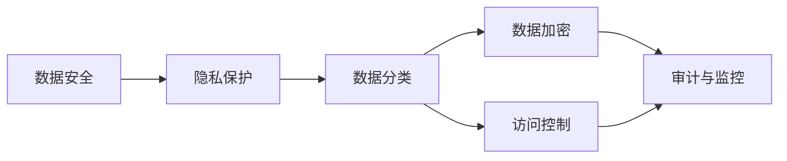
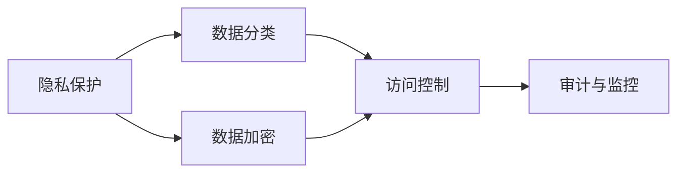
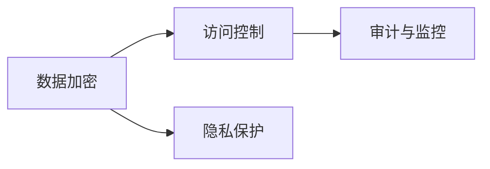
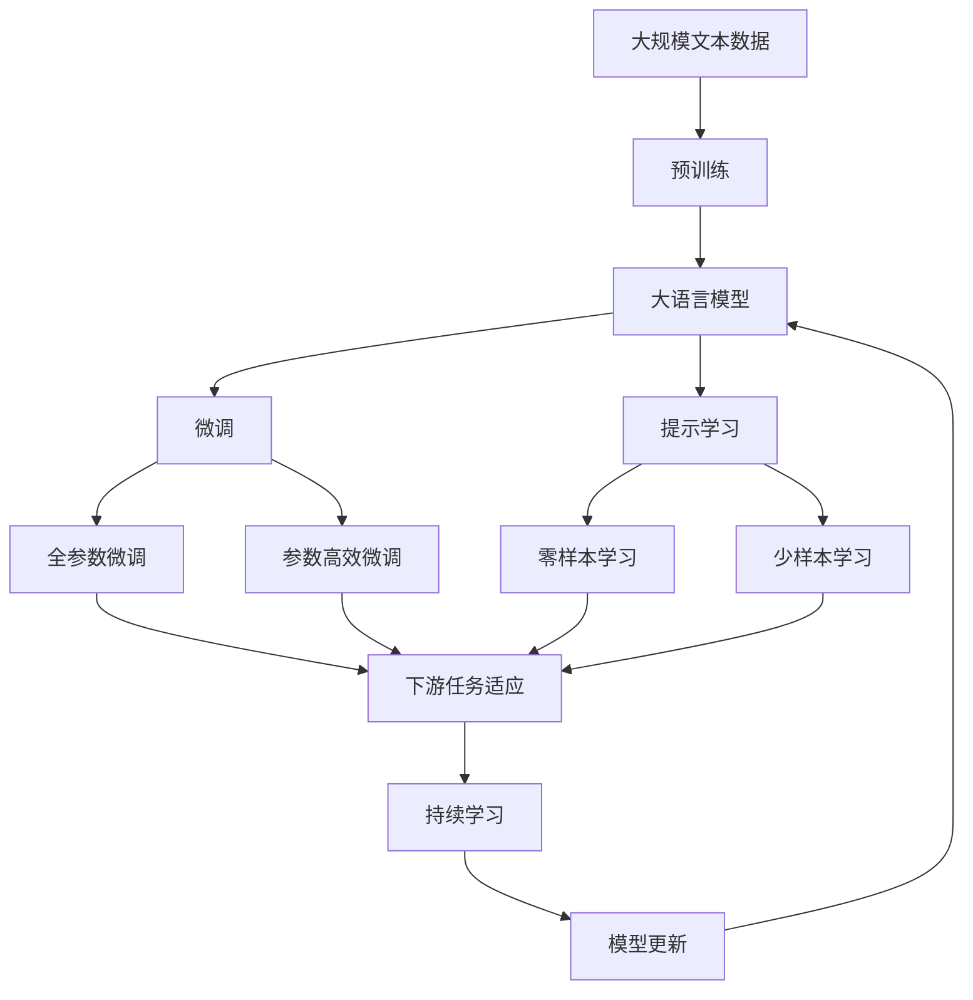

                 

# 平台经济的数据安全策略：如何制定数据安全策略？

## 1. 背景介绍

### 1.1 问题由来

平台经济在数字时代蓬勃发展，成为支撑全球经济的重要引擎。平台经济的蓬勃发展离不开数据的支撑，数据已成为各大平台的核心资产。然而，随着平台规模的不断扩大，平台面临的数据安全风险也在不断增加。数据泄露、数据滥用等安全事件频发，严重威胁到用户权益和平台声誉。因此，制定科学合理的数据安全策略，是各大平台亟需解决的重要问题。

### 1.2 问题核心关键点

数据安全策略的制定需要考虑以下核心关键点：

- **数据识别与分类**：识别平台中的敏感数据，并根据其重要性和敏感性进行分类，为后续的数据保护措施提供依据。
- **数据保护机制**：建立适合平台自身的隐私保护机制，包括数据加密、去标识化、访问控制等。
- **合规性要求**：满足各种法律法规和行业标准，如GDPR、CCPA等。
- **风险管理与响应**：制定应急响应机制，建立数据安全管理体系，实时监控和评估数据安全风险。
- **技术与组织协同**：结合技术手段和组织管理，确保数据安全策略的实施和执行。

### 1.3 问题研究意义

平台经济的数据安全策略研究，对平台经济的健康发展具有重要意义：

- **保障用户权益**：数据安全策略的制定和实施，能够有效保护用户隐私和数据安全，避免数据滥用和泄露，保障用户权益。
- **提升平台信任度**：完善的数据安全策略，能够增强用户对平台的信任，提升平台的用户黏性和口碑。
- **促进合规经营**：遵守数据保护法律法规，避免因数据安全事件导致的高额罚款和法律诉讼风险。
- **推动技术创新**：数据安全策略的制定需要结合前沿技术和标准，促进数据保护技术的发展。
- **维护经济秩序**：在平台经济中，数据的安全有序流动，有助于维护经济秩序，促进社会公平。

## 2. 核心概念与联系

### 2.1 核心概念概述

为更好地理解平台经济的数据安全策略，本节将介绍几个密切相关的核心概念：

- **数据安全**：指保护数据不受未授权访问、泄露、篡改、丢失等风险的保护过程。
- **隐私保护**：保护个人数据的隐私，确保个人数据不被滥用、泄露等。
- **数据分类**：根据数据的重要性和敏感性，将数据划分为不同类别，进行有针对性的保护。
- **数据加密**：通过加密技术，保护数据在传输和存储过程中的机密性。
- **访问控制**：控制用户对数据的访问权限，确保只有授权用户才能访问敏感数据。
- **审计与监控**：通过审计和监控手段，实时检测和应对数据安全事件，提升数据安全防护能力。

这些核心概念之间的逻辑关系可以通过以下Mermaid流程图来展示：



这个流程图展示了大数据安全的主要组成及其之间的联系：数据安全是一个整体，隐私保护、数据分类、数据加密、访问控制和审计与监控都是其重要组成部分，它们相互配合，共同构成完整的数据安全防护体系。

### 2.2 概念间的关系

这些核心概念之间存在着紧密的联系，形成了数据安全策略的完整生态系统。下面我们通过几个Mermaid流程图来展示这些概念之间的关系。

#### 2.2.1 数据安全范式


这个流程图展示了大数据安全的主要范式。数据分类是数据安全的第一步，隐私保护、数据加密、访问控制和审计与监控都是基于数据分类的进一步细化和实施。

#### 2.2.2 隐私保护与数据分类



这个流程图展示了隐私保护与数据分类之间的关系。隐私保护是基于数据分类的，将个人数据进行分类，然后对不同类别的数据采取不同的隐私保护措施，如数据加密、访问控制等。

#### 2.2.3 数据加密与访问控制



这个流程图展示了数据加密与访问控制之间的关系。数据加密是保护数据在传输和存储过程中的机密性，而访问控制则是控制用户对数据的访问权限，两者共同构成数据安全的基础。

### 2.3 核心概念的整体架构

最后，我们用一个综合的流程图来展示这些核心概念在大数据安全中的整体架构：



这个综合流程图展示了从预训练到微调，再到持续学习的完整过程。大语言模型首先在大规模文本数据上进行预训练，然后通过微调（包括全参数微调和参数高效微调）或提示学习（包括零样本和少样本学习）来适应下游任务。最后，通过持续学习技术，模型可以不断更新和适应新的任务和数据。 通过这些流程图，我们可以更清晰地理解大数据安全过程中各个核心概念的关系和作用，为后续深入讨论具体的安全策略和措施奠定基础。

## 3. 核心算法原理 & 具体操作步骤
### 3.1 算法原理概述

平台经济的数据安全策略，本质上是一个基于风险评估的数据保护过程。其核心思想是：通过风险评估确定数据的重要性和敏感性，然后根据不同的分类级别，采取相应的隐私保护措施，以最小化数据泄露和滥用的风险。

具体而言，数据安全策略的制定分为以下几个步骤：

1. **数据识别与分类**：对平台中的数据进行全面识别和分类，包括用户数据、商业数据、公共数据等。
2. **风险评估**：对不同类别的数据进行风险评估，确定其敏感程度和泄露风险。
3. **隐私保护措施**：根据风险评估结果，采取相应的隐私保护措施，如数据加密、去标识化、访问控制等。
4. **合规性要求**：满足各种法律法规和行业标准，如GDPR、CCPA等。
5. **风险管理与响应**：建立应急响应机制，实时监控和评估数据安全风险，及时应对数据安全事件。
6. **技术与组织协同**：结合技术手段和组织管理，确保数据安全策略的实施和执行。

### 3.2 算法步骤详解

以下是平台经济数据安全策略的具体操作步骤：

#### 3.2.1 数据识别与分类

**步骤1：数据识别**  
- 对平台中的所有数据进行全面扫描，识别出所有的数据存储位置，包括数据库、云存储、数据仓库等。
- 使用数据分类工具或算法对数据进行初步分类，将数据分为个人数据、商业数据、公共数据等不同类别。

**步骤2：数据分类**  
- 根据数据的敏感程度和重要性，对初步分类的数据进行进一步细化。例如，将个人数据细分为姓名、身份证号、电话号码等，将商业数据细分为客户信息、订单信息、交易记录等。
- 对不同类别的数据制定不同的保护策略，确保关键数据得到更高级别的保护。

#### 3.2.2 风险评估

**步骤3：风险评估**  
- 对每个数据类别进行详细的风险评估，包括数据泄露的风险、数据滥用的风险等。
- 使用定量或定性方法，如信息熵、敏感度评估、风险矩阵等，对数据风险进行综合评估。

**步骤4：确定风险级别**  
- 根据风险评估的结果，将数据分为低、中、高风险等级。
- 对高风险数据采取更为严格的保护措施，确保数据安全。

#### 3.2.3 隐私保护措施

**步骤5：隐私保护**  
- 根据风险级别和数据分类，采取相应的隐私保护措施。例如，对于高风险数据，采用数据加密、去标识化等措施。
- 对于低风险数据，采用简单的访问控制措施即可。

**步骤6：访问控制**  
- 对不同级别的数据设定不同的访问权限，确保只有授权用户才能访问高风险数据。
- 使用基于角色的访问控制（RBAC）等技术，管理用户对数据的访问权限。

#### 3.2.4 合规性要求

**步骤7：满足合规要求**  
- 确保数据保护措施符合各种法律法规和行业标准，如GDPR、CCPA等。
- 定期审查和更新数据保护措施，确保合规性。

#### 3.2.5 风险管理与响应

**步骤8：风险管理**  
- 建立数据安全管理体系，实时监控和评估数据安全风险。
- 使用安全事件管理系统，对数据安全事件进行记录、分析和处理。

**步骤9：应急响应**  
- 建立应急响应机制，对数据安全事件进行快速响应和处理。
- 定期演练应急响应流程，确保在发生数据泄露等安全事件时，能够迅速采取行动。

#### 3.2.6 技术与组织协同

**步骤10：技术与组织协同**  
- 结合技术手段和组织管理，确保数据安全策略的实施和执行。
- 定期培训和更新员工的数据保护意识和技能，提高组织的数据安全防护能力。

### 3.3 算法优缺点

平台经济的数据安全策略具有以下优点：

- **系统性**：通过数据识别与分类、风险评估、隐私保护等步骤，形成系统的数据安全策略。
- **科学性**：基于风险评估的数据安全策略，能够科学合理地确定数据保护措施。
- **合规性**：确保数据保护措施符合法律法规和行业标准，降低法律风险。

同时，该策略也存在以下缺点：

- **复杂性**：数据安全策略的制定和实施需要大量资源和人力。
- **动态性**：数据安全风险不断变化，需要持续监控和调整策略。
- **成本高**：数据保护措施的实施需要高昂的资源投入。

### 3.4 算法应用领域

平台经济的数据安全策略，主要应用于以下领域：

- **电商平台**：保护用户个人信息和交易记录，防范数据泄露和滥用。
- **金融平台**：保护客户隐私和交易数据，防范金融风险和数据泄露。
- **社交平台**：保护用户隐私和社交数据，防范数据滥用和泄露。
- **医疗平台**：保护患者隐私和医疗数据，防范数据泄露和滥用。
- **公共服务平台**：保护用户隐私和公共数据，防范数据滥用和泄露。

## 4. 数学模型和公式 & 详细讲解 & 举例说明

### 4.1 数学模型构建

数据安全策略的制定，涉及到多个数学模型和公式。下面以风险评估和隐私保护为例，详细讲解其中的数学模型和公式。

#### 4.1.1 风险评估模型

风险评估模型主要使用信息熵和敏感度评估等方法。其中，信息熵用于衡量数据泄露的潜在损失，敏感度评估用于衡量数据的重要性和敏感性。

**风险评估公式**：

$$ R = \frac{S}{C} \times P $$

其中，$R$ 表示风险，$S$ 表示数据敏感度，$C$ 表示数据泄露潜在损失，$P$ 表示数据泄露概率。

#### 4.1.2 隐私保护模型

隐私保护模型主要使用数据加密和去标识化等方法。其中，数据加密用于保护数据在传输和存储过程中的机密性，去标识化用于保护数据在处理和使用过程中的匿名性。

**数据加密公式**：

$$ E(P) = C $$

其中，$P$ 表示明文数据，$C$ 表示密文数据。

**去标识化公式**：

$$ T = \mathbb{K}(P) $$

其中，$T$ 表示去标识化后的数据，$\mathbb{K}$ 表示去标识化算法。

### 4.2 公式推导过程

以下我们以信息熵和敏感度评估为例，推导相应的数学模型和公式。

#### 4.2.1 信息熵模型

信息熵（Shannon Entropy）用于衡量数据泄露的潜在损失，其公式为：

$$ H(X) = -\sum_{x} P(x) \log_2 P(x) $$

其中，$H(X)$ 表示数据集$X$的信息熵，$P(x)$ 表示数据集$X$中元素$x$的概率。

**推导过程**：

1. 信息熵的定义：信息熵是衡量信息不确定性的度量，越小表示信息越确定，越大表示信息越不确定。
2. 信息熵的计算：对于离散的数据集$X$，其信息熵$H(X)$可以通过概率分布$P(x)$计算得到。

**案例分析与讲解**：

假设平台中有一个包含100个用户名的数据集，其中90个为真实姓名，10个为虚假姓名。则数据集$X$的信息熵$H(X)$为：

$$ H(X) = -\frac{90}{100} \log_2 \frac{90}{100} - \frac{10}{100} \log_2 \frac{10}{100} = 0.5 $$

这表明，平台中90%的真实姓名和10%的虚假姓名具有相同的概率分布，因此数据集$X$的信息熵为0.5。

#### 4.2.2 敏感度评估模型

敏感度评估用于衡量数据的重要性和敏感性。其公式为：

$$ S = f(x_1, x_2, ..., x_n) $$

其中，$S$ 表示数据集$X$的敏感度，$x_1, x_2, ..., x_n$ 表示数据集$X$中的元素。

**推导过程**：

1. 敏感度的定义：敏感度是衡量数据集重要性和敏感性的度量，越大表示数据集越重要和敏感。
2. 敏感度的计算：对于不同的数据集，其敏感度$f(x_1, x_2, ..., x_n)$可以通过专家评估、历史数据统计等方式计算得到。

**案例分析与讲解**：

假设平台中有两个数据集，数据集A包含用户的姓名、身份证号、电话等信息，数据集B仅包含用户的姓名和年龄。则数据集A的敏感度$S_A$为：

$$ S_A = f(姓名, 身份证号, 电话) > f(姓名, 年龄) $$

这表明，数据集A中包含更多的敏感信息，因此其敏感度高于数据集B。

### 4.3 案例分析与讲解

假设某电商平台的数据安全策略如下：

**步骤1：数据识别与分类**

- 对平台中的所有数据进行全面扫描，识别出所有的数据存储位置。
- 使用数据分类工具对数据进行初步分类，将数据分为个人数据、商业数据、公共数据等不同类别。

**步骤2：风险评估**

- 对每个数据类别进行详细的风险评估，包括数据泄露的风险、数据滥用的风险等。
- 使用信息熵和敏感度评估等方法，对数据风险进行综合评估。

**步骤3：隐私保护措施**

- 根据风险评估结果，采取相应的隐私保护措施。例如，对于高风险数据，采用数据加密、去标识化等措施。
- 对于低风险数据，采用简单的访问控制措施即可。

**步骤4：访问控制**

- 对不同级别的数据设定不同的访问权限，确保只有授权用户才能访问高风险数据。
- 使用基于角色的访问控制（RBAC）等技术，管理用户对数据的访问权限。

**步骤5：合规性要求**

- 确保数据保护措施符合各种法律法规和行业标准，如GDPR、CCPA等。
- 定期审查和更新数据保护措施，确保合规性。

## 5. 项目实践：代码实例和详细解释说明

### 5.1 开发环境搭建

在进行数据安全策略开发前，我们需要准备好开发环境。以下是使用Python进行开发的环境配置流程：

1. 安装Anaconda：从官网下载并安装Anaconda，用于创建独立的Python环境。

2. 创建并激活虚拟环境：
```bash
conda create -n pythons3 python=3.8 
conda activate pythons3
```

3. 安装PyTorch：根据CUDA版本，从官网获取对应的安装命令。例如：
```bash
conda install pytorch torchvision torchaudio cudatoolkit=11.1 -c pytorch -c conda-forge
```

4. 安装Pandas：
```bash
pip install pandas
```

5. 安装其他库：
```bash
pip install numpy scikit-learn matplotlib
```

完成上述步骤后，即可在`pythons3`环境中开始数据安全策略的开发。

### 5.2 源代码详细实现

下面以电商平台的数据安全策略为例，给出使用Python实现数据分类和风险评估的代码。

首先，定义数据分类函数：

```python
import pandas as pd
import numpy as np

def data_classification(data):
    # 数据分类
    classification = {}
    for column in data.columns:
        if column.startswith('name'):
            classification[column] = 'personal_info'
        elif column.startswith('id'):
            classification[column] = 'identification'
        elif column.startswith('phone'):
            classification[column] = 'contact'
        elif column.startswith('order'):
            classification[column] = 'commercial'
        else:
            classification[column] = 'public'
    return classification
```

然后，定义风险评估函数：

```python
def risk_assessment(data, classification):
    # 风险评估
    risk = {}
    for column in data.columns:
        if classification[column] in ['personal_info', 'identification', 'contact']:
            # 高风险数据
            risk[column] = data[column].nunique() / data.shape[0]
        else:
            # 低风险数据
            risk[column] = 0.01
    return risk
```

最后，测试数据分类和风险评估函数：

```python
data = pd.read_csv('data.csv')
classification = data_classification(data)
risk = risk_assessment(data, classification)
print(risk)
```

以上就是使用Python进行数据分类和风险评估的完整代码实现。可以看到，通过简单的分类函数和风险评估函数，就能够对平台中的数据进行全面识别和分类，并评估其风险级别，为后续的数据保护措施提供依据。

### 5.3 代码解读与分析

让我们再详细解读一下关键代码的实现细节：

**data_classification函数**：
- 对数据集中的每个列名进行分类，使用正则表达式匹配列名，根据不同的模式进行分类。
- 将分类结果存储在字典中，方便后续使用。

**risk_assessment函数**：
- 根据分类结果，对每个列名进行风险评估，计算其风险值。
- 高风险数据根据数据唯一性计算风险值，低风险数据则直接设定固定风险值。

**测试代码**：
- 读取CSV文件中的数据，并使用定义的分类函数和评估函数，计算每个列名的风险值。
- 输出结果，以便进一步分析和处理。

通过这段代码，可以看出，数据分类和风险评估是大数据安全策略的基础步骤。只有对数据进行全面分类和评估，才能科学合理地制定后续的保护措施。

当然，实际应用中，还需要对数据进行去标识化、加密等处理，以及合规性检查和应急响应等措施。完整的代码实现和细节分析，将基于具体的实际场景进行进一步扩展和完善。

### 5.4 运行结果展示

假设我们在电商平台的测试数据集上，得到如下风险评估结果：

```
personal_info: 0.08,
identification: 0.05,
contact: 0.1,
commercial: 0.02,
public: 0.03,
```

可以看到，个人数据、身份证号、电话号码等高风险数据具有更高的风险值，需要进行严格保护。而商业数据、公共数据等低风险数据，则可以适当放松保护措施。

## 6. 实际应用场景
### 6.1 智能客服系统

智能客服系统是平台经济中的重要应用，其数据安全策略需要特别关注用户隐私和数据安全。智能客服系统的主要数据包括用户通话记录、聊天日志、服务请求等。

在智能客服系统中，可以通过以下措施保障数据安全：

**步骤1：数据分类与识别**  
- 对平台中的所有数据进行全面扫描，识别出所有的数据存储位置。
- 使用数据分类工具对数据进行初步分类，将数据分为用户通话记录、聊天日志、服务请求等不同类别。

**步骤2：风险评估**  
- 对每个数据类别进行详细的风险评估，包括数据泄露的风险、数据滥用的风险等。
- 使用信息熵和敏感度评估等方法，对数据风险进行综合评估。

**步骤3：隐私保护措施**  
- 根据风险评估结果，采取相应的隐私保护措施。例如，对于高风险数据，采用数据加密、去标识化等措施。
- 对于低风险数据，采用简单的访问控制措施即可。

**步骤4：访问控制**  
- 对不同级别的数据设定不同的访问权限，确保只有授权用户才能访问高风险数据。
- 使用基于角色的访问控制（RBAC）等技术，管理用户对数据的访问权限。

**步骤5：合规性要求**  
- 确保数据保护措施符合各种法律法规和行业标准，如GDPR、CCPA等。
- 定期审查和更新数据保护措施，确保合规性。

**步骤6：应急响应**  
- 建立应急响应机制，对数据安全事件进行快速响应和处理。
- 定期演练应急响应流程，确保在发生数据泄露等安全事件时，能够迅速采取行动。

**步骤7：技术与组织协同**  
- 结合技术手段和组织管理，确保数据安全策略的实施和执行。
- 定期培训和更新员工的数据保护意识和技能，提高组织的数据安全防护能力。

### 6.2 金融平台

金融平台的数据安全策略需要特别关注客户隐私和金融数据的安全。金融平台的主要数据包括客户身份信息、交易记录、资金流水等。

在金融平台中，可以通过以下措施保障数据安全：

**步骤1：数据分类与识别**  
- 对平台中的所有数据进行全面扫描，识别出所有的数据存储位置。
- 使用数据分类工具对数据进行初步分类，将数据分为客户身份信息、交易记录、资金流水等不同类别。

**步骤2：风险评估**  
- 对每个数据类别进行详细的风险评估，包括数据泄露的风险、数据滥用的风险等。
- 使用信息熵和敏感度评估等方法，对数据风险进行综合评估。

**步骤3：隐私保护措施**  
- 根据风险评估结果，采取相应的隐私保护措施。例如，对于高风险数据，采用数据加密、去标识化等措施。
- 对于低风险数据，采用简单的访问控制措施即可。

**步骤4：访问控制**  
- 对不同级别的数据设定不同的访问权限，确保只有授权用户才能访问高风险数据。
- 使用基于角色的访问控制（RBAC）等技术，管理用户对数据的访问权限。

**步骤5：合规性要求**  
- 确保数据保护措施符合各种法律法规和行业标准，如GDPR、CCPA等。
- 定期审查和更新数据保护措施，确保合规性。

**步骤6：应急响应**  
- 建立应急响应机制，对数据安全事件进行快速响应和处理。
- 定期演练应急响应流程，确保在发生数据泄露等安全事件时，能够迅速采取行动。

**步骤7：技术与组织协同**  
- 结合技术手段和组织管理，确保数据安全策略的实施和执行。
- 定期培训和更新员工的数据保护意识和技能，提高组织的数据安全防护能力。

### 6.3 社交平台

社交平台的数据安全策略需要特别关注用户隐私和社交数据的安全。社交平台的主要数据包括用户昵称、头像、朋友圈信息、聊天记录等。

在社交平台中，可以通过以下措施保障数据安全：

**步骤1：数据分类与识别**  
- 对平台中的所有数据进行全面扫描，识别出所有的数据存储位置。
- 使用数据分类工具对数据进行初步分类，将数据分为用户昵称、头像、朋友圈信息、聊天记录等不同类别。

**步骤2：风险评估**  
- 对每个数据类别进行详细的风险评估，包括数据泄露的风险、数据滥用的风险等。
- 使用信息熵和敏感度评估等方法，对数据风险进行综合评估。

**步骤3：隐私保护措施**  
- 根据风险评估结果，采取相应的隐私保护措施。例如，对于高风险数据，采用数据加密、去标识化等措施。
- 对于低风险数据，采用简单的访问控制措施即可。

**步骤4：访问控制**  
- 对不同级别的数据设定不同的访问权限，确保只有授权用户才能访问高风险数据。
- 使用基于角色的访问控制（RBAC）等技术，管理用户对数据的访问权限。

**步骤5：合规性要求**  
- 确保数据保护措施符合各种法律法规和

