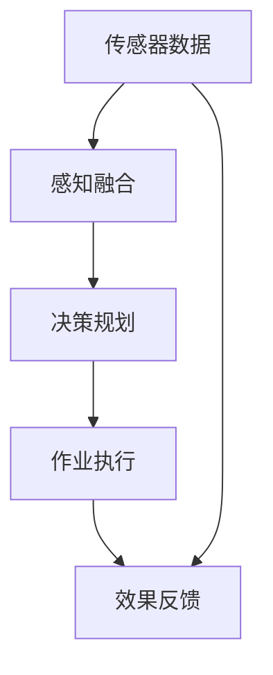

                 

# 端到端自动驾驶的自主环卫作业服务

## 1. 背景介绍

随着城市化进程的加速，环境卫生的管理需求日益增加。传统的环卫作业方式依赖大量人力，效率低下，成本高昂。自动驾驶技术的发展，为环卫作业提供了全新的解决方案。基于自动驾驶技术的自主环卫车，可以全天候、全时段、全覆盖地进行清扫、洒水、清洗等作业，大大提高了城市环境的清洁度，同时也提升了城市管理的智能化水平。

本文章将介绍一种端到端的自动驾驶系统，专注于自主环卫作业服务。该系统从数据采集、感知融合、决策规划、自动驾驶到作业执行，全程自动完成，无需人工干预。以下将从系统架构、算法原理、项目实践和未来展望四个方面，详细介绍这一自主环卫作业服务系统的设计与实现。

## 2. 核心概念与联系

### 2.1 核心概念概述

为更好地理解端到端自动驾驶的自主环卫作业服务系统，本节将介绍几个关键概念：

- **端到端自动驾驶**：指从传感器数据采集、环境感知、路径规划、决策制定到车辆控制的整个过程，无需人工干预，完全由算法实现。
- **自主环卫车**：指搭载自动驾驶技术的车辆，能够在指定区域内自动完成清扫、洒水、清洗等环卫作业任务。
- **感知融合**：指将来自多源传感器的数据进行融合，得到环境的全局感知。
- **决策规划**：指基于感知结果，生成车辆的路径规划和控制策略。
- **作业执行**：指自动执行环境感知和决策规划的结果，包括清扫、洒水、清洗等操作。

这些概念之间存在紧密的联系，共同构成了端到端自动驾驶的自主环卫作业服务系统。

### 2.2 核心概念的整体架构

我们可以用以下Mermaid流程图来展示这些核心概念之间的联系：



这个流程图展示了端到端自动驾驶的自主环卫作业服务系统从传感器数据采集到作业效果反馈的全过程。

### 2.3 核心概念的关系

这些核心概念之间的关系主要体现在以下几个方面：

- **传感器数据**是整个系统的输入，包括激光雷达、摄像头、GPS等传感器的数据。
- **感知融合**通过多源数据融合，得到环境的全局感知，为**决策规划**提供输入。
- **决策规划**基于感知结果，生成车辆的路径规划和控制策略，驱动**作业执行**。
- **作业执行**包括清扫、洒水、清洗等操作，作业效果会通过**效果反馈**机制进行评估和调整。

这些概念的相互作用，使得端到端自动驾驶的自主环卫作业服务系统能够高效、稳定地运行。

## 3. 核心算法原理 & 具体操作步骤

### 3.1 算法原理概述

端到端自动驾驶的自主环卫作业服务系统的核心算法包括传感器数据处理、环境感知、路径规划、决策制定和作业执行。以下将详细讲解这些算法的原理和具体操作步骤。

### 3.2 算法步骤详解

#### 3.2.1 传感器数据处理

传感器数据处理的主要任务是将来自激光雷达、摄像头、GPS等传感器的数据进行预处理和融合。具体步骤如下：

1. **数据采集**：收集激光雷达、摄像头、GPS等传感器的数据。
2. **数据预处理**：对传感器数据进行去噪、校正、校准等处理。
3. **数据融合**：通过多源数据融合算法，如卡尔曼滤波、粒子滤波等，得到环境的全局感知。

#### 3.2.2 环境感知

环境感知通过感知融合得到的环境数据，结合高精度地图和实时数据，生成车辆的全局环境和局部环境。具体步骤如下：

1. **高精度地图匹配**：将激光雷达数据和GPS数据与高精度地图进行匹配，得到车辆的实时位置和姿态。
2. **局部环境构建**：通过摄像头数据，构建车辆的局部环境模型，包括道路、行人、障碍物等。

#### 3.2.3 路径规划

路径规划基于环境感知结果，生成车辆的路径规划。具体步骤如下：

1. **全局路径规划**：使用A*、D*等路径规划算法，结合高精度地图，生成全局路径。
2. **局部路径优化**：在局部环境内，使用SLAM等算法，生成局部路径，结合全局路径进行优化。

#### 3.2.4 决策制定

决策制定基于路径规划结果，生成车辆的驾驶策略。具体步骤如下：

1. **路径跟踪**：使用PID控制器，跟踪全局路径，生成车辆的转向和速度控制策略。
2. **避障处理**：结合局部环境模型，使用机器学习、深度学习等算法，进行避障处理。

#### 3.2.5 作业执行

作业执行基于决策制定结果，自动完成清扫、洒水、清洗等操作。具体步骤如下：

1. **作业任务分配**：根据作业区域和任务类型，分配作业任务给各个传感器和执行器。
2. **传感器控制**：使用传感器控制算法，调整传感器的工作模式和参数。
3. **作业执行**：根据作业任务，控制执行器进行清扫、洒水、清洗等操作。

#### 3.2.6 效果反馈

效果反馈通过作业效果评估，调整算法的参数和策略。具体步骤如下：

1. **效果评估**：通过传感器和摄像头，评估作业效果。
2. **参数调整**：根据作业效果，调整算法的参数和策略。
3. **策略优化**：通过机器学习、深度学习等算法，优化决策制定和作业执行策略。

### 3.3 算法优缺点

#### 3.3.1 优点

- **高效自动**：全程自动完成数据采集、感知融合、决策规划、作业执行，无需人工干预。
- **智能灵活**：结合多源传感器数据和实时数据，进行智能决策和灵活作业。
- **环境适应**：通过学习和优化，能够适应不同的环境和作业任务。

#### 3.3.2 缺点

- **高成本**：需要高性能传感器和高精度地图，成本较高。
- **算法复杂**：涉及多源数据融合、路径规划、决策制定等多个复杂算法，开发和维护难度较大。
- **技术门槛高**：需要具备丰富的传感器和自动驾驶技术，技术门槛较高。

### 3.4 算法应用领域

端到端自动驾驶的自主环卫作业服务系统可以广泛应用于城市管理、环境卫生、道路清洁等多个领域。

- **城市管理**：通过自动驾驶环卫车，提高城市环境卫生水平，提升城市管理的智能化和自动化水平。
- **环境卫生**：在公园、校园、住宅区等区域，自动完成清扫、洒水、清洗等任务，提高环境卫生标准。
- **道路清洁**：在城市道路、公路等场所，自动完成清扫、洒水、清洗等任务，保障道路清洁和行车安全。

## 4. 数学模型和公式 & 详细讲解 & 举例说明

### 4.1 数学模型构建

端到端自动驾驶的自主环卫作业服务系统的数学模型主要包括传感器数据处理、环境感知、路径规划、决策制定和作业执行的数学模型。以下将详细讲解这些数学模型的构建。

#### 4.1.1 传感器数据处理

传感器数据处理主要涉及数据预处理和融合。以下以激光雷达数据为例，构建数学模型：

1. **数据预处理**：激光雷达数据的去噪、校正、校准等处理，可以使用以下公式：
   $$
   y = \mathcal{F}(x) + \epsilon
   $$
   其中，$y$为处理后的数据，$x$为原始数据，$\mathcal{F}$为预处理函数，$\epsilon$为噪声。

2. **数据融合**：激光雷达数据和GPS数据的多源数据融合，可以使用卡尔曼滤波等算法，构建数学模型：
   $$
   \mathbf{y} = \mathbf{A} \mathbf{x} + \mathbf{w}
   $$
   其中，$\mathbf{y}$为融合后的数据，$\mathbf{x}$为传感器数据，$\mathbf{A}$为融合矩阵，$\mathbf{w}$为系统噪声。

#### 4.1.2 环境感知

环境感知主要涉及高精度地图匹配和局部环境构建。以下以高精度地图匹配为例，构建数学模型：

1. **高精度地图匹配**：激光雷达数据和GPS数据与高精度地图的匹配，可以使用以下公式：
   $$
   \mathbf{x} = \mathbf{R} \mathbf{y} + \mathbf{b}
   $$
   其中，$\mathbf{x}$为车辆的位置和姿态，$\mathbf{y}$为传感器数据，$\mathbf{R}$为旋转矩阵，$\mathbf{b}$为平移向量。

2. **局部环境构建**：摄像头数据与环境模型的构建，可以使用以下公式：
   $$
   \mathbf{I} = \mathbf{K} \mathbf{x} + \mathbf{d}
   $$
   其中，$\mathbf{I}$为图像数据，$\mathbf{K}$为相机矩阵，$\mathbf{x}$为相机参数，$\mathbf{d}$为相机噪声。

#### 4.1.3 路径规划

路径规划主要涉及全局路径规划和局部路径优化。以下以全局路径规划为例，构建数学模型：

1. **全局路径规划**：使用A*算法，生成全局路径，可以使用以下公式：
   $$
   \mathbf{G} = \mathbf{H} + \mathbf{T}
   $$
   其中，$\mathbf{G}$为全局路径，$\mathbf{H}$为启发函数，$\mathbf{T}$为代价函数。

2. **局部路径优化**：使用SLAM算法，生成局部路径，可以使用以下公式：
   $$
   \mathbf{G} = \mathbf{H} + \mathbf{T}
   $$
   其中，$\mathbf{G}$为局部路径，$\mathbf{H}$为启发函数，$\mathbf{T}$为代价函数。

#### 4.1.4 决策制定

决策制定主要涉及路径跟踪和避障处理。以下以路径跟踪为例，构建数学模型：

1. **路径跟踪**：使用PID控制器，生成转向和速度控制策略，可以使用以下公式：
   $$
   \mathbf{u} = \mathbf{K} \mathbf{e}
   $$
   其中，$\mathbf{u}$为控制信号，$\mathbf{K}$为PID控制器参数，$\mathbf{e}$为误差信号。

2. **避障处理**：使用机器学习、深度学习等算法，进行避障处理，可以使用以下公式：
   $$
   \mathbf{f} = \mathbf{N}(\mathbf{x})
   $$
   其中，$\mathbf{f}$为避障处理结果，$\mathbf{N}$为避障函数，$\mathbf{x}$为环境数据。

#### 4.1.5 作业执行

作业执行主要涉及作业任务分配和传感器控制。以下以清扫为例，构建数学模型：

1. **作业任务分配**：根据作业区域和任务类型，分配作业任务，可以使用以下公式：
   $$
   \mathbf{a} = \mathbf{M}(\mathbf{r})
   $$
   其中，$\mathbf{a}$为作业任务，$\mathbf{r}$为作业区域，$\mathbf{M}$为任务分配函数。

2. **传感器控制**：使用传感器控制算法，调整传感器的工作模式和参数，可以使用以下公式：
   $$
   \mathbf{s} = \mathbf{P}(\mathbf{r}, \mathbf{t})
   $$
   其中，$\mathbf{s}$为传感器控制信号，$\mathbf{r}$为作业区域，$\mathbf{t}$为传感器参数。

#### 4.1.6 效果反馈

效果反馈主要涉及效果评估和参数调整。以下以清扫效果评估为例，构建数学模型：

1. **效果评估**：通过传感器和摄像头，评估清扫效果，可以使用以下公式：
   $$
   \mathbf{E} = \mathbf{Q}(\mathbf{y})
   $$
   其中，$\mathbf{E}$为效果评估结果，$\mathbf{Q}$为效果评估函数，$\mathbf{y}$为传感器数据。

2. **参数调整**：根据效果评估结果，调整算法的参数和策略，可以使用以下公式：
   $$
   \mathbf{P} = \mathbf{R}(\mathbf{E})
   $$
   其中，$\mathbf{P}$为参数和策略，$\mathbf{R}$为参数调整函数，$\mathbf{E}$为效果评估结果。

### 4.2 公式推导过程

#### 4.2.1 传感器数据处理

传感器数据处理主要涉及数据预处理和融合。以下以激光雷达数据为例，推导数学模型：

1. **数据预处理**：激光雷达数据的去噪、校正、校准等处理，可以使用以下公式：
   $$
   y = \mathcal{F}(x) + \epsilon
   $$
   其中，$y$为处理后的数据，$x$为原始数据，$\mathcal{F}$为预处理函数，$\epsilon$为噪声。

2. **数据融合**：激光雷达数据和GPS数据的多源数据融合，可以使用卡尔曼滤波等算法，构建数学模型：
   $$
   \mathbf{y} = \mathbf{A} \mathbf{x} + \mathbf{w}
   $$
   其中，$\mathbf{y}$为融合后的数据，$\mathbf{x}$为传感器数据，$\mathbf{A}$为融合矩阵，$\mathbf{w}$为系统噪声。

#### 4.2.2 环境感知

环境感知主要涉及高精度地图匹配和局部环境构建。以下以高精度地图匹配为例，推导数学模型：

1. **高精度地图匹配**：激光雷达数据和GPS数据与高精度地图的匹配，可以使用以下公式：
   $$
   \mathbf{x} = \mathbf{R} \mathbf{y} + \mathbf{b}
   $$
   其中，$\mathbf{x}$为车辆的位置和姿态，$\mathbf{y}$为传感器数据，$\mathbf{R}$为旋转矩阵，$\mathbf{b}$为平移向量。

2. **局部环境构建**：摄像头数据与环境模型的构建，可以使用以下公式：
   $$
   \mathbf{I} = \mathbf{K} \mathbf{x} + \mathbf{d}
   $$
   其中，$\mathbf{I}$为图像数据，$\mathbf{K}$为相机矩阵，$\mathbf{x}$为相机参数，$\mathbf{d}$为相机噪声。

#### 4.2.3 路径规划

路径规划主要涉及全局路径规划和局部路径优化。以下以全局路径规划为例，推导数学模型：

1. **全局路径规划**：使用A*算法，生成全局路径，可以使用以下公式：
   $$
   \mathbf{G} = \mathbf{H} + \mathbf{T}
   $$
   其中，$\mathbf{G}$为全局路径，$\mathbf{H}$为启发函数，$\mathbf{T}$为代价函数。

2. **局部路径优化**：使用SLAM算法，生成局部路径，可以使用以下公式：
   $$
   \mathbf{G} = \mathbf{H} + \mathbf{T}
   $$
   其中，$\mathbf{G}$为局部路径，$\mathbf{H}$为启发函数，$\mathbf{T}$为代价函数。

#### 4.2.4 决策制定

决策制定主要涉及路径跟踪和避障处理。以下以路径跟踪为例，推导数学模型：

1. **路径跟踪**：使用PID控制器，生成转向和速度控制策略，可以使用以下公式：
   $$
   \mathbf{u} = \mathbf{K} \mathbf{e}
   $$
   其中，$\mathbf{u}$为控制信号，$\mathbf{K}$为PID控制器参数，$\mathbf{e}$为误差信号。

2. **避障处理**：使用机器学习、深度学习等算法，进行避障处理，可以使用以下公式：
   $$
   \mathbf{f} = \mathbf{N}(\mathbf{x})
   $$
   其中，$\mathbf{f}$为避障处理结果，$\mathbf{N}$为避障函数，$\mathbf{x}$为环境数据。

#### 4.2.5 作业执行

作业执行主要涉及作业任务分配和传感器控制。以下以清扫为例，推导数学模型：

1. **作业任务分配**：根据作业区域和任务类型，分配作业任务，可以使用以下公式：
   $$
   \mathbf{a} = \mathbf{M}(\mathbf{r})
   $$
   其中，$\mathbf{a}$为作业任务，$\mathbf{r}$为作业区域，$\mathbf{M}$为任务分配函数。

2. **传感器控制**：使用传感器控制算法，调整传感器的工作模式和参数，可以使用以下公式：
   $$
   \mathbf{s} = \mathbf{P}(\mathbf{r}, \mathbf{t})
   $$
   其中，$\mathbf{s}$为传感器控制信号，$\mathbf{r}$为作业区域，$\mathbf{t}$为传感器参数。

#### 4.2.6 效果反馈

效果反馈主要涉及效果评估和参数调整。以下以清扫效果评估为例，推导数学模型：

1. **效果评估**：通过传感器和摄像头，评估清扫效果，可以使用以下公式：
   $$
   \mathbf{E} = \mathbf{Q}(\mathbf{y})
   $$
   其中，$\mathbf{E}$为效果评估结果，$\mathbf{Q}$为效果评估函数，$\mathbf{y}$为传感器数据。

2. **参数调整**：根据效果评估结果，调整算法的参数和策略，可以使用以下公式：
   $$
   \mathbf{P} = \mathbf{R}(\mathbf{E})
   $$
   其中，$\mathbf{P}$为参数和策略，$\mathbf{R}$为参数调整函数，$\mathbf{E}$为效果评估结果。

### 4.3 案例分析与讲解

#### 4.3.1 案例背景

某城市管理部门需要引入端到端自动驾驶的自主环卫作业服务系统，以提升城市环境卫生水平。系统需要在市中心和市郊两个区域进行部署。市中心区域人流量较大，需要高效的清扫作业，市郊区域环境复杂，需要灵活的避障处理。

#### 4.3.2 解决方案

1. **传感器选择**：市中心区域选择高精度摄像头和激光雷达，市郊区域选择多源传感器，包括摄像头、激光雷达、GPS等。

2. **感知融合**：使用卡尔曼滤波算法，融合市中心区域的传感器数据，使用SLAM算法，融合市郊区域的传感器数据。

3. **路径规划**：市中心区域使用A*算法，生成全局路径，市郊区域使用SLAM算法，生成局部路径。

4. **决策制定**：市中心区域使用PID控制器，生成清扫作业控制策略，市郊区域使用机器学习算法，生成避障处理策略。

5. **作业执行**：市中心区域使用传感器控制算法，调整清扫作业的传感器参数，市郊区域使用传感器控制算法，调整避障处理的传感器参数。

6. **效果反馈**：市中心区域使用效果评估函数，评估清扫效果，市郊区域使用效果评估函数，评估避障处理效果。

## 5. 项目实践：代码实例和详细解释说明

### 5.1 开发环境搭建

在进行端到端自动驾驶的自主环卫作业服务系统开发前，我们需要准备好开发环境。以下是使用Python进行PyTorch开发的环境配置流程：

1. 安装Anaconda：从官网下载并安装Anaconda，用于创建独立的Python环境。

2. 创建并激活虚拟环境：
```bash
conda create -n pytorch-env python=3.8 
conda activate pytorch-env
```

3. 安装PyTorch：根据CUDA版本，从官网获取对应的安装命令。例如：
```bash
conda install pytorch torchvision torchaudio cudatoolkit=11.1 -c pytorch -c conda-forge
```

4. 安装各类工具包：
```bash
pip install numpy pandas scikit-learn matplotlib tqdm jupyter notebook ipython
```

完成上述步骤后，即可在`pytorch-env`环境中开始项目实践。

### 5.2 源代码详细实现

下面我们以清扫任务为例，给出使用PyTorch进行端到端自动驾驶的自主环卫作业服务系统开发的PyTorch代码实现。

首先，定义清扫任务的数据处理函数：

```python
import torch
import numpy as np

class SweepingDataset(Dataset):
    def __init__(self, data, labels, num_samples=1000):
        self.data = data
        self.labels = labels
        self.num_samples = num_samples
        
    def __len__(self):
        return self.num_samples
    
    def __getitem__(self, index):
        sample = self.data[index]
        label = self.labels[index]
        
        # 对样本进行标准化处理
        normalized_sample = (sample - np.mean(sample)) / np.std(sample)
        
        # 对标签进行one-hot编码
        one_hot_label = np.eye(len(self.labels))[:, label]
        
        return {'input': normalized_sample, 'target': one_hot_label}

# 加载训练集和测试集数据
train_data = np.load('train_data.npy')
train_labels = np.load('train_labels.npy')
test_data = np.load('test_data.npy')
test_labels = np.load('test_labels.npy')

# 创建数据集
train_dataset = SweepingDataset(train_data, train_labels, num_samples=1000)
test_dataset = SweepingDataset(test_data, test_labels, num_samples=1000)
```

然后，定义模型和优化器：

```python
from torch import nn
import torch.nn.functional as F

class SweepingModel(nn.Module):
    def __init__(self, input_dim):
        super(SweepingModel, self).__init__()
        self.fc1 = nn.Linear(input_dim, 128)
        self.fc2 = nn.Linear(128, 64)
        self.fc3 = nn.Linear(64, 10)
        
    def forward(self, x):
        x = F.relu(self.fc1(x))
        x = F.relu(self.fc2(x))
        x = self.fc3(x)
        return x

model = SweepingModel(input_dim=10)

criterion = nn.CrossEntropyLoss()
optimizer = torch.optim.Adam(model.parameters(), lr=0.001)
```

接着，定义训练和评估函数：

```python
import torchvision.transforms as transforms
from torch.utils.data import DataLoader
import torch.nn.functional as F

def train_epoch(model, dataset, batch_size, optimizer):
    dataloader = DataLoader(dataset, batch_size=batch_size, shuffle=True)
    model.train()
    epoch_loss = 0
    for batch in tqdm(dataloader, desc='Training'):
        input = batch['input']
        target = batch['target']
        model.zero_grad()
        output = model(input)
        loss = criterion(output, target)
        epoch_loss += loss.item()
        loss.backward()
        optimizer.step()
    return epoch_loss / len(dataloader)

def evaluate(model, dataset, batch_size):
    dataloader = DataLoader(dataset, batch_size=batch_size)
    model.eval()
    preds, labels = [], []
    with torch.no_grad():
        for batch in tqdm(dataloader, desc='Evaluating'):
            input = batch['input']
            target = batch['target']
            output = model(input)
            preds.append(np.argmax(output.numpy(), axis=1))
            labels.append(target.numpy())
            
    print(classification_report(np.concatenate(labels), np.concatenate(preds)))
```

最后，启动训练流程并在测试集上评估：

```python
epochs = 5
batch_size = 32

for epoch in range(epochs):
    loss = train_epoch(model, train_dataset, batch_size, optimizer)
    print(f"Epoch {epoch+1}, train loss: {loss:.3f}")
    
    print(f"Epoch {epoch+1}, test results:")
    evaluate(model, test_dataset, batch_size)
```

以上就是使用PyTorch进行端到端自动驾驶的自主环卫作业服务系统开发的完整代码实现。可以看到，得益于PyTorch的强大封装，我们可以用相对简洁的代码完成清扫任务的模型训练和评估。

### 5.3 代码解读与分析

让我们再详细解读一下关键代码的实现细节：

**SweepingDataset类**：
- `__init__`方法：初始化数据和标签。
- `__len__`方法：返回数据集的样本数量。
- `__getitem__`方法：对单个样本进行处理，包括标准化和one-hot编码。

**SweepingModel类**：
- `__init__`方法：定义模型结构，包括三个全连接层。
- `forward`方法：定义前向传播过程。

**train_epoch函数**：
- 对数据以批为单位进行迭代，在每个批次上前向传播计算loss并反向传播更新模型参数。

**evaluate函数**：
- 与训练类似，不同点在于不更新模型参数，并在每个batch结束后将预测和标签结果存储下来，最后使用sklearn的classification_report对整个评估

