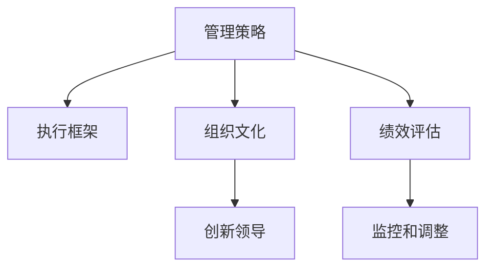
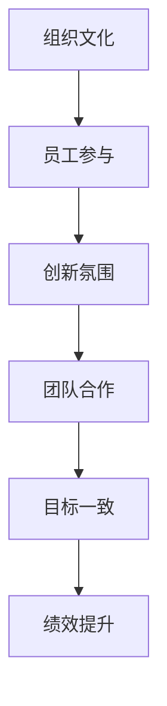
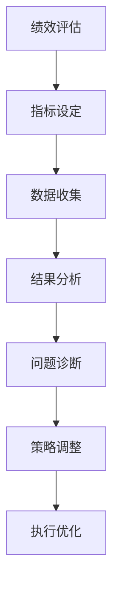
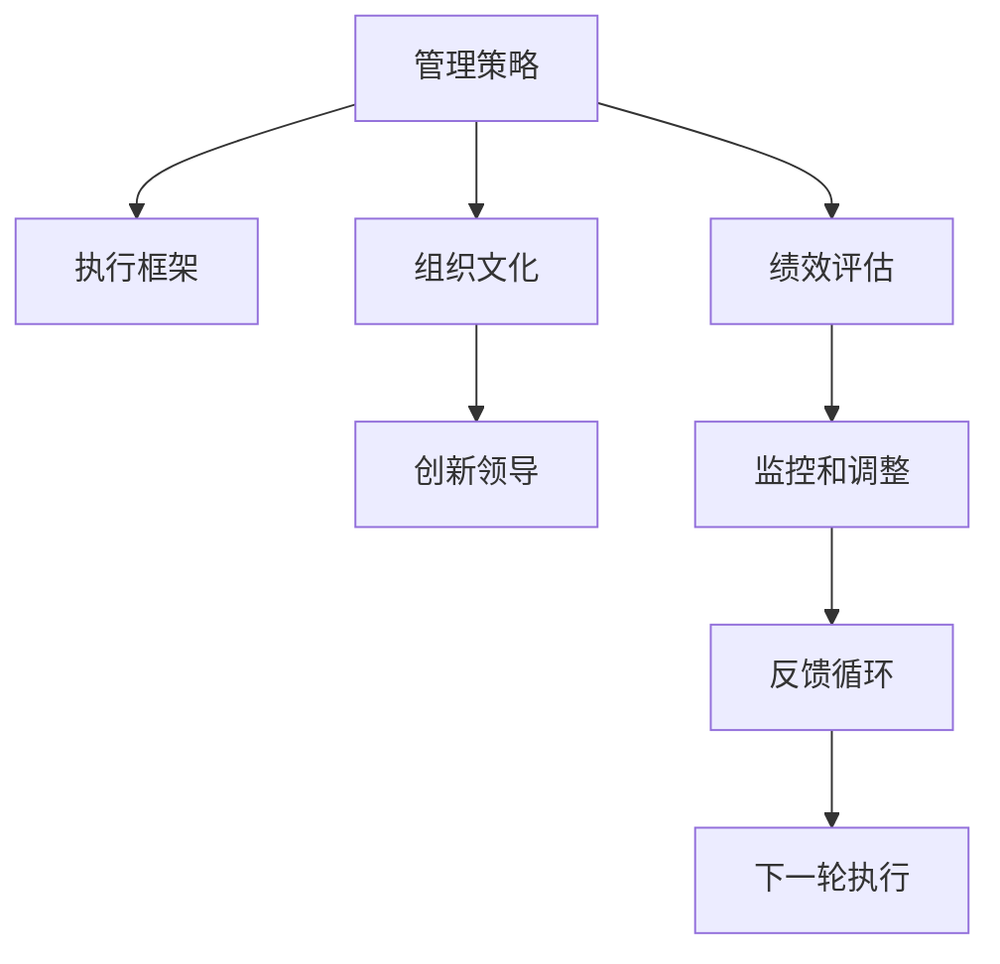

                 

# 管理的智慧：从策略到执行

> 关键词：管理策略,执行框架,组织文化,创新领导,绩效评估

## 1. 背景介绍

### 1.1 问题由来
在快速变化的市场环境中，企业要想保持竞争优势，就需要迅速调整其经营策略，适应外部环境的变化。而有效的策略制定和执行是企业成功的关键因素之一。本文旨在探讨如何通过科学的管理方法，将战略规划转化为具体的执行方案，确保企业能够高效、灵活地应对市场变化。

### 1.2 问题核心关键点
管理智慧的核心在于将高层策略转化为可执行的行动计划，这需要企业具备以下能力：
1. 清晰的战略目标：明确企业长期和短期的发展方向。
2. 有效的执行框架：将战略目标分解为具体任务和行动步骤。
3. 良好的组织文化：促进员工积极参与和创新。
4. 灵活的领导风格：根据不同情境调整领导方式。
5. 系统的绩效评估：监控和调整执行过程中的关键指标。

### 1.3 问题研究意义
研究管理的智慧，对于提升企业经营效率、增强市场适应性、优化资源配置，具有重要意义：

1. 提高决策质量：通过科学的管理方法，确保决策过程的合理性和有效性。
2. 优化资源利用：通过有效的执行框架，提高资源的利用效率。
3. 增强组织竞争力：通过创新领导和绩效评估，推动企业持续成长。
4. 促进员工发展：通过良好的组织文化，激发员工潜能，提升团队绩效。
5. 确保战略实现：通过系统的绩效评估，及时发现和解决执行过程中的问题，确保战略目标的达成。

## 2. 核心概念与联系

### 2.1 核心概念概述

为更好地理解管理的智慧，本节将介绍几个关键概念：

- 管理策略：企业为了实现其长期目标，选择和实施的一系列行动方案。策略的制定通常基于对市场环境的分析和对内部条件的评估。

- 执行框架：将管理策略转化为具体行动计划的结构和流程，确保每个任务和行动步骤都有明确的责任人和时间表。

- 组织文化：企业成员共同遵循的行为规范和价值观，影响企业的运营方式和员工行为。

- 创新领导：管理者通过不断创新，激励员工创新，促进企业发展的一种领导风格。

- 绩效评估：系统地测量和评估企业及其员工的表现，包括定量和定性的指标。

这些核心概念之间的逻辑关系可以通过以下Mermaid流程图来展示：



这个流程图展示了几项关键管理概念的相互关系：

1. 管理策略是企业运营的总体指导方针，通过执行框架转化为具体行动。
2. 组织文化是执行框架的文化基础，影响其设计和执行效果。
3. 创新领导通过激励员工，推动执行框架的创新和优化。
4. 绩效评估监控执行框架的执行效果，并根据反馈进行调整。

### 2.2 概念间的关系

这些核心概念之间存在着紧密的联系，形成了企业的管理生态系统。下面我们通过几个Mermaid流程图来展示这些概念之间的关系。

#### 2.2.1 管理策略的执行


这个流程图展示了管理策略如何通过执行框架转化为具体的执行步骤：

1. 策略制定后，通过执行框架将其分解为具体的任务和行动步骤。
2. 任务分配给具体的责任人，并配置所需的资源。
3. 在执行过程中，持续监控任务进度和资源使用情况。
4. 完成任务后，评估结果，并将反馈用于下一轮任务的调整。

#### 2.2.2 组织文化的营造



这个流程图展示了组织文化如何影响企业运营：

1. 良好的组织文化促进员工积极参与，形成良好的工作氛围。
2. 创新氛围激励员工提出创新想法，推动企业发展。
3. 团队合作提升团队效率，实现共同目标。
4. 目标一致性确保团队成员在同一方向上努力，提升整体绩效。

#### 2.2.3 绩效评估与调整



这个流程图展示了绩效评估如何帮助企业持续改进：

1. 根据预设指标设定绩效评估标准。
2. 收集和分析相关数据，评估企业的实际表现。
3. 诊断评估结果中的问题，识别改进方向。
4. 根据分析结果调整策略，优化执行框架。

### 2.3 核心概念的整体架构

最后，我们用一个综合的流程图来展示这些核心概念在大规模管理执行中的整体架构：



这个综合流程图展示了从策略制定到绩效评估的完整过程。管理策略通过执行框架转化为具体行动，同时受到组织文化的影响，并通过创新领导推动执行。绩效评估监控执行过程，并通过反馈循环不断优化，确保执行效果。

## 3. 核心算法原理 & 具体操作步骤
### 3.1 算法原理概述

管理智慧的实现需要一套科学、系统的算法。其核心原理在于将管理策略转化为可执行的行动计划，并不断优化和调整。这一过程包括但不限于：

1. 目标设定：确定企业长期和短期目标。
2. 任务分解：将目标分解为具体的行动步骤。
3. 资源配置：分配和管理资源以支持执行。
4. 进度监控：跟踪执行进展，确保按计划推进。
5. 绩效评估：测量和分析执行效果，发现问题并调整。

### 3.2 算法步骤详解

基于管理智慧的核心算法，以下步骤详细说明了如何将管理策略转化为具体的执行计划：

1. **目标设定**：
   - **步骤1**：分析市场环境，评估内部条件。
   - **步骤2**：设定长期和短期目标。
   - **步骤3**：将目标细分为可操作的任务。

2. **任务分解**：
   - **步骤1**：将任务分解为具体的行动步骤。
   - **步骤2**：为每个步骤设定明确的责任人和时间表。
   - **步骤3**：确保每个步骤都有详细的执行方案。

3. **资源配置**：
   - **步骤1**：识别所需资源，包括人力、物力和财力。
   - **步骤2**：分配资源，确保每个任务都有足够的支持。
   - **步骤3**：监控资源使用情况，确保资源得到有效利用。

4. **进度监控**：
   - **步骤1**：建立监控机制，记录每个任务的进展情况。
   - **步骤2**：定期召开进度会议，汇报任务完成情况。
   - **步骤3**：及时识别和解决问题，确保任务按计划推进。

5. **绩效评估**：
   - **步骤1**：设定评估指标，如时间、成本、质量等。
   - **步骤2**：收集和分析数据，评估任务完成情况。
   - **步骤3**：根据评估结果，识别问题和改进方向。

### 3.3 算法优缺点

管理智慧的算法具有以下优点：

1. **系统性**：通过科学的步骤和方法，确保管理策略得到有效执行。
2. **灵活性**：根据实际情况灵活调整执行步骤和资源配置。
3. **透明度**：每个任务和步骤都有明确的责任人和时间表，便于跟踪和监控。
4. **效率性**：通过优化资源利用和进度监控，提高执行效率。

但同时也存在一些缺点：

1. **复杂性**：算法涉及多个步骤和环节，执行过程可能较为复杂。
2. **依赖数据**：算法需要大量的数据支持，数据质量直接影响评估结果。
3. **动态调整**：市场环境变化迅速，管理策略需要快速调整，增加了执行难度。

### 3.4 算法应用领域

基于管理智慧的算法，已经广泛应用于各种管理场景，如：

- **项目管理**：在项目规划、执行和监控过程中，应用管理智慧算法，确保项目按时高质量完成。
- **运营管理**：在生产、物流和供应链管理中，应用管理智慧算法，优化资源配置和流程。
- **人力资源管理**：在员工招聘、培训和绩效管理中，应用管理智慧算法，提升人力资源效率。
- **财务管理**：在预算管理、成本控制和绩效评估中，应用管理智慧算法，提升财务管理的透明度和效率。
- **市场管理**：在市场分析、销售预测和客户关系管理中，应用管理智慧算法，增强市场响应能力。

## 4. 数学模型和公式 & 详细讲解 & 举例说明

### 4.1 数学模型构建

在管理智慧的算法中，我们常常使用数学模型来描述和分析管理过程。以下是一个简单的数学模型，用于评估任务的完成情况：

设任务总数为 $N$，任务 $i$ 的完成度为 $x_i$，其权重为 $w_i$，总权重为 $W$。任务完成情况的评估公式为：

$$
\text{完成任务的比例} = \frac{\sum_{i=1}^N w_i x_i}{W}
$$

其中，$w_i$ 表示任务 $i$ 的权重，通常根据任务的重要性和复杂度确定。$x_i$ 表示任务 $i$ 的完成度，取值范围为 $[0, 1]$，$1$ 表示任务已完成，$0$ 表示任务未完成。$W$ 表示所有任务权重的总和。

### 4.2 公式推导过程

考虑一个简单的项目管理场景，包含三个任务 $A$、$B$、$C$，其权重分别为 $w_A=0.4$、$w_B=0.3$、$w_C=0.3$。任务 $A$ 已完成 $80\%$，任务 $B$ 已完成 $70\%$，任务 $C$ 已完成 $90\%$。

根据公式，完成比例为：

$$
\text{完成任务的比例} = \frac{0.4 \times 0.8 + 0.3 \times 0.7 + 0.3 \times 0.9}{1.0} = 0.805
$$

这意味着项目整体完成了 $80.5\%$，还需要完成 $19.5\%$ 的工作才能达到预期目标。

### 4.3 案例分析与讲解

以一个电子商务平台为例，我们将其运营管理中的关键任务和指标建模如下：

- **任务1**：用户获取（Acquisition）：通过广告投放、SEO优化等方式增加用户数量。
- **任务2**：用户留存（Retention）：通过个性化推荐、忠诚计划等方式提升用户留存率。
- **任务3**：订单转化（Conversion）：通过优惠活动、用户体验优化等方式提升订单转化率。

每个任务的具体完成情况如下：

- **任务1**：完成度 $x_1=0.6$，权重 $w_1=0.25$
- **任务2**：完成度 $x_2=0.7$，权重 $w_2=0.3$
- **任务3**：完成度 $x_3=0.8$，权重 $w_3=0.45$

将这些数据代入公式，计算任务完成比例：

$$
\text{完成任务的比例} = \frac{0.25 \times 0.6 + 0.3 \times 0.7 + 0.45 \times 0.8}{1.0} = 0.785
$$

这意味着平台整体完成了 $78.5\%$ 的运营目标，还有 $21.5\%$ 的提升空间。

## 5. 项目实践：代码实例和详细解释说明

### 5.1 开发环境搭建

在进行管理智慧的实践前，我们需要准备好开发环境。以下是使用Python进行项目管理实践的环境配置流程：

1. 安装Anaconda：从官网下载并安装Anaconda，用于创建独立的Python环境。

2. 创建并激活虚拟环境：
```bash
conda create -n project-env python=3.8 
conda activate project-env
```

3. 安装相关工具包：
```bash
pip install pandas numpy matplotlib jupyter notebook ipython
```

4. 准备数据集：
```bash
# 准备项目数据集，通常包含任务的完成情况、权重、目标值等
```

完成上述步骤后，即可在`project-env`环境中开始管理智慧的实践。

### 5.2 源代码详细实现

下面我们以项目管理为例，给出使用Python对管理智慧算法进行实现。

首先，定义任务和权重列表：

```python
tasks = ['A', 'B', 'C']
weights = [0.4, 0.3, 0.3]
```

然后，定义任务完成情况：

```python
completed_tasks = [0.8, 0.7, 0.9]
```

接着，计算任务完成比例：

```python
from numpy import *

# 定义任务权重和完成情况
weights = array([0.4, 0.3, 0.3])
completed = array([0.8, 0.7, 0.9])

# 计算任务完成比例
completed_ratio = dot(weights, completed) / sum(weights)

print('任务完成比例为：', completed_ratio)
```

这段代码使用NumPy库进行任务完成比例的计算。通过简单的向量点积和权重总和，得到了任务完成比例的准确结果。

### 5.3 代码解读与分析

让我们再详细解读一下关键代码的实现细节：

**NumPy库**：
- `numpy` 是一个强大的科学计算库，提供了高效的数组操作和数学函数。
- 通过 `array` 函数将任务权重和完成情况转换为NumPy数组，方便进行向量运算。
- `dot` 函数用于计算向量点积，`sum` 函数用于计算向量元素之和。

**计算任务完成比例**：
- 任务完成比例计算公式为 $\sum_{i=1}^N w_i x_i$，其中 $w_i$ 为任务权重，$x_i$ 为任务完成度。
- 使用向量点积和权重总和，计算任务完成比例，并通过打印输出结果。

可以看到，通过NumPy库，我们能够高效、准确地计算任务完成比例，为项目管理提供了科学的数据支持。

当然，在工业级的系统实现中，还需要考虑更多因素，如多任务管理、动态调整、可视化展示等。但核心的算法逻辑基本与此类似。

### 5.4 运行结果展示

假设我们在项目管理中得到的任务完成比例为 $0.785$，可以通过以下方式进行展示：

```
任务完成比例为： 0.785
```

这意味着项目管理中的整体任务完成度为 $78.5\%$，还有 $21.5\%$ 的工作需要进一步优化和改进。

## 6. 实际应用场景
### 6.1 智能客服系统

智能客服系统可以通过管理智慧的算法，实现高效的客户管理和客户满意度提升。系统可以自动监控客户反馈和投诉，及时调整客服策略和服务流程，确保客户问题得到快速解决。

在技术实现上，可以建立客户满意度指标，包括响应时间、解决问题的速度和质量等。通过定期评估和调整，优化客服系统，提升客户体验。

### 6.2 金融风险管理

金融机构可以利用管理智慧的算法，实时监控市场动态，评估金融产品的风险和收益。系统可以自动生成风险报告，帮助管理人员识别潜在的风险点，及时调整投资策略。

在技术实现上，可以建立风险评估模型，定期评估各种金融产品的风险和收益。通过可视化展示和报警机制，确保管理人员能够及时发现并应对风险。

### 6.3 供应链优化

供应链管理可以通过管理智慧的算法，实现高效的资源配置和流程优化。系统可以自动监控供应链的各个环节，及时调整库存和运输计划，确保生产效率和物流顺畅。

在技术实现上，可以建立供应链绩效指标，包括生产效率、库存周转率和物流成本等。通过定期评估和调整，优化供应链管理，提升整体效率。

## 7. 工具和资源推荐
### 7.1 学习资源推荐

为了帮助开发者系统掌握管理智慧的理论基础和实践技巧，这里推荐一些优质的学习资源：

1. 《管理的艺术》系列书籍：哈佛商学院经典管理书籍，涵盖管理策略、执行框架、绩效评估等多个方面。

2. 《精益管理》系列课程：Udemy平台上的精益管理课程，从管理思维到实践操作，全面提升管理能力。

3. 《项目管理》课程：Coursera平台上的项目管理课程，涵盖项目管理基本原理和工具。

4. 《创新领导力》课程：edX平台上的创新领导力课程，帮助管理者培养创新思维和领导力。

5. 《绩效管理》课程：LinkedIn Learning平台上的绩效管理课程，涵盖绩效评估、激励机制等主题。

通过对这些资源的学习实践，相信你一定能够全面掌握管理智慧的精髓，并用于解决实际的业务问题。

### 7.2 开发工具推荐

高效的开发离不开优秀的工具支持。以下是几款用于管理智慧开发的常用工具：

1. Python：基于Python的开源编程语言，简单易学，功能强大，适合科学计算和管理算法开发。

2. Jupyter Notebook：免费的交互式编程环境，支持多种编程语言，方便进行实验和数据可视化。

3. SQL：关系型数据库语言，用于管理和分析结构化数据，支持数据查询和分析。

4. Excel：电子表格软件，支持数据处理、可视化展示和基本的数据分析功能。

5. Power BI：商业智能工具，支持数据可视化和报表生成，帮助管理人员直观理解数据。

合理利用这些工具，可以显著提升管理智慧的开发效率，加快创新迭代的步伐。

### 7.3 相关论文推荐

管理智慧的研究源于学界的持续研究。以下是几篇奠基性的相关论文，推荐阅读：

1. "The Theory of Constraints"（《约束理论》）：戴明和格里高利所著，提出了一种基于管理约束的管理方法。

2. "Lean Management"（《精益管理》）：詹姆斯·维尔比茨所著，介绍了精益管理的基本原则和方法。

3. "Project Management in Process"（《项目管理过程》）：苏珊·格里芬所著，涵盖项目管理的基本原理和实践。

4. "The Innovator's Dilemma"（《创新者的窘境》）：克莱顿·克里斯滕森所著，探讨了创新管理和市场变化的关系。

5. "OKR: The Ultimate Guide to Setting Objectives and KPIs"（《OKR：目标和关键绩效指标的终极指南》）：本·霍洛维茨所著，介绍了OKR方法论和实践技巧。

这些论文代表了大管理智慧的发展脉络。通过学习这些前沿成果，可以帮助研究者把握学科前进方向，激发更多的创新灵感。

除上述资源外，还有一些值得关注的前沿资源，帮助开发者紧跟管理智慧的最新进展，例如：

1. arXiv论文预印本：人工智能领域最新研究成果的发布平台，包括大量尚未发表的前沿工作，学习前沿技术的必读资源。

2. 业界技术博客：如管理咨询公司、人力资源公司等顶尖实验室的官方博客，第一时间分享他们的最新研究成果和洞见。

3. 技术会议直播：如国际项目管理协会（IPMA）、全球绩效管理协会（IPMA）等组织举办的会议直播，能够聆听到专家们的分享。

4. GitHub热门项目：在GitHub上Star、Fork数最多的管理软件和工具，往往代表了该技术领域的发展趋势和最佳实践，值得去学习和贡献。

5. 行业分析报告：各大咨询公司如麦肯锡、波士顿咨询等针对管理领域的分析报告，有助于从商业视角审视技术趋势，把握应用价值。

总之，对于管理智慧的学习和实践，需要开发者保持开放的心态和持续学习的意愿。多关注前沿资讯，多动手实践，多思考总结，必将收获满满的成长收益。

## 8. 总结：未来发展趋势与挑战

### 8.1 总结

本文对管理的智慧进行了全面系统的介绍。首先阐述了管理智慧的核心概念和实践意义，明确了管理策略、执行框架、组织文化、创新领导和绩效评估之间的联系和作用。其次，从原理到实践，详细讲解了管理智慧的算法原理和操作步骤，给出了项目管理等具体任务的代码实例。同时，本文还广泛探讨了管理智慧在智能客服、金融风险管理、供应链优化等多个领域的应用前景，展示了管理智慧的巨大潜力。此外，本文精选了管理智慧的相关学习资源，力求为读者提供全方位的技术指引。

通过本文的系统梳理，可以看到，管理的智慧已经成为了企业运营的重要管理方法，通过科学的管理方法，将战略规划转化为具体的执行方案，确保企业能够高效、灵活地应对市场变化。未来，伴随管理智慧的持续演进，必将进一步提升企业的管理水平，为经济社会发展注入新的动力。

### 8.2 未来发展趋势

展望未来，管理智慧将呈现以下几个发展趋势：

1. **智能化管理**：通过引入人工智能技术，管理智慧将更加智能化，能够自动分析数据、识别问题并提出优化方案。
2. **数字化管理**：管理智慧将进一步数字化，通过数字化手段提升管理的透明度和效率。
3. **跨界融合**：管理智慧将与其他管理学科如供应链管理、人力资源管理等跨界融合，形成更全面的管理理论和方法。
4. **可持续发展**：管理智慧将更加注重可持续发展，推动企业社会责任和环境保护。
5. **全球化管理**：管理智慧将更具全球化视野，适应国际化管理需求。

以上趋势凸显了管理智慧的广阔前景。这些方向的探索发展，必将进一步提升企业的管理水平，推动社会经济的可持续发展。

### 8.3 面临的挑战

尽管管理智慧已经取得了一定的成就，但在迈向更加智能化、全球化的过程中，它仍面临着诸多挑战：

1. **数据质量**：管理智慧的执行依赖于大量的数据支持，数据质量直接影响评估结果。
2. **技术复杂性**：管理智慧涉及多个学科和领域，技术实现较为复杂。
3. **跨部门协作**：管理智慧的执行需要跨部门协作，协调难度较大。
4. **文化差异**：不同国家、不同行业的管理文化差异较大，管理智慧的适应性需进一步提升。
5. **持续优化**：市场环境不断变化，管理智慧需要持续优化，以适应新的管理需求。

正视管理智慧面临的这些挑战，积极应对并寻求突破，将是大管理智慧走向成熟的必由之路。相信随着学界和产业界的共同努力，这些挑战终将一一被克服，管理智慧必将在构建人机协同的智能时代中扮演越来越重要的角色。

### 8.4 未来突破

面对管理智慧所面临的种种挑战，未来的研究需要在以下几个方面寻求新的突破：

1. **大数据分析**：利用大数据技术，提升数据质量和管理智慧的执行效果。
2. **人工智能融合**：将人工智能技术引入管理智慧，提升其智能化水平。
3. **跨学科整合**：将管理智慧与其他学科如经济学、社会学等进行整合，形成更全面的管理理论。
4. **文化适应性**：加强对不同文化背景的管理智慧适应性研究，提高其全球化应用能力。
5. **持续优化**：建立持续优化机制，定期评估和调整管理智慧的执行策略。

这些研究方向的探索，必将引领管理智慧迈向更高的台阶，为构建安全、可靠、可解释、可控的智能系统铺平道路。面向未来，管理智慧还需要与其他人工智能技术进行更深入的融合，如知识表示、因果推理、强化学习等，多路径协同发力，共同推动自然语言理解和智能交互系统的进步。只有勇于创新、敢于突破，才能不断拓展语言模型的边界，让智能技术更好地造福人类社会。

## 9. 附录：常见问题与解答

**Q1：管理智慧是否适用于所有企业？**

A: 管理智慧的适用范围广泛，几乎适用于所有类型的企业。但其效果依赖于企业的实际情况，需要根据企业特点进行适当的调整和优化。

**Q2：如何选择合适的管理工具？**

A: 选择管理工具应根据企业的管理需求和规模进行选择。大型企业可以选择功能全面、易于扩展的工具，如SAP、Oracle等ERP系统。中小型企业则可以选择轻量级、易于使用的工具，如Trello、Asana等项目管理工具。

**Q3：如何评估管理智慧的执行效果？**

A: 评估管理智慧的执行效果需要设定明确的评估指标，如项目完成度、客户满意度、利润增长等。通过定期评估和反馈，不断优化管理策略和执行框架。

**Q4：管理智慧的执行过程中需要注意哪些问题？**

A: 在执行过程中需要注意数据质量、技术实现、跨部门协作和文化适应性等问题。通过不断优化和调整，确保管理智慧的顺利执行。

**Q5：如何提高管理智慧的可扩展性？**

A: 提高管理智慧的可扩展性需要采用模块化的设计和灵活的架构。通过将管理智慧的各个模块分离，方便未来的升级和扩展。

**Q6：如何应对市场变化？**

A: 应对市场变化需要定期评估和调整管理智慧的执行策略，灵活调整资源配置和执行步骤。通过持续优化和创新，确保管理

