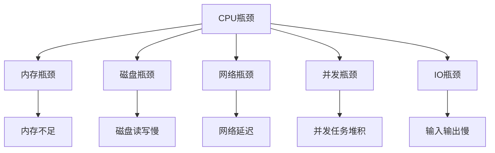

                 

## 1. 背景介绍

系统瓶颈是指在特定的物理结构、性能配置或策略下，系统达到最优性能所需要的一系列资源中的瓶颈环节。系统瓶颈的存在对系统的整体性能有着极其重要的影响，因为瓶颈往往限制了系统的整体性能。

### 1.1 问题由来

系统瓶颈问题存在于各种计算机系统当中，包括网络、服务器、数据库、应用程序等。瓶颈可能发生在CPU、内存、磁盘、网络带宽等地方，对系统性能造成不同程度的影响。例如，在云计算环境中，瓶颈可能表现在服务器硬件、网络传输速度、数据存储和访问等方面。

### 1.2 问题核心关键点

在处理系统瓶颈时，我们需要掌握几个核心关键点：

- 确定瓶颈位置：通过性能监控、资源使用统计等手段，确定系统性能不足的具体位置。
- 分析瓶颈原因：深入了解系统瓶颈的具体成因，包括资源配置、算法设计、硬件性能等。
- 优化瓶颈环节：针对瓶颈位置，采用相应的优化措施，如提升资源配置、改进算法设计、调整硬件参数等，以改善系统性能。
- 实施持续监控：定期对系统性能进行监控和评估，及时发现新的瓶颈并加以解决。

### 1.3 问题研究意义

研究和解决系统瓶颈问题，对于提升系统的整体性能、降低运维成本、提高用户体验等具有重要意义：

1. **提升系统性能**：优化瓶颈可以显著提升系统的处理能力，提高系统的响应速度和服务质量。
2. **降低运维成本**：通过解决瓶颈，可以降低硬件资源和能源消耗，减少运维人力和时间成本。
3. **提高用户体验**：减少延迟和故障，提高系统的稳定性和可用性，提升用户体验满意度。
4. **应对未来发展**：系统瓶颈分析可以为企业应对未来业务增长和技术升级提供有效手段。

## 2. 核心概念与联系

### 2.1 核心概念概述

系统瓶颈问题涉及多个关键概念，包括：

- **CPU瓶颈**：指CPU的使用率过高，无法满足系统需求，导致系统响应缓慢或宕机。
- **内存瓶颈**：指系统内存不足，导致频繁的页面交换，系统性能下降。
- **磁盘瓶颈**：指磁盘读写速度不足，数据访问延迟较高，影响系统性能。
- **网络瓶颈**：指网络传输速率低，导致数据传输延迟，影响系统响应速度。
- **并发瓶颈**：指系统并发处理能力不足，导致任务堆积，系统响应慢。
- **IO瓶颈**：指输入输出操作速度慢，如磁盘、网络、键盘等，影响系统性能。

这些瓶颈概念之间存在紧密联系，一旦出现瓶颈，整个系统的性能都会受到影响。通过系统监控和性能分析，可以定位具体的瓶颈环节，并采取相应措施进行优化。

### 2.2 概念间的关系

系统瓶颈问题的出现通常与多个概念相关联，这些概念之间的联系可以通过以下Mermaid流程图来展示：



这个流程图展示了CPU瓶颈可能引起的多重关联，其他概念也会相互影响。例如，内存不足可能导致频繁的页面交换，进而加剧CPU的负担；网络延迟可能影响到系统的并发处理能力；输入输出慢则直接影响了系统的响应速度。

## 3. 核心算法原理 & 具体操作步骤

### 3.1 算法原理概述

系统瓶颈优化通常遵循以下基本原则：

1. **资源分析**：通过性能监控和资源使用统计，获取系统的性能数据，并确定瓶颈位置。
2. **瓶颈识别**：使用多种工具和方法，如CPU监控、内存监测、磁盘I/O统计、网络带宽测量等，识别系统瓶颈。
3. **瓶颈优化**：针对具体瓶颈，采取相应的优化措施，如升级硬件设备、改进算法设计、优化资源配置等。
4. **持续监控**：实施持续监控和性能评估，及时发现新的瓶颈并加以解决。

### 3.2 算法步骤详解

系统瓶颈优化涉及多个步骤，以下以CPU瓶颈为例，详细介绍优化步骤：

**Step 1: 监控和数据收集**

使用CPU监控工具，如top、htop、tasktop等，收集CPU使用情况、进程和线程信息、系统负载等数据。

**Step 2: 瓶颈识别**

通过CPU监控数据，识别CPU使用率高的进程、线程和任务，判断瓶颈位置。

**Step 3: 性能分析**

分析CPU瓶颈的具体成因，如进程占用CPU时间、I/O等待、用户态与内核态切换、虚拟化开销等。

**Step 4: 瓶颈优化**

根据性能分析结果，采取相应的优化措施，如增加CPU核心数、调整进程优先级、减少I/O操作、优化虚拟化配置等。

**Step 5: 效果评估**

优化后重新监控系统性能，评估优化效果，确认是否解决了瓶颈问题。

### 3.3 算法优缺点

系统瓶颈优化有其独特的优缺点：

**优点**：

- **精确性**：通过多种监控工具和方法，可以精确识别和定位系统瓶颈。
- **灵活性**：针对具体瓶颈，可以灵活采取多种优化措施，实现高效优化。
- **可重复性**：优化过程可重复进行，确保系统性能持续优化。

**缺点**：

- **复杂性**：识别和优化瓶颈环节较为复杂，需要专业的知识和技能。
- **资源消耗**：优化过程中可能需要进行多次测试和调整，资源消耗较大。
- **可能存在隐性问题**：优化措施可能无法覆盖所有隐性问题，效果有限。

### 3.4 算法应用领域

系统瓶颈优化在多个领域都有广泛应用，包括：

- **云计算**：提升云计算平台的性能和资源利用率。
- **大数据**：优化大数据处理系统的性能和稳定性。
- **网络应用**：提高网络应用系统的响应速度和并发能力。
- **移动应用**：优化移动应用的性能和用户体验。
- **高性能计算**：提升高性能计算系统的运行效率和资源利用率。
- **边缘计算**：优化边缘计算环境下的性能和资源配置。

## 4. 数学模型和公式 & 详细讲解 & 举例说明

### 4.1 数学模型构建

系统瓶颈优化涉及多个数学模型和公式，以下以CPU瓶颈为例，详细讲解其数学模型构建。

假设系统中有N个CPU核心，每个CPU核心每秒可以执行M个操作，系统的计算负载为T。则系统瓶颈模型的表达式为：

$$
B = \frac{T}{N \cdot M}
$$

其中，$B$ 表示系统瓶颈，$T$ 表示系统负载，$N$ 表示CPU核心数，$M$ 表示每个核心的执行效率。

### 4.2 公式推导过程

根据上述公式，系统瓶颈$B$与系统负载$T$、CPU核心数$N$和执行效率$M$之间存在线性关系。推导过程如下：

$$
B = \frac{T}{N \cdot M} = \frac{1}{N} \cdot \frac{T}{M}
$$

这表明系统瓶颈主要受限于CPU核心数和执行效率，可以通过增加核心数或提高执行效率来优化系统瓶颈。

### 4.3 案例分析与讲解

假设某系统中有4个CPU核心，每个核心的执行效率为1.5操作/秒，系统的计算负载为600操作/秒，则系统的瓶颈$B$为：

$$
B = \frac{600}{4 \cdot 1.5} = 100
$$

这表明系统瓶颈为100操作/秒，需要进一步优化。

## 5. 项目实践：代码实例和详细解释说明

### 5.1 开发环境搭建

在进行系统瓶颈优化时，需要搭建合适的开发环境，以下以Python为例，介绍开发环境搭建步骤：

1. **安装Python**：下载并安装Python，如Python 3.7、Python 3.8等。
2. **安装相关库**：使用pip安装相关库，如top、htop、psutil、tasktop等。
3. **配置环境变量**：设置环境变量，确保Python脚本可以正确运行。

### 5.2 源代码详细实现

以下是一个简单的Python脚本，用于监控CPU使用情况和识别CPU瓶颈：

```python
import psutil
import time

while True:
    # 获取CPU使用情况
    cpu_percent = psutil.cpu_percent()
    # 获取CPU核心数
    cpu_count = psutil.cpu_count()
    # 获取系统负载
    load_avg = psutil.loadavg()
    
    print(f"CPU使用率: {cpu_percent}%")
    print(f"CPU核心数: {cpu_count}")
    print(f"系统负载: {load_avg}")
    
    # 暂停1秒，再次获取数据
    time.sleep(1)
```

**代码解释**：

- `psutil`：Python系统监控库，可以获取CPU、内存、磁盘、网络等多种系统资源信息。
- `cpu_percent`：获取CPU使用率，单位为百分比。
- `cpu_count`：获取CPU核心数。
- `load_avg`：获取系统负载，包括1、5、15分钟内的平均负载。

### 5.3 代码解读与分析

**代码解读**：

- `while True`：无限循环，持续监控CPU使用情况。
- `cpu_percent`：获取CPU使用率，单位为百分比。
- `cpu_count`：获取CPU核心数。
- `load_avg`：获取系统负载，包括1、5、15分钟内的平均负载。
- `print`：输出CPU使用率、CPU核心数和系统负载。
- `time.sleep(1)`：暂停1秒，等待下一次数据获取。

**代码分析**：

- `cpu_percent`、`cpu_count`和`load_avg`三个变量获取的指标可以帮助我们判断CPU瓶颈的具体位置。
- 如果CPU使用率过高，可能存在CPU瓶颈。
- 如果系统负载过高，可能存在内存、磁盘或网络瓶颈。
- 需要进一步结合系统监控工具，如top、htop等，进行详细分析和优化。

### 5.4 运行结果展示

假设运行上述Python脚本后，输出如下：

```
CPU使用率: 60%
CPU核心数: 4
系统负载: (0.2, 0.4, 0.6)
```

根据输出结果，我们可以判断CPU使用率为60%，系统负载为0.6，存在CPU瓶颈。

## 6. 实际应用场景

### 6.1 云计算

云计算平台通过优化系统瓶颈，提升性能和资源利用率。例如，AWS云平台使用自动扩展和弹性计算，动态调整计算资源，减少瓶颈影响。

### 6.2 大数据

大数据处理系统通过优化瓶颈，提升数据处理和存储效率。例如，Hadoop集群使用负载均衡和资源调度，优化数据存储和读取性能。

### 6.3 网络应用

网络应用通过优化网络瓶颈，提升响应速度和并发能力。例如，CDN（内容分发网络）通过缓存和负载均衡，减少网络延迟，提升系统性能。

### 6.4 移动应用

移动应用通过优化系统瓶颈，提升用户体验和性能。例如，移动应用开发中，使用异步处理和缓存技术，优化网络请求和数据加载。

## 7. 工具和资源推荐

### 7.1 学习资源推荐

为了帮助开发者掌握系统瓶颈优化技术，以下推荐一些优质的学习资源：

1. **《高性能网络编程》**：介绍网络编程和优化技术，包括TCP/IP协议、网络延迟和拥塞控制等。
2. **《Linux系统性能优化》**：介绍Linux系统性能调优技术，包括CPU、内存、磁盘、网络等各个方面的优化。
3. **《数据库性能优化》**：介绍数据库性能调优技术，包括SQL优化、索引优化、缓存优化等。
4. **《云计算基础》**：介绍云计算平台性能调优技术，包括自动扩展、负载均衡、资源调度等。
5. **《大数据技术与应用》**：介绍大数据处理系统的性能优化技术，包括Hadoop、Spark等大数据平台的调优。

### 7.2 开发工具推荐

系统瓶颈优化涉及多个工具和库，以下推荐一些常用的工具和库：

1. **top**：Linux系统下CPU、内存、进程等监控工具。
2. **htop**：基于top的交互式进程监控工具。
3. **tasktop**：基于top的进程和线程监控工具。
4. **psutil**：Python系统监控库，可以获取CPU、内存、磁盘、网络等多种系统资源信息。
5. **iotop**：Linux系统下磁盘I/O监控工具。
6. **nload**：网络带宽和传输监控工具。

### 7.3 相关论文推荐

系统瓶颈优化是计算机系统领域的一个重要研究方向，以下是几篇重要的相关论文，推荐阅读：

1. **《System Performance Tuning with Genetic Algorithms》**：介绍使用遗传算法优化系统性能的技术。
2. **《Optimizing CPU Performance in Cloud Computing》**：介绍云计算平台优化CPU性能的方法。
3. **《Performance Optimization of Distributed Systems》**：介绍分布式系统性能优化的技术和策略。
4. **《Big Data Performance Optimization Techniques》**：介绍大数据处理系统的性能优化技术。
5. **《Network Performance Optimization in Mobile Networks》**：介绍移动网络中的性能优化技术。

## 8. 总结：未来发展趋势与挑战

### 8.1 总结

本文对系统瓶颈分析与优化方法进行了全面系统的介绍。首先阐述了系统瓶颈问题的由来、核心关键点和研究意义，明确了瓶颈优化的重要性。其次，从原理到实践，详细讲解了系统瓶颈优化和CPU瓶颈优化的数学模型和操作步骤，给出了系统瓶颈优化任务的代码实例和详细解释。同时，本文还探讨了系统瓶颈优化在云计算、大数据、网络应用、移动应用等多个实际应用场景中的应用，展示了系统瓶颈优化的广泛前景。最后，本文精选了系统瓶颈优化相关的学习资源、开发工具和论文，力求为读者提供全方位的技术指引。

通过本文的系统梳理，可以看到，系统瓶颈优化技术已经成为现代计算机系统性能管理的重要组成部分，对提升系统性能、降低运维成本、提高用户体验等方面具有重要价值。未来，随着技术的发展，系统瓶颈优化技术还将进一步拓展应用范围，提升系统性能和资源利用率。

### 8.2 未来发展趋势

系统瓶颈优化技术未来将呈现以下几个发展趋势：

1. **自动化优化**：通过自动化工具和算法，实现系统瓶颈的自动识别和优化，减少人工干预。
2. **智能调优**：结合机器学习和人工智能技术，实现更智能的系统性能优化。
3. **实时监控**：实现实时监控和动态调优，及时发现和解决系统瓶颈问题。
4. **跨平台优化**：实现跨平台性能优化，支持多种操作系统和硬件环境。
5. **数据驱动优化**：利用大数据分析技术，优化系统性能和资源利用率。
6. **融合云优化**：结合云计算技术，实现更高效的资源管理和性能优化。

### 8.3 面临的挑战

尽管系统瓶颈优化技术已经取得了不小的进展，但在实际应用中仍面临一些挑战：

1. **复杂性**：系统瓶颈优化涉及多个方面，需要综合考虑硬件、软件、网络等多个因素。
2. **数据量大**：系统性能监控和优化需要处理大量数据，对数据处理能力提出了较高要求。
3. **跨学科挑战**：系统瓶颈优化需要跨学科知识，包括计算机科学、数据科学、系统工程等。
4. **实时性要求高**：系统性能优化需要实时响应，对系统监控和优化工具的实时性提出了较高要求。
5. **资源消耗高**：优化过程需要消耗大量资源，对系统资源提出了较高要求。
6. **安全性问题**：系统瓶颈优化可能导致性能提升的同时，安全性问题增加。

### 8.4 研究展望

面对系统瓶颈优化技术所面临的挑战，未来的研究需要在以下几个方面寻求新的突破：

1. **自动化优化技术**：开发自动化的系统瓶颈识别和优化算法，减少人工干预，提高优化效率。
2. **智能优化算法**：结合机器学习和人工智能技术，优化系统瓶颈优化算法，实现更智能的调优。
3. **实时监控与响应**：实现实时监控和动态调优，及时发现和解决系统瓶颈问题，提高系统稳定性和可用性。
4. **跨平台优化**：实现跨平台系统瓶颈优化，支持多种操作系统和硬件环境。
5. **数据驱动优化**：利用大数据分析技术，优化系统性能和资源利用率，实现更高效的资源管理。
6. **安全优化技术**：结合安全技术，确保系统瓶颈优化过程中的安全性，防止安全漏洞和攻击。

这些研究方向将推动系统瓶颈优化技术不断进步，为现代计算机系统性能管理提供更有效的手段，进一步提升系统性能和资源利用率。

## 9. 附录：常见问题与解答

**Q1: 如何识别系统瓶颈？**

A: 通过性能监控和资源使用统计，获取系统的性能数据，并使用工具如top、htop、psutil等，分析CPU、内存、磁盘、网络等多个方面的性能数据，确定瓶颈位置。

**Q2: 如何优化系统瓶颈？**

A: 根据瓶颈位置，采取相应的优化措施，如增加硬件资源、改进算法设计、优化资源配置等。例如，针对CPU瓶颈，可以增加CPU核心数或提高执行效率。

**Q3: 系统瓶颈优化有哪些工具？**

A: 常用的系统瓶颈优化工具包括top、htop、tasktop、psutil、iotop、nload等。这些工具可以监控CPU、内存、磁盘、网络等多个方面的性能数据，帮助识别和解决系统瓶颈问题。

**Q4: 系统瓶颈优化需要注意哪些问题？**

A: 系统瓶颈优化需要考虑多个方面，如硬件资源、软件配置、网络环境等。需要综合考虑多个因素，确保优化方案的有效性和安全性。

**Q5: 系统瓶颈优化有哪些实际应用场景？**

A: 系统瓶颈优化在云计算、大数据、网络应用、移动应用等多个领域都有广泛应用，可以提升系统性能和资源利用率，提高用户体验和系统稳定性。

通过本文的系统瓶颈分析与优化方法的介绍，希望读者能够对系统瓶颈优化技术有更深入的理解和认识，从而在实际应用中更好地优化系统性能和资源利用率。

