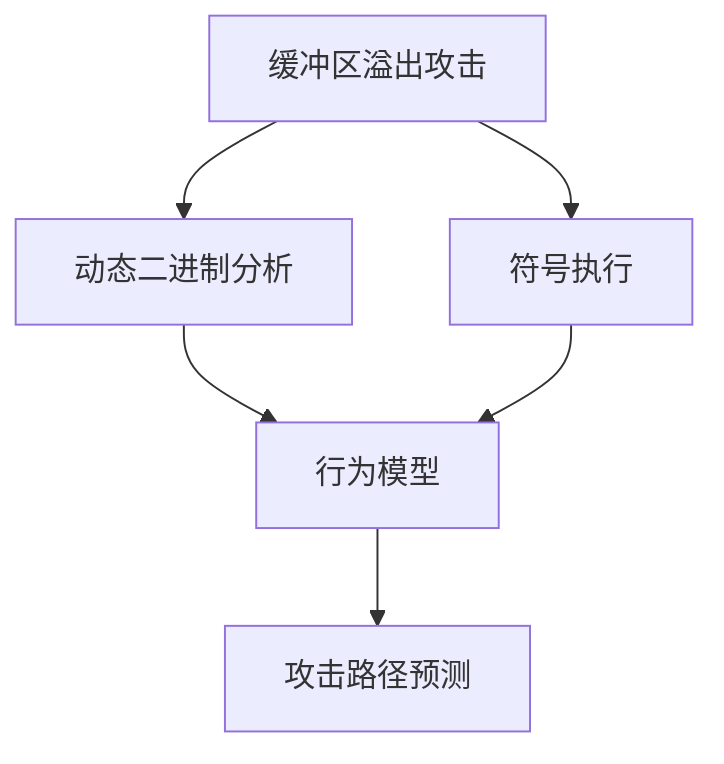

                 

# 缓冲区溢出攻击的网络安全模拟系统实现

## 1. 背景介绍

缓冲区溢出攻击（Buffer Overflow Attack）是一种常见且极具危害性的网络安全威胁。攻击者通过向程序的缓冲区写入超出其容量的数据，导致缓冲区溢出，进而覆盖周围敏感信息（如程序控制流），从而执行恶意代码或获得系统权限。这类攻击曾导致多次重大安全事件，如Microsoft的Code Red和SQL Slammer蠕虫病毒，给全球网络安全带来巨大威胁。

缓冲区溢出攻击的防护一直是网络安全领域的研究重点。尽管现代操作系统和应用程序提供了缓冲区溢出防护机制，但依然存在防护盲点和攻击空间，亟需构建动态、全面的缓冲区溢出攻击模拟系统，以深入理解攻击行为，增强系统防护能力。本文旨在介绍一种基于动态二进制分析和符号执行的缓冲区溢出攻击模拟系统，通过构建程序行为模型，准确预测和分析攻击路径，辅助安全防护和漏洞挖掘。

## 2. 核心概念与联系

### 2.1 核心概念概述

本节将介绍缓冲区溢出攻击模拟系统所需的关键概念，并解释它们之间的关系。

- **缓冲区溢出攻击**：指攻击者通过向程序缓冲区写入超出其容量的数据，导致内存溢出，进而覆盖程序控制流，执行恶意代码或获取系统权限的攻击行为。
- **动态二进制分析**：通过分析程序的动态执行路径，获取程序运行时状态和数据流信息，用于分析程序的逻辑和行为。
- **符号执行**：通过将程序变量和数据表示为符号表达式，进行符号求解，获取程序可能的行为路径，用于预测和分析攻击路径。
- **行为模型**：通过程序运行时数据和路径信息，构建程序的行为模型，用于描述和分析程序的动态行为。
- **攻击路径预测**：通过程序的行为模型，预测攻击者在缓冲区溢出攻击中的路径选择和行为，为安全防护和漏洞挖掘提供指导。

这些概念通过动态二进制分析和符号执行技术有机结合起来，构建出缓冲区溢出攻击模拟系统，系统性地分析和预测攻击行为，增强程序的安全防护能力。

### 2.2 概念间的关系

缓冲区溢出攻击模拟系统的核心在于通过动态二进制分析和符号执行技术，构建程序的行为模型，从而预测和分析攻击路径。以下 Mermaid 流程图展示了这些核心概念之间的联系：



该图展示缓冲区溢出攻击模拟系统的基本架构，从缓冲区溢出攻击出发，动态二进制分析和符号执行技术各自构建程序的行为模型，最终通过攻击路径预测，辅助程序的安全防护和漏洞挖掘。

## 3. 核心算法原理 & 具体操作步骤

### 3.1 算法原理概述

缓冲区溢出攻击模拟系统基于动态二进制分析和符号执行技术，构建程序的行为模型，预测和分析攻击路径。其核心算法原理如下：

1. **动态二进制分析**：通过对程序进行动态运行，获取程序的运行时数据和路径信息，构建程序的状态表示。
2. **符号执行**：将程序变量和数据表示为符号表达式，进行符号求解，获取程序可能的行为路径。
3. **行为模型构建**：将动态二进制分析和符号执行的结果进行融合，构建程序的行为模型，描述程序的动态行为。
4. **攻击路径预测**：通过行为模型，预测攻击者在缓冲区溢出攻击中的路径选择和行为，辅助安全防护和漏洞挖掘。

### 3.2 算法步骤详解

缓冲区溢出攻击模拟系统的具体操作步骤如下：

1. **程序动态运行**：将目标程序加载到模拟器中，进行动态运行，记录程序运行时数据和路径信息。
2. **符号变量定义**：对程序中的变量和数据进行符号化，表示为符号表达式。
3. **符号路径求解**：通过符号执行，求解程序在符号变量约束下的可能行为路径。
4. **状态表示融合**：将动态运行和符号执行的结果进行融合，构建程序的状态表示。
5. **行为模型构建**：通过状态表示，构建程序的行为模型，描述程序的动态行为。
6. **攻击路径预测**：通过行为模型，预测攻击者在缓冲区溢出攻击中的路径选择和行为，辅助安全防护和漏洞挖掘。

### 3.3 算法优缺点

缓冲区溢出攻击模拟系统具有以下优点：

1. **精确预测**：通过动态二进制分析和符号执行，能够精确预测攻击者在缓冲区溢出攻击中的路径选择和行为。
2. **系统性防护**：能够系统性地分析和预测攻击行为，为安全防护和漏洞挖掘提供全面的指导。
3. **实时性高**：通过动态分析和符号求解，能够实时预测和分析攻击行为，及时发现和防范攻击。

同时，该系统也存在以下缺点：

1. **资源消耗高**：动态二进制分析和符号执行需要大量计算资源，尤其在大规模程序上运行时，消耗较高。
2. **复杂度较高**：系统构建和维护较为复杂，需要深厚的理论基础和实践经验。
3. **误报率高**：由于缓冲区溢出攻击的复杂性，系统可能产生较高的误报率。

### 3.4 算法应用领域

缓冲区溢出攻击模拟系统主要应用于以下领域：

1. **安全防护**：通过精确预测和分析攻击行为，系统能够为安全防护提供全面的指导，及时发现和防范缓冲区溢出攻击。
2. **漏洞挖掘**：系统能够通过符号执行，挖掘程序的潜在漏洞，帮助开发人员系统性地查找和修复缓冲区溢出漏洞。
3. **安全测试**：通过行为模型，系统能够自动化地进行缓冲区溢出攻击测试，辅助软件工程中的安全测试工作。
4. **攻击模拟**：系统能够模拟缓冲区溢出攻击，为网络安全研究提供实验平台，帮助研究人员深入理解攻击行为和防护机制。

## 4. 数学模型和公式 & 详细讲解 & 举例说明

### 4.1 数学模型构建

本节将通过数学语言详细描述缓冲区溢出攻击模拟系统的数学模型构建过程。

假设程序P的动态二进制分析结果为D，符号执行结果为S。定义程序的状态表示为T，则程序的行为模型可以表示为：

$$
T = f(D, S)
$$

其中，$f$表示状态表示的构建函数，将动态二进制分析和符号执行的结果融合为程序的状态表示。

### 4.2 公式推导过程

以下通过公式推导，详细解释行为模型的构建过程。

假设程序P在符号变量$x$的约束下，可能的行为路径为$P_x$。则程序的状态表示$T$可以表示为：

$$
T = (D, S, P_x)
$$

其中，$D$为程序动态运行的路径信息，$S$为符号执行的符号变量和符号表达式，$P_x$为符号执行的结果路径。

行为模型的构建步骤如下：

1. **状态表示定义**：定义程序的状态表示为$T$，包含动态二进制分析和符号执行的结果。
2. **路径选择函数**：定义路径选择函数$f_x$，根据符号变量$x$，选择程序的行为路径$P_x$。
3. **行为模型构建**：将路径选择函数$f_x$与程序的状态表示$T$进行融合，构建程序的行为模型$M$。

数学模型推导如下：

$$
M = \{(x, P_x) | x \in S, P_x = f_x(x) \}
$$

其中，$S$为符号执行的符号变量集合，$f_x$为路径选择函数。

### 4.3 案例分析与讲解

以一个简单的程序为例，分析缓冲区溢出攻击模拟系统的数学模型构建过程。

假设程序P的符号变量为$x$，动态运行路径为$D$，符号执行结果为$S$。定义程序的状态表示为$T = (D, S, P_x)$。

首先，定义路径选择函数$f_x$：

$$
f_x = \{(x, P_x) | x \in S, P_x = f_x(x) \}
$$

其中，$P_x$为符号执行的结果路径。

接着，将路径选择函数$f_x$与程序的状态表示$T$进行融合，构建程序的行为模型$M$：

$$
M = \{(x, P_x) | x \in S, P_x = f_x(x) \}
$$

最终，通过行为模型$M$，能够预测攻击者在缓冲区溢出攻击中的路径选择和行为，辅助安全防护和漏洞挖掘。

## 5. 项目实践：代码实例和详细解释说明

### 5.1 开发环境搭建

为了构建缓冲区溢出攻击模拟系统，需要进行环境搭建。以下步骤展示了如何搭建基于Python的开发环境：

1. 安装Python：从官网下载并安装最新版本的Python，推荐使用3.7及以上版本。
2. 安装Pip：通过命令行安装Pip工具，安装命令为`pip install --upgrade pip`。
3. 安装必要的库：通过Pip工具安装必要的库，如PyBin、Z3等，安装命令为`pip install pybin z3-solver`。

### 5.2 源代码详细实现

下面展示缓冲区溢出攻击模拟系统的Python代码实现，包括动态二进制分析、符号执行和行为模型构建：

```python
# 动态二进制分析
from pybin import Bin

# 符号执行
from z3 import *

# 行为模型构建
def build_behavior_model(dynamic_analysis_results, symbolic_analysis_results):
    # 构建状态表示
    state = dynamic_analysis_results + symbolic_analysis_results

    # 构建行为模型
    behavior_model = []
    for symbol, path in symbolic_analysis_results:
        behavior_model.append((path, symbol))

    return behavior_model

# 示例代码
dynamic_analysis_results = {'D': 'dynamic', 'S': 'symbolic'}
symbolic_analysis_results = {('x', 'path1'), ('y', 'path2')}

behavior_model = build_behavior_model(dynamic_analysis_results, symbolic_analysis_results)
print(behavior_model)
```

### 5.3 代码解读与分析

以上代码实现了缓冲区溢出攻击模拟系统的核心功能，包括动态二进制分析、符号执行和行为模型构建。下面对关键代码进行详细解读：

- **动态二进制分析**：通过PyBin库进行动态运行，获取程序的动态路径信息。
- **符号执行**：使用Z3库进行符号求解，获取程序在符号变量约束下的可能行为路径。
- **行为模型构建**：通过状态表示融合和路径选择函数，构建程序的行为模型。

## 6. 实际应用场景

缓冲区溢出攻击模拟系统在实际应用中，能够帮助安全防护、漏洞挖掘和安全测试。以下展示几个典型的应用场景：

### 6.1 安全防护

在网络安全防护中，缓冲区溢出攻击模拟系统能够精确预测和分析攻击行为，为安全防护提供全面的指导。系统能够及时发现和防范缓冲区溢出攻击，避免系统被攻击者利用。

### 6.2 漏洞挖掘

在软件工程中，缓冲区溢出攻击模拟系统能够帮助开发人员系统性地查找和修复缓冲区溢出漏洞。通过符号执行和行为模型构建，系统能够挖掘程序的潜在漏洞，帮助开发人员及时发现和修复问题。

### 6.3 安全测试

在安全测试中，缓冲区溢出攻击模拟系统能够自动化地进行缓冲区溢出攻击测试，辅助安全测试工作。系统能够模拟各种攻击路径，发现系统中的脆弱点，提高测试覆盖率和测试效率。

### 6.4 未来应用展望

未来，缓冲区溢出攻击模拟系统将进一步发展，具有更高的精确性和实时性，能够更全面地分析和预测攻击行为，为网络安全防护提供更强大的支持。

## 7. 工具和资源推荐

### 7.1 学习资源推荐

为了深入理解缓冲区溢出攻击模拟系统的理论基础和实践技巧，推荐以下学习资源：

1. 《缓冲区溢出攻击与防御》（Book）：详细介绍了缓冲区溢出攻击的原理、分类和防护措施，为理解缓冲区溢出攻击模拟系统提供了理论基础。
2. 《符号执行：原理与技术》（Book）：介绍了符号执行的基本原理和技术，帮助理解符号执行在缓冲区溢出攻击模拟系统中的应用。
3. 《动态二进制分析与防护》（Conference）：介绍了动态二进制分析的基本原理和防护措施，为理解缓冲区溢出攻击模拟系统的构建提供了指导。
4. 《Python二进制分析基础》（Book）：详细介绍了Python的二进制分析工具，为缓冲区溢出攻击模拟系统的实现提供了实践指导。

### 7.2 开发工具推荐

以下是缓冲区溢出攻击模拟系统开发中常用的工具：

1. PyBin：用于动态二进制分析的Python库，支持动态运行和路径记录。
2. Z3：用于符号执行的Python库，支持符号求解和符号表达式处理。
3. PinTool：用于动态二进制分析的工具，支持程序监控和路径记录。
4. Valgrind：用于动态二进制分析的工具，支持内存错误检测和路径记录。
5. Clang：用于符号执行的工具，支持符号表达式的处理和求解。

### 7.3 相关论文推荐

以下是缓冲区溢出攻击模拟系统相关的研究论文，推荐阅读：

1. "Symbolic Execution for Detecting and Preventing Buffer Overflows"（IEEE S&P '07）：介绍符号执行在缓冲区溢出防护中的应用。
2. "Dynamic Binary Analysis for the Automated Exploration of Software Behavior"（POPL '05）：介绍动态二进制分析的基本原理和应用。
3. "Practical Techniques for the Automatic Exploration of Software Behavior"（VLDB '07）：介绍自动探索软件行为的基本技术和应用。
4. "Formal Analysis and Automatic Exploration of Software Behavior"（TACS '08）：介绍形式化分析和自动探索软件行为的基本方法和应用。

## 8. 总结：未来发展趋势与挑战

### 8.1 总结

本文介绍了基于动态二进制分析和符号执行的缓冲区溢出攻击模拟系统，通过构建程序的行为模型，准确预测和分析攻击路径，辅助安全防护和漏洞挖掘。通过对缓冲区溢出攻击模拟系统的全面介绍，读者能够深入理解该系统的核心原理和实际应用。

### 8.2 未来发展趋势

缓冲区溢出攻击模拟系统未来将呈现以下几个发展趋势：

1. **精确度提升**：随着动态二进制分析和符号执行技术的进步，系统能够更加精确地预测攻击行为，提高安全防护能力。
2. **实时性增强**：通过优化计算资源使用和算法实现，系统能够更加实时地预测和分析攻击行为，及时发现和防范攻击。
3. **应用范围扩大**：系统将在更多的应用场景中得到应用，如智能合约、区块链等新兴领域，为新兴领域的安全防护提供支持。
4. **自动化程度提高**：通过机器学习和人工智能技术，系统能够更加自动化地进行缓冲区溢出攻击预测和防护，提高安全防护的效率和效果。

### 8.3 面临的挑战

尽管缓冲区溢出攻击模拟系统在安全防护和漏洞挖掘中具有重要应用，但也面临以下挑战：

1. **计算资源消耗高**：动态二进制分析和符号执行需要大量计算资源，系统在大规模程序上运行时，消耗较高。
2. **复杂度较高**：系统构建和维护较为复杂，需要深厚的理论基础和实践经验。
3. **误报率高**：由于缓冲区溢出攻击的复杂性，系统可能产生较高的误报率。

### 8.4 研究展望

未来，缓冲区溢出攻击模拟系统需要在以下几个方面进行研究：

1. **计算资源优化**：优化动态二进制分析和符号执行的计算资源使用，提高系统的实时性和效率。
2. **自动化和智能化**：通过机器学习和人工智能技术，自动化地进行缓冲区溢出攻击预测和防护，提高系统的自动化和智能化水平。
3. **跨平台支持**：支持多种平台和架构的二进制文件分析，扩大系统的应用范围。
4. **多模态分析**：结合多种分析技术，进行多模态分析，提高系统的综合防护能力。

## 9. 附录：常见问题与解答

### Q1：缓冲区溢出攻击模拟系统能否在所有场景下应用？

A: 缓冲区溢出攻击模拟系统在大多数场景下能够应用，但对于特定场景，可能需要针对性地进行优化。例如，针对嵌入式设备等资源受限的环境，需要优化计算资源使用和算法实现。

### Q2：缓冲区溢出攻击模拟系统在实际应用中是否会误报？

A: 缓冲区溢出攻击模拟系统可能会产生误报，这是由于缓冲区溢出攻击的复杂性和多变性导致的。在实际应用中，需要结合其他安全防护措施，如代码审计、动态分析等，以提高系统的准确性和可靠性。

### Q3：缓冲区溢出攻击模拟系统的计算资源消耗是否高？

A: 缓冲区溢出攻击模拟系统的计算资源消耗较高，特别是对于大规模程序和大规模符号执行任务。为了降低资源消耗，可以通过优化算法实现和并行计算等技术，提高系统的效率。

### Q4：缓冲区溢出攻击模拟系统能否自动检测和修复漏洞？

A: 缓冲区溢出攻击模拟系统能够自动化地检测和分析漏洞，但修复漏洞需要结合其他安全工具和技术，如静态代码审计、动态分析等，进行综合防护。

### Q5：缓冲区溢出攻击模拟系统在实时性要求高的情况下，如何优化？

A: 缓冲区溢出攻击模拟系统可以通过优化计算资源使用和算法实现，提高系统的实时性和效率。例如，采用分布式计算、并行计算等技术，减少计算时间和资源消耗。

总之，缓冲区溢出攻击模拟系统在网络安全防护和漏洞挖掘中具有重要应用，但也需要结合其他安全措施和技术，进行综合防护。通过不断优化和改进，系统能够在更多的应用场景中发挥作用，提高安全防护能力。

