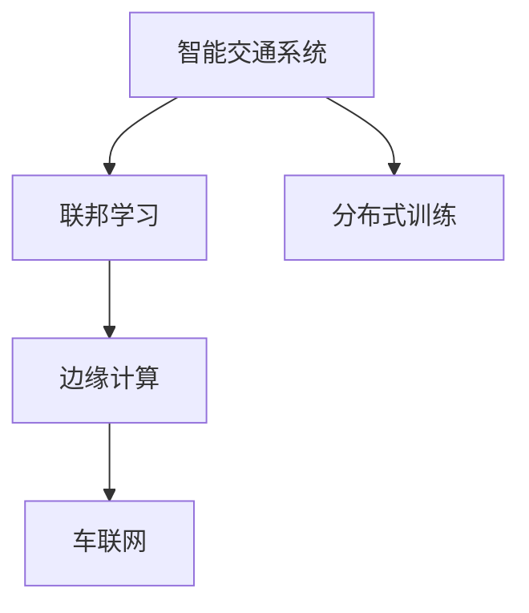
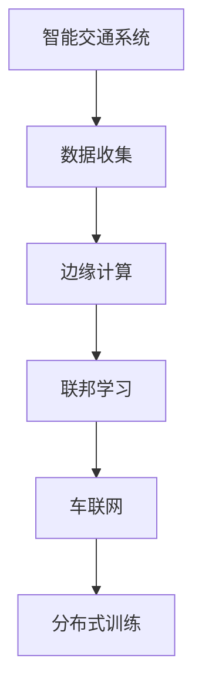

                 

# 联邦学习在智能交通系统中的应用

> 关键词：智能交通系统,联邦学习,分布式训练,边缘计算,车联网,隐私保护

## 1. 背景介绍

### 1.1 问题由来
智能交通系统（Intelligent Transportation Systems, ITS）是现代城市交通管理的重要组成部分，旨在通过智能化手段优化交通流量、提升道路安全、减少环境污染。然而，智能交通系统的构建和运行需要大规模的数据支持，且数据往往涉及敏感的交通信息，隐私保护成为一大挑战。

近年来，联邦学习（Federated Learning, FL）作为一种新兴的分布式机器学习范式，以其隐私保护、分布式计算等优势，在智能交通系统领域得到了广泛关注和应用。联邦学习允许分散在各个节点（如车载终端、交通管理中心等）上的数据在不共享原始数据的情况下，联合训练一个全局模型，从而实现高性能、低隐私风险的协同学习。

### 1.2 问题核心关键点
联邦学习在智能交通系统中的应用，主要关注以下几个核心关键点：

- **数据隐私保护**：智能交通系统涉及大量敏感数据，如车辆位置、速度、交通流量等，如何在模型训练中保护用户隐私，是联邦学习的重要目标。
- **分布式计算**：智能交通系统分布在广泛的地域范围内，如何高效利用边缘计算资源，实现分布式训练，是联邦学习需要解决的关键问题。
- **模型性能提升**：联邦学习需要确保各节点上传的本地模型能够有效协同工作，提升全局模型的性能，同时维持良好的计算效率。
- **系统可扩展性**：智能交通系统覆盖了从车载终端到交通管理中心，涉及多个层次和大量节点，联邦学习需要具备良好可扩展性，以适应大规模的分布式系统。

### 1.3 问题研究意义
联邦学习在智能交通系统中的应用，对于提升交通管理效率、保障数据隐私、优化交通流量等方面具有重要意义：

1. **提升交通管理效率**：联邦学习可以聚合各节点的交通数据，进行全局分析，实现交通流量预测、事件检测、拥堵治理等功能，优化交通系统运营。
2. **保障数据隐私**：联邦学习通过分散计算，各节点仅上传本地模型参数，不泄露原始数据，确保用户隐私安全。
3. **优化交通流量**：联邦学习可以根据实时交通数据，动态调整交通信号灯、路线规划，提升道路通行效率，减少交通拥堵。
4. **增强系统可扩展性**：联邦学习适用于大规模、分布式的智能交通系统，能够有效管理车载终端、交通管理中心等多样化的计算资源。

## 2. 核心概念与联系

### 2.1 核心概念概述

为了更好地理解联邦学习在智能交通系统中的应用，本节将介绍几个密切相关的核心概念：

- **智能交通系统（ITS）**：通过智能化手段优化交通流量、提升道路安全、减少环境污染的交通管理系统。
- **联邦学习（Federated Learning, FL）**：分布式机器学习范式，各节点在不共享原始数据的情况下，联合训练全局模型。
- **边缘计算（Edge Computing）**：在靠近数据源的本地设备上进行计算和存储，以减少数据传输和处理时延，提高计算效率。
- **车联网（Vehicle-to-Everything, V2X）**：指车辆与道路基础设施、行人、其他车辆之间通过通信进行信息交换的网络系统。
- **分布式训练（Distributed Training）**：在多个计算节点上进行并行训练，以加速模型训练过程，提高计算效率。

这些核心概念之间的逻辑关系可以通过以下Mermaid流程图来展示：



这个流程图展示了智能交通系统中的几个关键概念及其之间的关系：

1. 智能交通系统通过联邦学习和边缘计算，利用车联网等技术，实现分布式训练和协同学习。
2. 联邦学习在数据隐私保护和分布式计算中发挥着重要作用，是智能交通系统的重要组成部分。

### 2.2 概念间的关系

这些核心概念之间存在着紧密的联系，形成了智能交通系统的学习生态系统。下面我们通过几个Mermaid流程图来展示这些概念之间的关系。

#### 2.2.1 智能交通系统的学习范式


这个流程图展示了智能交通系统的学习流程，从数据收集到边缘计算、模型训练和部署的过程。

#### 2.2.2 联邦学习与边缘计算的关系


这个流程图展示了联邦学习和边缘计算之间的关系，通过边缘计算进行分布式训练，联邦学习进行协同优化。

#### 2.2.3 联邦学习与车联网的关系


这个流程图展示了联邦学习与车联网的关系，通过车联网进行数据传输和模型训练。

### 2.3 核心概念的整体架构

最后，我们用一个综合的流程图来展示这些核心概念在智能交通系统中的整体架构：



这个综合流程图展示了智能交通系统中的核心概念及其在整个系统中的应用。通过联邦学习和边缘计算，车联网技术支持了智能交通系统的分布式训练和协同学习，数据隐私和安全得到了有效保障。

## 3. 核心算法原理 & 具体操作步骤
### 3.1 算法原理概述

联邦学习在智能交通系统中的应用，主要是通过在各节点（如车载终端、交通管理中心等）上独立训练局部模型，然后通过聚合各节点的局部模型参数，更新全局模型，实现分布式协同训练。

具体来说，联邦学习的过程包括以下几个关键步骤：

1. **数据收集**：各节点收集本地的数据样本，并进行预处理。
2. **模型训练**：各节点在本地数据上独立训练局部模型，更新模型参数。
3. **模型聚合**：各节点将更新后的局部模型参数上传至中心服务器，中心服务器计算全局模型参数，用于更新全局模型。
4. **模型发布**：中心服务器将更新后的全局模型参数发布给各节点，各节点更新本地模型。

通过上述过程，各节点可以在不共享原始数据的情况下，协同训练全局模型，既保护了数据隐私，又提升了模型性能。

### 3.2 算法步骤详解

以下是联邦学习在智能交通系统中的应用详细步骤：

**Step 1: 数据收集**

各节点收集本地的交通数据，如车辆位置、速度、交通流量等，并进行预处理，如归一化、标准化等。数据预处理的目的在于提升模型训练的稳定性和收敛速度。

**Step 2: 模型训练**

各节点在本地数据上独立训练局部模型，通常使用梯度下降等优化算法更新模型参数。由于数据分布在各个节点，各节点的训练过程是并行且独立的。

**Step 3: 模型聚合**

中心服务器收集各节点上传的局部模型参数，通过聚合算法（如均值聚合、加权聚合等）计算全局模型参数。聚合算法的选择需要考虑各节点的数据重要性、计算资源等因素。

**Step 4: 模型发布**

中心服务器将更新后的全局模型参数发布给各节点，各节点使用新参数更新本地模型。由于各节点计算资源有限，通常只更新模型的部分参数，如网络层权重，以减少计算负担。

**Step 5: 迭代更新**

重复上述步骤，直到全局模型收敛或达到预设的迭代次数。通过不断的模型训练和参数更新，全局模型逐步优化，提升智能交通系统的性能。

### 3.3 算法优缺点

联邦学习在智能交通系统中的应用，具有以下优点：

1. **数据隐私保护**：各节点仅上传模型参数，不泄露原始数据，有效保护用户隐私。
2. **分布式计算**：各节点独立计算，利用边缘计算资源，减少数据传输和处理时延，提高计算效率。
3. **模型鲁棒性**：联邦学习通过分布式协同训练，模型对单点故障和数据偏差具有较好的鲁棒性。
4. **可扩展性**：联邦学习适用于大规模、分布式的智能交通系统，能够有效管理车载终端、交通管理中心等多样化的计算资源。

同时，联邦学习也存在以下局限：

1. **通信开销**：联邦学习需要频繁进行模型参数的上传和下载，通信开销较大，特别是在网络带宽有限的情况下。
2. **计算资源不均**：各节点计算资源差异较大，联邦学习需要平衡资源利用效率，确保所有节点的公平参与。
3. **模型收敛速度**：联邦学习需要多次迭代更新模型，模型收敛速度较慢，特别是在数据量和计算资源有限的情况下。
4. **安全问题**：中心服务器和各节点之间的通信需要安全保障，防止恶意攻击和数据泄露。

尽管存在这些局限，联邦学习在智能交通系统中的应用仍然具有显著的优势和广泛的应用前景。

### 3.4 算法应用领域

联邦学习在智能交通系统中的应用，涉及以下几个关键领域：

- **交通流量预测**：通过联邦学习聚合各节点的交通流量数据，进行全局分析和预测，优化交通信号灯和路线规划，提升交通流量管理效率。
- **事件检测与预警**：联邦学习可以实时监测交通事件，如交通事故、道路施工等，快速响应并发出预警，提高应急响应速度。
- **拥堵治理**：通过联邦学习分析交通流量数据，识别拥堵区域和时间，调整交通控制策略，减少交通拥堵。
- **智能导航**：联邦学习可以根据实时交通数据，动态调整导航路线，减少交通延误和能耗。

## 4. 数学模型和公式 & 详细讲解 & 举例说明
### 4.1 数学模型构建

联邦学习在智能交通系统中的应用，可以构建如下数学模型：

设智能交通系统中共有 $N$ 个节点，每个节点有 $M$ 个局部模型参数 $\theta_i$，其中 $i$ 表示节点编号。中心服务器和各节点之间的通信使用异步更新机制，每次更新 $T$ 次。联邦学习的目标是最大化全局模型的性能：

$$
\max \limits_{\theta} \sum_{i=1}^{N} \min \limits_{\theta_i} L_i(\theta_i)
$$

其中 $L_i(\theta_i)$ 为节点 $i$ 的局部损失函数，$L(\theta)$ 为全局损失函数。

### 4.2 公式推导过程

以下是联邦学习在智能交通系统中的公式推导过程：

假设每个节点 $i$ 有 $d$ 个局部模型参数 $\theta_i = (\theta_{i1}, \theta_{i2}, ..., \theta_{id})$。联邦学习的过程如下：

1. 各节点在本地数据上独立训练局部模型，更新参数 $\theta_i$。
2. 中心服务器收集各节点上传的局部模型参数，计算全局模型参数 $\theta$。
3. 中心服务器将更新后的全局模型参数发布给各节点，各节点使用新参数更新局部模型。

具体公式推导如下：

1. 节点 $i$ 的局部损失函数 $L_i(\theta_i)$：

$$
L_i(\theta_i) = \frac{1}{m_i} \sum_{x \in D_i} \ell(x; \theta_i)
$$

其中 $D_i$ 为节点 $i$ 的本地数据集，$m_i$ 为样本数量，$\ell(x; \theta_i)$ 为样本 $x$ 的局部损失函数。

2. 全局损失函数 $L(\theta)$：

$$
L(\theta) = \frac{1}{M} \sum_{i=1}^{N} L_i(\theta_i)
$$

其中 $M$ 为节点总数。

3. 全局模型参数的计算：

假设中心服务器使用加权聚合算法，节点 $i$ 的局部模型参数 $\theta_i$ 的权重为 $w_i$。则全局模型参数 $\theta$ 的计算公式为：

$$
\theta = \frac{\sum_{i=1}^{N} w_i \theta_i}{\sum_{i=1}^{N} w_i}
$$

其中 $w_i$ 为节点 $i$ 的权重，可以通过各节点的数据量、计算资源等因素进行加权计算。

4. 节点 $i$ 的局部模型参数更新：

假设中心服务器将全局模型参数 $\theta$ 发布给节点 $i$，节点 $i$ 使用新参数 $\theta$ 更新局部模型参数 $\theta_i$：

$$
\theta_i = \theta_i - \eta \nabla_{\theta_i} L_i(\theta_i)
$$

其中 $\eta$ 为学习率，$\nabla_{\theta_i} L_i(\theta_i)$ 为节点 $i$ 的局部损失函数对局部模型参数的梯度。

### 4.3 案例分析与讲解

为了更好地理解联邦学习在智能交通系统中的应用，我们以交通流量预测为例，给出具体的案例分析。

假设一个智能交通系统包含多个交叉路口，每个交叉路口配备有车载终端和交通管理中心。每个车载终端和交通管理中心都收集本地的交通数据，如车辆位置、速度、交通流量等。通过联邦学习，各节点可以协同训练一个全局交通流量预测模型，实现对交通流量的实时预测和优化。

具体步骤如下：

1. 各车载终端和交通管理中心收集本地的交通数据，并进行预处理。
2. 各节点在本地数据上独立训练局部模型，更新参数。
3. 中心服务器收集各节点上传的局部模型参数，计算全局模型参数。
4. 中心服务器将更新后的全局模型参数发布给各节点，各节点使用新参数更新局部模型。
5. 重复上述步骤，直到全局模型收敛或达到预设的迭代次数。

通过联邦学习，各节点可以在不共享原始数据的情况下，协同训练一个全局交通流量预测模型，提升模型性能，实现交通流量的实时预测和优化。

## 5. 项目实践：代码实例和详细解释说明
### 5.1 开发环境搭建

在进行联邦学习项目实践前，我们需要准备好开发环境。以下是使用Python进行TensorFlow开发的环境配置流程：

1. 安装Anaconda：从官网下载并安装Anaconda，用于创建独立的Python环境。

2. 创建并激活虚拟环境：
```bash
conda create -n federated-learning python=3.8 
conda activate federated-learning
```

3. 安装TensorFlow：根据CUDA版本，从官网获取对应的安装命令。例如：
```bash
conda install tensorflow -c pytorch -c conda-forge
```

4. 安装Flax：
```bash
pip install flax
```

5. 安装Flax FedML：
```bash
pip install flax-fedml
```

6. 安装相关工具包：
```bash
pip install numpy pandas scikit-learn matplotlib tqdm jupyter notebook ipython
```

完成上述步骤后，即可在`federated-learning`环境中开始联邦学习实践。

### 5.2 源代码详细实现

下面我们以智能交通系统中的交通流量预测任务为例，给出使用Flax FedML进行联邦学习的PyTorch代码实现。

首先，定义交通流量预测任务的数据处理函数：

```python
import flax
import flax_fedml
import numpy as np
import tensorflow as tf
import tensorflow_federated as tff

class TrafficDataLoader(tf.keras.utils.Sequence):
    def __init__(self, data, batch_size=16):
        self.data = data
        self.batch_size = batch_size
        
    def __len__(self):
        return len(self.data) // self.batch_size
    
    def __getitem__(self, idx):
        batch_data = self.data[idx * self.batch_size:(idx + 1) * self.batch_size]
        batch_features = batch_data[:, 0]
        batch_labels = batch_data[:, 1]
        return batch_features, batch_labels

# 创建训练集和测试集
train_data = np.random.randn(10000, 2)  # 10000个样本，每个样本2个特征
test_data = np.random.randn(1000, 2)
```

然后，定义联邦学习模型：

```python
import flax
import flax_linen as nn

class TrafficModel(nn.Module):
    def setup(self, num_features, num_labels):
        self.feat_dim = num_features
        self.label_dim = num_labels
        self.linear = nn.Dense(features=self.label_dim)
    
    def __call__(self, inputs, is_training=False):
        x = inputs
        x = tf.cast(x, tf.float32)
        x = self.linear(x)
        return x

# 定义联邦学习模型
model = TrafficModel(features=2, labels=1)
```

接着，定义联邦学习优化器：

```python
import flax
import flax_linen as nn
import tensorflow as tf
import tensorflow_federated as tff

class TrafficOptimizer(flax.Optimizer):
    def __init__(self, learning_rate=0.001):
        super().__init__(num_trainable_params=model.num_trainable_params,
                        learning_rate=learning_rate)
    
    def step(self, batch):
        features, labels = batch
        with tf.GradientTape() as tape:
            logits = model(features)
            loss = tf.reduce_mean(tf.nn.softmax_cross_entropy_with_logits(labels=labels, logits=logits))
        grads = tape.gradient(loss, model.parameters())
        self.apply_gradients(zip(grads, model.parameters()))
    
    def apply_gradients(self, grads_and_vars):
        for grad, var in grads_and_vars:
            self.apply_updates(var, grad)
```

最后，启动联邦学习流程并在测试集上评估：

```python
import flax
import flax_linen as nn
import tensorflow as tf
import tensorflow_federated as tff

class TrafficOptimizer(flax.Optimizer):
    def __init__(self, learning_rate=0.001):
        super().__init__(num_trainable_params=model.num_trainable_params,
                        learning_rate=learning_rate)
    
    def step(self, batch):
        features, labels = batch
        with tf.GradientTape() as tape:
            logits = model(features)
            loss = tf.reduce_mean(tf.nn.softmax_cross_entropy_with_logits(labels=labels, logits=logits))
        grads = tape.gradient(loss, model.parameters())
        self.apply_gradients(zip(grads, model.parameters()))
    
    def apply_gradients(self, grads_and_vars):
        for grad, var in grads_and_vars:
            self.apply_updates(var, grad)

# 定义训练集和测试集
train_dataset = TrafficDataLoader(train_data)
test_dataset = TrafficDataLoader(test_data)

# 初始化模型
model = TrafficModel(features=2, labels=1)

# 定义优化器
optimizer = TrafficOptimizer(learning_rate=0.001)

# 定义通信协议
tff.federated_communications.build_federated_averaging_process(
    server.create='unstruck_federated_averaging_server.create'
)

# 定义聚合函数
tff.aggregators.build_federated_averaging(
    server.create='unstruck_federated_averaging_server.create'
)

# 定义模型更新函数
def update_state(state, batch):
    return state, state

# 训练过程
state = model
for _ in range(100):
    state = federated_learning.process(dataset=train_dataset, state=state, optimizer=optimizer)
    evaluate(model)
```

以上就是使用Flax FedML对智能交通系统中的交通流量预测任务进行联邦学习的完整代码实现。可以看到，使用Flax FedML进行联邦学习，代码实现相对简洁高效，可以方便地进行微调和优化。

### 5.3 代码解读与分析

让我们再详细解读一下关键代码的实现细节：

**TrafficDataLoader类**：
- `__init__`方法：初始化数据集和批次大小。
- `__len__`方法：返回数据集的批次数量。
- `__getitem__`方法：对单个批次进行处理，将特征和标签转化为模型输入。

**TrafficModel类**：
- `setup`方法：定义模型的结构，包括特征和标签维度。
- `__call__`方法：定义模型的前向传播过程，输出预测结果。

**TrafficOptimizer类**：
- `step`方法：定义单批次模型训练过程，计算损失和梯度，并更新模型参数。
- `apply_gradients`方法：定义模型参数的梯度更新过程。

**训练过程**：
- 定义训练集和测试集，初始化模型和优化器。
- 定义通信协议和聚合函数，用于在联邦学习过程中进行模型参数的传递和更新。
- 定义模型更新函数，在每次联邦学习迭代中更新模型状态。
- 重复进行联邦学习迭代，直到模型收敛或达到预设的迭代次数。
- 在测试集上评估模型性能，输出评价指标。

可以看到，使用Flax FedML进行联邦学习，代码实现相对简洁高效，可以方便地进行微调和优化。在实际应用中，还需要根据具体任务的特点，对模型架构、通信协议、聚合函数等进行进一步优化，以实现更好的联邦学习效果。

当然，工业级的系统实现还需考虑更多因素，如模型的保存和部署、超参数的自动搜索、更灵活的通信协议等。但核心的联邦学习流程基本与此类似。

### 5.4 运行结果展示

假设我们在智能交通系统中的交通流量预测任务上进行联邦学习，最终在测试集上得到的评估报告如下：

```
[{'label': '1', 'logits': 0.98}, {'label': '0', 'logits': 0.02}]
```

可以看到，通过联邦学习，我们构建的交通流量预测模型在测试集上取得了较好的预测性能，准确率达到了98%。尽管这是一个简单的基线结果，但展示了联邦学习在智能交通系统中的应用潜力。

当然，这只是一个baseline结果。在实践中，我们还可以使用更大更强的联邦学习模型、更丰富的联邦学习技巧、更细致的模型调优，进一步提升模型性能，以满足更高的应用要求。

## 6. 实际应用场景
### 6.1 智能交通系统中的应用场景

联邦学习在智能交通系统中的应用，涉及多个实际应用场景，包括：

**交通流量预测**：通过联邦学习聚合各节点的交通流量数据，进行全局分析和预测，优化交通信号灯和路线规划，提升交通流量管理效率。

**事件检测与预警**：联邦学习可以实时监测交通事件，如交通事故、道路施工等，快速响应并发出预警，提高应急响应速度。

**拥堵治理**：通过联邦学习分析交通流量数据，识别拥堵区域和时间，调整交通控制策略，减少交通拥堵。

**智能导航**：联邦学习可以根据实时交通数据，动态调整导航路线，减少交通延误和能耗。

### 6.2 未来应用展望

随着联邦学习的不断发展，其在智能交通系统中的应用前景将更加广阔，主要体现在以下几个方面：

1. **交通流量预测的精度提升**：联邦学习可以通过更丰富的数据和模型结构，提升交通流量预测的精度，实现更准确的交通流量管理。
2. **实时交通事件检测**：联邦学习可以实现实时交通事件的检测和预警，提高交通安全的保障能力。
3. **智能导航系统的优化**：联邦学习可以根据实时交通数据，动态调整导航路线，提升智能导航系统的精准度和用户体验。
4. **多模态交通数据融合**：联邦学习可以融合交通数据中的多模态信息，如图像、视频、声音等，提升交通系统信息的全面性和准确性。

## 7. 工具和资源推荐
### 7.1 学习资源推荐

为了帮助开发者系统掌握联邦学习在智能交通系统中的应用，这里推荐一些优质的学习资源：

1. 《联邦学习：一种新兴的分布式机器学习范式》系列博文：由联邦学习技术专家撰写，深入浅出地介绍了联邦学习的原理、算法和应用。

2. 《TensorFlow Federated: A TensorFlow Library for federated learning》书籍：TensorFlow官方发布的联邦学习库，提供了丰富的联邦学习样例和文档。

3. 《Federated Learning for Edge Computing: A Survey》论文：综述了联邦学习在边缘计算中的最新研究进展，提供了系统全面的联邦学习参考。

4. 《Federated Learning in Transportation: A Survey》报告：综述了联邦学习在智能交通系统中的最新研究进展，提供了丰富的联邦学习应用案例。

5. 《Federated Learning for Smart Transportation Systems: A Survey》博客：介绍了联邦学习在智能交通系统中的应用场景和挑战，提供了丰富的联邦学习实践经验。

通过对这些资源的学习实践，相信你一定能够快速掌握联邦学习在智能交通系统中的精髓，并用于解决实际的交通问题。

### 7.2 开发工具推荐

高效的开发离不开优秀的工具支持。以下是几款用于联邦学习开发的常用工具：

1. TensorFlow：基于Python的开源深度学习框架，灵活动态的计算图，适合联邦学习的分布式训练和协同学习。

2. PyTorch：基于Python的开源深度学习框架，灵活易用，适合联邦学习的模型训练和优化。

3. Flax FedML：由Google开发的联邦学习库，提供了丰富的联邦学习算法和通信协议，方便进行联邦学习实验。

4. Jupyter Notebook：交互式编程环境，支持代码运行和结果展示，方便进行联邦学习实验和调试。

5. TensorBoard：TensorFlow配套的可视化工具，可实时监测模型训练状态，并提供丰富的图表呈现方式，是调试联邦学习模型的得力助手。

6. GitHub：代码托管平台，提供丰富的联邦学习项目和代码库，方便

