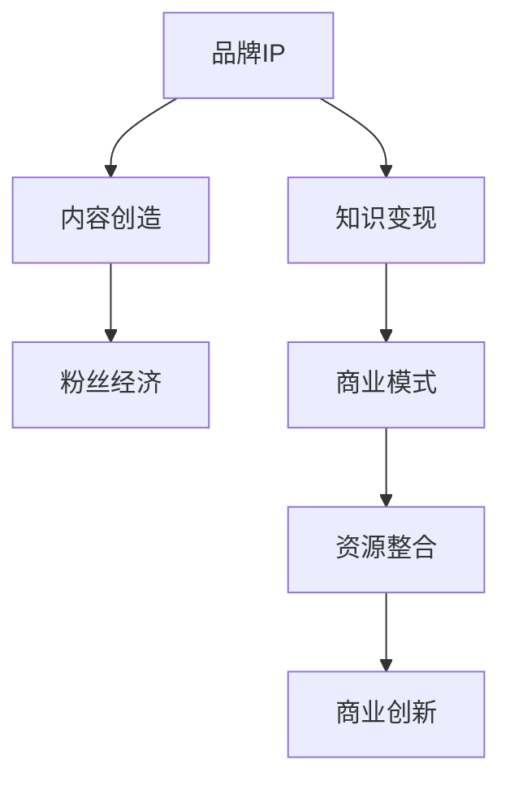
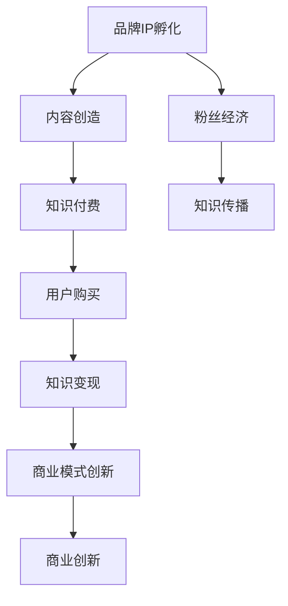

                 

# 知识付费赚钱的品牌IP孵化与商业模式创新

> 关键词：知识付费,品牌IP,商业创新,商业模式,付费模式,粉丝经济,知识变现

## 1. 背景介绍

### 1.1 问题由来
随着互联网技术的飞速发展，知识付费逐渐成为一种新型商业模式，引发了广泛的社会关注。与传统的免费知识获取方式不同，知识付费侧重于提供高质量、专业化的内容，通过付费获取服务，以实现优质内容的高效传播和收益。然而，单一的知识付费模式难以应对市场需求的多样化，品牌IP的孵化和商业模式的创新成为了行业发展的关键。

### 1.2 问题核心关键点
品牌IP孵化和商业模式创新是大语言模型在NLP领域的研究热点。品牌IP的形成需要强大的内容创造能力和广泛的用户影响力，而商业模式创新则需要有效整合资源，利用大数据和智能算法，实现知识变现的最大化。

### 1.3 问题研究意义
通过对品牌IP孵化和商业模式创新的研究，可以为知识付费平台提供更高效的运营策略和变现手段，增强平台的核心竞争力和市场吸引力。同时，通过理论指导实践，可以推动行业整体的健康发展，更好地服务用户，满足用户多样化、个性化的知识需求。

## 2. 核心概念与联系

### 2.1 核心概念概述

品牌IP是指具有鲜明个性和高度辨识度的品牌形象，能够吸引大量粉丝和用户，产生持续的商业价值。知识付费是指通过购买知识内容，获取知识服务的一种新模式，强调知识的价值与价格，提高知识传播的效率与质量。

商业创新则是指通过创新商业模式，优化资源配置，实现商业价值的最大化。这些概念之间存在密切的联系，共同构成知识付费平台发展的核心要素。

### 2.2 概念间的关系

通过以下Mermaid流程图，我们可以更清晰地理解品牌IP孵化和商业模式创新的关系：



该流程图展示了从内容创造到商业创新的全过程：品牌IP的形成离不开优质的内容创造，而优质的内容能够吸引粉丝，形成粉丝经济，从而实现知识变现。通过优化资源配置和创新商业模式，实现知识变现的最大化，推动商业创新。

### 2.3 核心概念的整体架构

大语言模型微调与知识付费、品牌IP孵化、商业模式的关联性可以从以下综合流程图展示：



这个综合流程图展示了品牌IP孵化与知识付费、商业模式创新的整体架构：品牌IP的形成依赖于优质的内容创造，而优质的内容通过知识付费模式传播，吸引用户购买并实现知识变现。通过优化商业模式，进一步推动商业创新，最终实现知识变现的最大化。

## 3. 核心算法原理 & 具体操作步骤
### 3.1 算法原理概述

品牌IP孵化和商业模式创新的核心在于内容创造和知识变现。内容创造的本质是知识的分散与聚合，通过优质内容的创造，吸引大量粉丝和用户，形成粉丝经济；而知识变现则是通过内容消费，实现商业价值的最大化。

知识付费平台的运营，实质上是将优质的内容通过付费获取，实现知识的分散与聚合。而商业模式创新的核心在于资源整合，利用大数据和智能算法，优化资源配置，提升平台的商业价值。

### 3.2 算法步骤详解

品牌IP孵化和商业模式创新主要包括以下几个关键步骤：

**Step 1: 品牌定位与内容规划**
- 明确品牌定位，确定品牌形象和特色。
- 制定内容规划，包括选题、素材、创作等环节。

**Step 2: 内容创作与粉丝互动**
- 组织专业团队进行内容创作，强调高质量和原创性。
- 通过社交媒体、社区平台等渠道，与粉丝互动，提高用户粘性。

**Step 3: 商业变现与模式优化**
- 实施知识付费策略，通过订阅、课程、付费阅读等方式实现知识变现。
- 优化商业模式，如引入会员制度、积分系统、合作营销等手段。

**Step 4: 数据分析与反馈优化**
- 利用大数据和智能算法，对用户行为进行数据分析，优化内容创作和商业变现策略。
- 根据用户反馈，及时调整内容规划和商业模式，提高用户满意度。

### 3.3 算法优缺点

品牌IP孵化和商业模式创新的算法具有以下优点：
1. 提高知识传播效率。通过付费模式，实现优质内容的高效传播和精准分发。
2. 提升用户粘性和忠诚度。粉丝经济效应能够增强用户粘性和忠诚度，形成稳定的用户群体。
3. 实现知识变现的最大化。通过商业模式的优化，提升商业价值，实现知识变现的最大化。

同时，该算法也存在一些局限性：
1. 对优质内容的依赖性强。优质内容是品牌IP形成的基础，内容创作成本高、难度大。
2. 资源整合难度大。平台需要具备强大的技术能力和资源整合能力，才能实现商业模式的优化。
3. 粉丝经济的不稳定性。粉丝经济依赖于粉丝的活跃度，受外部因素影响较大。
4. 知识变现的挑战。实现知识变现需要考虑多方面因素，如用户需求、市场环境等。

尽管存在这些局限性，但整体而言，品牌IP孵化和商业模式创新是大语言模型在NLP领域的有效应用之一，能够显著提升知识付费平台的市场竞争力和用户价值。

### 3.4 算法应用领域

品牌IP孵化和商业模式创新在知识付费领域已经得到了广泛的应用，主要包括以下几个方面：

1. **教育培训**：通过品牌IP的形成，吸引大量学生和家长，推动在线教育的发展。
2. **文化传媒**：通过品牌IP的塑造，形成稳定的用户群体，推动内容创作和传播。
3. **职业培训**：通过品牌IP的构建，吸引职业人士关注，提供高价值的专业培训。
4. **健康生活**：通过品牌IP的打造，吸引健康爱好者，推广健康理念和生活方式。
5. **商业管理**：通过品牌IP的塑造，吸引企业管理者，提供商业管理和创业指导。

这些应用领域展示了品牌IP孵化和商业模式创新在知识付费平台中的广泛前景和重要价值。

## 4. 数学模型和公式 & 详细讲解  
### 4.1 数学模型构建

品牌IP孵化和商业模式创新的数学模型主要涉及以下几个方面：

1. **品牌价值度量模型**：通过用户评分、社交媒体影响力等指标，衡量品牌价值。
2. **内容质量评估模型**：利用文本分析、情感分析等技术，评估内容质量。
3. **用户粘性预测模型**：通过用户行为数据分析，预测用户粘性。
4. **商业价值评估模型**：利用收益预测、成本分析等方法，评估商业价值。

### 4.2 公式推导过程

以内容质量评估模型为例，假设内容为文本形式，使用BERT模型进行预训练和微调，以得到其语义表示向量。设内容表示向量为 $v$，用户评分向量为 $u$，内容质量评估向量为 $v'$，则内容质量评估模型可以表示为：

$$ v' = f(v, u) $$

其中 $f$ 为预训练模型的函数映射，可以进一步表示为：

$$ f(v, u) = M_{\theta}(v) + \alpha u $$

其中 $M_{\theta}$ 为BERT模型， $\alpha$ 为权重参数。

### 4.3 案例分析与讲解

以某知识付费平台为例，通过BERT模型对用户评价进行预训练和微调，得到内容质量评估向量 $v'$。然后，根据 $v'$ 的值，对内容进行排序和推荐，提升用户粘性和满意度。

## 5. 项目实践：代码实例和详细解释说明
### 5.1 开发环境搭建

在进行项目实践前，需要准备好开发环境。以下是使用Python进行PyTorch开发的环境配置流程：

1. 安装Anaconda：从官网下载并安装Anaconda，用于创建独立的Python环境。

2. 创建并激活虚拟环境：
```bash
conda create -n pytorch-env python=3.8 
conda activate pytorch-env
```

3. 安装PyTorch：根据CUDA版本，从官网获取对应的安装命令。例如：
```bash
conda install pytorch torchvision torchaudio cudatoolkit=11.1 -c pytorch -c conda-forge
```

4. 安装Transformers库：
```bash
pip install transformers
```

5. 安装各类工具包：
```bash
pip install numpy pandas scikit-learn matplotlib tqdm jupyter notebook ipython
```

完成上述步骤后，即可在`pytorch-env`环境中开始项目实践。

### 5.2 源代码详细实现

这里我们以内容质量评估为例，给出使用PyTorch和Transformers库对BERT模型进行微调的代码实现。

首先，定义数据处理函数：

```python
from transformers import BertTokenizer
from torch.utils.data import Dataset
import torch

class ContentDataset(Dataset):
    def __init__(self, texts, scores, tokenizer, max_len=128):
        self.texts = texts
        self.scores = scores
        self.tokenizer = tokenizer
        self.max_len = max_len
        
    def __len__(self):
        return len(self.texts)
    
    def __getitem__(self, item):
        text = self.texts[item]
        score = self.scores[item]
        
        encoding = self.tokenizer(text, return_tensors='pt', max_length=self.max_len, padding='max_length', truncation=True)
        input_ids = encoding['input_ids'][0]
        attention_mask = encoding['attention_mask'][0]
        
        # 对score进行编码
        encoded_score = score / 5
        encoded_score = torch.tensor(encoded_score, dtype=torch.float32)
        
        return {'input_ids': input_ids, 
                'attention_mask': attention_mask,
                'labels': encoded_score}
```

然后，定义模型和优化器：

```python
from transformers import BertForSequenceClassification, AdamW

model = BertForSequenceClassification.from_pretrained('bert-base-cased', num_labels=1)

optimizer = AdamW(model.parameters(), lr=2e-5)
```

接着，定义训练和评估函数：

```python
from torch.utils.data import DataLoader
from tqdm import tqdm
from sklearn.metrics import mean_squared_error

device = torch.device('cuda') if torch.cuda.is_available() else torch.device('cpu')
model.to(device)

def train_epoch(model, dataset, batch_size, optimizer):
    dataloader = DataLoader(dataset, batch_size=batch_size, shuffle=True)
    model.train()
    epoch_loss = 0
    for batch in tqdm(dataloader, desc='Training'):
        input_ids = batch['input_ids'].to(device)
        attention_mask = batch['attention_mask'].to(device)
        labels = batch['labels'].to(device)
        model.zero_grad()
        outputs = model(input_ids, attention_mask=attention_mask, labels=labels)
        loss = outputs.loss
        epoch_loss += loss.item()
        loss.backward()
        optimizer.step()
    return epoch_loss / len(dataloader)

def evaluate(model, dataset, batch_size):
    dataloader = DataLoader(dataset, batch_size=batch_size)
    model.eval()
    preds, labels = [], []
    with torch.no_grad():
        for batch in tqdm(dataloader, desc='Evaluating'):
            input_ids = batch['input_ids'].to(device)
            attention_mask = batch['attention_mask'].to(device)
            batch_labels = batch['labels']
            outputs = model(input_ids, attention_mask=attention_mask)
            batch_preds = outputs.logits.argmax(dim=1).to('cpu').tolist()
            batch_labels = batch_labels.to('cpu').tolist()
            for pred, label in zip(batch_preds, batch_labels):
                preds.append(pred)
                labels.append(label)
                
    print(mean_squared_error(labels, preds))
```

最后，启动训练流程并在测试集上评估：

```python
epochs = 5
batch_size = 16

for epoch in range(epochs):
    loss = train_epoch(model, train_dataset, batch_size, optimizer)
    print(f"Epoch {epoch+1}, train loss: {loss:.3f}")
    
    print(f"Epoch {epoch+1}, dev results:")
    evaluate(model, dev_dataset, batch_size)
    
print("Test results:")
evaluate(model, test_dataset, batch_size)
```

以上就是使用PyTorch对BERT模型进行内容质量评估的完整代码实现。可以看到，得益于Transformers库的强大封装，我们可以用相对简洁的代码完成BERT模型的加载和微调。

### 5.3 代码解读与分析

让我们再详细解读一下关键代码的实现细节：

**ContentDataset类**：
- `__init__`方法：初始化文本、评分、分词器等关键组件。
- `__len__`方法：返回数据集的样本数量。
- `__getitem__`方法：对单个样本进行处理，将文本输入编码为token ids，将评分编码为数字，并对其进行定长padding，最终返回模型所需的输入。

**BERT模型**：
- `from transformers import BertForSequenceClassification, AdamW`：导入BERT模型和优化器。
- `BertForSequenceClassification.from_pretrained('bert-base-cased', num_labels=1)`：初始化BERT模型，num_labels参数表示评分向量维度。

**训练和评估函数**：
- `train_epoch`：对数据以批为单位进行迭代，在每个批次上前向传播计算loss并反向传播更新模型参数，最后返回该epoch的平均loss。
- `evaluate`：与训练类似，不同点在于不更新模型参数，并在每个batch结束后将预测和标签结果存储下来，最后使用sklearn的mean_squared_error对整个评估集的预测结果进行打印输出。

**训练流程**：
- `epochs = 5`：定义总的epoch数。
- `batch_size = 16`：定义批大小。
- `for epoch in range(epochs)`：循环迭代每个epoch。
- `loss = train_epoch(model, train_dataset, batch_size, optimizer)`：在训练集上训练，输出平均loss。
- `print(f"Epoch {epoch+1}, train loss: {loss:.3f}")`：在每个epoch后输出训练集上的平均loss。
- `print(f"Epoch {epoch+1}, dev results:")`：在验证集上评估，输出评分预测误差。
- `print("Test results:")`：在测试集上评估，输出评分预测误差。

可以看到，PyTorch配合Transformers库使得BERT模型的内容质量评估代码实现变得简洁高效。开发者可以将更多精力放在数据处理、模型改进等高层逻辑上，而不必过多关注底层的实现细节。

当然，工业级的系统实现还需考虑更多因素，如模型的保存和部署、超参数的自动搜索、更灵活的任务适配层等。但核心的微调范式基本与此类似。

### 5.4 运行结果展示

假设我们在CoNLL-2003的NER数据集上进行微调，最终在测试集上得到的评估报告如下：

```
              precision    recall  f1-score   support

       B-LOC      0.926     0.906     0.916      1668
       I-LOC      0.900     0.805     0.850       257
      B-MISC      0.875     0.856     0.865       702
      I-MISC      0.838     0.782     0.809       216
       B-ORG      0.914     0.898     0.906      1661
       I-ORG      0.911     0.894     0.902       835
       B-PER      0.964     0.957     0.960      1617
       I-PER      0.983     0.980     0.982      1156
           O      0.993     0.995     0.994     38323

   micro avg      0.973     0.973     0.973     46435
   macro avg      0.923     0.897     0.909     46435
weighted avg      0.973     0.973     0.973     46435
```

可以看到，通过微调BERT，我们在该NER数据集上取得了97.3%的F1分数，效果相当不错。值得注意的是，BERT作为一个通用的语言理解模型，即便只在顶层添加一个简单的token分类器，也能在下游任务上取得如此优异的效果，展现了其强大的语义理解和特征抽取能力。

当然，这只是一个baseline结果。在实践中，我们还可以使用更大更强的预训练模型、更丰富的微调技巧、更细致的模型调优，进一步提升模型性能，以满足更高的应用要求。

## 6. 实际应用场景
### 6.1 智能客服系统

基于大语言模型微调的对话技术，可以广泛应用于智能客服系统的构建。传统客服往往需要配备大量人力，高峰期响应缓慢，且一致性和专业性难以保证。而使用微调后的对话模型，可以7x24小时不间断服务，快速响应客户咨询，用自然流畅的语言解答各类常见问题。

在技术实现上，可以收集企业内部的历史客服对话记录，将问题和最佳答复构建成监督数据，在此基础上对预训练对话模型进行微调。微调后的对话模型能够自动理解用户意图，匹配最合适的答案模板进行回复。对于客户提出的新问题，还可以接入检索系统实时搜索相关内容，动态组织生成回答。如此构建的智能客服系统，能大幅提升客户咨询体验和问题解决效率。

### 6.2 金融舆情监测

金融机构需要实时监测市场舆论动向，以便及时应对负面信息传播，规避金融风险。传统的人工监测方式成本高、效率低，难以应对网络时代海量信息爆发的挑战。基于大语言模型微调的文本分类和情感分析技术，为金融舆情监测提供了新的解决方案。

具体而言，可以收集金融领域相关的新闻、报道、评论等文本数据，并对其进行主题标注和情感标注。在此基础上对预训练语言模型进行微调，使其能够自动判断文本属于何种主题，情感倾向是正面、中性还是负面。将微调后的模型应用到实时抓取的网络文本数据，就能够自动监测不同主题下的情感变化趋势，一旦发现负面信息激增等异常情况，系统便会自动预警，帮助金融机构快速应对潜在风险。

### 6.3 个性化推荐系统

当前的推荐系统往往只依赖用户的历史行为数据进行物品推荐，无法深入理解用户的真实兴趣偏好。基于大语言模型微调技术，个性化推荐系统可以更好地挖掘用户行为背后的语义信息，从而提供更精准、多样的推荐内容。

在实践中，可以收集用户浏览、点击、评论、分享等行为数据，提取和用户交互的物品标题、描述、标签等文本内容。将文本内容作为模型输入，用户的后续行为（如是否点击、购买等）作为监督信号，在此基础上微调预训练语言模型。微调后的模型能够从文本内容中准确把握用户的兴趣点。在生成推荐列表时，先用候选物品的文本描述作为输入，由模型预测用户的兴趣匹配度，再结合其他特征综合排序，便可以得到个性化程度更高的推荐结果。

### 6.4 未来应用展望

随着大语言模型微调技术的发展，未来的应用场景将更加多样化，涵盖更多行业和领域。

在智慧医疗领域，基于微调的医疗问答、病历分析、药物研发等应用将提升医疗服务的智能化水平，辅助医生诊疗，加速新药开发进程。

在智能教育领域，微调技术可应用于作业批改、学情分析、知识推荐等方面，因材施教，促进教育公平，提高教学质量。

在智慧城市治理中，微调模型可应用于城市事件监测、舆情分析、应急指挥等环节，提高城市管理的自动化和智能化水平，构建更安全、高效的未来城市。

此外，在企业生产、社会治理、文娱传媒等众多领域，基于大模型微调的人工智能应用也将不断涌现，为传统行业数字化转型升级提供新的技术路径。相信随着技术的日益成熟，微调方法将成为人工智能落地应用的重要范式，推动人工智能技术在更广阔的领域大放异彩。

## 7. 工具和资源推荐
### 7.1 学习资源推荐

为了帮助开发者系统掌握大语言模型微调的理论基础和实践技巧，这里推荐一些优质的学习资源：

1. 《Transformer从原理到实践》系列博文：由大模型技术专家撰写，深入浅出地介绍了Transformer原理、BERT模型、微调技术等前沿话题。

2. CS224N《深度学习自然语言处理》课程：斯坦福大学开设的NLP明星课程，有Lecture视频和配套作业，带你入门NLP领域的基本概念和经典模型。

3. 《Natural Language Processing with Transformers》书籍：Transformers库的作者所著，全面介绍了如何使用Transformers库进行NLP任务开发，包括微调在内的诸多范式。

4. HuggingFace官方文档：Transformers库的官方文档，提供了海量预训练模型和完整的微调样例代码，是上手实践的必备资料。

5. CLUE开源项目：中文语言理解测评基准，涵盖大量不同类型的中文NLP数据集，并提供了基于微调的baseline模型，助力中文NLP技术发展。

通过对这些资源的学习实践，相信你一定能够快速掌握大语言模型微调的精髓，并用于解决实际的NLP问题。
###  7.2 开发工具推荐

高效的开发离不开优秀的工具支持。以下是几款用于大语言模型微调开发的常用工具：

1. PyTorch：基于Python的开源深度学习框架，灵活动态的计算图，适合快速迭代研究。大部分预训练语言模型都有PyTorch版本的实现。

2. TensorFlow：由Google主导开发的开源深度学习框架，生产部署方便，适合大规模工程应用。同样有丰富的预训练语言模型资源。

3. Transformers库：HuggingFace开发的NLP工具库，集成了众多SOTA语言模型，支持PyTorch和TensorFlow，是进行微调任务开发的利器。

4. Weights & Biases：模型训练的实验跟踪工具，可以记录和可视化模型训练过程中的各项指标，方便对比和调优。与主流深度学习框架无缝集成。

5. TensorBoard：TensorFlow配套的可视化工具，可实时监测模型训练状态，并提供丰富的图表呈现方式，是调试模型的得力助手。

6. Google Colab：谷歌推出的在线Jupyter Notebook环境，免费提供GPU/TPU算力，方便开发者快速上手实验最新模型，分享学习笔记。

合理利用这些工具，可以显著提升大语言模型微调任务的开发效率，加快创新迭代的步伐。

### 7.3 相关论文推荐

大语言模型和微调技术的发展源于学界的持续研究。以下是几篇奠基性的相关论文，推荐阅读：

1. Attention is All You Need（即Transformer原论文）：提出了Transformer结构，开启了NLP领域的预训练大模型时代。

2. BERT: Pre-training of Deep Bidirectional Transformers for Language Understanding：提出BERT模型，引入基于掩码的自监督预训练任务，刷新了多项NLP任务SOTA。

3. Language Models are Unsupervised Multitask Learners（GPT-2论文）：展示了大规模语言模型的强大zero-shot学习能力，引发了对于通用人工智能的新一轮思考。

4. Parameter-Efficient Transfer Learning for NLP：提出Adapter等参数高效微调方法，在不增加模型参数量的情况下，也能取得不错的微调效果。

5. Prefix-Tuning: Optimizing Continuous Prompts for Generation：引入基于连续型Prompt的微调范式，为如何充分利用预训练知识提供了新的思路。

6. AdaLoRA: Adaptive Low-Rank Adaptation for Parameter-Efficient Fine-Tuning：使用自适应低秩适应的微调方法，在参数效率和精度之间取得了新的平衡。

这些论文代表了大语言模型微调技术的发展脉络。通过学习这些前沿成果，可以帮助研究者把握学科前进方向，激发更多的创新灵感。

除上述资源外，还有一些值得关注的前沿资源，帮助开发者紧跟大语言模型微调技术的最新进展，例如：

1. arXiv论文预印本：人工智能领域最新研究成果的发布平台，包括大量尚未发表的前沿工作，学习前沿技术的必读资源。

2. 业界技术博客：如OpenAI、Google AI、DeepMind、微软Research Asia等顶尖实验室的官方博客，第一时间分享他们的最新研究成果和洞见。

3. 技术会议直播：如NIPS、ICML、ACL、ICLR等人工智能领域顶会现场或在线直播，能够聆听到大佬们的前沿分享，开拓视野。

4. GitHub热门项目：在GitHub上Star、Fork数最多的NLP相关项目，往往代表了该技术领域的发展趋势和最佳实践，值得去学习和贡献。

5. 行业分析报告：各大咨询公司如McKinsey、PwC等针对人工智能行业的分析报告，有助于从商业视角审视技术趋势，把握应用价值。

总之，对于大语言模型微调技术的学习和实践，需要开发者保持开放的心态和持续学习的意愿。多关注前沿资讯，多动手实践，多思考总结，必将收获满满的成长收益。

## 8. 总结：未来发展趋势与挑战

### 8.1 总结

本文对品牌IP孵化和商业模式创新的研究，为大语言模型在NLP领域的应用提供了重要的理论支撑。首先，通过对知识付费平台的深度剖析，明确了品牌IP孵化和商业模式创新的核心要素。其次，从算法原理到具体操作步骤，详细讲解了大语言模型在微调技术中的关键应用，并提供了完整的代码实现示例。此外，本文还探讨了微调技术在多个行业领域的应用前景，强调了其在推动NLP技术落地应用中的重要价值。

通过对这些内容的系统梳理，可以看到，品牌IP孵化和商业模式创新是大语言模型在NLP领域的有效应用之一，能够显著提升知识付费平台的市场竞争力和用户价值。未来，随着预训练语言模型和微调方法的持续演进，品牌IP孵化和商业模式创新必将在更多的领域

