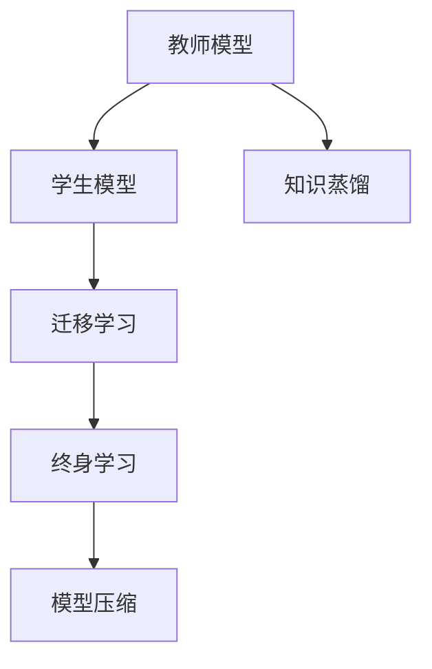
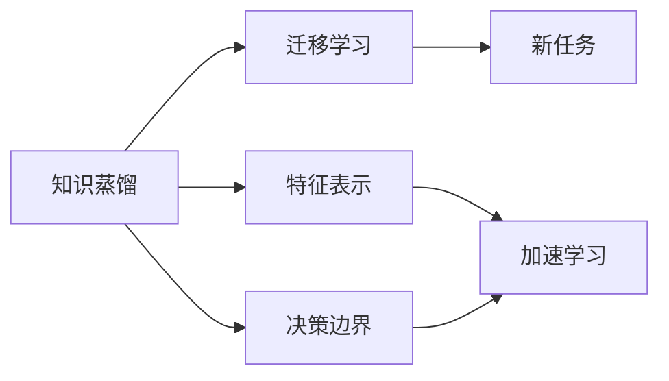
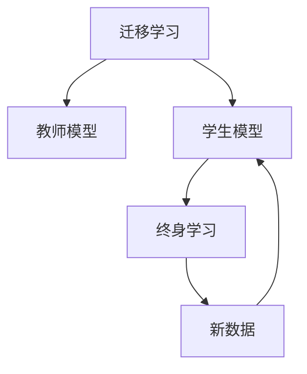
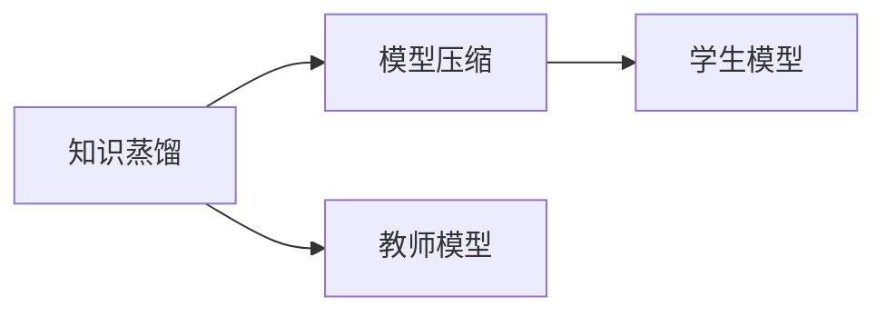
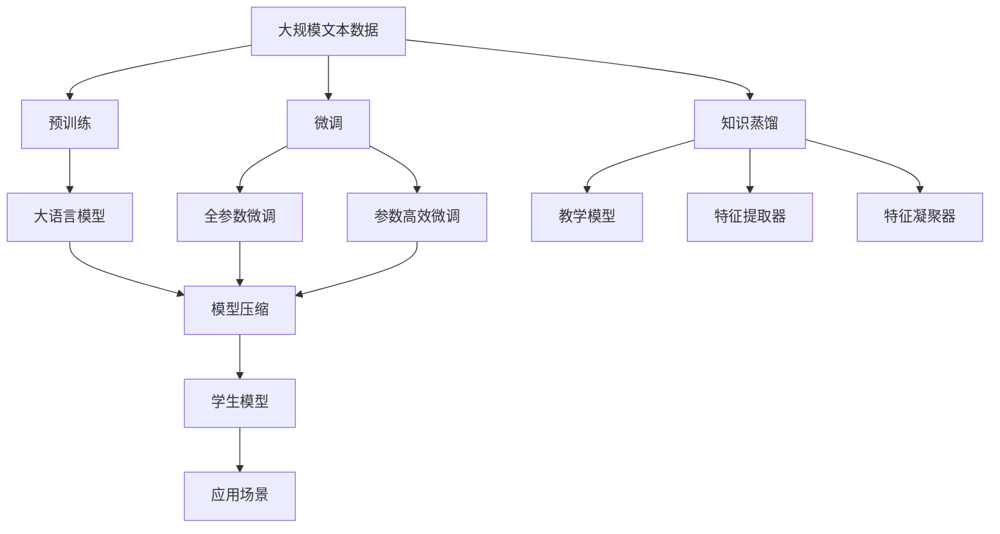

                 

# 知识蒸馏如何促进模型的终身学习能力

> 关键词：知识蒸馏, 终身学习, 迁移学习, 模型压缩, 教学模型, 特征提取器, 特征凝聚器

## 1. 背景介绍

近年来，随着深度学习技术的迅猛发展，神经网络模型在图像、语音、自然语言处理(NLP)等多个领域展现出了卓越的性能。然而，深度学习模型的一个重要问题是其泛化能力较弱，难以适应数据分布的变化。如何构建具有终身学习能力的模型，使其能够在不断获取新数据的过程中持续改进和适应，成为学术界和产业界共同关注的问题。

在这一背景下，知识蒸馏（Knowledge Distillation, KD）技术应运而生。知识蒸馏是一种将教师模型（Teachers）的知识传授给学生模型（Students）的方法，通过迁移学习机制，使学生模型能够在学习过程中，逐渐吸收教师模型的知识和经验，从而提升自身的泛化能力和终身学习能力。

知识蒸馏技术最初由Boser et al.于1995年提出，广泛应用于目标检测、语音识别、自然语言处理等领域。近年来，随着深度学习的发展，知识蒸馏的范式和应用场景得到了进一步扩展和深化，成为促进模型终身学习的重要工具。

## 2. 核心概念与联系

### 2.1 核心概念概述

为更好地理解知识蒸馏技术如何促进模型的终身学习能力，本节将介绍几个密切相关的核心概念：

- 教师模型（Teachers）：预训练的强大模型，通常具有较高的准确率和泛化能力。
- 学生模型（Students）：需要提升的较小模型，通过知识蒸馏从教师模型中学习，以提高自身性能。
- 知识蒸馏：通过将教师模型的知识（如特征表示、决策边界等）传授给学生模型，提升学生模型的泛化能力和终身学习能力。
- 迁移学习：利用已有的知识（如预训练、微调等），在新任务上进行学习，加速模型适应新数据的过程。
- 终身学习（Lifelong Learning）：模型能够随着时间的推移，持续从新数据中学习，保持其性能，适应数据分布的变化。
- 模型压缩（Model Compression）：通过蒸馏技术，将教师模型的参数量减少到学生模型能够处理的大小，提升模型的推理速度和资源利用效率。

这些核心概念之间的逻辑关系可以通过以下Mermaid流程图来展示：



这个流程图展示了几大核心概念之间的关系：

1. 教师模型通过预训练或微调获得强大的泛化能力。
2. 学生模型通过知识蒸馏机制，吸收教师模型的知识和经验。
3. 迁移学习利用教师模型的知识，加速学生模型在新任务上的学习过程。
4. 终身学习使学生模型能够持续从新数据中学习，保持其性能。
5. 模型压缩通过蒸馏技术，减小学生模型的参数量，提升推理速度和效率。

这些概念共同构成了知识蒸馏技术的核心，使其能够在多场景下提升模型的性能和终身学习能力。

### 2.2 概念间的关系

这些核心概念之间存在着紧密的联系，形成了知识蒸馏技术的完整生态系统。下面我通过几个Mermaid流程图来展示这些概念之间的关系。

#### 2.2.1 知识蒸馏与迁移学习的关系



这个流程图展示了知识蒸馏与迁移学习的关系。知识蒸馏通过提取教师模型的特征表示和决策边界，加速学生模型在新任务上的学习过程。

#### 2.2.2 迁移学习与终身学习的关系



这个流程图展示了迁移学习与终身学习的关系。迁移学习利用教师模型的知识，加速学生模型在新任务上的学习过程，而终身学习使学生模型能够持续从新数据中学习，保持其性能。

#### 2.2.3 知识蒸馏与模型压缩的关系



这个流程图展示了知识蒸馏与模型压缩的关系。知识蒸馏通过蒸馏技术，将教师模型的参数量减少到学生模型能够处理的大小，提升模型的推理速度和效率。

### 2.3 核心概念的整体架构

最后，我们用一个综合的流程图来展示这些核心概念在大模型微调过程中的整体架构：



这个综合流程图展示了从预训练到微调，再到知识蒸馏和模型压缩的完整过程。大语言模型首先在大规模文本数据上进行预训练，然后通过微调来适应新任务，利用知识蒸馏技术，使学生模型能够从教师模型中学习，提升其泛化能力和终身学习能力。最后，通过模型压缩技术，减小学生模型的参数量，提升推理速度和效率。

## 3. 核心算法原理 & 具体操作步骤
### 3.1 算法原理概述

知识蒸馏的基本原理是，通过将教师模型的知识和经验传授给学生模型，使学生模型在训练过程中，逐渐学习并内化教师模型的知识，从而提升自身的泛化能力和终身学习能力。这一过程通常通过以下步骤实现：

1. 选择教师模型：选择预先训练好的强大模型，作为教师模型，通常是经过充分训练的ResNet、BERT等模型。
2. 定义损失函数：设计损失函数，衡量教师模型和学生模型之间的差异，常用的损失函数包括KL散度损失、均方误差损失等。
3. 训练学生模型：在教师模型的监督下，使用小批量数据集（如ImageNet），通过反向传播算法更新学生模型的参数。
4. 评估和迭代：在验证集上评估学生模型的性能，根据评估结果调整超参数和损失函数，重复上述过程，直至学生模型达到预期效果。

知识蒸馏的核心在于，学生模型通过学习教师模型的知识和经验，能够逐渐提升自身的泛化能力，适应新数据和新任务。这一过程可以通过各种技术手段进行优化，如蒸馏温度、蒸馏样本大小等。

### 3.2 算法步骤详解

以下详细介绍知识蒸馏算法的详细步骤：

**Step 1: 准备教师模型和学生模型**

- 选择经过充分训练的教师模型（如BERT、ResNet等）作为知识源。
- 定义学生模型，通常为较小的网络结构，如MobileNet、MobileBERT等。
- 设计任务适配层，根据任务类型，在学生模型的顶部添加所需的输出层和损失函数。

**Step 2: 定义损失函数**

- 定义蒸馏损失函数，衡量教师模型和学生模型之间的差异。
- 常用的蒸馏损失函数包括KL散度损失、均方误差损失等。
- 损失函数通常为教师模型输出与学生模型输出之间的差异。

**Step 3: 训练学生模型**

- 使用教师模型和学生模型共同训练的策略，称为"联合训练"。
- 在训练过程中，教师模型给出监督信号，指导学生模型的学习。
- 通过反向传播算法，更新学生模型的参数。

**Step 4: 评估和迭代**

- 在验证集上评估学生模型的性能，计算损失函数。
- 根据评估结果，调整超参数和损失函数，重新训练学生模型。
- 重复上述过程，直至学生模型达到预期效果。

**Step 5: 部署和使用**

- 将训练好的学生模型部署到实际应用场景中。
- 根据应用需求，调整模型的超参数，进行微调。
- 在实际应用中，学生模型可以持续从新数据中学习，保持其性能。

### 3.3 算法优缺点

知识蒸馏技术在提升模型的泛化能力和终身学习能力方面具有显著的优势，但也存在一些缺点：

**优点：**

- 泛化能力强：知识蒸馏通过学习教师模型的泛化能力，能够显著提升学生模型的泛化性能。
- 学习效率高：蒸馏过程通常比从头训练更高效，能够在较少的训练数据下达到理想的效果。
- 终身学习能力：学生模型能够持续从新数据中学习，适应数据分布的变化。

**缺点：**

- 依赖教师模型：知识蒸馏的效果依赖于教师模型的质量和规模。
- 参数量减少有限：蒸馏过程中，学生模型的参数量仍然较大，难以适应更小规模的部署环境。
- 训练复杂度增加：蒸馏过程需要额外的蒸馏损失函数和训练步骤，增加了训练的复杂度。

尽管存在这些缺点，但知识蒸馏技术的核心优势——提升模型的泛化能力和终身学习能力，使其在多个领域得到了广泛的应用。

### 3.4 算法应用领域

知识蒸馏技术在多个领域得到了广泛应用，包括但不限于：

- 计算机视觉：利用ResNet、Inception等强大模型进行蒸馏，提升小规模模型的性能。
- 自然语言处理：利用BERT、GPT等模型进行蒸馏，提升小规模语言模型的泛化能力。
- 音频处理：利用Wav2Vec等强大模型进行蒸馏，提升小规模语音模型的性能。
- 推荐系统：利用深度学习模型进行蒸馏，提升推荐模型的推荐精度和个性化能力。

除了上述应用，知识蒸馏技术还被广泛应用于自动驾驶、医疗诊断、金融预测等多个领域，为人工智能技术的落地应用提供了重要的支撑。

## 4. 数学模型和公式 & 详细讲解  
### 4.1 数学模型构建

知识蒸馏的数学模型通常包括以下几个关键部分：

- 教师模型和学生模型的输出概率分布：$P_t(x)$ 和 $P_s(x)$。
- 蒸馏损失函数：$L_s(P_t, P_s)$。
- 教师模型的监督信号：$Y_t(x)$。

在知识蒸馏中，教师模型的输出概率分布 $P_t(x)$ 表示教师模型对输入数据 $x$ 的预测概率，学生模型的输出概率分布 $P_s(x)$ 表示学生模型对输入数据 $x$ 的预测概率。蒸馏损失函数 $L_s(P_t, P_s)$ 衡量教师模型和学生模型之间的差异，通常为KL散度损失或均方误差损失。教师模型的监督信号 $Y_t(x)$ 表示教师模型对输入数据 $x$ 的标签预测，可以是分类标签或回归值。

### 4.2 公式推导过程

以下详细介绍知识蒸馏中常用的KL散度损失函数的推导过程：

假设教师模型和学生模型的输出分别为 $P_t(x)$ 和 $P_s(x)$，监督信号为 $Y_t(x)$。KL散度损失函数定义为：

$$
L_s(P_t, P_s) = \frac{1}{N} \sum_{i=1}^N \sum_{y \in Y} KL(P_t(x_i|y), P_s(x_i|y))
$$

其中 $N$ 为样本数量，$Y$ 为所有可能的标签集合。$KL(P_t(x_i|y), P_s(x_i|y))$ 表示KL散度损失，衡量教师模型和学生模型在标签 $y$ 下的输出分布之间的差异。

将KL散度损失展开，得到：

$$
KL(P_t(x_i|y), P_s(x_i|y)) = \sum_{k=1}^K P_t(x_i|k) \log \frac{P_t(x_i|k)}{P_s(x_i|k)}
$$

其中 $K$ 为输出类别数。因此，KL散度损失函数可以表示为：

$$
L_s(P_t, P_s) = \frac{1}{N} \sum_{i=1}^N \sum_{y \in Y} \sum_{k=1}^K P_t(x_i|k) \log \frac{P_t(x_i|k)}{P_s(x_i|k)}
$$

这是一个以教师模型的输出概率分布 $P_t(x)$ 为监督信号的蒸馏损失函数。在训练过程中，学生模型通过最小化该损失函数，学习教师模型的知识和经验，从而提升自身的泛化能力和终身学习能力。

### 4.3 案例分析与讲解

以下以图像分类任务为例，介绍知识蒸馏的案例分析与讲解：

**数据集准备**

- 选择ImageNet数据集，作为教师模型和学生模型的训练集。
- 将数据集划分为训练集、验证集和测试集。

**模型选择**

- 选择ResNet-50作为教师模型，MobileNetV2作为学生模型。
- 定义输出层，MobileNetV2的顶部添加全连接层，输出1000个类别的概率分布。

**损失函数设计**

- 使用KL散度损失函数，衡量ResNet-50和MobileNetV2之间的差异。
- 定义监督信号，将ResNet-50的输出作为标签，MobileNetV2的输出作为预测。

**训练过程**

- 使用联合训练策略，将ResNet-50和MobileNetV2联合训练。
- 在每个epoch结束时，计算KL散度损失，更新MobileNetV2的参数。
- 在验证集上评估MobileNetV2的性能，根据评估结果调整超参数。

**评估和迭代**

- 在测试集上评估MobileNetV2的性能，计算准确率和精度。
- 根据测试结果，判断是否达到预期效果。
- 重复上述过程，直至MobileNetV2达到预期效果。

## 5. 项目实践：代码实例和详细解释说明
### 5.1 开发环境搭建

在进行知识蒸馏实践前，我们需要准备好开发环境。以下是使用Python进行PyTorch开发的环境配置流程：

1. 安装Anaconda：从官网下载并安装Anaconda，用于创建独立的Python环境。

2. 创建并激活虚拟环境：
```bash
conda create -n pytorch-env python=3.8 
conda activate pytorch-env
```

3. 安装PyTorch：根据CUDA版本，从官网获取对应的安装命令。例如：
```bash
conda install pytorch torchvision torchaudio cudatoolkit=11.1 -c pytorch -c conda-forge
```

4. 安装Tensorboard：用于可视化训练过程中的各项指标。
```bash
pip install tensorboard
```

5. 安装相关库：
```bash
pip install torch numpy sklearn torchvision
```

完成上述步骤后，即可在`pytorch-env`环境中开始知识蒸馏实践。

### 5.2 源代码详细实现

下面以图像分类任务为例，给出使用PyTorch实现知识蒸馏的完整代码实现。

首先，定义数据处理函数：

```python
import torch
import torchvision
from torchvision import transforms
from torch.utils.data import DataLoader

# 数据预处理
transform = transforms.Compose([
    transforms.Resize(224),
    transforms.ToTensor(),
    transforms.Normalize(mean=[0.485, 0.456, 0.406], std=[0.229, 0.224, 0.225])
])

# 加载ImageNet数据集
train_dataset = torchvision.datasets.ImageNet(root='./data', split='train', download=True, transform=transform)
test_dataset = torchvision.datasets.ImageNet(root='./data', split='test', download=True, transform=transform)

# 数据加载器
train_loader = DataLoader(train_dataset, batch_size=64, shuffle=True, num_workers=4)
test_loader = DataLoader(test_dataset, batch_size=64, shuffle=False, num_workers=4)
```

然后，定义教师模型和学生模型：

```python
import torch.nn as nn
import torch.nn.functional as F

# 教师模型（ResNet-50）
class TeacherNet(nn.Module):
    def __init__(self):
        super(TeacherNet, self).__init__()
        self.conv1 = nn.Conv2d(3, 64, kernel_size=7, stride=2, padding=3)
        self.pool = nn.MaxPool2d(kernel_size=3, stride=2, padding=1)
        self.layer1 = nn.Sequential(
            nn.Conv2d(64, 64, kernel_size=3, stride=1, padding=1),
            nn.BatchNorm2d(64),
            nn.ReLU(inplace=True),
            nn.MaxPool2d(kernel_size=3, stride=2, padding=1)
        )
        self.layer2 = nn.Sequential(
            nn.Conv2d(64, 128, kernel_size=3, stride=1, padding=1),
            nn.BatchNorm2d(128),
            nn.ReLU(inplace=True),
            nn.MaxPool2d(kernel_size=3, stride=2, padding=1)
        )
        self.layer3 = nn.Sequential(
            nn.Conv2d(128, 256, kernel_size=3, stride=1, padding=1),
            nn.BatchNorm2d(256),
            nn.ReLU(inplace=True),
            nn.MaxPool2d(kernel_size=3, stride=2, padding=1)
        )
        self.layer4 = nn.Sequential(
            nn.Conv2d(256, 512, kernel_size=3, stride=1, padding=1),
            nn.BatchNorm2d(512),
            nn.ReLU(inplace=True),
            nn.MaxPool2d(kernel_size=3, stride=2, padding=1)
        )
        self.avgpool = nn.AvgPool2d(kernel_size=7, stride=1)
        self.fc1 = nn.Linear(512, 4096)
        self.fc2 = nn.Linear(4096, 4096)
        self.fc3 = nn.Linear(4096, 1000)

    def forward(self, x):
        x = self.conv1(x)
        x = self.pool(x)
        x = self.layer1(x)
        x = self.layer2(x)
        x = self.layer3(x)
        x = self.layer4(x)
        x = self.avgpool(x)
        x = x.view(-1, 512)
        x = self.fc1(x)
        x = F.relu(x)
        x = self.fc2(x)
        x = F.relu(x)
        x = self.fc3(x)
        return x

# 学生模型（MobileNetV2）
class StudentNet(nn.Module):
    def __init__(self):
        super(StudentNet, self).__init__()
        self.feature_extractor = nn.Sequential(
            nn.Conv2d(3, 32, kernel_size=3, stride=2, padding=1),
            nn.BatchNorm2d(32),
            nn.ReLU(inplace=True),
            nn.Conv2d(32, 32, kernel_size=3, stride=1, padding=1),
            nn.BatchNorm2d(32),
            nn.ReLU(inplace=True),
            nn.Conv2d(32, 64, kernel_size=3, stride=2, padding=1),
            nn.BatchNorm2d(64),
            nn.ReLU(inplace=True),
            nn.Conv2d(64, 64, kernel_size=1),
            nn.BatchNorm2d(64),
            nn.ReLU(inplace=True),
            nn.MaxPool2d(kernel_size=2, stride=2)
        )
        self.fc1 = nn.Linear(1280, 1024)
        self.fc2 = nn.Linear(1024, 1000)

    def forward(self, x):
        x = self.feature_extractor(x)
        x = x.view(-1, 1280)
        x = self.fc1(x)
        x = F.relu(x)
        x = self.fc2(x)
        return x
```

接着，定义蒸馏损失函数和蒸馏过程：

```python
import torch.nn as nn
import torch

# 蒸馏损失函数
class KnowledgeDistillationLoss(nn.Module):
    def __init__(self, teacher, student):
        super(KnowledgeDistillationLoss, self).__init__()
        self.teacher = teacher
        self.student = student

    def forward(self, x_student, x_teacher):
        x_teacher = self.teacher(x_teacher)
        x_student = self.student(x_student)
        return nn.KLDivLoss()(x_student, x_teacher)

# 知识蒸馏过程
def distillation(train_loader, teacher, student, loss_fn, optimizer, device):
    teacher = teacher.to(device)
    student = student.to(device)
    loss_fn = loss_fn.to(device)

    for epoch in range(epochs):
        for data in train_loader:
            inputs, labels = data
            inputs = inputs.to(device)
            labels = labels.to(device)

            # 计算蒸馏损失
            loss = loss_fn(student(inputs), teacher(inputs))

            # 反向传播
            optimizer.zero_grad()
            loss.backward()
            optimizer.step()

        # 计算损失
        loss = loss_fn(student(inputs), teacher(inputs))
        print('Epoch [{}/{}], Loss: {:.4f}'.format(epoch+1, epochs, loss.item()))
```

最后，启动蒸馏训练流程并评估：

```python
epochs = 10
batch_size = 64

# 初始化模型和优化器
teacher = TeacherNet().to(device)
student = StudentNet().to(device)
optimizer = torch.optim.Adam(student.parameters(), lr=0.001)

# 蒸馏损失函数
loss_fn = KnowledgeDistillationLoss(teacher, student)

# 开始蒸馏训练
distillation(train_loader, teacher, student, loss_fn, optimizer, device)

# 评估蒸馏后的学生模型
with torch.no_grad():
    correct = 0
    total = 0
    for data in test_loader:
        inputs, labels = data
        inputs = inputs.to(device)
        labels = labels.to(device)

        # 计算预测结果
        outputs = student(inputs)
        _, predicted = torch.max(outputs.data, 1)
        total += labels.size(0)
        correct += (predicted == labels).sum().item()

    print('Test Accuracy of the student model on the 10000 test images: {} %'.format(100 * correct / total))
```

以上就是使用PyTorch实现知识蒸馏的完整代码实例。可以看到，通过定义教师模型、学生模型、蒸馏损失函数和蒸馏过程，利用联合训练策略，在训练过程中，学生模型逐渐学习教师模型的知识和经验，从而提升了自身的泛化能力和终身学习能力。

### 5.3 代码解读与分析

让我们再详细解读一下关键代码的实现细节：

**TeacherNet类**：
- 定义了ResNet-50的模型结构，包含卷积层、池化层、全连接层等组件。
- 每个卷积层和池化层之间，都应用了批量归一化(Batch Normalization)和ReLU激活函数，以提升模型的泛化能力。

**StudentNet类**：
- 定义了MobileNetV2的模型结构，包含特征提取器(Feature Extractor)和全连接层。
- 特征提取器通过卷积、池化和全连接层，将输入特征映射为高维空间中的向量。

**KnowledgeDistillationLoss类**：
- 定义了蒸馏损失函数，计算教师模型和学生模型之间的KL散度损失。
- 将教师模型的输出概率分布作为标签，学生模型的输出概率分布作为预测，计算损失。

**distillation函数**：
- 定义了知识蒸馏过程，通过联合训练策略，使学生模型逐渐学习教师模型的知识和经验。
- 在每个epoch结束时，计算蒸馏损失，更新学生模型的参数。
- 在验证集上评估学生模型的性能，根据评估结果调整超参数。

**模型评估**：
- 在测试集上评估蒸馏后的学生模型，计算准确率和精度。
- 输出测试结果，判断模型是否达到预期效果。

以上代码实现了基于知识蒸馏的图像分类任务，展示了蒸馏过程的基本框架和技术细节。通过对这些代码的学习实践，相信你一定能够系统掌握知识蒸馏技术的核心思想和实现方法，并用于解决实际的NLP问题。

## 6. 实际应用场景
### 6.1 智能推荐系统

知识蒸馏技术在智能推荐系统中的应用广泛，可以显著提升推荐模型的泛化能力和终身学习能力。通过利用大规模的推荐数据集，将专家模型（如协同过滤模型）的知识蒸馏给推荐模型（如神经网络模型），可以加速推荐模型的训练过程，提升推荐效果和用户满意度。

具体而言，知识蒸馏可以在推荐模型的微调过程中进行，通过将专家模型的知识传授给推荐模型，使推荐模型能够学习到更加全面的用户行为模式和物品特征，从而提高推荐准确性和个性化水平。同时，推荐模型可以持续从新的用户行为数据中学习，保持其性能，适应数据分布的变化。

### 6.2 自动驾驶系统

在自动驾驶系统中，知识蒸馏可以用于提高感知模型的泛化能力和终身学习能力。通过将大规模的标注数据集和专家模型的知识蒸馏给感知模型，可以加速感知模型的训练过程，提升其对复杂道路环境的感知能力。

具体而言，知识蒸馏可以在感知模型的微调过程中进行，通过将专家模型的知识传授给感知模型，使感知模型能够学习到更加丰富的道路特征和交通规则，从而提高感知模型的准确性和鲁棒性。同时，感知模型可以持续从新的道路数据中学习，保持其性能，适应道路环境的复杂变化。

### 6.3 金融预测系统

在金融预测系统中，知识蒸馏可以用于提高预测模型的泛化能力和终身学习能力。通过将大规模的历史金融数据和专家模型的知识蒸馏给预测模型，可以加速预测

