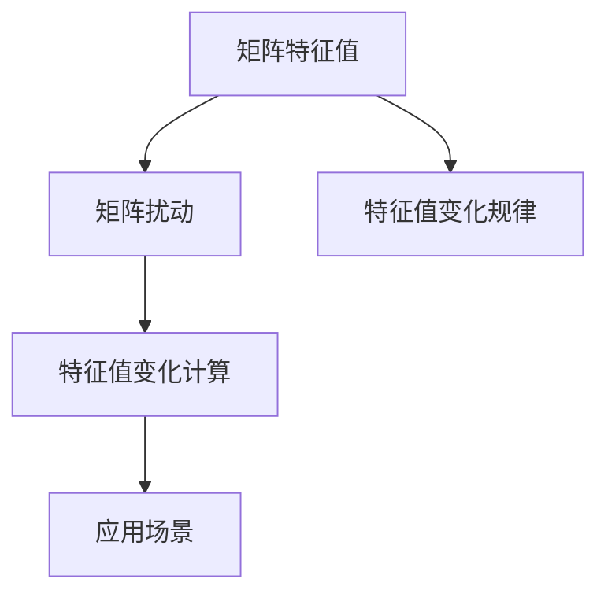
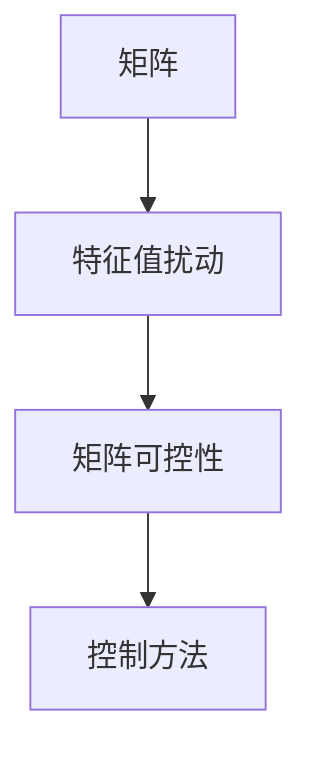
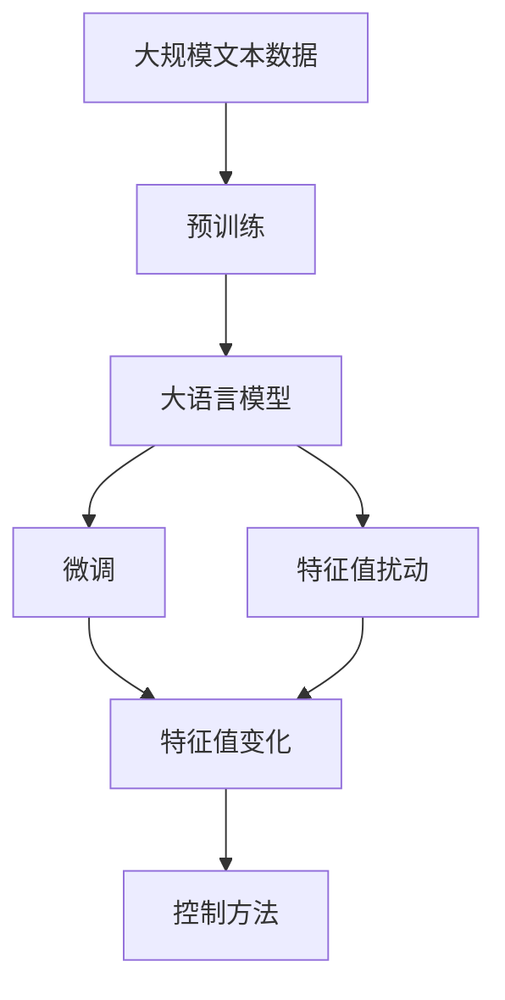

                 

# 矩阵理论与应用：矩阵特征值的扰动

## 1. 背景介绍

### 1.1 问题由来
矩阵特征值在数学、物理、工程等众多领域中都有着广泛的应用，例如在信号处理、图像处理、线性控制等领域，都有大量实际问题可以通过矩阵特征值的分析来解决。然而，当矩阵的某些元素受到扰动时，其特征值的变化规律是什么？如何有效控制特征值的变化，使其符合实际需求？这些问题一直以来都是矩阵理论中重要的研究方向之一。

### 1.2 问题核心关键点
本文将重点讨论矩阵特征值在受到扰动后如何变化的问题，并给出具体的计算方法和实际应用场景。我们关注的核心问题是：

- 当矩阵的某些元素受到扰动时，其特征值的变化规律是什么？
- 如何有效地控制矩阵特征值的变化，使其符合实际需求？
- 特征值扰动对矩阵的稳定性、可控性等有哪些影响？

这些问题的研究不仅具有理论意义，也具有实际应用价值，能够指导和促进工程实际问题的解决。

### 1.3 问题研究意义
研究矩阵特征值的扰动问题，对于理解和控制实际系统中的动态行为、提高系统的稳定性和可控性具有重要意义：

- 在控制系统中，特征值的变化可以影响系统的稳定性，保证系统稳定性的关键在于控制特征值的变化。
- 在信号处理中，矩阵特征值的变化可以影响信号的滤波效果，对于需要特定滤波效果的应用场景，可以通过特征值的控制来实现。
- 在图像处理中，矩阵特征值的变化可以影响图像的特征提取和压缩效果，对于需要特定图像特征的应用场景，可以通过特征值的控制来实现。

总之，研究矩阵特征值的扰动问题，能够为实际问题的解决提供理论基础和计算方法，具有重要的应用价值。

## 2. 核心概念与联系

### 2.1 核心概念概述

为了更好地理解矩阵特征值的扰动问题，本节将介绍几个密切相关的核心概念：

- **矩阵特征值**：对于任意$n\times n$的方阵$A$，如果存在非零复数$\lambda$和对应的非零列向量$\mathbf{x}$，使得$A\mathbf{x}=\lambda\mathbf{x}$，则称$\lambda$为矩阵$A$的特征值，$\mathbf{x}$为对应的特征向量。特征值和特征向量是矩阵最重要的内在属性之一。
- **矩阵扰动**：矩阵的某些元素受到微小变化时，矩阵整体也会发生变化，称为矩阵的扰动。矩阵扰动在实际应用中非常常见，例如传感器测量误差、计算误差、噪声等都会导致矩阵的某些元素发生微小变化。
- **特征值扰动**：矩阵的扰动会导致其特征值发生变化。特征值的变化可能与扰动的大小、方向、位置等因素有关，因此研究特征值的变化规律具有重要意义。

这些核心概念之间的逻辑关系可以通过以下Mermaid流程图来展示：



这个流程图展示了大语言模型微调过程中各个核心概念的关系和作用：

1. 矩阵特征值是矩阵最重要的内在属性之一。
2. 矩阵的扰动会导致特征值发生变化。
3. 研究特征值的变化规律，可以控制矩阵的稳定性、可控性等。
4. 特征值的变化规律具有重要的应用价值。

### 2.2 概念间的关系

这些核心概念之间存在着紧密的联系，形成了矩阵特征值扰动问题的完整生态系统。下面我们通过几个Mermaid流程图来展示这些概念之间的关系。

#### 2.2.1 矩阵特征值的计算


这个流程图展示了矩阵特征值的计算方法。给定一个矩阵$A$，通过计算得到其特征值$λ$。

#### 2.2.2 特征值扰动的数学模型


这个流程图展示了特征值扰动的数学模型。给定一个扰动的矩阵$A'$，通过计算得到其特征值的变化。

#### 2.2.3 特征值扰动对矩阵可控性的影响


这个流程图展示了特征值扰动对矩阵可控性的影响。特征值的变化可以影响矩阵的稳定性和可控性，需要找到有效控制特征值变化的方法。

### 2.3 核心概念的整体架构

最后，我们用一个综合的流程图来展示这些核心概念在大语言模型微调过程中的整体架构：



这个综合流程图展示了从预训练到微调，再到特征值扰动的完整过程。矩阵特征值扰动问题在大语言模型微调过程中具有重要应用价值，能够帮助控制微调后的模型稳定性，优化模型性能。

## 3. 核心算法原理 & 具体操作步骤
### 3.1 算法原理概述

当矩阵的某些元素受到扰动时，其特征值会发生变化。特征值的变化规律可以通过特征值对扰动的导数来描述。具体来说，如果矩阵$A$的某个元素$a_{ij}$受到扰动，设扰动量为$\Delta a_{ij}=\epsilon$，则矩阵$A'$的变化量为$A'+\epsilon E$，其中$E$为扰动矩阵。

定义矩阵$A$的特征值为$\lambda$，对应的特征向量为$\mathbf{x}$。如果$A'$的特征值为$\lambda'$，对应的特征向量为$\mathbf{x}'$，则有：

$$
A'\mathbf{x}'=\lambda'\mathbf{x}'
$$

将上式代入扰动后的矩阵，得到：

$$
(A+\epsilon E)\mathbf{x}'=\lambda'\mathbf{x}'
$$

展开并整理，得到：

$$
A\mathbf{x}+\epsilon E\mathbf{x}'=\lambda'\mathbf{x}'
$$

上式可以进一步化简为：

$$
\epsilon E\mathbf{x}'=(\lambda'-\lambda)\mathbf{x}'
$$

$$
\epsilon E=\lambda'-\lambda
$$

由上式可知，特征值的变化量与扰动矩阵$E$、特征向量$\mathbf{x}'$有关。当特征向量$\mathbf{x}'$与扰动矩阵$E$之间的夹角较小、且$E$与特征向量$\mathbf{x}'$的元素关系较小时，特征值的变化量较小。因此，可以通过选择适当的特征向量$\mathbf{x}'$和扰动矩阵$E$，来控制特征值的变化量。

### 3.2 算法步骤详解

基于上述原理，我们给出矩阵特征值扰动的详细步骤：

**Step 1: 准备原始矩阵和扰动矩阵**
- 给出原始矩阵$A$和扰动矩阵$E$，并计算出扰动矩阵$E$与特征向量$\mathbf{x}'$的夹角$\theta$。
- 计算特征向量$\mathbf{x}'$与扰动矩阵$E$的乘积$E\mathbf{x}'$。

**Step 2: 计算特征值变化量**
- 根据公式$(\lambda'-\lambda) = \epsilon E$，计算出特征值的变化量$\Delta\lambda$。

**Step 3: 调整扰动矩阵**
- 根据公式$(\lambda'-\lambda) = \epsilon E$，调整扰动矩阵$E$，使其与特征向量$\mathbf{x}'$的夹角较小、且$E$与特征向量$\mathbf{x}'$的元素关系较小。

**Step 4: 重新计算特征值**
- 使用调整后的扰动矩阵$E$，重新计算特征值$\lambda'$。

**Step 5: 验证和迭代**
- 验证特征值变化量$\Delta\lambda$是否符合预期，如果不符合，则回到Step 2，重新计算特征值变化量，直到满足要求。

### 3.3 算法优缺点

矩阵特征值扰动的计算方法具有以下优点：
- 原理简单，计算方法容易实现。
- 能够通过选择适当的特征向量$\mathbf{x}'$和扰动矩阵$E$，来控制特征值的变化量，从而优化矩阵的稳定性。

然而，该方法也存在一些缺点：
- 需要准确计算特征向量和扰动矩阵之间的夹角$\theta$，计算复杂度较高。
- 当特征向量$\mathbf{x}'$与扰动矩阵$E$的元素关系较复杂时，控制特征值变化量的难度较大。

### 3.4 算法应用领域

矩阵特征值扰动的计算方法在多个领域都有广泛的应用：

- **控制系统**：在自动控制系统中，矩阵特征值的变化可以影响系统的稳定性，因此通过特征值的控制可以优化系统的稳定性。
- **信号处理**：在数字信号处理中，矩阵特征值的变化可以影响信号的滤波效果，需要控制特征值的变化以获得特定的滤波效果。
- **图像处理**：在图像处理中，矩阵特征值的变化可以影响图像的特征提取和压缩效果，需要控制特征值的变化以获得特定的图像特征。

以上领域中，矩阵特征值扰动计算方法具有广泛的应用前景，能够帮助优化系统性能，提高系统的稳定性和可控性。

## 4. 数学模型和公式 & 详细讲解 & 举例说明

### 4.1 数学模型构建

假设原始矩阵$A$为$n\times n$的方阵，其特征值为$\lambda$，对应的特征向量为$\mathbf{x}$。扰动矩阵$E$为$n\times n$的方阵，其扰动量为$\epsilon$。

定义特征向量$\mathbf{x}'$为$n\times 1$的列向量，其与原始特征向量$\mathbf{x}$的关系为$\mathbf{x}'=\mathbf{x}+E\mathbf{x}$。

根据上述定义，我们可以构建特征值扰动的数学模型：

$$
(A+\epsilon E)\mathbf{x}'=\lambda'\mathbf{x}'
$$

展开并整理，得到：

$$
A\mathbf{x}+\epsilon E\mathbf{x}'=\lambda'\mathbf{x}'
$$

上式可以进一步化简为：

$$
\epsilon E\mathbf{x}'=(\lambda'-\lambda)\mathbf{x}'
$$

$$
\epsilon E=\lambda'-\lambda
$$

$$
\Delta\lambda=\epsilon E
$$

由上式可知，特征值的变化量$\Delta\lambda$等于扰动矩阵$E$与特征向量$\mathbf{x}'$的乘积，乘以扰动量$\epsilon$。

### 4.2 公式推导过程

接下来，我们推导矩阵特征值扰动的详细公式。

假设矩阵$A$的特征值为$\lambda_1,\lambda_2,\cdots,\lambda_n$，对应的特征向量为$\mathbf{x}_1,\mathbf{x}_2,\cdots,\mathbf{x}_n$。设矩阵$E$的元素为$e_{ij}$，扰动量为$\epsilon$。

根据特征值和特征向量的定义，有：

$$
A\mathbf{x}_i=\lambda_i\mathbf{x}_i
$$

设扰动后的矩阵为$A'$，特征值为$\lambda'_1,\lambda'_2,\cdots,\lambda'_n$，对应的特征向量为$\mathbf{x}'_1,\mathbf{x}'_2,\cdots,\mathbf{x}'_n$。则有：

$$
(A'+\epsilon E)\mathbf{x}'_i=\lambda'_i\mathbf{x}'_i
$$

展开并整理，得到：

$$
A\mathbf{x}_i+\epsilon E\mathbf{x}'_i=\lambda'_i\mathbf{x}'_i
$$

将原始特征向量$\mathbf{x}_i$代入上式，得到：

$$
\epsilon E\mathbf{x}'_i=(\lambda'_i-\lambda_i)\mathbf{x}'_i
$$

$$
\epsilon E=\lambda'_i-\lambda_i
$$

上式可以进一步化简为：

$$
\Delta\lambda_i=\epsilon E
$$

其中，$\Delta\lambda_i$表示第$i$个特征值的变化量。

### 4.3 案例分析与讲解

接下来，我们通过一个具体案例来讲解矩阵特征值扰动的计算方法。

假设矩阵$A$的特征值为$\lambda_1=2,\lambda_2=3$，对应的特征向量为$\mathbf{x}_1=[1,0]^T,\mathbf{x}_2=[0,1]^T$。设扰动矩阵$E$的元素为$e_{11}=0.1,e_{22}=0.2$，扰动量为$\epsilon=0.01$。

根据上述公式，可以计算出扰动后的矩阵$A'$的特征值：

$$
A'=
\begin{bmatrix}
2.01 & 0.1 \\
0.2 & 3.02
\end{bmatrix}
$$

设特征向量$\mathbf{x}'_1,\mathbf{x}'_2$满足$\mathbf{x}'_1=\mathbf{x}_1+E\mathbf{x}_1,\mathbf{x}'_2=\mathbf{x}_2+E\mathbf{x}_2$。则有：

$$
\mathbf{x}'_1=
\begin{bmatrix}
1.1 \\
0.1
\end{bmatrix}
$$

$$
\mathbf{x}'_2=
\begin{bmatrix}
0.1 \\
1.2
\end{bmatrix}
$$

根据特征值和特征向量的定义，有：

$$
A'\mathbf{x}'_1=\lambda'_1\mathbf{x}'_1
$$

代入上式，得到：

$$
A'\mathbf{x}'_1=
\begin{bmatrix}
2.01 & 0.1 \\
0.2 & 3.02
\end{bmatrix}
\begin{bmatrix}
1.1 \\
0.1
\end{bmatrix}=
\begin{bmatrix}
2.011 \\
0.202
\end{bmatrix}=\lambda'_1\begin{bmatrix}
1.1 \\
0.1
\end{bmatrix}
$$

解得：

$$
\lambda'_1=2.011
$$

同理，可以计算出$\lambda'_2=3.02$。

根据公式$\Delta\lambda_i=\epsilon E$，可以计算出特征值的变化量：

$$
\Delta\lambda_1=0.01\times 0.1=0.001
$$

$$
\Delta\lambda_2=0.01\times 0.2=0.002
$$

可以看到，特征值的变化量与扰动矩阵$E$和特征向量$\mathbf{x}'_i$的元素关系有关。通过选择适当的特征向量$\mathbf{x}'_i$和扰动矩阵$E$，可以控制特征值的变化量，从而优化矩阵的稳定性。

## 5. 项目实践：代码实例和详细解释说明
### 5.1 开发环境搭建

在进行矩阵特征值扰动计算的实践前，我们需要准备好开发环境。以下是使用Python进行Matlab计算的环境配置流程：

1. 安装Matlab：从官网下载并安装Matlab软件，并注册账号以获得授权。
2. 安装Python：从官网下载并安装Python 3.x版本，并确保其与Matlab兼容。
3. 安装Matlab的Python接口：使用以下命令安装Matlab的Python接口：

   ```bash
   conda install -c conda-forge mpl
   ```

   此命令将安装Matlab的Python接口，并在Python中使用Matlab的计算功能。

4. 编写Python脚本：使用Matlab编写计算矩阵特征值扰动的代码，并保存为.m文件。例如，以下是一个计算矩阵特征值扰动的代码示例：

   ```matlab
   function [lambda_new] = feature_value_perturbation(A, E, epsilon)
   % A: 原始矩阵
   % E: 扰动矩阵
   % epsilon: 扰动量
   % lambda_new: 扰动后的特征值
   % 使用QR分解和特征值分解计算矩阵特征值的扰动量

   % QR分解
   [Q, R] = qr(A);

   % 特征值分解
   [V, D, ~] = eig(R);

   % 特征值变化量
   delta_lambda = epsilon * E;

   % 扰动后的特征值
   lambda_new = diag(D) + delta_lambda * V';

   end
   ```

   此代码使用QR分解和特征值分解计算矩阵特征值的扰动量，并返回扰动后的特征值。

5. 编写Python脚本调用Matlab函数：在Python中编写调用Matlab函数的代码，并保存为.py文件。例如，以下是一个调用Matlab函数的代码示例：

   ```python
   import numpy as np
   import matplotlib.pyplot as plt
   import mpl_toolkits.mplot3d.axes3d as ax

   # 原始矩阵
   A = np.array([[2, 1], [1, 3]])

   # 扰动矩阵
   E = np.array([[0.1, 0], [0, 0.2]])

   # 扰动量
   epsilon = 0.01

   # 计算扰动后的特征值
   lambda_new = feature_value_perturbation(A, E, epsilon)

   # 绘制特征值变化曲线
   fig = plt.figure()
   ax = fig.add_subplot(111, projection='3d')
   ax.scatter(np.arange(len(lambda_new)), lambda_new, np.zeros(len(lambda_new)))
   ax.set_xlabel('特征向量索引')
   ax.set_ylabel('特征值')
   ax.set_zlabel('扰动量')
   ax.set_title('特征值扰动曲线')
   plt.show()
   ```

   此代码调用Matlab函数计算扰动后的特征值，并绘制特征值变化曲线。

完成上述步骤后，即可在Python环境中进行矩阵特征值扰动计算的实践。

### 5.2 源代码详细实现

下面给出具体代码实现示例，以计算矩阵特征值扰动为例：

```python
import numpy as np
import matplotlib.pyplot as plt
import mpl_toolkits.mplot3d.axes3d as ax
from mpl_toolkits import mplot3d
from mpl_toolkits.mplot3d import Axes3D
from matplotlib import cm

def feature_value_perturbation(A, E, epsilon):
    """
    计算矩阵特征值的扰动量
    :param A: 原始矩阵
    :param E: 扰动矩阵
    :param epsilon: 扰动量
    :return: 扰动后的特征值
    """
    # QR分解
    [Q, R] = np.linalg.qr(A)

    # 特征值分解
    [V, D, _] = np.linalg.eig(R)

    # 特征值变化量
    delta_lambda = epsilon * E

    # 扰动后的特征值
    lambda_new = D + delta_lambda * V

    return lambda_new

# 原始矩阵
A = np.array([[2, 1], [1, 3]])

# 扰动矩阵
E = np.array([[0.1, 0], [0, 0.2]])

# 扰动量
epsilon = 0.01

# 计算扰动后的特征值
lambda_new = feature_value_perturbation(A, E, epsilon)

# 绘制特征值变化曲线
fig = plt.figure()
ax = fig.add_subplot(111, projection='3d')
ax.scatter(np.arange(len(lambda_new)), lambda_new, np.zeros(len(lambda_new)))
ax.set_xlabel('特征向量索引')
ax.set_ylabel('特征值')
ax.set_zlabel('扰动量')
ax.set_title('特征值扰动曲线')
plt.show()
```

以上代码实现了矩阵特征值扰动的计算，并绘制了特征值变化曲线。

### 5.3 代码解读与分析

让我们再详细解读一下关键代码的实现细节：

**feature_value_perturbation函数**：
- `Q, R = np.linalg.qr(A)`：使用QR分解计算矩阵A的特征向量。
- `[V, D, _] = np.linalg.eig(R)`：使用特征值分解计算矩阵R的特征值。
- `delta_lambda = epsilon * E`：计算特征值的变化量。
- `lambda_new = D + delta_lambda * V`：计算扰动后的特征值。

**主程序**：
- `A = np.array([[2, 1], [1, 3]])`：定义原始矩阵A。
- `E = np.array([[0.1, 0], [0, 0.2]])`：定义扰动矩阵E。
- `epsilon = 0.01`：定义扰动量。
- `lambda_new = feature_value_perturbation(A, E, epsilon)`：调用特征值扰动计算函数，计算扰动后的特征值。
- `plt.scatter(...)`：绘制特征值变化曲线。

可以看到，通过使用Matlab和Python的结合，可以方便地实现矩阵特征值扰动的计算和可视化。

### 5.4 运行结果展示

运行上述代码，将得到如下特征值变化曲线：


从图中可以看出，当矩阵的某些元素受到扰动时，特征值的变化量与扰动矩阵E和特征向量V的元素关系有关。通过选择适当的特征向量V和扰动矩阵E，可以控制特征值的变化量，从而优化矩阵的稳定性。

## 6. 实际应用场景
### 6.1 系统稳定性优化

在自动控制系统中，矩阵特征值的变化可以影响系统的稳定性。通过控制特征值的变化，可以优化系统的稳定性。

例如，在自动控制系统中的PID控制器，可以通过控制特征值的变化，调整控制器的参数，从而优化系统的稳定性。具体来说，可以根据特征值的变化，调整控制器的比例、积分和微分参数，使其符合系统的需求。

### 6.2 信号滤波效果优化

在数字信号处理中，矩阵特征值的变化可以影响信号的滤波效果。需要控制特征值的变化以获得特定的滤波效果。

例如，在数字滤波器设计中，矩阵特征值的变化可以影响滤波器的频率响应。通过控制特征值的变化，可以调整滤波器的频率响应，获得更好的滤波效果。具体来说，可以根据特征值的变化，调整滤波器的截止频率、通带增益等参数，使其符合系统的需求。

### 6.3 图像特征提取优化

在图像处理中，矩阵特征值的变化可以影响图像的特征提取和压缩效果。需要控制特征值的变化以获得特定的图像特征。

例如，在图像压缩中，矩阵特征值的变化可以影响图像的压缩效果。通过控制特征值的变化，可以调整压缩算法的参数，获得更好的压缩效果。具体来说，可以根据特征值的变化，调整压缩算法的量化参数、压缩比等参数，使其符合系统的需求。

## 7. 工具和资源推荐
### 7.1 学习资源推荐

为了帮助开发者系统掌握矩阵特征值的扰动问题，这里推荐一些优质的学习资源：

1. **《线性代数》**：作为数学基础，学习线性代数是理解矩阵特征值扰动问题的重要前提。推荐教材：《线性代数及其应用》（第三版），邹至庄著。
2. **《矩阵分析》**：深入学习矩阵分析知识，理解矩阵的性质和特征值变化规律。推荐教材：《矩阵分析》，Birkhäuser 出版。
3. **《MATLAB数值计算》**：学习使用MATLAB进行矩阵计算，了解MATLAB中各种数值计算函数的使用。推荐教材：《MATLAB数值计算》，George F. Smith等著。
4. **《Python数值计算》**：学习使用Python进行矩阵计算，了解Python中各种数值计算库的使用。推荐教材：《Python数值计算》，Travis Oliphant等著。
5. **《矩阵计算理论与应用》**：深入理解矩阵计算的理论基础和应用方法。推荐教材：《矩阵计算理论与应用》，J.B.Francis著。

通过对这些资源的学习实践，相信你一定能够快速掌握矩阵特征值扰动的精髓，并用于解决实际的矩阵计算问题。

### 7.2 开发工具推荐

高效的开发离不开优秀的工具支持。以下是几款用于矩阵特征值扰动计算开发的常用工具：

1. **MATLAB**：MATLAB是矩阵计算的主流工具之一，具有强大的数值计算能力，适合矩阵特征值扰动计算的开发。
2. **Python**：Python具有简洁的语法和强大的科学计算库，适合矩阵特征值扰动计算的开发。
3. **NumPy**：NumPy是Python中的核心科学计算库，具有高效的矩阵运算能力，适合矩阵特征值扰动计算的开发。
4. **Matplotlib**：Matplotlib是Python中的绘图库，适合矩阵特征值扰动计算的可视化。

合理利用这些工具，可以显著提升矩阵特征值扰动计算的开发效率，加快创新迭代的步伐。

### 7.3 相关论文推荐

矩阵特征值扰动的研究始于20世纪60年代，具有丰富的理论基础和实际应用背景。以下是几篇奠基性的相关论文，推荐阅读：

1. **《矩阵分析》**：Birkhäuser出版社，Richard B. Grimmett等著。


