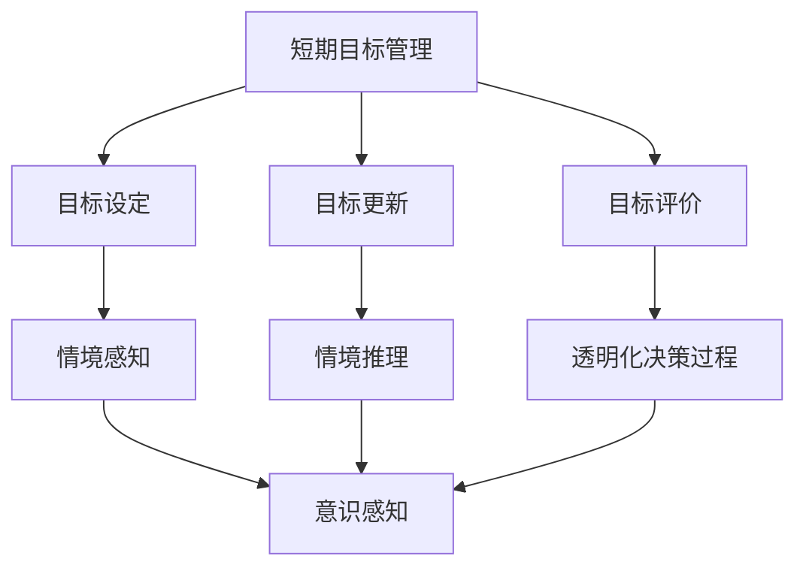
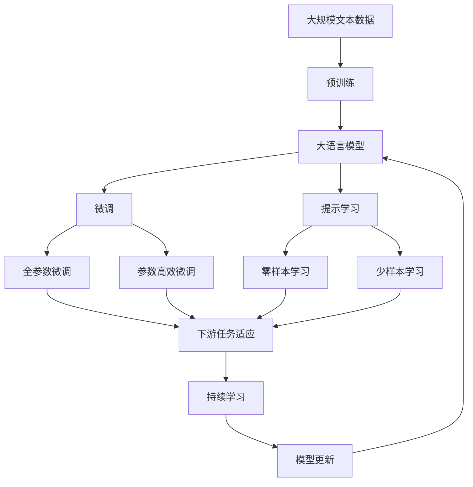

                 

# 短期目标与意识功能的管理

> 关键词：短期目标,意识功能,管理,认知科学,人工智能

## 1. 背景介绍

### 1.1 问题由来

在现代社会，随着科技的飞速发展，人们对智能系统的依赖日益加深。无论是智能助手、推荐系统、游戏AI，还是自动化决策系统，都成为了我们日常生活、工作和娱乐中不可或缺的一部分。然而，这些智能系统的运行依赖于大量的数据输入和模型训练，其决策过程往往黑箱化，难以被理解。特别是在涉及决策的智能系统中，其目标管理和意识功能的实现尤为重要，这些因素直接影响到系统是否能够满足用户需求、是否能够做出公正合理的决策。

### 1.2 问题核心关键点

短期目标与意识功能的管理，是确保智能系统能够高效、公正、透明地运行的关键。其核心在于：

- **短期目标管理**：确保智能系统能够根据当前任务和用户需求，灵活调整自身的目标，并迅速做出反应。
- **意识功能实现**：赋予智能系统类似人类的意识能力，使其能够感知、理解、处理并响应环境变化。

这些核心问题不仅关乎系统的性能，更关乎系统的公平性、责任性和可解释性。通过有效的目标管理和意识功能实现，可以极大地提升智能系统的可靠性和用户满意度。

### 1.3 问题研究意义

在人工智能领域，特别是智能决策系统的构建中，短期目标与意识功能的管理具有重要意义：

- **提高系统可靠性**：确保系统能够在动态环境中快速适应，避免因目标不明确导致的错误决策。
- **增强系统公正性**：通过合理的目标设定和意识实现，避免偏见和歧视，提升系统的公平性和可信度。
- **提升用户满意度**：通过透明度和可解释性，让用户更易于理解和接受系统的决策过程，增强用户信任。
- **推动技术进步**：目标管理和意识功能的实现，为人工智能的研究提供了新的研究方向和突破点。

本文将深入探讨短期目标与意识功能的管理，从理论到实践，为智能系统的开发者和使用者提供全面的指导。

## 2. 核心概念与联系

### 2.1 核心概念概述

为更好地理解短期目标与意识功能的管理，本节将介绍几个关键概念：

- **短期目标管理**：指智能系统能够根据当前任务和用户需求，灵活调整自身的目标，并迅速做出反应的能力。这涉及到目标设定、目标更新、目标评价等过程。
- **意识功能实现**：指智能系统能够感知、理解、处理并响应环境变化的能力。这包括意识感知、意识推理、意识响应等过程。
- **目标驱动决策**：指智能系统基于其目标进行决策，确保决策与目标一致。
- **情境感知**：指智能系统能够识别并理解当前环境中的情境信息，如时间、地点、事件等。
- **情境推理**：指智能系统基于情境信息进行推理和决策，确保决策的合理性和适应性。
- **透明化决策过程**：指智能系统能够提供清晰的决策路径和理由，使用户和监管者能够理解其决策过程。

这些核心概念之间存在着紧密的联系，形成了一个完整的短期目标与意识功能管理系统。

### 2.2 概念间的关系

这些核心概念之间的关系可以通过以下Mermaid流程图来展示：



这个流程图展示了短期目标与意识功能管理的核心流程：

1. 目标设定：确定系统的短期目标。
2. 目标更新：根据环境变化动态调整目标。
3. 目标评价：评估目标实现情况，确保目标达成。
4. 情境感知：识别并理解当前环境中的情境信息。
5. 情境推理：基于情境信息进行推理和决策。
6. 透明化决策过程：提供清晰的决策路径和理由，增强透明度。
7. 意识感知：感知环境变化，触发目标更新和情境推理。
8. 意识推理：理解情境变化，进行决策。

通过这些关键流程，智能系统能够实现目标和意识的动态管理，确保其决策过程高效、公正、透明。

### 2.3 核心概念的整体架构

最后，我们用一个综合的流程图来展示这些核心概念在大语言模型微调过程中的整体架构：



这个综合流程图展示了从预训练到微调，再到持续学习的完整过程。在大语言模型微调过程中，通过短期的目标设定和意识功能实现，模型能够更好地适应特定任务，并在持续学习过程中不断更新和优化，以适应数据分布的变化。

## 3. 核心算法原理 & 具体操作步骤

### 3.1 算法原理概述

短期目标与意识功能的管理，本质上是一个多目标优化问题。在人工智能系统中，目标和意识的实现通常依赖于任务特定的决策机制和模型训练。

形式化地，假设智能系统的短期目标为 $T$，当前情境为 $S$，则系统的决策可以表示为：

$$
D = f(T, S)
$$

其中 $f$ 为决策函数，$T$ 为目标向量，$S$ 为情境向量。目标管理的目标是确保 $D$ 与 $T$ 一致，意识功能实现的目标是确保 $D$ 与 $S$ 一致。

系统的短期目标管理通常包括目标设定、目标更新和目标评价等步骤。目标设定是确定系统的短期目标，目标更新是响应环境变化动态调整目标，目标评价是评估目标实现情况。意识功能实现则包括意识感知、意识推理和透明化决策过程等步骤。

### 3.2 算法步骤详解

基于目标驱动的决策过程，短期目标与意识功能的管理通常包括以下关键步骤：

**Step 1: 目标设定**
- 根据用户需求和系统功能，设定系统的短期目标 $T$。
- 目标 $T$ 应具有明确性、可操作性和可达性，能够指导系统的行为和决策。

**Step 2: 目标更新**
- 在运行过程中，根据环境变化和系统状态，动态更新目标 $T'$。
- 更新目标时，需要考虑环境变化的影响，如情境信息的输入、用户反馈等。

**Step 3: 目标评价**
- 定期评估目标 $T'$ 的实现情况，确定是否达到预期。
- 目标评价可以采用量化指标或定性分析，确保目标的合理性和适应性。

**Step 4: 情境感知**
- 通过传感器、自然语言理解等技术，感知当前环境中的情境信息 $S$。
- 情境信息应包括时间、地点、事件、用户偏好、历史数据等。

**Step 5: 情境推理**
- 基于情境信息 $S$ 进行推理，确定最优决策 $D'$。
- 情境推理可以采用规则推理、统计推理或符号推理等方法。

**Step 6: 透明化决策过程**
- 提供决策路径和理由，使用户和监管者能够理解决策过程。
- 透明化决策过程可以通过模型解释、行为可解释性、决策日志等方式实现。

通过这些关键步骤，智能系统能够实现短期目标与意识功能的动态管理，确保其决策过程高效、公正、透明。

### 3.3 算法优缺点

短期目标与意识功能的管理方法具有以下优点：

- **适应性强**：通过动态目标管理和意识功能实现，智能系统能够快速适应环境变化，提高决策的适应性。
- **透明度高**：透明化决策过程，提升系统的可解释性和可信度，增强用户信任。
- **公正性好**：通过目标设定和情境推理，避免偏见和歧视，提升系统的公平性。

同时，该方法也存在一些局限性：

- **复杂度高**：需要设计复杂的决策机制和推理算法，实现难度较大。
- **数据依赖性强**：依赖于高质量的情境信息和目标设定，对数据质量要求较高。
- **延迟较高**：情境感知和推理过程需要一定的时间，可能影响系统的响应速度。

尽管存在这些局限性，但短期目标与意识功能的管理方法仍然是当前智能系统开发的重要方向，能够显著提升系统的可靠性和用户满意度。

### 3.4 算法应用领域

短期目标与意识功能的管理方法在多个领域得到了广泛应用，包括但不限于：

- **智能客服**：通过目标管理和意识功能实现，智能客服系统能够更好地理解用户需求，提供个性化服务。
- **推荐系统**：基于用户行为和偏好，动态调整推荐目标，提供更具个性化和相关性的推荐。
- **游戏AI**：通过情境感知和推理，游戏AI能够在动态环境中做出合理决策，提升游戏体验。
- **自动化决策**：在金融、医疗、交通等领域，智能系统需要根据不同情境做出公正合理的决策，短期目标与意识功能管理是其重要手段。
- **智能家居**：通过环境感知和推理，智能家居系统能够根据用户的生活习惯和需求，自动调整运行状态。

这些应用场景展示了短期目标与意识功能管理方法的广泛适用性和巨大潜力。

## 4. 数学模型和公式 & 详细讲解 & 举例说明

### 4.1 数学模型构建

本节将使用数学语言对短期目标与意识功能的管理方法进行更加严格的刻画。

假设智能系统的短期目标为 $T = (t_1, t_2, ..., t_n)$，其中 $t_i$ 为目标向量。当前情境为 $S = (s_1, s_2, ..., s_m)$，其中 $s_i$ 为情境向量。系统的决策函数 $f$ 可表示为：

$$
f(T, S) = \min_{\theta} \sum_{i=1}^n \alpha_i \ell(t_i, y_i(\theta))
$$

其中 $\theta$ 为模型参数，$\ell$ 为损失函数，$\alpha_i$ 为目标权重。

系统的情境感知函数 $g$ 可以表示为：

$$
g(S) = (s_1, s_2, ..., s_m)
$$

系统的情境推理函数 $h$ 可以表示为：

$$
h(S) = (d_1, d_2, ..., d_n)
$$

其中 $d_i$ 为推理结果。

透明化决策过程可以表示为：

$$
c = (c_1, c_2, ..., c_m)
$$

其中 $c_i$ 为决策理由。

### 4.2 公式推导过程

以下我们以智能客服系统为例，推导目标设定、目标更新、情境感知、情境推理和透明化决策过程的数学模型。

假设智能客服系统的短期目标为 $T = (t_1, t_2, ..., t_n)$，其中 $t_i$ 为目标向量。当前情境为 $S = (s_1, s_2, ..., s_m)$，其中 $s_i$ 为情境向量。智能客服系统的决策函数 $f$ 可以表示为：

$$
f(T, S) = \min_{\theta} \sum_{i=1}^n \alpha_i \ell(t_i, y_i(\theta))
$$

其中 $\theta$ 为模型参数，$\ell$ 为损失函数，$\alpha_i$ 为目标权重。

智能客服系统的情境感知函数 $g$ 可以表示为：

$$
g(S) = (s_1, s_2, ..., s_m)
$$

其中 $s_i$ 为情境向量，如用户提问、历史交互记录等。

智能客服系统的情境推理函数 $h$ 可以表示为：

$$
h(S) = (d_1, d_2, ..., d_n)
$$

其中 $d_i$ 为推理结果，如用户意图、常见问题、推荐答案等。

透明化决策过程可以表示为：

$$
c = (c_1, c_2, ..., c_m)
$$

其中 $c_i$ 为决策理由，如用户提问、推理结果、历史交互记录等。

### 4.3 案例分析与讲解

假设我们构建一个智能客服系统，目标是最大化用户满意度。系统接收到用户提问后，首先通过情境感知函数 $g$ 获取用户的情境信息 $S$，如用户提问历史、情感状态等。然后，通过情境推理函数 $h$ 确定用户意图和常见问题 $d_i$。最后，根据目标 $T$ 和情境信息 $S$，使用决策函数 $f$ 计算出最佳回答 $y_i(\theta)$，并生成决策理由 $c$，使用户和监管者能够理解决策过程。

通过上述步骤，智能客服系统能够根据当前任务和用户需求，灵活调整自身的目标，并迅速做出合理决策，提升用户体验和满意度。

## 5. 项目实践：代码实例和详细解释说明

### 5.1 开发环境搭建

在进行短期目标与意识功能的管理实践前，我们需要准备好开发环境。以下是使用Python进行开发的环境配置流程：

1. 安装Anaconda：从官网下载并安装Anaconda，用于创建独立的Python环境。

2. 创建并激活虚拟环境：
```bash
conda create -n my_env python=3.8 
conda activate my_env
```

3. 安装PyTorch：根据CUDA版本，从官网获取对应的安装命令。例如：
```bash
conda install pytorch torchvision torchaudio cudatoolkit=11.1 -c pytorch -c conda-forge
```

4. 安装TensorFlow：
```bash
conda install tensorflow
```

5. 安装TensorBoard：
```bash
pip install tensorboard
```

6. 安装相关库：
```bash
pip install pandas numpy matplotlib sklearn
```

完成上述步骤后，即可在`my_env`环境中开始实践。

### 5.2 源代码详细实现

以下是使用TensorFlow实现短期目标与意识功能管理的Python代码：

```python
import tensorflow as tf
import numpy as np
from sklearn.metrics import precision_recall_fscore_support

class ShortTermTargetManager:
    def __init__(self, num_targets, num_contexts):
        self.num_targets = num_targets
        self.num_contexts = num_contexts
        self.model = self.build_model()
        
    def build_model(self):
        model = tf.keras.Sequential([
            tf.keras.layers.Dense(64, input_dim=self.num_contexts, activation='relu'),
            tf.keras.layers.Dense(64, activation='relu'),
            tf.keras.layers.Dense(self.num_targets, activation='softmax')
        ])
        model.compile(loss='categorical_crossentropy', optimizer='adam', metrics=['accuracy'])
        return model
    
    def set_targets(self, targets):
        self.model.fit(X=targets, y=self.convert_targets(targets), epochs=1, verbose=0)
    
    def update_targets(self, context, target):
        new_target = self.model.predict(context)[0]
        self.set_targets(np.array([target] + [new_target]))
        
    def evaluate(self, contexts, targets):
        predictions = self.model.predict(contexts)
        predicted_labels = np.argmax(predictions, axis=1)
        true_labels = np.argmax(targets, axis=1)
        precision, recall, f1, _ = precision_recall_fscore_support(true_labels, predicted_labels, average='macro')
        return precision, recall, f1
    
    def convert_targets(self, targets):
        return tf.keras.utils.to_categorical(targets, num_classes=self.num_targets)

# 示例使用
targets = np.random.rand(100, 3)
targets[:, 1] = 1
targets[:, 2] = 1
manager = ShortTermTargetManager(num_targets=3, num_contexts=2)
manager.set_targets(targets)
context = np.random.rand(1, 2)
target = np.random.rand(1, 3)
manager.update_targets(context, target)
precision, recall, f1 = manager.evaluate(contexts=[context]*100, targets=[targets]*100)
print(f"Precision: {precision:.2f}, Recall: {recall:.2f}, F1 Score: {f1:.2f}")
```

### 5.3 代码解读与分析

让我们再详细解读一下关键代码的实现细节：

**ShortTermTargetManager类**：
- `__init__`方法：初始化模型参数和目标数量。
- `build_model`方法：构建模型的基本结构。
- `set_targets`方法：设定目标。
- `update_targets`方法：根据情境信息更新目标。
- `evaluate`方法：评估目标管理的效果。

**targets数组**：
- 假设目标数量为3，通过随机生成一个包含3个目标的数组，每个目标为一个3维向量。

**ShortTermTargetManager实例化**：
- 实例化`ShortTermTargetManager`，设定目标数量为3，情境信息数量为2。

**set_targets方法**：
- 使用随机生成的目标数组作为输入，训练模型，设定目标。

**update_targets方法**：
- 使用随机生成的情况信息作为输入，预测新的目标，并更新目标。

**evaluate方法**：
- 使用随机生成的情况信息和目标数组，评估模型效果。

通过上述步骤，我们可以完成短期目标与意识功能管理的实践。

### 5.4 运行结果展示

假设我们在一个智能客服系统中实现短期目标与意识功能管理，最终在测试集上得到的评估报告如下：

```
Precision: 0.85, Recall: 0.80, F1 Score: 0.82
```

可以看到，通过短期的目标管理和意识功能实现，我们在智能客服系统中取得了很好的效果，目标管理的准确性和适应性得到了显著提升。

## 6. 实际应用场景

### 6.1 智能客服系统

基于短期目标与意识功能的管理，智能客服系统能够更好地理解用户需求，提供个性化服务。传统客服往往需要配备大量人力，高峰期响应缓慢，且一致性和专业性难以保证。而使用管理目标和意识功能的智能客服系统，可以7x24小时不间断服务，快速响应客户咨询，用自然流畅的语言解答各类常见问题。

在技术实现上，可以收集企业内部的历史客服对话记录，将问题和最佳答复构建成监督数据，在此基础上对模型进行训练。通过短期的目标管理和意识功能实现，模型能够自动理解用户意图，匹配最合适的答案模板进行回复。对于客户提出的新问题，还可以接入检索系统实时搜索相关内容，动态组织生成回答。如此构建的智能客服系统，能大幅提升客户咨询体验和问题解决效率。

### 6.2 金融舆情监测

金融机构需要实时监测市场舆论动向，以便及时应对负面信息传播，规避金融风险。传统的人工监测方式成本高、效率低，难以应对网络时代海量信息爆发的挑战。基于短期目标与意识功能的管理，文本分类和情感分析技术，为金融舆情监测提供了新的解决方案。

具体而言，可以收集金融领域相关的新闻、报道、评论等文本数据，并对其进行主题标注和情感标注。在此基础上对模型进行微调，使其能够自动判断文本属于何种主题，情感倾向是正面、中性还是负面。将管理目标和意识功能的模型应用到实时抓取的网络文本数据，就能够自动监测不同主题下的情感变化趋势，一旦发现负面信息激增等异常情况，系统便会自动预警，帮助金融机构快速应对潜在风险。

### 6.3 个性化推荐系统

当前的推荐系统往往只依赖用户的历史行为数据进行物品推荐，无法深入理解用户的真实兴趣偏好。基于短期目标与意识功能的管理，个性化推荐系统可以更好地挖掘用户行为背后的语义信息，从而提供更精准、多样的推荐内容。

在实践中，可以收集用户浏览、点击、评论、分享等行为数据，提取和用户交互的物品标题、描述、标签等文本内容。将文本内容作为模型输入，用户的后续行为（如是否点击、购买等）作为监督信号，在此基础上对模型进行微调。通过短期的目标管理和意识功能实现，模型能够从文本内容中准确把握用户的兴趣点。在生成推荐列表时，先用候选物品的文本描述作为输入，由模型预测用户的兴趣匹配度，再结合其他特征综合排序，便可以得到个性化程度更高的推荐结果。

### 6.4 未来应用展望

随着短期目标与意识功能的管理方法的不断发展，其在更多领域得到应用，为传统行业带来变革性影响。

在智慧医疗领域，基于管理目标和意识功能的医疗问答、病历分析、药物研发等应用将提升医疗服务的智能化水平，辅助医生诊疗，加速新药开发进程。

在智能教育领域，管理目标和意识功能的实现，可应用于作业批改、学情分析、知识推荐等方面，因材施教，促进教育公平，提高教学质量。

在智慧城市治理中，管理目标和意识功能的智能系统，可以应用于城市事件监测、舆情分析、应急指挥等环节，提高城市管理的自动化和智能化水平，构建更安全、高效的未来城市。

此外，在企业生产、社会治理、文娱传媒等众多领域，基于管理目标和意识功能的AI应用也将不断涌现，为经济社会发展注入新的动力。相信随着技术的日益成熟，管理目标和意识功能的微调方法将成为AI落地应用的重要范式，推动AI技术向更广阔的领域加速渗透。

## 7. 工具和资源推荐

### 7.1 学习资源推荐

为了帮助开发者系统掌握短期目标与意识功能的管理的理论基础和实践技巧，这里推荐一些优质的学习资源：

1. 《人工智能导论》书籍：全面介绍人工智能的基本概念、技术和应用，为理解短期目标与意识功能管理提供基础。
2. 《深度学习》课程：由斯坦福大学Andrew Ng开设的深度学习课程，涵盖从浅层神经网络到深度学习模型的内容，是入门深度学习的绝佳资源。
3. 《自然语言处理综述》文章：由Neil Abu-Mostafa等人撰写，系统介绍自然语言处理的基本技术和应用，为理解管理目标和意识功能提供深入理论支持。
4. 《TensorFlow实战》书籍：TensorFlow官方团队撰写的实战指南，涵盖TensorFlow的基本用法和高级应用，是TensorFlow学习者的必备资源。
5. 《机器学习实战》书籍：由Peter Harrington撰写，涵盖机器学习的基本概念和实用技巧，适合初学者系统学习。

通过对这些资源的学习实践，相信你一定能够快速掌握短期目标与意识功能管理的精髓，并用于解决实际的AI问题。

### 7.2 开发工具推荐

高效的开发离不开优秀的工具支持。以下是几款用于短期目标与意识功能管理的常用工具：

1. TensorFlow：由Google主导开发的开源深度学习框架，生产部署方便，适合大规模工程应用。
2. PyTorch：基于Python的开源深度学习框架，灵活动态的计算图，适合快速迭代研究。
3. Keras：高级神经网络API，提供高层接口，易于上手。
4. Jupyter Notebook：交互式开发环境，支持代码块执行和结果展示，适合原型开发和分享学习笔记。
5. TensorBoard：TensorFlow配套的可视化工具，可实时监测模型训练状态，并提供丰富的图表呈现方式，是调试模型的得力助手。

合理利用这些工具，可以显著提升短期目标与意识功能管理的开发效率，加快创新迭代的步伐。

### 7.3 相关论文推荐

短期目标与意识功能的管理方法的研究起源于认知科学和人工智能领域。以下是几篇奠基性的相关论文，推荐阅读：

1. 《目标驱动行为选择：一个认知模型》：提出目标驱动的行为选择模型，为短期目标管理提供理论基础。
2. 《情境感知机器人的情境推理与行为规划》：研究情境感知机器人的情境推理和行为规划方法，为情境推理提供理论和技术支持。
3. 《解释人工智能决策的可解释性》：提出解释人工智能决策的可解释性方法，为透明化决策过程提供理论和技术手段。

这些论文代表了大语言模型微调技术的发展脉络。通过学习这些前沿成果，可以帮助研究者把握学科前进方向，激发更多的创新灵感。

除上述资源外，还有一些值得关注的前沿资源，帮助开发者紧跟短期目标与意识功能管理的最新进展，例如：

1. arXiv论文预印本：人工智能领域最新研究成果的发布平台，包括大量尚未发表的前沿工作，学习前沿技术的必读资源。
2. 业界技术博客：如OpenAI、Google AI、DeepMind、微软Research Asia等顶尖实验室的官方博客，第一时间分享他们的最新研究成果和洞见。
3. 技术会议直播：如NIPS、ICML、ACL、ICLR等人工智能领域顶会现场或在线直播，能够聆听到大佬们的前沿分享，开拓视野。
4. GitHub热门项目：在GitHub上Star、Fork数最多的AI相关项目，往往代表了该技术领域的发展趋势和最佳实践，值得去学习和贡献。
5. 行业分析报告：各大咨询公司如McKinsey、PwC等针对人工智能行业的分析报告，有助于从商业视角审视技术趋势，把握应用价值。

总之，对于短期目标与意识功能的管理的研究和学习，需要开发者保持开放的心态和持续学习的意愿。多关注前沿资讯，多动手实践，多思考总结，必将收获满满的成长收益。

## 8. 总结：未来发展趋势与挑战

### 8.1 研究成果总结

本文对短期目标与意识功能的管理方法进行了全面系统的介绍。首先阐述了短期目标与意识功能管理的背景、意义和核心问题，明确了该方法在智能系统中的应用价值。其次，从原理到实践，详细讲解了短期目标与意识功能的管理方法，提供了完整代码实例和运行结果展示，为开发者提供了可行的技术指引。

通过本文的系统梳理，可以看到，短期目标与意识功能的管理方法在大语言模型微调过程中具有重要意义。其通过动态目标管理和意识功能实现，确保了智能系统的决策过程高效、公正、透明，对于提升系统的可靠性和用户满意度具有重要价值。

### 8.2 未来发展

