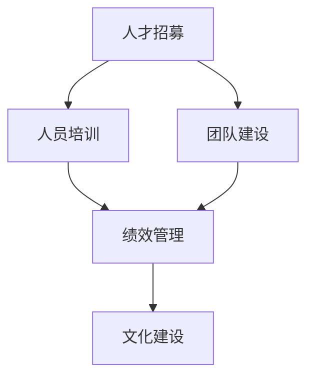
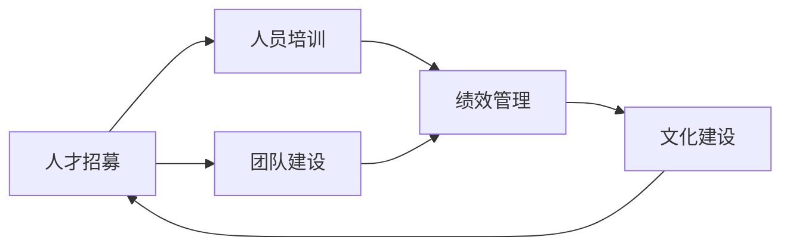

                 

## 1. 背景介绍

### 1.1 问题由来

在当今快速变化和竞争激烈的科技行业中，研发中心（R&D）的重要性日益凸显。作为企业创新的核心力量，研发中心不仅需要技术创新，还需要高效的人才管理和团队建设。

近年来，随着人工智能、大数据、云计算等技术的迅猛发展，以及全球化的市场竞争，研发中心面临着前所未有的挑战。如何构建一支高效、创新、灵活的研发团队，成为所有企业都必须直面的问题。

### 1.2 问题核心关键点

构建高效的研发团队，涉及到以下几个核心关键点：

- **人员招募与选拔**：从众多的候选人中，快速高效地找到最符合企业需求的人才。
- **培训与发展**：通过有效的培训计划，帮助员工不断提升技术能力和业务水平。
- **团队协作与沟通**：建立良好的团队协作机制和沟通渠道，提高团队的协作效率和创新能力。
- **绩效评估与激励**：建立科学的绩效评估体系和激励机制，激发员工的积极性和创造力。
- **知识共享与创新文化**：促进知识共享和创新文化的建立，增强团队的创新能力和竞争力。

解决好以上几个关键点，将大大提升研发中心的人才管理效率和创新能力。

## 2. 核心概念与联系

### 2.1 核心概念概述

在构建研发团队的过程中，有几个核心概念需要明确：

- **人才招募**：通过各种渠道和策略，吸引和选拔适合企业发展的优秀人才。
- **人员培训**：针对不同级别的员工，制定个性化的培训计划，提升其技术能力和业务水平。
- **团队建设**：通过合理的团队结构设计和团队活动，增强团队的凝聚力和协同能力。
- **绩效管理**：通过科学合理的绩效评估体系和激励机制，激发员工的积极性和创造力。
- **文化建设**：营造积极向上的创新文化，促进知识的共享和创新。

这些核心概念之间相互关联，共同构成了研发中心团队建设和人才培养的框架。

### 2.2 概念间的关系

这些核心概念之间的联系可以通过以下Mermaid流程图来展示：



这个流程图展示了人才招募、人员培训、团队建设、绩效管理和文化建设之间的关系。首先，通过人才招募找到合适的人才；然后，通过人员培训提升其能力；接下来，通过团队建设增强团队协作；最后，通过绩效管理和文化建设激发员工的积极性和创造力。

### 2.3 核心概念的整体架构

最后，我们用一个综合的流程图来展示这些核心概念在大团队建设和人才培养中的整体架构：



这个综合流程图展示了从人才招募到文化建设的完整过程。在人才招募的基础上，进行人员培训，然后通过团队建设增强协作，再通过绩效管理和文化建设激发员工的积极性和创造力。这是一个循环往复、不断提升的过程。

## 3. 核心算法原理 & 具体操作步骤
### 3.1 算法原理概述

研发中心团队的建设和人才培养，本质上是一个持续优化的过程。其核心原理是通过科学的流程和方法，不断提升团队成员的能力和团队的协作效率。

人才招募、人员培训、团队建设、绩效管理、文化建设等各个环节，都需要制定科学的方法和流程，通过持续的优化和迭代，实现团队的整体提升。

### 3.2 算法步骤详解

以下是研发中心团队建设和人才培养的具体步骤：

#### 3.2.1 人才招募

1. **确定需求**：根据项目需求和公司战略，明确需要的人才类型和数量。
2. **渠道选择**：选择合适的招聘渠道，如招聘网站、技术社区、校园招聘等。
3. **简历筛选**：对收到的简历进行初步筛选，排除不符合条件的人员。
4. **面试评估**：通过多轮面试，综合评估候选人的技术能力、团队合作能力和企业文化契合度。
5. **录用决策**：根据面试结果和公司需求，做出最终的录用决策。

#### 3.2.2 人员培训

1. **培训需求分析**：根据员工的技术水平和项目需求，制定个性化的培训计划。
2. **培训资源准备**：选择合适的培训资源，如内部讲师、外部培训机构、在线课程等。
3. **培训实施**：组织员工参加培训，通过理论学习、实践操作等方式提升技能。
4. **培训效果评估**：对培训效果进行评估，通过考试、项目实战等方式验证培训成果。
5. **持续学习**：鼓励员工通过外部培训、技术交流等方式，持续提升个人技能。

#### 3.2.3 团队建设

1. **团队结构设计**：根据项目需求，设计合理的团队结构和角色分工。
2. **团队沟通机制**：建立高效的沟通机制，如定期会议、协作工具等。
3. **团队合作机制**：通过团队建设活动，增强团队凝聚力和协同能力。
4. **团队冲突管理**：及时处理团队内部的冲突，维护团队和谐。
5. **团队绩效评估**：定期对团队绩效进行评估，发现问题并进行改进。

#### 3.2.4 绩效管理

1. **绩效指标设定**：根据岗位职责和公司战略，设定合理的绩效指标。
2. **绩效评估**：通过定量和定性相结合的方式，对员工的工作表现进行评估。
3. **绩效反馈**：及时向员工提供反馈，帮助其改进工作。
4. **绩效激励**：根据绩效评估结果，提供相应的激励措施，如奖金、晋升等。
5. **绩效改进**：根据绩效评估结果，制定改进计划，提升员工的工作表现。

#### 3.2.5 文化建设

1. **企业文化塑造**：通过公司愿景、价值观、行为规范等方式，塑造企业文化的核心要素。
2. **文化活动策划**：组织各种文化活动，如团队建设活动、技术分享会、创新竞赛等。
3. **知识共享平台**：建立知识共享平台，促进知识共享和创新。
4. **创新文化氛围**：营造积极向上的创新文化，鼓励员工提出创新想法和解决方案。
5. **文化评估与改进**：定期对企业文化进行评估，发现问题并进行改进。

### 3.3 算法优缺点

研发中心团队建设和人才培养的方法，具有以下优点：

1. **提升员工技能**：通过系统化的培训和持续学习，提升员工的技术能力和业务水平。
2. **增强团队协作**：通过合理的团队结构和沟通机制，增强团队的协作效率和创新能力。
3. **激发员工积极性和创造力**：通过科学的绩效管理和激励机制，激发员工的积极性和创造力。
4. **促进知识共享和创新**：通过知识共享平台和文化建设，促进知识的共享和创新。

但该方法也存在一定的缺点：

1. **时间和资源投入较大**：从人才招募到文化建设，每个环节都需要投入大量的时间和资源。
2. **效果难以量化**：培训和团队建设的效果难以量化评估，需要结合定性分析和绩效评估进行综合评估。
3. **文化氛围的营造需要时间**：创新文化的营造需要较长时间，短期内可能难以看到明显效果。

## 4. 数学模型和公式 & 详细讲解  
### 4.1 数学模型构建

在研发中心团队建设和人才培养的过程中，我们可以使用一些数学模型来辅助理解和优化。

例如，可以使用回归模型来预测员工的绩效表现，如下所示：

$$
y = \beta_0 + \beta_1 x_1 + \beta_2 x_2 + \epsilon
$$

其中，$y$ 表示员工的绩效表现，$x_1$ 和 $x_2$ 分别表示员工的技术能力和工作态度，$\beta_0$、$\beta_1$ 和 $\beta_2$ 分别表示对应的系数，$\epsilon$ 表示误差项。

### 4.2 公式推导过程

通过回归模型，我们可以对员工的技术能力和工作态度进行综合评估，从而预测其绩效表现。该模型的推导过程如下：

1. 收集员工的技术能力和工作态度数据。
2. 构建回归模型，设定回归方程。
3. 使用最小二乘法等方法，求解回归系数 $\beta_0$、$\beta_1$ 和 $\beta_2$。
4. 将员工的技术能力和工作态度代入回归方程，计算其绩效表现预测值。
5. 通过比较预测值和实际绩效表现，评估回归模型的效果。

### 4.3 案例分析与讲解

假设我们在一家科技公司进行团队建设和人才培养的优化，使用上述回归模型来预测员工的绩效表现。

1. **数据收集**：收集员工的技术能力和工作态度数据，如代码质量、项目完成度、团队合作度等。
2. **模型构建**：构建回归模型，设定回归方程，设定技术能力和工作态度为自变量，绩效表现为因变量。
3. **参数求解**：使用最小二乘法求解回归系数 $\beta_0$、$\beta_1$ 和 $\beta_2$，得到回归方程。
4. **预测绩效**：将员工的技术能力和工作态度代入回归方程，计算其绩效表现预测值。
5. **效果评估**：通过比较预测值和实际绩效表现，评估回归模型的效果，优化模型参数，提升预测准确性。

## 5. 项目实践：代码实例和详细解释说明
### 5.1 开发环境搭建

在进行团队建设和人才培养的实践前，我们需要准备好开发环境。以下是使用Python进行Pandas数据处理的环境配置流程：

1. 安装Anaconda：从官网下载并安装Anaconda，用于创建独立的Python环境。

2. 创建并激活虚拟环境：
```bash
conda create -n rds-env python=3.8 
conda activate rds-env
```

3. 安装Pandas：
```bash
pip install pandas
```

4. 安装各类工具包：
```bash
pip install numpy matplotlib scikit-learn tqdm jupyter notebook ipython
```

完成上述步骤后，即可在`rds-env`环境中开始项目实践。

### 5.2 源代码详细实现

下面以构建团队绩效评估模型为例，给出使用Pandas进行数据处理和回归分析的Python代码实现。

首先，导入相关库并准备数据：

```python
import pandas as pd
import numpy as np
from sklearn.linear_model import LinearRegression
from sklearn.model_selection import train_test_split
from sklearn.metrics import mean_squared_error, r2_score

# 准备数据
data = pd.read_csv('employee_performance.csv')
X = data[['technical_skill', 'work_attitude']]
y = data['performance']
```

然后，进行数据清洗和划分：

```python
# 数据清洗
X.dropna(inplace=True)
y.dropna(inplace=True)

# 划分训练集和测试集
X_train, X_test, y_train, y_test = train_test_split(X, y, test_size=0.2, random_state=42)
```

接着，建立回归模型并进行训练：

```python
# 建立回归模型
model = LinearRegression()

# 训练模型
model.fit(X_train, y_train)
```

最后，进行预测和评估：

```python
# 预测绩效表现
y_pred = model.predict(X_test)

# 评估模型效果
mse = mean_squared_error(y_test, y_pred)
r2 = r2_score(y_test, y_pred)

print('Mean Squared Error:', mse)
print('R-squared:', r2)
```

以上就是使用Pandas进行团队绩效评估模型构建和评估的完整代码实现。可以看到，Pandas提供了强大的数据处理和分析能力，能够快速高效地完成数据的清洗、划分和模型训练。

### 5.3 代码解读与分析

让我们再详细解读一下关键代码的实现细节：

**数据准备**：
- `pd.read_csv()`方法：从CSV文件中读取数据。
- `X` 和 `y` 分别表示自变量和因变量。

**数据清洗**：
- `dropna()`方法：去除缺失数据。

**模型训练**：
- `LinearRegression()`类：建立线性回归模型。
- `fit()`方法：使用训练集数据进行模型训练。

**预测与评估**：
- `predict()`方法：使用模型对测试集数据进行预测。
- `mean_squared_error()`和 `r2_score()`函数：评估模型预测的误差和拟合度。

**代码执行结果**：
- `mse`：均方误差，评估模型预测的准确性。
- `r2`：决定系数，评估模型对数据的拟合程度。

## 6. 实际应用场景
### 6.1 团队绩效评估

团队绩效评估是研发中心团队建设和人才培养的重要环节，通过科学合理的评估，可以及时发现团队存在的问题，并进行改进。

使用回归模型，可以将员工的技术能力和工作态度与绩效表现联系起来，从而实现绩效的预测和评估。具体应用场景如下：

1. **员工绩效评估**：在员工年度绩效评估时，通过回归模型预测其绩效表现，并结合实际表现进行综合评估。
2. **团队绩效改进**：根据团队整体绩效表现，分析技术能力和工作态度的分布，发现问题并进行改进。
3. **人才选拔**：在人才选拔过程中，使用回归模型预测候选人的绩效表现，从而做出更科学的决策。

### 6.2 人才发展规划

人才发展规划是研发中心人才管理的核心任务之一，通过科学的规划，帮助员工提升能力和职业发展。

使用回归模型，可以预测员工的技术能力和职业发展路径，从而制定科学的培训计划和发展路径。具体应用场景如下：

1. **员工能力评估**：通过回归模型评估员工的技术能力和工作态度，发现短板并进行提升。
2. **职业发展路径**：根据员工的技术能力和职业目标，预测其职业发展路径，并提供相应的培训和发展机会。
3. **人才梯队建设**：根据团队的绩效评估结果和人才发展规划，制定人才梯队建设策略，提升团队的整体能力。

### 6.3 团队协作优化

团队协作优化是研发中心团队建设的关键环节，通过优化协作机制，提升团队的协同效率和创新能力。

使用回归模型，可以预测团队成员之间的协作效果，从而优化协作机制。具体应用场景如下：

1. **团队协作效果评估**：通过回归模型评估团队成员之间的协作效果，发现问题并进行改进。
2. **协作机制优化**：根据协作效果评估结果，优化团队协作机制，提升团队的协同效率。
3. **团队活动设计**：通过回归模型预测团队活动的有效性，设计更有针对性的团队活动。

### 6.4 未来应用展望

随着数据科学和机器学习技术的不断发展，研发中心团队建设和人才培养将迎来更多的机会和挑战。

未来，研发中心团队建设和人才培养将更加智能化和个性化，以下将从以下几个方面展望未来：

1. **大数据和AI技术应用**：利用大数据和AI技术，实时监测和分析员工的表现和团队的协作效果，提供个性化的培训和发展建议。
2. **知识图谱和推荐系统**：通过知识图谱和推荐系统，促进知识的共享和创新，提升团队的创新能力。
3. **多模态数据分析**：结合文本、语音、图像等多模态数据，更全面地评估员工和团队的绩效和能力。
4. **自动化和智能化**：通过自动化和智能化工具，提升人才管理的效率和效果，减少人工干预。
5. **全球化和本地化**：在全球化和本地化的背景下，研发中心团队建设和人才培养需要更加灵活和适应性强的策略。

总之，研发中心团队建设和人才培养的智能化和个性化将是未来的重要趋势，这将大大提升团队的能力和竞争力，推动企业的持续发展和创新。

## 7. 工具和资源推荐
### 7.1 学习资源推荐

为了帮助研发中心团队建设和人才培养的管理者快速掌握相关技术和管理方法，这里推荐一些优质的学习资源：

1. **《敏捷软件开发》系列书籍**：介绍敏捷开发的方法和实践，帮助团队提升开发效率和质量。
2. **《高效能团队》书籍**：探讨高效团队建设和管理的方法，提供丰富的案例和工具。
3. **《人才管理》课程**：斯坦福大学提供的在线课程，系统讲解人才管理和团队建设的核心概念和实践方法。
4. **《数据科学》课程**：Coursera提供的在线课程，涵盖数据科学的基础知识和实践技能。
5. **《机器学习实战》书籍**：介绍机器学习的基本概念和实践方法，帮助团队提升数据处理和模型训练的能力。

通过对这些资源的学习实践，相信研发中心的管理者一定能够掌握团队建设和人才培养的核心技术和方法，推动团队的持续发展和创新。

### 7.2 开发工具推荐

高效的开发离不开优秀的工具支持。以下是几款用于研发中心团队建设和人才培养开发的常用工具：

1. **Jira**：项目管理工具，帮助团队进行任务分配、进度跟踪和问题管理。
2. **Slack**：团队沟通工具，支持多人的实时沟通和协作。
3. **Confluence**：知识共享平台，支持文档管理和知识沉淀。
4. **GitHub**：代码管理平台，支持版本控制和协作开发。
5. **Zoom**：视频会议工具，支持远程协作和沟通。

合理利用这些工具，可以显著提升研发中心团队建设和人才培养的效率，加快创新迭代的步伐。

### 7.3 相关论文推荐

研发中心团队建设和人才培养的研究源于学界的持续研究。以下是几篇奠基性的相关论文，推荐阅读：

1. **《敏捷软件开发模式》**：探讨敏捷开发的方法和实践，提供丰富的案例和工具。
2. **《高绩效团队建设》**：研究高效团队建设和管理的方法，提出系统的实践框架。
3. **《人才管理和创新》**：探讨人才管理和团队创新的关系，提供数据驱动的决策支持。
4. **《知识图谱在团队协作中的应用》**：研究知识图谱在团队协作中的应用，提升团队的知识共享和创新能力。
5. **《自动化和智能化人才管理》**：探讨自动化和智能化在人才管理中的应用，提升管理的效率和效果。

这些论文代表了大团队建设和人才培养的发展脉络。通过学习这些前沿成果，可以帮助研发中心的管理者把握学科前进方向，激发更多的创新灵感。

除上述资源外，还有一些值得关注的前沿资源，帮助研发中心的管理者紧跟团队建设和人才培养技术的最新进展，例如：

1. **arXiv论文预印本**：人工智能领域最新研究成果的发布平台，包括大量尚未发表的前沿工作，学习前沿技术的必读资源。
2. **顶级学术会议直播**：如NIPS、ICML、ACL、ICLR等人工智能领域顶会现场或在线直播，能够聆听到大佬们的前沿分享，开拓视野。
3. **技术博客和社区**：如OpenAI、Google AI、DeepMind、微软Research Asia等顶尖实验室的官方博客，第一时间分享他们的最新研究成果和洞见。
4. **开源项目和工具**：在GitHub上Star、Fork数最多的研发中心团队建设和人才培养相关项目，往往代表了该技术领域的发展趋势和最佳实践，值得去学习和贡献。
5. **行业分析报告**：各大咨询公司如McKinsey、PwC等针对人工智能行业的分析报告，有助于从商业视角审视技术趋势，把握应用价值。

总之，研发中心团队建设和人才培养的研究和实践需要管理者持续学习和不断优化，合理利用各种资源和工具，推动团队的持续发展和创新。

## 8. 总结：未来发展趋势与挑战
### 8.1 总结

本文对研发中心团队建设和人才培养的方法进行了全面系统的介绍。首先阐述了研发中心团队建设和人才培养的研究背景和意义，明确了团队建设和人才培养在企业发展中的核心地位。其次，从原理到实践，详细讲解了团队建设和人才培养的数学模型和具体操作步骤，给出了实践中的关键步骤和案例分析。

通过本文的系统梳理，可以看到，研发中心团队建设和人才培养是一个持续优化的过程，需要通过科学的流程和方法，不断提升团队成员的能力和团队的协作效率。未来，随着数据科学和机器学习技术的不断发展，团队建设和人才培养将迎来更多的机会和挑战，需要管理者持续学习和不断优化，才能推动团队的持续发展和创新。

### 8.2 未来发展趋势

展望未来，研发中心团队建设和人才培养将呈现以下几个发展趋势：

1. **智能化和自动化**：利用大数据和AI技术，实现人才管理的智能化和自动化，提升管理效率和效果。
2. **个性化和灵活化**：根据员工的特点和需求，提供个性化的培训和发展建议，提升员工的能力和满意度。
3. **多模态和跨领域**：结合文本、语音、图像等多模态数据，实现多模态人才管理和创新。
4. **全球化和本地化**：在全球化和本地化的背景下，提供适应不同文化和市场的人才管理策略。
5. **协作和创新**：通过知识图谱和推荐系统，促进知识的共享和创新，提升团队的创新能力和竞争力。

这些趋势将大大提升研发中心的人才管理效率和创新能力，为企业的持续发展和创新提供坚实的基础。

### 8.3 面临的挑战

尽管研发中心团队建设和人才培养的方法已经取得了显著成效，但在迈向更加智能化、普适化应用的过程中，仍面临诸多挑战：

1. **数据质量和隐私问题**：数据的质量和隐私问题，对团队建设和人才培养的效果至关重要。需要制定严格的数据管理策略，保障数据的可靠性和隐私安全。
2. **文化和价值观的差异**：不同国家和文化背景的员工，其价值观和工作方式存在差异，需要管理者进行有效的跨文化管理和沟通。
3. **技术和工具的迭代更新**：随着技术的发展，新的工具和平台不断涌现，需要管理者持续学习并适应新技术。
4. **员工激励和心理健康的关注**：在追求高绩效的同时，也需要关注员工的激励和心理健康，保障员工的积极性和幸福感。
5. **知识共享和创新文化**：知识共享和创新文化的营造需要较长时间，短期内可能难以看到明显效果，需要持续推进。

这些挑战需要通过科学的策略和有效的管理手段，逐步克服，才能实现团队建设和人才培养的持续优化和发展。

### 8.4 研究展望

面对研发中心团队建设和人才培养所面临的挑战，未来的研究需要在以下几个方面寻求新的突破：

1. **数据治理和隐私保护**：制定严格的数据治理策略，保障数据的可靠性和隐私安全。
2. **跨文化管理和沟通**：研究跨文化管理和沟通的方法，提高团队的多元化和包容性。
3. **新技术的引入和应用**：持续学习并应用新的技术工具，提升团队管理的效率和效果。
4. **员工激励和心理健康的支持**：提供全面的员工激励和心理健康的支持，提升员工的积极性和幸福感。
5. **知识共享和创新文化的营造**：通过知识图谱和推荐系统，促进知识的共享和创新，提升团队的创新能力和竞争力。

这些研究方向将引领研发中心团队建设和人才培养技术的不断进步，为企业的持续发展和创新提供有力支持。

## 9. 附录：常见问题与解答
### 9.1 常见问题解答

以下是研发中心团队建设和人才培养过程中可能遇到的一些常见问题及其解答：

**Q1：如何评估团队协作效果？**

A: 通过回归模型，可以预测团队成员之间的协作效果，发现问题并进行改进。具体方法包括：
- 收集团队成员之间的协作数据，如沟通频率、任务分配等。
- 使用回归模型，将协作数据作为自变量，评估协作效果作为因变量。
- 通过模型评估，发现协作效果较差的人员或团队，进行针对性的改进。

**Q2：如何制定科学的培训计划？**

A: 根据员工的职业发展路径和能力评估结果，制定个性化的培训计划，提升员工的能力和满意度。具体方法包括：
- 进行员工能力评估，了解其技术能力和职业发展目标。
- 制定培训计划，提供针对性的培训课程和实践机会。
- 持续跟踪员工培训效果，进行反馈和调整。

**Q3：如何优化团队结构和角色分工？**

A: 通过数据分析和组织调整，优化团队结构和角色分工，提升团队的协作效率和创新能力。具体方法包括：
- 收集团队成员的技能和职责数据。
- 使用回归模型，分析技能和职责的分布，发现结构不合理的地方。
- 根据分析结果，调整团队结构和角色分工，提升团队的协作效率。

**Q4：如何提升团队的创新能力？**

A: 通过知识共享和创新文化的营造，提升团队的创新能力。具体方法包括：
- 建立知识共享平台，促进知识的共享和传播。
- 组织创新竞赛和项目，鼓励员工提出创新想法和解决方案。
- 定期评估和推广创新成果，营造积极向上的创新文化。

**Q5：如何平衡团队管理和员工自由度？**

A: 通过科学的流程和方法，平衡团队管理和员工自由度，提升团队的协作效率和创新能力。具体方法包括：
- 制定明确的团队目标和任务，保障团队的协作效率。
- 给予员工一定的自由度，鼓励其自主创新和探索。
- 通过有效的沟通和反馈机制，及时发现和解决团队内部的问题。

通过这些常见问题的解答，可以帮助研发中心的管理者更好地应对团队建设和人才培养过程中的各种挑战，推动团队的持续发展和创新。

---
作者：禅与计算机程序设计艺术 / Zen and the Art of Computer Programming

