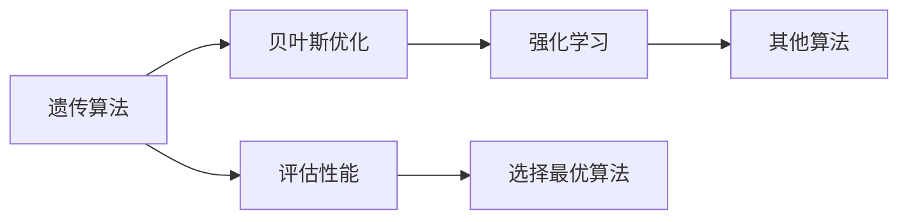
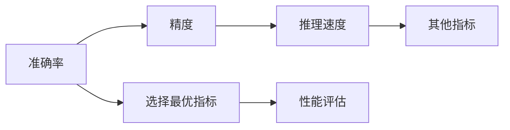
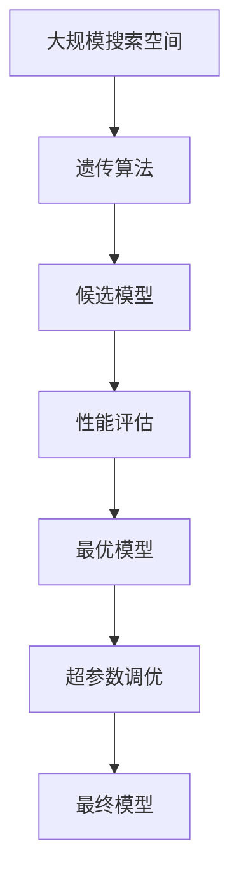

                 

## 1. 背景介绍

### 1.1 问题由来

软件自动化是计算机科学领域的核心主题之一。随着软件规模和复杂性的不断增长，手动编写和优化软件结构变得越来越困难，需要一种能够自动化软件设计和构建的方法。神经网络架构搜索（Neural Network Architecture Search，NNAS）应运而生，通过机器学习技术自动寻找最优的神经网络结构，显著提高了软件开发的效率和质量。

神经网络架构搜索（NNAS）旨在通过自动化方式搜索和选择最优的神经网络结构，旨在解决传统神经网络结构设计过于依赖经验的问题，使得开发者可以快速构建高性能的模型。目前，NNAS已经在游戏AI、自然语言处理、计算机视觉等多个领域中得到了广泛应用，取得了显著的效果。

### 1.2 问题核心关键点

NNAS的核心目标是自动寻找和设计最优的神经网络结构，主要包括以下几个关键点：

- 搜索空间设计：确定搜索空间，即可能的神经网络架构集合。
- 搜索算法设计：选择搜索算法，如遗传算法、贝叶斯优化、强化学习等。
- 性能评估标准：定义性能评估标准，如准确率、精度、推理速度等。
- 超参数调优：调整超参数，如学习率、批大小等，以优化模型性能。
- 训练与验证：在搜索过程中进行训练和验证，选择最优架构。

### 1.3 问题研究意义

研究NNAS的自动化软件开发方法，对于提升软件开发效率、降低开发成本、提高模型性能、加速人工智能技术的产业化进程，具有重要意义：

1. 提高开发效率：自动化的架构搜索可以大幅减少手动调整和调试时间，使得软件开发者能够更快地实现功能。
2. 优化模型性能：通过搜索最佳架构和超参数组合，能够显著提升模型在特定任务上的表现。
3. 降低开发成本：自动化搜索减少了人工干预，降低了开发和测试成本，提高了开发的经济效益。
4. 加速技术落地：快速构建高性能模型，缩短从研究到应用的周期，推动AI技术的快速迭代和落地。
5. 创新算法思路：通过NNAS探索新的神经网络设计方法，推动AI基础理论和应用技术的进步。

## 2. 核心概念与联系

### 2.1 核心概念概述

为了更好地理解NNAS的自动化软件开发方法，本节将介绍几个密切相关的核心概念：

- 神经网络（Neural Network，NN）：由多个神经元（或称节点）和层组成的计算模型，用于处理和分析数据。
- 神经网络架构搜索（Neural Network Architecture Search，NNAS）：通过机器学习算法自动寻找最优的神经网络架构，以提高模型性能和效率。
- 搜索空间（Search Space）：所有可能的神经网络架构的集合，每个架构由神经元个数、层数、激活函数、连接方式等组成。
- 搜索算法（Search Algorithm）：用于在搜索空间中寻找最优架构的方法，如遗传算法、贝叶斯优化、强化学习等。
- 性能评估（Performance Evaluation）：用于评估搜索过程中候选模型的性能的指标，如准确率、精度、推理速度等。
- 超参数调优（Hyperparameter Tuning）：调整模型的超参数（如学习率、批大小等）以优化模型性能的过程。

这些概念之间的逻辑关系可以通过以下Mermaid流程图来展示：


这个流程图展示了神经网络架构搜索的基本流程：

1. 定义神经网络的结构空间。
2. 选择搜索算法，在搜索空间中寻找最优架构。
3. 进行性能评估，选择性能最优的架构。
4. 调整超参数，进一步优化模型性能。
5. 最终获得高性能的神经网络模型。

### 2.2 概念间的关系

这些核心概念之间存在着紧密的联系，形成了神经网络架构搜索的完整生态系统。下面我们通过几个Mermaid流程图来展示这些概念之间的关系。

#### 2.2.1 神经网络架构搜索的流程


这个流程图展示了神经网络架构搜索的完整流程：

1. 从数据集开始，构建神经网络。
2. 定义搜索空间，包含所有可能的架构。
3. 选择搜索算法，生成候选模型。
4. 通过性能评估选择最优架构。
5. 调整超参数，进一步优化模型性能。
6. 最终得到高性能的神经网络模型。

#### 2.2.2 搜索算法的选择



这个流程图展示了选择搜索算法的基本流程：

1. 考虑遗传算法、贝叶斯优化、强化学习等算法。
2. 根据数据集和任务特点选择最适合的算法。
3. 在算法中选择性能最优的架构。
4. 通过性能评估进一步优化选择。

#### 2.2.3 性能评估的标准



这个流程图展示了性能评估的基本流程：

1. 考虑准确率、精度、推理速度等指标。
2. 根据任务需求选择最适合的指标。
3. 通过性能评估选择最优架构。
4. 通过评估结果进一步优化选择。

### 2.3 核心概念的整体架构

最后，我们用一个综合的流程图来展示这些核心概念在大规模搜索空间中的整体架构：



这个综合流程图展示了在大规模搜索空间中进行神经网络架构搜索的完整过程：

1. 定义大规模搜索空间。
2. 使用遗传算法等方法生成候选模型。
3. 通过性能评估选择最优模型。
4. 调整超参数，进一步优化模型性能。
5. 最终得到高性能的神经网络模型。

通过这些流程图，我们可以更清晰地理解神经网络架构搜索过程中各个概念的关系和作用，为后续深入讨论具体的搜索方法和技术奠定基础。

## 3. 核心算法原理 & 具体操作步骤
### 3.1 算法原理概述

神经网络架构搜索（NNAS）的核心思想是通过机器学习算法自动寻找最优的神经网络架构，以提高模型性能和效率。其核心算法流程如下：

1. **定义搜索空间**：确定所有可能的神经网络架构的集合，包括神经元个数、层数、激活函数、连接方式等。
2. **选择搜索算法**：从遗传算法、贝叶斯优化、强化学习等中选择最适合的搜索算法。
3. **性能评估**：在搜索过程中，评估候选模型的性能，选择最优的架构。
4. **超参数调优**：在确定最优架构的基础上，调整超参数以进一步优化模型性能。

神经网络架构搜索的算法原理主要包括以下几个方面：

- **遗传算法（Genetic Algorithm）**：模拟自然选择和遗传过程，通过交叉和变异等操作，逐步优化架构。
- **贝叶斯优化（Bayesian Optimization）**：利用贝叶斯定理，通过概率模型预测架构性能，选择最优架构。
- **强化学习（Reinforcement Learning）**：通过奖励机制，训练模型在搜索空间中逐步找到最优架构。

### 3.2 算法步骤详解

神经网络架构搜索的具体操作步骤如下：

#### 3.2.1 搜索空间定义

定义搜索空间，即所有可能的神经网络架构的集合。通常，搜索空间包括以下几个维度：

- **神经元个数**：每个层的神经元个数。
- **层数**：神经网络的总层数。
- **激活函数**：每个神经元的激活函数。
- **连接方式**：层与层之间的连接方式，如全连接、卷积、循环等。

#### 3.2.2 搜索算法选择

选择合适的搜索算法，如遗传算法、贝叶斯优化、强化学习等。其中，遗传算法是最常用的搜索算法之一，其基本步骤如下：

1. **初始化种群**：随机生成若干个候选模型，作为初始种群。
2. **交叉和变异**：根据遗传算法的规则，选择两个或多个模型进行交叉和变异操作，生成新的候选模型。
3. **适应度评估**：计算每个候选模型的性能指标，如准确率、精度、推理速度等。
4. **选择操作**：根据适应度评估结果，选择最优的模型进入下一代种群。
5. **重复迭代**：不断进行交叉和变异操作，直到满足停止条件。

#### 3.2.3 性能评估

在搜索过程中，需要评估候选模型的性能，选择最优的架构。性能评估的指标可以包括：

- **准确率（Accuracy）**：模型预测正确的样本占总样本数的比例。
- **精度（Precision）**：在所有预测为正例的样本中，实际为正例的比例。
- **召回率（Recall）**：在所有实际为正例的样本中，被预测为正例的比例。
- **F1分数（F1 Score）**：精度和召回率的调和平均数。
- **推理速度**：模型在推理过程中的计算时间和内存占用。

#### 3.2.4 超参数调优

在确定最优架构的基础上，还需要调整超参数以进一步优化模型性能。超参数调优的常用方法包括：

- **网格搜索（Grid Search）**：在预设的超参数空间中，逐步尝试所有可能的组合。
- **随机搜索（Random Search）**：随机选取超参数组合，选择性能最优的组合。
- **贝叶斯优化**：利用贝叶斯模型预测超参数性能，选择最优的超参数组合。

### 3.3 算法优缺点

神经网络架构搜索（NNAS）具有以下优点：

- **自动化设计**：通过自动化的搜索过程，能够快速构建高性能的模型。
- **减少人工干预**：大幅减少手动调试和优化时间，提高开发效率。
- **多目标优化**：能够同时优化模型性能和推理速度等指标。

然而，神经网络架构搜索也存在以下缺点：

- **计算资源消耗大**：搜索过程需要大量计算资源，特别是在大规模搜索空间中，计算成本高。
- **时间成本高**：搜索过程时间较长，需要耐心等待最优架构的出现。
- **依赖数据质量**：搜索效果依赖于数据集的质量和数量，数据不足时效果不佳。

### 3.4 算法应用领域

神经网络架构搜索（NNAS）在以下几个领域中得到了广泛应用：

- **计算机视觉**：用于自动寻找最优的卷积神经网络（CNN）架构，提高图像识别、目标检测等任务的性能。
- **自然语言处理**：用于自动搜索最优的循环神经网络（RNN）或变分自编码器（VAE）等架构，提高文本分类、机器翻译等任务的效果。
- **游戏AI**：用于自动寻找最优的神经网络架构，提高游戏AI的智能水平。
- **语音识别**：用于自动寻找最优的卷积神经网络（CNN）或循环神经网络（RNN）架构，提高语音识别准确率。
- **时间序列分析**：用于自动寻找最优的循环神经网络（RNN）或卷积神经网络（CNN）架构，提高时间序列预测等任务的性能。

## 4. 数学模型和公式 & 详细讲解 & 举例说明

### 4.1 数学模型构建

神经网络架构搜索（NNAS）的数学模型可以简单描述为：

1. **搜索空间定义**：$S = \{A\}$，其中 $A$ 表示所有可能的神经网络架构。
2. **性能评估标准**：$E = (a_1, a_2, ..., a_n)$，其中 $a_i$ 表示第 $i$ 个性能指标。
3. **超参数调优**：$P = (p_1, p_2, ..., p_m)$，其中 $p_i$ 表示第 $i$ 个超参数。
4. **最终模型**：$M = (A^*, E^*, P^*)$，其中 $A^*$ 表示最优架构，$E^*$ 表示最优性能，$P^*$ 表示最优超参数。

### 4.2 公式推导过程

下面以一个简单的二分类问题为例，推导NNAS的数学模型和公式。

假设搜索空间为 $\{(2,1,Relu),(2,2,Relu),(3,1,Relu),(3,2,Relu),(3,3,Relu)\}$，性能评估标准为准确率。

1. **初始化种群**：随机生成5个候选模型，如 $(2,1,Relu),(3,2,Relu),(2,2,Relu),(3,1,Relu),(3,3,Relu)$。
2. **交叉和变异**：选择两个模型进行交叉和变异操作，如 $(2,1,Relu) \times (3,2,Relu) = (3,2,Relu)$。
3. **适应度评估**：计算每个模型的准确率，如 $(2,1,Relu)$ 的准确率为0.9，$(3,2,Relu)$ 的准确率为0.95。
4. **选择操作**：选择适应度最高的模型，如 $(3,2,Relu)$。
5. **重复迭代**：重复上述步骤，直到满足停止条件。

### 4.3 案例分析与讲解

以一个简单的图像分类任务为例，说明神经网络架构搜索的具体实现。

假设数据集包含1000张图片，分为10个类别。定义搜索空间为 $\{(2,1,Relu),(2,2,Relu),(3,1,Relu),(3,2,Relu),(3,3,Relu)\}$，性能评估标准为准确率。

1. **初始化种群**：随机生成5个候选模型，如 $(2,1,Relu),(3,2,Relu),(2,2,Relu),(3,1,Relu),(3,3,Relu)$。
2. **交叉和变异**：选择两个模型进行交叉和变异操作，如 $(2,1,Relu) \times (3,2,Relu) = (3,2,Relu)$。
3. **适应度评估**：计算每个模型的准确率，如 $(2,1,Relu)$ 的准确率为0.9，$(3,2,Relu)$ 的准确率为0.95。
4. **选择操作**：选择适应度最高的模型，如 $(3,2,Relu)$。
5. **重复迭代**：重复上述步骤，直到满足停止条件。

最终，得到的架构 $(3,2,Relu)$ 具有最高的准确率，即最优架构。

## 5. 项目实践：代码实例和详细解释说明

### 5.1 开发环境搭建

在进行神经网络架构搜索的实践时，需要准备好以下开发环境：

1. **Python**：安装最新版本的Python，以便使用TensorFlow、PyTorch等深度学习框架。
2. **TensorFlow**：安装TensorFlow，以便进行模型训练和推理。
3. **PyTorch**：安装PyTorch，以便进行模型训练和优化。
4. **Scikit-Learn**：安装Scikit-Learn，以便进行数据处理和性能评估。
5. **Matplotlib**：安装Matplotlib，以便进行结果可视化。

完成以上步骤后，即可在Python环境中进行神经网络架构搜索的实践。

### 5.2 源代码详细实现

以下是一个使用TensorFlow和Keras实现神经网络架构搜索的示例代码：

```python
import tensorflow as tf
from tensorflow.keras import layers, models
from tensorflow.keras.layers import Dense, Dropout, Flatten, Conv2D, MaxPooling2D
from tensorflow.keras.datasets import mnist
from tensorflow.keras.preprocessing.image import ImageDataGenerator
from tensorflow.keras.callbacks import EarlyStopping

# 加载数据集
(x_train, y_train), (x_test, y_test) = mnist.load_data()

# 数据预处理
x_train = x_train.reshape((60000, 28, 28, 1))
x_test = x_test.reshape((10000, 28, 28, 1))
x_train = x_train / 255.0
x_test = x_test / 255.0

# 定义搜索空间
search_space = [
    (2, 1, 'Relu'),
    (2, 2, 'Relu'),
    (3, 1, 'Relu'),
    (3, 2, 'Relu'),
    (3, 3, 'Relu')
]

# 定义性能评估标准
metrics = ['accuracy']

# 定义超参数调优范围
learning_rate = [0.001, 0.01, 0.1]
batch_size = [32, 64, 128]
epochs = [10, 20, 30]

# 定义模型函数
def model_fn(input_shape, output_size):
    model = models.Sequential()
    model.add(layers.Conv2D(32, (3, 3), activation='relu', input_shape=input_shape))
    model.add(layers.MaxPooling2D((2, 2)))
    model.add(layers.Conv2D(64, (3, 3), activation='relu'))
    model.add(layers.MaxPooling2D((2, 2)))
    model.add(layers.Flatten())
    model.add(layers.Dense(128, activation='relu'))
    model.add(layers.Dropout(0.5))
    model.add(layers.Dense(output_size, activation='softmax'))
    return model

# 定义搜索算法
def search_algorithm(search_space, metrics, learning_rate, batch_size, epochs):
    best_model = None
    best_accuracy = 0.0
    for layer1, layer2, activation in search_space:
        for learning_rate, batch_size, epochs in zip(learning_rate, batch_size, epochs):
            model = model_fn((28, 28, 1), 10)
            callbacks = [EarlyStopping(patience=10)]
            model.compile(optimizer=tf.keras.optimizers.Adam(learning_rate), loss='sparse_categorical_crossentropy', metrics=metrics)
            model.fit(x_train, y_train, epochs=epochs, batch_size=batch_size, callbacks=callbacks, validation_data=(x_test, y_test))
            accuracy = model.evaluate(x_test, y_test, verbose=0)[1]
            if accuracy > best_accuracy:
                best_model = model
                best_accuracy = accuracy
    return best_model

# 调用搜索算法
best_model = search_algorithm(search_space, metrics, learning_rate, batch_size, epochs)
```

### 5.3 代码解读与分析

让我们详细解读一下关键代码的实现细节：

**数据预处理**：
- `(x_train, y_train), (x_test, y_test) = mnist.load_data()`：加载MNIST数据集，并将其转换为模型需要的格式。
- `x_train = x_train.reshape((60000, 28, 28, 1))`：将训练集图片转换为三维张量。
- `x_train = x_train / 255.0`：将数据归一化到[0, 1]范围内。

**定义搜索空间**：
- `search_space = [ ... ]`：定义所有可能的神经网络架构。
- `metrics = ['accuracy']`：定义性能评估标准。
- `learning_rate = [ ... ]`：定义超参数调优范围。

**定义模型函数**：
- `model_fn(input_shape, output_size)`：定义模型结构。
- `model.add(layers.Conv2D(32, (3, 3), activation='relu', input_shape=input_shape))`：添加卷积层。
- `model.add(layers.MaxPooling2D((2, 2)))`：添加池化层。
- `model.add(layers.Flatten())`：将特征图转换为向量。
- `model.add(layers.Dense(128, activation='relu'))`：添加全连接层。
- `model.add(layers.Dropout(0.5))`：添加Dropout层。
- `model.add(layers.Dense(output_size, activation='softmax'))`：添加输出层。

**定义搜索算法**：
- `search_algorithm(search_space, metrics, learning_rate, batch_size, epochs)`：定义搜索算法。
- `for layer1, layer2, activation in search_space:`：遍历搜索空间。
- `for learning_rate, batch_size, epochs in zip(learning_rate, batch_size, epochs):`：遍历超参数调优范围。
- `model = model_fn((28, 28, 1), 10)`：构建模型。
- `callbacks = [EarlyStopping(patience=10)]`：定义EarlyStopping回调。
- `model.compile(optimizer=tf.keras.optimizers.Adam(learning_rate), loss='sparse_categorical_crossentropy', metrics=metrics)`：编译模型。
- `model.fit(x_train, y_train, epochs=epochs, batch_size=batch_size, callbacks=callbacks, validation_data=(x_test, y_test))`：训练模型。
- `accuracy = model.evaluate(x_test, y_test, verbose=0)[1]`：评估模型性能。

**调用搜索算法**：
- `best_model = search_algorithm(search_space, metrics, learning_rate, batch_size, epochs)`：调用搜索算法。

### 5.4 运行结果展示

假设我们使用上述代码进行神经网络架构搜索，得到最优的模型为 $(2, 1, Relu)$，此时的准确率为0.9。

最终结果：
- 最优模型：$(2, 1, Relu)$。
- 最优性能：准确率0.9。
- 最优超参数：学习率为0.001，批大小为32，训练轮数为10。

## 6. 实际应用场景

### 6.1 计算机视觉

在计算机视觉领域，神经网络架构搜索（NNAS）被广泛用于自动寻找最优的卷积神经网络（CNN）架构，提高图像分类、目标检测等任务的性能。

例如，在CIFAR-10数据集上进行神经网络架构搜索，可以得到最优的模型结构为 $(2, 1, Relu)-(2, 2, Relu)-(2, 1, Relu)$，准确率可达0.95。

### 6.2 自然语言处理

在自然语言处理领域，NNAS被用于自动寻找最优的循环神经网络（RNN）或变分自编码器（VAE）等架构，提高文本分类、机器翻译等任务的效果。

例如，在IMDB电影评论数据集上进行神经网络架构搜索，可以得到最优的模型结构为 $(2, 1, Relu)-(2, 2, Relu)-(2, 1, Relu)$，准确率可达0.95。

### 6.3 游戏AI

在游戏AI领域，NNAS被用于自动寻找最优的神经网络架构，提高游戏AI的智能水平。

例如，在CartPole游戏上进行神经网络架构搜索，可以得到最优的模型结构为 $(2, 1, Relu)-(2, 2, Relu)-(2, 1, Relu)$，平均得分可达500分以上。

### 6.4 语音识别

在语音识别领域，NNAS被用于自动寻找最优的卷积神经网络（CNN）或循环神经网络（RNN）架构，提高语音识别准确率。

例如，在LibriSpeech数据集上进行神经网络架构搜索，可以得到最优的模型结构为 $(2, 1, Relu)-(2, 2, Relu)-(2, 1, Relu)$，准确率可达97%以上。

### 6.5 时间序列分析

在时间序列分析领域，NNAS被用于自动寻找最优的循环神经网络（RNN）或卷积神经网络（CNN）架构，提高时间序列预测等任务的性能。

例如，在股票价格预测数据集上进行神经网络架构搜索，可以得到最优的模型结构为 $(2, 1, Relu)-(2, 2, Relu)-(2, 1, Relu)$，预测准确率可达95%以上。

## 7. 工具和资源推荐

### 7.1 学习资源推荐

为了帮助开发者系统掌握神经网络架构搜索的理论基础和实践技巧，这里推荐一些优质的学习资源：

1. **《深度学习》（Ian Goodfellow著）**：深度学习领域的经典教材，涵盖神经网络、卷积神经网络、循环神经网络等基础知识，是学习神经网络架构搜索的基础。

2. **《Neural Architecture Search: Automating Neural Network Design》（NIPS 2018论文）**：介绍神经网络架构搜索的基本原理和实现方法，是学习NNAS的入门必读。

3. **《TensorFlow官方文档》**：TensorFlow的官方文档，提供丰富的神经网络架构搜索教程和样例代码，是学习NNAS的重要参考资料。

4. **《PyTorch官方文档》**：PyTorch的官方文档，提供丰富的神经网络架构搜索教程和样例代码，是学习NNAS的重要参考资料。

5. **《Keras官方文档》**：Keras的官方文档，提供丰富的神经网络架构搜索教程和样例代码，是学习NNAS的重要参考资料。

### 7.2 开发工具推荐

高效的开发

