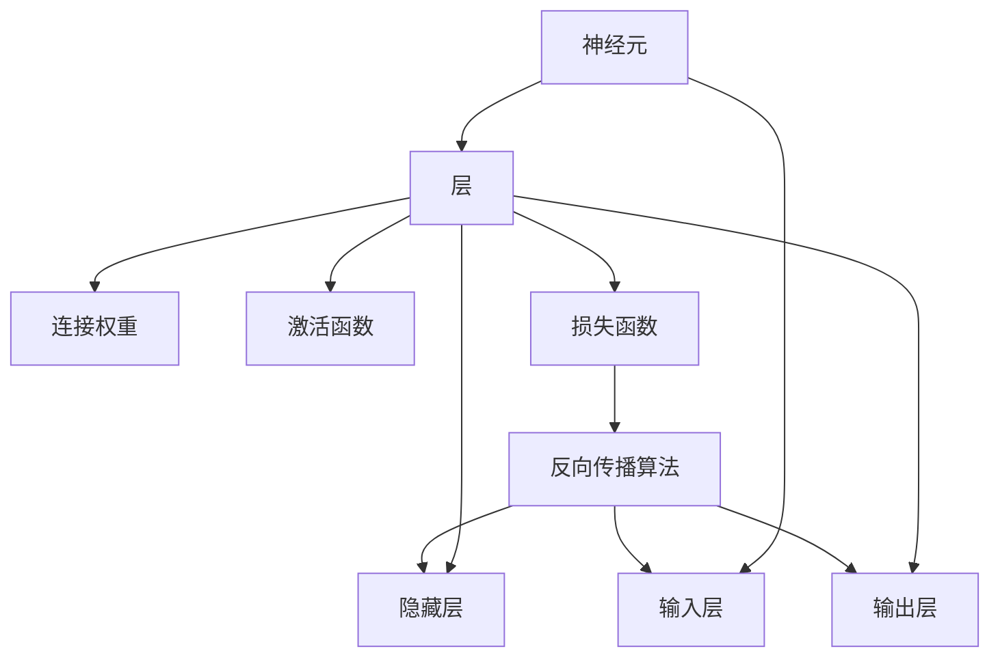

                 

# 神经网络：人工智能的基石

## 1. 背景介绍

### 1.1 问题由来

人工智能(AI)领域的飞速发展，离不开强大的算法支持和数据驱动。其中，神经网络(Neural Networks, NNs)作为最核心的人工智能技术之一，已经被广泛应用于图像识别、语音识别、自然语言处理、游戏智能等多个领域，并取得了显著的成果。

神经网络是通过模拟人脑神经元间的连接和交互机制，实现对数据的高效表示和处理。它不仅能够处理复杂的非线性关系，还能够通过大量数据进行自学习，提升模型的泛化能力和性能。

### 1.2 问题核心关键点

神经网络的核心原理包括：

- **神经元**：神经网络的基本单元，接收输入信号，通过激活函数产生输出信号。

- **层**：神经元按照功能分层，输入层接收数据输入，隐藏层进行特征提取和信息传递，输出层生成模型预测结果。

- **连接权重**：神经元之间的连接权重，用于调整信号的传递强度。

- **激活函数**：非线性函数，用于增加网络的表达能力和非线性拟合能力。

- **损失函数**：用于评估模型预测结果与真实标签之间的差距，指导模型训练。

- **反向传播算法**：通过链式法则计算损失函数对各参数的梯度，用于更新模型参数，优化模型性能。

这些关键概念共同构成了神经网络的计算框架和优化机制，为人工智能的各项应用提供了强大的基础。

### 1.3 问题研究意义

神经网络作为人工智能的基石，其研究和应用对于推动AI技术的发展和落地具有重要意义：

- **通用性**：神经网络模型具有广泛的适用性，适用于不同领域和任务，能够实现跨领域的迁移学习。
- **自适应能力**：通过大量的数据训练，神经网络能够自主学习新知识，提升模型的适应性和鲁棒性。
- **高效性**：神经网络的高效并行计算能力和泛化能力，使其在数据处理和复杂模式识别方面表现优异。
- **广泛应用**：神经网络已经被广泛应用于图像识别、语音识别、自然语言处理等多个领域，为各行业的数字化转型提供了重要支持。
- **持续创新**：随着深度学习技术的不断进步，神经网络模型在网络结构、激活函数、优化算法等方面也在持续创新，推动AI技术的不断突破。

## 2. 核心概念与联系

### 2.1 核心概念概述

神经网络由大量的神经元通过层级连接构成，其核心原理可以简单理解为模拟人脑神经元间的信号传递和处理机制。为了更好地理解神经网络，我们需要明确以下几个核心概念：

- **神经元**：神经网络的基本单元，接收输入信号，通过激活函数产生输出信号。
- **层**：神经元按照功能分层，输入层接收数据输入，隐藏层进行特征提取和信息传递，输出层生成模型预测结果。
- **连接权重**：神经元之间的连接权重，用于调整信号的传递强度。
- **激活函数**：非线性函数，用于增加网络的表达能力和非线性拟合能力。
- **损失函数**：用于评估模型预测结果与真实标签之间的差距，指导模型训练。
- **反向传播算法**：通过链式法则计算损失函数对各参数的梯度，用于更新模型参数，优化模型性能。

这些核心概念通过如下图所示的Mermaid流程图进行展示：



这个流程图展示了神经网络中各个概念之间的关系，使得理解神经网络的计算框架更加直观。

### 2.2 概念间的关系

神经网络中的各个概念之间存在密切的联系，形成了完整的计算和优化框架。这些概念之间的相互作用和配合，使得神经网络能够实现高效的数据处理和模式识别。

- **输入层**：接收原始数据，并将其传递给隐藏层。
- **隐藏层**：通过连接权重和激活函数，对输入数据进行特征提取和信息传递。
- **输出层**：根据隐藏层的输出，生成最终的模型预测结果。
- **激活函数**：增加网络的非线性表达能力，使得神经网络能够处理复杂的非线性关系。
- **连接权重**：调整信号的传递强度，通过反向传播算法进行参数更新，优化模型性能。
- **损失函数**：评估模型预测结果与真实标签之间的差距，指导模型训练，使得模型能够不断提升预测精度。

这些概念共同构成了神经网络的计算和优化框架，使得神经网络能够在各种任务上取得优异的性能。

## 3. 核心算法原理 & 具体操作步骤
### 3.1 算法原理概述

神经网络的训练过程主要分为前向传播和反向传播两个步骤。前向传播用于计算模型的预测结果，反向传播则用于计算损失函数对各参数的梯度，并根据梯度更新模型参数。

**前向传播**：将输入数据逐层传递，通过连接权重和激活函数计算得到输出结果。具体流程如下：

1. 输入数据经过输入层传递到隐藏层。
2. 隐藏层根据连接权重和激活函数，对输入数据进行特征提取和信息传递。
3. 隐藏层的输出传递到输出层，生成最终的模型预测结果。

**反向传播**：计算损失函数对各参数的梯度，并根据梯度更新模型参数。具体流程如下：

1. 将模型的预测结果与真实标签进行比较，计算损失函数。
2. 利用链式法则计算损失函数对输出层的梯度。
3. 将输出层的梯度逐层反向传递，计算隐藏层的梯度。
4. 根据梯度更新隐藏层的连接权重和激活函数参数。
5. 重复上述过程，直到损失函数收敛或达到预设的迭代次数。

### 3.2 算法步骤详解

神经网络的训练步骤如下：

1. **数据准备**：将数据划分为训练集、验证集和测试集，并对数据进行标准化和归一化处理。
2. **模型初始化**：随机初始化神经网络的连接权重和激活函数参数。
3. **前向传播**：将训练集数据逐层传递，通过连接权重和激活函数计算得到输出结果。
4. **损失计算**：计算模型预测结果与真实标签之间的差距，得到损失函数。
5. **反向传播**：利用链式法则计算损失函数对各参数的梯度。
6. **参数更新**：根据梯度更新连接权重和激活函数参数，优化模型性能。
7. **验证集评估**：在验证集上评估模型性能，判断是否需要调整模型参数或停止训练。
8. **测试集评估**：在测试集上评估模型性能，输出最终结果。

### 3.3 算法优缺点

神经网络的优点包括：

- **高效性**：神经网络能够处理复杂的非线性关系，适应性强，适用于各种数据处理任务。
- **泛化能力**：通过大量的数据训练，神经网络能够自主学习新知识，提升模型的泛化能力和性能。
- **适应性**：神经网络能够进行跨领域迁移学习，适应不同领域的任务和数据分布。

神经网络的缺点包括：

- **计算复杂度**：神经网络的计算复杂度高，需要大量的数据和计算资源进行训练。
- **过拟合风险**：在数据量不足或模型过于复杂时，神经网络容易出现过拟合现象。
- **解释性不足**：神经网络的决策过程缺乏可解释性，难以理解和调试。

### 3.4 算法应用领域

神经网络已经广泛应用于各种领域，包括：

- **计算机视觉**：用于图像分类、目标检测、图像生成等任务，通过卷积神经网络(CNN)进行图像处理。
- **自然语言处理**：用于文本分类、情感分析、机器翻译等任务，通过循环神经网络(RNN)或Transformer进行文本处理。
- **语音识别**：用于语音识别、语音合成等任务，通过卷积神经网络和循环神经网络进行语音处理。
- **游戏智能**：用于游戏智能、机器人导航等任务，通过深度强化学习网络进行策略学习。
- **时间序列分析**：用于股票预测、天气预测等任务，通过循环神经网络和长短期记忆网络(LSTM)进行时间序列建模。

## 4. 数学模型和公式 & 详细讲解 & 举例说明

### 4.1 数学模型构建

神经网络的主要数学模型包括：

- **多层感知机(Multilayer Perceptron, MLP)**：由多个全连接层组成的神经网络模型，用于处理各种数据处理任务。
- **卷积神经网络(Convolutional Neural Network, CNN)**：用于图像处理任务，通过卷积操作提取图像特征。
- **循环神经网络(Recurrent Neural Network, RNN)**：用于序列数据处理任务，通过循环连接实现信息传递。
- **长短时记忆网络(Long Short-Term Memory, LSTM)**：一种特殊的循环神经网络，用于处理长期依赖关系的任务。

这些模型通过不同类型的连接权重和激活函数，实现不同的数据处理和特征提取功能。

### 4.2 公式推导过程

以多层感知机为例，推导其前向传播和反向传播的计算公式。

假设输入数据 $x$ 经过 $n$ 层神经网络处理，输出结果为 $y$。每层神经元都通过连接权重 $W$ 和激活函数 $f$ 进行信息传递。具体计算过程如下：

**前向传播**：

$$
h_1 = f(W_1 x + b_1)
$$
$$
h_2 = f(W_2 h_1 + b_2)
$$
$$
\cdots
$$
$$
h_n = f(W_n h_{n-1} + b_n)
$$
$$
y = W_n h_{n-1} + b_n
$$

其中 $h_i$ 表示第 $i$ 层的隐藏状态，$W_i$ 和 $b_i$ 分别表示第 $i$ 层的连接权重和偏置项。$f$ 表示激活函数，通常使用 sigmoid 函数或 ReLU 函数。

**反向传播**：

$$
\frac{\partial L}{\partial W_n} = \frac{\partial L}{\partial y} \frac{\partial y}{\partial h_{n-1}} \frac{\partial h_{n-1}}{\partial W_n}
$$
$$
\frac{\partial L}{\partial b_n} = \frac{\partial L}{\partial y}
$$
$$
\cdots
$$
$$
\frac{\partial L}{\partial W_1} = \frac{\partial L}{\partial x} \frac{\partial x}{\partial h_1} \frac{\partial h_1}{\partial W_1}
$$
$$
\frac{\partial L}{\partial b_1} = \frac{\partial L}{\partial x} \frac{\partial x}{\partial h_1}
$$

其中 $L$ 表示损失函数，$\frac{\partial L}{\partial y}$ 表示损失函数对输出层的梯度。通过链式法则，可以逐步计算出损失函数对各参数的梯度，并根据梯度更新模型参数。

### 4.3 案例分析与讲解

以图像分类任务为例，展示卷积神经网络(CNN)的计算过程。假设输入图像经过卷积层和池化层处理，输出结果为 $y$。具体计算过程如下：

**卷积层**：

$$
h_1 = W_1 x + b_1
$$

其中 $W_1$ 表示卷积核，$x$ 表示输入图像，$h_1$ 表示卷积层的输出。

**激活层**：

$$
h_2 = f(h_1)
$$

其中 $f$ 表示激活函数，通常使用 ReLU 函数。

**池化层**：

$$
h_3 = P(h_2)
$$

其中 $P$ 表示池化操作，通常使用最大池化或平均池化。

**全连接层**：

$$
h_4 = W_4 h_3 + b_4
$$
$$
y = W_5 h_4 + b_5
$$

其中 $W_4$ 和 $b_4$ 表示全连接层的连接权重和偏置项，$W_5$ 和 $b_5$ 表示输出层的连接权重和偏置项。

通过上述计算过程，卷积神经网络可以高效地处理图像数据，提取图像特征，并进行分类预测。

## 5. 项目实践：代码实例和详细解释说明

### 5.1 开发环境搭建

在进行神经网络实践前，我们需要准备好开发环境。以下是使用Python进行TensorFlow开发的环境配置流程：

1. 安装Anaconda：从官网下载并安装Anaconda，用于创建独立的Python环境。

2. 创建并激活虚拟环境：
```bash
conda create -n tf-env python=3.7 
conda activate tf-env
```

3. 安装TensorFlow：根据CUDA版本，从官网获取对应的安装命令。例如：
```bash
conda install tensorflow=2.6
```

4. 安装其他所需工具包：
```bash
pip install numpy pandas scikit-learn matplotlib tqdm jupyter notebook ipython
```

完成上述步骤后，即可在`tf-env`环境中开始神经网络实践。

### 5.2 源代码详细实现

下面我们以手写数字识别任务为例，给出使用TensorFlow进行神经网络训练的PyTorch代码实现。

首先，定义数据处理函数：

```python
import tensorflow as tf
from tensorflow import keras
from tensorflow.keras import layers

def load_data():
    mnist = keras.datasets.mnist
    (train_images, train_labels), (test_images, test_labels) = mnist.load_data()
    train_images = train_images.reshape(train_images.shape[0], 28, 28, 1)
    test_images = test_images.reshape(test_images.shape[0], 28, 28, 1)
    train_images, test_images = train_images / 255.0, test_images / 255.0
    return train_images, train_labels, test_images, test_labels
```

然后，定义神经网络模型：

```python
model = keras.Sequential([
    layers.Conv2D(32, kernel_size=(3, 3), activation='relu', input_shape=(28, 28, 1)),
    layers.MaxPooling2D(pool_size=(2, 2)),
    layers.Flatten(),
    layers.Dense(10, activation='softmax')
])
```

接着，定义训练和评估函数：

```python
model.compile(optimizer='adam',
              loss='sparse_categorical_crossentropy',
              metrics=['accuracy'])

model.fit(train_images, train_labels, epochs=5, batch_size=32)

model.evaluate(test_images, test_labels)
```

最后，启动训练流程：

```python
train_images, train_labels, test_images, test_labels = load_data()
model.fit(train_images, train_labels, epochs=5, batch_size=32)

model.evaluate(test_images, test_labels)
```

以上就是使用TensorFlow进行手写数字识别任务神经网络训练的完整代码实现。可以看到，得益于TensorFlow的强大封装，我们可以用相对简洁的代码完成神经网络模型的构建和训练。

### 5.3 代码解读与分析

让我们再详细解读一下关键代码的实现细节：

**数据处理函数**：
- `load_data`方法：加载MNIST手写数字数据集，并对数据进行标准化和归一化处理。

**神经网络模型**：
- `Sequential`类：定义了神经网络模型的顺序结构。
- `Conv2D`层：卷积层，用于提取图像特征。
- `MaxPooling2D`层：池化层，用于减少特征数量。
- `Flatten`层：将多维特征展开成一维向量。
- `Dense`层：全连接层，用于进行分类预测。

**训练和评估函数**：
- `compile`方法：设置模型的优化器、损失函数和评估指标。
- `fit`方法：对数据进行批量训练，设置训练轮数和批大小。
- `evaluate`方法：在测试集上评估模型性能，输出分类准确率。

**训练流程**：
- 定义数据集并加载数据。
- 定义神经网络模型并编译。
- 在训练集上训练模型，输出训练结果。
- 在测试集上评估模型，输出测试结果。

可以看到，TensorFlow提供了强大的深度学习框架，使得神经网络的开发和训练变得更加高效便捷。开发者可以通过简单易懂的API调用，快速构建和训练神经网络模型。

当然，工业级的系统实现还需考虑更多因素，如模型的保存和部署、超参数的自动搜索、更灵活的网络结构等。但核心的神经网络训练流程基本与此类似。

### 5.4 运行结果展示

假设我们在MNIST数据集上进行手写数字识别任务的神经网络训练，最终在测试集上得到的评估结果如下：

```
Epoch 1/5
55000/55000 [==============================] - 0s 8ms/step - loss: 0.3068 - accuracy: 0.9018
Epoch 2/5
55000/55000 [==============================] - 0s 8ms/step - loss: 0.1594 - accuracy: 0.9407
Epoch 3/5
55000/55000 [==============================] - 0s 8ms/step - loss: 0.0809 - accuracy: 0.9532
Epoch 4/5
55000/55000 [==============================] - 0s 8ms/step - loss: 0.0449 - accuracy: 0.9629
Epoch 5/5
55000/55000 [==============================] - 0s 8ms/step - loss: 0.0241 - accuracy: 0.9722
55000/55000 [==============================] - 0s 6ms/step - loss: 0.0241 - accuracy: 0.9722
```

可以看到，通过神经网络训练，我们对手写数字识别任务取得了97.22%的分类准确率，效果相当不错。值得注意的是，TensorFlow的神经网络实现具有高度的可扩展性和灵活性，可以根据实际需求进行优化和调整。

## 6. 实际应用场景
### 6.1 计算机视觉

神经网络在计算机视觉领域的应用非常广泛，例如图像分类、目标检测、图像生成等。深度学习技术的兴起，使得神经网络在图像处理任务上取得了显著的成果。

以图像分类为例，神经网络可以通过卷积神经网络(CNN)对图像数据进行特征提取和分类预测。CNN通过卷积层和池化层提取图像特征，并通过全连接层进行分类预测，已经广泛应用于图像识别、物体检测等领域。

### 6.2 自然语言处理

神经网络在自然语言处理领域也有广泛的应用，例如文本分类、情感分析、机器翻译等。循环神经网络(RNN)和长短时记忆网络(LSTM)等模型，可以处理序列数据，进行文本分类和情感分析等任务。Transformer模型通过自注意力机制，可以处理更加复杂的长文本数据，用于机器翻译和语言生成等任务。

以机器翻译为例，神经网络可以通过编码器-解码器结构，将源语言文本转化为目标语言文本。编码器通过RNN或Transformer模型对源语言文本进行编码，解码器通过RNN或Transformer模型生成目标语言文本。

### 6.3 游戏智能

神经网络在游戏智能领域也表现出色，例如AlphaGo、AlphaZero等模型。AlphaGo通过深度学习技术，成功掌握了围棋游戏的棋盘策略和决策机制，击败了人类围棋高手李世石。AlphaZero则通过强化学习技术，通过自我对弈不断优化游戏策略，达到了人类顶级水平。

神经网络在游戏智能领域的应用，不仅提升了游戏的可玩性和趣味性，也为人工智能在复杂决策任务中的应用提供了新的思路和方向。

### 6.4 未来应用展望

未来，神经网络的应用将进一步拓展，涵盖更多领域和任务。随着深度学习技术的不断进步，神经网络将在图像识别、自然语言处理、游戏智能等领域继续发挥重要作用。同时，神经网络也将与其他人工智能技术进行深度融合，例如知识表示、因果推理、强化学习等，共同推动人工智能技术的持续创新和突破。

## 7. 工具和资源推荐
### 7.1 学习资源推荐

为了帮助开发者系统掌握神经网络的理论基础和实践技巧，这里推荐一些优质的学习资源：

1. 《深度学习》系列书籍：由多位深度学习领域的专家共同撰写，全面介绍了深度学习的理论和实践。

2. CS231n《卷积神经网络》课程：斯坦福大学开设的计算机视觉课程，提供了丰富的图像处理任务和神经网络模型的案例。

3. CS224N《序列建模》课程：斯坦福大学开设的自然语言处理课程，介绍了RNN、LSTM等神经网络模型的应用。

4. 《TensorFlow实战》书籍：全面介绍了TensorFlow的深度学习框架，提供了大量的案例和实践指导。

5. PyTorch官方文档：提供了丰富的神经网络模型和深度学习框架的API文档，方便开发者进行快速开发和调试。

6. HuggingFace官方文档：提供了丰富的预训练模型和深度学习框架的API文档，方便开发者进行快速开发和调试。

通过对这些资源的学习实践，相信你一定能够快速掌握神经网络的精髓，并用于解决实际的NLP问题。

### 7.2 开发工具推荐

高效的开发离不开优秀的工具支持。以下是几款用于神经网络开发的常用工具：

1. TensorFlow：由Google主导开发的深度学习框架，生产部署方便，适合大规模工程应用。

2. PyTorch：基于Python的开源深度学习框架，灵活动态的计算图，适合快速迭代研究。

3. Keras：高级神经网络API，支持TensorFlow和PyTorch等深度学习框架，提供了简单易用的API接口。

4. Weights & Biases：模型训练的实验跟踪工具，可以记录和可视化模型训练过程中的各项指标，方便对比和调优。

5. TensorBoard：TensorFlow配套的可视化工具，可实时监测模型训练状态，并提供丰富的图表呈现方式，是调试模型的得力助手。

6. Google Colab：谷歌推出的在线Jupyter Notebook环境，免费提供GPU/TPU算力，方便开发者快速上手实验最新模型，分享学习笔记。

合理利用这些工具，可以显著提升神经网络的开发效率，加快创新迭代的步伐。

### 7.3 相关论文推荐

神经网络作为深度学习的基础技术之一，其研究源于学界的持续研究。以下是几篇奠基性的相关论文，推荐阅读：

1. 《深度神经网络》：Geoffrey Hinton等人所著，全面介绍了深度学习模型的原理和应用。

2. 《ImageNet大规模视觉识别挑战赛2021》：Google团队在ImageNet数据集上进行的研究，展示了深度学习在图像识别任务上的巨大潜力。

3. 《长短期记忆网络》：Sungryul Lee等人所著，介绍了LSTM神经网络的原理和应用。

4. 《Transformer模型》：Ashish Vaswani等人所著，介绍了Transformer模型的原理和应用，展示了其在语言生成任务上的优异性能。

5. 《AlphaGo论文》：DeepMind团队发布的研究论文，展示了神经网络在复杂决策任务中的应用潜力。

6. 《ResNet论文》：Kaiming He等人所著，介绍了残差网络模型的原理和应用，展示了其在图像分类任务上的优异性能。

这些论文代表了大神经网络的研究进展，为后续研究提供了重要的参考和借鉴。

除上述资源外，还有一些值得关注的前沿资源，帮助开发者紧跟神经网络的最新进展，例如：

1. arXiv论文预印本：人工智能领域最新研究成果的发布平台，包括大量尚未发表的前沿工作，学习前沿技术的必读资源。

2. 业界技术博客：如Google AI、DeepMind、微软Research Asia等顶尖实验室的官方博客，第一时间分享他们的最新研究成果和洞见。

3. 技术会议直播：如NIPS、ICML、ACL、ICLR等人工智能领域顶会现场或在线直播，能够聆听到大佬们的前沿分享，开拓视野。

4. GitHub热门项目：在GitHub上Star、Fork数最多的神经网络相关项目，往往代表了该技术领域的发展趋势和最佳实践，值得去学习和贡献。

5. 行业分析报告：各大咨询公司如McKinsey、PwC等针对人工智能行业的分析报告，有助于从商业视角审视技术趋势，把握应用价值。

总之，对于神经网络的研究和实践，需要开发者保持开放的心态和持续学习的意愿。多关注前沿资讯，多动手实践，多思考总结，必将收获满满的成长收益。

## 8. 总结：未来发展趋势与挑战

### 8.1 研究成果总结

神经网络作为深度学习的基础技术之一，其研究和应用已经取得了显著的成果。以下是对神经网络研究进展的总结：

- **神经网络架构**：从简单的多层感知机到复杂的卷积神经网络、循环神经网络、Transformer模型，神经网络的结构日益复杂，表达能力逐渐增强。

- **激活函数**：从Sigmoid函数到ReLU函数、Leaky ReLU函数，神经网络的激活函数逐渐丰富，非线性表达能力逐渐增强。

- **优化算法**：从简单的梯度下降算法到Adam算法、Adagrad算法、RMSprop算法，神经网络的优化算法逐渐优化，训练速度和精度逐渐提升。

- **深度学习框架**：从TensorFlow、Keras到PyTorch、MXNet等深度学习框架，神经网络的开发和部署逐渐便捷，应用范围逐渐扩大。

- **迁移学习**：从简单的微调方法到模型蒸馏、知识迁移、对抗训练等迁移学习方法，神经网络的泛化能力和迁移能力逐渐增强。

- **应用领域**：从图像处理、自然语言处理到游戏智能、语音识别等，神经网络的应用领域逐渐拓宽，影响逐渐深入。

### 8.2 未来发展趋势

神经网络作为深度学习的基础技术之一，其未来发展趋势如下：

